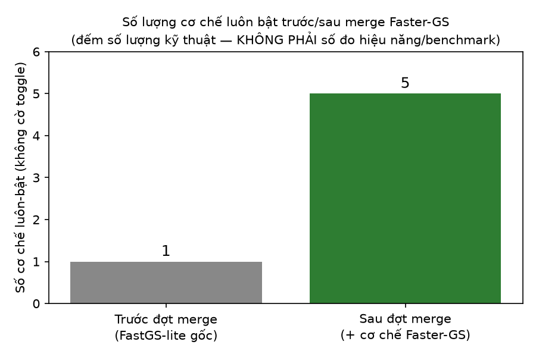

# Digital Twin GS: Sách hợp nhất toàn tập

## Lời nói đầu

Cuốn sách này là bản **hợp nhất toàn bộ** nội dung của thư mục `DOCS/` trong repo `digital-twin-gs` — trước đây gồm khoảng 30 file Markdown rời rạc nằm ở nhiều cấp thư mục (`DOCS/`, `DOCS/Report/`, `DOCS/Report/test/`). Mục tiêu là gộp lại thành một mạch đọc liền lạc, chia thành **15 chương**, mỗi chương một file, để người đọc — kể cả người chưa quen với repo — có thể đi từ tổng quan dự án, xuống tới từng dòng code, rồi tới nền tảng toán học 3D Gaussian Splatting và các đòn bẩy tăng tốc densify/prune áp dụng lên đó, mà không phải tự lần theo hàng chục link chéo.

**Không nội dung nào bị lược bỏ.** Mỗi chương ghi rõ ở đầu file nó lấy nguyên văn từ (những) file nào trong `DOCS/` gốc — dùng để truy vết ngược khi cần đối chiếu với bản gốc hoặc với mã nguồn. Khi hai nguồn có nội dung trùng lặp (ví dụ phần lý thuyết trong `Report/` và tài liệu gốc `fastgs-acceleration-method.md`), sách giữ **cả hai**, chỉ ghi chú để người đọc hiểu vì sao thấy lặp.

Công thức toán (LaTeX), bảng, code block, sơ đồ Mermaid và ảnh minh hoạ đều được giữ nguyên; chỉ có đường dẫn ảnh tương đối được sửa lại cho khớp vị trí file mới trong `DOCS/BOOK/`.

## Mục lục

| # | Chương | Nội dung chính |
|---|---|---|
| 1 | [Giới thiệu & Tổng quan dự án](01-gioi-thieu-tong-quan.md) | Bản đồ tài liệu, gói `pipeline/`, `Config`, hợp đồng `submission.zip` |
| 2 | [Kiến trúc Pipeline toàn hệ thống — Phần 1 (§1–§18)](02-kien-truc-pipeline-phan-1.md) | Hai đường chạy CLI/notebook, bản đồ hệ thống, toàn bộ cờ CLI, dựng `Scene` từ COLMAP, khởi tạo `GaussianModel` |
| 3 | [Vòng lặp huấn luyện chi tiết — Phần 2 (§19–§33)](03-vong-lap-huan-luyen-phan-2.md) | `render_fastgs` (tên hàm giữ nguyên trong code) + compact box, rasterizer CUDA, loss, backward, điểm số đa góc nhìn, densify/prune, Adam |
| 4 | [Lưu, Render, Chấm điểm & Vận hành — Phần 3 (§34–§48)](04-luu-render-cham-diem-phan-3.md) | Lưu `.ply`, render, chấm điểm, `submission.zip`, bảng hằng số, chẩn đoán sự cố, thuật ngữ |
| 5 | [Ký hiệu & Nền tảng toán học chung](05-ky-hieu-nen-tang-toan-hoc.md) | Sơ đồ pipeline 3DGS, bảng ký hiệu $\theta_i,\mu_i,\Sigma_i,\ldots$, hằng số hệ thống |
| 6 | [Initialization — Từ SfM Points đến Gaussian khởi tạo](06-initialization.md) | `create_from_pcd`, `extent`, cảnh đồ chơi dùng chung, kiểm định số chương 1 |
| 7 | [Biểu diễn 3D Gaussians](07-3d-gaussians.md) | $\Sigma=RSS^\top R^\top$, $G(x)$, SH color, kiểm định số chương 2 |
| 8 | [Projection & Compact Box (đòn bẩy giảm K)](08-projection-compact-box.md) | EWA splatting, compact box, `box.md`/`box2.md`, kiểm định số chương 3 |
| 9 | [Differentiable Tile Rasterizer](09-differentiable-tile-rasterizer.md) | Alpha-blending, transmittance, sort theo khoá 64-bit, kiểm định số chương 4 |
| 10 | [Từ Ảnh đến Loss & Metrics](10-anh-den-loss-metrics.md) | L1, SSIM, PSNR, Score tổng hợp, kiểm định số chương 5 |
| 11 | [Gradient Flow & Backpropagation](11-gradient-flow-backprop.md) | $\partial C/\partial\alpha_n$, gradient tuyệt đối, Adam, lr schedule, kiểm định số chương 6 |
| 12 | [Adaptive Density Control (đòn bẩy giảm N)](12-adaptive-density-control.md) | Importance/Pruning score, densify AND, prune multinomial, ví dụ số end-to-end |
| 13 | [Quy trình huấn luyện & Mô hình chi phí SAD-GS](13-tong-hop-chi-phi-sadgs.md) | `run_train.sh` (4 cấu hình dataset), `full_eval.py` không khớp `train.py`, tham số chi phí $N$/$K$ của SAD-GS, không có số benchmark thật |
| 14 | [Triển khai thực tế: Cài đặt & chạy SAD-GS](14-trien-khai-colab-nhat-ky-train.md) | Cài đặt conda (đối chiếu `environment.yml` vs README), bố cục dataset, chạy `run_train.sh`, chưa có nhật ký train thật |
| 15 | [Phụ lục: Tài nguyên & trạng thái kiểm định của `SADGS/`](15-phu-luc-kiem-dinh-tai-nguyen.md) | Trạng thái kiểm định 5 cơ chế Chương 17, tài nguyên tĩnh (`static/`, submodule, `full_eval.py`), chương nào 6–12 vẫn áp dụng nguyên vẹn |
| 16 | [Bài toán lớn: Từ COLMAP đến `.ply` render 3D](16-bai-toan-lon-de-bai.md) | Một đề bài duy nhất gộp chương 6–13 (input COLMAP thật) + [lời giải 8 phần, ~30 000 dòng](16-loi-giai/00-muc-luc-loi-giai.md), tính tay đến file `.ply` render được |
| 17 | [SAD-GS: Structure-Aware Densification (so với 3DGS gốc)](17-sadgs-structure-aware-densification.md) | Structure tensor Di Zenzo, $\eta$ = extent/bước sóng texture, multiview high/low ratio, anisotropic split $(k_x,k_y,k_z)$, trạng thái port vào codebase chính |
| 18 | [SADGS: Cơ chế chuyên sâu (10 mục, 82 hình matplotlib)](18-sadgs-co-che-chuyen-sau/00-muc-luc.md) | Mở từng hàm SADGS ra đọc: structure tensor → $\eta$ → thống kê đa view → split dị hướng / clone / prune → optimizer, 3D filter, loss, rasterizer riêng, siêu tham số, pipeline đầu-cuối. Mỗi công thức kèm một hình sinh từ chính công thức đó. |

## Nguồn tài liệu gốc

Toàn bộ nội dung trên được hợp nhất từ các file sau trong `DOCS/` (đường dẫn tính từ gốc `digital-twin-gs/`):

- `DOCS/README.md`
- `DOCS/pipeline-and-submission.md`
- `DOCS/DIGITAL-TWIN-GS-PIPELINE-1.md`
- `DOCS/DIGITAL-TWIN-GS-PIPELINE-2.md`
- `DOCS/DIGITAL-TWIN-GS-PIPELINE-3.md`
- `DOCS/fastgs-acceleration-method.md`
- `DOCS/3.md`
- `DOCS/box.md`
- `DOCS/box2.md`
- `DOCS/colab-t4-guide.md`
- `DOCS/history-train.md`
- `DOCS/test.html`
- `DOCS/assets/history.csv`
- `DOCS/assets/leaderboard.csv`
- `DOCS/Report/README.md`
- `DOCS/Report/00-ky-hieu.md`
- `DOCS/Report/01-initialization.md`
- `DOCS/Report/02-3d-gaussians.md`
- `DOCS/Report/03-projection.md`
- `DOCS/Report/04-rasterizer.md`
- `DOCS/Report/05-image-loss.md`
- `DOCS/Report/06-gradient-flow.md`
- `DOCS/Report/07-adaptive-density-control.md`
- `DOCS/Report/08-tong-hop.md`
- `DOCS/Report/test/README.md`
- `DOCS/Report/test/00-scene.md`
- `DOCS/Report/test/01-test.md` … `08-test.md` (8 file)
- `DOCS/Report/test/scripts/ch01_test.py` … `ch08_test.py`, `ch01_plot.py` … `ch08_plot.py` (16 file, liệt kê ở Chương 15)

Ảnh minh hoạ giữ nguyên từ `DOCS/assets/`, `DOCS/Report/assets/`, `DOCS/Report/test/figures/`.

## Cập nhật: tích hợp cơ chế từ Faster-GS

Bên cạnh cơ chế densify/prune chính kế thừa từ 3DGS gốc (xem Chương 12), repo giờ tích hợp thêm một số cơ chế của **Faster-GS** (Hahlbohm et al., *"Faster-GS: Analyzing and Improving Gaussian Splatting Optimization"*, CVPR 2026), áp dụng trực tiếp trên code hiện có thay vì đổi sang CUDA backend riêng của họ (lý do: backend đó không trả về `radii`/`viewspace_points` mà thuật toán densify hiện dùng cần — xem Chương 12).

**Luôn bật, không còn cờ bật/tắt:**
- **Fused Adam** — kernel CUDA elementwise tự viết (`adam_fused.cu`), thay `torch.optim.Adam`.
- **3D anti-aliasing filter** (kiểu Mip-Splatting) — clamp scale theo tần số lấy mẫu camera.
- **Random-init fallback** — sinh point cloud ngẫu nhiên (có carving) khi COLMAP không có `points3D`.

**Cập nhật:** đã có số liệu thật (scene cuộc thi HCM0539, 30 000 vòng, Colab T4) — Score 0.8579, PSNR 25.27, SSIM 0.866, LPIPS 0.136, 344K Gaussian, VRAM đỉnh 1.92 GB/14.56 GB; nhật ký phiên train ở [Chương 14](14-trien-khai-colab-nhat-ky-train.md). (Chương so sánh định lượng 3DGS vanilla/FasterGS chưa có file riêng — số 17 nay dùng cho [SAD-GS](17-sadgs-structure-aware-densification.md), so sánh trực tiếp với 3DGS gốc.)

---

[Bắt đầu đọc — Chương 1 →](01-gioi-thieu-tong-quan.md)
