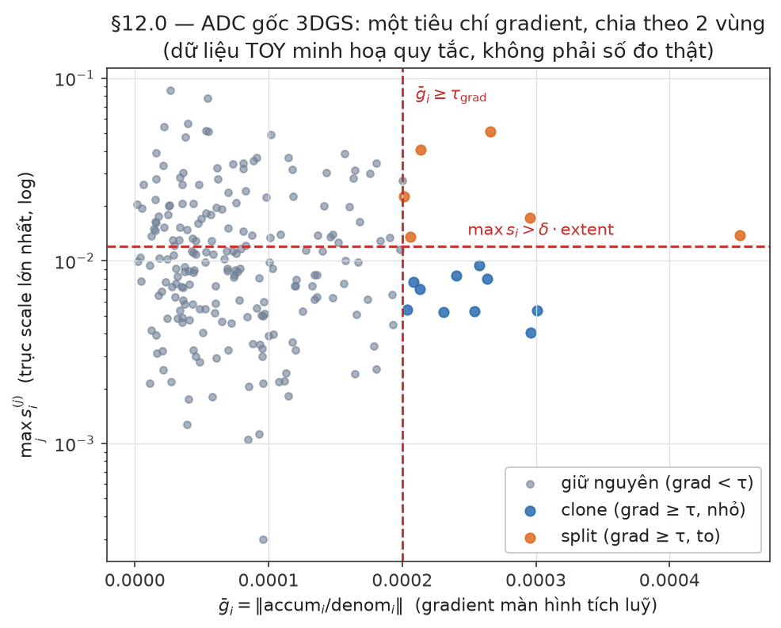
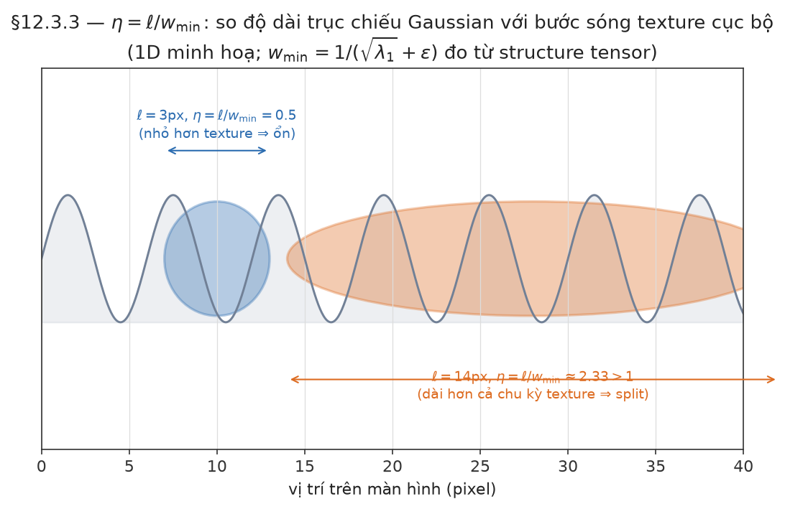
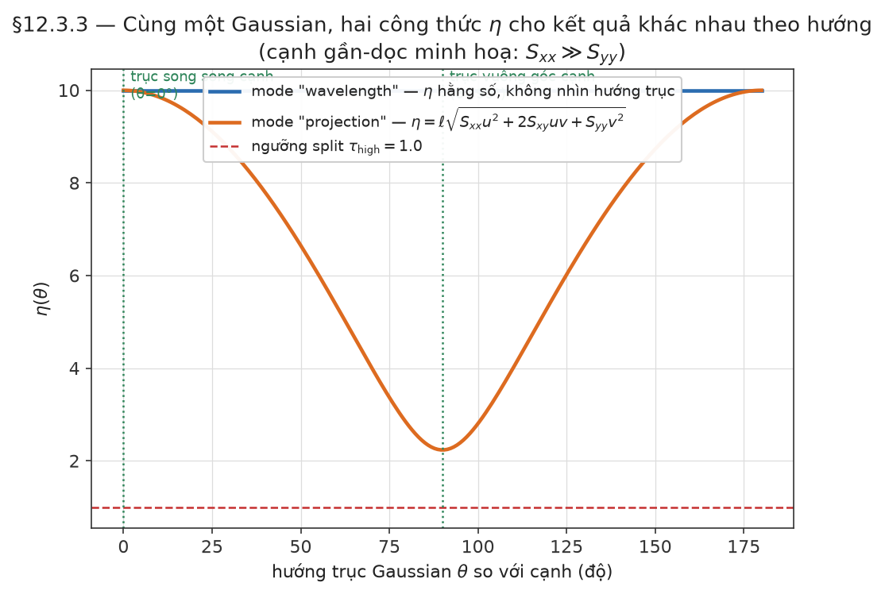
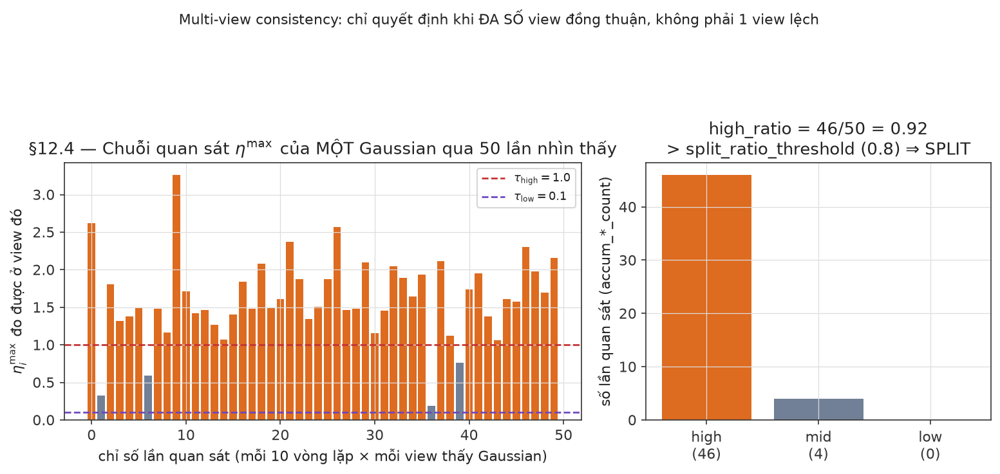
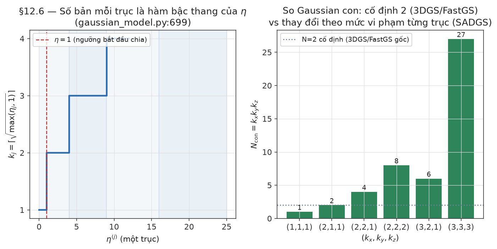
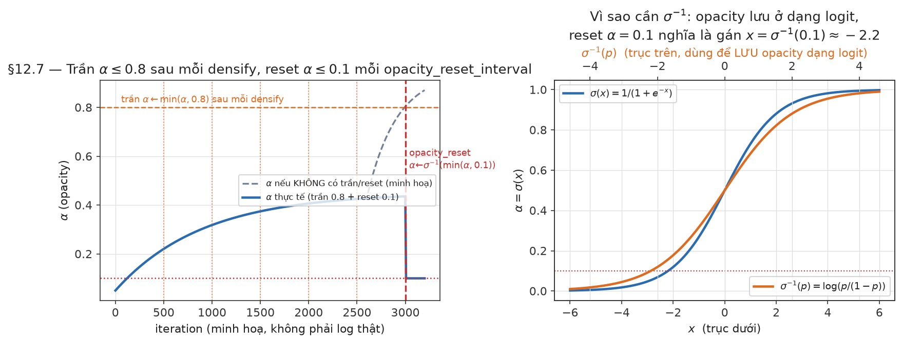
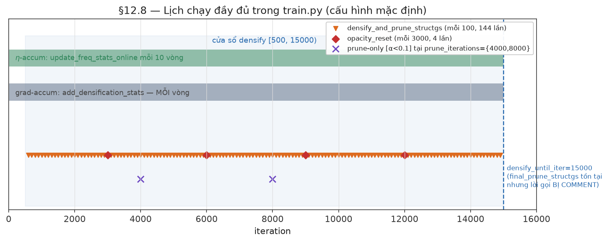
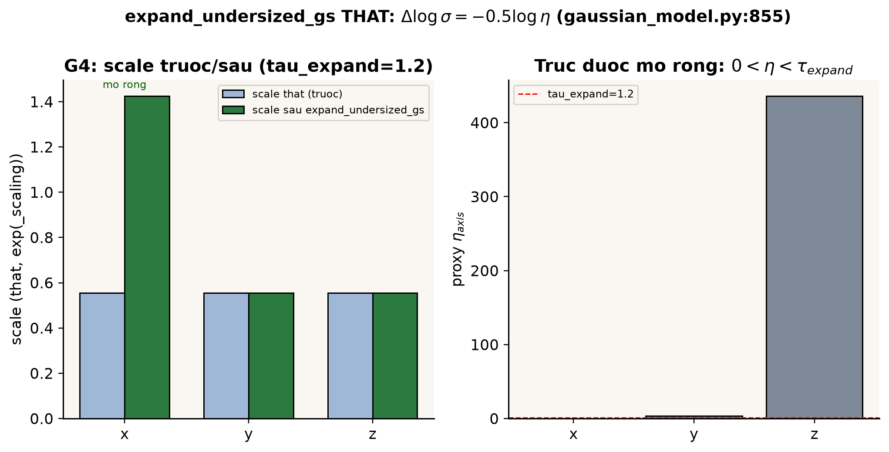

[← Mục lục](00-muc-luc.md) · Chương 12/15

# Chương 12 — Structure-Aware Density Control (SADGS)

> Nguồn: `SADGS/train.py:154-419`, `SADGS/scene/gaussian_model.py` (`densify_and_split_structgs`, `densify_and_clone_structgs`, `densify_and_prune_structgs`, `expand_undersized_gs`, `add_densification_stats`, `final_prune_structgs`), `SADGS/utils/freq_utils.py` (`update_freq_stats_online`, `compute_projected_axes_subset`, `sampling_cameras`), `SADGS/utils/loss_utils.py` (`get_multiscale_structure_tensor_v1`, `get_multiscale_structure_tensor_v2`), `SADGS/arguments/__init__.py`.
>
> Bài báo gốc: "Faster 3D Gaussian Splatting Convergence via Structure-Aware Densification" (SIGGRAPH 2026, Lyu et al., MPI Informatik). SADGS **kế thừa** 3DGS (Kerbl 2023) và bộ khung train/densify chung của dòng Gaussian Splatting, nhưng **thay hẳn** tiêu chí "khi nào clone/split/prune" bằng một phép so khớp trực tiếp giữa kích thước màn hình của từng Gaussian và cấu trúc ảnh đa tỉ lệ (multiscale image structure) tại đúng vị trí Gaussian đó chiếu lên, đo qua nhiều view (multi-view consistency) thay vì đo qua loss màu.

Chương này **thay thế hoàn toàn** nội dung "Importance score / Pruning score kiểu đếm pixel lỗi màu" của bản DOCS trước — cơ chế đó (đếm pixel lỗi màu trong footprint, `compute_gaussian_score_fastgs`, `utils/fast_utils.py`) **không tồn tại trong SADGS**. Tên hàm, tên tham số, và công thức dưới đây được đối chiếu trực tiếp với mã nguồn `SADGS/`.

| Phần | Nội dung |
|---|---|
| 12.0 | ADC của 3DGS gốc (Kerbl 2023) — nền để so sánh |
| 12.1 | Bức tranh tổng thể: vì sao SADGS đổi tiêu chí densify |
| 12.2 | Structure tensor đa tỉ lệ — "bản đồ tần số cục bộ" của ảnh GT |
| 12.3 | $\eta$ — tỉ số kích thước Gaussian / bước sóng texture cục bộ |
| 12.4 | Multi-view consistency — high/mid/low count, ngưỡng split/prune |
| 12.5 | `densify_and_prune_structgs` — hợp nhất gradient + $\eta$ + kích thước |
| 12.6 | Split dị hướng (anisotropic, đa trục) — công thức $k=\lceil\sqrt{\eta}\rceil$ |
| 12.7 | Clone, opacity cap, opacity reset, prune, final prune (multi-view) |
| 12.8 | Lịch chạy đầy đủ trong `train.py` |
| 12.9 | Tham số — bảng đối chiếu code, cái nào **đang chạy** và cái nào **chết (dead code)** |
| 12.10 | So sánh 3DGS gốc ↔ SADGS |

---

## 12.0 ADC của 3DGS gốc — nền để so sánh

3DGS gốc (Kerbl 2023, `densify_and_split`/`densify_and_clone`/`densify_and_prune` trong `scene/gaussian_model.py`, các hàm này **vẫn còn nguyên** trong `SADGS/scene/gaussian_model.py` làm fallback) dùng một tiêu chí densify duy nhất: độ lớn gradient vị trí màn hình tích luỹ qua nhiều vòng lặp.

$$
\boxed{\ \bar g_i=\Bigl\lVert\frac{\text{accum}_i}{\text{denom}_i}\Bigr\rVert,\qquad
\text{clone}_i=[\bar g_i\ge\tau_{\text{grad}}]\wedge[\max s_i\le\delta\cdot\text{extent}],\qquad
\text{split}_i=[\bar g_i\ge\tau_{\text{grad}}]\wedge[\max s_i>\delta\cdot\text{extent}]\ }
$$



*Dữ liệu TOY (không phải log train thật) minh hoạ đúng công thức trên: trục ngang là $\bar g_i$, trục dọc (log) là $\max_j s_i^{(j)}$. Đường đỏ đứng là ngưỡng $\tau_{\text{grad}}$, đường đỏ ngang là $\delta\cdot\text{extent}$ — bốn góc phần tư tương ứng đúng bốn nhánh: giữ nguyên / clone / split / (góc trống, không xảy ra vì điều kiện gradient là AND bắt buộc trước).*

Split luôn chia đúng **2** bản trên trục dài nhất (`densify_and_split(..., N=2)`), bất kể Gaussian bị méo bao nhiêu trục, bất kể texture bên dưới có tần số cao hay thấp. Đây chính là chỗ SADGS can thiệp: gradient màn hình chỉ nói "vùng này còn sai", không nói "Gaussian này có đang **quá to so với chi tiết ảnh thật** hay không, và theo **trục nào**".

Prune cứng của 3DGS gốc: $\alpha_i<0.005$ hoặc (sau `opacity_reset_interval` đầu tiên) `max_radii2D` > ngưỡng màn hình hoặc scale thế giới > $0.1\times$extent — SADGS giữ nguyên phần này (xem 12.7).

---

## 12.1 Bức tranh tổng thể — vì sao SADGS đổi tiêu chí densify

Ba nhược điểm của $N_0$ Gaussian khởi tạo (chương 6) không đổi so với 3DGS gốc: thưa ở vùng thiếu texture (cần **clone**), sai kích thước ở vùng chi tiết cao (cần **split**), thừa/không đóng góp (cần **prune**). Cái đổi là *cách đo* "sai kích thước":

| Cách đo "Gaussian có đang sai kích thước không?" | 3DGS gốc | **SADGS** |
|---|---|---|
| Tín hiệu | gradient màn hình $\bar g$ | **so khớp screen-space extent của Gaussian với bước sóng texture cục bộ $\eta$** (bổ sung trên nền gradient) |
| Biết texture bên dưới mịn hay chi tiết? | không | **có** — đọc trực tiếp structure tensor của ảnh GT |
| Hướng chia khi split | luôn trục dài nhất, hệ số cố định $N=2$ | **dị hướng theo 3 trục độc lập**, số bản mỗi trục $k=\lceil\sqrt{\eta_{\text{trục}}}\rceil$ |
| Bằng chứng cần bao nhiêu view? | 1 vòng lặp = 1 view | **tích luỹ tỉ lệ view "nhất quán cao/thấp"** trong cả cửa sổ densify (nhiều vòng × nhiều view) |

$N$ vẫn là đòn bẩy chi phí y hệt chương 13 ($T_{\text{iter}}\approx aN+bNK+cN$). Điều SADGS nhắm tới không phải "giảm $N$ tối đa" mà **đặt Gaussian đúng kích thước ngay từ lần split đầu** để hội tụ nhanh hơn — tên bài báo là "Faster Convergence", không phải "Fewer Gaussians".

---

## 12.2 Structure tensor đa tỉ lệ — bản đồ tần số cục bộ của ảnh GT

Trước vòng lặp train (`train.py:160-200`), SADGS tính trước — **một lần**, không phải mỗi vòng lặp — một structure tensor đa tỉ lệ cho **từng ảnh train**, cache theo tên ảnh trong `structure_tensor_cache`:

```python
# train.py:186-194
if opt.st_mode == "v1":
    st_batch = get_multiscale_structure_tensor_v1(img_batch, levels=opt.st_levels)
elif opt.st_mode == "v2":
    st_batch = get_multiscale_structure_tensor_v2(img_batch, levels=opt.st_levels)
structure_tensor_cache[cam.image_name] = st_map   # [1, 3, H, W] = (Sxx, Sxy, Syy)
```

Với mỗi pixel $x$, structure tensor cổ điển là

$$
\boxed{\ S(x)=\begin{pmatrix}S_{xx}&S_{xy}\\S_{xy}&S_{yy}\end{pmatrix},\qquad
S_{xx}=I_x^2*G_\rho,\ S_{xy}=I_xI_y*G_\rho,\ S_{yy}=I_y^2*G_\rho\ }
$$

nhưng SADGS không dừng ở một scale. Với `st_levels` mức octave ($\text{octave\_step}=1.5$), mỗi mức $i$ đo **năng lượng dải tần** bằng hiệu hai ảnh Gauss-blur liên tiếp (Difference-of-Gaussians):

$$
\text{band}_i=\bigl\lVert I_{\sigma_{i-1}}-I_{\sigma_i}\bigr\rVert_2,\qquad \sigma_i=\sigma_0\cdot 1.5^{\,i},\qquad \text{freq}_i=1/1.5^{\,i}
$$

rồi cộng dồn có trọng số theo năng lượng dải tần (`weight_i = band_response**power_factor`, `power_factor=3.0`), quy đổi mỗi mức về "trace $=\text{freq}^2$" trước khi gộp:

$$
\boxed{\ S(x)=\frac{\sum_i \text{weight}_i(x)\cdot\text{freq}_i^2\cdot \hat S_i(x)}{\sum_i \text{weight}_i(x)}\ },\qquad
\hat S_i=\frac{S_i}{\operatorname{tr}S_i}\ \text{(chuẩn hoá — chỉ giữ hướng)}
$$

`v1` blur trực tiếp cặp $(S_{xx},S_{xy},S_{yy})$ tính ở scale gốc để lấy hướng tại từng octave; `v2` tính lại structure tensor **trên ảnh đã blur** ở mỗi octave (đắt hơn nhưng đúng về mặt tần số ở mỗi scale). Cả hai chọn qua `st_mode` (`"v1"` mặc định, `"v2"` là lựa chọn thay thế).

**Ý nghĩa vật lý**: trace$(S(x))=S_{xx}+S_{yy}$ tại một pixel lớn ⇔ vùng đó có cạnh/chi tiết tần số cao (texture "dày"); nhỏ ⇔ vùng phẳng, ít chi tiết (tần số thấp). Eigenvector lớn của $S(x)$ chỉ hướng vuông góc với cạnh mạnh nhất.

---

## 12.3 $\eta$ — tỉ số kích thước Gaussian / bước sóng texture cục bộ

Mỗi 10 vòng lặp (`iteration % 10 == 0`, không phải mỗi vòng), với mỗi view vừa render, `update_freq_stats_online` (`utils/freq_utils.py:181`) tính $\eta$ cho từng Gaussian **thấy được và đang hoạt động** trong view đó.

### 12.3.1 Lọc "đang hoạt động" trước khi tính $\eta$

$$
\boxed{\ \text{active}_i = [\,T_i>\tau_{\text{trans}}\,]\wedge[\,\alpha_i>\tau_{\text{opac}}\,]\wedge[\,\lVert\nabla_{\text{viewspace}}\mu'_i\rVert_{xy}>\tau_{\text{grad}}\,]\ }
$$

với $T_i$ = transmittance tối đa mà Gaussian đóng góp (đọc từ cột 6 của `cov2D` trả về bởi rasterizer), $\tau_{\text{trans}}=$ `freq_transmittance_threshold` (mặc định $0$), $\tau_{\text{opac}}=$ `freq_opacity_threshold` ($0.05$), $\tau_{\text{grad}}=$ `freq_grad_threshold` ($2\times10^{-5}$). Ba điều kiện AND: Gaussian trong suốt, mờ, hoặc không còn gradient (đã hội tụ tốt ở view này) thì **không tốn chi phí tính $\eta$** cho nó ở view này.

### 12.3.2 Lấy mẫu structure tensor tại đúng vị trí Gaussian chiếu lên

Thay vì chỉ đọc $S$ tại tâm chiếu $\mu'_i$, SADGS lấy mẫu **ngẫu nhiên một điểm bên trong ellipse 1σ** của Gaussian bằng phân rã Cholesky của hiệp phương sai 2D $(\Sigma'_{xx},\Sigma'_{xy},\Sigma'_{yy})$ (cũng đọc từ `cov2D`):

$$
L_{11}=\sqrt{\Sigma'_{xx}},\quad L_{21}=\Sigma'_{xy}/L_{11},\quad L_{22}=\sqrt{\Sigma'_{yy}-L_{21}^2},\qquad
\begin{pmatrix}\delta x\\\delta y\end{pmatrix}=\begin{pmatrix}L_{11}&0\\L_{21}&L_{22}\end{pmatrix}\begin{pmatrix}\epsilon_1\\\epsilon_2\end{pmatrix},\ \epsilon\sim\mathcal N(0,1)
$$

rồi `grid_sample` song tuyến tính $S$ tại $\mu'_i+(\delta x,\delta y)$. Lý do jitter thay vì lấy tâm cố định: nếu Gaussian nằm đúng lên một cạnh, giá trị $S$ tại tâm có thể lệch pha với vùng nó thực sự phủ; lấy mẫu ngẫu nhiên trong footprint cho một ước lượng không thiên vị qua nhiều vòng lặp/nhiều view.

### 12.3.3 Chiều dài trục chiếu và hai chế độ tính $\eta$ (`eta_compute_mode`)

Ba trục 3D của Gaussian ($\propto$ scale $\times$ hướng rotation) được chiếu lên màn hình qua Jacobian phối cảnh $J$ (`compute_projected_axes_subset`, `utils/freq_utils.py:116`):

$$
J=\begin{pmatrix}f_x/z&0&-f_x x/z^2\\0&f_y/z&-f_y y/z^2\end{pmatrix},\qquad
\text{axis}^{(j)}_{2D}=J\cdot R_{\text{view}}R_i\, e^{(j)}s_i^{(j)},\quad j=1,2,3
$$

cho chiều dài trục $j$ trên màn hình $\ell_j=\lVert\text{axis}^{(j)}_{2D}\rVert$ (đơn vị pixel).

**Mode `"wavelength"` (mặc định, `eta_compute_mode="wavelength"`)** — so trực tiếp chiều dài trục với "bước sóng" texture cục bộ:

$$
\boxed{\ \lambda_1=\frac{\operatorname{tr}S}{2}+\sqrt{\Bigl(\frac{\operatorname{tr}S}{2}\Bigr)^2-\det S},\qquad
w_{\min}=\frac{1}{\sqrt{\lambda_1}+\varepsilon},\qquad
\eta^{(j)}=\frac{\ell_j}{w_{\min}}\ }
$$

$\lambda_1$ là trị riêng lớn nhất của $S$ (năng lượng tần số cao nhất tại điểm đó); $w_{\min}\propto1/\sqrt{\lambda_1}$ là bước sóng (pixel) của chi tiết mịn nhất ở đó. $\eta^{(j)}>1$ nghĩa là **trục $j$ của Gaussian dài hơn cả một chu kỳ texture** — Gaussian đang làm mờ chi tiết (aliasing/undersampling theo trục đó); $\eta^{(j)}<1$ nghĩa là Gaussian còn nhỏ hơn cả nét texture, có thể clone/gộp.



*Hình 1D hoá công thức $\eta=\ell/w_{\min}$: Gaussian xanh có trục ngắn hơn một chu kỳ texture ($\eta<1$, ổn); Gaussian cam dài hơn hẳn một chu kỳ ($\eta>1$, cần split theo trục đó). $w_{\min}$ chính là "độ dài một chu kỳ" của vân sin minh hoạ.*

**Mode `"projection"`** (lựa chọn thay thế) — chiếu trực tiếp dạng toàn phương của $S$ lên hướng từng trục thay vì dùng trị riêng vô hướng:

$$
\boxed{\ \eta^{(j)}=\sqrt{S_{xx}u_j^2+2S_{xy}u_jv_j+S_{yy}v_j^2}\ },\qquad (u_j,v_j)=\text{axis}^{(j)}_{2D}
$$

nhạy hướng hơn: một Gaussian dài dọc theo một cạnh (trục song song cạnh) có $\eta$ thấp dù trục kia có $\eta$ cao, đúng bản chất dị hướng của anisotropic split (12.6) — trong khi `"wavelength"` chỉ dùng $\lambda_1$ vô hướng, không phân biệt hướng trục so với hướng cạnh.



*Cùng một cạnh gần-dọc ($S_{xx}\gg S_{yy}$), quay trục Gaussian từ 0° (song song cạnh) tới 90° (vuông góc cạnh): mode `"wavelength"` (xanh) cho $\eta$ hằng số bất kể hướng — không phân biệt được trục nào thực sự "cắt ngang" cạnh; mode `"projection"` (cam) giảm mạnh khi trục song song cạnh, đúng trực giác "trục nằm dọc cạnh thì không làm mờ cạnh".*

Kết quả nhân với `weights_valid` (hiện luôn $=1$, chỗ dành cho trọng số transmittance trong tương lai), cho $\eta_i\in\mathbb R^3$ (một giá trị mỗi trục).

### 12.3.4 Tích luỹ qua nhiều vòng/nhiều view

```python
# freq_utils.py:382-392
eta_total = eta_3ch.sum(dim=1)
gaussians.accum_eta[valid]        += eta_total
gaussians.accum_view_count[valid] += 1.0
gaussians.max_eta_3ch[valid] = torch.max(gaussians.max_eta_3ch[valid], eta_3ch)   # max theo từng trục, qua các view
```

`max_eta_3ch` — trị **lớn nhất** từng trục quan sát được qua toàn bộ view/vòng lặp trong cửa sổ densify hiện tại — chính là tín hiệu dùng để **dẫn hướng split dị hướng** ở 12.6 (không phải trung bình: một Gaussian chỉ cần *một* view chứng minh nó quá to theo một trục là đủ căn cứ để split trục đó).

---

## 12.4 Multi-view consistency — đếm high/mid/low, tỉ lệ split/prune

Mỗi lần quan sát ($\eta^{(j)}_i$ tính được ở một view), SADGS phân loại theo trị lớn nhất trong 3 trục:

$$
\boxed{\ \eta^{\max}_i=\max_j\eta^{(j)}_i,\qquad
\text{high}\!:\eta^{\max}_i>1.0,\quad
\text{low}\!:\eta^{\max}_i\le0.1,\quad
\text{mid}\!:\text{ngược lại}\ }
$$

(`TAU_HIGH=1.0`, `TAU_LOW=0.1`, hard-code trong `freq_utils.py:395-396` — không phải tham số `arguments`). Bộ đếm `eta_high_count`, `eta_mid_count`, `eta_low_count` tích luỹ qua **mọi view và mọi vòng lặp** kể từ lần densify trước; `eta_high_sum_3ch`, `eta_mid_sum_3ch` cộng dồn $\eta_3\text{ch}$ tương ứng để tính trung bình khi cần.



*Toy: một Gaussian được quan sát 50 lần, $\eta^{\max}$ đo mỗi lần vẽ theo màu phân loại (cam=high, xám=mid, xanh=low). Panel phải cộng dồn thành `eta_high_count`/`eta_mid_count`/`eta_low_count`, từ đó `high_ratio=46/50=0.92>0.8` ⇒ Gaussian này đủ điều kiện vào `split_mask`.*

**Đây là "multi-view reconstruction consistency"**: một Gaussian chỉ bị coi là "thực sự quá to" (đáng split) nếu nó bị đo là quá to **ở phần lớn các view nó xuất hiện**, không phải chỉ một góc nhìn ngẫu nhiên — khử nhiễu do occlusion, góc chiếu, hoặc structure tensor bị méo ở một view riêng lẻ.

Tỉ lệ dùng để ra quyết định (`train.py:337-353`):

$$
\boxed{\ \text{high\_ratio}_i=\frac{\text{eta\_high\_count}_i}{\text{accum\_view\_count}_i},\qquad
\text{low\_ratio}_i=\frac{\text{eta\_low\_count}_i}{\text{accum\_view\_count}_i}\ }
$$

$$
\boxed{\ \text{split\_mask}_i=[\text{high\_ratio}_i>\texttt{split\_ratio\_threshold}]\wedge[\lVert\bar g_i\rVert\ge10^{-5}]\ ,\qquad
\text{prune\_mask}_i=[\text{low\_ratio}_i>\texttt{prune\_ratio\_threshold}]\ }
$$

Mặc định `split_ratio_threshold = prune_ratio_threshold = 0.8`: cần **≥80% số lần quan sát** rơi vào nhóm high (hay low) mới được đưa vào ứng viên split (hay prune) do tiêu chí cấu trúc. Điều kiện gradient phụ `is_grad_high` (ngưỡng $10^{-5}$, hard-code, khác `densify_grad_threshold=2\times10^{-4}$ của nhánh 3DGS gốc) đảm bảo Gaussian còn đang được tối ưu tích cực mới bị split theo cấu trúc — tránh split những vùng đã bão hoà gradient.

---

## 12.5 `densify_and_prune_structgs` — hợp nhất gradient + $\eta$ + kích thước

Đây là hàm trung tâm (`scene/gaussian_model.py:957`), gọi mỗi `densification_interval` (mặc định 100) vòng, từ `densify_from_iter=500` đến `densify_until_iter=15000`. Nó nhận `custom_split_mask`/`custom_prune_mask` (chính là `split_mask`/`prune_mask` của 12.4) và `max_eta_3ch` (12.3.4) từ `train.py`, cộng thêm tiêu chí gradient truyền thống:

```python
# gaussian_model.py:964-1002 (rút gọn)
grad_vars  = xyz_gradient_accum     / denom     # gradient có dấu (dùng cho clone)
grads_abs  = xyz_gradient_accum_abs / denom     # gradient trị tuyệt đối (dùng cho split)
grad_qualifiers     = norm(grad_vars) >= args.grad_thresh       # 2e-4
grad_qualifiers_abs = norm(grads_abs) >= args.grad_abs_thresh   # 2e-4

clone_qualifiers = max(scaling) <= args.dense * extent   # dense = percent_dense-like, 0.001
split_qualifiers = max(scaling) >  args.dense * extent

final_split_mask = (full_split_mask | grad_qualifiers_abs) & split_qualifiers
final_clone_mask = (full_split_mask | grad_qualifiers)     & clone_qualifiers
```

trong đó `full_split_mask` = `custom_split_mask` đặt vào đúng vị trí Gaussian (`viewspace_points_indices`, hiện luôn `None` nên là gán trực tiếp toàn cục). Nghĩa là: một Gaussian đủ điều kiện **split** nếu (đã to hơn ngưỡng `dense*extent`) **và** (gradient tuyệt đối cao **hoặc** multi-view $\eta$ xác nhận nó vi phạm cấu trúc — 12.4); tương tự cho **clone** với gradient có dấu.

$$
\boxed{\ \text{metric\_mask}=\bigl[\text{importance\_score}>\texttt{importance\_score\_threshold}\bigr]\ }
$$

với `importance_score` được `train.py` truyền vào **chính là `accum_view_count`** — số lần Gaussian được quan sát "đang hoạt động" (12.3.1) trong cửa sổ densify. Ngưỡng mặc định `importance_score_threshold=0.5` ⇒ trong thực tế lọc gần như mọi Gaussian có $\ge1$ lần quan sát hợp lệ (một AND "mềm" so với việc lọc trực tiếp theo lỗi màu — SADGS đặt phần lọc "đáng tin cậy" chủ yếu ở tỉ lệ high/low 12.4, không ở số lượt quan sát thô).

`combined_split_mask = metric_mask & final_split_mask` được truyền vào `densify_and_split_structgs` cùng `max_eta_3ch` để chia **dị hướng** (12.6); `densify_and_clone_structgs(metric_mask, final_clone_mask)` sao y nguyên bản (như 3DGS gốc, không phụ thuộc $\eta$).

---

## 12.6 Split dị hướng (anisotropic, đa trục) — $k=\lceil\sqrt{\eta}\rceil$

Đây là khác biệt hình học cốt lõi so với 3DGS gốc: thay vì luôn cắt 2 mảnh trên trục dài nhất, `densify_and_split_structgs` (`gaussian_model.py:638`) tính **số bản độc lập theo từng trục** dựa trên lý thuyết lấy mẫu (Nyquist).

**Lý thuyết**: $\eta^{(j)}=(\sigma^{(j)}\omega_{\max})^2$-kiểu tỉ số năng lượng tần số/kích thước (12.3.3 đã tuyến tính hoá thành $\ell/w$). Để hết vi phạm Nyquist trên trục $j$, cần giảm $\sigma^{(j)}$ đi hệ số $k_j$ sao cho $\sigma^{(j)}/k_j$ đủ nhỏ — vì $\eta\propto\sigma^2$ trong công thức gốc dạng năng lượng, điều kiện $\eta/k_j^2\le1$ cho:

$$
\boxed{\ k_j=\Bigl\lceil\sqrt{\eta^{(j)}}\Bigr\rceil,\qquad k_j\ge1\ }
$$

(code lấy `ceil(sqrt(clamp(eta, min=1.0)))`, tức $\eta<1$ cho $k_j=1$ — không chia trục đó). Nếu không có `max_eta_3ch` (fallback gradient thuần), $k$ được đặt $=2$ trên đúng trục scale lớn nhất, các trục còn lại $=1$ — tái hiện hành vi split 2 mảnh của 3DGS gốc.



*Trái: $k_j$ nhảy bậc tại $\eta=1,4,9,16,\dots$ ($k=\lceil\sqrt{\eta}\rceil$) — $\eta$ càng lớn thì cần càng nhiều bản để mỗi bản con đủ nhỏ. Phải: vì $N_{\text{con}}=k_xk_yk_z$ nhân ba trục độc lập, một Gaussian vi phạm nặng cả 3 trục ($k=(3,3,3)$) có thể sinh **27** bản con chỉ trong một lần split — so với đúng 2 bản cố định của 3DGS gốc (đường chấm xám).*

Số Gaussian con của một Gaussian cha:

$$
\boxed{\ N_{\text{con}}=k_x\cdot k_y\cdot k_z\ },\qquad \Delta N = N_{\text{con}}-1\ \text{(cha bị xoá)}
$$

Mỗi con đặt trên một lưới $k_x\times k_y\times k_z$ đều trong không gian cục bộ của Gaussian cha, tâm lưới trùng tâm cha:

$$
\text{grid}_j = i_j-\frac{k_j-1}{2},\quad i_j\in\{0,\dots,k_j-1\},\qquad
\Delta\mu_{\text{local}}=\underbrace{(\sigma/k)\sqrt{12}}_{\text{khoảng cách hai lưới liền kề}}\odot\text{grid},\qquad
\Delta\mu_{\text{world}}=R(q)\,\Delta\mu_{\text{local}}
$$

Scale mới theo trục $j$:

$$
\boxed{\ \sigma^{(j)}_{\text{new}}=\dfrac{\sigma^{(j)}_{\text{old}}}{\bigl(k_j\bigr)^{\texttt{ks\_scale\_power}}}\ },\qquad \texttt{ks\_scale\_power}=1.0\ \text{(mặc định — chia tuyến tính)}
$$

`ks_scale_power>1` co scale mạnh hơn tuyến tính (chống chồng lấn khi $k_j$ lớn); mọi thuộc tính khác (màu SH, opacity, rotation) **copy y nguyên** từ cha sang mọi con — chỉ vị trí và scale đổi.

**So với 3DGS gốc**: luôn cho $N_{\text{con}}=2$, một trục. SADGS có thể cho $N_{\text{con}}$ lên tới $8^3=512$ về mặt công thức (nếu cả 3 trục đều $\eta$ rất lớn); tham số `max_clones_per_axis=8` được định nghĩa trong `arguments/__init__.py` **nhưng không được dùng để clamp $k_j$ ở bất kỳ đâu trong `densify_and_split_structgs`** hiện tại — xem cảnh báo ở 12.9 (giới hạn thực tế đến từ $\eta$ tự nhiên bị chặn bởi ngưỡng active-mask và bởi VRAM, không phải một `clamp(max=8)` tường minh trong code split).

---

## 12.7 Clone, opacity cap, opacity reset, prune, final prune

**Clone** (`densify_and_clone_structgs`, `gaussian_model.py:934`): sao y nguyên Gaussian thoả `final_clone_mask & metric_mask` — giống hệt 3DGS gốc, không dùng $\eta$ (vùng thiếu Gaussian thì nhân bản, không cần biết bước sóng texture).

**Trần opacity sau mỗi lần densify** (cơ chế SADGS áp dụng, không có ở 3DGS gốc):

$$
\boxed{\ \alpha_i\leftarrow\min(\alpha_i,\,0.8)\quad\text{ngay sau mỗi lần gọi }\texttt{densify\_and\_prune\_structgs}\ }
$$

chống hiện tượng $\alpha\to0.99$ "chôn" Gaussian phía sau khiến gradient của chúng $\approx0$.

**Prune trong cửa sổ densify** (`gaussian_model.py:1013-1044`):

$$
\boxed{\ \text{prune}_i=\underbrace{[\alpha_i<0.1]}_{\text{luôn bật}}\ \vee\ \underbrace{[r^{2D}_i>\text{size\_threshold}]\vee[\max s_i>0.1\,\text{extent}]}_{t>\texttt{opacity\_reset\_interval}}\ \vee\ \underbrace{\text{custom\_prune\_mask}}_{\text{low\_ratio}>0.8,\ 12.4}\ }
$$

Nếu `pruning_score` (đối số riêng, khác `custom_prune_mask`) được truyền — **hàm hỗ trợ nhưng train.py hiện truyền `pruning_score=None`** (xem 12.9) — sẽ có thêm một bước lấy mẫu multinomial: ứng viên bị đánh dấu prune chỉ bị xoá thật với xác suất $\propto1/(10^{-6}+1-\text{score})$, ngân sách $\lfloor0.5\times|\text{ứng viên}|\rfloor$ — cơ chế "xoá mềm tránh lỗ thủng cả cụm" này tồn tại trong mã nguồn SADGS, nhưng **không hoạt động trong lịch chạy mặc định hiện tại**.

**Opacity reset**: mỗi `opacity_reset_interval` vòng (mặc định 3000, hoặc ngay tại `densify_from_iter` nếu nền trắng):

$$
\boxed{\ \alpha_i\leftarrow\sigma^{-1}\bigl(\min(\alpha_i,\,\texttt{opacity\_reset\_decay})\bigr)\ },\qquad \texttt{opacity\_reset\_decay}=0.1
$$

khác 3DGS gốc ($0.01$) — SADGS reset "nhẹ tay" hơn (giữ $\alpha\le0.1$ thay vì $\le0.01$), giảm số vòng cần để Gaussian mới densify học lại độ mờ sau reset.



*Trái: minh hoạ $\alpha$ tăng dần giữa hai lần densify rồi bị cắt về $\le0.1$ tại mốc opacity_reset (đường đỏ) — trần $0.8$ chỉ có tác dụng nếu $\alpha$ vượt qua nó trước khi reset. Phải: vì opacity được **lưu dưới dạng logit** (`inverse_sigmoid`) để tối ưu không ràng buộc, "gán $\alpha=0.1$" thực chất là gán tham số nội bộ $x=\sigma^{-1}(0.1)\approx-2.2$ rồi mới áp $\sigma$ lúc render.*

**Final prune theo multi-view consistency** (`final_prune_structgs`, `gaussian_model.py:1059`):

$$
\boxed{\ \text{final\_prune}_i=[\alpha_i<\texttt{min\_opacity}]\ \vee\ [\text{Pruning}_i>0.9]\ }
$$

với `Pruning` là điểm reconstruction-consistency ngoài (tham số `pruning_score`, được kỳ vọng đến từ một hàm chấm điểm multi-view như `compute_gaussian_score_structgs`). **Trong `train.py` hiện tại lời gọi hàm này bị comment** (`train.py:418-419`) — xem 12.9.

---

## 12.8 Lịch chạy đầy đủ trong `train.py`

```python
# train.py:154-419 (rút gọn, giữ đúng điều kiện)
if opt.compute_3d_filter: gaussians.compute_3D_filter(...)          # 1 lần đầu train, tuỳ chọn
precompute structure_tensor_cache[image_name]                        # 1 lần đầu train — 12.2

for iteration in 1..opt.iterations:
    render_structgs(...)  →  Ll1, Ll2, SSIM  →  loss.backward()
    if iteration % 10 == 0 and iteration < densify_until_iter:
        update_freq_stats_online(...)                                 # 12.3 — cứ 10 vòng 1 lần, mỗi camera trong batch

    if iteration < densify_until_iter:                                 # (A) t < 15000
        max_radii2D[visible] = max(max_radii2D[visible], radii[visible])
        add_densification_stats(...)                                   # tích luỹ grad có dấu + abs — mỗi vòng

        if iteration > densify_from_iter and iteration % densification_interval == 0:   # (B) 500<t<15000, mỗi 100
            size_threshold = 20 if iteration > opacity_reset_interval else None
            grads = xyz_gradient_accum/denom
            high_ratio, low_ratio = eta_high_count/accum_view_count, eta_low_count/accum_view_count   # 12.4
            split_mask = (high_ratio > split_ratio_threshold) & (norm(grads) >= 1e-5)
            prune_mask = (low_ratio  > prune_ratio_threshold)
            densify_and_prune_structgs(..., custom_split_mask=split_mask, custom_prune_mask=prune_mask,
                                        max_eta_3ch=gaussians.max_eta_3ch)                # 12.5–12.7
            reset accum_eta, accum_view_count, max_eta_3ch, eta_high/mid/low_count, eta_high/mid_sum_3ch  # về 0 — cửa sổ mới bắt đầu

        if iteration % opacity_reset_interval == 0 (hoặc nền trắng và t==densify_from_iter):
            gaussians.reset_opacity(opt.opacity_reset_decay)             # (C)

    if iteration in prune_iterations:                                    # mặc định {4000, 8000}
        prune_mask = get_opacity < 0.1
        gaussians.prune_points(prune_mask)                                # chỉ opacity — xem 12.9

    optimizer.step()
```

| Khối | Việc | Khi nào | Ghi chú |
|---|---|---|---|
| Precompute | structure tensor đa tỉ lệ mọi ảnh train | 1 lần, trước vòng lặp | không lặp lại — texture GT không đổi |
| $\eta$-accum | `update_freq_stats_online` | mỗi 10 vòng, $t<15000$ | rẻ hơn mỗi-vòng, vẫn đủ mẫu cho tỉ lệ 12.4 |
| grad-accum | `add_densification_stats` | mỗi vòng, $t<15000$ | như 3DGS gốc |
| Densify+prune | `densify_and_prune_structgs` + reset bộ đếm $\eta$ | mỗi 100, $500<t<15000$ | 144 lần (mặc định) |
| Opacity reset | $\alpha\le0.1$ | mỗi 3000 (hoặc $t=500$ nếu nền trắng) | decay $0.1$, khác 3DGS gốc ($0.01$) |
| Prune-only | $\alpha<0.1$ | $t\in\{4000,8000\}$ (`prune_iterations`, CLI) | **không** gọi `final_prune_structgs` mặc định |



*Gộp cả 5 dòng lịch của bảng trên vào một trục thời gian duy nhất: dải xanh lá ($\eta$-accum, mỗi 10 vòng) và xám (grad-accum, mỗi vòng) chạy nền liên tục trong cửa sổ $[500,15000)$; tam giác cam là 144 lần gọi `densify_and_prune_structgs`; hình thoi đỏ là 4 lần opacity reset; dấu X tím là 2 mốc prune-only. Không có sự kiện nào sau $t=15000$ — đúng khoảng trống mà mục 12.8 nêu ("không có bước nào chạy sau densify_until_iter để chủ động giảm N").*

Không có bước nào chạy sau `densify_until_iter=15000` để **chủ động giảm** $N$ nữa (giống hệt điểm yếu #5 của 3DGS gốc) — SADGS có cơ chế sửa điểm yếu này (`final_prune_structgs`, final-prune tự động nhiều mốc theo multi-view consistency) tồn tại trong code, nhưng lời gọi bị vô hiệu hoá ở bản `train.py` đang xét (12.9).

---

## 12.9 Tham số — đối chiếu code, cái nào đang chạy, cái nào chết (dead code)

| Tham số (`arguments/__init__.py`) | Giá trị | Dùng ở đâu | Trạng thái |
|---|---|---|---|
| `freq_grad_threshold` | $2\times10^{-5}$ | `update_freq_stats_online`, lọc active-mask (12.3.1) | ✅ đang chạy |
| `freq_opacity_threshold` | $0.05$ | active-mask (12.3.1) | ✅ đang chạy |
| `freq_transmittance_threshold` | $0.0$ | active-mask (12.3.1) | ✅ đang chạy (ngưỡng 0 ⇒ luôn qua) |
| `eta_compute_mode` | `"wavelength"` | chọn công thức $\eta$ (12.3.3) | ✅ đang chạy |
| `split_ratio_threshold` | $0.8$ | `split_mask` (12.4) | ✅ đang chạy |
| `prune_ratio_threshold` | $0.8$ | `prune_mask` (12.4) | ✅ đang chạy |
| `importance_score_threshold` | $0.5$ | `metric_mask` trong `densify_and_prune_structgs` (12.5) | ✅ đang chạy, nhưng lọc trên `accum_view_count` (số lượt quan sát), không phải điểm lỗi màu render trực tiếp |
| `ks_scale_power` | $1.0$ | co scale khi split (12.6) | ✅ đang chạy |
| `densify_prune_ratio`, `after_densify_prune_ratio` | $0.45$ / $0.01$ | định nghĩa trong `OptimizationParams` | ⚠️ không thấy tham chiếu trong `train.py`/`gaussian_model.py` — vestigial |
| `min_contribution_threshold` | $0.1$ | — | ❌ **không được tham chiếu ở đâu khác trong `SADGS/`** — tham số chết, còn sót lại từ một khung tham số thử nghiệm trước đó |
| `importance_error_threshold` | $0.06$ | — | ❌ **không được tham chiếu ở đâu khác** — tham số chết |
| `tau_expand` | $1.0$ | đối số của `expand_undersized_gs` | ⚠️ hàm tồn tại và đúng công thức ($\sigma_{\text{new}}=\sigma_{\text{old}}/\sqrt\eta$ để $\eta_{\text{new}}=1$), nhưng lời gọi trong `train.py:356-359` **bị comment** — không chạy trong lịch mặc định |
| `adaptive_clone` | `False` | dự định bật `expand_undersized_gs` trước khi clone | ⚠️ cờ tồn tại, nhưng vì lời gọi expand đã bị comment, cờ này hiện không đổi hành vi gì |
| `expansion_speed` | $0.1$ | — | ❌ không thấy dùng trong hàm `expand_undersized_gs` hiện tại (hàm áp trực tiếp công thức phân tích, không có "tốc độ") — vestigial |
| `clone_target_eta` | $1.0$ | dự kiến làm eta mục tiêu khi clone thích ứng | ❌ không được đọc ở đâu trong `scene/gaussian_model.py`/`train.py` — vestigial |
| `max_clones_per_axis` | $8$ | dự kiến chặn $k_j$ | ❌ **không được dùng để `clamp` $k_j$** trong `densify_and_split_structgs` (12.6) — vestigial, chỉ còn trong docstring/tên biến |
| `densification_window_width` | $200$ | — | ❌ không xuất hiện trong `train.py` — lịch densify thực tế vẫn điều khiển bởi `densification_interval` (12.8), không có khái niệm "cửa sổ 200 vòng" nào được implement |
| `st_levels`, `st_mode` | $4$, `"v1"` | `get_multiscale_structure_tensor_v{1,2}` | ✅ đang chạy (12.2) |
| `warmup_densification` | `False` | nhánh `densify_and_prune` (3DGS gốc thuần, không $\eta$) chạy mỗi 100 vòng xen giữa nếu bật | ✅ đang chạy nếu bật, nhưng mặc định tắt |



*`expand_undersized_gs` áp lên các Gaussian thật của checkpoint `point_cloud_iter5000.ply` (mục [17.5](17-sadgs-structure-aware-densification.md), công thức $\Delta\log\sigma=-\tfrac12\log\eta$, `gaussian_model.py:855`): trục nào có $0<\eta<\tau_{\text{expand}}=1$ được phóng to giải tích. Đây là hình minh hoạ cho một hàm **tồn tại và đúng công thức nhưng lời gọi bị comment** trong `train.py:356-359` — không chạy trong lịch huấn luyện mặc định.*

**Kết luận quan trọng cho người đọc**: SADGS *định nghĩa* một bộ tham số rộng hơn cơ chế nó *thực sự chạy* — 5 tham số (`min_contribution_threshold`, `importance_error_threshold`, `expansion_speed`, `clone_target_eta`, `max_clones_per_axis`, `densification_window_width`) là **dấu vết còn lại** của các thử nghiệm trước đó (rõ nhất là kế thừa từ một khung tham số thử nghiệm sớm hơn) mà bản merge hiện tại của `train.py` không đọc tới. `tau_expand`/`adaptive_clone`/`expand_undersized_gs` là một cơ chế **hoàn chỉnh và đúng về công thức** (mở rộng phân tích Gaussian quá nhỏ về đúng kích thước Nyquist, không cần lặp gradient) nhưng bị vô hiệu hoá bằng comment trong `train.py:356-359` ở phiên bản mã nguồn đang xét — cần bật lại (bỏ comment) nếu muốn dùng trong thực nghiệm.

---

## 12.10 So sánh 3DGS gốc ↔ SADGS — bảng tổng kết

| # | Thành phần | 3DGS gốc | SADGS | Mục |
|---|---|---|---|---|
| 1 | Tín hiệu "Gaussian sai kích thước" | gradient màn hình | gradient **+** $\eta$ = kích thước/bước sóng texture cục bộ, đa tỉ lệ | 12.2–12.3 |
| 2 | Hướng split | luôn trục dài nhất, $N=2$ | dị hướng độc lập 3 trục, $k_j=\lceil\sqrt{\eta^{(j)}}\rceil$, $N_{\text{con}}=k_xk_yk_z$ | 12.6 |
| 3 | Bằng chứng | 1 view/vòng lặp | tỉ lệ high/low tích luỹ qua nhiều view, nhiều vòng (multi-view consistency) | 12.4 |
| 4 | Trần opacity sau densify | không có | $\alpha\le0.8$ | 12.7 |
| 5 | Decay khi reset opacity | $\alpha\le0.01$ | $\alpha\le0.1$ (nhẹ hơn) | 12.7 |
| 6 | Prune theo cấu trúc (không chỉ opacity/kích thước) | không có | `custom_prune_mask` từ `low_ratio>0.8` | 12.4, 12.7 |
| 7 | Prune multinomial mềm + final-prune multi-view | không có | có trong code (`pruning_score`, `final_prune_structgs`) nhưng **lời gọi bị vô hiệu hoá** trong `train.py` hiện tại | 12.7, 12.9 |
| 8 | Mở rộng Gaussian dưới cỡ (undersized) về đúng kích thước Nyquist | không có | có trong code (`expand_undersized_gs`) nhưng **bị comment**, không chạy | 12.9 |
| 9 | Giảm $N$ sau `densify_until_iter` | không có | không có bước tự động (chỉ prune thủ công qua `prune_iterations`, chỉ dựa $\alpha<0.1$) | 12.8 |

Ưu điểm chính của SADGS so với 3DGS gốc **không** nằm ở việc giảm $N$ mạnh hơn, mà ở việc mỗi lần split đặt Gaussian con ở đúng kích thước cần thiết theo *cả 3 trục* ngay từ đầu (dựa trên bước sóng texture đo được), giảm số vòng split lặp lại để "dò" đúng kích thước bằng gradient — đúng với tên bài báo: hội tụ nhanh hơn, không nhất thiết ít Gaussian hơn.
