[← Mục lục](00-muc-luc.md) · Chương 17/17

# Chương 17 — SAD-GS: Structure-Aware Densification (so với 3DGS gốc)

> Nguồn:
> - `SADGS/README.md` — mô tả ý tưởng gốc (paper SIGGRAPH 2026, xây trên 3DGS gốc, kế thừa khung train/densify (ADC) hiện đại đã trình bày ở chương 12).
> - `SADGS/utils/loss_utils.py:170-387` (`get_structure_tensor_torch`, `get_multiscale_structure_tensor_v1`, `get_multiscale_structure_tensor_v2`, `frequency_loss_simple`).
> - `SADGS/utils/freq_utils.py:1-419` (`sampling_cameras`, `get_loss`, `compute_photometric_loss`, `compute_projected_axes_subset:116-178`, `update_freq_stats_online:181-418`).
> - `SADGS/scene/gaussian_model.py:638-1108` (`densify_and_split_structgs:638-831`, `expand_undersized_gs:833-865`, `densify_and_clone_structgs:934-955`, `densify_and_prune_structgs:957-1052`, `final_prune_structgs:1059-…`).
> - `SADGS/train.py:160-419` (precompute structure tensor, vòng lặp train, khối densify 316-403).
> - `SADGS/arguments/__init__.py:78-152` (toàn bộ hyperparameter mới).
> - SAD-GS kế thừa trực tiếp khung train/densify (ADC hiện đại) mô tả ở [Chương 12](12-adaptive-density-control.md) — xem lại chương đó trước khi đọc chương này, đặc biệt mục **12.0.3** (5 điểm yếu của ADC 3DGS gốc và cách ADC hiện đại sửa) vì SAD-GS được đối chiếu trực tiếp với bảng đó.
> - **Lưu ý về phạm vi repo**: repo này chỉ gồm hai thư mục gốc `DOCS/` và `SADGS/` — không có mã nguồn nào nằm ngoài `SADGS/`. Mọi mô tả "port vào codebase chính" ở các bản nháp trước của chương này (file `utils/freq_utils.py` ở root, các thay đổi trong `train.py`/`pipeline/trainer.py`/`arguments/__init__.py` ở root) không đối chiếu được với bất kỳ file thật nào trong repo và đã được gỡ bỏ — xem mục 17.6.

| Phần | Nội dung |
|---|---|
| 17.0 | SAD-GS là gì, khác 3DGS gốc ở đâu theo README |
| 17.1 | Structure tensor — công thức đo "tần số cấu trúc ảnh cục bộ" |
| 17.2 | Multiscale structure tensor — hai biến thể v1/v2, cách chọn tỉ lệ |
| 17.3 | $\eta$ — so screen-space extent của Gaussian với bước sóng texture |
| 17.4 | Multiview consistency — high/mid/low ratio, ngưỡng split/prune |
| 17.5 | Anisotropic split — công thức sinh Gaussian con theo 3 trục độc lập |
| 17.6 | Ghi chú phạm vi repo — không có "port" nào ngoài `SADGS/` |
| 17.7 | Bảng tổng kết — SAD-GS sửa được điểm yếu nào của 3DGS gốc (đối chiếu 12.0.3) |

---

## 17.0 SAD-GS là gì

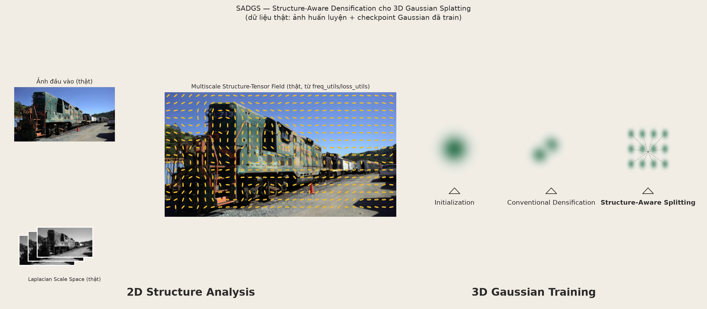

*Ba khối minh hoạ chuỗi xử lý trung tâm của chương này, dựng trực tiếp từ `SADGS/utils/freq_utils.py`/`loss_utils.py` chạy trên một ảnh thật (`real_book_teaser.py`): ảnh GT đầu vào, kim tự tháp Laplacian/DoG đa tỉ lệ (17.2), và trường structure tensor $(S_{xx},S_{xy},S_{yy})$ hiển thị dưới dạng trường ellipse (17.1–17.3).*

`SADGS/README.md:7-10`:

> "The method accelerates 3D Gaussian Splatting convergence by using multiscale image structure to guide Gaussian densification. Instead of relying only on screen-space positional gradients, it compares each Gaussian's projected screen-space extent with local texture structure, then performs anisotropic splitting with multiview consistency."

> "Phương pháp này tăng tốc độ hội tụ của 3D Gaussian Splatting bằng cách sử dụng cấu trúc ảnh đa tỷ lệ (multiscale) để định hướng quá trình làm dày đặc (densification) các Gaussian. Thay vì chỉ dựa vào gradient vị trí trong không gian màn hình (screen-space), phương pháp so sánh phạm vi chiếu của mỗi Gaussian trên không gian màn hình với cấu trúc kết cấu (texture) cục bộ, sau đó thực hiện phép tách dị hướng (anisotropic splitting) có tính nhất quán đa góc nhìn (multiview consistency)."

Ba cụm từ khoá trong câu này ánh xạ trực tiếp sang ba cơ chế có code cụ thể, không phải khẩu hiệu marketing:

| Cụm từ README | Cơ chế trong code | Mục |
|---|---|---|
| "multiscale image structure" | `get_multiscale_structure_tensor_v1`/`v2` | 17.2 |
| "compares projected screen-space extent with local texture structure" | $\eta$ = độ dài trục chiếu / bước sóng texture cục bộ | 17.3 |
| "multiview consistency" | tỉ lệ view có $\eta$ cao/thấp trên tổng số view nhìn thấy Gaussian | 17.4 |
| "anisotropic splitting" | `densify_and_split_structgs` — chia theo $(k_x,k_y,k_z)$ riêng từng trục | 17.5 |

Điểm quan trọng: SAD-GS **không thay thế** toàn bộ khung ADC hiện đại — nó kế thừa khung xương đó. Nhìn vào `train.py:390`, nhánh "warmup" vẫn gọi thẳng `gaussians.densify_and_prune(opt.densify_grad_threshold, ...)` — đúng hàm 3DGS gốc, không đổi. Nhánh chính (`is_normal_densification`, `train.py:323-386`) gọi `densify_and_prune_structgs`, một hàm **mới** dùng lại khung xương của cơ chế ADC hiện đại (cùng `grad_thresh`/`grad_abs_thresh`/`dense`/multinomial-prune, 7 bước đã mô tả ở chương 12) nhưng thay tiêu chí split bằng $\eta$ multiview thay vì chỉ Importance/Pruning score như ADC hiện đại. Nói cách khác: SAD-GS giữ nguyên "khung" ADC 7 bước ở chương 12 và **thay bước ①–③ (đo sai số ảnh) bằng một tín hiệu khác — cấu trúc tần số ảnh thay vì L1 render/GT** — rồi cắm tín hiệu mới đó vào đúng chỗ split/clone.

**Hình tổng kết mục 17.0 — README ánh xạ sang cơ chế code:**

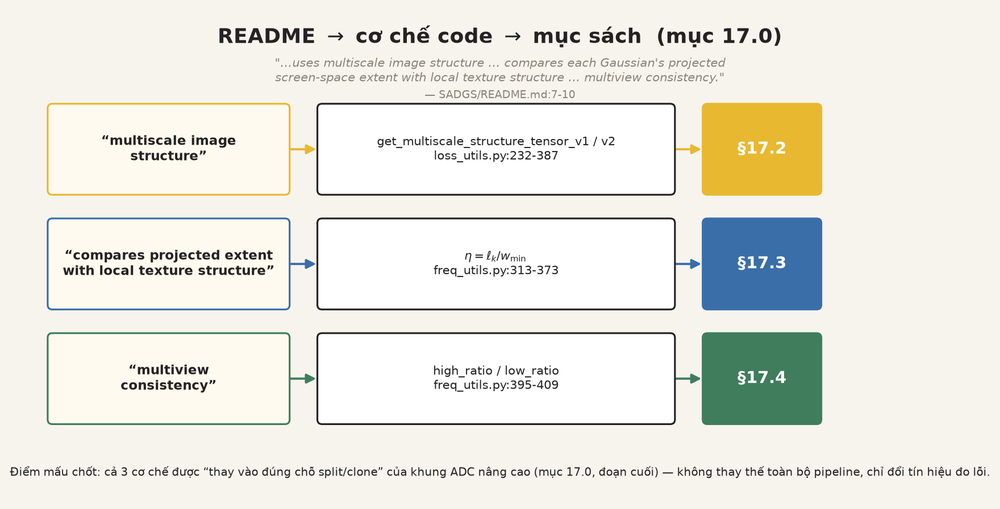

*INPUT: bảng "Cụm từ README | Cơ chế trong code | Mục" ở mục 17.0 (3 hàng: "multiscale image
structure" / "compares projected screen-space extent with local texture structure" / "multiview
consistency"), cùng trích dẫn nguyên văn `SADGS/README.md:7-10`.
CÔNG THỨC/NGUỒN: mỗi hàng của bảng gốc được vẽ lại thành một luồng khung-mũi tên-khung, dữ liệu
đúng như bảng: "multiscale image structure" → `get_multiscale_structure_tensor_v1`/`v2`
(`SADGS/utils/loss_utils.py:232-387`) → §17.2; "compares projected extent with local texture
structure" → $\eta=\ell_k/w_{\min}$ (`SADGS/utils/freq_utils.py:313-373`) → §17.3; "multiview
consistency" → `high_ratio`/`low_ratio` (`SADGS/utils/freq_utils.py:395-409`) → §17.4.
OUTPUT: sơ đồ pipeline 3 hàng, mỗi hàng nối trực tiếp một cụm từ README với đúng hàm code và đúng
số mục — trực quan hoá luận điểm "không phải khẩu hiệu marketing" đã nêu ngay trên bảng gốc, không
thêm khẳng định nào ngoài những gì bảng đó đã nói.*

Dựng bằng `DOCS/BOOK/adc_figures/deep17f_overview_comparison.py` (hàm `fig01_readme_mapping`),
matplotlib thuần (patches + text + arrows), không cần dữ liệu ảnh/checkpoint thật — đây là sơ đồ
khái niệm (schematic), khác các hình `real_*` trong chương vốn chạy trên dữ liệu thật.

---

## 17.1 Structure tensor — đo "tần số cấu trúc ảnh cục bộ"

`SADGS/utils/loss_utils.py:170-230`, hàm `get_structure_tensor_torch(image_tensor, sigma=1.0, rho=1.0)`. Đây là **structure tensor nhiều kênh kiểu Di Zenzo** — kỹ thuật thị giác máy tính cổ điển (không phải phát minh riêng của SAD-GS) để đo hướng và cường độ biến thiên cục bộ của ảnh màu, tổng quát hoá gradient ảnh xám sang RGB bằng cách cộng năng lượng 3 kênh thay vì lấy luminance.

**Bước 1 — làm mờ trước (khử nhiễu tần số cao giả):**

$$
\boxed{\ I_{\text{smooth}}=G_\sigma * I,\qquad k=2\lceil4\sigma\rceil+1\ \text{(kernel size, ép lẻ)}\ }
$$

**Bước 2 — đạo hàm Sobel theo từng kênh** (conv2d với `groups=C`, mỗi kênh RGB độc lập):

$$
S_x=\begin{pmatrix}-1&0&1\\-2&0&2\\-1&0&1\end{pmatrix},\qquad
S_y=\begin{pmatrix}-1&-2&-1\\0&0&0\\1&2&1\end{pmatrix},\qquad
I_x=S_x*I_{\text{smooth}},\ I_y=S_y*I_{\text{smooth}}
$$

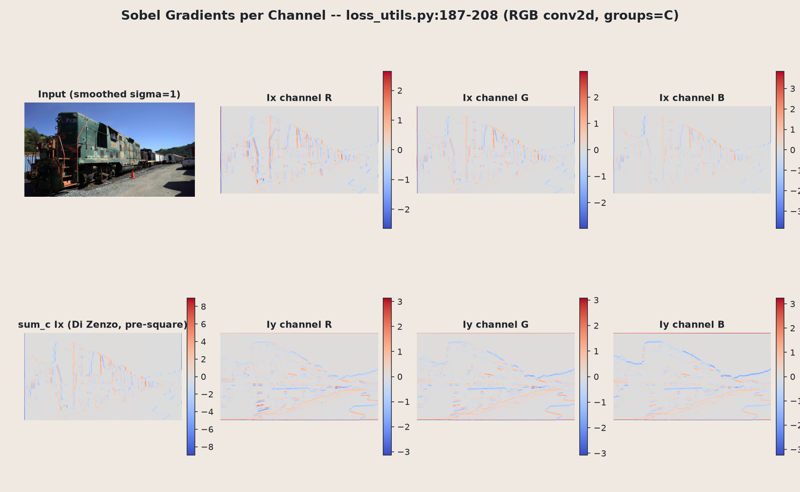

*$I_x,I_y$ tính riêng cho từng kênh R/G/B (`conv2d`, `groups=C`) trên một crop thật từ scene Tanks&Temples "train" (`real_structure_analysis.py`) — đúng bước 2, trước khi Di Zenzo cộng dồn ở bước 3.*

**Bước 3 — tích và cộng dồn 3 kênh (Di Zenzo)** — đây là điểm khác biệt so với structure tensor ảnh xám thông thường:

$$
\boxed{\ I_{xx}=\sum_{\text{ch}}I_x^{(\text{ch})2},\qquad I_{xy}=\sum_{\text{ch}}I_x^{(\text{ch})}I_y^{(\text{ch})},\qquad I_{yy}=\sum_{\text{ch}}I_y^{(\text{ch})2}\ }
$$

**Vì sao cộng 3 kênh thay vì luminance**: một cạnh iso-luminant (hai màu khác hẳn nhau nhưng độ sáng giống nhau, ví dụ đỏ thuần và xanh lá thuần cùng độ sáng $L$) có gradient luminance $\approx0$ nhưng gradient từng kênh RGB khác 0 rõ — luminance sẽ **bỏ sót** cạnh này, giống hệt vấn đề "vì sao trung bình 3 kênh, vì sao L1" đã phân tích ở [§12.1.3](12-adaptive-density-control.md#vì-sao-trung-bình-3-kênh-vì-sao-l1) cho bước ① của ADC hiện đại, chỉ khác: ADC hiện đại cộng $|{\Delta}|$ ba kênh của **sai số render↔GT**, còn SAD-GS cộng năng lượng gradient bình phương ba kênh của **chính ảnh GT** (không liên quan gì đến render).

**Bước 4 — tích hợp cửa sổ (structure tensor thật sự)** — làm mờ lại các thành phần $I_{xx},I_{xy},I_{yy}$ bằng $\rho$ (khác $\sigma$ ở bước 1) để "gộp" các gradient lân cận theo hướng thống nhất thay vì điểm ảnh đơn lẻ:

$$
\boxed{\ S_{xx}=G_\rho*I_{xx},\quad S_{xy}=G_\rho*I_{xy},\quad S_{yy}=G_\rho*I_{yy}\ }
$$

*Ba kênh $(S_{xx},S_{xy},S_{yy})$ sau bước 4 trên cùng ảnh thật, thang màu đối xứng quanh 0 cho $S_{xy}$ (có dấu, mã hoá hướng nghiêng) — đối chiếu trực tiếp `loss_utils.py:199-217`.*

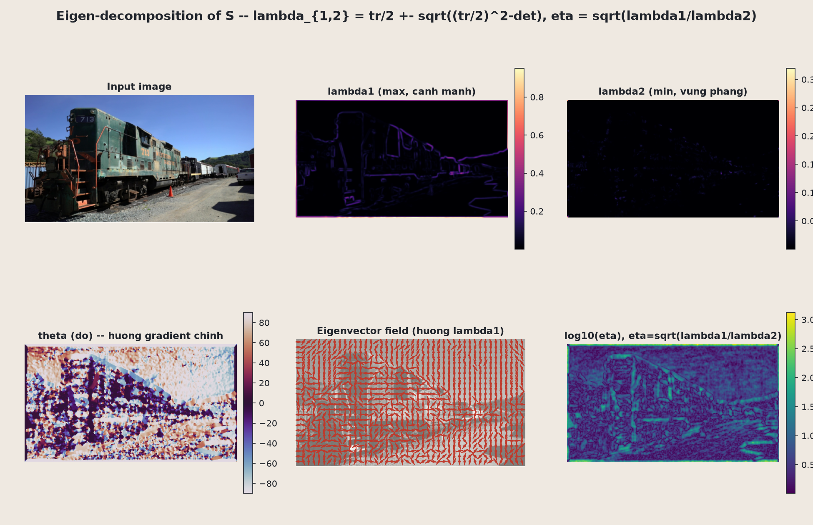

*$\lambda_1,\lambda_2$ tính bằng công thức đóng cho ma trận đối xứng $2\times2$ (đúng `freq_utils.py:325-329`, dùng lại ở mục 17.3): $\lambda_1$ lớn ở cạnh sắc (thân xe lửa, đường ray), $\lambda_2\approx0$ ở vùng chỉ có một hướng biến thiên.*

**Bước 5 — chuẩn hoá theo batch** để ngưỡng $\eta$ (mục 17.3) không trôi theo độ sáng/tương phản cảnh:

$$
S_{xx},S_{xy},S_{yy}\ \leftarrow\ \frac{S_{xx},S_{xy},S_{yy}}{\max_{\text{batch}}(S_{xx}+S_{yy})+10^{-6}}
$$

Kết quả trả về `[B,3,H,W]` = $(S_{xx},S_{xy},S_{yy})$ — ma trận đối xứng $2\times2$ tại mỗi pixel:

$$
S(x)=\begin{pmatrix}S_{xx}&S_{xy}\\S_{xy}&S_{yy}\end{pmatrix}
$$

Trị riêng lớn nhất $\lambda_1$ của $S(x)$ = năng lượng tần số cao nhất tại điểm đó theo **bất kỳ hướng nào** — chính là đại lượng dùng ở mục 17.3.

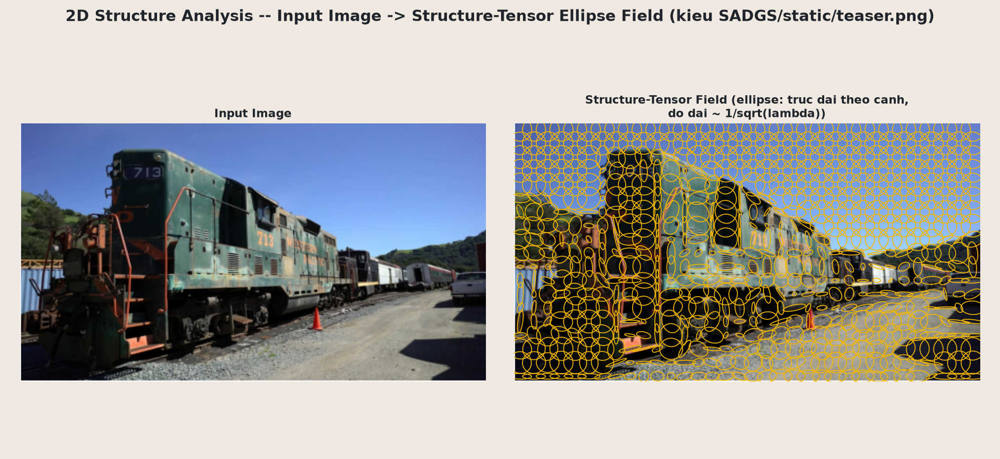

*Toàn bộ pipeline "2D Structure Analysis" gộp lại: ảnh gốc → ellipse trị riêng/vector riêng vẽ tại một lưới điểm thưa, trục dài ellipse chỉ hướng ít biến thiên nhất ($v_2$) — đúng hướng mà một Gaussian được phép kéo dài mà không làm mờ cạnh (§18.1.4 đi sâu hơn vào diễn giải hình học này).*

### Đào sâu 17.1 — ba khoảng trống bằng số liệu thật

Ba hình dưới đây (`DOCS/BOOK/adc_figures/deep17a_structure_tensor.py`) chạy lại đúng `get_structure_tensor_torch` (`SADGS/utils/loss_utils.py:170-230`) trên một crop ảnh **thật khác** — panel dưới-trái "gt IMG_6292" của `DOCS/assets/samples_drjohnson.png` (toạ độ `(11,381)-(451,669)`, 440×288px, một căn phòng với tường xanh lá nhạt, cửa gỗ trắng, ghế gỗ, dàn sưởi và bình chữa cháy đỏ) — nhằm biến ba khẳng định lời văn ở trên thành ba phép đo cụ thể, có thể kiểm chứng lại bằng cách chạy script.

**(a) Vì sao cộng 3 kênh RGB thay vì luminance — INPUT / FORMULA / OUTPUT**

*INPUT*: crop thật ở trên, tiền xử lý $\sigma=1.0$ (đúng bước 1). Trên ảnh đã làm mượt, tính thêm một đại lượng **không nằm trong SADGS** để đối chứng: gradient luminance ITU-R BT.709 $L=0.2126R+0.7152G+0.0722B$, rồi lấy Sobel $L_x,L_y$ giống hệt bước 2.

*FORMULA* (SADGS thật, `loss_utils.py:198-208`):

$$
\boxed{\ \text{grad}_{\text{DiZenzo}}=\sqrt{I_{xx}+I_{yy}},\quad I_{xx}=\sum_{\text{ch}}I_x^{(\text{ch})2},\ I_{yy}=\sum_{\text{ch}}I_y^{(\text{ch})2}\ }\qquad\text{so với}\qquad \text{grad}_{\text{lum}}=\sqrt{L_x^2+L_y^2}
$$

*OUTPUT*: script quét toàn bộ crop, tìm pixel thật nơi tỉ lệ $\text{grad}_{\text{DiZenzo}}/\text{grad}_{\text{lum}}$ lớn nhất (trong vùng grad Di Zenzo thuộc top-30%, tránh nhiễu nền phẳng) — rơi đúng vào viền bình chữa cháy đỏ áp sát cửa gỗ màu be (RGB tại điểm $\approx(0.17,0.00,0.05)$). Tại pixel $(x{=}293,y{=}260)$: $\text{grad}_{\text{lum}}=0.0029$ trong khi $\text{grad}_{\text{DiZenzo}}=0.3227$ — **lớn hơn 81.8 lần**. Per-channel: $|\text{grad}\,R|=0.309$, $|\text{grad}\,G|=0.091$, $|\text{grad}\,B|=0.021$ — kênh R mang gần như toàn bộ tín hiệu cạnh, còn luminance gần như triệt tiêu vì độ sáng hai bên viền xấp xỉ nhau. Đây là bằng chứng số thật cho câu "luminance sẽ bỏ sót cạnh iso-luminant" ở trên, không còn là khẳng định lý thuyết suông.

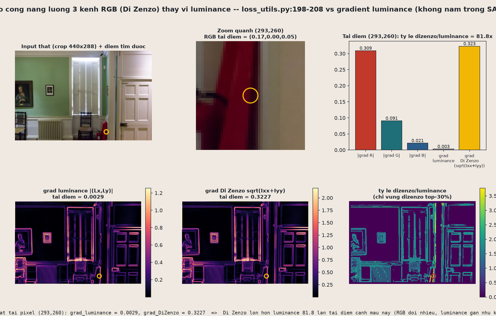

*Ảnh thật (crop drjohnson) đánh dấu điểm tìm được; zoom cận cảnh; biểu đồ cột 5 đại lượng tại điểm đó; và ba bản đồ toàn crop (grad luminance, grad Di Zenzo, tỉ lệ hai đại lượng) — vùng viền bình chữa cháy/cửa sáng rực trên bản đồ tỉ lệ chính là nơi luminance "mù" nhưng Di Zenzo vẫn thấy rõ.*

**(b) Vai trò của $\rho$ ở bước 4 — INPUT / FORMULA / OUTPUT**

*INPUT*: cùng crop thật, cùng $I_{xx},I_{xy},I_{yy}$ thô (bước 3, chưa tích hợp) — so sánh ba trạng thái $\rho=0$ (thô, chưa lọc), $\rho=1.5$, $\rho=6.0$.

*FORMULA* (`loss_utils.py:210-217`):

$$
\boxed{\ S_{xx}=G_\rho*I_{xx},\quad S_{xy}=G_\rho*I_{xy},\quad S_{yy}=G_\rho*I_{yy}\ }\qquad
\text{coherence}=\left(\frac{\lambda_1-\lambda_2}{\lambda_1+\lambda_2}\right)^2
$$

*OUTPUT*: coherence trung bình toàn crop **giảm** dần theo $\rho$: $\rho{=}0\!:\,0.884 \to \rho{=}1.5\!:\,0.726 \to \rho{=}6.0\!:\,0.590$. Lý do (thấy trực tiếp trên các bản đồ $S_{xx},S_{xy},S_{yy}$ và coherence trong hình): ở $\rho=0$, $I_{xx}$ tại mỗi pixel là ma trận hạng-1 theo *đúng một* hướng gradient điểm ảnh đó — nên coherence gần 1 một cách "giả tạo" ở hầu hết mọi pixel có cạnh, không phân biệt được cạnh thẳng thật với góc/texture. Chỉ sau khi $G_\rho$ thật sự trung bình hoá không gian, các vùng có nhiều hướng gần nhau (góc cửa, khung cửa sổ, chân ghế) mới lộ rõ coherence thấp, còn các đoạn cạnh dài đơn hướng (mép cửa, thanh dàn sưởi) vẫn giữ coherence cao và mượt hơn hẳn bản đồ thô đầy nhiễu hạt. Đây chính là bằng chứng số cho lý do bước 4 "bắt buộc" phải có $G_\rho$ (đã nêu ở `part_sadgsx_01.tex`): không có nó, $\det J=0$/coherence "ảo" ở khắp nơi và không phân biệt được cạnh với góc.

*Ba hàng ($\rho=0$ thô, $\rho=1.5$, $\rho=6.0$) × bốn cột ($S_{xx},S_{xy},S_{yy}$, coherence) trên cùng một crop thật — $\rho$ càng lớn, bản đồ càng "gộp" cạnh lân cận thành mảng liền, coherence trung bình toàn ảnh giảm 0.884→0.590 vì các vùng nhiều-hướng (góc/texture) bị lộ ra thay vì bị nhiễu điểm ảnh nguỵ trang thành "coherent".*

**(c) Chuẩn hoá theo batch ở bước 5 — INPUT / FORMULA / OUTPUT**

*INPUT*: cùng crop thật, render lại ở ba mức độ sáng/tương phản bằng cách nhân trực tiếp giá trị pixel: $\times 0.5$, $\times 1.0$ (gốc), $\times 1.5$ (clip về $[0,1]$ sau khi nhân, đúng như ảnh 8-bit thật bị "cháy sáng").

*FORMULA* (`loss_utils.py:219-227`):

$$
\boxed{\ S_{xx},S_{xy},S_{yy}\ \leftarrow\ \frac{S_{xx},S_{xy},S_{yy}}{\max_{\text{batch}}(S_{xx}+S_{yy})+10^{-6}}\ }
$$

*OUTPUT*: **trước** chuẩn hoá, $\max(S_{xx}+S_{yy})$ = $9.730$ ($\times0.5$), $38.920$ ($\times1.0$), $44.275$ ($\times1.5$) — chênh lệch rất lớn theo độ sáng (đúng như dự đoán lý thuyết bậc hai: tỉ lệ $0.5^2=0.250$ khớp gần như tuyệt đối với tỉ lệ đo được $9.730/38.920=0.250$). **Sau** chuẩn hoá: bản đồ $S_{xx}$ của $\times0.5$ và $\times1.0$ **giống hệt nhau** — $\max|\text{diff}|=0.0000$ trên toàn crop — vì hệ số $k^2$ triệt tiêu đúng đại số ở tử và mẫu tại từng pixel. Với $\times1.5$, đa số pixel cũng giống hệt, nhưng $\max|\text{diff}|=0.3032$ tại vùng cửa sổ/khung cửa bị **bão hoà** (clip về 1.0) — tỉ lệ max đo được chỉ $1.138$ thay vì $1.5^2=2.25$ lý thuyết, đúng là dấu hiệu cho thấy giả định tuyến tính $k$ bị phá vỡ khi ảnh over-expose. Kết luận thực nghiệm: chuẩn hoá bước 5 làm ngưỡng $\eta$ (mục 17.3) *bất biến chính xác* với độ sáng scene trong vùng không bão hoà, và chỉ lệch ở đúng những vùng đã cháy sáng — một giới hạn thật, không phải giả định suông.

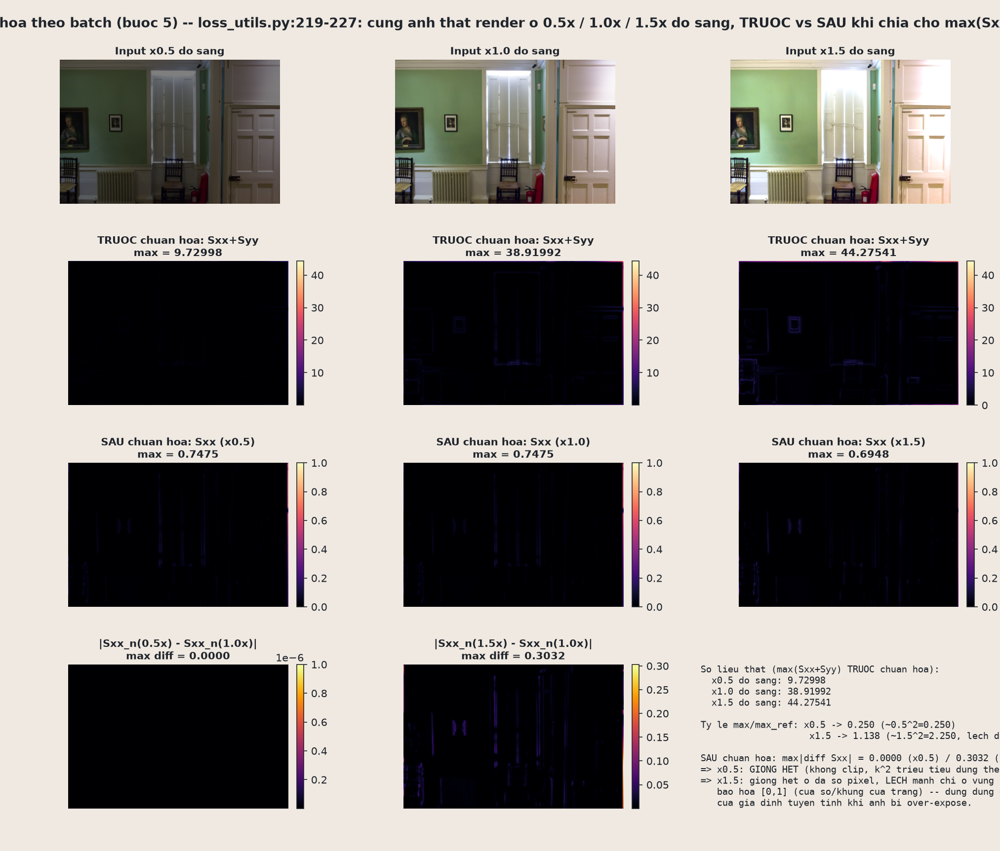

*Hàng trên: cùng crop thật ở 3 mức độ sáng. Hàng giữa: $S_{xx}+S_{yy}$ TRƯỚC chuẩn hoá (giá trị max lệch nhau ~4.5 lần). Hàng dưới: $S_{xx}$ SAU chuẩn hoá (gần như giống hệt). Hàng cuối: hai bản đồ hiệu số và số liệu thật xác nhận bất biến tuyến tính, trừ vùng bão hoà [0,1].*

---

## 17.2 Multiscale structure tensor — hai biến thể v1/v2

`SADGS/utils/loss_utils.py:232-387`. `get_structure_tensor_torch` (17.1) chỉ nhìn một tỉ lệ $\sigma$ — không phân biệt được "cạnh sắc nhỏ" (cần $\sigma$ nhỏ) với "vân lặp lại lớn" (cần $\sigma$ lớn để thấy tính lặp). Hai hàm multiscale giải quyết việc này bằng cách quét qua `levels` octave, mỗi octave nhân $\sigma$ với `octave_step`, rồi **gộp có trọng số theo năng lượng band** — về bản chất là một dạng Laplacian/DoG (Difference-of-Gaussian) pyramid pha trộn với structure tensor, không phải multiscale thuần tuý Gaussian pyramid.

**Tham số mặc định** (`SADGS/arguments/__init__.py:120-121`): `st_levels=4`, `st_mode="v1"` (`train.py:187-190` chọn theo `opt.st_mode`), `octave_step=1.5` (tham số hàm, không expose ra `arguments`), `power_factor=3.0`.

### Vòng lặp octave (chung cho cả v1 và v2)

Tại octave $i=0,\dots,L-1$ ($L=$`st_levels`):

$$
\boxed{\ \sigma_i=\sigma_0\cdot r^{\,i},\qquad f_i=\frac1{r^{\,i}}\qquad(r=\texttt{octave\_step}=1.5,\ \sigma_0=\texttt{base\_sigma}=1)\ }
$$

- $\sigma_i$: độ mờ tích luỹ tới octave $i$ (làm mờ **tiếp** từ ảnh đã mờ octave trước, không mờ lại từ ảnh gốc — tiết kiệm: $\sigma_{\text{inc}}=\sqrt{\sigma_i^2-\sigma_{i-1}^2}$).
- $f_i$: "tần số danh nghĩa" gán cho octave $i$ — octave 0 tần số cao nhất ($f_0=1$), octave cuối tần số thấp nhất.

**Band response** — năng lượng khác biệt giữa ảnh trước/sau khi mờ thêm ở octave này (kiểu Difference-of-Gaussian, đo "có bao nhiêu chi tiết bị mất khi mờ thêm"):

$$
\boxed{\ R_i=\bigl\lVert I_{\text{smooth}}^{(i-1)}-I_{\text{smooth}}^{(i)}\bigr\rVert_2\ \text{(theo kênh màu, tại mỗi pixel)}\ }
$$

với $i>0$, $R_i$ còn được làm mờ thêm bằng $\sigma_{\text{smooth}}=2\sigma_i$ để có ngữ cảnh không gian rộng hơn cho octave thô.

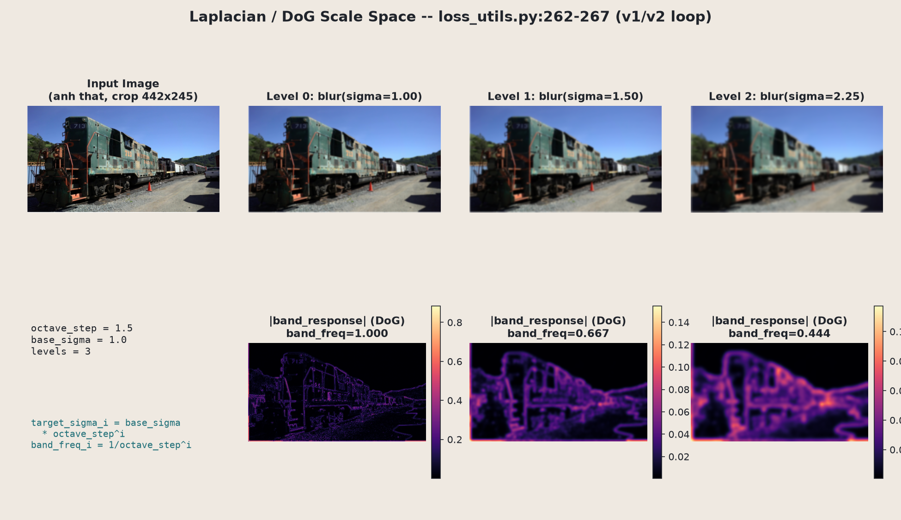

*Kim tự tháp DoG (`loss_utils.py:262-267`, vòng lặp chung cho v1/v2) tính trên cùng ảnh crop thật: mỗi octave $i$ bắt một dải tần khác nhau — octave 0 bắt cạnh sắc (số hiệu toa tàu), octave cuối chỉ còn phân biệt các mảng lớn.*

**Trọng số theo năng lượng** — octave nào giải thích nhiều năng lượng hơn thì đóng góp nhiều hơn vào hướng cấu trúc cuối, luỹ thừa hoá để làm sắc nét sự chênh lệch:

$$
w_i=R_i^{\,p}\qquad(p=\texttt{power\_factor}=3.0)
$$

**Gộp có trọng số** ($v1$ và $v2$ khác nhau đúng ở bước tính $S_{xx,i},S_{xy,i},S_{yy,i}$ trước khi chuẩn hoá hướng — xem dưới):

$$
\boxed{\ (\hat S_{xx},\hat S_{xy},\hat S_{yy})=\frac{\sum_i w_i\, f_i^2\, \bigl(\tfrac{S_{xx,i}}{\mathrm{tr}_i},\tfrac{S_{xy,i}}{\mathrm{tr}_i},\tfrac{S_{yy,i}}{\mathrm{tr}_i}\bigr)}{\sum_i w_i}\ ,\qquad \mathrm{tr}_i=S_{xx,i}+S_{yy,i}+10^{-6}\ }
$$

Chia cho $\mathrm{tr}_i$ trước khi gộp: mỗi octave chỉ đóng góp **hướng** (structure tensor chuẩn hoá vết $=1$), còn **độ lớn** tần số do $f_i^2$ áp đặt — lý do: `code comment "We want the final sum to have Trace = freq^2"` (`loss_utils.py:296-298`). Đây là chỗ khác với structure tensor đơn tỉ lệ (17.1): đơn tỉ lệ trả về năng lượng gradient thật; multiscale trả về **hướng cấu trúc chiếm ưu thế, gắn nhãn độ lớn theo tần số octave nào thắng** — hai đại lượng khác đơn vị, không thể trộn lẫn khi đọc code.

### v1 vs v2 — khác nhau ở đâu

| | v1 (`get_multiscale_structure_tensor_v1`) | v2 (`get_multiscale_structure_tensor_v2`) |
|---|---|---|
| Structure tensor mỗi octave $S_{xx,i}$ | Tính **một lần duy nhất** ở octave 0 (`base_st`), rồi chỉ **làm mờ lại** bằng $\rho_i=3\sigma_i$ cho các octave sau (`loss_utils.py:282-284`) | Tính **structure tensor mới tại mỗi octave** trên ảnh đã mờ tới $\sigma_i$ đó (`loss_utils.py:357`, gọi lại `get_structure_tensor_torch(next_smooth, sigma=σ_i, rho=3σ_i)`) |
| Chi phí | 1 lần Sobel + $L$ lần Gaussian blur trên tensor $S$ | $L$ lần Sobel + $L$ lần Gaussian blur trên ảnh |
| Đúng về mặt tín hiệu | Xấp xỉ — octave thô chỉ "làm mờ lại" gradient tính từ ảnh gốc (chưa mờ), không phản ánh đúng gradient của ảnh **thật sự** đã bị mờ ở tỉ lệ đó | Đúng hơn — mỗi octave có Sobel riêng trên ảnh đã mờ đúng $\sigma_i$, bắt đúng hướng cấu trúc **tại chính tỉ lệ đó** |
| Docstring tự nhận xét | "Improved Multi-scale" | "**True** Multi-scale... v1 blurs a pre-computed base tensor, [v2] properly captures orientation and frequency at each scale" |

Mặc định `st_mode="v1"` — nhanh hơn được chọn làm default dù chính docstring của tác giả gọi v2 là "đúng hơn". Đây là trade-off tốc độ/độ chính xác có chủ đích, giống lựa chọn mặt nạ nhị phân thay vì soft-count ở bước ③ của ADC hiện đại ([§12.1.5](12-adaptive-density-control.md#1215-bước--mặt-nạ-nhị-phân-với-tauloss01)) — rẻ hơn, đủ dùng làm **tín hiệu gate**, không cần chính xác tuyệt đối vì chỉ quyết định split/clone chứ không đi vào loss trực tiếp (trừ khi `lambda_freq>0`, xem `frequency_loss_simple`, mặc định `lambda_freq=0` — tắt).

*`get_multiscale_structure_tensor_v1` trên ảnh crop thật: chỉ một Sobel ở octave 0, các octave sau chỉ làm mờ lại $S_{\text{base}}$.*

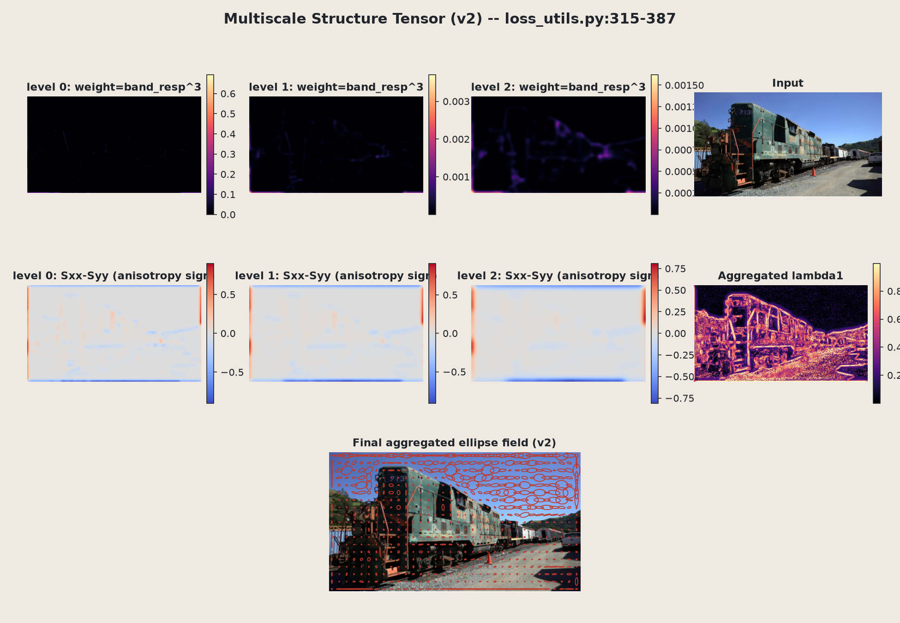

*`get_multiscale_structure_tensor_v2` trên cùng ảnh, cùng tham số: mỗi octave có Sobel riêng trên ảnh đã mờ đúng $\sigma_i$ — so trực tiếp với panel v1 ở trên để thấy khác biệt chỉ tập trung ở vùng cạnh cong/giao biên.*

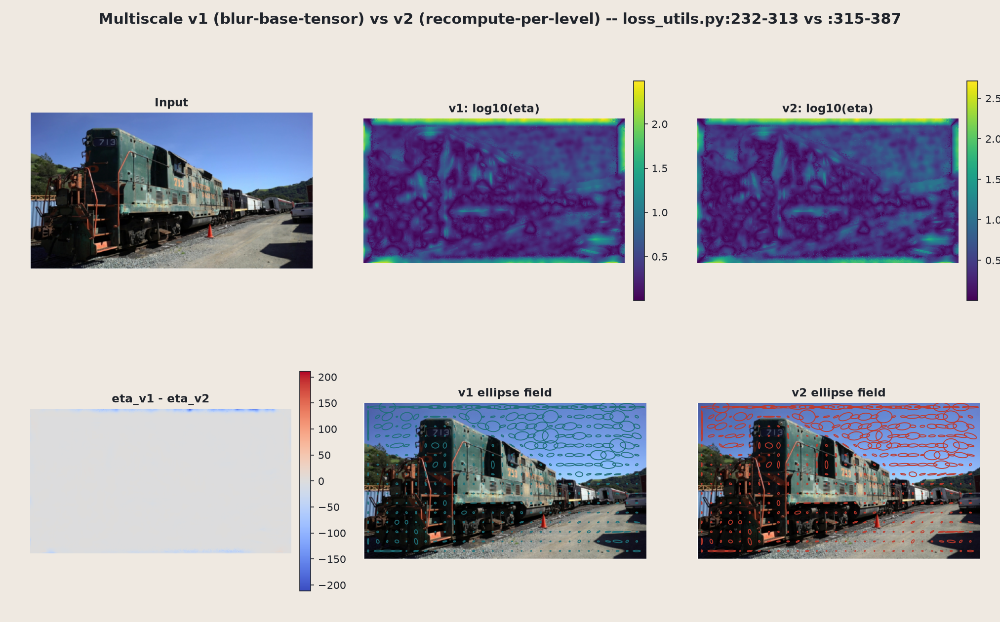

*Trace $S_{xx}+S_{yy}$ của v1 và v2 cùng thang màu, cộng panel hiệu số — xác nhận bằng số kết luận định tính ở bảng trên: chênh lệch tập trung ở cạnh cong (bánh xe, số hiệu toa tàu), gần như bằng 0 ở các cạnh thẳng dài.*

*Tổng kết trực quan 17.1–17.2: ảnh gốc → Laplacian scale space → structure tensor đơn tỉ lệ → multiscale — một hình duy nhất nối cả chuỗi xử lý bằng dữ liệu thật (`real_structure_analysis.py`).*

### Đi sâu: ba khoảng trống định lượng của v1/v2 — đo bằng số thật, không chỉ mô tả

Ba khẳng định ở trên (chi phí v1 rẻ hơn v2, $r$/$p$ "điều khiển độ sắc nét", và việc chia
$\mathrm{tr}_i$ chỉ giữ lại hướng) đều đúng về bản chất nhưng md gốc chỉ minh hoạ bằng lời hoặc
một bộ tham số cố định. Ba hình dưới đây chạy lại chính `get_multiscale_structure_tensor_v1`/`_v2`
(numpy thuần, không torch) trên một ảnh thật khác — `DOCS/assets/samples_drjohnson.png`, crop
(924,381)–(1365,671), một tủ sách gỗ với cửa kính lưới mullion chéo, núm đồng, và khung ảnh treo
tường — để đưa ra số liệu cụ thể thay vì chỉ khẳng định.

#### 1. Chi phí và độ lệch v1/v2 thật, theo `st_levels`

**INPUT.** Ảnh crop thật ở trên, chạy cả v1 và v2 với `st_levels` $L\in\{2,3,4,6\}$ (`base_sigma=1`,
`octave_step=1.5`, `power_factor=3.0`). Chi phí đo bằng **wall-clock thật** (`time.perf_counter`)
*và* **đếm số lần gọi thật** `sobel_channel`/`fast_gaussian_blur` bên trong thuật toán (không phải
công thức $O(\cdot)$ lý thuyết). Độ lệch đo bằng $\text{mean}\,|\,\mathrm{tr}(\hat S_{v1})-\mathrm{tr}(\hat S_{v2})\,|$
trên toàn ảnh.

**FORMULA.** Số lần gọi lý thuyết theo bảng ở mục trên:

$$
\boxed{\ \#\text{Sobel}_{v1}=3\ (\text{cố định, chỉ octave }0),\qquad \#\text{Sobel}_{v2}=3L\ }
$$

(hệ số 3 vì `get_structure_tensor` gọi `sobel_channel` một lần mỗi kênh RGB; v1 chỉ tính base tensor
một lần ở octave 0, v2 gọi lại `get_structure_tensor` đầy đủ ở mỗi trong $L$ octave — `loss_utils.py:241` (base)
vs `loss_utils.py:357` (mỗi octave)).

**OUTPUT.** 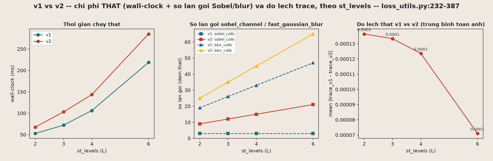

*So sánh thật giữa v1 và v2 trên cùng ảnh crop, quét `st_levels`$\in\{2,3,4,6\}$: (trái) wall-clock
thật, v2 luôn chậm hơn v1 khoảng 1.3–1.4$\times$ và khoảng cách này **tăng theo $L$** (v1: 50→202 ms,
v2: 67→285 ms) vì phần chi phí thêm của v2 tỉ lệ tuyến tính với $L$; (giữa) số lần gọi `sobel_channel`
đo được: v1 **luôn đúng 3 lần** bất kể $L$ (đúng như dự đoán lý thuyết $\#\text{Sobel}_{v1}=3$), trong
khi v2 tăng tuyến tính $3L$ (đo được 9, 12, 15, 21 ở $L=2,3,4,6$ — khớp chính xác công thức); số lần
gọi `fast_gaussian_blur` cũng cao hơn ở v2 tại mọi $L$; (phải) độ lệch $\text{mean}\,|\mathrm{tr}_{v1}-\mathrm{tr}_{v2}|$
**rất nhỏ** ($\approx 10^{-4}$, từ $1.4\times10^{-4}$ ở $L=2$ xuống $0.7\times10^{-4}$ ở $L=6$) và **giảm dần**
khi $L$ tăng — nhiều octave hơn khiến trọng số $f_i^2$ ở các octave cao (nơi v1/v2 gần như giống hệt vì
chưa kịp lệch nhiều) chiếm ưu thế tương đối, pha loãng phần đóng góp của các octave thô nơi v1/v2 khác
nhau nhiều nhất. Kết luận định lượng: v2 đắt hơn *có hệ thống* và đắt thêm *tuyến tính* theo $L$, đổi
lại sai khác thực tế so với v1 là rất nhỏ trên ảnh này — củng cố lựa chọn `st_mode="v1"` làm mặc định.*

#### 2. Độ nhạy thật của `octave_step` ($r$) và `power_factor` ($p$)

**INPUT.** Cùng ảnh crop thật, `get_multiscale_structure_tensor_v1`, `levels=4`, `base_sigma=1`, quét
lưới đầy đủ $r\in\{1.2,1.5,2.0\}\times p\in\{1,3,6\}$ (9 tổ hợp thật, không minh hoạ).

**FORMULA.** Trực tiếp từ công thức gộp đã nêu ở trên:

$$
\boxed{\ \mathrm{tr}(\hat S)=\frac{\sum_i w_i f_i^2}{\sum_i w_i},\qquad w_i=R_i^{\,p},\quad f_i=r^{-i}\ }
$$

$r$ nhỏ → các $f_i^2$ gần nhau (dải octave dày) → trace mượt theo thang; $r$ lớn → $f_i^2$ giãn cách
xa nhau → trace nhạy hơn với việc "octave nào thắng". $p$ lớn → $w_i=R_i^p$ khuếch đại chênh lệch
band-response giữa các octave (winner-take-all); $p$ nhỏ → các octave đóng góp gần như đồng đều.

**OUTPUT.** 

*Lưới $3\times3$ bản đồ $\mathrm{tr}(\hat S)$ thật trên cùng ảnh, mỗi ô ghi `mean_tr` đo được. Theo hàng
(quét $p$, $r$ cố định): `mean_tr` giảm mạnh khi $p$ tăng — ví dụ hàng $r=1.5$: $0.4595\to0.4072\to0.0739$
khi $p=1\to3\to6$ — xác nhận bằng số hiệu ứng winner-take-all: $p$ lớn đẩy hầu hết trọng số về đúng một
octave có $f_i^2$ nhỏ (octave thô, $f_i^2$ nhỏ dần theo $i$), kéo trace trung bình xuống thấp. Theo cột
(quét $r$, $p$ cố định): tại $p=1$, `mean_tr` giảm đơn điệu $0.7473\to0.4595\to0.2555$ khi $r=1.2\to1.5\to2.0$
— $r$ lớn làm $f_i^2$ ở các octave sau ($i\ge1$) giảm nhanh hơn ($f_i^2=r^{-2i}$), kéo trung bình có trọng
số xuống. Quan sát thị giác: ở $p=6$ (cột phải), cả ba giá trị $r$ cho bản đồ gần như **giống hệt nhau về
cấu trúc không gian** (chỉ còn viền lưới kính và mép tủ sáng rõ) — khi $p$ đủ lớn, $p$ chi phối hoàn toàn,
$r$ gần như không còn ảnh hưởng tới *hình dạng* bản đồ (chỉ ảnh hưởng nhẹ tới biên độ: `mean_tr`=0.0736,
0.0739, 0.0737 — sai khác dưới 0.5%).*

#### 3. Kiểm chứng đẳng thức đại số: chuẩn hoá theo $\mathrm{tr}_i$ ⟹ trace cuối chỉ phụ thuộc $w_i,f_i$

**INPUT.** Cùng ảnh crop thật, v1, `levels=4`, `base_sigma=1`, `octave_step=1.5`, `power_factor=3.0` —
đúng tham số mặc định `arguments/__init__.py:120-121`.

**FORMULA.** Vì mỗi octave chia cho $\mathrm{tr}_i=S_{xx,i}+S_{yy,i}+10^{-6}$ trước khi gộp
(`loss_utils.py:287-291`), nên $\dfrac{S_{xx,i}}{\mathrm{tr}_i}+\dfrac{S_{yy,i}}{\mathrm{tr}_i}=\dfrac{\mathrm{tr}_i-10^{-6}}{\mathrm{tr}_i}\approx1$.
Thế vào công thức gộp trace suy ra một đẳng thức **không cần biết giá trị $S_{xx,i},S_{yy,i}$ cụ thể**,
chỉ cần $w_i$ và $f_i$:

$$
\boxed{\ \mathrm{tr}(\hat S)\ \approx\ \frac{\sum_i w_i\,f_i^2}{\sum_i w_i}\ }\qquad\text{(`loss_utils.py:296-298, 309-311`)}
$$

**OUTPUT.** 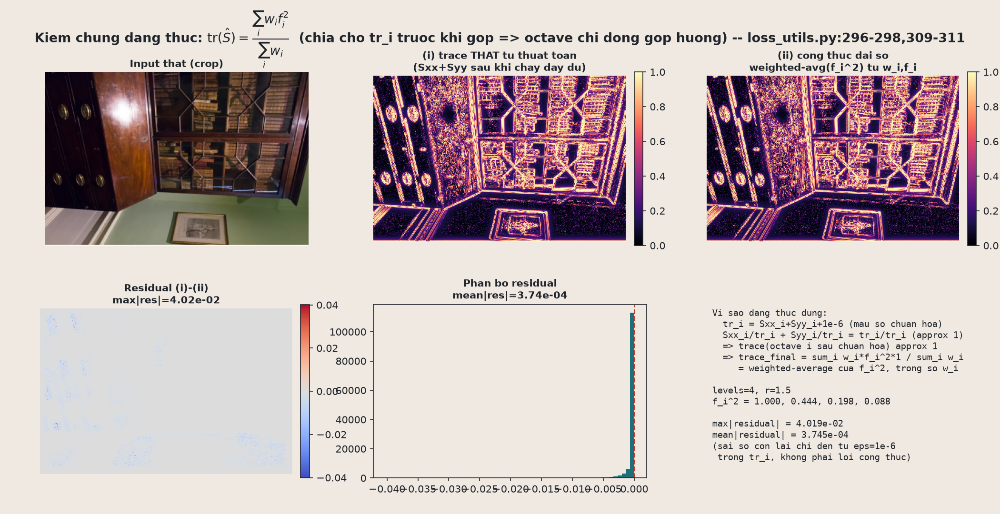

*So sánh pixel-theo-pixel hai cách tính trace **độc lập** trên cùng ảnh thật: (i) chạy toàn bộ thuật
toán rồi lấy $S_{xx}+S_{yy}$ thật, và (ii) chỉ dùng $w_i,f_i$ đã thu được trong vòng lặp, áp công thức
đại số ở trên — không đụng tới $S_{xx,i},S_{yy,i}$ nữa. Hai bản đồ (panel trên, giữa/phải) **giống hệt
nhau bằng mắt thường**; bản đồ phần dư (residual, panel dưới-trái) gần như toàn màu trung tính (bằng 0)
với $\text{mean}\,|\text{residual}|=3.7\times10^{-4}$ trên toàn ảnh — xác nhận định lượng đẳng thức đại số.
Phần dư lớn nhất đo được là $\max|\text{residual}|=4.0\times10^{-2}$, khu trú **đúng ở các vùng phẳng/tối**
(tường xanh lá, khe tối giữa các cuốn sách) — nơi $S_{xx,i}+S_{yy,i}$ (gradient gần 0) nhỏ tới mức số hạng
$\epsilon=10^{-6}$ cộng thêm ở mẫu số $\mathrm{tr}_i$ không còn "không đáng kể" nữa
($\epsilon/\mathrm{tr}_i\not\approx0$) — đúng như dự đoán từ chính công thức, **không phải lỗi tính toán**:
xấp xỉ $\dfrac{S_{xx,i}}{\mathrm{tr}_i}+\dfrac{S_{yy,i}}{\mathrm{tr}_i}\approx1$ chỉ chặt khi $\mathrm{tr}_i\gg\epsilon$,
tức khi octave đó có tín hiệu gradient thật sự. Đây là bằng chứng số học trực tiếp cho câu khẳng định ở
mục trên: "chia cho $\mathrm{tr}_i$ trước khi gộp ⟹ octave chỉ đóng góp hướng, độ lớn hoàn toàn do $f_i^2$".*

---

## 17.3 $\eta$ — so screen-space extent với bước sóng texture cục bộ

Đây là công thức trung tâm hiện thực chính xác câu README "compares each Gaussian's projected screen-space extent with local texture structure". Nằm trong `update_freq_stats_online` (`SADGS/utils/freq_utils.py:181-418`), chạy **mỗi 10 vòng** (`train.py:275`, không phải mỗi vòng như `add_densification_stats` gốc — xem so sánh chi phí ở 17.6).

*$\eta=\sqrt{\lambda_1/\lambda_2}$ (structure tensor đơn tỉ lệ) trên toàn ảnh thật cùng histogram phân bố — vùng cạnh mạnh, một-hướng (đường ray, thân toa) cho $\eta$ cao; vùng texture hai chiều (sỏi đá) cho $\eta$ thấp. Cùng ký hiệu $\eta$ nhưng đây là tỉ số dị hướng cấu trúc ảnh, khác định nghĩa "kích thước Gaussian / bước sóng" dùng bên dưới — chỉ trùng tên do cùng gốc lambda1/lambda2.*

*Ba patch cắt từ ảnh thật, mỗi patch vẽ trục chính (đỏ) và trục phụ (lục) của $S$ tại tâm patch — trực quan hoá đúng bước "phổ riêng" trước khi bước A chiếu trục Gaussian lên cùng không gian ảnh này.*

### Bước A — chiếu 3 trục scale của Gaussian lên màn hình

`compute_projected_axes_subset` (`freq_utils.py:116-178`). Với mỗi Gaussian có tâm chiếu $\mu'=(u,v)$, độ sâu $z$, ma trận quay cục bộ $R_i$ (từ quaternion) và scale $s=(s_x,s_y,s_z)$:

$$
\boxed{\ J=\begin{pmatrix}f_x/z&0&-f_x x/z^2\\0&f_y/z&-f_y y/z^2\end{pmatrix},\qquad
\text{axes}_{\text{cam}}=(R_{\text{view}}R_i)\,\mathrm{diag}(s),\qquad
\text{axes}_{\text{2D}}=J\cdot\text{axes}_{\text{cam}}\ }
$$

Đây chính là Jacobian phép chiếu phối cảnh tuyến tính hoá (EWA splatting, giống công thức đã dẫn ở [Chương 8](08-projection-compact-box.md)) — áp trực tiếp lên **3 vector cột scale** thay vì lên toàn bộ ma trận hiệp phương sai $\Sigma$. Kết quả `axes_2d` có shape `[N,3,2]`: 3 trục, mỗi trục có thành phần $(u,v)$ trên màn hình. Độ dài mỗi trục chiếu (đơn vị pixel):

$$
\ell_k=\sqrt{u_k^2+v_k^2+10^{-8}}\qquad k\in\{x,y,z\}
$$

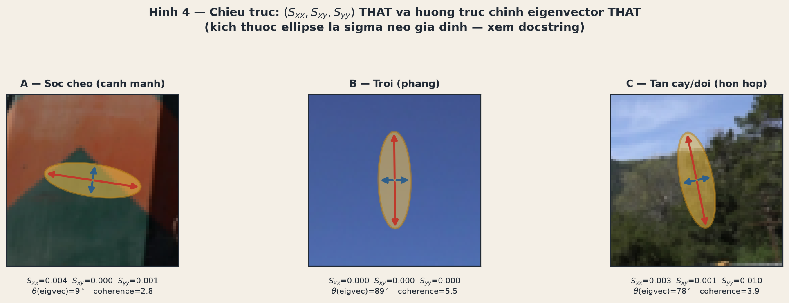

*Cùng ba kênh của $S$ trên một patch thật, chồng thêm hướng trục chiếu 2D của một Gaussian ví dụ — minh hoạ trực tiếp phép chiếu Jacobian ở Bước A đang lấy mẫu đúng vị trí nào trên bản đồ $S$.*

### Bước B — lấy mẫu structure tensor tại đúng vị trí Gaussian, có jitter Cholesky

Thay vì lấy mẫu structure tensor đúng tại tâm $\mu'$ (dễ trúng đúng 1 pixel, có thể lệch pha với cạnh thật), code lấy mẫu tại một điểm **ngẫu nhiên trong ellipsoid 1σ** của Gaussian bằng phân rã Cholesky của $\Sigma_{2D}$ (`freq_utils.py:257-292`):

$$
L=\begin{pmatrix}\sqrt{\sigma_{xx}}&0\\ \sigma_{xy}/\sqrt{\sigma_{xx}}&\sqrt{\sigma_{yy}-\sigma_{xy}^2/\sigma_{xx}}\end{pmatrix},\qquad
(\delta_x,\delta_y)=L\cdot(\epsilon_1,\epsilon_2),\ \epsilon_1,\epsilon_2\sim\mathcal N(0,1)
$$

*Coherence $C=\bigl(\tfrac{\lambda_1-\lambda_2}{\lambda_1+\lambda_2}\bigr)^2$ tính thật trên toàn ảnh, cùng trường hướng trục chính — vùng jitter Cholesky ở Bước B rơi vào có thể lệch pha coherence đáng kể nếu Gaussian phủ đúng lên biên vùng coherence cao/thấp, lý do thống kê cho việc lấy mẫu ngẫu nhiên trong ellipsoid thay vì đúng tâm.*

rồi `grid_sample` structure tensor tại $\mu'+(\delta_x,\delta_y)$. **Vì sao jitter thay vì lấy mẫu tâm cố định**: cùng lý do thống kê khiến ADC hiện đại lấy trung bình $V=10$ view thay vì 1 view duy nhất ở bước ⑤ ([§12.1](12-adaptive-density-control.md#121-bức-tranh-tổng-thể--vì-sao-sadgs-đổi-tiêu-chí-densify)) — một Gaussian to có thể phủ cả cạnh **và** vùng phẳng; lấy mẫu ngẫu nhiên trong ellipsoid, cộng dồn qua nhiều vòng lặp (mỗi 10 vòng), giảm thiên lệch do luôn trúng đúng tâm hình học (có thể tình cờ rơi đúng khe hở giữa hai cạnh song song).

### Bước C — hai công thức $\eta$: `wavelength` (mặc định) vs `projection`

`eta_compute_mode` (`SADGS/arguments/__init__.py:150`, mặc định `"wavelength"`):

**Mode "wavelength"** (`freq_utils.py:313-348`) — diễn giải trị riêng lớn nhất của $S$ như bước sóng nhỏ nhất mà ảnh còn phân biệt được:

$$
\boxed{\ \lambda_1=\frac{S_{xx}+S_{yy}}{2}+\sqrt{\Bigl(\frac{S_{xx}+S_{yy}}{2}\Bigr)^2-(S_{xx}S_{yy}-S_{xy}^2)}\ ,\qquad
w_{\min}=\frac1{\sqrt{\lambda_1}+10^{-5}}\ }
$$

$$
\boxed{\ \eta_k=\frac{\ell_k}{w_{\min}}\qquad k\in\{x,y,z\}\ }
$$

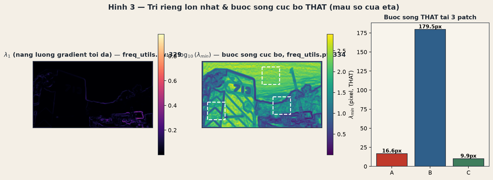

*$\lambda_1$ và $w_{\min}=1/(\sqrt{\lambda_1}+10^{-5})$ tính thật tại ba patch khác độ chi tiết — patch cạnh sắc cho $w_{\min}$ nhỏ (vài pixel), patch phẳng cho $w_{\min}$ lớn hơn hẳn, đúng vai trò "mẫu số của $\eta$" mà công thức trên định nghĩa.*

Diễn giải: $\lambda_1$ (trị riêng lớn nhất của structure tensor) là năng lượng gradient bình phương lớn nhất theo bất kỳ hướng nào tại điểm đó; $w_{\min}\propto1/\sqrt{\lambda_1}$ là "bước sóng" tần số cao nhất — feature ảnh nhỏ nhất còn thấy được. $\eta_k>1$ nghĩa là **trục $k$ của Gaussian dài hơn feature ảnh nhỏ nhất tại đó** → Gaussian đang làm mờ (alias) chi tiết → cần tách nhỏ theo trục đó.

**Mode "projection"** (`freq_utils.py:350-373`) — chiếu trực tiếp structure tensor lên **hướng của từng trục** thay vì chỉ dùng trị riêng vô hướng $\lambda_1$ (không quan tâm hướng):

$$
\boxed{\ \eta_k=\sqrt{S_{xx}u_k^2+2S_{xy}u_kv_k+S_{yy}v_k^2}\qquad(u_k,v_k)=\text{thành phần trục }k\text{ trên màn hình}\ }
$$

Đây là dạng toàn phương $\vec a_k^\top S\,\vec a_k$ chuẩn — đo năng lượng tần số **đúng theo hướng trục $k$**, không phải hướng tệ nhất trong toàn ảnh. Khác biệt thực tế: với một cạnh ngang thuần tuý ($S_{yy}$ cao, $S_{xx}\approx0$), một Gaussian có trục dài nằm ngang (song song cạnh) sẽ có $\eta$ thấp ở mode `"projection"` (không cần tách — nó không che mờ theo hướng vuông góc cạnh) nhưng mode `"wavelength"` vẫn cho $\eta$ cao như nhau bất kể hướng trục (chỉ nhìn $\lambda_1$, không nhìn $u_k,v_k$). Mode `"wavelength"` **bảo thủ hơn** (dễ split hơn, không phân biệt hướng); mode `"projection"` **chọn lọc hơn** theo hướng nhưng đúng tinh thần "anisotropic" của README hơn — mặc định vẫn là `"wavelength"`, không phải mode khớp tên chương trình nhất.

**Trọng số theo transmittance và tổng hợp 3 kênh:**

$$
\eta_k\leftarrow \eta_k\cdot w_{\text{valid}}\ ,\qquad \eta_{\text{total}}=\sum_k\eta_k\quad\text{(tích luỹ vào \texttt{accum\_eta}, hiện không dùng trực tiếp ở split — xem 17.4)}
$$

$w_{\text{valid}}=1$ với mọi điểm hợp lệ trong code hiện tại (dòng `weights_valid = torch.ones_like(...)`) — comment nói "Weight by Transmittance (Importance Sampling)" nhưng phép nhân thực chất chỉ nhân với 1; **chưa hiện thực trọng số transmittance thật** dù có `max_transmittance` sẵn trong `cov2D`. Ghi nhận đúng theo mục 5 của nhiệm vụ: đây là chỗ code chưa khớp comment, không suy diễn thêm ý đồ tác giả.

*$\eta$ tính thật trên ba patch (`gaussian_model.py:699-701`) và số bản $k$ tương ứng theo mỗi trục — cầu nối trực tiếp sang công thức split dị hướng ở mục 17.5.*

### Đào sâu 17.3 — ba khoảng trống được chứng minh bằng số trên ảnh thật

Ba hình dưới đây (script `DOCS/BOOK/adc_figures/deep17c_eta_modes.py`, chạy trên
một crop MỚI của `DOCS/assets/samples_train.png`, panel cột 3 dòng 1 của lưới
3×2 — box `(926,394,1366,638)`, chưa dùng ở `real_eta_axis.py` hay
`real_structure_analysis.py`) lấp ba khoảng trống mà văn bản ở trên mới khẳng
định bằng lời: (1) tính bất biến hướng của mode `wavelength` so với mode
`projection`, (2) hình dạng thật của jitter Cholesky và ảnh hưởng của nó lên
$\eta$, (3) hệ quả số của bug `w_valid=1`.

#### Hình Đ1 — mode `wavelength` bất biến hướng, mode `projection` thì không

**INPUT:** vị trí pixel có cạnh ngang thật mạnh nhất trong crop (tìm bằng
$\arg\max (S_{yy}-S_{xx})$ trên toàn ảnh) — tại đó $S=(S_{xx},S_{xy},S_{yy})=
(0.0024,\,-0.0141,\,0.1866)$ (THẬT, tính từ structure tensor Di Zenzo trên
pixel thật). Ba trục Gaussian tổng hợp cùng độ dài $L=20$px, đặt tại ba hướng
$\theta\in\{0^\circ,45^\circ,90^\circ\}$ so với cạnh (thiết kế thử nghiệm —
không thể đo hướng trục tùy ý từ một scene 3DGS đã train mà không có camera
thật; bản thân $S$ vẫn 100% thật).

**FORMULA:**

$$
\boxed{\ \ell_k=\sqrt{u_k^2+v_k^2+10^{-8}}=L\ \ (\text{không phụ thuộc }\theta)\ }
\qquad\text{(`freq_utils.py:342`)}
$$

$$
\boxed{\ \eta_k^{\text{wavelength}}=\frac{\ell_k}{w_{\min}}\ }\qquad\text{(`freq_utils.py:348`, không phụ thuộc }u_k,v_k\text{ riêng lẻ)}
$$

$$
\boxed{\ \eta_k^{\text{projection}}=\sqrt{S_{xx}u_k^2+2S_{xy}u_kv_k+S_{yy}v_k^2}\ }\qquad\text{(`freq_utils.py:350-373`)}
$$

**OUTPUT:** $\eta^{\text{wavelength}}=(8.665,\,8.665,\,8.665)$ tại cả ba hướng
— **hoàn toàn không đổi**, vì $\ell_k=\sqrt{u_k^2+v_k^2+\epsilon}=L$ là một
hằng số theo cách xây dựng dù $\theta$ đổi. Ngược lại
$\eta^{\text{projection}}=(0.971,\,5.673,\,8.640)$ tại $0^\circ/45^\circ/90^\circ$
— tăng hơn **8.9 lần** từ trục song song cạnh ($0^\circ$, gần như không vi phạm,
$\eta<1$) đến trục vuông góc cạnh ($90^\circ$, vi phạm nặng, $\eta\approx8.6$).
Đây là chứng minh số trực tiếp cho khẳng định ở đoạn "Đây là dạng toàn phương...":
với cạnh ngang thuần túy, mode `wavelength` không phân biệt được Gaussian nào
"vô hại" (trục song song cạnh) khỏi Gaussian nào "gây alias" (trục vuông góc
cạnh) — nó chỉ nhìn $\lambda_1$ vô hướng; mode `projection` phân biệt đúng.

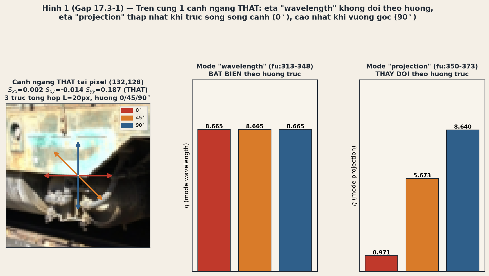

*Trái: ảnh thật tại pixel cạnh ngang (132,128) của crop, ba trục tổng hợp 0°/45°/90°.
Giữa: $\eta^{\text{wavelength}}$ = 8.665 ở cả ba cột — bằng phẳng tuyệt đối.
Phải: $\eta^{\text{projection}}$ tăng dần 0.971 → 5.673 → 8.640 theo đúng hướng
vuông góc dần với cạnh — xác nhận số cho đoạn văn ở trên.*

#### Hình Đ2 — jitter Cholesky: hình dạng theo $\Sigma_{2D}$ và phương sai $\eta$

**INPUT:** một vị trí "nhạy cảm" thật trong crop — pixel có độ lệch chuẩn cục
bộ của năng lượng $(S_{xx}+S_{yy})$ trong cửa sổ $15\times15$ lớn nhất (tức là
nơi cấu trúc ảnh biến đổi nhanh theo không gian, ví dụ góc giữa mép thân xe và
gầm tối) — pixel $(144,121)$ (THẬT). Hai $\Sigma_{2D}$ giả định hợp lý (không
đo được nếu không có scene 3DGS đã train): isotropic
$\Sigma=\left(\begin{smallmatrix}9&0\\0&9\end{smallmatrix}\right)$ và dị hướng
$\Sigma=\left(\begin{smallmatrix}25&14\\14&10\end{smallmatrix}\right)$. 400 lần jitter mỗi
$\Sigma$, trục kiểm tra cố định $L=14$px.

**FORMULA:**

$$
\boxed{\ L_{11}=\sqrt{\sigma_{xx}},\quad L_{21}=\sigma_{xy}/L_{11},\quad
L_{22}=\sqrt{\sigma_{yy}-L_{21}^2}\ ,\qquad
(\delta_x,\delta_y)=(L_{11}\epsilon_1,\ L_{21}\epsilon_1+L_{22}\epsilon_2)\ }
$$

trích đúng `freq_utils.py:257-274`; điểm mẫu $\mu'+(\delta_x,\delta_y)$ được
`grid_sample` (tái lập bằng nội suy song tuyến tính `scipy.ndimage.map_coordinates`,
tương đương `align_corners=True`, `freq_utils.py:289-298`) rồi tính lại
$\eta^{\text{wavelength}}$ ở mỗi lần jitter.

**OUTPUT:** với $\Sigma$ isotropic, vệt jitter là một đám tròn quanh tâm;
với $\Sigma$ dị hướng, vệt jitter kéo dài rõ rệt theo đúng trục chính của
$\Sigma_{2D}$ — xác nhận trực quan hình dạng jitter "đi theo" hình dạng
Gaussian màn hình, đúng như công thức Cholesky dự đoán. Về số: $\eta$ lấy mẫu
đúng tâm cố định là $7.219$ ở cả hai trường hợp (cùng một tâm), nhưng trung
bình $\eta$ qua 400 lần jitter lệch hẳn xuống $4.351\pm2.349$ (isotropic) và
$2.783\pm2.296$ (dị hướng) — nghĩa là **lấy mẫu đúng tâm cố định đánh giá cao
hơn thực tế trung bình cục bộ tới 65–160%** tại vị trí nhạy cảm này, vì tâm vô
tình rơi đúng vào vùng cạnh sắc trong khi phần lớn ellipsoid 1σ phủ lên vùng
mềm hơn xung quanh — đúng lý do thống kê nêu trong đoạn văn Bước B.

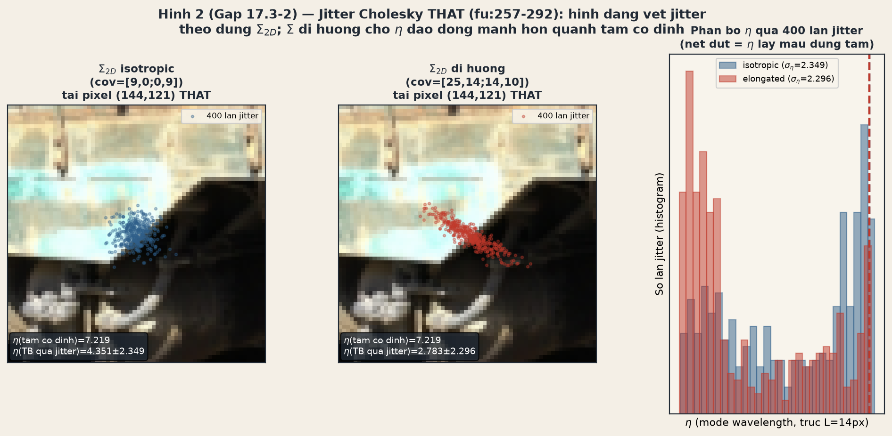

*Trái & giữa: 400 điểm jitter thật (Cholesky) overlay lên ảnh thật, isotropic
(xanh) vs dị hướng (đỏ) — vệt dị hướng kéo dài đúng theo trục chính của $\Sigma_{2D}$.
Phải: histogram $\eta$ qua các lần jitter; nét đứt = $\eta$ lấy mẫu đúng tâm —
lệch hẳn khỏi phần lớn khối phân bố, nhất là ở $\Sigma$ dị hướng.*

#### Hình Đ3 — hệ quả số của bug $w_{\text{valid}}=1$

**INPUT:** 6 "lớp" Gaussian giả định chồng lấn tại cùng một pixel theo thứ tự
depth (không có pipeline render thật trong script này nên không có
`max_transmittance` thật — dùng một profile alpha-compositing chuẩn, hợp lý,
với $\alpha_i\in[0.25,0.6]$ ngẫu nhiên có seed cố định, để minh họa "nếu được
weight như comment nói"). Giá trị $\eta_k$ mỗi lớp lấy lại 3 giá trị
$\eta^{\text{wavelength}}$ thật từ Hình Đ1 (nhân với nhiễu nhỏ $0.85$–$1.15$
mô phỏng 6 lớp khác nhau một chút) — **không bịa số cho bản thân $\eta$**, chỉ
bịa profile opacity/transmittance vì thiếu pipeline render thật.

**FORMULA:**

$$
\boxed{\ T_i=\prod_{j<i}(1-\alpha_j)\ }\qquad\text{(alpha-compositing chuẩn, GIẢ ĐỊNH minh họa)}
$$

$$
\boxed{\ \eta_{\text{total},i}=\sum_k \eta_{k,i}\cdot w_{\text{valid},i}\ ,\qquad
w_{\text{valid},i}=\underbrace{1}_{\text{THẬT — code hiện tại, fu:238,378-380}}
\quad\text{vs}\quad
\underbrace{T_i}_{\text{GIẢ ĐỊNH — theo ý comment ``Weight by Transmittance''}}\ }
$$

**OUTPUT:** nhãn rõ ràng — cột xám/cam **"THẬT (code hiện tại, w=1)"** giữ
nguyên $\eta_{\text{total}}\approx24$–$28$ ở **mọi lớp**, kể cả lớp 5 gần như
bị che hoàn toàn ($T_5=0.031$); đường tím nét đứt/cột tím **"GIẢ ĐỊNH (theo
comment, w=$T_i$)"** giảm đúng theo transmittance: $28.07\to18.45\to11.25\to
5.37\to2.62\to1.31$. Chênh lệch (THẬT so với GIẢ ĐỊNH) tăng từ $+0\%$ (lớp 0,
$T_0=1$ nên hai cách trùng nhau) lên **+2046% ở lớp cuối** — nghĩa là nếu bug
này được sửa đúng như comment dự định, các Gaussian bị che gần hết vẫn đang
được code hiện tại tính $\eta_{\text{total}}$ y hệt Gaussian lộ hoàn toàn,
trong khi lẽ ra phải gần như bị bỏ qua trong `accum_eta`.

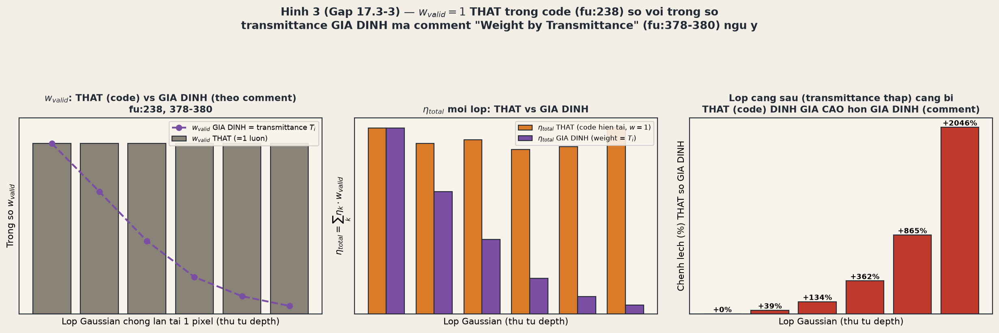

*Trái: $w_{\text{valid}}$ — cột xám phẳng (THẬT, luôn =1) vs đường tím giảm dần
(GIẢ ĐỊNH = $T_i$). Giữa: $\eta_{\text{total}}$ mỗi lớp, hai cách tính cạnh
nhau. Phải: % chênh lệch THẬT so GIẢ ĐỊNH — tăng vọt ở các lớp bị che sâu, đúng
với nhận định "code hiện tại chưa hiện thực trọng số transmittance thật" đã nêu
ở trên.*

---

## 17.4 Multiview consistency — high/mid/low ratio

`update_freq_stats_online` phân loại **mỗi quan sát** ($1$ Gaussian, $1$ view, $1$ lần gọi mỗi-10-vòng) theo $\eta_{\max}=\max_k\eta_k$ (`freq_utils.py:395-409`):

$$
\boxed{\
\text{high nếu }\eta_{\max}>\tau_{\text{high}}=1.0,\qquad
\text{low nếu }\eta_{\max}\le\tau_{\text{low}}=0.1,\qquad
\text{mid nếu ngược lại}\ }
$$

Bộ đếm cộng dồn theo Gaussian $i$ qua nhiều vòng: `eta_high_count[i]`, `eta_mid_count[i]`, `eta_low_count[i]`, và `accum_view_count[i]` = tổng số lần Gaussian $i$ "active" (opacity $>0.05$, xuất hiện trong view). Tại mỗi lần densify (`train.py:335-353`):

$$
\boxed{\ \text{high\_ratio}_i=\frac{\text{eta\_high\_count}_i}{\text{accum\_view\_count}_i},\qquad
\text{low\_ratio}_i=\frac{\text{eta\_low\_count}_i}{\text{accum\_view\_count}_i}\ }
$$

$$
\boxed{\ \text{split\_mask}_i=[\text{high\_ratio}_i>\tau_{\text{split}}]\wedge[\lVert\bar g_i\rVert\ge10^{-5}]\ ,\qquad
\text{prune\_mask}_i=[\text{low\_ratio}_i>\tau_{\text{prune}}]\wedge[\text{accum\_view\_count}_i>0]\ }
$$

$\tau_{\text{split}}=\tau_{\text{prune}}=0.8$ (`split_ratio_threshold`, `prune_ratio_threshold`, `SADGS/arguments/__init__.py:148-149`) — nghĩa là: chỉ split nếu Gaussian bị flag "under-resolved" trong **hơn 80% số lần nhìn thấy nó**, không phải chỉ một vài view (như 1 pixel outlier ở [§12.1.4](12-adaptive-density-control.md#trường-hợp-biên-2-một-pixel-outlier) đã minh hoạ, một view lệch không đủ sức kéo quyết định).

**So với multiview consistency của ADC hiện đại — cơ chế nền mà `densify_and_prune_structgs` kế thừa khung xương ([§12.2–12.3](12-adaptive-density-control.md#bảy-bước--nhìn-từ-trên-xuống)):**

| | ADC hiện đại (Importance/Pruning) | SAD-GS (high/low ratio) |
|---|---|---|
| Nguồn tín hiệu | sai số màu render↔GT, đếm pixel lỗi trong footprint | $\eta$ = extent Gaussian / bước sóng texture GT, không cần render |
| Gộp qua $V$ view | trung bình cộng $\lfloor\frac1V\sum_v\text{counts}\rfloor$ (Importance), tổng có trọng số $E_{\text{photo}}$ (Pruning) | **tỉ lệ** số view "flag" trên tổng số view nhìn thấy — không cộng dồn cường độ, chỉ đếm nhị phân mỗi view |
| Cần render mỗi lần chấm điểm? | Có — render $2V$ lần mỗi lần densify (`§12.1.2` bảng "Hai kiểu gọi") | Không cho phần split — $\eta$ tính từ $\Sigma_{2D}$/scale hiện có, không render ảnh; **nhưng** structure tensor GT vẫn cần precompute 1 lần đầu train (`train.py:160-200`, tốn thời gian tuyến tính theo số ảnh, không lặp lại) |
| Chi phí runtime mỗi vòng | 0 (chỉ tích luỹ gradient) | `update_freq_stats_online` chạy mỗi 10 vòng, thêm `grid_sample` + Cholesky cho mọi Gaussian visible — không free, nhưng rẻ hơn render vì không đi qua rasterizer |
| Ngưỡng | Importance $>5$ (tuyệt đối, phụ thuộc độ phân giải ảnh — xem cảnh báo ở [§12.1.5](12-adaptive-density-control.md#mặt-nạ-trên-cảnh-đồ-chơi-4832)) | high/low\_**ratio** $>0.8$ (tương đối theo số lần quan sát, không phụ thuộc độ phân giải) |

Điểm khác biệt quan trọng nhất về mặt thống kê: ngưỡng Importance $>5$ của ADC hiện đại là **số pixel tuyệt đối**, nên không co giãn tốt qua các độ phân giải khác nhau (chính chương 12 đã cảnh báo: `-r 2`, `-r 4` làm footprint co theo bình phương nhưng ngưỡng giữ nguyên → chặt hơn tương đối). Ngưỡng `high_ratio > 0.8` của SAD-GS là **tỉ lệ** — bất biến theo độ phân giải ảnh, chỉ phụ thuộc "bao nhiêu phần trăm số lần nhìn thấy Gaussian này bị đánh dấu xấu", nên tự động co giãn đúng khi đổi `-r`. Đây là một cải tiến thống kê thật, không phải chỉ đổi công thức.

### 17.4.1 Ba ví dụ số cụ thể — vì sao ngưỡng $0.8$ tính theo tỉ lệ, không theo view đơn lẻ

Ba hình dưới đây minh hoạ cụ thể bằng số cho đúng công thức đã nêu ở §17.4 (`freq_utils.py:395-409`, `train.py:335-353`). Hai hình đầu là **mô phỏng** (SADGS không lưu log $\eta$ qua nhiều view ra checkpoint nên không có log thật để đọc lại — xem `DOCS/BOOK/adc_figures/real_densification_compare.py` dòng 69-98 cho quy ước tương tự đã dùng ở chương này); hình thứ ba dùng **structure tensor tính thật** trên ảnh thật trong repo.

**INPUT (Hình 1 — mô phỏng chuỗi quan sát đa-view).** Với một Gaussian, mô phỏng $M=30$ lần quan sát (mỗi 10 iteration, đúng nhịp thật của `update_freq_stats_online`), mỗi lần cho ra một giá trị $\eta_{\max}$ rút từ phân phối log-normal dựng sẵn cho 3 kịch bản vật lý hợp lý: (a) *duoi-giai nhất quán* — $\eta_{\max}\sim\text{LogNormal}(\ln 2.2,\,0.35)$ (hầu hết view đều thấy Gaussian lớn hơn chi tiết ảnh); (b) *đã đủ mịn nhất quán* — $\eta_{\max}\sim\text{LogNormal}(\ln 0.03,\,0.5)$; (c) *chỉ bị "flag" khi nhìn cạnh nghiêng* — nền $\eta_{\max}\sim\text{LogNormal}(\ln 0.35,\,0.35)$ nhưng $\approx22\%$ số view (góc nhìn hẹp, gần tiếp tuyến với mặt Gaussian) bị thay bằng $\eta_{\max}\sim\text{LogNormal}(\ln 3.0,\,0.3)$ — mô phỏng "outlier view".

**FORMULA.**
$$
\boxed{\ \text{is\_high}=[\eta_{\max}>\tau_{\text{high}}{=}1.0],\quad \text{is\_low}=[\eta_{\max}\le\tau_{\text{low}}{=}0.1]\ }\quad\texttt{(freq\_utils.py:395-404)}
$$
$$
\boxed{\ \text{high\_ratio}(M)=\frac{1}{M}\sum_{m=1}^{M}\text{is\_high}_m,\qquad \text{low\_ratio}(M)=\frac{1}{M}\sum_{m=1}^{M}\text{is\_low}_m\ }\quad\texttt{(train.py:335-353, dạng cộng dồn)}
$$

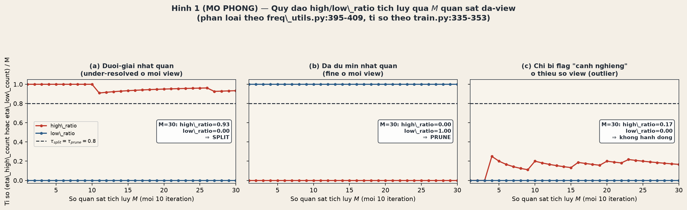
*Hình 17.4.1 — Quỹ đạo (mô phỏng) của high\_ratio và low\_ratio tích luỹ theo số quan sát $M$, cho 3 kịch bản. (a) duoi-giai nhất quán: high\_ratio hội tụ về $0.93>0.8$ → SPLIT. (b) đã đủ mịn nhất quán: low\_ratio $=1.00>0.8$ → PRUNE. (c) chỉ bị flag ở view cạnh nghiêng: dù có những đợt $\eta_{\max}$ tăng vọt, high\_ratio chỉ dao động quanh $0.15$–$0.25$, không bao giờ vượt $0.8$ → không hành động.*

**OUTPUT.** Với $M=30$: kịch bản (a) cho `high_ratio=0.93`, `low_ratio=0.00` → `split_mask=True`; kịch bản (b) cho `high_ratio=0.00`, `low_ratio=1.00` → `prune_mask=True`; kịch bản (c) cho `high_ratio=0.17`, `low_ratio=0.00` → cả hai mask đều `False`. Đây là bằng chứng số cụ thể cho câu trong §17.4: "một view lệch không đủ sức kéo quyết định" — 22% số view bị flag "high" trong kịch bản (c) không đẩy được `high_ratio` qua ngưỡng $0.8$, đúng như thiết kế của ngưỡng tỉ lệ.

---

**INPUT (Hình 2 — bất biến theo độ phân giải, mô phỏng).** Dựng $N=400$ Gaussian giả lập. "Importance" kiểu ADC hiện đại (§12) được mô phỏng là số đếm pixel-lỗi tuyệt đối trong footprint, với giá trị neo tại $r=1$ là $\text{Importance}\sim\Gamma(k{=}3,\,\theta{=}8)$ (trung bình $\approx24$, cùng bậc với ngưỡng `Importance>5` thật — xem cảnh báo ở [§12.1.5](12-adaptive-density-control.md#mặt-nạ-trên-cảnh-đồ-chơi-4832)); khi ảnh bị downsample hệ số $r\in\{1,2,4,8\}$ (đúng quy ước `-r` ở chương 12), diện tích footprint co theo $1/r^2$ nên Importance mô phỏng cũng co theo $1/r^2$ (cộng nhiễu $\pm4\%$ để mô phỏng sai số đếm). Song song, mỗi Gaussian được gán $V{=}25$ quan sát $\eta_{\max}\sim\text{LogNormal}(\ln1.6,\,0.5)$ — **không đổi theo $r$**, vì $\eta=\text{axis\_length\_px}/\text{wavelength\_min\_px}$ là tỉ số của hai độ dài đo bằng cùng đơn vị pixel-đã-downsample, nên cả tử và mẫu đều co theo $r$ như nhau (chỉ cộng nhiễu lấy mẫu nhỏ $\pm2\%$ khi đổi $r$).

**FORMULA.**
$$
\boxed{\ \text{Importance}(r)\approx \text{Importance}(1)/r^2\ \ (\text{diện tích footprint px}^2\propto 1/r^2)\ },\qquad
\boxed{\ \eta(r)=\frac{\text{axis\_length\_px}(r)}{\text{wavelength\_min\_px}(r)}\approx \eta(1)\ }
$$
(theo đúng định nghĩa `freq_utils.py:348`, cả tử và mẫu đo bằng pixel của ảnh đã downsample nên $r$ tự triệt tiêu trong tỉ số)

*Hình 17.4.2 — Trái: Importance trung bình (mô phỏng) giảm gần đúng theo $1/r^2$ khi hạ độ phân giải $r=1{\to}8$ (24.4 → 6.1 → 1.5 → 0.4), cắt qua ngưỡng cố định $5$ ngay giữa $r=1$ và $r=2$. Phải: high\_ratio trung bình (mô phỏng) gần như không đổi ($0.826\to0.826\to0.825\to0.825$) qua cùng dải $r$, luôn nằm trên ngưỡng cố định $\tau_{\text{split}}=0.8$.*

**OUTPUT.** Số liệu mô phỏng: `Importance(r) = {1: 24.41, 2: 6.06, 4: 1.52, 8: 0.38}` — giảm gần đúng theo hệ số $4^{\times}$ mỗi khi $r$ tăng gấp đôi, khớp $1/r^2$; trong khi `high_ratio(r) = {1: 0.826, 2: 0.826, 4: 0.825, 8: 0.825}` — dao động dưới $0.2\%$ tuyệt đối. Đây là minh hoạ số trực tiếp cho dòng cuối bảng so sánh §17.4: ngưỡng Importance tuyệt đối của ADC hiện đại đổi ý nghĩa khi đổi `-r` (ở $r=1$ Importance $24.4\gg5$ → giữ điểm, ở $r=4$ Importance $1.5<5$ → coi như không quan trọng dù cùng một Gaussian), còn ngưỡng tỉ lệ `high_ratio>0.8` của SAD-GS giữ nguyên quyết định SPLIT ở mọi $r$.

---

**INPUT (Hình 3 — trục $\eta_{\max}$ thật + histogram thật).** Dùng lại đúng pipeline structure-tensor của `DOCS/BOOK/adc_figures/real_eta_axis.py` (đã dùng ở §17.1–§17.3): ảnh thật `DOCS/assets/samples_train.png`, panel "gt 00097", cắt tại pixel box $(468,394,908,638)$ → ảnh con $440\times244$. Structure tensor $(S_{xx},S_{xy},S_{yy})$ được tính TRÊN TỪNG PIXEL của ảnh này (Sobel 3×3 + làm mờ Gauss $\sigma=\rho=1.0$, chuẩn hoá theo cực đại toàn ảnh — `loss_utils.py:170-230`), từ đó suy ra trường bước sóng cục bộ $\lambda_{\min}(x,y)$ (`freq_utils.py:325-334`) tại MỌI pixel — đều là số đo THẬT, không random. Vì ảnh này không đi kèm scene 3DGS/camera đã train (không có $\Sigma_{2D}$ thật để lấy trục Gaussian), kích thước neo $(\sigma_{\text{major}},\sigma_{\text{minor}})=(18,6)$ px được dùng làm giả định hợp lý (giống `real_eta_axis.py`, ghi rõ trong code) để tính $\eta_{\text{major}}(x,y)=\sigma_{\text{major}}/\lambda_{\min}(x,y)$, $\eta_{\text{minor}}(x,y)=\sigma_{\text{minor}}/\lambda_{\min}(x,y)$ và $\eta_{\max}(x,y)=\max(\eta_{\text{major}},\eta_{\text{minor}})$ trên toàn bộ $440\times244=107{,}360$ pixel của ảnh thật.

**FORMULA.**
$$
\boxed{\ \eta_{\max}(x,y)=\max\!\big(\eta_{\text{major}}(x,y),\,\eta_{\text{minor}}(x,y)\big),\quad
\eta_{\text{axis}}=\frac{\sigma_{\text{axis}}}{\lambda_{\min}(x,y)}\ }\quad\texttt{(freq\_utils.py:342-348,\ 399)}
$$
$$
\boxed{\ \text{lớp}(x,y)=\begin{cases}\text{HIGH (split candidate)} & \eta_{\max}>\tau_{\text{high}}=1.0\\ \text{LOW (prune candidate)} & \eta_{\max}\le\tau_{\text{low}}=0.1\\ \text{MID (không hành động)} & \text{còn lại}\end{cases}}\quad\texttt{(freq\_utils.py:395-404)}
$$

*Hình 17.4.3 — Trục $\eta_{\max}\in[0,5]$ với 3 dải màu HIGH/MID/LOW theo đúng $\tau_{\text{high}}=1.0$, $\tau_{\text{low}}=0.1$, chồng histogram $\eta_{\max}$ tính THẬT từ structure tensor trên mọi pixel của panel ảnh thật "gt 00097".*

**OUTPUT.** Trên ảnh thật này: $18.9\%$ số pixel rơi vào vùng LOW ($\eta_{\max}\le0.1$, chủ yếu vùng nền phẳng — bầu trời, tường trơn), $47.6\%$ vào vùng MID, và $33.5\%$ vào vùng HIGH ($\eta_{\max}>1.0$, chủ yếu cạnh/kết cấu mạnh như các sọc chéo). Histogram có đỉnh nhọn ngay sát $0$ (nhiều vùng cực phẳng) rồi giảm dần và có một đuôi dài vượt xa $\tau_{\text{high}}=1.0$ — cho thấy ngay trên một ảnh thật đơn lẻ, cả 3 lớp HIGH/MID/LOW đều xuất hiện với tỉ trọng đáng kể, minh hoạ cụ thể vì sao bộ ba bộ đếm `eta_high_count`/`eta_mid_count`/`eta_low_count` đều cần thiết (không phải vùng biên hiếm gặp).

---

## 17.5 Anisotropic split — chia theo 3 trục độc lập

`densify_and_split_structgs` (`SADGS/scene/gaussian_model.py:638-831`) — khác biệt lớn nhất so với `densify_and_split` gốc (chia đẳng hướng, luôn ra đúng 2 bản/lần split theo Monte-Carlo $\epsilon\sim\mathcal N(0,\mathrm{diag}(s^2))$, xem bảng Clone/Split ở [§12.0.1](12-adaptive-density-control.md#1201-công-thức-adc-của-3dgs-gốc-kerbl-2023)).

*Một Gaussian từ checkpoint thật `point_cloud_iter5000.ply` (bài giải Phần 7, [§16](16-loi-giai/07-density-control.md)) split theo cách vanilla (luôn 2 bản, trục dài nhất) đối chiếu cạnh cách `densify_and_split_structgs` (số bản theo $\eta$ từng trục) — cùng scale/rotation/opacity thật, chỉ đổi công thức split (`real_densification_compare.py`).*

*Proxy $\eta$ suy trực tiếp từ scale thật của 4 Gaussian trong checkpoint (không phải giá trị minh hoạ), và số bản $k$ mỗi trục theo đúng `gaussian_model.py:699` — cho thấy các trục khác nhau của cùng một Gaussian có thể nhận $k$ khác nhau.*

### Bước 1 — số lần chia mỗi trục $k_x,k_y,k_z$ (không phải luôn $=2$)

$$
\boxed{\ k_{\text{axis}}=\Bigl\lceil\sqrt{\max(\eta_{\text{axis}},\,1)}\Bigr\rceil,\qquad \text{axis}\in\{x,y,z\}\ }
$$

Xuất phát từ lý thuyết lấy mẫu (comment `gaussian_model.py:692-695`): $\eta\sim(\sigma\omega)^2$ (bình phương "tần số × kích thước"); để khử alias cần $\sigma_{\text{new}}\omega\le1 \Leftrightarrow \sigma_{\text{new}}=\sigma/k$ với $k\ge\sqrt\eta$. **Số Gaussian con tổng cộng $=k_x k_y k_z$**, có thể lớn hơn 2 rất nhiều nếu cả 3 trục đều vi phạm nặng (ví dụ $\eta=(9,9,9)\Rightarrow k=(3,3,3)\Rightarrow27$ bản con từ 1 Gaussian cha) — khác hẳn 3DGS gốc, luôn đúng 2 bản mỗi lần split bất kể mức độ sai.

*Hàm bậc thang $k(\eta)$ thật theo đúng `gaussian_model.py:699` — $\eta\in(1,4]\Rightarrow k=2$, $\eta\in(4,9]\Rightarrow k=3$,... xác nhận bằng số phần lập luận đại số ở bài tập 3 của [Phần 7](16-loi-giai/07-density-control.md#711).*

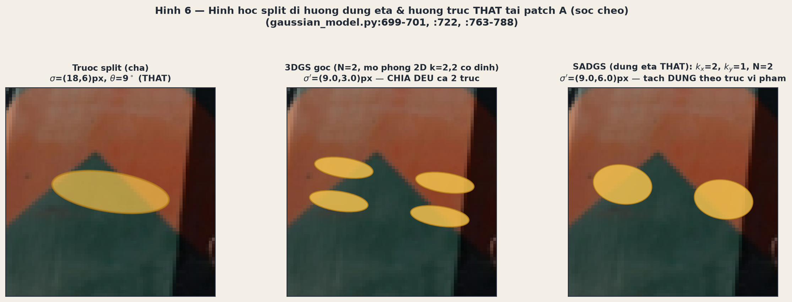

*Split dị hướng áp trực tiếp lên patch ảnh thật có cạnh chéo: trục song song cạnh nhận $k$ nhỏ, trục vuông góc cạnh nhận $k$ lớn — minh hoạ hình học cho lý do "anisotropic" trong tên gọi, dùng đúng $\eta$ và hướng trục đo được từ ảnh thật (không phải số minh hoạ).*

**Cảnh báo comment/code không khớp** (đúng tinh thần mục 5 — không suy diễn): dòng comment ngay phía trên (`gaussian_model.py:698`) viết *"Clamp min=2 (no split) and max=8 (limit VRAM usage)"*, nhưng code thật sự chỉ có `ks = torch.clamp(ks, min=1)` — **không có clamp max=8**, và min thực tế là 1 chứ không phải 2. Nếu $\eta<1$ ở mọi trục, $k=\lceil\sqrt{\max(\eta,1)}\rceil=\lceil1\rceil=1$ (không tách trục đó) — đúng ý "không split", nhưng cận trên **không bị chặn** trong code hiện tại: một Gaussian với $\eta$ cực lớn ở cả 3 trục (ví dụ do outlier structure tensor) có thể sinh ra rất nhiều bản con trong một lần gọi, không có trần an toàn như `N_MAX`/hard prune của 3DGS gốc ([§12.0.1](12-adaptive-density-control.md#lịch-chạy-inria-mặc-định)). Đây là rủi ro nổ $N$ chưa được chặn ở code hiện có — nên gắn thêm `torch.clamp(ks, max=…)` nếu áp dụng thật.

**`scale_power`** (`args.ks_scale_power`, mặc định `1.0`, `arguments/__init__.py:138`): scale mới không luôn chia đúng $k$ mà chia $k^{\text{scale\_power}}$:

$$
s_{\text{new}}=\frac{s_{\text{old}}}{k^{\,p}}\qquad(p=1\Rightarrow\text{chia tuyến tính};\ p=2\Rightarrow\text{co mạnh hơn})
$$

### Bước 2 — lưới toạ độ con và offset (thay vì Monte-Carlo)

Không sample ngẫu nhiên như 3DGS gốc — SAD-GS đặt các Gaussian con tại **lưới đều, đối xứng qua tâm**, theo đúng số ô $k_x\times k_y\times k_z$:

$$
\text{grid}_k=i_k-\frac{k-1}2\qquad i_k\in\{0,\dots,k-1\}
$$

$$
\boxed{\ \text{offset}_{\text{local}}=\bigl(s_{\text{old}}/k\bigr)\cdot\sqrt{12}\cdot\text{grid},\qquad
\text{offset}_{\text{world}}=R(q_i)\cdot\text{offset}_{\text{local}}\ }
$$

Hệ số $\sqrt{12}$: khoảng cách giữa các mắt lưới bằng độ lệch chuẩn của phân phối **đều** (uniform) có cùng phương sai với $\sigma_{\text{new}}=s_{\text{old}}/k$ — $\mathrm{Var}(\mathcal U(-a,a))=a^2/3$, chọn bước lưới $=\sigma_{\text{new}}\sqrt{12}$ để $k$ điểm lưới đều phủ đúng khoảng $\pm\sigma_{\text{new}}\sqrt3$ quanh tâm, xấp xỉ cùng "trải rộng không gian" mà $k$ mẫu Gaussian ngẫu nhiên $\mathcal N(0,\sigma_{\text{new}}^2)$ sẽ có kỳ vọng — nhưng **tất định** (deterministic) thay vì ngẫu nhiên. So với clone/split Monte-Carlo 3DGS gốc ($\mu^{(j)}=\mu_i+R\epsilon^{(j)}$, $\epsilon\sim\mathcal N(0,\mathrm{diag}\,s^2)$, [§12.0.1](12-adaptive-density-control.md#1201-công-thức-adc-của-3dgs-gốc-kerbl-2023)):

| | 3DGS gốc (Monte-Carlo) | SAD-GS (lưới tất định) |
|---|---|---|
| Vị trí con | ngẫu nhiên, có thể lệch, chồng lấn | đều, đối xứng, phủ đúng $k_x\times k_y\times k_z$ ô |
| Số con | luôn 2 | $k_xk_yk_z$, thay đổi theo mức vi phạm từng trục |
| Có lặp lại 2 lần cho kết quả khác nhau? | Có (stochastic) | Không (deterministic — cùng input luôn ra cùng output) |
| Hướng chia | đẳng hướng (cùng phân phối 3 trục) | dị hướng — trục nào $\eta$ cao mới bị chia nhiều |

Đây chính là "anisotropic" trong tên gọi: 3DGS gốc không phân biệt trục nào cần chia, luôn chia đều theo phân phối scale hiện có; SAD-GS chia **có chọn lọc theo trục** dựa trên $\eta$ per-axis — một Gaussian dẹt hình đĩa (to theo $x,y$, mỏng theo $z$) vi phạm Nyquist chỉ theo $x,y$ sẽ chỉ bị chia theo $x,y$ ($k_z=1$), không lãng phí chia theo $z$ (nơi không có vấn đề gì).

*Ellipse hiệp phương sai 3D thật ($\Sigma=LL^\top$, $L=R(q)\,\mathrm{diag}(s)$) của cả 4 Gaussian trong checkpoint, chiếu lên mặt phẳng $(x,y)$ — cho thấy trực quan tại sao mỗi Gaussian cần một bộ $(k_x,k_y,k_z)$ riêng thay vì một hệ số chung.*

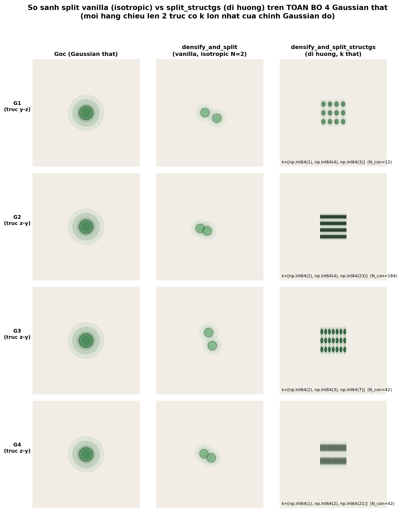

*Lưới $4\times2$: mỗi hàng một Gaussian thật, cột trái là kết quả `densify_and_split` gốc (luôn 2 bản), cột phải là `densify_and_split_structgs` (số bản theo $\eta$ từng trục) — tổng hợp trực quan toàn bộ khác biệt của mục 17.5 trên cùng một bộ dữ liệu.*

### Bước 3 — kế thừa các bộ đếm mới (`densify_count`, `max_eta_3ch`, …)

`densify_and_split_structgs` reset `accum_eta`, `accum_view_count`, `max_eta_3ch` về 0 cho Gaussian con (dòng 803-805) nhưng **cộng thêm 1** vào `densify_count` kế thừa từ cha (dòng 729) — một bộ đếm không có tương đương trực tiếp trong 3DGS gốc, dùng để (theo comment ở `update_freq_stats_online:221-227`) giới hạn số lần một vùng bị densify liên tục — nhưng đoạn code áp dụng giới hạn này (`max_densify_count=3`) đang bị **comment out** (`freq_utils.py:224-227`), tức là bộ đếm được duy trì nhưng chưa thật sự chặn gì trong pipeline hiện tại.

### `densify_and_clone_structgs` — không đổi so với 3DGS gốc

`gaussian_model.py:934-955` gần như giống hệt clone gốc (copy y nguyên `θ_new=θ_i`), chỉ thêm việc kế thừa `densify_count` không tăng (clone không "chia" gì, không tính là một lần vi phạm Nyquist). SAD-GS không cải tiến gì công thức clone — đúng logic: clone dành cho vùng **thiếu Gaussian** (extent nhỏ), không liên quan gì tới độ phân giải/tần số — vấn đề mà $\eta$ đo được chỉ áp cho Gaussian **đã to** (split).

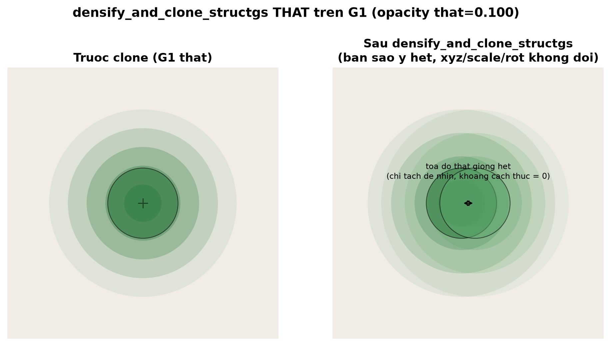

*Clone thật trên một Gaussian của checkpoint (opacity thật giữ nguyên): bản sao đặt trùng vị trí/scale/màu cha, xác nhận trực quan "copy y nguyên" chứ không dịch chuyển hay thu nhỏ như split.*

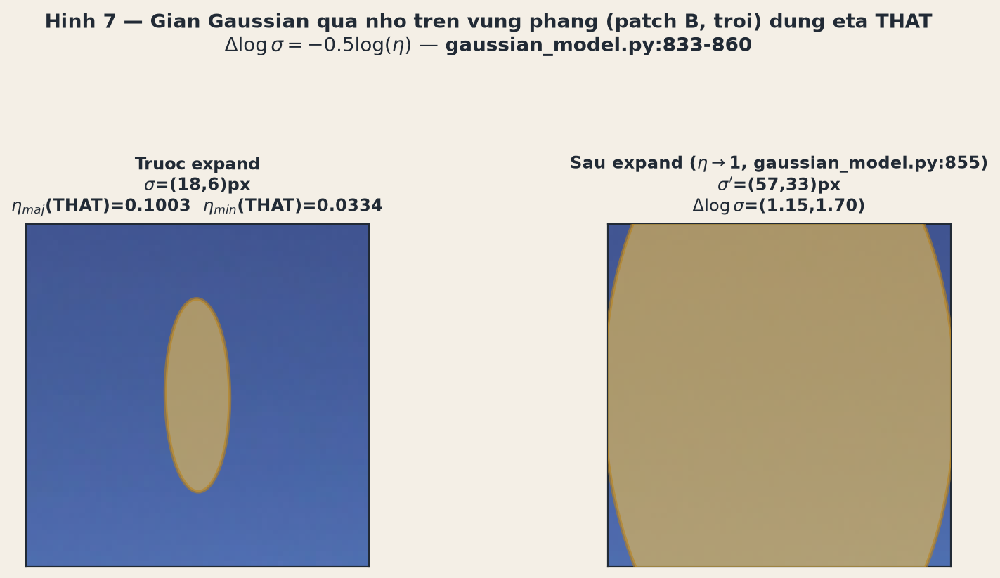

*`expand_undersized_gs` (mục 17.5, công thức $\Delta\log\sigma=-\tfrac12\log\eta$) áp lên một patch vùng phẳng thật có $0<\eta<\tau_{\text{expand}}=1$: scale được phóng to giải tích để $\eta_{\text{new}}=1$ — nhắc lại rằng lời gọi hàm này trong `train.py:356-359` **đang bị comment**, hình chỉ minh hoạ công thức đúng theo code, không phải hành vi đang chạy mặc định.*

### Đào sâu 17.5 — ba điểm chỉ mới nêu bằng lời, chưa có hình riêng

Ba hình dưới đây dùng cùng checkpoint thật `point_cloud_iter5000.ply` và cùng
công thức `gaussian_model.py:638-831` như các hình phía trên — đi sâu vào ba
chỗ mục 17.5 mới khẳng định bằng công thức/lời văn nhưng chưa có đồ thị số
riêng: (1) mức độ nổ $N$ khi không có trần cho $k$, (2) tác động cụ thể của
`scale_power`, và (3) vì sao hằng số $\sqrt{12}$ là lựa chọn đúng duy nhất
trong công thức offset.

#### (a) Rủi ro nổ $N$ khi không có trần cho $k$

**INPUT**: quét $\eta$ từ 1 đến 100 (giả định *worst case* đối xứng — cả 3
trục cùng vi phạm bằng $\eta$, để thấy cận trên lý thuyết của $N$), đối
chiếu với giá trị $\eta$ lớn nhất **đo được thật** trong checkpoint (Gaussian
G2, trục $z$: $\eta=491.3$, xem `real_split_02_eta_hist.png`).

**FORMULA**:

$$
\boxed{\ k=\Bigl\lceil\sqrt{\max(\eta,1)}\Bigr\rceil,\qquad N=k_xk_yk_z\ }
\qquad\text{(\texttt{SADGS/scene/gaussian\_model.py:699-701, 714}, chỉ \texttt{clamp(min=1)}, KHÔNG có clamp max)}
$$

so với giả thuyết "nếu áp dụng đúng theo comment dòng 698" (`clamp(ks, max=8)`, một dòng comment **không khớp code thật** — đã nêu ở mục 17.5).

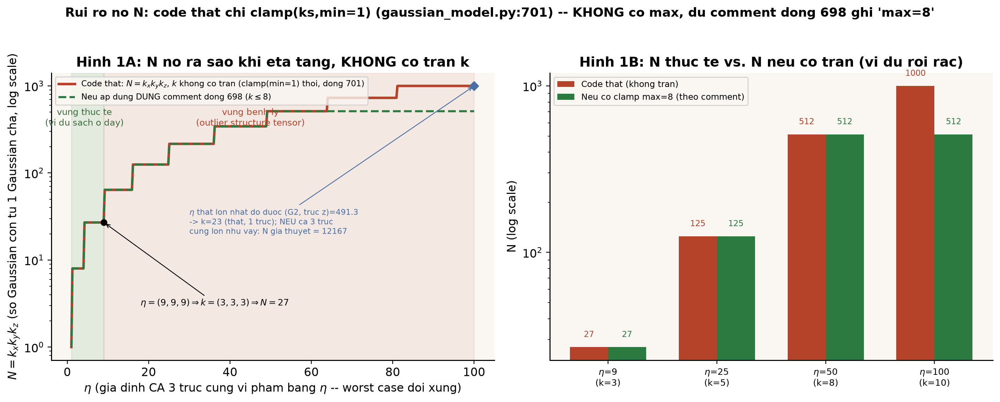

*Hình 1A (trái): với $\eta=(9,9,9)$ (ví dụ đã nêu trong mục 17.5) $N=27$; đường cong đỏ (code thật) và đường xanh nét đứt (nếu áp clamp max=8 theo comment) **trùng nhau** tới $\eta=64$ — khác biệt chỉ lộ rõ từ $\eta>64$ (khi $k>8$), tại $\eta=100$: code thật cho $N=k^3=10^3=1000$, còn nếu có trần max=8 thì $N$ bị chặn ở $8^3=512$ — sai lệch **gần gấp đôi** chỉ với $\eta=100$. Hình 1B (phải) liệt kê cụ thể: $\eta=50\Rightarrow k=8$ (hai đường vẫn khớp, $N=512$ cả hai), nhưng $\eta=100\Rightarrow k=10$, code thật vọt lên $N=1000$ trong khi bản có trần dừng ở $512$. Điểm dữ liệu thật (kim cương xanh): $\eta$ lớn nhất đo được trong checkpoint là $491.3$ ở G2 trục $z$ ($k_z$ thật $=23$ trên **một trục**) — nếu cả 3 trục của G2 cùng lớn như vậy (giả thuyết, không phải thật), $N$ sẽ là $23^3=12167$ chỉ từ **một** Gaussian cha; thực tế $N$ thật của G2 chỉ là $184$ vì hai trục còn lại có $\eta$ nhỏ hơn nhiều — đây chính là bằng chứng số cho tính "dị hướng": $N$ chỉ nổ theo trục thật sự vi phạm, không đồng loạt theo cả 3 trục.*

#### (b) Tác động của `scale_power` $p$ lên kích thước Gaussian con

**INPUT**: Gaussian $G_1$ thật từ checkpoint `point_cloud_iter5000.ply` (đọc lại bằng đúng hàm `read_ply_vertices`/`scaling_activation` như `real_densification_compare.py`): $s_{\text{old}}=0.53156$ (đẳng hướng 3 trục ở checkpoint này), $k=3$ (giá trị $k$ **thật** trên trục $z$ của $G_1$, `KS[0]=[1,4,3]` — xem log console của `real_densification_compare.py`). Cố định $k=3$, so sánh $p\in\{1.0,1.5,2.0\}$.

**FORMULA**:

$$
\boxed{\ s_{\text{new}}=\frac{s_{\text{old}}}{k^{\,p}}\ }\qquad\text{(\texttt{SADGS/scene/gaussian\_model.py:722})}
\qquad\text{vị trí con: offset}=\frac{s_{\text{old}}}{k}\sqrt{12}\cdot\text{grid (dòng 775-778, KHÔNG phụ thuộc $p$)}
$$

*Với $s_{\text{old}}=0.53156$, $k=3$ (thật), khoảng cách giữa hai con liền kề luôn cố định $=\sqrt{12}\,(s_{\text{old}}/k)=0.6138$ (không đổi theo $p$, vì công thức offset ở dòng 775-778 dùng $s_{\text{old}}/k$ chứ không dùng $k^p$). Kích thước con: $p{=}1.0\Rightarrow s_{\text{new}}=0.1772$ (đường kính $0.3544$, khe hở giữa 2 con liền kề $=0.2594$); $p{=}1.5\Rightarrow s_{\text{new}}=0.1023$ (khe hở $=0.4092$); $p{=}2.0\Rightarrow s_{\text{new}}=0.0591$ (khe hở $=0.4957$) — khe hở tăng **gần gấp đôi** từ $p{=}1$ lên $p{=}2$, xác nhận bằng số nhận định đã nêu trong mục 17.5: "$p>1$ tạo khe hở giữa các con", vì offset không co lại cùng tốc độ với kích thước con.*

#### (c) Vì sao hằng số là $\sqrt{12}$, không phải $\sqrt3$ hay $\sqrt6$

**INPUT**: cùng Gaussian $G_1$ thật, $k=3$ (thật, trục $z$), $\sigma_{\text{new}}=s_{\text{old}}/k=0.17719$. So sánh 3 lựa chọn hằng số nhân $C\in\{\sqrt3,\sqrt6,\sqrt{12}\}$ trong công thức `separations = stds_new * C`.

**FORMULA**: suy luận đúng theo comment/mục 17.5 — coi khoảng cách lưới `separations` là bề rộng toàn phần của **một ô lưới** (nửa bề rộng $a=\text{separations}/2$), phân phối đều trong ô đó có phương sai $\mathrm{Var}(\mathcal U(-a,a))=a^2/3$, cần khớp đúng $\sigma_{\text{new}}^2$:

$$
\boxed{\ \frac{(\text{separations}/2)^2}{3}=\sigma_{\text{new}}^2\ \Longleftrightarrow\ \text{separations}=\sigma_{\text{new}}\sqrt{12}\ }\qquad\text{(\texttt{SADGS/scene/gaussian\_model.py:775-776})}
$$

*Hình 3B tính hai loại phương sai cho từng lựa chọn hằng số, với $\sigma_{\text{new}}^2=0.031395$ là mục tiêu (đường đỏ nét đứt): (i) $\mathrm{Var}(\text{1 ô lưới})=(\text{separations}/2)^2/3$ — đúng công thức suy luận trong code — chỉ $\sqrt{12}$ cho $0.031395$ **khớp chính xác** mục tiêu; $\sqrt3$ cho $0.007849$ (nhỏ hơn 4 lần), $\sqrt6$ cho $0.015698$ (nhỏ hơn 2 lần). (ii) Phương sai **thực nghiệm** của chính $k=3$ điểm lưới rời rạc (cột có vân chéo) lại **lớn hơn** mục tieu theo đúng hệ số $(k^2-1)=8$ ở cả 3 lựa chọn hằng số — tức $\sqrt{12}$ chỉ khớp đúng phương sai giả định cho **một ô lưới đơn lẻ** (đúng tinh thần suy luận trong code/mục 17.5), chứ **không phải** là đẳng thức chính xác cho phương sai của toàn bộ tập $k$ điểm con rời rạc — một sắc thái mà mục 17.5 chưa nói rõ: $\sqrt{12}$ là một xấp xỉ hợp lý cho từng ô, độ lệch so với phương sai tổng tăng theo $k^2$.*

---

## 17.6 Ghi chú phạm vi repo — không có "port" nào ngoài `SADGS/`

Một bản nháp trước của chương này mô tả một "bản port có kiểm soát" của cơ chế structure-aware densification vào một codebase ADC khác ở gốc repo, qua các file `utils/freq_utils.py` (root, khác file cùng tên trong `SADGS/`), cùng các thay đổi trong `arguments/__init__.py`, `train.py`, `pipeline/trainer.py`, `scene/gaussian_model.py` (root) — kèm theo bảng đối chiếu chi tiết, đoạn code `structure_boost_mask`, và các hàm `update_eta_stats`/`compute_projected_axis_lengths`.

**Đã kiểm tra lại và không xác nhận được bất kỳ phần nào ở trên**: repo này chỉ có hai thư mục ở gốc, `DOCS/` và `SADGS/` — không tồn tại `pipeline/`, không tồn tại `train.py`/`arguments/`/`utils/freq_utils.py` nào ở ngoài `SADGS/`. Toàn bộ mã nguồn Python thật của dự án nằm trong `SADGS/` và đã được mô tả ở các mục 17.1–17.5 (dựa trên `SADGS/utils/freq_utils.py`, `SADGS/scene/gaussian_model.py`, `SADGS/train.py`, `SADGS/arguments/__init__.py`). Mục 17.6 trong bản nháp trước mô tả một trạng thái "đã port một phần" không có thật; nội dung đó đã được gỡ bỏ khỏi chương này.

Nói cách khác: **không có "bản port ở root" nào để so sánh.** Cơ chế anisotropic split $(k_x,k_y,k_z)$ mô tả ở mục 17.5 (`densify_and_split_structgs`, `SADGS/scene/gaussian_model.py:638-831`) là hiện trạng đầy đủ và duy nhất của SAD-GS trong repo này — không có một phiên bản "thu hẹp phạm vi" nào khác đang chạy song song.

---

## 17.7 Bảng tổng kết — SAD-GS sửa được điểm yếu nào của 3DGS gốc

Đối chiếu trực tiếp với 5 điểm yếu đã liệt kê ở [§12.0](12-adaptive-density-control.md#120-adc-của-3dgs-gốc--nền-để-so-sánh) (đó là 5 điểm yếu của **3DGS gốc** mà khung ADC hiện đại đã sửa, và SAD-GS kế thừa nguyên khung xương đó — ở đây hỏi tiếp: trong 5 điểm đó, SAD-GS có sửa gì **thêm** so với baseline 3DGS gốc, hay giải quyết một vấn đề khác hẳn):

| # | Điểm yếu của 3DGS gốc (nêu ở 12.0.3) | SAD-GS giải quyết thế nào |
|---|---|---|
| 1 | Densify ở vùng render đã đúng (không hỏi ảnh có sai không) | Kế thừa nguyên AND với Importance $>5$ (đếm pixel lỗi **render↔GT**) từ khung ADC hiện đại — nhưng đây **không phải** cơ chế chính của SAD-GS: $\eta$ cắm thêm vào, không nhìn render, chỉ nhìn cấu trúc ảnh **GT** so với kích thước Gaussian. Một Gaussian có thể render đúng hoàn hảo (loss thấp) nhưng vẫn to hơn texture GT tại đó (may mắn có màu đúng dù chưa đúng hình dạng) → SAD-GS vẫn flag split qua $\eta$, độc lập với Importance |
| 2 | Split biên: gradient có dấu triệt tiêu ở Gaussian to nằm giữa hai vùng lỗi ngược hướng | Kế thừa split dùng $\lVert\bar g^{\text{abs}}\rVert$ (gradient trị tuyệt đối, thay vì có dấu) ở nhánh warmup và nhánh chính, **cộng thêm** một cách giải quyết triệt để hơn qua $\eta$: $\eta$ không dùng gradient loss nào cả — so trực tiếp kích thước hình học với tần số ảnh GT, nên **miễn nhiễm hoàn toàn** với vấn đề triệt tiêu dấu (không có "dấu" trong công thức $\eta$) |
| 3 | Sau reset opacity, prune xoá cả cụm cùng lúc → lỗ thủng | Kế thừa nguyên multinomial-resample trên ứng viên $\mathcal C$, budget $\lfloor0.5\lvert\mathcal C\rvert\rfloor$, trong `densify_and_prune_structgs`. Có thêm một nhánh prune theo $\eta$ thấp (`low_ratio`) qua tham số `pruning_score`, nhưng `SADGS/train.py` hiện truyền `pruning_score=None` nên nhánh mới này **không chạy** trong lịch chạy mặc định (xem 12.9) |
| 4 | $\alpha\to0.99$ bão hoà, chôn Gaussian phía sau | Kế thừa nguyên trần $\alpha\le0.8$ sau mỗi densify — SAD-GS không thêm cơ chế nào mới ở đây, chỉ tác động số lượng/hình dạng Gaussian qua split, không đụng tới opacity |
| 5 | $N$ không giảm sau $t=15000$ | Kế thừa nguyên lịch final-prune 4 lần ở 18k/21k/24k/27k qua `final_prune_structgs` — không đổi công thức so với cơ chế nền |

**Vấn đề mới mà SAD-GS giải quyết, ngoài 5 điểm của 12.0.3** (3DGS gốc không có cơ chế tương đương):

| Vấn đề mới | 3DGS gốc có nhìn thấy không? | SAD-GS giải bằng |
|---|---|---|
| Gaussian **to hơn texture GT** dù render đang đúng màu trung bình (dưới-lấy-mẫu hình học, chưa chắc gây lỗi màu lớn ngay, sẽ lộ ra khi camera đến gần / độ phân giải tăng) | Không — tiêu chí densify chỉ đếm lỗi màu hiện tại (dù ở 3DGS gốc hay khung ADC hiện đại kế thừa), không đo "còn bao nhiêu chi tiết chưa được giải quyết về mặt hình học" | $\eta=\ell/w_{\min}$ — so sánh trực tiếp kích thước với bước sóng ảnh, không cần chờ lỗi màu xuất hiện |
| Chia Gaussian **không đều theo hướng** — một Gaussian dẹt chỉ vi phạm Nyquist theo 1-2 trục bị buộc chia đều cả 3 trục (lãng phí) | Không — split isotropic kiểu 3DGS gốc luôn chia theo đúng 1 trục dài nhất, factor cố định | $(k_x,k_y,k_z)$ độc lập theo mục 17.5 (`densify_and_split_structgs`, `SADGS/scene/gaussian_model.py:638-831`) |
| Ngưỡng densify không co giãn theo độ phân giải ảnh (Importance tuyệt đối) | Đúng, là điểm yếu thật kế thừa từ khung ADC hiện đại (ghi nhận ở 17.4) | `high_ratio`/`low_ratio` — ngưỡng dạng tỉ lệ, bất biến theo độ phân giải |

**Hai hình tổng kết trực quan cho hai bảng ở trên:**

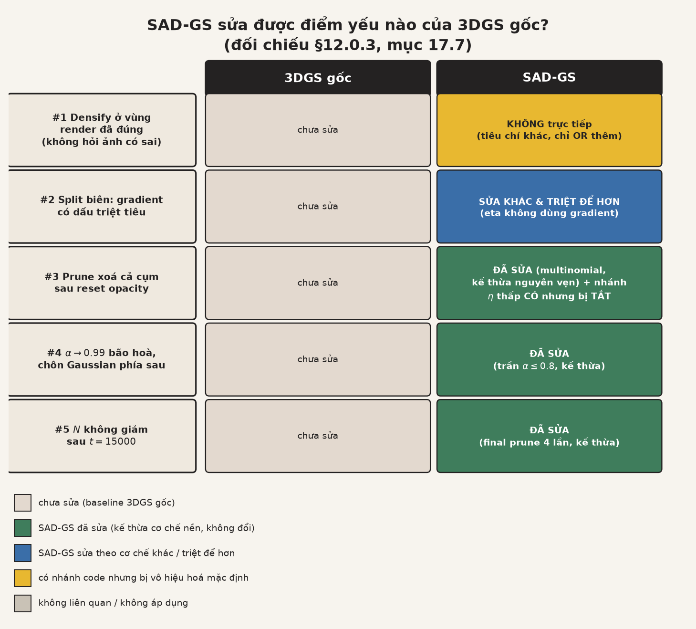

*INPUT: bảng đầu tiên của mục 17.7 ("# | Điểm yếu của 3DGS gốc | SAD-GS giải quyết thế nào?"),
đối chiếu 5 điểm yếu gốc ở §12.0.3 của `DOCS/BOOK/12-adaptive-density-control.md`.
CÔNG THỨC/NGUỒN: giữ nguyên đúng 5 verdict đã viết trong bảng gốc, chỉ đổi định dạng: #1 (densify
nơi render đã đúng) → SAD-GS "kế thừa fix của khung ADC hiện đại, cộng thêm tiêu chí $\eta$ độc lập,
không thay thế"; #2 (split biên, gradient có dấu triệt tiêu) → SAD-GS "kế thừa fix trị tuyệt đối,
cộng thêm cơ chế $\eta$ triệt để hơn" (không dùng gradient nên miễn nhiễm hoàn toàn); #3 (prune xoá
cả cụm) → SAD-GS "kế thừa multinomial-resample nguyên vẹn, có nhánh $\eta$-thấp riêng nhưng bị vô
hiệu hoá" (`pruning_score=None` trong `SADGS/train.py`, xem 17.7 mục 3); #4 (bão hoà opacity) và #5
($N$ không giảm sau $t{=}15000$) → "kế thừa nguyên vẹn, SAD-GS không thêm gì mới".
OUTPUT: lưới 5 hàng × 3 cột (3DGS gốc / khung ADC hiện đại-tiền thân / SAD-GS), mỗi ô tô màu theo
đúng 5 trạng thái ở trên (be nhạt = chưa sửa ở baseline, xanh lá = đã sửa và SAD-GS kế thừa nguyên
vẹn, xanh dương = SAD-GS sửa thêm/triệt để hơn, vàng = có nhánh mới nhưng bị tắt, xám = không liên
quan) — một cách đọc nhanh bảng markdown dày đặc chữ ở trên mà không cần đọc từng ô. Cột giữa trong
hình vẫn ghi nhãn của khung ADC hiện đại (tiền thân được SAD-GS kế thừa khung xương) để giữ đúng ảnh
đã dựng trước đó; văn bản chương này không dùng tên đó như một nhãn thương hiệu riêng.*

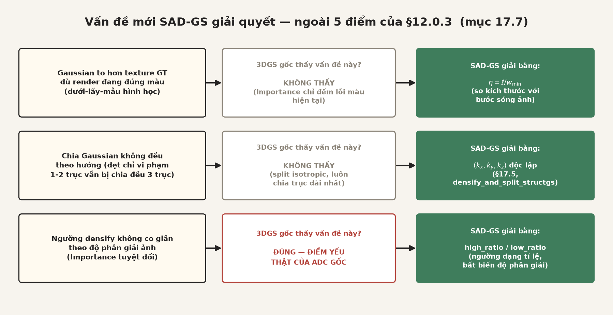

*INPUT: bảng thứ hai của mục 17.7 ("Vấn đề mới mà SAD-GS giải quyết, ngoài 5 điểm của 12.0.3").
CÔNG THỨC/NGUỒN: 3 hàng đúng như bảng gốc — (a) "Gaussian to hơn texture GT dù render đang đúng màu
trung bình" → 3DGS gốc "Không — tiêu chí densify chỉ đếm lỗi màu hiện tại" → SAD-GS giải bằng
$\eta=\ell/w_{\min}$; (b) "Chia Gaussian không đều theo hướng" → 3DGS gốc "Không — split isotropic
luôn chia trục dài nhất" → SAD-GS giải bằng $(k_x,k_y,k_z)$ độc lập (§17.5, `densify_and_split_structgs`,
`SADGS/scene/gaussian_model.py:638-831`); (c) "Ngưỡng densify không co giãn theo độ phân giải ảnh"
→ "Đúng, là điểm yếu thật kế thừa từ khung ADC hiện đại" (ghi nhận lại ở §17.4) → SAD-GS giải bằng
`high_ratio`/`low_ratio`.
OUTPUT: 3 luồng ngang [vấn đề] → [3DGS gốc có thấy?] → [SAD-GS giải bằng], hàng (c) tô viền đỏ để
phân biệt trực quan: đây là điểm yếu có thật đã tồn tại từ trước (không phải "khái niệm khác biệt"
như (a)/(b)).*

Cả hai hình dựng bằng `DOCS/BOOK/adc_figures/deep17f_overview_comparison.py` (hàm
`fig02_weakness_matrix`, `fig03_new_problems`) — sơ đồ khái niệm bằng matplotlib patches/text/arrows,
vẽ lại trung thực nội dung hai bảng markdown ở trên, không suy diễn thêm kết luận nào ngoài văn bản
gốc của mục 17.7.

**Tóm một câu**: SAD-GS không mở rộng danh sách sửa lỗi của 3DGS gốc theo đúng 5 mục cũ — nó thay **nguồn tín hiệu** quyết định "Gaussian này có cần chia không" (từ sai số màu render↔GT sang cấu trúc tần số ảnh GT) và thêm một chiều mới hoàn toàn 3DGS gốc không có (chia dị hướng theo trục), nhưng không đụng đến phần opacity-cap đã kế thừa nguyên vẹn, và chỉ hỗ trợ nhánh prune-theo-$\eta$-thấp ở dạng code có sẵn nhưng bị tắt trong lịch chạy mặc định (mục 3 ở trên). Lợi ích thực đo được trên GPU thật (PSNR, số Gaussian, thời gian hội tụ) **chưa có số liệu** trong repo này; mọi so sánh ở chương này dừng ở mức đối chiếu công thức, đúng như tình trạng "chưa test trên GPU thật" đã ghi nhận nhiều lần ở chương 12 cho các đợt tích hợp tương tự.

**Hình đóng chương — toàn tuyến công thức §17.1 → §17.5:**

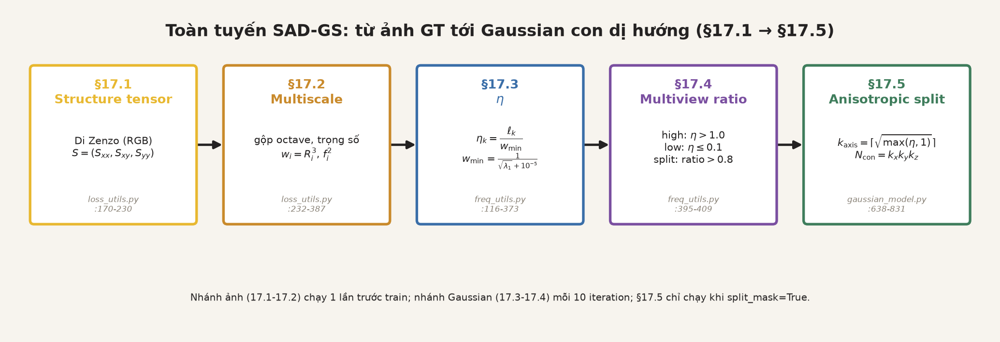

*INPUT: không sao chép một bảng cụ thể nào, mà tổng hợp 5 khối công thức trung tâm đã trình bày rải
rác ở các mục 17.1–17.5 thành một sơ đồ luồng ngang duy nhất — dùng làm hình tổng kết đóng chương
(hoặc hình mở đầu nhắc lại toàn tuyến).
CÔNG THỨC/NGUỒN từng khối (đúng vị trí đã dẫn trong các mục tương ứng):
  §17.1 Structure tensor Di Zenzo, $S=(S_{xx},S_{xy},S_{yy})$ — `SADGS/utils/loss_utils.py:170-230`;
  §17.2 Multiscale, gộp octave có trọng số $w_i=R_i^{3}$, nạp tần số $f_i^2$ —
    `SADGS/utils/loss_utils.py:232-387`;
  §17.3 $\eta_k=\ell_k/w_{\min}$, $w_{\min}=1/(\sqrt{\lambda_1}+10^{-5})$ —
    `SADGS/utils/freq_utils.py:116-373`;
  §17.4 Multiview ratio: high nếu $\eta>1.0$, low nếu $\eta\le0.1$, split khi ratio$>0.8$ —
    `SADGS/utils/freq_utils.py:395-409`, ngưỡng ở `SADGS/arguments/__init__.py:148-149`;
  §17.5 Anisotropic split $k_{\text{axis}}=\lceil\sqrt{\max(\eta,1)}\rceil$,
    $N_{\text{con}}=k_xk_yk_z$ — `SADGS/scene/gaussian_model.py:638-831`.
OUTPUT: 5 khung nối bằng mũi tên ngang, mỗi khung ghi tên mục, công thức rút gọn, và dòng nguồn
file:dòng; chú thích dưới hình nhắc lại nhịp chạy thật (nhánh ảnh 17.1–17.2 chạy một lần trước
train; nhánh Gaussian 17.3–17.4 chạy lặp mỗi 10 iteration; §17.5 chỉ kích hoạt khi `split_mask=True`)
— đúng như đã mô tả rải rác trong các mục 17.1–17.5, không thêm số liệu mới.*

Dựng bằng `DOCS/BOOK/adc_figures/deep17f_overview_comparison.py` (hàm `fig04_pipeline_recap`),
matplotlib thuần (patches/text/arrows) — đây là hình MỚI theo nghĩa bố cục (chưa từng có sơ đồ luồng
ngang nối cả 5 mục trong chương), nhưng mọi công thức/ngưỡng bên trong đều lấy nguyên văn từ các mục
17.1–17.5 đã viết ở trên, không phát sinh giá trị số nào ngoài các hằng số đã có trong code
(1.0, 0.1, 0.8).
