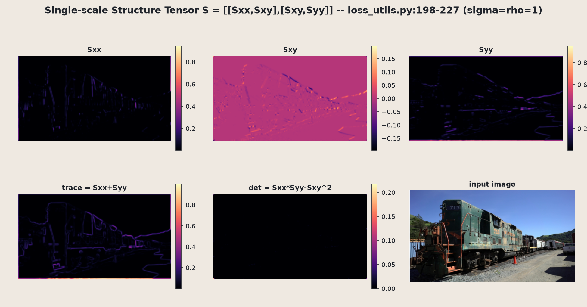
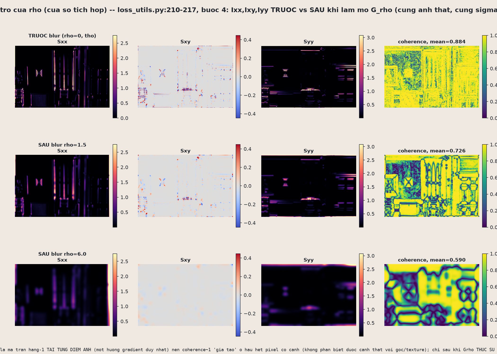

# 17.1 Structure tensor — đo "tần số cấu trúc ảnh cục bộ"

**Structure tensor** là một công cụ thị giác máy tính cổ điển (Di Zenzo, 1986), không phải phát minh riêng của SAD-GS. Nhiệm vụ của nó rất đơn giản để phát biểu: tại mỗi pixel của ảnh, trả lời câu hỏi *"ở đây ảnh biến thiên mạnh hay yếu, và theo hướng nào?"*. Kết quả là một ma trận đối xứng 2×2 tại mỗi pixel, mà trị riêng lớn nhất của nó chính là "năng lượng cạnh" theo hướng biến thiên mạnh nhất. Trong pipeline SAD-GS, đại lượng này sẽ được dùng lại ở mục 17.3 để quyết định nơi nào ảnh có cạnh sắc (cần nhiều Gaussian nhỏ) và nơi nào ảnh phẳng (Gaussian lớn là đủ) — tức là nền tảng của "structure-aware densification". Cả 5 bước dưới đây đều lấy đúng từ `SADGS/utils/loss_utils.py:170-230`, hàm `get_structure_tensor_torch(image_tensor, sigma=1.0, rho=1.0)`, và được minh hoạ lại trên ảnh thật (scene Tanks&Temples "train") bằng script `real_structure_analysis.py`.

---

## Bước 1 — Làm mờ trước (khử nhiễu tần số cao giả)

$$
I_{\text{smooth}} = G_\sigma * I, \qquad k = 2\lceil 4\sigma \rceil + 1 \ \text{(kernel size, ép lẻ)}
$$

Trước khi tính đạo hàm, ảnh gốc $I$ được làm mượt bằng một Gaussian blur với độ lệch chuẩn $\sigma$ (mặc định $\sigma=1$). Lý do: đạo hàm (Sobel ở bước sau) rất nhạy với nhiễu điểm ảnh — nếu không làm mượt trước, những đốm nhiễu li ti cũng sẽ bị hiểu nhầm là "cạnh mạnh". Bước này không có ảnh riêng minh hoạ, nhưng chính là input của panel "Input (smoothed sigma=1)" trong ảnh bước 2 dưới đây.

## Bước 2 — Đạo hàm Sobel theo từng kênh

$$
S_x=\begin{pmatrix}-1&0&1\\-2&0&2\\-1&0&1\end{pmatrix},\quad
S_y=\begin{pmatrix}-1&-2&-1\\0&0&0\\1&2&1\end{pmatrix},\quad
I_x = S_x * I_{\text{smooth}},\ I_y = S_y * I_{\text{smooth}}
$$

Đạo hàm Sobel theo trục $x$ và trục $y$ được tính **độc lập cho từng kênh màu** (`conv2d` với `groups=C`, tức R, G, B mỗi kênh có bộ lọc riêng, không trộn lẫn). Ảnh trên cho thấy $I_x$ của ba kênh R/G/B trên đầu máy xe lửa — mỗi bản đồ bắt các cạnh dọc (thân toa, khung cửa sổ) nhưng cường độ khác nhau tuỳ kênh, vì mỗi màu phản ứng khác nhau với cùng một cạnh vật lý.

## Bước 3 — Tích và cộng dồn 3 kênh (Di Zenzo)

$$
\boxed{\ I_{xx}=\sum_{\text{ch}} I_x^{(\text{ch})2},\qquad I_{xy}=\sum_{\text{ch}} I_x^{(\text{ch})} I_y^{(\text{ch})},\qquad I_{yy}=\sum_{\text{ch}} I_y^{(\text{ch})2}\ }
$$

Đây là điểm khác biệt cốt lõi so với structure tensor ảnh xám thông thường: thay vì chuyển ảnh về luminance (độ sáng) rồi mới lấy đạo hàm, Di Zenzo **cộng năng lượng gradient bình phương của cả 3 kênh RGB**. Lý do: một cạnh *iso-luminant* — hai màu khác hẳn nhau về sắc nhưng độ sáng gần như bằng nhau (ví dụ đỏ và xanh lá cùng độ sáng) — có gradient luminance gần như bằng 0, nên nếu chỉ dùng luminance thì cạnh đó sẽ "biến mất" khỏi structure tensor. Cộng riêng từng kênh giữ lại tín hiệu này. Panel "sum_c Ix (Di Zenzo, pre-square)" trong ảnh bước 2 minh hoạ bước cộng dồn này (trước khi bình phương).

## Bước 4 — Tích hợp cửa sổ (structure tensor thật sự)

$$
\boxed{\ S_{xx}=G_\rho * I_{xx},\quad S_{xy}=G_\rho * I_{xy},\quad S_{yy}=G_\rho * I_{yy}\ }
$$

Các thành phần $I_{xx}, I_{xy}, I_{yy}$ ở bước 3 chỉ là thông tin tại **từng điểm ảnh riêng lẻ**. Bước 4 làm mờ lại chúng bằng một Gaussian $G_\rho$ (với $\rho$ khác $\sigma$ ở bước 1) để gộp thông tin gradient của cả một vùng lân cận lại thành một hướng thống nhất — đây mới thực sự là "structure tensor". Ảnh trên hiển thị $S_{xx}, S_{xy}, S_{yy}$ (hàng trên) cùng trace $S_{xx}{+}S_{yy}$ và determinant (hàng dưới): $S_{xy}$ dùng thang màu có dấu vì nó mã hoá hướng nghiêng của cạnh, còn $S_{xx}, S_{yy}$ sáng rõ dọc theo các cạnh mạnh của toa xe lửa.

Từ ma trận $S(x)$ có thể tính hai trị riêng $\lambda_1 \geq \lambda_2$ bằng công thức đóng cho ma trận đối xứng $2\times2$ (dùng lại ở mục 17.3). Ảnh trên cho thấy $\lambda_1$ (năng lượng cạnh lớn nhất) sáng rõ dọc thân xe lửa và đường ray, còn $\lambda_2$ gần như bằng 0 ở những vùng chỉ có một hướng biến thiên duy nhất (cạnh thẳng) — đúng như kỳ vọng lý thuyết.

## Bước 5 — Chuẩn hoá theo batch

$$
S_{xx}, S_{xy}, S_{yy} \ \leftarrow\ \frac{S_{xx}, S_{xy}, S_{yy}}{\max_{\text{batch}}(S_{xx}+S_{yy}) + 10^{-6}}
$$

Toàn bộ ba bản đồ được chia cho giá trị lớn nhất của trace $(S_{xx}{+}S_{yy})$ trong cả batch, cộng thêm một epsilon nhỏ để tránh chia cho 0. Mục đích: ngưỡng $\eta$ dùng ở mục 17.3 không bị "trôi" theo độ sáng/tương phản khác nhau giữa các cảnh — nếu không chuẩn hoá, một cảnh sáng hơn sẽ luôn có structure tensor lớn hơn một cách giả tạo, làm sai lệch quyết định densify.

Kết quả cuối cùng của cả 5 bước là tensor `[B,3,H,W]` biểu diễn $(S_{xx}, S_{xy}, S_{yy})$ tại mỗi pixel — tức ma trận đối xứng $2\times2$:

$$
S(x) = \begin{pmatrix} S_{xx} & S_{xy} \\ S_{xy} & S_{yy} \end{pmatrix}
$$

Ảnh trên gộp lại toàn bộ pipeline: mỗi ellipse vẽ tại một điểm lưới thưa biểu diễn trị riêng/vector riêng của $S(x)$ tại điểm đó — trục dài của ellipse chỉ hướng ít biến thiên nhất (an toàn để một Gaussian kéo dài mà không làm mờ cạnh), còn trục ngắn chỉ hướng biến thiên mạnh nhất (cạnh). Trị riêng lớn nhất $\lambda_1$ chính là đại lượng đo "năng lượng tần số cao nhất tại điểm đó theo bất kỳ hướng nào", sẽ được dùng tiếp ở mục 17.3.

---

## Ba thực nghiệm đào sâu

Ba thực nghiệm dưới đây chạy lại đúng `get_structure_tensor_torch` (script `deep17a_structure_tensor.py`) trên một crop ảnh thật khác: `DOCS/assets/samples_drjohnson.png`, vùng `(11,381)-(451,669)` (440×288px) — một căn phòng có tường xanh lá nhạt, cửa gỗ trắng, ghế gỗ, dàn sưởi và bình chữa cháy đỏ. Mục đích: biến ba khẳng định lý thuyết ở trên thành số đo cụ thể.

### (a) Di Zenzo vs luminance tại cạnh iso-luminant

$$
\text{grad}_{\text{DiZenzo}} = \sqrt{I_{xx}+I_{yy}} \qquad\text{so với}\qquad \text{grad}_{\text{lum}} = \sqrt{L_x^2+L_y^2},\quad L = 0.2126R+0.7152G+0.0722B
$$

Quét toàn bộ crop tìm pixel có tỉ lệ $\text{grad}_{\text{DiZenzo}}/\text{grad}_{\text{lum}}$ lớn nhất, script tìm ra đúng viền bình chữa cháy đỏ áp sát cửa gỗ be. Tại pixel $(x{=}293, y{=}260)$: $\text{grad}_{\text{lum}} = 0.0029$ trong khi $\text{grad}_{\text{DiZenzo}} = 0.3227$ — **lớn hơn 81.8 lần**. Chi tiết từng kênh: $|\text{grad}\,R| = 0.309$, $|\text{grad}\,G| = 0.091$, $|\text{grad}\,B| = 0.021$ — kênh R mang gần như toàn bộ tín hiệu cạnh, trong khi luminance gần như triệt tiêu vì độ sáng hai bên viền xấp xỉ nhau. Đây là bằng chứng số thật cho lý do bước 3 phải cộng riêng 3 kênh thay vì dùng luminance.

### (b) Vai trò của $\rho$ ở bước 4

$$
\text{coherence} = \left(\frac{\lambda_1-\lambda_2}{\lambda_1+\lambda_2}\right)^2
$$

So sánh coherence trung bình toàn crop ở ba trạng thái: $\rho=0$ (thô, chưa tích hợp), $\rho=1.5$, $\rho=6.0$. Kết quả: coherence **giảm** dần theo $\rho$: $0.884 \to 0.726 \to 0.590$. Nguyên nhân: khi $\rho=0$, mỗi pixel chỉ nhìn thấy đúng một hướng gradient của chính nó, nên gần như mọi pixel có cạnh đều có coherence "giả tạo" gần 1, không phân biệt được cạnh thẳng thật với góc hay vùng texture phức tạp. Chỉ sau khi $G_\rho$ thực sự trung bình hoá theo không gian, các vùng nhiều hướng gần nhau (góc cửa, khung cửa sổ) mới lộ ra coherence thấp, còn các đoạn cạnh dài đơn hướng vẫn giữ coherence cao.

### (c) Chuẩn hoá theo batch ở bước 5

$$
S_{xx}, S_{xy}, S_{yy} \ \leftarrow\ \frac{S_{xx}, S_{xy}, S_{yy}}{\max_{\text{batch}}(S_{xx}+S_{yy}) + 10^{-6}}
$$

Cùng crop thật được render lại ở ba mức độ sáng bằng cách nhân trực tiếp giá trị pixel: $\times0.5$, $\times1.0$ (gốc), $\times1.5$ (clip về $[0,1]$, mô phỏng ảnh 8-bit "cháy sáng"). **Trước** chuẩn hoá, $\max(S_{xx}+S_{yy})$ là $9.730$ ($\times0.5$), $38.920$ ($\times1.0$), $44.275$ ($\times1.5$) — chênh lệch lớn theo độ sáng, và tỉ lệ đo được $9.730/38.920=0.250$ khớp gần tuyệt đối với dự đoán lý thuyết bậc hai $0.5^2=0.250$. **Sau** chuẩn hoá: bản đồ $S_{xx}$ của $\times0.5$ và $\times1.0$ **giống hệt nhau** ($\max|\text{diff}|=0.0000$). Với $\times1.5$, đa số pixel cũng giống hệt, nhưng $\max|\text{diff}|=0.3032$ ở vùng cửa sổ/khung cửa bị bão hoà (clip về 1.0) — đúng là dấu hiệu giả định tuyến tính bị phá vỡ khi ảnh over-expose. Kết luận: chuẩn hoá bước 5 làm ngưỡng $\eta$ bất biến chính xác với độ sáng scene trong vùng không bão hoà, và chỉ lệch ở đúng những vùng đã cháy sáng.

---

## Kết nối tiếp theo

Structure tensor $S(x)$ (hay chính xác hơn là trị riêng $\lambda_1, \lambda_2$ của nó) tính ở mục 17.1 chưa dừng lại đây: mục **17.2** sẽ mở rộng pipeline này thành phiên bản **đa tỉ lệ (multiscale)** — lặp lại đúng 5 bước trên ở nhiều cặp $(\sigma, \rho)$ khác nhau, để bắt được cả cạnh mảnh lẫn cấu trúc lớn cùng lúc thay vì chỉ một tỉ lệ cố định như ở đây. Mục **17.3** sau đó dùng trị riêng lớn nhất $\lambda_1$ (đã chuẩn hoá bất biến độ sáng nhờ bước 5) để định nghĩa ngưỡng $\eta$ — tiêu chí quyết định vùng nào của scene cần densify thêm Gaussian, dựa trực tiếp trên "năng lượng cạnh cục bộ" mà structure tensor đo được ở mục này.
