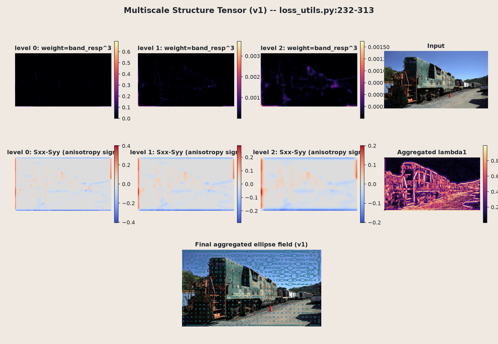
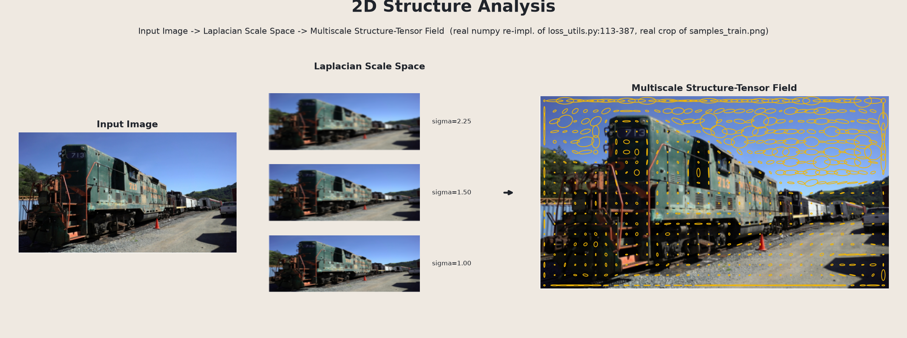
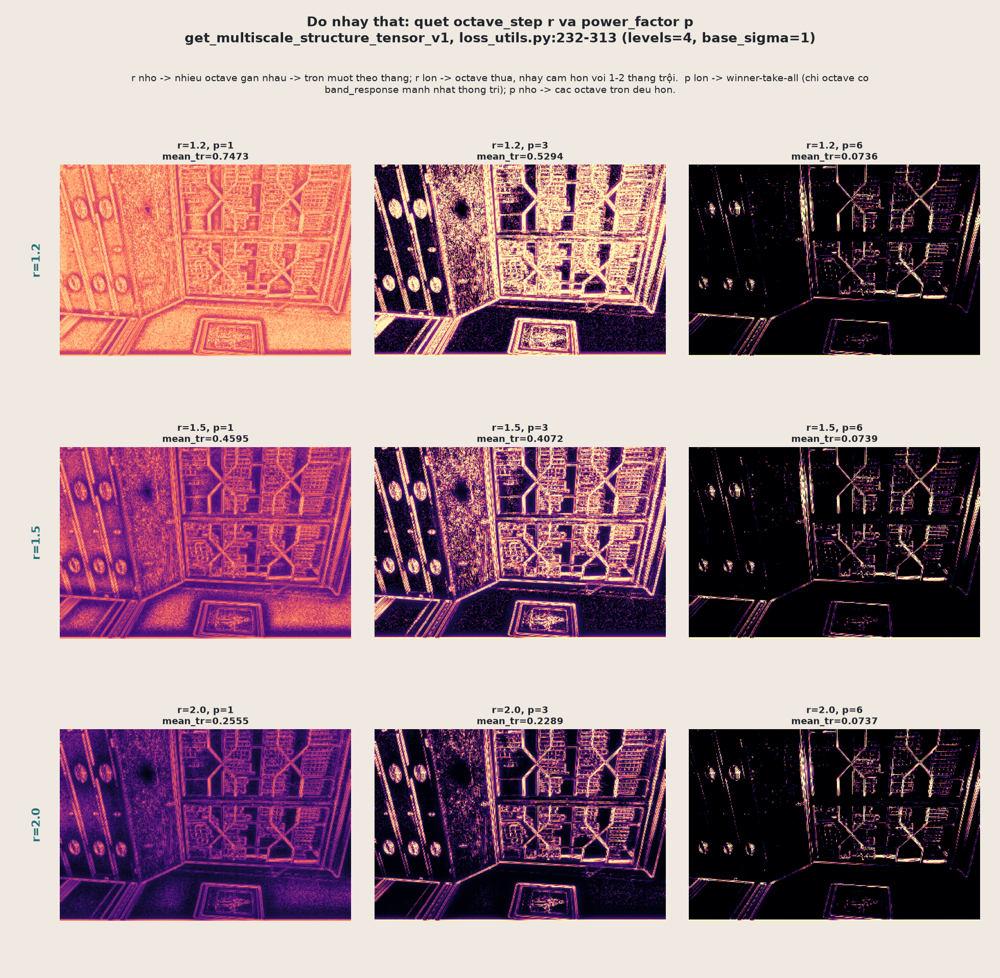

# 17.2 Structure tensor đa tỉ lệ — vì sao một $\sigma$ là chưa đủ

Mục 17.1 cho ta `get_structure_tensor_torch`: một cách đo hướng cấu trúc ảnh tại **đúng một tỉ lệ** $\sigma$. Vấn đề là ảnh thật có chi tiết ở nhiều tỉ lệ khác nhau cùng lúc — cạnh sắc của một con số nhỏ trên toa tàu cần $\sigma$ nhỏ để nhìn thấy, còn một vân lặp lại lớn (như tủ sách với các thanh gỗ đều đặn) chỉ lộ ra tính "có cấu trúc" khi ta lùi ra xa, tức $\sigma$ lớn. Một structure tensor đơn tỉ lệ buộc phải chọn một trong hai, và sẽ bỏ sót phía còn lại.

`SADGS/utils/loss_utils.py:232-387` giải quyết việc này bằng hai hàm `get_multiscale_structure_tensor_v1` và `_v2`: quét qua `levels` octave (mỗi octave nhân $\sigma$ lên theo `octave_step`), rồi **gộp có trọng số theo năng lượng band** — về bản chất là một kiểu Laplacian/Difference-of-Gaussian (DoG) pyramid lai với structure tensor, chứ không phải một Gaussian pyramid multiscale thuần túy. Tham số mặc định (`SADGS/arguments/__init__.py:120-121`): `st_levels=4`, `st_mode="v1"`, `octave_step=1.5`, `power_factor=3.0`.

## Vòng lặp octave chung cho cả v1 và v2

Tại mỗi octave $i = 0, \dots, L-1$ (với $L = $ `st_levels`):

$$
\boxed{\ \sigma_i = \sigma_0 \cdot r^{\,i}, \qquad f_i = \frac{1}{r^{\,i}} \qquad (r = \texttt{octave\_step} = 1.5,\ \sigma_0 = 1)\ }
$$

- $\sigma_i$ là độ mờ tích lũy tới octave $i$: ảnh được làm mờ **tiếp** từ ảnh đã mờ ở octave trước (không mờ lại từ ảnh gốc), tiết kiệm chi phí.
- $f_i$ là "tần số danh nghĩa" gán cho octave đó — octave 0 ứng với tần số cao nhất ($f_0 = 1$), octave cuối cùng ứng với tần số thấp nhất.

**Band response** đo lượng chi tiết bị mất khi mờ thêm một octave — đúng kiểu Difference-of-Gaussian:

$$
\boxed{\ R_i = \bigl\lVert I_{\text{smooth}}^{(i-1)} - I_{\text{smooth}}^{(i)} \bigr\rVert_2\ \text{(theo kênh màu, tại từng pixel)}\ }
$$

Ảnh dưới minh họa trực tiếp vòng lặp này trên ảnh thật (đầu máy xe lửa 713):

Hàng trên là ảnh càng lúc càng mờ dần qua các octave ($\sigma = 1.00 \to 1.50 \to 2.25$); hàng dưới là $|R_i|$ tương ứng — octave 0 (`band_freq=1.000`) bắt cạnh rất sắc (số hiệu "713", viền toa tàu), còn octave 2 (`band_freq=0.444`) chỉ còn phân biệt các mảng lớn, mờ nhòe (thân tàu, đường ray). Đây chính là ý nghĩa của "đa tỉ lệ": mỗi octave là một bộ lọc band-pass khác nhau trên cùng một ảnh.

Từ band response, ta tính **trọng số theo năng lượng**: octave nào giải thích nhiều năng lượng hơn (chi tiết mất nhiều hơn khi mờ thêm) thì đóng góp nhiều hơn vào hướng cấu trúc cuối cùng, và số mũ $p$ dùng để khuếch đại sự chênh lệch đó:

$$
w_i = R_i^{\,p} \qquad (p = \texttt{power\_factor} = 3.0)
$$

Cuối cùng, các structure tensor $(S_{xx,i}, S_{xy,i}, S_{yy,i})$ của từng octave được **gộp có trọng số**, nhưng trước khi gộp mỗi octave được **chuẩn hóa theo vết (trace)** của chính nó:

$$
\boxed{\ (\hat S_{xx}, \hat S_{xy}, \hat S_{yy}) = \frac{\sum_i w_i\, f_i^2\, \left(\dfrac{S_{xx,i}}{\mathrm{tr}_i}, \dfrac{S_{xy,i}}{\mathrm{tr}_i}, \dfrac{S_{yy,i}}{\mathrm{tr}_i}\right)}{\sum_i w_i}\ ,\qquad \mathrm{tr}_i = S_{xx,i} + S_{yy,i} + 10^{-6}\ }
$$

**Vì sao phải chia cho $\mathrm{tr}_i$ trước khi gộp?** Nếu không chuẩn hóa, một octave có gradient tự nhiên lớn (ví dụ vùng tương phản cao) sẽ áp đảo tổng, bất kể octave đó có đáng tin hay không — độ lớn tuyệt đối của gradient và "octave nào quan trọng hơn" là hai chuyện khác nhau, không nên trộn lẫn. Bằng cách chia mỗi $S_{xx,i}, S_{yy,i}$ cho $\mathrm{tr}_i$ của chính octave đó, ta buộc mỗi octave chỉ còn đóng góp **hướng** của cấu trúc (structure tensor đã chuẩn hóa vết $\approx 1$), còn **độ lớn** cuối cùng hoàn toàn do $f_i^2$ áp đặt một cách có chủ đích (comment gốc trong code: *"We want the final sum to have Trace = freq²"*). Đây chính là điểm khác biệt cốt lõi so với structure tensor đơn tỉ lệ ở 17.1: đơn tỉ lệ trả về năng lượng gradient thật, còn multiscale trả về **hướng cấu trúc chiếm ưu thế, gắn nhãn độ lớn theo octave nào "thắng"** — hai đại lượng khác đơn vị.

## v1 vs v2 — khác nhau đúng ở một bước

Cả hai hàm dùng chung vòng lặp octave ở trên, nhưng khác nhau ở cách tính $(S_{xx,i}, S_{xy,i}, S_{yy,i})$ tại mỗi octave:

| | v1 (`get_multiscale_structure_tensor_v1`) | v2 (`get_multiscale_structure_tensor_v2`) |
|---|---|---|
| Structure tensor mỗi octave | Tính **một lần duy nhất** ở octave 0 (`base_st`), các octave sau chỉ **làm mờ lại** tensor đó bằng $\rho_i = 3\sigma_i$ | Tính **structure tensor mới tại mỗi octave**, trên ảnh đã thực sự được mờ tới $\sigma_i$ |
| Chi phí | 1× Sobel + $L$× Gaussian blur trên tensor $S$ | $L$× Sobel + $L$× Gaussian blur trên ảnh |
| Số lần gọi Sobel lý thuyết | $\#\text{Sobel}_{v1} = 3$ (cố định, không phụ thuộc $L$) | $\#\text{Sobel}_{v2} = 3L$ |
| Docstring tự nhận xét | "Improved Multi-scale" | "**True** Multi-scale" |

Nói cách khác: v1 tính gradient một lần ở ảnh gốc rồi chỉ làm mờ *kết quả gradient đó* để giả lập các octave thô hơn — rẻ nhưng là một xấp xỉ. v2 tính lại Sobel trên ảnh *thật sự đã bị mờ* ở từng octave — đắt hơn nhưng đúng hơn về mặt tín hiệu, vì gradient của ảnh mờ không nhất thiết bằng gradient gốc đem mờ lại. Mặc định `st_mode="v1"` — rẻ hơn được chọn làm default dù chính docstring gọi v2 là "đúng hơn", vì kết quả multiscale này chỉ dùng làm **tín hiệu gate** (quyết định split/clone), không cần chính xác tuyệt đối.

Ảnh dưới cho thấy trực tiếp hai pipeline này chạy trên cùng ảnh:

*v1: chỉ có một Sobel ở octave 0, các panel `level 0/1/2` sau chỉ là bản mờ lại của cùng một `Sxx-Syy` gốc.*

*v2: mỗi octave có Sobel riêng trên ảnh đã mờ đúng $\sigma_i$ — so trực tiếp với panel v1 để thấy khác biệt.*

*Trace $S_{xx}+S_{yy}$ (hiển thị dạng $\log_{10}(\eta)$) của v1 và v2 cùng thang màu, cộng panel hiệu số `eta_v1 - eta_v2` gần như đồng nhất bằng 0 trên toàn ảnh — xác nhận bằng số: khác biệt giữa v1/v2 rất nhỏ, tập trung ở các cạnh cong/giao biên phức tạp, gần như triệt tiêu ở các cạnh thẳng dài.*

*Tổng kết trực quan cả 17.1–17.2: ảnh gốc → Laplacian scale space (3 octave, $\sigma = 1.00, 1.50, 2.25$) → trường ellipse structure tensor đa tỉ lệ cuối cùng — một hình nối liền cả chuỗi xử lý bằng dữ liệu thật.*

## Ba thực nghiệm đào sâu

Ba khẳng định ở trên (v1 rẻ hơn, $r$/$p$ điều khiển độ sắc nét, chia $\mathrm{tr}_i$ chỉ giữ hướng) được kiểm chứng bằng số liệu thật, chạy lại chính thuật toán (numpy thuần) trên một ảnh crop khác: `DOCS/assets/samples_drjohnson.png`, vùng `(924,381)-(1365,671)` — một tủ sách gỗ với cửa kính lưới mullion chéo.

### 1. Chi phí và độ lệch v1/v2 theo `st_levels`

Quét $L \in \{2, 3, 4, 6\}$, đo **wall-clock thật** và **đếm số lần gọi thật** `sobel_channel`/`fast_gaussian_blur`.

- Số lần gọi Sobel: v1 luôn đúng **3 lần** bất kể $L$ — khớp chính xác công thức lý thuyết $\#\text{Sobel}_{v1}=3$. v2 tăng tuyến tính $3L$: đo được **9, 12, 15, 21** ở $L = 2, 3, 4, 6$.
- Wall-clock: v1 đi từ **50 → 202 ms**, v2 từ **67 → 285 ms** khi $L$ tăng từ 2 lên 6 — v2 luôn chậm hơn v1 khoảng **1.3–1.4×**, và khoảng cách này càng nới rộng khi $L$ tăng.
- Độ lệch $\text{mean}\,|\mathrm{tr}(\hat S_{v1}) - \mathrm{tr}(\hat S_{v2})|$ trên toàn ảnh **rất nhỏ** (khoảng $10^{-4}$) và **giảm dần** khi $L$ tăng — càng nhiều octave, trọng số $f_i^2$ ở các octave cao (nơi v1/v2 gần giống hệt nhau) càng pha loãng phần đóng góp của các octave thô, nơi hai phiên bản khác nhau nhiều nhất.

Kết luận: v2 đắt hơn có hệ thống và đắt thêm tuyến tính theo $L$, đổi lại sai khác thực tế so với v1 rất nhỏ trên ảnh này — củng cố lựa chọn `st_mode="v1"` làm mặc định.

### 2. Độ nhạy của `octave_step` ($r$) và `power_factor` ($p$)

Quét lưới đầy đủ $r \in \{1.2, 1.5, 2.0\} \times p \in \{1, 3, 6\}$ (9 tổ hợp thật) với v1, `levels=4`.

- Theo hàng (quét $p$, $r=1.5$ cố định): `mean_tr` giảm mạnh **0.4595 → 0.4072 → 0.0739** khi $p = 1 \to 3 \to 6$ — hiệu ứng winner-take-all: $p$ lớn đẩy hầu hết trọng số về đúng một octave (thường là octave thô, $f_i^2$ nhỏ), kéo trace trung bình xuống thấp.
- Theo cột (quét $r$, $p=1$ cố định): `mean_tr` giảm đơn điệu **0.7473 → 0.4595 → 0.2555** khi $r = 1.2 \to 1.5 \to 2.0$ — $r$ lớn làm $f_i^2 = r^{-2i}$ giảm nhanh hơn ở các octave sau, kéo trung bình có trọng số xuống.
- Quan sát thú vị: ở $p=6$ (cột phải), cả ba giá trị $r$ cho bản đồ **gần như giống hệt nhau về cấu trúc không gian** — `mean_tr` chỉ chênh dưới 0.5% (0.0736, 0.0739, 0.0737). Khi $p$ đủ lớn, nó chi phối hoàn toàn kết quả, $r$ gần như không còn ảnh hưởng tới hình dạng bản đồ nữa.

### 3. Kiểm chứng đẳng thức trace

Vì mỗi octave chia cho $\mathrm{tr}_i$ trước khi gộp, nên $\frac{S_{xx,i}}{\mathrm{tr}_i} + \frac{S_{yy,i}}{\mathrm{tr}_i} \approx 1$. Thế vào công thức gộp, trace cuối cùng có thể suy ra **chỉ từ $w_i, f_i$**, không cần biết $S_{xx,i}, S_{yy,i}$ cụ thể:

$$
\boxed{\ \mathrm{tr}(\hat S) \approx \frac{\sum_i w_i f_i^2}{\sum_i w_i}\ }
$$

So sánh pixel-theo-pixel hai cách tính trace hoàn toàn độc lập — (i) chạy toàn bộ thuật toán rồi lấy $S_{xx}+S_{yy}$ thật, và (ii) chỉ dùng $w_i, f_i$ đã thu được, áp công thức đại số ở trên — cho kết quả gần như giống hệt nhau bằng mắt thường. Bản đồ phần dư gần như toàn màu trung tính (bằng 0), với:

- $\text{mean}\,|\text{residual}| = 3.7 \times 10^{-4}$ trên toàn ảnh.
- $\max\,|\text{residual}| = 4.0 \times 10^{-2}$, khu trú **đúng ở các vùng phẳng/tối** (tường xanh lá, khe tối giữa các cuốn sách) — nơi $\mathrm{tr}_i$ nhỏ tới mức $\epsilon = 10^{-6}$ ở mẫu số không còn "không đáng kể" nữa ($\epsilon/\mathrm{tr}_i \not\approx 0$).

Đây không phải lỗi tính toán, mà là dự đoán đúng từ chính công thức: xấp xỉ $\frac{S_{xx,i}}{\mathrm{tr}_i}+\frac{S_{yy,i}}{\mathrm{tr}_i}\approx 1$ chỉ chặt khi $\mathrm{tr}_i \gg \epsilon$, tức khi octave đó có tín hiệu gradient thật sự — bằng chứng số học trực tiếp cho khẳng định "chia cho $\mathrm{tr}_i$ trước khi gộp $\Rightarrow$ octave chỉ đóng góp hướng, độ lớn hoàn toàn do $f_i^2$".

## Kết nối sang 17.3

Kết quả của mục này — trường structure tensor đa tỉ lệ $\hat S = (\hat S_{xx}, \hat S_{xy}, \hat S_{yy})$, với trace mang thông tin "octave nào chiếm ưu thế" và các thành phần ngoài đường chéo mang thông tin hướng — chính là nguyên liệu đầu vào cho bước tiếp theo: tính hệ số dị hướng $\eta$ (anisotropy) dùng làm tín hiệu gate cho split/clone trong Adaptive Density Control. Mục 17.3 sẽ lấy trị riêng của $\hat S$ (từ $\hat S_{xx}, \hat S_{xy}, \hat S_{yy}$ đã gộp ở đây) để suy ra hướng chính của cấu trúc cục bộ và mức độ "kéo dài" của nó — nền tảng để quyết định Gaussian nào cần tách theo hướng nào.
