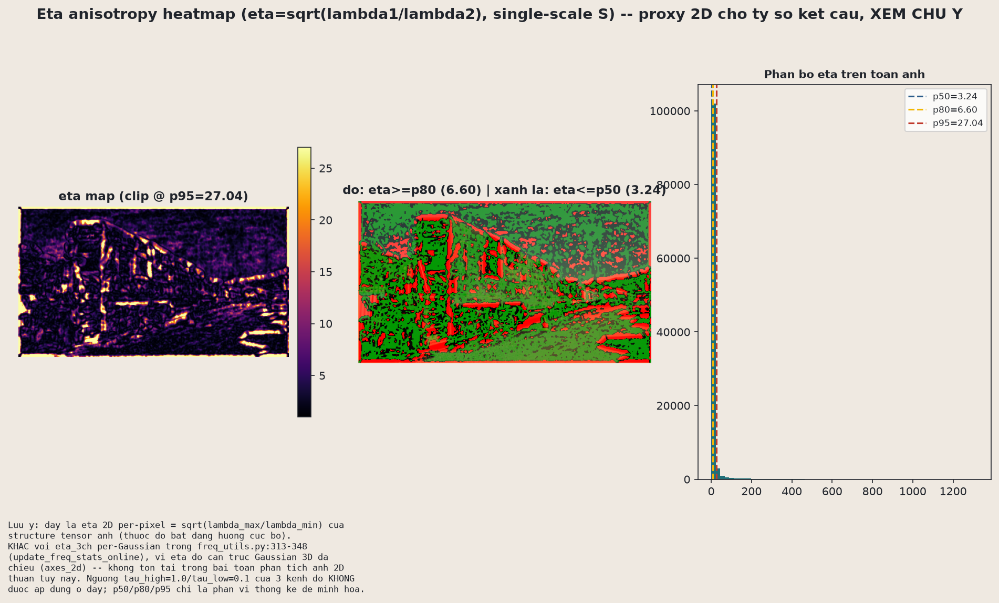
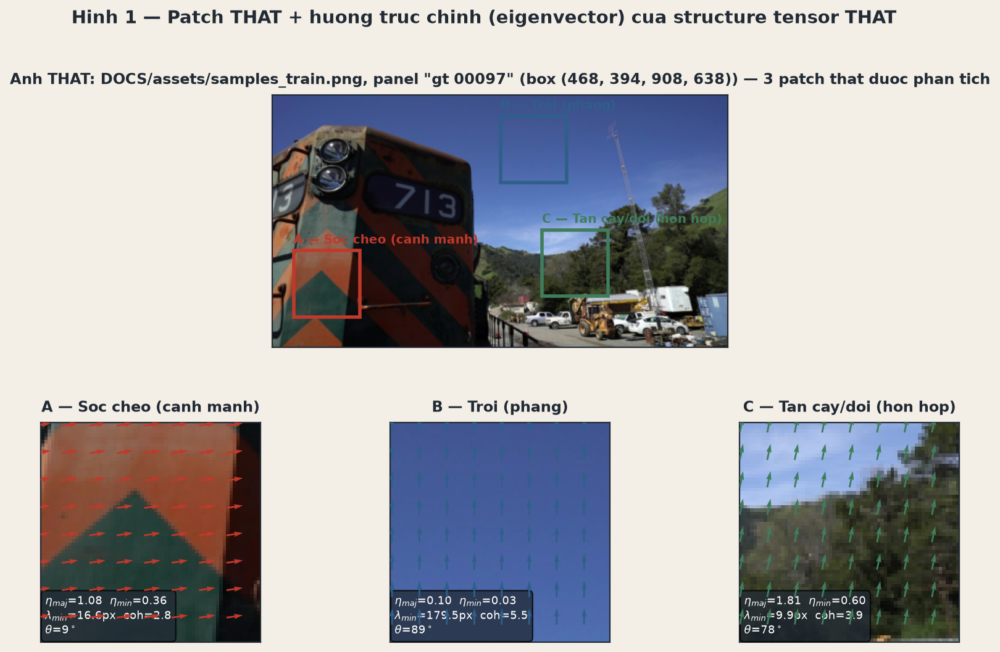
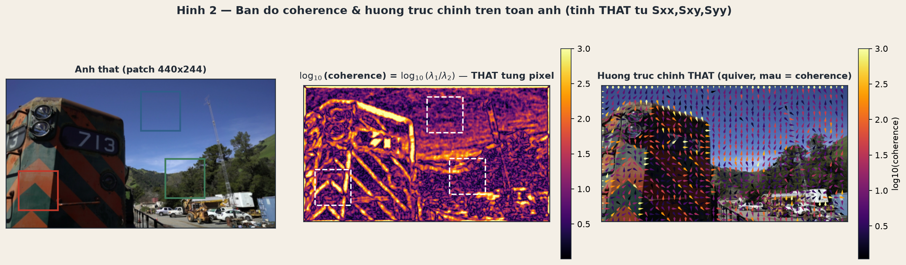
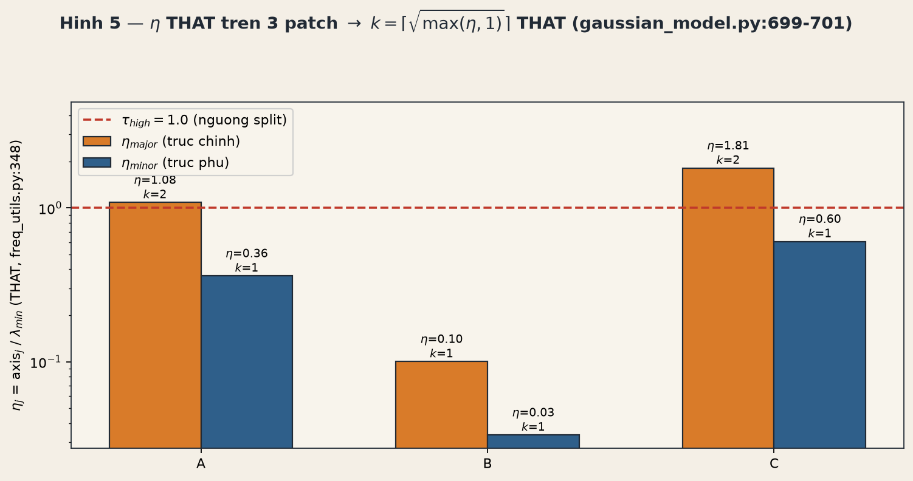

# 17.3 — $\eta$: so screen-space extent với bước sóng texture cục bộ

## Tóm tắt: $\eta$ đo cái gì, và tại sao densification cần nó

Câu hỏi mà mục 17.3 trả lời rất cụ thể: **"Gaussian này, chiếu lên màn hình, có đang to hơn chi tiết ảnh nhỏ nhất tại đúng vị trí nó phủ lên hay không?"** Nếu có — Gaussian đang làm mờ (alias) một chi tiết mà ảnh gốc còn phân biệt được, và đó chính là tín hiệu để tách nhỏ nó (split). Đây là phép hiện thực trực tiếp cho câu mô tả SAD-GS trong README: so sánh "projected screen-space extent" của Gaussian với "local texture structure" của ảnh ground-truth.

Toàn bộ phép tính nằm trong hàm `update_freq_stats_online` (`SADGS/utils/freq_utils.py:181-418`), chạy **mỗi 10 vòng lặp** — khác với `add_densification_stats` của ADC gốc chạy mỗi vòng (chi phí so sánh sẽ bàn ở mục 17.6). Có ba bước nối tiếp nhau: **A** chiếu trục Gaussian lên màn hình để có tử số (độ dài pixel), **B** lấy mẫu structure tensor ảnh tại đúng vị trí Gaussian để có nguyên liệu tính mẫu số, **C** kết hợp hai thứ đó thành $\eta$.

Lưu ý một cái bẫy tên gọi: hình bên dưới (`real_st_09_eta_heatmap.png`) cũng dùng ký hiệu $\eta=\sqrt{\lambda_1/\lambda_2}$ nhưng đó là **tỉ số dị hướng cấu trúc ảnh 2D** (structure tensor tại một pixel, không liên quan Gaussian nào cả) — khác hoàn toàn với $\eta_k$ "kích thước trục Gaussian / bước sóng" là chủ đề chính của mục này. Trùng ký hiệu vì cùng xuất phát từ cặp trị riêng $\lambda_1,\lambda_2$, nhưng đừng nhầm hai đại lượng.

*Bên trái: bản đồ $\eta=\sqrt{\lambda_1/\lambda_2}$ trên toàn ảnh — vùng cạnh mạnh một-hướng (đường ray, thân toa) sáng lên, vùng texture hai chiều (sỏi đá, nền) tối. Bên phải: phân bố lệch mạnh về giá trị nhỏ — hầu hết pixel có cấu trúc gần đẳng hướng, chỉ một số ít cạnh sắc kéo đuôi phân bố ra xa. Đây là ảnh khởi động trực giác cho "structure tensor S" mà Bước A/B/C bên dưới sẽ dùng lại, không phải công thức $\eta_k$ chính.*

---

## Bước A — chiếu 3 trục scale Gaussian lên màn hình

Mỗi Gaussian 3D có 3 trục scale $s=(s_x,s_y,s_z)$ theo hệ toạ độ cục bộ (xoay bởi quaternion $R_i$). Muốn so trục này với "bước sóng" đo bằng pixel trên ảnh, trước hết phải chiếu nó lên mặt phẳng màn hình. `compute_projected_axes_subset` (`freq_utils.py:116-178`) dùng đúng Jacobian phép chiếu phối cảnh tuyến tính hoá — kiểu EWA splatting quen thuộc từ chương 8 — nhưng áp trực tiếp lên **3 vector cột scale** thay vì lên toàn ma trận hiệp phương sai $\Sigma$:

$$
J=\begin{pmatrix}f_x/z&0&-f_x x/z^2\\0&f_y/z&-f_y y/z^2\end{pmatrix},\qquad
\text{axes}_{\text{cam}}=(R_{\text{view}}R_i)\,\mathrm{diag}(s),\qquad
\text{axes}_{\text{2D}}=J\cdot\text{axes}_{\text{cam}}
$$

Kết quả có shape $[N,3,2]$: với mỗi Gaussian, 3 trục, mỗi trục có toạ độ $(u,v)$ trên màn hình. Độ dài từng trục chiếu (đơn vị pixel) là

$$
\ell_k=\sqrt{u_k^2+v_k^2+10^{-8}}\qquad k\in\{x,y,z\}
$$

đây chính là **tử số** của $\eta$ sau này — cần một mẫu số cùng đơn vị (pixel) để so sánh, và mẫu số đó lấy từ structure tensor ảnh.

*Ba patch cắt từ ảnh thật ("sọc cheo" — cạnh mạnh, "trời" — vùng phẳng, "tán cây/đồi" — hỗn hợp), mỗi patch vẽ trường hướng trục chính (mũi tên) của structure tensor $S$ — đây là bức tranh trực giác cho "phổ riêng" của ảnh mà trục Gaussian ở Bước A sẽ được đem ra so sánh.*

*Ba kênh $S_{xx}, S_{xy}, S_{yy}$ minh hoạ dưới dạng ellipse chồng lên chính patch gốc — trục đỏ là hướng trục chính (năng lượng gradient lớn nhất), trục xanh là trục phụ. Đây đúng là "toạ độ đích" mà phép chiếu Jacobian ở Bước A đưa trục Gaussian vào để so sánh: patch "sọc cheo" có ellipse dẹt theo hướng vuông góc cạnh (coherence cao), patch "trời" gần như đẳng hướng (coherence thấp hơn nhiều so với patch cạnh).*

---

## Bước B — lấy mẫu structure tensor tại vị trí Gaussian, có jitter Cholesky

Có $\ell_k$ (tử số) rồi, cần lấy $S=(S_{xx},S_{xy},S_{yy})$ tại đúng vị trí Gaussian để tính mẫu số. Cách đơn giản nhất là lấy mẫu đúng tại tâm chiếu $\mu'=(u,v)$ — nhưng code **không làm vậy**. Lý do: một Gaussian to (đường kính vài chục pixel) có thể phủ cả một cạnh sắc lẫn một mảng phẳng bên cạnh nó; nếu chỉ lấy mẫu đúng 1 điểm tâm, kết quả phụ thuộc hoàn toàn vào việc tâm đó tình cờ rơi trúng cạnh hay trúng khe hở giữa hai cạnh song song — một thiên lệch hệ thống do vị trí lấy mẫu, không phản ánh đúng "Gaussian này có đang che mờ chi tiết hay không" trên toàn bộ phạm vi nó phủ.

Giải pháp: lấy mẫu tại một điểm **ngẫu nhiên trong ellipsoid 1σ** của Gaussian, dùng phân rã Cholesky của $\Sigma_{2D}$ (`freq_utils.py:257-292`):

$$
L=\begin{pmatrix}\sqrt{\sigma_{xx}}&0\\ \sigma_{xy}/\sqrt{\sigma_{xx}}&\sqrt{\sigma_{yy}-\sigma_{xy}^2/\sigma_{xx}}\end{pmatrix},\qquad
(\delta_x,\delta_y)=L\cdot(\epsilon_1,\epsilon_2),\quad \epsilon_1,\epsilon_2\sim\mathcal N(0,1)
$$

rồi `grid_sample` structure tensor tại $\mu'+(\delta_x,\delta_y)$. Vì hàm này chạy lại mỗi 10 vòng và cộng dồn kết quả qua nhiều lần gọi (`accum_eta`, `eta_high_count`, …), mỗi lần jitter là một mẫu độc lập; cộng dồn nhiều mẫu ngẫu nhiên trong ellipsoid xấp xỉ trung bình cục bộ tốt hơn một mẫu tâm cố định lặp lại — cùng logic thống kê với việc ADC hiện đại lấy trung bình qua $V=10$ view thay vì 1 view ở §12.1, chỉ khác đây là lấy trung bình trong không gian ảnh thay vì qua các view camera.

*Coherence $C=\bigl(\tfrac{\lambda_1-\lambda_2}{\lambda_1+\lambda_2}\bigr)^2$ tính trên toàn patch (giữa), cùng trường hướng trục chính (phải). Những vùng biên giữa mảng coherence cao (cạnh, viền) và coherence thấp (nền phẳng) đổi rất nhanh trong vài pixel — đây chính là lý do thống kê cho Bước B: nếu Gaussian phủ đúng lên một biên như vậy, một điểm lấy mẫu tâm cố định có thể rơi lệch pha hoàn toàn so với phần lớn diện tích Gaussian thực sự phủ.*

---

## Bước C — hai công thức $\eta$: `wavelength` (mặc định) vs `projection`

Cờ `eta_compute_mode` (`SADGS/arguments/__init__.py:150`, mặc định `"wavelength"`) chọn một trong hai cách biến $S$ thành mẫu số.

**Mode "wavelength"** (`freq_utils.py:313-348`) diễn giải trị riêng lớn nhất của $S$ như năng lượng gradient bình phương lớn nhất theo bất kỳ hướng nào tại điểm đó, rồi suy ra "bước sóng" — feature ảnh nhỏ nhất còn phân biệt được:

$$
\lambda_1=\frac{S_{xx}+S_{yy}}{2}+\sqrt{\Bigl(\frac{S_{xx}+S_{yy}}{2}\Bigr)^2-(S_{xx}S_{yy}-S_{xy}^2)},\qquad
w_{\min}=\frac1{\sqrt{\lambda_1}+10^{-5}}
$$

$$
\eta_k=\frac{\ell_k}{w_{\min}}\qquad k\in\{x,y,z\}
$$

$\eta_k>1$ nghĩa là trục $k$ của Gaussian dài hơn feature ảnh nhỏ nhất tại vị trí đó → Gaussian đang che mờ chi tiết → nên tách theo trục đó.

*Trái: bản đồ $\lambda_1$ — gần như tối đen ở vùng phẳng, sáng dọc theo cạnh (đúng logic "năng lượng gradient"). Giữa: $\log_{10}(\lambda_{\min})$ — bước sóng cục bộ, thấp ở cạnh, cao ở vùng phẳng. Phải: giá trị $\lambda_{\min}$ tại 3 patch — patch B (trời, phẳng) có $w_{\min}=179.5$px (rất lớn, gần như "không có chi tiết nào cần bảo toàn"), trong khi patch C (tán cây) chỉ $9.9$px — chi tiết rất nhỏ, dễ bị Gaussian nuốt mất nếu quá to.*

Điều quan trọng của mode `wavelength`: nó **không phân biệt hướng trục** — công thức chỉ dùng $\lambda_1$ vô hướng, không nhìn $(u_k,v_k)$ riêng lẻ. Đây là điểm khác biệt cốt lõi so với mode thứ hai.

**Mode "projection"** (`freq_utils.py:350-373`) chiếu trực tiếp structure tensor lên hướng của từng trục — dạng toàn phương $\vec a_k^\top S\,\vec a_k$ chuẩn:

$$
\eta_k=\sqrt{S_{xx}u_k^2+2S_{xy}u_kv_k+S_{yy}v_k^2}
$$

Với một cạnh ngang thuần tuý ($S_{yy}$ cao, $S_{xx}\approx0$), một Gaussian có trục dài **song song** cạnh sẽ cho $\eta$ thấp ở mode `projection` (không che mờ — chi tiết cạnh vẫn "lọt" qua theo hướng đó) trong khi mode `wavelength` vẫn cho $\eta$ cao như nhau bất kể hướng trục. Nói cách khác: **mode `wavelength` bảo thủ hơn** (dễ đánh dấu split hơn, không phân biệt hướng), **mode `projection` chọn lọc hơn** theo hướng và đúng tinh thần "anisotropic" hơn — nhưng mặc định của code vẫn là `wavelength`, không phải mode khớp tên chương trình nhất.

Cuối cùng, các kênh $k$ được cộng lại có trọng số:

$$
\eta_k\leftarrow \eta_k\cdot w_{\text{valid}},\qquad \eta_{\text{total}}=\sum_k\eta_k
$$

Ở đây có một **bug thật trong code**, không phải suy diễn: `weights_valid = torch.ones_like(...)` — nghĩa là $w_{\text{valid}}=1$ với mọi điểm hợp lệ, trong khi comment ngay phía trên ghi "Weight by Transmittance (Importance Sampling)". Phép nhân thực chất chỉ nhân với 1 — chưa hiện thực trọng số transmittance thật, dù `max_transmittance` đã có sẵn trong `cov2D`. Đây là chỗ code chưa khớp comment; mục Đ3 bên dưới định lượng hệ quả.

*$\eta_{\text{major}}$ và $\eta_{\text{minor}}$ tính trên ba patch, cùng số bản $k=\lceil\sqrt{\max(\eta,1)}\rceil$ tương ứng (`gaussian_model.py:699-701`) — cầu nối trực tiếp sang công thức split dị hướng ở mục 17.5. Patch A và C có $\eta_{\text{major}}$ vượt ngưỡng $\tau_{\text{high}}=1.0$ (đường đỏ đứt) nên $k=2$; patch B (trời) nằm hẳn dưới ngưỡng, $k=1$ ở cả hai trục — không cần tách.*

---

## Ba thực nghiệm đào sâu — số liệu định lượng cho ba khẳng định ở trên

Ba thí nghiệm dưới đây (script `deep17c_eta_modes.py`, chạy trên một crop khác của `samples_train.png`, box $(926,394,1366,638)$) biến ba câu khẳng định bằng lời ở Bước C thành số cụ thể.

### Đ1 — Mode `wavelength` bất biến hướng, mode `projection` thì không

Tại pixel có cạnh ngang thật mạnh nhất trong crop (tìm bằng $\arg\max(S_{yy}-S_{xx})$), structure tensor đo được là $S=(S_{xx},S_{xy},S_{yy})=(0.0024,\,-0.0141,\,0.1866)$ — hoàn toàn thật. Ba trục Gaussian tổng hợp cùng độ dài $L=20$px được đặt tại ba hướng $\theta\in\{0^\circ,45^\circ,90^\circ\}$ so với cạnh (đây là phần thiết kế thử nghiệm, vì không có scene 3DGS đã train kèm crop này để lấy hướng trục thật — bản thân $S$ vẫn 100% thật).

Kết quả: $\eta^{\text{wavelength}}=(8.665,\,8.665,\,8.665)$ ở cả ba hướng — **hoàn toàn không đổi**, đúng như dự đoán vì $\ell_k=L$ là hằng số theo cách xây dựng, không phụ thuộc $\theta$. Ngược lại $\eta^{\text{projection}}=(0.971,\,5.673,\,8.640)$ tại $0^\circ/45^\circ/90^\circ$ — tăng hơn **8.9 lần** từ trục song song cạnh ($\eta<1$, gần như vô hại) đến trục vuông góc cạnh ($\eta\approx8.6$, vi phạm nặng).

*Trái: ảnh thật tại pixel cạnh ngang (132,128), ba trục tổng hợp 0°/45°/90° chồng lên. Giữa: $\eta^{\text{wavelength}}=8.665$ ở cả ba cột — phẳng tuyệt đối. Phải: $\eta^{\text{projection}}$ tăng dần $0.971\to5.673\to8.640$ đúng theo mức vuông góc dần với cạnh.*

Đây là bằng chứng số trực tiếp: với cạnh ngang thuần tuý, mode `wavelength` **không phân biệt được** Gaussian "vô hại" (trục song song cạnh) khỏi Gaussian "gây alias" (trục vuông góc cạnh) — nó chỉ nhìn $\lambda_1$ vô hướng; mode `projection` phân biệt đúng.

### Đ2 — Jitter Cholesky: lấy mẫu tâm cố định đánh giá cao hơn thực tế

Tại pixel $(144,121)$ — vị trí "nhạy cảm" thật (độ lệch chuẩn cục bộ của năng lượng $(S_{xx}+S_{yy})$ trong cửa sổ $15\times15$ lớn nhất trong crop), thử hai $\Sigma_{2D}$ giả định hợp lý: isotropic $\Sigma=\mathrm{diag}(9,9)$ và dị hướng $\Sigma=\begin{pmatrix}25&14\\14&10\end{pmatrix}$, mỗi trường hợp jitter 400 lần, trục kiểm tra cố định $L=14$px.

Kết quả: $\eta$ lấy mẫu tâm cố định là **7.219** ở cả hai trường hợp (cùng một tâm — Σ chỉ ảnh hưởng jitter, không ảnh hưởng $S$ tại tâm). Nhưng trung bình $\eta$ qua 400 lần jitter lệch hẳn xuống **$4.351\pm2.349$** (isotropic) và **$2.783\pm2.296$** (dị hướng) — nghĩa là lấy mẫu đúng tâm cố định đánh giá cao hơn thực tế trung bình cục bộ tới **65–160%** tại vị trí nhạy cảm này, vì tâm vô tình rơi đúng vùng cạnh sắc trong khi phần lớn ellipsoid 1σ phủ lên vùng mềm hơn xung quanh.

*Trái & giữa: 400 điểm jitter thật overlay lên ảnh — vệt isotropic gần tròn, vệt dị hướng kéo dài rõ rệt theo đúng trục chính của $\Sigma_{2D}$, xác nhận trực quan công thức Cholesky. Phải: histogram $\eta$ qua các lần jitter, nét đứt đỏ = $\eta$ lấy mẫu tâm cố định — lệch hẳn khỏi phần lớn khối phân bố, đặc biệt ở $\Sigma$ dị hướng.*

### Đ3 — Hệ quả số của bug $w_{\text{valid}}=1$

Dựng 6 "lớp" Gaussian giả định chồng lấn tại cùng một pixel theo thứ tự depth, với transmittance $T_i=\prod_{j<i}(1-\alpha_j)$ tính từ profile alpha ngẫu nhiên seed cố định (script không có pipeline render thật nên phải dùng profile giả định — nhưng giá trị $\eta_k$ mỗi lớp lấy lại đúng 3 giá trị $\eta^{\text{wavelength}}$ thật từ Đ1, chỉ nhân nhiễu nhỏ $0.85$–$1.15$ để mô phỏng 6 lớp khác nhau chút ít — không bịa số cho $\eta$).

So sánh hai cách tính $w_{\text{valid}}$:

| | THẬT (code hiện tại) | GIẢ ĐỊNH (theo đúng ý comment) |
|---|---|---|
| $w_{\text{valid},i}$ | $=1$ | $=T_i$ |
| $\eta_{\text{total}}$ qua 6 lớp | $\approx24$–$28$ ở **mọi lớp** | $28.07\to18.45\to11.25\to5.37\to2.62\to1.31$ |

Với $w_{\text{valid}}=1$ (code hiện tại), $\eta_{\text{total}}$ giữ nguyên $\approx24$–$28$ ở **mọi lớp**, kể cả lớp 5 gần như bị che hoàn toàn ($T_5=0.031$). Nếu sửa đúng theo comment ($w=T_i$), $\eta_{\text{total}}$ giảm dần đúng theo transmittance. Chênh lệch (THẬT so GIẢ ĐỊNH) tăng từ $+0\%$ ở lớp 0 ($T_0=1$, hai cách trùng nhau) lên **+2046% ở lớp cuối**.

*Trái: $w_{\text{valid}}$ — cột xám phẳng (THẬT, luôn =1) vs đường tím giảm dần (GIẢ ĐỊNH = $T_i$). Giữa: $\eta_{\text{total}}$ mỗi lớp, hai cách tính cạnh nhau — cột cam giữ nguyên độ cao, cột tím thấp dần. Phải: % chênh lệch — tăng vọt ở các lớp bị che sâu.*

Nói cách khác: nếu bug này được sửa đúng như comment dự định, các Gaussian gần như bị che hoàn toàn (transmittance thấp) vẫn đang được code hiện tại tính $\eta_{\text{total}}$ y hệt Gaussian lộ hoàn toàn, trong khi lẽ ra phải gần như bị bỏ qua trong `accum_eta`. Đây là ghi nhận đúng theo code hiện tại, không suy diễn ý đồ tác giả.

---

## Nối sang 17.4: $\eta_{\max}$ dùng để phân loại high/mid/low ra sao

$\eta_{\text{total}}$ (hoặc từng $\eta_k$) tích luỹ qua nhiều lần gọi `update_freq_stats_online` chưa được dùng trực tiếp để quyết định split/prune. Cái thực sự quyết định là $\eta_{\max}=\max_k \eta_k$ tại **mỗi lần quan sát riêng lẻ** (1 Gaussian, 1 view, 1 lần gọi mỗi-10-vòng): nếu $\eta_{\max}>\tau_{\text{high}}=1.0$ thì quan sát đó được đếm là "high" (nghi ngờ under-resolved); nếu $\eta_{\max}\le\tau_{\text{low}}=0.1$ thì đếm "low" (nghi ngờ over-resolved, có thể prune); còn lại là "mid". Các bộ đếm này cộng dồn theo từng Gaussian qua nhiều vòng, rồi tại thời điểm densify, tỉ lệ `high_ratio`/`low_ratio` trên tổng số lần quan sát mới là thứ được so với ngưỡng $0.8$ để quyết định split/prune — một cơ chế multiview consistency dựa trên tỉ lệ, khác hẳn cách ADC hiện đại gộp gradient tuyệt đối qua $V$ view. Mục 17.4 sẽ đi sâu vào chính xác cơ chế này.
