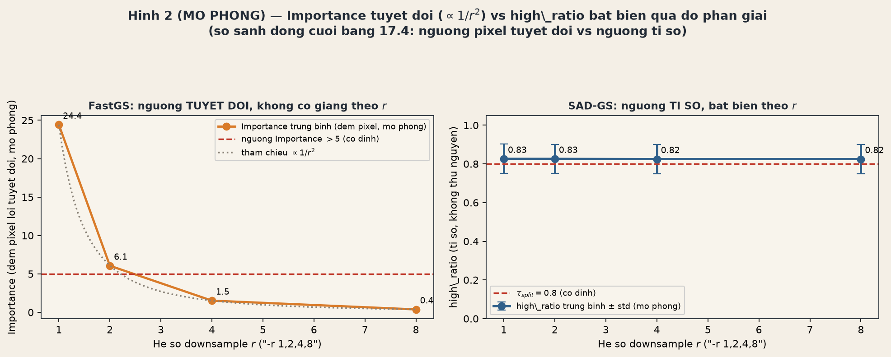
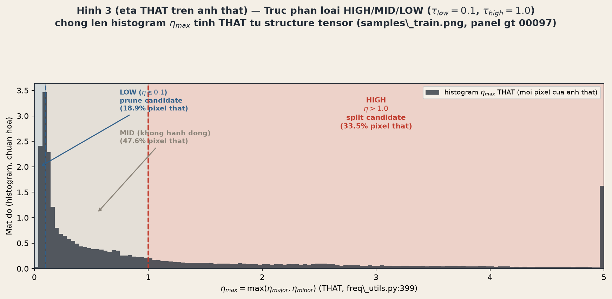

# 17.4 Multiview consistency: high/mid/low ratio

## Vì sao một view thôi là không đủ

Một Gaussian trong SAD-GS không được "chấm điểm" độ phân giải chỉ bằng một lần nhìn duy nhất. Mỗi Gaussian có thể xuất hiện trong hàng chục, hàng trăm view khác nhau trong quá trình train, và ở mỗi view, tỉ số $\eta_{\max}$ (extent của Gaussian so với bước sóng texture GT tại đúng vị trí đó) có thể dao động khá nhiều — một góc nhìn thẳng có thể cho $\eta_{\max}$ nhỏ (Gaussian "đủ mịn"), trong khi cùng Gaussian đó nhìn từ một góc cạnh, gần tiếp tuyến với mặt phẳng của nó, có thể cho $\eta_{\max}$ lớn đột biến (Gaussian "quá to" so với chi tiết ảnh) dù bản chất hình học của nó không hề thay đổi.

Nếu SAD-GS quyết định split hay prune chỉ dựa trên 1 view bất kỳ, hệ thống sẽ rất dễ bị nhiễu bởi đúng loại outlier góc nhìn này — y hệt trường hợp "1 pixel outlier" đã gặp ở ADC hiện đại (§12.1.4). Giải pháp của `update_freq_stats_online` là: đừng quyết định ngay ở từng view, mà **đếm dồn** qua nhiều lần quan sát, rồi chỉ hành động khi tỉ lệ view bị "flag" vượt một ngưỡng đủ cao (80%). Đây chính là ý nghĩa của "multiview consistency" trong tiêu đề mục này.

## Công thức phân loại và ngưỡng

Mỗi lần Gaussian $i$ được nhìn thấy trong một view (kiểm tra mỗi 10 iteration, trong `freq_utils.py:395-409`), hệ thống tính $\eta_{\max}=\max_k \eta_k$ và phân loại quan sát đó thành 3 lớp:

$$
\boxed{\ \text{high nếu }\eta_{\max}>\tau_{\text{high}}=1.0,\qquad
\text{low nếu }\eta_{\max}\le\tau_{\text{low}}=0.1,\qquad
\text{mid nếu ngược lại}\ }
$$

"High" nghĩa là Gaussian đang **quá to** so với chi tiết texture GT tại vị trí đó (under-resolved — ứng viên split). "Low" nghĩa là Gaussian đang **đủ nhỏ, thậm chí nhỏ hơn nhiều** so với chi tiết cần biểu diễn (over-resolved — ứng viên prune). "Mid" là vùng an toàn, không cần hành động.

Ba bộ đếm cộng dồn theo từng Gaussian $i$, tích lũy qua nhiều vòng: `eta_high_count[i]`, `eta_mid_count[i]`, `eta_low_count[i]`, cùng với `accum_view_count[i]` = tổng số lần Gaussian $i$ thực sự "active" (opacity $>0.05$ và xuất hiện trong view). Tại mỗi lần densify (`train.py:335-353`), hệ thống chuyển đếm dồn thành **tỉ lệ**:

$$
\boxed{\ \text{high\_ratio}_i=\frac{\text{eta\_high\_count}_i}{\text{accum\_view\_count}_i},\qquad
\text{low\_ratio}_i=\frac{\text{eta\_low\_count}_i}{\text{accum\_view\_count}_i}\ }
$$

Rồi ra quyết định split/prune dựa trên tỉ lệ này, cộng thêm một điều kiện phụ để tránh tác động lên các Gaussian gần như "chết" (gradient tích lũy quá nhỏ) hoặc chưa từng được quan sát:

$$
\boxed{\ \text{split\_mask}_i=[\text{high\_ratio}_i>\tau_{\text{split}}]\wedge[\lVert\bar g_i\rVert\ge10^{-5}]\ ,\qquad
\text{prune\_mask}_i=[\text{low\_ratio}_i>\tau_{\text{prune}}]\wedge[\text{accum\_view\_count}_i>0]\ }
$$

với $\tau_{\text{split}}=\tau_{\text{prune}}=0.8$ (`split_ratio_threshold`, `prune_ratio_threshold`, `arguments/__init__.py:148-149`). Nói bằng lời: **chỉ split một Gaussian nếu nó bị flag "under-resolved" trong hơn 80% số lần nó được nhìn thấy** — không phải vì nó bị flag ở một vài view lệch.

## So sánh với ADC hiện đại (Importance/Pruning, Chương 12)

| | ADC hiện đại | SAD-GS |
|---|---|---|
| Nguồn tín hiệu | sai số render↔GT | $\eta$ = extent Gaussian / bước sóng texture GT, không cần render |
| Gộp qua $V$ view | trung bình/tổng có trọng số | tỉ lệ view "flag" trên tổng view nhìn thấy (đếm nhị phân) |
| Ngưỡng | Importance $>5$ (tuyệt đối, phụ thuộc độ phân giải) | ratio $>0.8$ (tương đối, bất biến độ phân giải) |

Điểm mấu chốt nằm ở hàng cuối. Ngưỡng `Importance > 5` của ADC hiện đại là một **số pixel tuyệt đối**: khi đổi độ phân giải ảnh (`-r 2`, `-r 4`, ...), diện tích footprint của Gaussian trên ảnh co theo bình phương hệ số downsample, nhưng ngưỡng 5 thì đứng yên — kết quả là cùng một Gaussian có thể "quan trọng" ở độ phân giải gốc nhưng "không quan trọng" ở độ phân giải thấp hơn, dù bản chất hình học không đổi. Ngưỡng `high_ratio > 0.8` của SAD-GS thì khác về bản chất thống kê: nó là một **tỉ lệ**, không phải một số đếm, nên tự động co giãn đúng theo độ phân giải ảnh mà không cần chỉnh tay. Ba ví dụ số dưới đây minh họa cụ thể cho khác biệt này.

## Ba ví dụ số

### Hình 1 — quỹ đạo high/low_ratio qua M=30 quan sát, 3 kịch bản

Mô phỏng một Gaussian được quan sát $M=30$ lần (đúng nhịp 10-iteration/lần của `update_freq_stats_online`), với $\eta_{\max}$ rút từ phân phối log-normal ứng với 3 kịch bản vật lý hợp lý:

- **(a) Dưới-giải nhất quán** — hầu hết mọi view đều thấy Gaussian to hơn chi tiết ảnh. `high_ratio` hội tụ về **0.93 > 0.8** → **SPLIT**.
- **(b) Đã đủ mịn nhất quán** — Gaussian nhỏ ổn định ở mọi view. `low_ratio` đạt **1.00 > 0.8** → **PRUNE**.
- **(c) Chỉ bị flag ở view cạnh nghiêng** — nền $\eta_{\max}$ thấp, nhưng khoảng 22% số view (góc nhìn gần tiếp tuyến với mặt Gaussian) bị "outlier" đẩy $\eta_{\max}$ lên cao. `high_ratio` dao động **0.15–0.25** trong suốt quá trình và dừng ở **0.17** sau $M=30$ quan sát, không bao giờ vượt 0.8 → **không hành động**.

Kịch bản (c) chính là bằng chứng số cho tuyên bố "một view lệch không đủ sức kéo quyết định": dù gần 1/4 số lần quan sát bị flag "high", tỉ lệ tích lũy vẫn cách xa ngưỡng 0.8, nên hệ thống đúng đắn giữ nguyên Gaussian thay vì split nhầm vì vài góc nhìn hiếm gặp.

### Hình 2 — bất biến độ phân giải

Mô phỏng $N=400$ Gaussian, đo ở các hệ số downsample $r\in\{1,2,4,8\}$ (đúng quy ước `-r` của Chương 12):

- **Importance kiểu ADC hiện đại** (đếm pixel lỗi tuyệt đối trong footprint) co theo $1/r^2$ vì diện tích footprint co theo bình phương $r$: $\text{Importance}(r) = \{1{:}\ 24.41,\ 2{:}\ 6.06,\ 4{:}\ 1.52,\ 8{:}\ 0.38\}$. Đường này **cắt ngang ngưỡng cố định 5** ngay giữa $r=1$ và $r=2$ — nghĩa là cùng một Gaussian được coi là "quan trọng" ở $r=1$ nhưng "không quan trọng" ở $r=2,4,8$, dù hình học không đổi.
- **high_ratio kiểu SAD-GS** gần như không đổi: $\{1{:}\ 0.826,\ 2{:}\ 0.826,\ 4{:}\ 0.825,\ 8{:}\ 0.825\}$ — dao động dưới 0.2%, luôn nằm trên ngưỡng cố định 0.8 ở mọi $r$. Lý do toán học: $\eta = \text{axis\_length\_px}/\text{wavelength\_min\_px}$ là tỉ số của hai độ dài đo cùng đơn vị pixel-đã-downsample, nên $r$ tự triệt tiêu ở tử và mẫu.

Đây là bằng chứng trực tiếp: đổi độ phân giải ảnh khi train (`-r 2`, `-r 4`) làm thay đổi *ý nghĩa* của ngưỡng Importance tuyệt đối, nhưng không hề ảnh hưởng đến quyết định SPLIT của ngưỡng ratio.

### Hình 3 — histogram $\eta_{\max}$ thật trên ảnh thật

Khác với Hình 1 và Hình 2 (mô phỏng), Hình 3 dùng pipeline structure-tensor thật (`real_eta_axis.py`) trên ảnh thật `DOCS/assets/samples_train.png`, panel "gt 00097", cắt tại box pixel $(468,394,908,638)$ → ảnh con $440\times244 = 107{,}360$ pixel. Với kích thước neo giả định $(\sigma_{\text{major}},\sigma_{\text{minor}})=(18,6)$ px (do ảnh này không đi kèm scene 3DGS đã train nên không có $\Sigma_{2D}$ thật), $\eta_{\max}(x,y)$ được tính trên **mọi pixel** của ảnh thật này — không có số nào là random.

Kết quả phân bố: **18.9% LOW** ($\eta_{\max}\le0.1$, chủ yếu vùng nền phẳng như bầu trời, tường trơn), **47.6% MID**, và **33.5% HIGH** ($\eta_{\max}>1.0$, chủ yếu cạnh/kết cấu mạnh như các sọc chéo). Histogram có đỉnh nhọn sát 0 rồi giảm dần với một đuôi dài vượt xa $\tau_{\text{high}}=1.0$.

Ý nghĩa sư phạm: ngay trên **một ảnh đơn lẻ**, cả 3 lớp HIGH/MID/LOW đều xuất hiện với tỉ trọng đáng kể — không phải một trường hợp biên hiếm gặp. Đó là lý do vì sao `update_freq_stats_online` cần đủ cả ba bộ đếm `eta_high_count`/`eta_mid_count`/`eta_low_count`, và vì sao cơ chế "tỉ lệ qua nhiều view" (chứ không phải quyết định tức thời từ 1 view) là cần thiết: một Gaussian bao phủ cả vùng phẳng lẫn vùng cạnh tùy góc nhìn sẽ dao động qua lại giữa các lớp này, và chỉ ratio tích lũy đủ lớn mới phản ánh đúng bản chất "dưới-giải nhất quán" hay "đủ mịn nhất quán" của nó.

## Nối sang 17.5

`split_mask_i` vừa xây dựng ở đây là **đầu vào trực tiếp** cho bước tiếp theo: một khi Gaussian $i$ được xác nhận "under-resolved" qua đa số view (high_ratio $>0.8$), câu hỏi kế tiếp không còn là "có nên split hay không" (đã trả lời) mà là "split theo hướng nào". Vì $\eta_{\max}=\max(\eta_{\text{major}},\eta_{\text{minor}})$ được tính riêng cho từng trục chính của Gaussian, thông tin trục nào đang vượt ngưỡng (major hay minor, hoặc cả hai) sẽ dẫn dắt việc chia Gaussian theo đúng hướng bị thiếu chi tiết — đó chính là ý tưởng cốt lõi của **anisotropic split** ở mục 17.5: thay vì nhân đôi Gaussian một cách đẳng hướng như ADC cổ điển, SAD-GS dùng trục nào trong $(\eta_{\text{major}},\eta_{\text{minor}})$ đang là "thủ phạm" vượt $\tau_{\text{high}}$ để quyết định phương chia, giúp con Gaussian con bám sát đúng bước sóng texture GT theo từng hướng riêng biệt.
