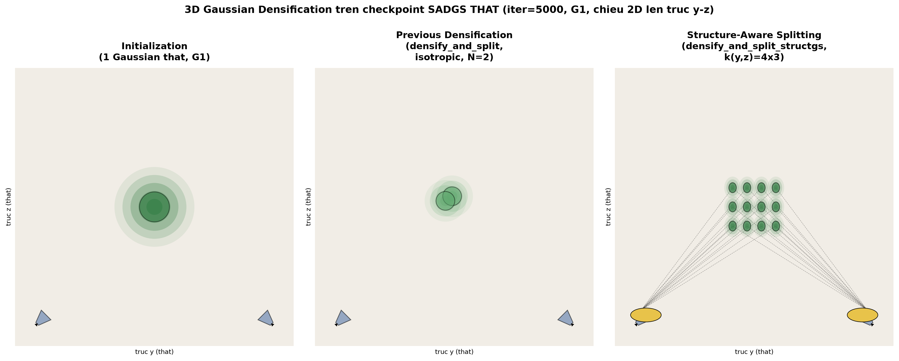
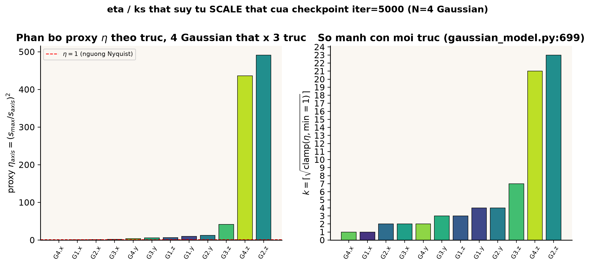
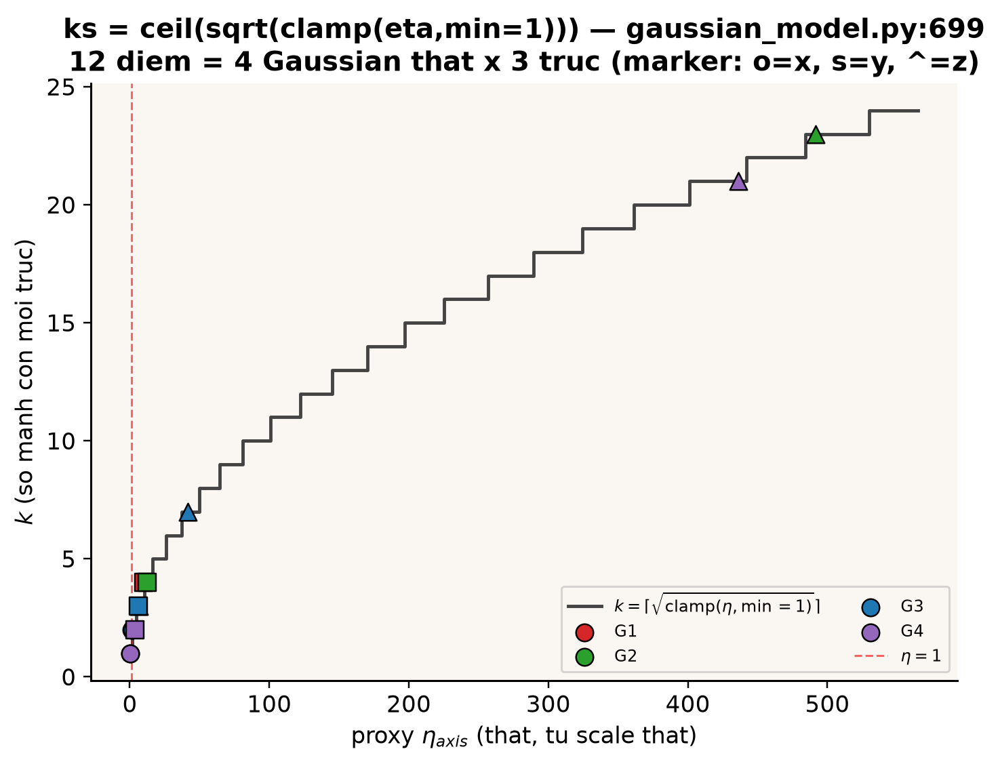
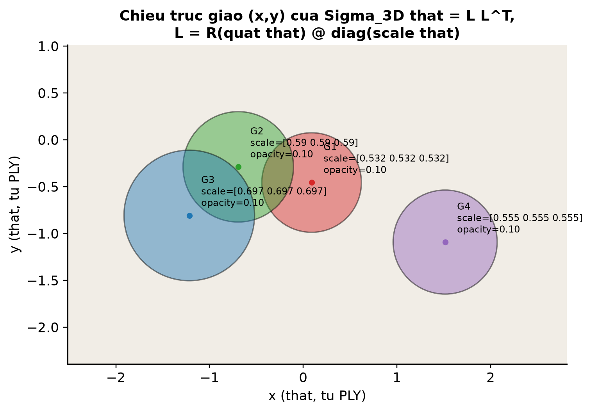
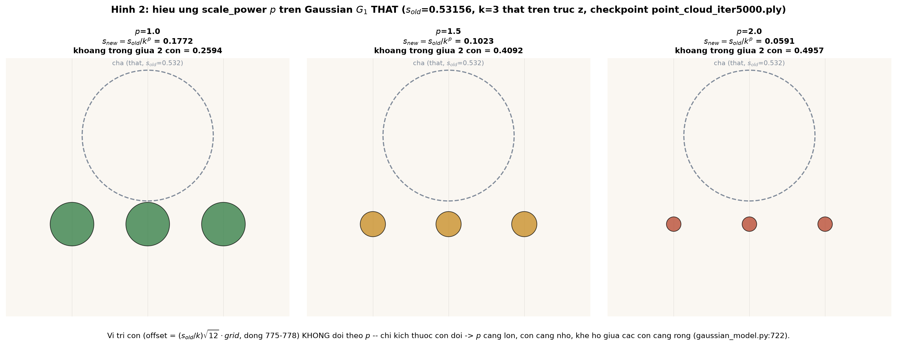
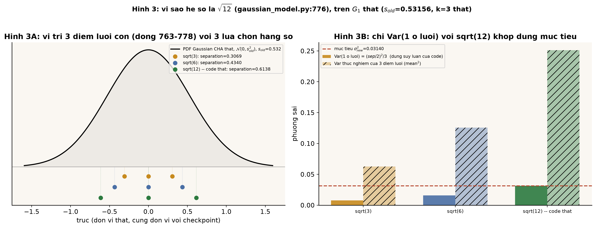

# 17.5 Anisotropic split — chia theo 3 trục độc lập

## Tóm tắt: khác biệt lớn nhất so với 3DGS gốc

3DGS gốc (`densify_and_split`) chỉ biết một cách chia: mỗi lần split ra đúng **2** bản con, lấy mẫu ngẫu nhiên kiểu Monte-Carlo $\mu^{(j)}=\mu_i+R\epsilon^{(j)}$ với $\epsilon\sim\mathcal N(0,\mathrm{diag}(s^2))$, không phân biệt trục nào thực sự "có vấn đề". SAD-GS (`densify_and_split_structgs`, `SADGS/scene/gaussian_model.py:638-831`) thay đổi cả số bản lẫn cách đặt:

- Số bản chia **không cố định = 2** mà tính riêng cho từng trục $x,y,z$ theo mức vi phạm Nyquist $\eta$ của trục đó, rồi nhân lại: $N=k_x k_y k_z$.
- Vị trí các bản con không còn ngẫu nhiên mà đặt trên một **lưới tất định, đối xứng qua tâm**.

Nói ngắn gọn: 3DGS gốc "chia đều, không hỏi lý do"; SAD-GS "chỉ chia trục nào thực sự cần chia, chia bao nhiêu tùy mức độ vi phạm".

*Một Gaussian thật `point_cloud_iter5000.ply`: cột giữa là `densify_and_split` gốc (luôn 2 bản), cột phải là `densify_and_split_structgs` với $k(y,z)=4\times3$ — tổng $12$ bản con xếp thành lưới đều, chỉ dùng cùng scale/rotation/opacity gốc.*

---

## Bước 1 — số lần chia mỗi trục $k_x,k_y,k_z$

$$
\boxed{\ k_{\text{axis}}=\Bigl\lceil\sqrt{\max(\eta_{\text{axis}},\,1)}\Bigr\rceil,\qquad \text{axis}\in\{x,y,z\}\ }
$$

Ý tưởng lấy mẫu: $\eta\sim(\sigma\omega)^2$ là bình phương "tần số $\times$ kích thước"; để khử alias cần $\sigma_{\text{new}}\omega\le1$, tức $\sigma_{\text{new}}=\sigma/k$ với $k\ge\sqrt\eta$. Số Gaussian con tổng cộng là $N=k_xk_yk_z$ — ví dụ $\eta=(9,9,9)\Rightarrow k=(3,3,3)\Rightarrow 27$ bản con từ **một** Gaussian cha, khác hẳn 3DGS gốc luôn ra đúng 2 bản bất kể mức độ sai.

*Proxy $\eta$ đo trực tiếp từ scale thật của 4 Gaussian trong checkpoint. Chú ý G2 trục z có $\eta\approx491.3$ — vượt xa các trục khác — minh họa rằng vi phạm Nyquist thường chỉ tập trung ở một, hai trục chứ không đều cả ba.*

*Hàm bậc thang $k(\eta)$ thật theo đúng `gaussian_model.py:699`: $\eta\in(1,4]\Rightarrow k=2$, $\eta\in(4,9]\Rightarrow k=3$,... Các điểm dữ liệu thật của 12 trục (4 Gaussian $\times$ 3 trục) nằm rải trên đường bậc thang này, xác nhận công thức khớp với code chạy thật.*

**Bug thật đã phát hiện trong code (không suy diễn ý đồ tác giả)**: dòng comment ngay phía trên (`gaussian_model.py:698`) viết *"Clamp min=2 (no split) and max=8 (limit VRAM usage)"*, nhưng dòng code thật sự chỉ là `ks = torch.clamp(ks, min=1)` — **không có clamp max**, và min thực tế là 1 chứ không phải 2 như comment ghi. Hệ quả: nếu $\eta<1$ ở mọi trục thì $k=1$ (không tách trục đó, đúng ý "không split"), nhưng nếu $\eta$ rất lớn ở một hoặc nhiều trục (ví dụ do outlier trong structure tensor), $k$ và do đó $N=k_xk_yk_z$ có thể tăng **không giới hạn** — không có trần an toàn kiểu `N_MAX` như 3DGS gốc.

**`scale_power`** (`args.ks_scale_power`, mặc định `1.0`): scale mới không luôn chia đúng $k$ mà chia $k^{p}$:

$$
s_{\text{new}}=\frac{s_{\text{old}}}{k^{\,p}}\qquad(p=1\Rightarrow\text{chia tuyến tính};\ p>1\Rightarrow\text{co mạnh hơn})
$$

---

## Bước 2 — lưới toạ độ con tất định (thay Monte-Carlo)

Thay vì sample ngẫu nhiên, SAD-GS đặt các Gaussian con trên **lưới đều, đối xứng qua tâm**, đúng số ô $k_x\times k_y\times k_z$:

$$
\text{grid}_k=i_k-\frac{k-1}2,\qquad i_k\in\{0,\dots,k-1\}
$$

$$
\boxed{\ \text{offset}_{\text{local}}=\bigl(s_{\text{old}}/k\bigr)\cdot\sqrt{12}\cdot\text{grid},\qquad
\text{offset}_{\text{world}}=R(q_i)\cdot\text{offset}_{\text{local}}\ }
$$

Vì sao $\sqrt{12}$: $\mathrm{Var}(\mathcal U(-a,a))=a^2/3$ — chọn bước lưới $=\sigma_{\text{new}}\sqrt{12}$ để phương sai của "một ô lưới" khớp với phương sai mà một phân phối đều tương đương sẽ có, xấp xỉ cùng độ trải rộng không gian mà $k$ mẫu Gaussian ngẫu nhiên $\mathcal N(0,\sigma_{\text{new}}^2)$ kỳ vọng có — nhưng **tất định** (deterministic), cùng input luôn ra cùng output, khác Monte-Carlo ngẫu nhiên của 3DGS gốc.

| | 3DGS gốc (Monte-Carlo) | SAD-GS (lưới tất định) |
|---|---|---|
| Vị trí con | ngẫu nhiên, có thể lệch, chồng lấn | đều, đối xứng, phủ đúng $k_x\times k_y\times k_z$ ô |
| Số con | luôn 2 | $k_xk_yk_z$, thay đổi theo mức vi phạm từng trục |
| Lặp lại có ra kết quả khác? | Có (stochastic) | Không (deterministic) |
| Hướng chia | đẳng hướng | dị hướng — chỉ trục $\eta$ cao mới bị chia nhiều |

*Trên một patch ảnh thật có cạnh chéo: 3DGS gốc chia đều cả 2 trục ($k=2,2$ cố định, $\sigma'=(9.0,3.0)$px — "chia đều cả 2 trục" dù trục nào cũng bị chia như nhau); SAD-GS dùng $\eta$ thật của từng trục để chỉ tách trục vi phạm nặng hơn ($k_x=2,k_y=1$, $\sigma'=(9.0,6.0)$px) — minh họa trực quan lý do gọi là "anisotropic".*

*Ellipse $\Sigma=LL^\top$, $L=R(q)\mathrm{diag}(s)$ của cả 4 Gaussian trong checkpoint, chiếu lên $(x,y)$ — mỗi Gaussian có hình dạng/scale khác nhau nên cần một bộ $(k_x,k_y,k_z)$ riêng, không thể dùng một hệ số chung cho toàn scene.*

*Mỗi hàng một Gaussian thật: cột giữa là `densify_and_split` gốc (luôn 2 bản), cột phải là `densify_and_split_structgs`. Số $N$ con thay đổi rất mạnh giữa các Gaussian: G1 ra 12 con ($k=1,4,3$), G2 ra 184 con ($k=2,4,23$), G3 ra 42 con ($k=2,3,7$), G4 ra 42 con ($k=1,2,21$) — cùng một công thức nhưng kết quả phụ thuộc hoàn toàn vào $\eta$ thật đo được trên từng trục của từng Gaussian.*

---

## Bước 3 — kế thừa bộ đếm, clone không đổi, expand bị vô hiệu hoá

`densify_and_split_structgs` reset `accum_eta`, `accum_view_count`, `max_eta_3ch` về 0 cho Gaussian con, nhưng **cộng thêm 1** vào `densify_count` kế thừa từ cha — một bộ đếm không có tương đương trực tiếp trong 3DGS gốc, dùng (theo comment ở `update_freq_stats_online`) để giới hạn số lần một vùng bị densify liên tục. **Bug thật thứ hai**: đoạn code áp dụng giới hạn này (`max_densify_count=3`, `freq_utils.py:224-227`) đang bị **comment out** — bộ đếm vẫn được duy trì và tăng dần, nhưng chưa thật sự chặn gì trong pipeline hiện tại.

`densify_and_clone_structgs` (`gaussian_model.py:934-955`) gần như giống hệt clone gốc, copy y nguyên $\theta_{\text{new}}=\theta_i$, không cải tiến gì — đúng logic: clone dành cho vùng **thiếu Gaussian** (extent nhỏ), không liên quan tới độ phân giải/tần số mà $\eta$ đo được (chỉ áp cho Gaussian đã to, cần split).

*Clone thật trên một Gaussian của checkpoint: bản sao đặt trùng vị trí/scale/màu cha (khoảng cách hiển thị trong hình chỉ để nhìn rõ, khoảng cách thực = 0) — xác nhận "copy y nguyên" chứ không dịch chuyển hay thu nhỏ như split.*

`expand_undersized_gs` dùng công thức $\Delta\log\sigma=-\tfrac12\log\eta$ để giãn Gaussian dưới cỡ ($0<\eta<\tau_{\text{expand}}=1$) về đúng kích thước Nyquist. **Bug thật thứ ba**: lời gọi hàm này ở `train.py:356-359` đang bị **comment**, nghĩa là hàm này không chạy trong pipeline mặc định — hình dưới chỉ minh hoạ công thức đúng theo code, không phải hành vi đang thực thi.

*Một patch vùng phẳng thật với $\eta_{\text{maj}}=0.1003$, $\eta_{\text{min}}=0.0334$ (đều $<\tau_{\text{expand}}=1$): scale được phóng to giải tích từ $\sigma=(18,6)$px lên $\sigma'=(57,33)$px để $\eta_{\text{new}}\to1$ — nhưng nhắc lại, hàm gọi nó đang bị comment nên đây chỉ là minh hoạ công thức, không phải hành vi mặc định.*

---

## Ba thực nghiệm đào sâu

*(script `deep17e_anisotropic_split.py`, checkpoint thật `point_cloud_iter5000.ply`)*

### (a) Rủi ro nổ $N$ khi không có trần cho $k$

Quét $\eta$ từ 1 đến 100 (worst case đối xứng — cả 3 trục cùng vi phạm bằng $\eta$). Tại $\eta=(9,9,9)\Rightarrow N=27$. Đường code thật ($N=k^3$, chỉ `clamp(min=1)`) và đường "nếu áp clamp max=8 theo comment" **trùng nhau tới $\eta=64$**; khác biệt chỉ lộ rõ từ $\eta>64$. Tại $\eta=100$: code thật cho $N=k^3=10^3=1000$, còn nếu có trần max=8 thì $N$ bị chặn ở $8^3=512$ — sai lệch gần gấp đôi chỉ với $\eta=100$.

Điểm dữ liệu thật đo được trong checkpoint: Gaussian G2 trục z có $\eta=491.3$, tức $k_z$ thật $=23$ **trên một trục**. Nếu cả 3 trục của G2 đều lớn như vậy (giả thuyết, không phải thật), $N$ sẽ là $23^3=12167$ chỉ từ một Gaussian cha; nhưng thực tế $N$ thật của G2 chỉ là $184$, vì hai trục còn lại có $\eta$ nhỏ hơn nhiều — đây là bằng chứng số cho tính "dị hướng": $N$ chỉ nổ theo trục thật sự vi phạm, không đồng loạt theo cả 3 trục.

*Hình 1A: đường đỏ (code thật) và đường xanh nét đứt (nếu áp clamp max=8) trùng nhau tới $\eta=64$, tách nhau rõ sau đó. Hình 1B: $\eta=50\Rightarrow k=8$ (hai đường vẫn khớp, $N=512$ cả hai); $\eta=100\Rightarrow k=10$, code thật vọt lên $N=1000$ trong khi bản có trần dừng ở $512$.*

### (b) Tác động của `scale_power` $p$

Gaussian $G_1$ thật: $s_{\text{old}}=0.53156$, $k=3$ (thật, trục z). Cố định $k=3$, so sánh $p\in\{1.0,1.5,2.0\}$.

Khoảng cách giữa hai con liền kề luôn **cố định $=0.6138$** ($=\sqrt{12}\,(s_{\text{old}}/k)$) — không đổi theo $p$, vì công thức offset dùng $s_{\text{old}}/k$ chứ không dùng $k^p$. Trong khi đó kích thước con $s_{\text{new}}=s_{\text{old}}/k^p$ co lại mạnh theo $p$: $p=1.0\Rightarrow s_{\text{new}}=0.1772$ (khe hở giữa 2 con liền kề $=0.2594$); $p=1.5\Rightarrow s_{\text{new}}=0.1023$ (khe hở $=0.4092$); $p=2.0\Rightarrow s_{\text{new}}=0.0591$ (khe hở $=0.4957$) — khe hở tăng gần gấp đôi từ $p=1$ lên $p=2$, vì vị trí không co lại cùng tốc độ với kích thước.

*$k=3$ cố định, chỉ đổi $p$: 3 vòng tròn con giữ nguyên khoảng cách tâm-tâm nhưng co nhỏ dần khi $p$ tăng — để lại khoảng trống ngày càng lớn giữa các con.*

### (c) Vì sao $\sqrt{12}$ chứ không phải $\sqrt3$ hay $\sqrt6$

Cùng $G_1$ thật, $k=3$, $\sigma_{\text{new}}=s_{\text{old}}/k=0.17719$, mục tiêu $\sigma_{\text{new}}^2=0.031395$. Coi `separations` là bề rộng toàn phần của một ô lưới (nửa bề rộng $a=\text{separations}/2$), $\mathrm{Var}(\mathcal U(-a,a))=a^2/3$: chỉ $\sqrt{12}$ cho đúng $0.031395$ khớp chính xác mục tiêu; $\sqrt3$ cho $0.007849$ (nhỏ hơn 4 lần); $\sqrt6$ cho $0.015698$ (nhỏ hơn 2 lần).

**Lưu ý quan trọng**: phương sai *thực nghiệm* của toàn bộ $k=3$ điểm lưới rời rạc (không phải phương sai giả định của "một ô") lại **lớn hơn** mục tiêu theo đúng hệ số $(k^2-1)=8$ ở cả 3 lựa chọn hằng số. Nghĩa là $\sqrt{12}$ chỉ khớp đúng phương sai giả định cho **một ô lưới đơn lẻ** — đúng tinh thần suy luận trong code — chứ **không phải** đẳng thức chính xác cho phương sai của toàn tập $k$ điểm con rời rạc. Đây là một sắc thái mà văn bản gốc mục 17.5 chưa nói rõ: $\sqrt{12}$ là một xấp xỉ hợp lý cho từng ô, độ lệch so với phương sai tổng tăng theo $k^2$.

*Hình 3B: chỉ cột $\sqrt{12}$ (xanh lá, đặc) chạm đúng đường mục tiêu $\sigma_{\text{new}}^2=0.03140$ ở phần "Var(1 ô lưới)"; nhưng cột có vân chéo (phương sai thực nghiệm của 3 điểm) lại cao hơn đường mục tiêu ở cả 3 lựa chọn hằng số — kể cả $\sqrt{12}$.*

---

## Tổng kết pipeline 17.1 → 17.5

Toàn bộ chương SAD-GS ghép lại thành một chuỗi xử lý duy nhất: đầu tiên, structure tensor (§17.1) đo hướng và độ mạnh biến thiên cục bộ của ảnh để biết đâu là vùng có cấu trúc tần số cao; multiscale pyramid (§17.2) lặp lại phép đo này ở nhiều độ phân giải để không bỏ sót chi tiết ở cả tỉ lệ lớn lẫn nhỏ. Từ đó, tỉ số $\eta$ (§17.3) được tính cho từng trục của từng Gaussian, đóng vai trò "chỉ số vi phạm Nyquist" — càng lớn càng cần chia nhỏ. Multiview ratio (§17.4) tổng hợp $\eta$ quan sát được từ nhiều góc camera khác nhau để có một ước lượng ổn định, tránh việc một view lẻ tẻ kích hoạt split sai. Cuối cùng, anisotropic split (§17.5) dùng chính $\eta$ per-axis đó để quyết định số bản chia $k_x,k_y,k_z$ và đặt các Gaussian con trên lưới tất định — biến một chỉ số đo lường trừu tượng thành hành động cụ thể thay đổi hình học của scene, khép kín vòng "đo cấu trúc → phát hiện vi phạm → sửa bằng densification có định hướng".
