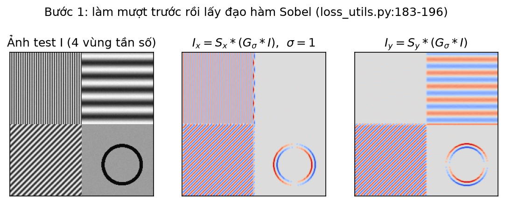
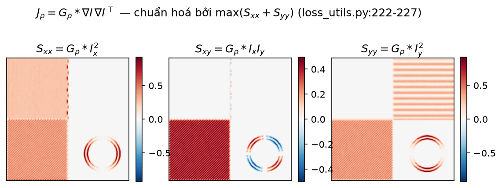
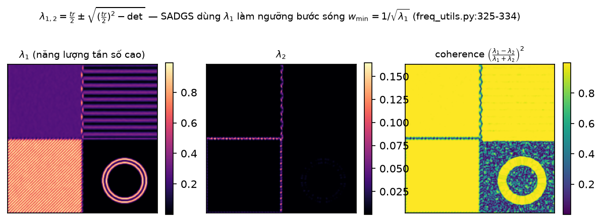
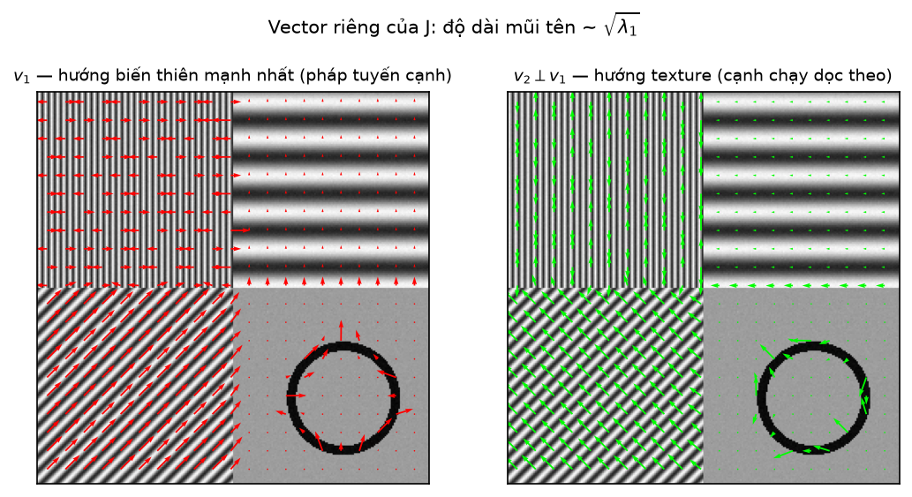
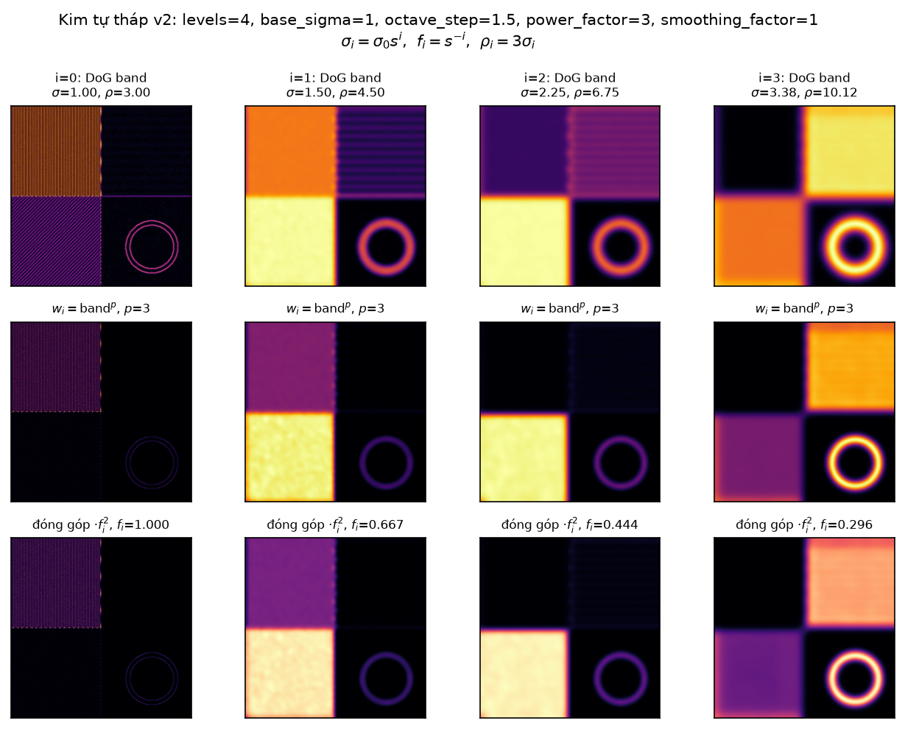
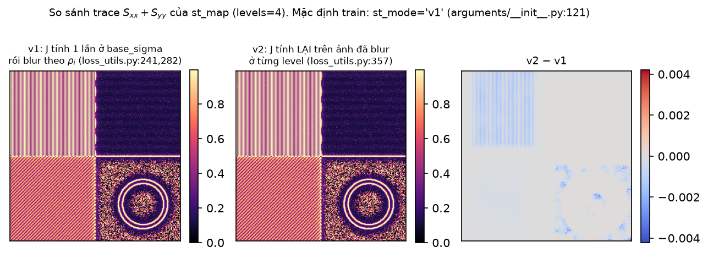
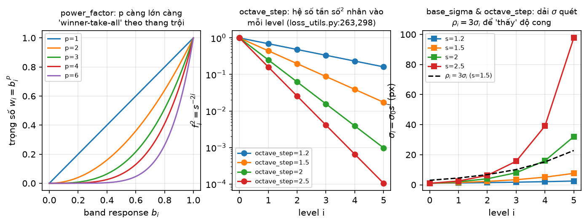
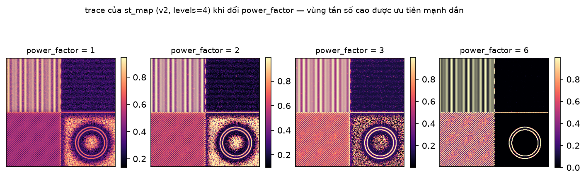

[← Mục lục chương 18](00-muc-luc.md) · Chương 18.1

# Chương 18.1 — Structure tensor & multiscale image structure

> Nguồn:
> - `SADGS/utils/loss_utils.py:113-168` — `fast_gaussian_blur` (hạ tầng làm mờ, có nhánh downsample).
> - `SADGS/utils/loss_utils.py:170-230` — `get_structure_tensor_torch` (Di Zenzo, 6 bước).
> - `SADGS/utils/loss_utils.py:232-313` — `get_multiscale_structure_tensor_v1`.
> - `SADGS/utils/loss_utils.py:315-387` — `get_multiscale_structure_tensor_v2`.
> - `SADGS/utils/loss_utils.py:80-111` — `frequency_loss` (không được gọi ở đâu).
> - `SADGS/utils/loss_utils.py:389-392` — `frequency_loss_simple` (chỉ được `import`, không được gọi).
> - `SADGS/utils/loss_utils.py:394-438` — `estimate_required_gaussians` (gọi một hàm **không tồn tại**, xem §18.1.9).
> - `SADGS/train.py:160-199` — precompute + cache structure tensor trước vòng huấn luyện.
> - `SADGS/arguments/__init__.py:117-121, 148-150` — `lambda_freq`, `st_levels`, `st_mode`, ngưỡng tiêu thụ.
> - `SADGS/utils/freq_utils.py:320-375` — nơi `st_map` được tiêu thụ (chỉ trích ở đây để nối mạch; chi tiết ở [Chương 18.2](02-chieu-truc-va-ti-so-eta.md)).
> - `SADGS/utils/gaussian_sampling.py:8,35-45` — người dùng thứ hai của structure tensor (bản đơn tỉ lệ).
> - Hình: `DOCS/Slides67/figures/sadgsx/scripts/bot01_figs.py` — cài đặt lại toàn bộ chuỗi trên bằng numpy/scipy, cùng tham số mặc định.
>
> Chương 18.1 đi sâu vào **phần đo đạc ảnh**, tức là mục [17.1–17.2](../17-sadgs-structure-aware-densification.md) đã tóm tắt. Ở đây ta mổ từng dòng, từng hằng số, và trả lời bằng số: `st_map` thực sự nhận giá trị trong dải nào, và dải đó ràng buộc ngưỡng $\eta$ ra sao.

| Mục | Nội dung |
|---|---|
| 18.1.0 | Vị trí của `st_map` trong pipeline SADGS |
| 18.1.1 | `fast_gaussian_blur` — hạ tầng làm mờ và cái giá của nhánh downsample |
| 18.1.2 | Structure tensor Di Zenzo — 6 bước, đọc kỹ từng dòng |
| 18.1.3 | Phổ riêng $\lambda_1,\lambda_2$ và coherence |
| 18.1.4 | Vector riêng — hướng pháp tuyến cạnh vs hướng texture |
| 18.1.5 | Kim tự tháp đa tỉ lệ — vòng lặp octave |
| 18.1.6 | v1 vs v2 — khác nhau đúng ở ba dòng |
| 18.1.7 | Siêu tham số `power_factor`, `octave_step` — tác động định lượng |
| 18.1.8 | Dải giá trị thật của `st_map` và hệ quả lên ngưỡng $\eta=1$ |
| 18.1.9 | Cache trong `train.py` + kiểm kê code chết |
| 18.1.10 | Tóm tắt |

---

## 18.1.0 Vị trí của `st_map` trong pipeline

SADGS không dùng sai số render↔GT làm tín hiệu densify (đó là cách 3DGS gốc làm). Nó dùng một đại lượng **chỉ phụ thuộc ảnh GT**: bản đồ tensor cấu trúc `st_map`, tính **một lần duy nhất** trước khi vòng huấn luyện bắt đầu (`train.py:160-199`), rồi giữ nguyên suốt 30 000 iteration.

Hệ quả kiến trúc rất đáng chú ý:

- **Chi phí là chi phí cố định**, không phải chi phí mỗi vòng. Với $N$ view ảnh, ta trả $N$ lần multiscale structure tensor rồi thôi. Đoạn code bao quanh có `time.time()` in ra thời gian (`train.py:163, 199`).
- **Bộ nhớ là chi phí thường trực**: cache giữ nguyên một tensor `(1,3,H,W)` float32 cho **mỗi** camera (`train.py:193-194`), thường trú trên GPU. Với 200 view ở $1600\times1200$, riêng cache này là $200\times3\times1600\times1200\times4\ \text{B}\approx 4.6$ GB — đây là ràng buộc bộ nhớ thực tế của SADGS, không phải chi tiết phụ.
- **`st_map` không nằm trong đồ thị tính gradient.** Nó được tính trong `torch.no_grad()` (`train.py:186`) và chỉ dùng làm tín hiệu **gate** cho densify/prune. Hàm loss có dùng structure tensor (`frequency_loss_simple`, `loss_utils.py:389`) tồn tại nhưng **không được gọi**, và `lambda_freq = 0.` (`arguments/__init__.py:119`) — xem §18.1.9.

---

## 18.1.1 `fast_gaussian_blur` — hạ tầng làm mờ

Mọi bước làm mờ trong chương này đều đi qua `fast_gaussian_blur` (`loss_utils.py:113-168`). Hàm có ba nhánh, và nhánh thứ ba là chỗ dễ bị bỏ qua nhất:

| Điều kiện | Nhánh | Dòng |
|---|---|---|
| $\sigma > \max(H,W)$ | trả về trung bình toàn ảnh, tiled ra $(H,W)$ | `:122-124` |
| $\sigma \le 2.0$ | `torchvision.gaussian_blur` chính xác, kernel bị cắt $\le 2(H{-}1){-}1$ | `:128-134` |
| $\sigma > 2.0$ | **downsample $\to$ blur $\to$ upsample bilinear** | `:136-168` |

Kích thước kernel mặc định:

$$
k=\bigl(2\cdot 4\sigma+1\bigr)\ \big|\ 1
\qquad\text{(phép OR với 1 để ép số lẻ, \texttt{loss\_utils.py:126})}
$$

Nhánh thứ ba là một **xấp xỉ**: ảnh bị thu nhỏ theo `scale = int(sigma)` (bị chặn bởi $H/4, W/4$), làm mờ với $\sigma_{\text{down}}=\sigma/(H/H_{\text{down}})$, rồi nội suy bilinear trở lại. Điều này quan trọng vì trong vòng lặp đa tỉ lệ, cửa sổ tích phân là $\rho_i = 3\sigma_i$ (`:279`, `:354`) — với `levels=4`, `base_sigma=1`, `octave_step=1.5`:

$$
\sigma_i \in \{1;\ 1.5;\ 2.25;\ 3.375\},\qquad
\rho_i = 3\sigma_i \in \{3;\ 4.5;\ 6.75;\ 10.125\}
$$

Nghĩa là **mọi** lần tích hợp cửa sổ ($\rho_i \ge 3 > 2$) đều chạy nhánh downsample, và từ level 2 trở đi ($\sigma_i = 2.25 > 2$) cả bước tiền làm mượt của v2 cũng vậy. `st_map` ở các octave thô là kết quả của một pipeline downsample–upsample chứ không phải tích chập Gauss chính xác. Đây là trade-off tốc độ có chủ đích (tên hàm nói thẳng: *fast*), nhưng cần ghi nhận khi so sánh với cài đặt tham chiếu bằng `scipy.ndimage.gaussian_filter` — chính script hình `bot01_figs.py:68-74` nêu rõ nó **bỏ nhánh downsample** vì không cần tối ưu GPU.

---

## 18.1.2 Structure tensor Di Zenzo — 6 bước

`get_structure_tensor_torch(image_tensor, sigma=1.0, rho=1.0)` (`loss_utils.py:170`) thực hiện đúng 6 bước, được đánh số ngay trong comment của code.

**Bước 1 — tiền làm mượt** (`:179-183`). Không làm mượt thì Sobel khuếch đại nhiễu cảm biến thành "tần số cao" giả:

$$
\tilde I = G_\sigma * I,\qquad k = \texttt{int}(2\cdot 4\sigma+1) \text{ (ép lẻ, \texttt{loss\_utils.py:178-179})}
$$

**Bước 2 — Sobel theo từng kênh** (`:187-196`). Kernel được `repeat(C,1,1,1)` rồi `conv2d(..., groups=C)`, tức mỗi kênh RGB có đạo hàm **riêng**, không trộn:

$$
S_x=\begin{pmatrix}-1&0&1\\-2&0&2\\-1&0&1\end{pmatrix},\quad
S_y=S_x^{\top},\qquad
I_x = S_x*\tilde I,\quad I_y = S_y*\tilde I \quad \text{shape } (B,C,H,W)
$$

*Hình 18.1.1 — Trái: ảnh test 256×256 do `bot01_figs.py:37-59` sinh, gồm 4 góc phần tư: sọc **dọc** chu kỳ 4 px (trên-trái), sọc **ngang** chu kỳ 24 px (trên-phải), sọc **chéo 45°** chu kỳ 10 px (dưới-trái), và vùng phẳng giá trị 0.55 chứa một **cung tròn** bán kính 34 px, dày 3 px (dưới-phải); toàn ảnh cộng nhiễu Gauss $\sigma=0.01$. Giữa và phải: $I_x$ và $I_y$ sau khi làm mượt $\sigma=1$, thang màu `coolwarm` đối xứng quanh 0. Đọc hình: góc sọc dọc chỉ sáng ở $I_x$ (biến thiên theo $x$), góc sọc ngang chỉ sáng ở $I_y$, góc sọc chéo sáng ở **cả hai** với biên độ tương đương, vùng phẳng gần như bằng 0 trừ đúng vòng cung. Đây là minh hoạ trực tiếp cho bước 1–2: đạo hàm là đại lượng **có dấu và có hướng**, chưa phải đại lượng năng lượng.*

**Bước 3 và 4 — tích rồi cộng dồn 3 kênh** (`:199-208`). Đây là điểm Di Zenzo:

$$
\boxed{\;
I_{xx}=\sum_{c\in\{R,G,B\}} I_{x,c}^2,\qquad
I_{xy}=\sum_c I_{x,c}I_{y,c},\qquad
I_{yy}=\sum_c I_{y,c}^2
\;}
$$

Kết quả rút từ $(B,C,H,W)$ xuống $(B,1,H,W)$. Cộng **năng lượng** chứ không cộng gradient: một cạnh iso-luminant (đỏ ↔ lục cùng độ sáng) có gradient luminance $\approx 0$ nhưng $I_{xx}>0$ rõ, nên không bị bỏ sót — docstring `:172-173` nói đúng điều này.

**Bước 5 — tích hợp cửa sổ** (`:212-217`), bước biến "tensor gradient hạng 1" thành structure tensor thật sự:

$$
S_{xx}=G_\rho*I_{xx},\quad S_{xy}=G_\rho*I_{xy},\quad S_{yy}=G_\rho*I_{yy}
$$

Vì sao **bắt buộc**: không có $G_\rho$ thì $\nabla I\,\nabla I^\top$ là ma trận hạng 1 tại mọi pixel, nên $\det = I_{xx}I_{yy}-I_{xy}^2 = 0$ khắp nơi, $\lambda_2\equiv 0$, và coherence $\equiv 1$ — không phân biệt được cạnh thẳng với góc hay texture đẳng hướng. Chính $G_\rho$ tạo ra hạng 2.

**Bước 6 — chuẩn hoá theo batch** (`:222-227`):

$$
(S_{xx},S_{xy},S_{yy}) \leftarrow \frac{(S_{xx},S_{xy},S_{yy})}{\max_{c,H,W}\bigl(S_{xx}+S_{yy}\bigr)+10^{-6}}
$$

`torch.amax(..., dim=(1,2,3), keepdim=True)` — lấy max **theo từng ảnh trong batch**, không phải toàn batch. Mục đích: ngưỡng $\eta$ không trôi theo độ sáng/độ tương phản của từng cảnh. Đầu ra là `torch.cat([Sxx,Sxy,Syy], dim=1)` shape $(B,3,H,W)$ (`:230`) — ba kênh đủ để dựng lại ma trận đối xứng $2\times2$ tại mỗi pixel:

$$
J_\rho(x,y)=\begin{pmatrix} S_{xx} & S_{xy}\\ S_{xy} & S_{yy}\end{pmatrix}
$$

*Hình 18.1.2 — Ba kênh của $J_\rho$ ở $\sigma=1,\rho=1$, thang màu `RdBu_r` đối xứng quanh 0, mỗi panel có colorbar riêng. Đọc hình theo đúng công thức bước 3–5: góc sọc **dọc** cho $S_{xx}$ lớn, $S_{yy}\approx0$; góc sọc **ngang** ngược lại; góc sọc **chéo** cho $S_{xy}$ lớn và **có dấu** (dấu mã hoá hướng nghiêng $+45°$ hay $-45°$), đồng thời $S_{xx}\approx S_{yy}$; vùng phẳng cho cả ba $\approx 0$ trừ vòng cung, nơi $S_{xy}$ đổi dấu bốn lần khi đi quanh cung vì pháp tuyến cung quay đủ một phần tư vòng. Lưu ý $S_{xx},S_{yy}\ge 0$ theo định nghĩa (bình phương), chỉ $S_{xy}$ có dấu — nên hai panel ngoài chỉ dùng nửa đỏ của thang màu.*

---

## 18.1.3 Phổ riêng $\lambda_1,\lambda_2$ và coherence

$J_\rho$ đối xứng nửa xác định dương, nên có hai trị riêng thực không âm, tính bằng công thức đóng cho ma trận $2\times2$:

$$
\mathrm{tr}=S_{xx}+S_{yy},\qquad \det = S_{xx}S_{yy}-S_{xy}^2,
$$
$$
\boxed{\;\lambda_{1,2}=\frac{\mathrm{tr}}{2}\pm\sqrt{\Bigl(\frac{\mathrm{tr}}{2}\Bigr)^2-\det}\;}
$$

Đây chính xác là đoạn `freq_utils.py:325-329`, với `torch.clamp(..., min=0.0)` chặn căn âm do sai số số học. Từ $\lambda_1$, SADGS quy đổi sang **bước sóng**:

$$
\boxed{\;w_{\min}=\frac{1}{\sqrt{\lambda_1}+10^{-5}}\;}\qquad\text{(\texttt{freq\_utils.py:334})}
$$

Lập luận thứ nguyên: $\lambda_1$ là năng lượng gradient bình phương, mà gradient $\sim$ tần số $f$, nên $\sqrt{\lambda_1}\sim f$ và $w_{\min}\sim 1/f$ là bước sóng — "chi tiết nhỏ nhất còn nhìn thấy được", tính bằng pixel. $10^{-5}$ chặn chia cho 0 ở vùng phẳng.

Ba chế độ của phổ riêng, dùng làm từ điển đọc mọi bản đồ structure tensor:

| Chế độ | Phổ | Ý nghĩa ảnh |
|---|---|---|
| Phẳng | $\lambda_1\approx\lambda_2\approx 0$ | không có cấu trúc, Gaussian to bao nhiêu cũng được |
| Cạnh | $\lambda_1\gg\lambda_2\approx 0$ | một hướng biến thiên; Gaussian được phép dài **dọc** cạnh |
| Góc / texture 2D | $\lambda_1\approx\lambda_2\gg 0$ | biến thiên hai hướng; Gaussian phải nhỏ theo **mọi** hướng |

Đại lượng tách ba chế độ này là **coherence**:

$$
C=\Bigl(\frac{\lambda_1-\lambda_2}{\lambda_1+\lambda_2}\Bigr)^2\in[0,1]
$$

*Hình 18.1.3 — $\lambda_1$, $\lambda_2$ (thang `magma`) và coherence (thang `viridis`) tính trực tiếp từ $J_\rho$ của ảnh test bằng `eig2x2` (`bot01_figs.py:99-113`), công thức trùng khít `freq_utils.py:325-329`. Đọc hình: $\lambda_1$ sáng nhất ở góc sọc dọc chu kỳ 4 px — đúng như dự đoán, chu kỳ ngắn nhất cho năng lượng gradient lớn nhất — và tối nhất ở vùng phẳng. $\lambda_2$ gần 0 ở **mọi** vùng sọc (sọc là cấu trúc một chiều, dù nghiêng), chỉ nhấc lên ở nơi hai hướng cùng biến thiên. Coherence do đó $\approx 1$ trên toàn bộ ba góc sọc và sụt xuống tại **biên giữa các góc phần tư** cùng tại vòng cung — nơi hướng cấu trúc đổi trong phạm vi cửa sổ $\rho$. Kết luận rút ra: $\lambda_1$ trả lời "chi tiết nhỏ cỡ nào", coherence trả lời "chi tiết có một hướng rõ rệt không" — SADGS chỉ dùng cái thứ nhất ở mode `wavelength`, và gián tiếp dùng cái thứ hai qua dạng toàn phương ở mode `projection`.*

---

## 18.1.4 Vector riêng — pháp tuyến cạnh vs hướng texture

Vector riêng ứng với $\lambda_1$ tính bằng công thức đóng (`bot01_figs.py:105-107`):

$$
v_1 \propto \begin{pmatrix} S_{xy}\\ \lambda_1-S_{xx}\end{pmatrix},
\qquad v_2\perp v_1,
\qquad \theta=\tfrac12\arctan\frac{2S_{xy}}{S_{xx}-S_{yy}}
$$

với nhánh suy biến (cả hai thành phần $<10^{-12}$) được ép về $(1,0)$.

Diễn giải hình học, và đây là cầu nối sang phần anisotropic split:

- $v_1$ = hướng biến thiên **mạnh nhất** = **pháp tuyến** của cạnh. Gaussian kéo dài theo $v_1$ thì làm mờ cạnh.
- $v_2$ = hướng biến thiên **yếu nhất** = hướng cạnh chạy dọc theo = hướng mà Gaussian **được phép** kéo dài mà không mất chi tiết.

Dạng toàn phương tổng quát hoá cả hai:

$$
\boxed{\;u^\top J u = S_{xx}u^2 + 2S_{xy}uv + S_{yy}v^2\;}
$$

đo năng lượng tần số dọc theo **một hướng $u=(u,v)$ bất kỳ**. Đây đúng là công thức `eta_compute_mode="projection"` (`freq_utils.py:371`, kèm `torch.sqrt` ở `:373`), trong khi mode mặc định `"wavelength"` (`arguments/__init__.py:150`) chỉ dùng vô hướng $\lambda_1 = \max_{\|u\|=1} u^\top J u$ — tức **trường hợp tệ nhất theo mọi hướng**, cố tình bỏ qua hướng trục Gaussian.

*Hình 18.1.4 — Quiver trên lưới bước 12 px: trái là $v_1$ (đỏ), phải là $v_2\perp v_1$ (lục), độ dài mũi tên tỉ lệ $\sqrt{\lambda_1}$ chuẩn hoá về $[0,1]$ (`bot01_figs.py:216-218`). Đọc hình: ở góc sọc dọc, $v_1$ nằm **ngang** (pháp tuyến của sọc dọc) còn $v_2$ nằm dọc; ở góc sọc ngang thì ngược lại và mũi tên **ngắn hơn hẳn** vì chu kỳ 24 px cho $\lambda_1$ nhỏ; ở góc sọc chéo cả hai nghiêng 45°. Quanh vòng cung, $v_1$ luôn chỉ theo phương xuyên tâm còn $v_2$ đi theo **tiếp tuyến** — đây là bằng chứng trực quan cho việc $v_2$ là "hướng an toàn để kéo dài": một Gaussian dẹt bám theo tiếp tuyến cung sẽ phủ cung mà không làm mờ nó. Ở vùng phẳng mũi tên gần như biến mất vì $\sqrt{\lambda_1}\approx 0$, phản ánh đúng chuyện hướng không xác định khi không có cấu trúc.*

---

## 18.1.5 Kim tự tháp đa tỉ lệ

Một $\sigma$ duy nhất chỉ "nhìn thấy" một dải tần: $\sigma=1$ bắt cạnh sắc nhưng mù với vân lặp chu kỳ 24 px, $\sigma=4$ thì ngược lại. Hai hàm multiscale quét `levels` octave với cùng một khung (v1: `:262-306`; v2: `:335-380`):

$$
\boxed{\;
\sigma_i = \sigma_0\, s^{\,i},\qquad
f_i = s^{-i},\qquad
\rho_i = 3\sigma_i,\qquad
\Delta\sigma_i=\sqrt{\max(10^{-6},\ \sigma_i^2-\sigma_{i-1}^2)}
\;}
$$

với $s=\texttt{octave\_step}=1.5$, $\sigma_0=\texttt{base\_sigma}=1.0$. $\Delta\sigma_i$ (`:266`, `:340`) là mẹo **làm mờ tiếp** từ ảnh đã mờ ở octave trước thay vì làm mờ lại từ ảnh gốc, dùng tính chất bán nhóm $G_{a}*G_{b}=G_{\sqrt{a^2+b^2}}$ — tiết kiệm đúng một nửa số phép tích chập.

**Band response** (DoG) — năng lượng chi tiết **bị mất** khi mờ thêm ở octave này (`:270`, `:344`):

$$
b_i = \Bigl\|\,I^{(i-1)} - I^{(i)}\Bigr\|_{2,\text{kênh}}
= \sqrt{\sum_c \bigl(I^{(i-1)}_c - I^{(i)}_c\bigr)^2}
$$

Ở $i>0$, $b_i$ còn được làm mượt thêm bằng $2\sigma_i$ để cho octave thô một ngữ cảnh không gian rộng hơn (`:273-275`, `:347-349`).

**Trọng số và gộp** (`:294-311`, `:369-385`):

$$
w_i = b_i^{\,p},\qquad p=\texttt{power\_factor}=3.0
$$

$$
\boxed{\;
\hat J=\frac{\displaystyle\sum_{i=0}^{L-1}\frac{J_i}{\mathrm{tr}\,J_i+10^{-6}}\; w_i\; f_i^{\,2}}
{\displaystyle\sum_{i=0}^{L-1} w_i + 10^{-6}}
\;}
$$

Chia $J_i$ cho $\mathrm{tr}\,J_i$ **trước** khi gộp là quyết định thiết kế cốt lõi: mỗi octave chỉ đóng góp **hướng** (tensor chuẩn hoá vết $=1$), còn **độ lớn** do $f_i^2$ áp đặt. Comment của tác giả nói thẳng ý đồ: *"We want the final sum to have Trace = freq²"* (`:296-298`). Hệ quả trực tiếp: vì $\mathrm{tr}\bigl(J_i/\mathrm{tr}J_i\bigr)=1$,

$$
\boxed{\;\mathrm{tr}\,\hat J=\frac{\sum_i w_i f_i^{\,2}}{\sum_i w_i}=\overline{f^{\,2}}(x,y)\;}
$$

`st_map` **không còn là bản đồ năng lượng gradient** như structure tensor đơn tỉ lệ nữa — nó là bản đồ **bình phương tần số trội cục bộ**, trung bình có trọng số theo năng lượng band. Hai đại lượng khác đơn vị; trộn lẫn khi đọc code là nguồn hiểu sai phổ biến nhất ở phần này.

Hệ quả thứ hai, ít hiển nhiên hơn: vì mỗi octave đều chia cho $\mathrm{tr}\,J_i$, phép **chuẩn hoá theo batch ở bước 6** của `get_structure_tensor_torch` (`:222-227`) **bị triệt tiêu hoàn toàn** trong đường đi multiscale. Nó chỉ còn tác dụng với người dùng đơn tỉ lệ (`gaussian_sampling.py:35`).

*Hình 18.1.5 — Lưới $3\times4$ cho v2 với `levels=4`, $\sigma_0=1$, $s=1.5$, $p=3$, `smoothing_factor=1`. Hàng 1: band DoG $b_i$ (`inferno`), tiêu đề ghi $\sigma_i,\rho_i$ thực tế $=(1.00;3.00)$, $(1.50;4.50)$, $(2.25;6.75)$, $(3.38;10.13)$. Hàng 2: trọng số $w_i=b_i^{3}$. Hàng 3: đóng góp cuối $\frac{J_i}{\mathrm{tr}J_i}w_i f_i^2$ (lấy trace, thang `magma`) với $f_i = 1{,}\ 0.667{,}\ 0.444{,}\ 0.296$. Đọc hình theo công thức: ở $i=0$ band sáng nhất tại góc sọc **4 px** (chu kỳ ngắn nhất bị mất ngay khi mờ $\sigma=1$); sang $i=1,2$ trọng tâm dịch sang sọc **10 px** rồi **24 px**; tới $i=3$ chỉ còn vòng cung và các biên vùng còn năng lượng. Hàng 2 cho thấy luỹ thừa $p=3$ nén mọi vùng band yếu về gần 0, biến hàng 1 thành mặt nạ gần như nhị phân. Hàng 3 là nơi thấy rõ đánh đổi: octave thô có $b_i$ có thể lớn, nhưng bị nhân $f_i^2$ nhỏ (xuống tới $0.088$ ở $i=3$), nên đóng góp vào trace cuối vẫn thấp — chính là cơ chế "tần số thấp thì cho phép Gaussian to".*

---

## 18.1.6 v1 vs v2 — khác nhau đúng ở ba dòng

Hai hàm có **cùng** vòng lặp octave, cùng DoG, cùng $w_i=b_i^p$, cùng $f_i^2$, cùng chuẩn hoá cuối. Khác biệt duy nhất là cách lấy $J_i$:

| | **v1** (`loss_utils.py:232`) | **v2** (`loss_utils.py:315`) |
|---|---|---|
| Tensor gốc | Tính **một lần** trên ảnh gốc: `get_structure_tensor_torch(image_tensor, sigma=base_sigma)` — lưu ý $\rho$ dùng **mặc định 1.0**, không phải $\rho_0=3$ (`:241`) | Không có |
| Mỗi octave | Làm mờ lại chính $J_{\text{base}}$ bằng $G_{\rho_i}$ (`:282-284`) | Gọi lại đầy đủ `get_structure_tensor_torch(next_smooth, sigma=σ_i, rho=ρ_i)` (`:357`) |
| Nguồn gradient | Luôn từ thang mịn nhất $\Rightarrow$ hướng cạnh sắc, ổn định theo octave | Từ ảnh đã mờ đúng $\sigma_i$ $\Rightarrow$ hướng **của chính thang đó** |
| Chi phí | 1 lần Sobel + $3L$ lần blur trên tensor 1 kênh | $L$ lần Sobel trên ảnh $C$ kênh + $L\cdot(1{+}3)$ lần blur |
| Docstring | *"Improved Multi-scale"* (`:234`) | *"**True** Multi-scale… properly captures orientation and frequency at each scale"* (`:317-320`) |

Vì v1 chỉ làm mờ lại một tensor đã chuẩn hoá rồi lại chia cho $\mathrm{tr}$, **hướng** mà v1 gán cho octave thô là hướng trung bình không gian của cạnh mịn, chứ không phải hướng của cấu trúc thô. Với sọc thẳng, hai thứ trùng nhau. Với cấu trúc **đổi hướng theo thang** — cạnh cong, texture chồng lớp, giao điểm — chúng lệch nhau.

Mặc định huấn luyện: `st_mode = "v1"`, `st_levels = 4` (`arguments/__init__.py:120-121`), chọn tại `train.py:187-190`. Tức là **bản rẻ hơn được chọn, dù chính docstring của tác giả gọi v2 là bản đúng**. Đây là trade-off có chủ đích: `st_map` chỉ là tín hiệu gate cho split/prune, không đi vào loss, nên sai số hướng ở octave thô không lan vào gradient.

*Hình 18.1.6 — Trace $S_{xx}+S_{yy}$ của `st_map` với `levels=4`: v1 (trái) và v2 (giữa) dùng **chung** thang màu `magma` $[0,\max]$ nên so sánh được trực tiếp; phải là hiệu $\text{v2}-\text{v1}$ trên thang `coolwarm` đối xứng. Đọc hình theo §18.1.5: giá trị hiển thị chính là $\overline{f^2}$, nên góc sọc 4 px sáng nhất và vùng phẳng tối nhất ở **cả hai** biến thể. Panel hiệu số cho kết luận quan trọng: chênh lệch **không** trải đều mà tập trung tại vòng cung và tại các **ranh giới giữa bốn góc phần tư** — đúng những nơi hướng cấu trúc thay đổi theo thang. Ở giữa các vùng sọc thẳng, hiệu số gần như bằng 0, xác nhận rằng chọn `st_mode="v1"` chỉ đánh đổi độ chính xác ở vùng cong và giao biên, đổi lấy $L{-}1$ lần Sobel trên ảnh RGB đầy đủ.*

---

## 18.1.7 Siêu tham số — cái nào thật sự điều khiển được

| Tham số | Mặc định chữ ký | Giá trị thực khi train | Vai trò |
|---|---|---|---|
| `levels` | 3 (`:232`, `:315`) | **4** — `opt.st_levels` (`arguments/__init__.py:120`), truyền ở `train.py:188,190` | số octave, dải $\sigma$ từ $\sigma_0$ tới $\sigma_0 s^{L-1}$ |
| `base_sigma` | 1.0 | 1.0 — **không expose** | $\sigma_0$; ở v1 cũng là $\sigma$ của $J_{\text{base}}$ |
| `octave_step` | 1.5 | 1.5 — **không expose** | $s$ trong $\sigma_i=\sigma_0 s^i$, $f_i=s^{-i}$ |
| `power_factor` | 3.0 | 3.0 — **không expose** | $p$ trong $w_i=b_i^p$ |
| `smoothing_factor` | 1.0 | 1.0 — **không expose** | chỉ dùng làm **cờ bật/tắt** |
| `aggregation_mode` | `'average'` | — | **tham số chết** |

Ba ghi chú phải nói rõ, vì cả ba đều là chỗ code lệch với kỳ vọng khi đọc chữ ký hàm:

1. **`train.py:188` và `:190` chỉ truyền `levels`.** Mọi tham số còn lại giữ nguyên mặc định chữ ký. Muốn đổi `power_factor` hay `octave_step` phải sửa code, không có cờ dòng lệnh.
2. **`smoothing_factor` không phải hệ số.** Nó chỉ xuất hiện trong điều kiện `if i > 0 and smoothing_factor > 0` (`:273`, `:347`); độ mượt thực tế bị **hard-code** là `target_sigma * 2.0` (`:274`, `:348`). Đặt `smoothing_factor=0.1` hay `=100` cho kết quả **y hệt** `=1.0`; chỉ `=0` mới có tác dụng (tắt hẳn).
3. **`aggregation_mode` xuất hiện trong chữ ký cả hai hàm nhưng không được đọc ở bất kỳ dòng nào** — `grep` toàn file chỉ trả về đúng hai dòng định nghĩa `:232` và `:315`.

*Hình 18.1.7 — Ba biểu đồ hàm, không phải ảnh. Trái: $w=b^{\,p}$ trên $b\in[0,1]$ với $p\in\{1,2,3,4,6\}$ — $p$ càng lớn đường càng ép sát trục hoành rồi vọt lên ở cuối, tức trọng số càng "winner-take-all" nghiêng về octave có band mạnh nhất; $p=3$ (mặc định) đã là chế độ chọn lọc khá gắt, một octave có $b$ bằng **một nửa** octave mạnh nhất chỉ còn $1/8$ trọng số. Giữa: $f_i^2=s^{-2i}$ theo level $i=0..5$, **thang log**, với $s\in\{1.2,1.5,2.0,2.5\}$ — $s$ càng lớn thì tần số danh nghĩa tụt càng nhanh, nên với $s=2.5$ octave 3 chỉ còn $f^2=0.0026$ so với $0.088$ khi $s=1.5$. Phải: $\sigma_i=\sigma_0 s^i$ (thang tuyến tính) cùng đường đứt nét $\rho_i=3\sigma_i$ cho $s=1.5$ — đây là hình cho thấy vì sao $\rho_i$ vượt ngưỡng 2.0 ngay từ level 0 và kích hoạt nhánh downsample của `fast_gaussian_blur` (§18.1.1).*

*Hình 18.1.8 — Trace của `st_map` (v2, `levels=4`) khi `power_factor` chạy qua $\{1,2,3,6\}$, mỗi panel có colorbar riêng. Đây là phiên bản "trên dữ liệu thật" của panel trái Hình 18.1.7. Đọc hình: khi $p=1$, các octave thô còn đóng góp đáng kể nên bản đồ **mềm** và tương phản giữa bốn góc phần tư thấp; tăng $p$ lên 3 rồi 6, mỗi pixel gần như bị một octave duy nhất chiếm trọn, nên góc sọc 4 px bật lên gần giá trị bão hoà còn các vùng tần số thấp bị đẩy xuống sát 0 — tương phản tăng, ranh giới giữa các vùng sắc hơn. Kết luận thực dụng: $p$ điều khiển **độ gắt của quyết định "tần số nào là trội"**, và vì $\mathrm{tr}\,\hat J=\overline{f^2}$ nên nó dịch thẳng thành $w_{\min}$ — tăng $p$ làm vùng chi tiết đòi Gaussian nhỏ hơn nữa còn vùng phẳng thì buông lỏng hơn nữa.*

---

## 18.1.8 Dải giá trị thật của `st_map` và hệ quả lên ngưỡng $\eta=1$

Đây là phần mà chỉ đọc công thức không thấy được, phải thay số cấu hình mặc định.

Vì $\mathrm{tr}\,\hat J = \overline{f^2}$ là **trung bình có trọng số** của $\{f_i^2\}$, nó bị kẹp giữa phần tử nhỏ nhất và lớn nhất của tập đó. Với `st_levels=4`, `octave_step=1.5`:

$$
f_i^2 \in \{1{,}000;\ 0{,}444;\ 0{,}198;\ 0{,}0878\}
\;\Longrightarrow\;
\mathrm{tr}\,\hat J \in [0{,}0878;\ 1{,}000]
$$

Trị riêng lớn nhất luôn thoả $\tfrac{1}{2}\mathrm{tr} \le \lambda_1 \le \mathrm{tr}$ (biên trái khi hoàn toàn đẳng hướng, biên phải khi $\lambda_2=0$), nên:

$$
\boxed{\;
\lambda_1 \in [0{,}0439;\ 1{,}000]
\;\Longrightarrow\;
w_{\min}=\frac{1}{\sqrt{\lambda_1}} \in [1{,}00;\ 4{,}77]\ \text{px}
\;}
$$

Ba kết luận rút ra, đều kiểm chứng được bằng số:

1. **`st_map` bị chặn trên bởi 1** theo thiết kế ($f_0=1$ là tần số danh nghĩa cao nhất), nên $w_{\min}$ **không bao giờ nhỏ hơn 1 pixel**. Hợp lý: một pixel là giới hạn Nyquist của lưới ảnh, không có chi tiết nào nhỏ hơn thế.
2. **`st_map` bị chặn dưới bởi $s^{-2(L-1)}$**, nên $w_{\min}$ **không bao giờ lớn hơn ~4.8 px** dù vùng ảnh phẳng hoàn toàn. Đây là hệ quả **không hiển nhiên và khá quan trọng**: ngay cả một bức tường trắng trơn cũng nhận $w_{\min}\le 4{,}77$ px, nghĩa là mọi Gaussian có trục chiếu dài hơn ~5 px đều bị $\eta>1$ ở mọi nơi. Muốn nới trần này phải **tăng `st_levels` hoặc `octave_step`**, chứ không có tham số nào khác chạm tới nó.
3. Do đó **$\eta$ ở mode `wavelength` gần như là "độ dài trục tính bằng pixel", được co giãn trong một dải hẹp cỡ 4.8×** theo độ chi tiết cục bộ. Ngưỡng phân loại $\tau_{\text{high}}=1{,}0$ và $\tau_{\text{low}}=0{,}1$ (xem [Chương 18.2](02-chieu-truc-va-ti-so-eta.md)) vì thế nên được đọc là: *split khi trục chiếu dài hơn 1–4.8 px tuỳ vùng; đánh dấu "quá nhỏ" khi ngắn hơn 0.1–0.48 px.*

Mode `"projection"` không có tính chất này: $\eta_k=\sqrt{u_k^\top J u_k}$ mang thứ nguyên $\text{px}\cdot\sqrt{f^2}$ chứ không phải tỉ số không thứ nguyên, nên ngưỡng $1{,}0$ mang ý nghĩa khác hẳn giữa hai mode — điều đáng lưu ý khi đổi `eta_compute_mode` mà giữ nguyên `split_ratio_threshold`.

---

## 18.1.9 Cache trong `train.py` + kiểm kê code chết

### Cache (`train.py:160-199`)

Chạy **trước** vòng lặp huấn luyện, trong `torch.no_grad()` (`:186`):

1. Gom camera theo độ phân giải: `cameras_by_res[(H,W)]` (`:168-174`) — cần thiết vì `torch.stack` đòi cùng shape.
2. Duyệt từng nhóm theo lô `batch_size = 100` (`:179`, hằng số cứng, không phụ thuộc VRAM).
3. `torch.stack([cam.original_image.cuda() ...])` thành $(B,3,H,W)$ (`:184`).
4. Chọn v1/v2 theo `opt.st_mode`, truyền `levels=opt.st_levels` (`:187-190`). **Không có nhánh `else`** — đặt `st_mode` sai chính tả sẽ khiến `st_batch` không được gán và ném `UnboundLocalError` ở `:193`.
5. `structure_tensor_cache[cam.image_name] = st_batch[j:j+1]` — giữ nguyên shape $(1,3,H,W)$ để `grid_sample` dùng trực tiếp (`:193-194`).

Thư mục `<model_path>/structure_tensors/` vẫn được `os.makedirs` (`:165-166`) nhưng toàn bộ đoạn ghi ảnh debug **đang bị comment** (`:196-199`) — chạy train sẽ tạo ra một thư mục rỗng.

Phía tiêu thụ: `update_freq_stats_online` (`train.py:276`) tra cache theo `cam.image_name`, `grid_sample` tại toạ độ 2D có jitter, rồi tính $\eta$ — chi tiết ở [Chương 18.2](02-chieu-truc-va-ti-so-eta.md).

### Kiểm kê: những gì tồn tại nhưng không chạy

| Thực thể | Vị trí | Trạng thái |
|---|---|---|
| `frequency_loss(means2D, cov2D, st_map, H, W)` | `loss_utils.py:80-111` | **Không được gọi ở bất kỳ đâu.** Nó cài một biến thể $\eta$ khác hẳn: bán kính tuyến tính $\sqrt{\sqrt{\det\Sigma_{2D}}}$ so với $1/\sqrt{S_{xx}+S_{yy}}$, phạt bằng `relu(radius − wavelength)`. Đây là dấu vết của một hướng thiết kế bị bỏ. |
| `frequency_loss_simple(rendered, st_map)` | `loss_utils.py:389-392` | Được `import` ở `freq_utils.py:5` nhưng **không xuất hiện thêm lần nào** trong file đó. Nếu có chạy, nó sẽ so `get_structure_tensor_torch` của ảnh render (đơn tỉ lệ) với `st_map` (đa tỉ lệ) — **hai đại lượng khác đơn vị** theo §18.1.5, nên phép L1 giữa chúng không có ý nghĩa vật lý rõ ràng. |
| `lambda_freq` | `arguments/__init__.py:119` | $= 0.$ và không được đọc ở đâu trong `SADGS/`. Không có loss tần số nào đang hoạt động. |
| `estimate_required_gaussians(...)` | `loss_utils.py:394-438` | **Hỏng**: dòng `:411` gọi `get_multiscale_structure_tensor(image)` — một tên **không tồn tại** (chỉ có `_v1`/`_v2`), sẽ ném `NameError`. Hàm này cũng không được gọi ở đâu nên lỗi không bao giờ lộ ra. |
| `aggregation_mode` | `loss_utils.py:232, 315` | Tham số chết (§18.1.7). |

Nói cách khác: trong toàn bộ chương này, **con đường duy nhất thực sự chạy** là `train.py:187-194` $\to$ `get_multiscale_structure_tensor_v1(levels=4)` $\to$ cache $\to$ `freq_utils.update_freq_stats_online`. Mọi nhánh còn lại là code để dành hoặc tàn dư.

Người dùng thứ hai — và là người dùng **đơn tỉ lệ** duy nhất — là `gaussian_sampling.py:35`, gọi `get_structure_tensor_torch(image, sigma, rho)` rồi dùng $S_{xx}+S_{yy}$ làm **phân bố xác suất** để lấy mẫu vị trí khởi tạo điểm (`:43-50`: chuẩn hoá `energy_flat / sum_energy`, có nhánh dự phòng phân bố đều khi tổng năng lượng bằng 0). Ở đó phép chuẩn hoá max ở bước 6 mới thực sự có tác dụng, vì không có phép chia cho $\mathrm{tr}$ nào triệt tiêu nó.

---

## 18.1.10 Tóm tắt

| Câu hỏi | Trả lời ngắn | Nguồn |
|---|---|---|
| `st_map` là gì? | Tensor $(1,3,H,W)=(S_{xx},S_{xy},S_{yy})$, ma trận đối xứng $2\times2$ mỗi pixel | `loss_utils.py:230` |
| Vì sao cộng 3 kênh RGB? | Di Zenzo — không bỏ sót cạnh iso-luminant | `loss_utils.py:203-208` |
| Vì sao bắt buộc có $G_\rho$? | Không có thì $\det J\equiv 0$, không phân biệt cạnh với góc | `loss_utils.py:215-217` |
| Trace của `st_map` đa tỉ lệ nghĩa là gì? | $\overline{f^2}$ — bình phương tần số trội, **không** phải năng lượng gradient | `loss_utils.py:296-311` |
| Dải giá trị thật? | $\mathrm{tr}\in[0{,}088;1]$, $w_{\min}\in[1{,}0;4{,}77]$ px với `levels=4, s=1.5` | §18.1.8 |
| v1 khác v2 ở đâu? | v1 làm mờ lại $J_{\text{base}}$; v2 tính lại $J$ trên ảnh đã mờ từng thang | `:282-284` vs `:357` |
| Mặc định dùng cái nào? | `st_mode="v1"`, `st_levels=4` — bản rẻ hơn, dù docstring gọi v2 là "True" | `arguments/__init__.py:120-121` |
| Tham số nào chỉnh được từ CLI? | **Chỉ `st_levels` và `st_mode`.** `power_factor`, `octave_step`, `base_sigma` phải sửa code | `train.py:188,190` |
| Tham số nào vô tác dụng? | `aggregation_mode` (chết), `smoothing_factor` (chỉ là cờ, độ mượt hard-code $2\sigma_i$) | `:273-275`, `:347-349` |
| Chi phí? | Một lần trước train; bộ nhớ cache $\approx 12$ MB/view ở $1600\times1200$, thường trú GPU | `train.py:160-199` |
| Có loss tần số không? | **Không.** `lambda_freq=0`, `frequency_loss*` không được gọi, `estimate_required_gaussians` còn hỏng | §18.1.9 |

`st_map` đã sẵn sàng. Bước kế tiếp là biến nó thành một con số cho **mỗi Gaussian, mỗi view**: chiếu ba trục scale xuống màn hình, lấy mẫu `st_map` tại đó, rồi so độ dài trục với $w_{\min}$.

[← Mục lục chương 18](00-muc-luc.md) · [Chương 18.2 — $\eta$, phép chiếu trục và hai chế độ tính →](02-chieu-truc-va-ti-so-eta.md)
