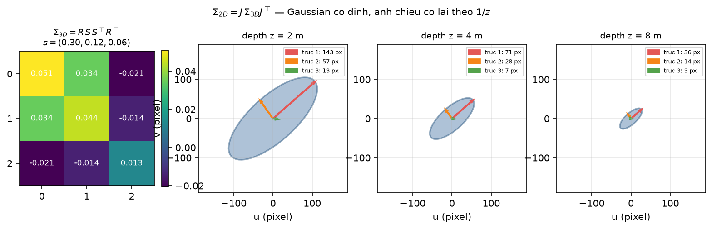
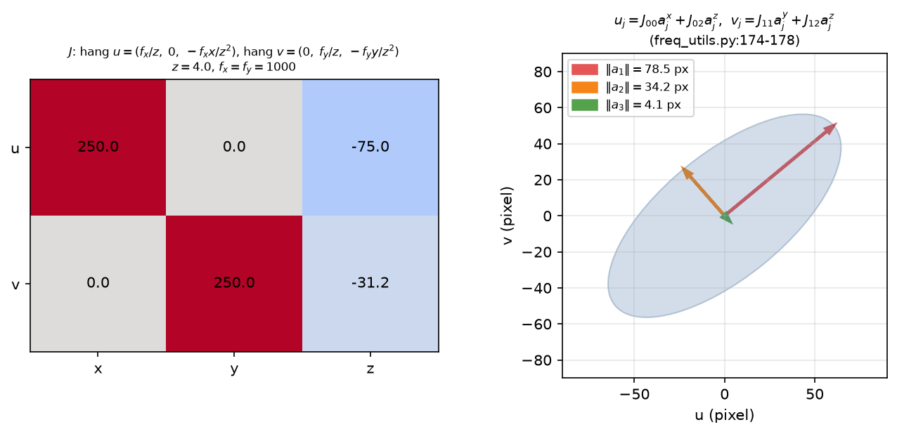
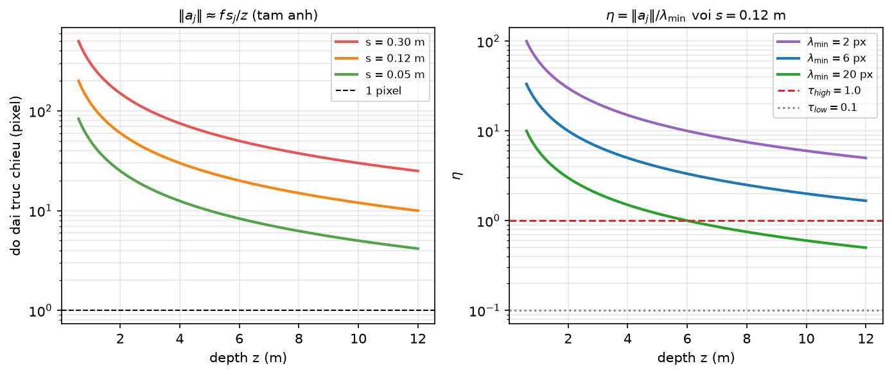
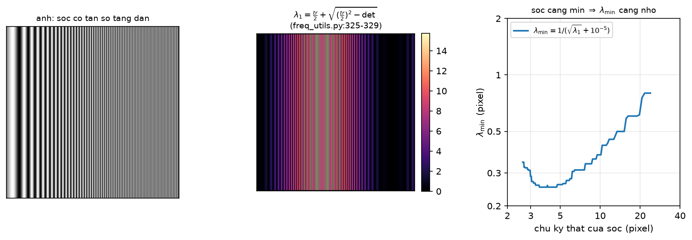
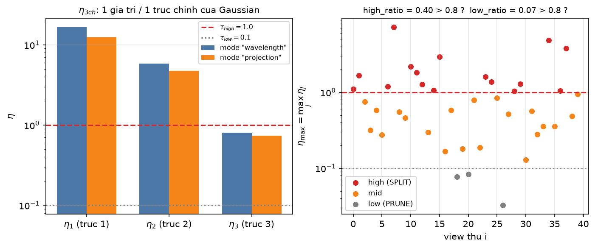
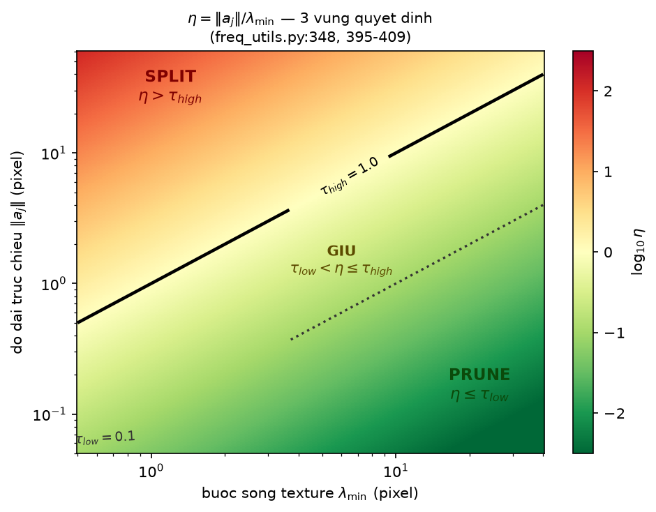

[← Mục lục chương 18](00-muc-luc.md) · Chương 18.2

# Chương 18.2 — Chiếu trục Gaussian lên màn hình & tỉ số cấu trúc $\eta$

> Nguồn:
> - `SADGS/utils/freq_utils.py:116-178` — `compute_projected_axes_subset`: back-project tâm, dựng Jacobian phối cảnh, chiếu 3 trục chính của ellipsoid ra $[N,3,2]$.
> - `SADGS/utils/freq_utils.py:181-418` — `update_freq_stats_online`: bóc `cov2D`, lọc active, jitter Cholesky, `grid_sample` structure tensor, hai mode tính $\eta$, tích luỹ đa view.
> - `SADGS/utils/freq_utils.py:104-114` — `normalize` (chuẩn hoá theo median) — **hiện không được gọi** ở nhánh $\eta$.
> - `SADGS/scene/gaussian_model.py:75-86, 293-304, 551-564, 625-636` — khai báo / khởi tạo / cắt / nối 9 buffer thống kê $\eta$.
> - `SADGS/scene/gaussian_model.py:699` — $k=\lceil\sqrt{\max(\eta,1)}\rceil$: $\eta$ được tiêu thụ ở đâu.
> - `SADGS/arguments/__init__.py:123, 145-150` — `freq_grad_threshold`, `freq_opacity_threshold`, `freq_transmittance_threshold`, `split_ratio_threshold`, `prune_ratio_threshold`, `eta_compute_mode`.
> - `SADGS/gaussian_renderer/__init__.py:91, 104, 124` — rasterizer xuất tensor `cov2D`.
> - `SADGS/submodules/diff-gaussian-rasterization_structgs/rasterize_points.cu:92` và `cuda_rasterizer/forward.cu:241-247, 470` — layout thật của 7 cột `cov2D`.
> - `SADGS/utils/loss_utils.py:170-230` — `get_structure_tensor_torch` (nguồn của $S_{xx},S_{xy},S_{yy}$; xem lại [Chương 17.1](../17-sadgs-structure-aware-densification.md)).
> - `SADGS/train.py:276, 337-353, 377-386` — nơi gọi hàm, nơi quy ra tỉ lệ đa view, nơi reset accumulator.

| Mục | Nội dung |
|---|---|
| 18.2.0 | Vì sao phải đo trên **màn hình** chứ không trong không gian 3D |
| 18.2.1 | `cov2D` 7 cột — hợp đồng dữ liệu giữa rasterizer và tầng tần số |
| 18.2.2 | Jacobian phối cảnh và phép chiếu 3 trục chính |
| 18.2.3 | Độ dài trục chiếu — đơn vị pixel, tỉ lệ nghịch với depth |
| 18.2.4 | Bước sóng cục bộ $\lambda_{\min}$ từ trị riêng structure tensor |
| 18.2.5 | Định nghĩa $\eta$ và ý nghĩa 3 kênh |
| 18.2.7 | Ngưỡng $\tau_{high}=1.0$, $\tau_{low}=0.1$ và ba vùng quyết định |
| 18.2.8 | Mode thứ hai `"projection"` — dạng toàn phương có hướng |
| 18.2.9 | Những đoạn code đang **bị tắt** và các cạm bẫy đơn vị |
| 18.2.10 | Tóm tắt |

---

## 18.2.0 Vì sao phải đo trên màn hình

Câu hỏi mà toàn bộ chương này trả lời rất ngắn gọn: **một Gaussian có đang "quá to" so với chi tiết ảnh mà nó phải tái tạo hay không?**

Điều đáng lưu ý là câu hỏi đó **không có câu trả lời trong không gian 3D**. Một Gaussian bán kính 12 cm có thể là quá thô khi camera đứng cách 1 m, nhưng lại thừa mịn khi camera lùi ra 10 m. Chi tiết texture cũng vậy — "bước sóng" của một hoạ tiết chỉ đo được sau khi ảnh đã được chụp, tức trong đơn vị **pixel**. Vì vậy SADGS đặt toàn bộ phép so sánh trong mặt phẳng ảnh, và phải tính lại **cho từng view, ngay trong vòng lặp train** (`train.py:276`), thay vì tính một lần trong world space.

Toàn bộ cơ chế rút lại thành một phân số không thứ nguyên:

$$
\boxed{\;\eta=\frac{\text{kích thước Gaussian trên màn hình (pixel)}}{\text{kích thước chi tiết texture cục bộ (pixel)}}\;}
$$

Tử số là mục 18.2.2–18.2.3, mẫu số là mục 18.2.4, và ngưỡng của phân số là mục 18.2.7.

---

## 18.2.1 `cov2D` 7 cột — hợp đồng dữ liệu giữa rasterizer và tầng tần số

Điểm làm SADGS rẻ về mặt tính toán: nó **không chiếu lại Gaussian**. Rasterizer đã làm phép chiếu đó rồi trong forward pass, nên SADGS chỉ yêu cầu rasterizer xuất thêm một tensor phụ và dùng lại kết quả.

Tensor được cấp phát tại `rasterize_points.cu:92` là `torch::full({P, 7}, 0.0)` — bảy cột cho **mọi** Gaussian. Nội dung từng cột ghi ở `cuda_rasterizer/forward.cu:241-247`:

| Cột | Ghi tại | Nội dung | Ai dùng trong `freq_utils` |
|---|---|---|---|
| 0–2 | `forward.cu:241-243` | `cov.x, cov.y, cov.z` = $\Sigma_{2D}$ dạng $(\sigma_{xx},\sigma_{xy},\sigma_{yy})$ | jitter Cholesky, `freq_utils.py:253-255` |
| 3–4 | `forward.cu:244-245` | `ndc2Pix(p_proj)` = tâm chiếu theo **pixel** | điểm lấy mẫu structure tensor, `freq_utils.py:201` |
| 5 | `forward.cu:246` | `p_view.z` = depth trong camera space | chia phối cảnh, `freq_utils.py:202` |
| 6 | `forward.cu:470` | `atomicMax` của transmittance $T$ khi blend | lọc Gaussian bị che, `freq_utils.py:203, 207` |

Phía Python, `gaussian_renderer/__init__.py:91` và `:104` nhận `cov2D` từ rasterizer, `:124` đẩy nó ra dict trả về, rồi `train.py:276` chuyển thẳng vào `update_freq_stats_online`.

Hàm này bóc dữ liệu chỉ cho tập Gaussian **thấy được** (`freq_utils.py:189-203`), rồi dựng mặt nạ "active" hai điều kiện (`freq_utils.py:206-207`):

$$
\text{active}=\big(T_{\max}>\texttt{transmittance\_threshold}\big)\;\wedge\;\big(\alpha>\texttt{opacity\_threshold}\big)
$$

với mặc định `freq_transmittance_threshold = 0.0` và `freq_opacity_threshold = 0.05` (`arguments/__init__.py:145-146`). Vì cột 6 được khởi tạo bằng `0.0f` (`forward.cu:247`) và phép so sánh là `>` nghiêm ngặt, Gaussian không thực sự tham gia blend ở tile nào sẽ bị loại. Thêm một tầng lọc nữa bằng gradient màn hình (`freq_utils.py:210-219`): chỉ giữ Gaussian có $\|\nabla_{uv}\|>$ `freq_grad_threshold` $=2\times10^{-5}$ (`arguments/__init__.py:123`) — tức chỉ đo tần số cho những Gaussian mà ảnh render đang còn sai.

---

## 18.2.2 Jacobian phối cảnh và phép chiếu 3 trục chính

Đây là phần lõi, hàm `compute_projected_axes_subset` (`freq_utils.py:116-178`). Điểm thiết kế quan trọng nhất: **SADGS không dùng $\Sigma_{2D}$ để đo kích thước**, dù $\Sigma_{2D}$ đã có sẵn ở cột 0–2. Lý do là $\Sigma_{2D}$ chỉ cho ta một ellipse 2D, tức một hình dạng "đã trộn" — nó không nói được Gaussian vi phạm tần số **theo hướng nào trong ba trục riêng của chính nó**, mà đó lại là thông tin bắt buộc để split bất đẳng hướng ở `densify_and_split_structgs`.

Trước hết, nhắc lại quan hệ hiệp phương sai chuẩn của 3DGS:

$$
\Sigma_{3D}=R(r)\,S\,S^\top R(r)^\top,\qquad S=\mathrm{diag}(s),\qquad \Sigma_{2D}=J\,\Sigma_{3D}\,J^\top
$$

trong đó $s\in\mathbb{R}^3$ là scale học được, $r$ là quaternion, $J$ là Jacobian của phép chiếu phối cảnh.



*Hình 18.2.1 — Panel trái là ma trận $\Sigma_{3D}=R\,S\,S^\top R^\top$ dựng từ $s=(0.30,\,0.12,\,0.06)$ và một quaternion cố định. Ba panel còn lại vẽ ellipse 1-sigma và ba mũi tên trục chiếu ở $z=2,4,8$ m với $f_x=f_y=1000$. Cùng một Gaussian bất biến trong world space, nhưng ảnh chiếu co lại đúng theo $1/z$ — độ dài ghi trong legend giảm một nửa mỗi lần depth gấp đôi. Kết luận rút ra: "kích thước" là một đại lượng **phụ thuộc view**, nên tiêu chí $\eta$ buộc phải tính online theo từng camera.*

Hàm chạy bốn bước, tất cả dưới `torch.no_grad()` (`freq_utils.py:120` — thống kê tần số **không** tham gia backward):

**Bước 1 — back-project tâm về camera space** (`freq_utils.py:134-135`). Jacobian phối cảnh phụ thuộc vào vị trí, nên phải biết $(x,y)$ camera-space của tâm, suy ngược từ pixel:

$$
x=\Big(u-\tfrac{W}{2}\Big)\frac{z}{f_x},\qquad y=\Big(v-\tfrac{H}{2}\Big)\frac{z}{f_y}
$$

Code giả định principal point nằm đúng giữa ảnh ($c_x=W/2$, $c_y=H/2$) — comment `freq_utils.py:130-131` nói rõ đây là xấp xỉ pinhole chuẩn, chấp nhận được cho mục đích đo tần số.

**Bước 2 — dựng Jacobian tại đúng điểm đó** (`freq_utils.py:141-147`):

$$
J=\begin{pmatrix}
f_x/z & 0 & -f_x x/z^2\\[2pt]
0 & f_y/z & -f_y y/z^2
\end{pmatrix}
$$

Code tính `inv_z = 1/(depths + 1e-7)` (`freq_utils.py:141`) rồi lưu bốn phần tử khác 0 thành `J_00, J_02, J_11, J_12`. Hai ô $J_{02}, J_{12}$ chính là **méo phối cảnh**: chúng chỉ bằng 0 ở tâm ảnh, và càng ra rìa ảnh càng lớn, làm trục Gaussian bị "nghiêng" thêm khi chiếu.

**Bước 3 — xoay về camera space rồi nhân scale** (`freq_utils.py:151-165`):

$$
R_{total}=R_{view}\,R_{local}(r),\qquad A_{cam}=R_{total}\cdot\mathrm{diag}(s)
$$

Dòng `freq_utils.py:165` viết là `axes_cam = R_total * scales.unsqueeze(1)`, tức broadcast nhân **theo cột**: cột $j$ của $A_{cam}$ là vector $s_j\cdot(\text{trục riêng thứ } j)$ trong camera space. Đây chính là ba nửa-trục của ellipsoid 1-sigma.

**Bước 4 — chiếu hai thành phần** (`freq_utils.py:174-178`):

$$
u_j=J_{00}A^x_j+J_{02}A^z_j,\qquad v_j=J_{11}A^y_j+J_{12}A^z_j
$$

Giá trị trả về là tensor $[N,3,2]$: mỗi Gaussian, mỗi trục, một vector 2D trên màn hình.



*Hình 18.2.2 — Trái: ma trận $J$ vẽ dạng heatmap với $z=4$, $f_x=f_y=1000$, và tâm lệch khỏi trung tâm ảnh ($x=1.2$, $y=0.5$). Hai ô cột "z" mang dấu âm rõ rệt — đó là số hạng $-f_x x/z^2$, thành phần méo phối cảnh, và nó lớn hẳn so với $f_x/z$ vì có $z^2$ dưới mẫu. Phải: ba mũi tên $(u_j,v_j)$ tính đúng theo `freq_utils.py:174-175` từ $s=(0.30,0.14,0.07)$, kèm độ dài tính ra pixel, và ellipse xám là bao 1-sigma dựng từ $AA^\top$. Kết luận: ba mũi tên **không trực giao** trên màn hình — phép chiếu phối cảnh phá tính trực giao của trục riêng, nên mỗi trục phải được đo độ dài riêng chứ không suy được từ ellipse.*

---

## 18.2.3 Độ dài trục chiếu — đơn vị pixel, tỉ lệ nghịch với depth

Tử số của $\eta$ là độ dài Euclid của mỗi vector chiếu (`freq_utils.py:342`):

$$
\boxed{\;\|a_j\|=\sqrt{u_j^2+v_j^2+10^{-8}}\;}\qquad[\text{pixel}],\quad j=1,2,3
$$

Hằng $10^{-8}$ là bảo hiểm số học: một trục gần như suy biến (Gaussian rất dẹt nhìn từ cạnh) cho $u_j=v_j=0$, và $\sqrt{0}$ sẽ sinh NaN nếu về sau có đạo hàm đi qua. Ở đây hàm chạy trong `no_grad` nên rủi ro thấp, nhưng hằng vẫn được giữ.

Tại tâm ảnh ($x=y=0$, do đó $J_{02}=J_{12}=0$), công thức rút gọn thành dạng trực giác:

$$
\|a_j\|\approx \frac{f\,s_j}{z}
$$



*Hình 18.2.3 — Trái: $\|a_j\|\approx f s_j/z$ với $f=1000$ và ba scale $s=0.30/0.12/0.05$ m, trục tung log, đường đứt nét là mốc 1 pixel; Gaussian $s=0.05$ m tụt xuống dưới 1 pixel khi $z\gtrsim 12$ m — tức nó đã nhỏ hơn cả một điểm ảnh. Phải: cùng một Gaussian $s=0.12$ m nhưng đặt trên ba nền texture khác nhau ($\lambda_{\min}=2, 6, 20$ px), $\eta$ giảm theo $1/z$ và cắt qua $\tau_{high}=1.0$ ở những depth hoàn toàn khác nhau. Kết luận: cùng một Gaussian có thể là "cần SPLIT" ở view gần và "vô hại" ở view xa — chính quan sát này buộc SADGS phải chuyển sang tiêu chí **đa view** (mục 18.2.7) thay vì quyết định theo một view đơn lẻ.*

---

## 18.2.4 Bước sóng cục bộ $\lambda_{\min}$ từ trị riêng structure tensor

Mẫu số của $\eta$ phải là "kích thước chi tiết nhỏ nhất mà texture ở chỗ đó chứa", cũng tính bằng pixel.

Nguồn là structure tensor đã cache trước cho từng ảnh train (`train.py:186-194`, công thức Di Zenzo ở `loss_utils.py:170-230`). SADGS lấy mẫu nó **không phải tại tâm Gaussian** mà tại một điểm ngẫu nhiên trong ellipse 1-sigma — jitter dựng bằng phân rã Cholesky của $\Sigma_{2D}$ (`freq_utils.py:263-274`):

$$
L=\begin{pmatrix}\sqrt{\sigma_{xx}} & 0\\ \sigma_{xy}/\sqrt{\sigma_{xx}} & \sqrt{\sigma_{yy}-L_{21}^2}\end{pmatrix},
\qquad \begin{pmatrix}\delta u\\ \delta v\end{pmatrix}=L\begin{pmatrix}\varepsilon_1\\ \varepsilon_2\end{pmatrix},\ \ \varepsilon\sim\mathcal{N}(0,1)
$$

Ý nghĩa: một Gaussian to phủ lên cả một vùng ảnh, nên "tần số texture mà nó phải gánh" phải được ước lượng trên cả vùng đó, không chỉ tại một điểm. Vì mỗi view lấy một mẫu ngẫu nhiên khác nhau, sau vài chục view thì trung bình cộng dồn xấp xỉ được kỳ vọng trên cả ellipse — một dạng Monte-Carlo rẻ. Toạ độ jitter được chuẩn hoá về $[-1,1]$ rồi đưa vào `F.grid_sample(..., align_corners=True)` (`freq_utils.py:290-296`).

Từ $(S_{xx},S_{xy},S_{yy})$ lấy mẫu được, code tính trị riêng lớn nhất bằng công thức nghiệm bậc hai (`freq_utils.py:325-334`):

$$
\mathrm{tr}=S_{xx}+S_{yy},\qquad \det=S_{xx}S_{yy}-S_{xy}^2,\qquad
\lambda_1=\frac{\mathrm{tr}}{2}+\sqrt{\Big(\frac{\mathrm{tr}}{2}\Big)^2-\det}
$$

(biểu thức dưới căn được `torch.clamp(..., min=0.0)` để chống sai số dấu phẩy động âm nhẹ). Rồi đổi năng lượng ra bước sóng:

$$
\boxed{\;\lambda_{\min}=\frac{1}{\sqrt{\lambda_1}+10^{-5}}\;}\qquad[\text{pixel}]
$$

Lập luận: $\lambda_1$ là năng lượng gradient bình phương lớn nhất, mà biên độ gradient của một sóng $\sin(2\pi x/\lambda)$ tỉ lệ với tần số $f\sim 1/\lambda$, nên $\sqrt{\lambda_1}\sim f$ và nghịch đảo của nó là bước sóng. Vùng phẳng cho $\lambda_1\to 0$, do đó $\lambda_{\min}\to 10^{5}$ px — một con số khổng lồ, nghĩa là **mọi** Gaussian đều "đủ nhỏ" ở vùng phẳng, đúng như mong muốn: không densify vào tường trắng.



*Hình 18.2.4 — Trái: ảnh chirp 256×256, sọc có tần số tăng dần từ trái sang phải (0.02 → 0.30 chu kỳ/pixel). Giữa: bản đồ $\lambda_1$ tính đúng theo `freq_utils.py:325-329` sau khi lấy đạo hàm Sobel — sáng dần về phía phải vì sọc càng mịn thì năng lượng gradient càng lớn. Phải: quan hệ giữa chu kỳ thật của sọc (trục hoành, 2.6–25 px, thang log) và $\lambda_{\min}=1/(\sqrt{\lambda_1}+10^{-5})$ (trục tung, thang log) — đường đi lên đơn điệu, xác nhận $\lambda_{\min}$ thực sự là một proxy tăng theo chu kỳ texture. Kết luận: $\lambda_{\min}$ nhỏ ở chỗ hoạ tiết mịn, lớn ở chỗ mượt — đúng vai trò "giới hạn tốc độ" cho kích thước Gaussian.*

---

## 18.2.5 Định nghĩa $\eta$ và ý nghĩa ba kênh

Mode mặc định là `eta_compute_mode = "wavelength"` (`arguments/__init__.py:150`), cài đặt ở `freq_utils.py:313-348`, và toàn bộ công thức gói trong một dòng — `freq_utils.py:348`:

$$
\boxed{\;\eta_j=\frac{\|a_j\|}{\lambda_{\min}},\qquad j=1,2,3\;}
$$

$\eta$ **không thứ nguyên**: pixel chia pixel. Đó là lý do một ngưỡng hằng số như $1.0$ mới có nghĩa xuyên cảnh — nếu tử số vẫn còn đơn vị mét hay mẫu số vẫn còn đơn vị "năng lượng gradient", ngưỡng sẽ phải chỉnh lại cho mỗi dataset.

Điểm hay bị hiểu nhầm: **"3 kênh" trong `eta_3ch` là 3 trục chính của ellipsoid, không phải 3 kênh màu RGB.** Ba kênh màu đã bị cộng gộp từ trước, ở bước Di Zenzo (`loss_utils.py:206-208`). Ba kênh ở đây là ba cột của $A_{cam}$ sau khi chiếu. Nhờ giữ riêng ba con số này mà SADGS biết Gaussian vi phạm **theo hướng nào**, và về sau `gaussian_model.py:699` mới chia được số lát cắt riêng cho từng trục:

$$
k_j=\big\lceil \sqrt{\max(\eta_j,\,1)}\,\big\rceil
$$

(lập luận sampling theory ghi trong comment `gaussian_model.py:692-696`: muốn $\sigma_{new}\cdot\omega_{\max}\le 1$ thì cần $k\ge\sqrt{\eta}$). Nếu chỉ giữ một $\eta$ vô hướng, ta sẽ chỉ chia đều được cả ba chiều — đúng hành vi của 3DGS gốc và chính là thứ SADGS muốn vượt qua.

Sau khi có `eta_3ch`, code nhân trọng số rồi tích luỹ (`freq_utils.py:380-392`):

| Dòng | Lệnh | Vai trò |
|---|---|---|
| `fu:380` | `eta_3ch *= weights_valid` | trọng số theo transmittance — **nhưng xem cảnh báo ở 18.2.9** |
| `fu:382, 384` | `accum_eta += eta_3ch.sum(dim=1)` | tổng vô hướng trên 3 trục, cộng dồn qua view |
| `fu:385` | `accum_view_count += 1.0` | mẫu số để lấy trung bình / tỉ lệ |
| `fu:391-392` | `max_eta_3ch = max(max_eta_3ch, eta_3ch)` | **max theo từng trục**, không phải tổng — đây mới là thứ được đưa vào split |

Chín buffer này được khai báo ở `gaussian_model.py:75-86`, khởi tạo zeros ở `:293-304`, cắt theo mask khi prune ở `:551-564`, và nối thêm 0 cho Gaussian mới sinh ở `:625-636` — tức chúng được duy trì đồng bộ với số lượng Gaussian suốt quá trình densify.



*Hình 18.2.5 — Trái: $\eta_{3ch}$ cho một Gaussian $s=(0.20,0.08,0.02)$ ở $z=4$ m với $\lambda_{\min}=3$ px, so sánh hai mode. Ba cột không bằng nhau và chênh nhau cả bậc độ lớn — trục 1 vượt xa $\tau_{high}$, trục 3 nằm dưới $\tau_{low}$; đây chính là tình huống mà split đẳng hướng sẽ làm sai. Phải: $\eta_{\max}=\max_j\eta_j$ của cùng một Gaussian quan sát qua 40 view khác nhau (log-normal quanh 1.1), tô màu theo ba lớp high / mid / low, kèm tiêu đề in ra `high_ratio` và `low_ratio` để so với ngưỡng 0.8. Kết luận: một Gaussian hiếm khi "high" ở **mọi** view — đó là lý do tiêu chí đa view ở mục 18.2.7 chặt hơn nhiều so với việc chỉ nhìn một view.*

---

## 18.2.7 Ngưỡng $\tau_{high}$, $\tau_{low}$ và ba vùng quyết định

Hai ngưỡng được **hard-code** ngay trong hàm, không qua `arguments` (`freq_utils.py:395-396`):

```python
TAU_HIGH = 1.0  # Frequency violation threshold
TAU_LOW  = 0.1  # Background/smooth threshold
```

Phân loại dùng **max** trên ba trục (`freq_utils.py:399-404`) — một trục vi phạm là đủ để cả Gaussian bị coi là vi phạm:

$$
\eta_{\max}=\max_{j\in\{1,2,3\}}\eta_j,\qquad
\begin{cases}
\text{high} & \eta_{\max}>\tau_{high}=1.0\\
\text{low} & \eta_{\max}\le\tau_{low}=0.1\\
\text{mid} & \text{còn lại}
\end{cases}
$$

Mỗi view cộng 1 vào đúng một trong ba bộ đếm (`freq_utils.py:407-409`), và riêng hai lớp high/mid còn cộng dồn cả vector `eta_3ch` để về sau lấy trung bình (`freq_utils.py:412-415`).



*Hình 18.2.7 — Mặt phẳng quyết định đầy đủ: trục hoành là $\lambda_{\min}$ (0.5–40 px), trục tung là $\|a_j\|$ (0.05–60 px), cả hai thang log, màu là $\log_{10}\eta$ trong dải $[-2.5, 2.5]$. Hai đường đẳng trị $\eta=0.1$ (nét chấm) và $\eta=1.0$ (nét liền) chia mặt phẳng thành ba dải chéo song song — vì trên thang log-log, $\eta=\text{const}$ là đường thẳng $\log\|a\|=\log\lambda_{\min}+\text{const}$. Kết luận quan trọng đọc được từ hình: biên giới SPLIT/GIỮ/PRUNE **không** nằm ở một giá trị kích thước Gaussian cố định nào cả; một Gaussian 10 px là SPLIT trên texture mịn ($\lambda_{\min}=1$) nhưng là GIỮ trên texture thô ($\lambda_{\min}=20$).*

Điều then chốt: phân loại ở trên chỉ là **một phiếu bầu của một view**. Quyết định thật nằm ở `train.py:337-353`, nơi các bộ đếm được quy ra tỉ lệ:

$$
\text{high\_ratio}=\frac{\texttt{eta\_high\_count}}{\texttt{accum\_view\_count}},\qquad
\text{low\_ratio}=\frac{\texttt{eta\_low\_count}}{\texttt{accum\_view\_count}}
$$

$$
\text{SPLIT}:\ \text{high\_ratio}>\texttt{split\_ratio\_threshold}=0.8\ \wedge\ \|\nabla\|\ge 10^{-5}
\qquad
\text{PRUNE}:\ \text{low\_ratio}>\texttt{prune\_ratio\_threshold}=0.8
$$

với hai ngưỡng 0.8 lấy từ `arguments/__init__.py:148-149`, và điều kiện gradient bổ sung ở `train.py:333` (comment trong code ghi thẳng `[CRITICAL] We MUST use this to prevent 7M points`). Vector thực sự được truyền vào hàm split là `max_high_eta = gaussians.max_eta_3ch` (`train.py:351, 373`) — tức **max qua mọi view**, không phải trung bình. Đáng chú ý: `avg_high_eta_3ch` được tính công phu ở `train.py:348-350` nhưng rồi **không dùng tới** — dòng ngay sau đó ghi đè lựa chọn bằng `max_eta_3ch`.

Sau mỗi kỳ densify, toàn bộ chín accumulator được `zero_()` (`train.py:377-386`), nên mỗi cửa sổ densify là một lần bỏ phiếu độc lập.

---

## 18.2.8 Mode thứ hai `"projection"` — dạng toàn phương có hướng

`freq_utils.py:350-373` cài một cách tính $\eta$ khác, bật bằng `--eta_compute_mode projection`. Thay vì chuẩn hoá mọi trục bằng cùng một vô hướng $\lambda_{\min}$, nó chiếu structure tensor lên **hướng** của từng trục:

$$
\eta_j=\sqrt{\,S_{xx}u_j^2+2S_{xy}u_jv_j+S_{yy}v_j^2\,}=\sqrt{a_j^\top S\,a_j}
$$

(dạng toàn phương ở `freq_utils.py:371`, căn bậc hai ở `:373`).

Khác biệt bản chất:

| | `"wavelength"` (mặc định) | `"projection"` |
|---|---|---|
| Chuẩn hoá | cùng một $\lambda_{\min}=1/(\sqrt{\lambda_1}+10^{-5})$ cho cả 3 trục | mỗi trục dùng năng lượng theo đúng hướng của nó |
| Dùng gì của $S$ | chỉ trị riêng lớn nhất $\lambda_1$ | cả ba thành phần $S_{xx},S_{xy},S_{yy}$ |
| Với một đường ngang ($S_{yy}$ lớn, $S_{xx}\approx 0$) | mọi trục chia cùng một số | trục dọc cho $\eta$ cao, trục ngang cho $\eta$ thấp |
| Tính bất đẳng hướng của $\eta$ | chỉ đến từ $\|a_j\|$ | đến từ cả $\|a_j\|$ lẫn hướng so với texture |

Nói cách khác, `"wavelength"` bảo thủ hơn: nó lấy tần số **cực đại** tại điểm đó làm giới hạn chung, nên một trục song song với đường biên vẫn bị "phạt" như trục vuông góc. `"projection"` thì có hướng thật, nhưng nhạy hơn với nhiễu trong ước lượng $S_{xy}$. Hình 18.2.5 (panel trái) chính là so sánh trực tiếp hai mode trên cùng một Gaussian. Truyền giá trị lạ sẽ `raise ValueError` (`freq_utils.py:375-376`) — không có fallback im lặng.

Lưu ý đơn vị: ở mode `"projection"`, $\eta$ **không còn là tỉ số hai độ dài pixel** mà là căn của một dạng toàn phương giữa (gradient bình phương đã chuẩn hoá) và (pixel bình phương). Nó chỉ tình cờ trùng thang đo với mode kia khi $S$ xấp xỉ $\mathrm{diag}(1/\lambda_{\min}^2)$. Vì $\tau_{high}=1.0$ và $\tau_{low}=0.1$ là hằng số dùng chung cho cả hai mode (`freq_utils.py:395-396` nằm **ngoài** khối `if/elif`), đổi mode mà giữ nguyên ngưỡng là một rủi ro cần ý thức.

---

## 18.2.9 Những đoạn code đang bị tắt và các cạm bẫy đơn vị

Phần này liệt kê những chỗ mà **code hiện tại không làm đúng điều mà comment/tên biến gợi ý** — quan trọng khi đọc lại hoặc khi đo ablation.

**(1) Trọng số transmittance thực chất là no-op.** Dòng `freq_utils.py:238` viết:

```python
weights_valid = torch.ones_like(max_transmittance)[is_active_vis]
```

Tức nó tạo một vector **toàn số 1**, không hề lấy giá trị transmittance thật. Do đó phép `eta_3ch *= weights_valid` ở `freq_utils.py:380` là phép nhân với 1, và `accum_weights_valid` ở `:386` chỉ đang đếm lại đúng số view, trùng thông tin với `accum_view_count`. Transmittance hiện chỉ còn tác dụng ở **mặt nạ nhị phân** `fu:207`, không còn là trọng số liên tục như comment `fu:236-237, 378-379` mô tả.

**(2) Lọc theo số lần đã densify bị comment.** `freq_utils.py:224` đặt `max_densify_count = 3` nhưng toàn bộ khối sử dụng nó (`:225-227`) bị comment — biến này là code chết. Cơ chế chống over-densify mà comment `:221-222` hứa hẹn hiện **không chạy**.

**(3) Công thức $\eta$ dạng toàn phương cũ bị comment.** `freq_utils.py:303-311` còn nguyên phiên bản tiền nhiệm (không lấy căn bậc hai) — di sản trước khi tách thành hai mode.

**(4) Mirror jitter bị tắt.** `freq_utils.py:280-287` định lật jitter khi mẫu rơi ra ngoài biên ảnh, nhưng bị comment. Hệ quả: `F.grid_sample` chạy với `padding_mode` mặc định `'zeros'` (tham số `'border'` cũng bị comment ở `:296`), nên Gaussian sát mép ảnh có xác suất lấy được $S=0$, dẫn tới $\lambda_1=0$, $\lambda_{\min}=10^5$ và $\eta\approx 0$ — bị xếp nhầm vào lớp **low**, tức thành ứng viên PRUNE. Đây là một bias hệ thống ở rìa ảnh, cần nhớ khi thấy Gaussian ở biên bị xoá bất thường.

**(5) `normalize` không được dùng.** Hàm `normalize` (`freq_utils.py:104-114`, chuẩn hoá theo median) không xuất hiện ở bất kỳ đâu trong nhánh $\eta$ — di sản từ phiên bản scoring cũ.

**(6) `expand_undersized_gs` bị tắt ở call site.** `gaussian_model.py:833-865` cài phép giãn scale giải tích $\log\sigma_{new}=\log\sigma_{old}-\tfrac12\log\eta$ (đưa $\eta$ về đúng 1.0), nhưng lời gọi trong `train.py:355-359` **đang bị comment**. Tham số `tau_expand = 1.0` và `adaptive_clone = False` (`arguments/__init__.py:135-136`) vì thế không có hiệu lực ở vòng lặp chính.

**(7) Cạm bẫy đơn vị của $\lambda_{\min}$.** Structure tensor được chuẩn hoá theo cực đại toàn ảnh trước khi cache (`loss_utils.py:222-227`: chia cho $\max(S_{xx}+S_{yy})$). Hệ quả là $\lambda_1\lesssim 1$ với mọi pixel, nên

$$
\lambda_{\min}=\frac{1}{\sqrt{\lambda_1}+10^{-5}}\;\gtrsim\;1
$$

$\lambda_{\min}$ vì thế **không phải bước sóng vật lý tính bằng pixel thật**, mà là một proxy đơn điệu theo bước sóng, đã bị co giãn theo độ tương phản cao nhất của từng ảnh. Đây là lý do $\tau_{high}=1.0$ hoạt động được xuyên dataset (vì mẫu số đã tự chuẩn hoá), nhưng cũng là lý do không nên diễn giải $\eta=2$ là "Gaussian to gấp đôi chi tiết" theo nghĩa đen.

---

## 18.2.10 Tóm tắt

| Thành phần | Công thức | Vị trí code | Hình |
|---|---|---|---|
| Nguồn dữ liệu | `cov2D` $[P,7]$: $\Sigma_{2D}$, means2D, depth, $T_{\max}$ | `forward.cu:241-247`; `freq_utils.py:199-203` | — |
| Mặt nạ active | $T_{\max}>0 \wedge \alpha>0.05 \wedge \|\nabla_{uv}\|>2\cdot10^{-5}$ | `freq_utils.py:206-219`; `arguments:123,145-146` | — |
| Chiếu 3 trục | $A_{cam}=R_{view}R(r)\mathrm{diag}(s)$; $u_j=J_{00}A^x_j+J_{02}A^z_j$ | `freq_utils.py:116-178` | 18.2.1, 18.2.2 |
| Độ dài trục | $\|a_j\|=\sqrt{u_j^2+v_j^2+10^{-8}}\approx f s_j/z$ | `freq_utils.py:342` | 18.2.3 |
| Bước sóng | $\lambda_{\min}=1/(\sqrt{\lambda_1}+10^{-5})$, $\lambda_1=\tfrac{\mathrm{tr}}{2}+\sqrt{(\tfrac{\mathrm{tr}}{2})^2-\det}$ | `freq_utils.py:325-334` | 18.2.4 |
| Tỉ số $\eta$ | $\eta_j=\|a_j\|/\lambda_{\min}$ (mode `"wavelength"`) | `freq_utils.py:348`; `arguments:150` | 18.2.5 |
| Ngưỡng | $\tau_{high}=1.0$, $\tau_{low}=0.1$ (hard-code) | `freq_utils.py:395-396` | 18.2.7 |
| Chốt đa view | high\_ratio $>0.8$ $\Rightarrow$ SPLIT; low\_ratio $>0.8$ $\Rightarrow$ PRUNE | `train.py:337-353`; `arguments:148-149` | 18.2.5 (phải) |
| Tiêu thụ $\eta$ | $k_j=\lceil\sqrt{\max(\eta_j,1)}\rceil$ lát cắt mỗi trục | `gaussian_model.py:699` | — |
| Mode phụ | $\eta_j=\sqrt{a_j^\top S a_j}$ | `freq_utils.py:350-373` | 18.2.5 (trái) |

Ba ý cần nhớ:

1. **$\eta$ là một phân số không thứ nguyên** (pixel chia pixel), nên ngưỡng hằng số $	au_{high}=1.0$ mới dùng chung được cho mọi cảnh.
2. **Ba kênh là ba trục, không phải ba màu.** Đây là thứ duy nhất cho phép split bất đẳng hướng với $(k_x,k_y,k_z)$ khác nhau ở `gaussian_model.py:699`.
3. **Một view không đủ để quyết định.** Vì $\|a_j\|\propto 1/z$, cùng một Gaussian đổi lớp phân loại chỉ vì camera lùi ra — nên SADGS đòi 80% số view đồng thuận mới hành động.

Cần đọc kèm: [Chương 17.1](../17-sadgs-structure-aware-densification.md) cho structure tensor, và mục 18.2.7 nối thẳng sang cơ chế multiview consistency cùng anisotropic split.

---

[← Mục lục chương 18](00-muc-luc.md) · [Chương 18.3 →](03-thong-ke-eta-da-view.md)
