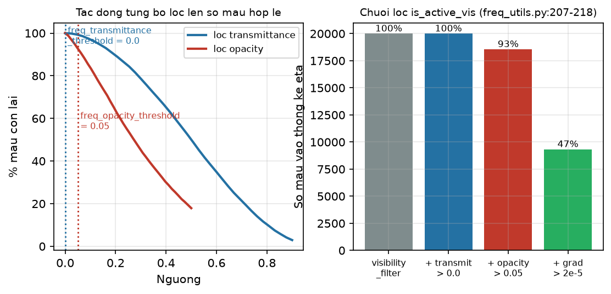
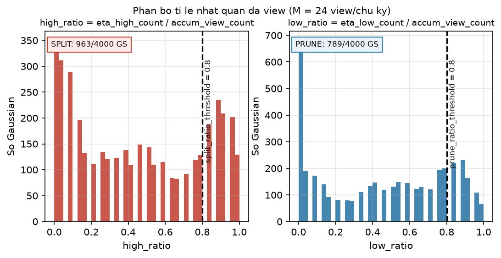
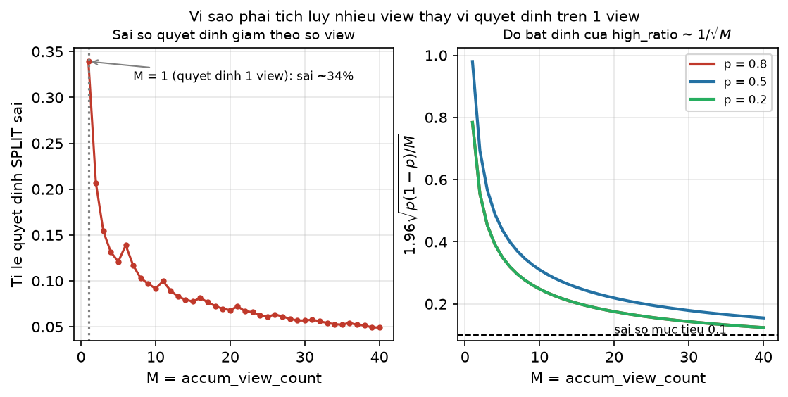
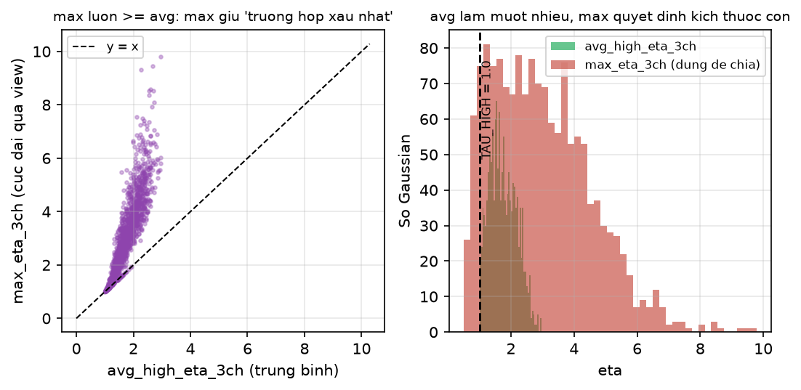
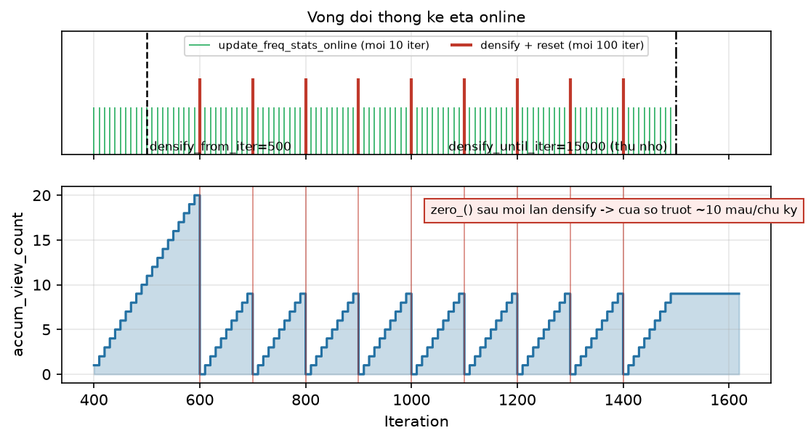

[← Mục lục chương 18](00-muc-luc.md) · Chương 18.3

# Chương 18.3 — Thống kê $\eta$ online đa view & tỉ lệ nhất quán (multiview consistency ratio)

> Nguồn:
> - `SADGS/utils/freq_utils.py:181-418` — `update_freq_stats_online`: chuỗi bộ lọc `is_active_vis` (`:203-227`), stochastic jitter sampling bằng Cholesky (`:255-292`), hai chế độ tính $\eta$ (`:313-376`), cập nhật 9 bộ đếm (`:380-415`).
> - `SADGS/utils/freq_utils.py:12-88` — `sampling_cameras`: random vs farthest-point sampling trên stack camera.
> - `SADGS/utils/freq_utils.py:116-178` — `compute_projected_axes_subset`: chiếu 3 trục Gaussian xuống mặt phẳng ảnh (dùng cho $\eta$).
> - `SADGS/train.py:219-243` (chọn camera + vòng batch), `:273-276` (điều kiện gọi online mỗi 10 iteration), `:316-386` (khối densify: `high_ratio`/`low_ratio`, split/prune mask, reset bộ đếm).
> - `SADGS/scene/gaussian_model.py:75-86` (khai báo), `:293-304` (khởi tạo), `:551-564` (cắt theo prune), `:625-636` (nối cho điểm mới), `:1005-1011` (`metric_mask` từ `importance_score`).
> - `SADGS/arguments/__init__.py:87,91,92,123,124,130,131,145-150` — toàn bộ hyperparameter liên quan.
> - Slide đối chiếu: `DOCS/Slides67/part_sadgsx_03.tex`, `DOCS/Slides67/Slides45min/part45_sadgsx_03.tex`. Hình: `DOCS/Slides67/figures/sadgsx/scripts/bot03_figs.py`.

| Mục | Nội dung |
|---|---|
| 18.3.0 | Vì sao $\eta$ một view là tín hiệu không dùng được |
| 18.3.1 | Chuỗi bộ lọc `is_active_vis` — mẫu nào được vào thống kê |
| 18.3.2 | Stochastic jitter sampling — nguồn nhiễu cố ý thứ hai |
| 18.3.3 | Chín bộ đếm online và phép phân loại HIGH/MID/LOW |
| 18.3.4 | Tỉ lệ nhất quán $r^{high}$, $r^{low}$ và hai ngưỡng $0.8$ |
| 18.3.5 | Bao nhiêu view là đủ — quy luật $1/\sqrt{M}$ |
| 18.3.6 | Trung bình hay cực đại: `avg_high_eta_3ch` vs `max_eta_3ch` |
| 18.3.7 | Vòng đời: cập nhật → quyết định → `zero_()` |
| 18.3.8 | Những nhánh đang bị tắt trong code hiện tại |
| 18.3.9 | Tóm tắt |

---

## 18.3.0 Vì sao $\eta$ một view là tín hiệu không dùng được

Đại lượng vi phạm tần số $\eta$ (xây dựng ở [chương 17.3](../17-sadgs-structure-aware-densification.md)) được đo **trên mặt phẳng ảnh**: nó so độ dài trục Gaussian *sau khi chiếu* với bước sóng kết cấu *của ảnh tại pixel đó*. Cả hai vế đều phụ thuộc camera. Cùng một Gaussian:

- ở view gần, trục chiếu dài hàng chục pixel → $\eta \gg 1$;
- ở view xa hoặc xiên, cùng trục đó co lại dưới một pixel → $\eta \ll 1$;
- ở view mà nó bị che khuất, $\eta$ đo được hoàn toàn vô nghĩa vì Gaussian không đóng góp màu nào lên ảnh.

Nếu quyết định split/prune dựa trên **một** quan sát, hai lỗi xảy ra đồng thời: chia nhỏ hàng loạt Gaussian chỉ tình cờ bị chiếu lớn ở một góc nhìn (bùng nổ số điểm), và xoá những Gaussian đang bị che tạm thời. SADGS giải bằng cách tách hoàn toàn **pha đo** khỏi **pha quyết định**: mỗi 10 iteration, hàm `update_freq_stats_online` (`freq_utils.py:181`) chỉ *tích luỹ* bộ đếm trên từng Gaussian; mỗi `densification_interval = 100` iteration (`arguments/__init__.py:87`), khối densify trong `train.py:337-353` mới đọc các bộ đếm đó và tính **tỉ lệ nhất quán** — tỉ lệ số view đồng ý rằng Gaussian này vi phạm (hoặc quá dư thừa).

Luồng camera cấp dữ liệu cho pha đo nằm ở `train.py:219-243`. Khi stack rỗng, toàn bộ camera huấn luyện được nạp lại rồi sắp xếp theo `opt.camera_sampling`: nhánh `"fps"` gọi `sampling_cameras(..., mode="fps", num_cams=len(viewpoint_stack))` (`freq_utils.py:12`, `train.py:224,240`) — farthest point sampling trên **vị trí camera thế giới** $-R^\top t$ trích từ `world_view_transform` (`freq_utils.py:41-48`), khởi động từ một camera ngẫu nhiên rồi lặp chọn camera xa nhất so với tập đã chọn (`freq_utils.py:57-70`). Mục đích: hai iteration liên tiếp nhìn cảnh từ hai hướng cách xa nhau, nên $M$ view tích luỹ trong một chu kỳ phủ đều không gian thay vì dồn vào một cụm góc nhìn. Cần nói rõ: **mặc định `camera_sampling = "random"`** (`arguments/__init__.py:131`), nên nhánh FPS chỉ chạy khi bật tường minh; mặc định vẫn là `random.shuffle` (`train.py:227,242`). Tương tự, `batch_size = 1` (`arguments/__init__.py:147`) nên vòng `for batch_idx in range(opt.batch_size)` (`train.py:235`) mặc định chỉ chạy một camera mỗi iteration — nghĩa là một chu kỳ densify 100 iteration đóng góp đúng $100/10 = 10$ mẫu view cho mỗi Gaussian, không hơn.

---

## 18.3.1 Chuỗi bộ lọc `is_active_vis` — mẫu nào được vào thống kê

Không phải mọi Gaussian chạm view đều được đếm. `freq_utils.py:203-221` dựng một mặt nạ ba tầng trên tập chỉ số hiển thị:

$$
\texttt{is\_active\_vis}_i \;=\; \underbrace{\big(T^{\max}_i > \tau_T\big)}_{\text{transmittance},\ \texttt{:207}}\;\wedge\;\underbrace{\big(\alpha_i > \tau_\alpha\big)}_{\text{opacity},\ \texttt{:207}}\;\wedge\;\underbrace{\big(\lVert \nabla^{xy}_i \rVert_2 > \tau_g\big)}_{\text{gradient},\ \texttt{:216-218}}
$$

Trong đó $T^{\max}_i = \texttt{cov2D}[i,6]$ là transmittance cực đại Gaussian $i$ đạt được trong view này (`freq_utils.py:201`), $\alpha_i = \texttt{gaussians.get\_opacity}[i]$ (`:206`), và $\nabla^{xy}_i$ là hai thành phần đầu của gradient view-space `viewspace_point_tensor.grad` (`:214-217`) — đúng đại lượng 3DGS gốc dùng cho ADC.

Ba ngưỡng được truyền từ `train.py:276`, giá trị mặc định lấy từ `arguments/__init__.py`:

| Ngưỡng | Tham số | Giá trị | Nguồn |
|---|---|---|---|
| $\tau_T$ | `freq_transmittance_threshold` | $0.0$ | `arguments/__init__.py:146` |
| $\tau_\alpha$ | `freq_opacity_threshold` | $0.05$ | `arguments/__init__.py:145` |
| $\tau_g$ | `freq_grad_threshold` | $2\times10^{-5}$ | `arguments/__init__.py:123` |

Ý nghĩa từng tầng: Gaussian bị che hoàn toàn thì aliasing của nó không hiện lên ảnh nên không nên đếm ($\tau_T$ — lưu ý mặc định $0.0$ nghĩa là tầng này gần như **không loại gì**, chỉ chặn trường hợp $T^{\max}$ đúng bằng 0); Gaussian gần trong suốt ($\alpha \le 0.05$) đóng góp màu không đáng kể, chia nhỏ chúng chỉ tốn bộ nhớ; và quan trọng nhất là tầng gradient — chỉ đếm nơi **hình học còn sai**, vùng đã khớp tốt thì $\eta$ cao cũng không cần chia.

*Hình 18.3.1 — Mô phỏng $N = 20000$ mẫu: trái là đường cong "% mẫu còn lại" khi quét ngưỡng transmittance (xanh, $T \sim \mathrm{Beta}(2,2)$) và ngưỡng opacity (đỏ, $\alpha \sim \mathrm{Beta}(1.3,3)$), với hai vạch chấm đánh dấu giá trị thật trong code ($0.0$ và $0.05$); phải là biểu đồ cột áp lần lượt bốn tầng `visibility_filter` → $T>0.0$ → $\alpha>0.05$ → $\lVert\nabla\rVert>2\times10^{-5}$ lên cùng một tập mẫu, phần trăm sống sót ghi trên đầu mỗi cột. Kết luận đọc được từ hình: tầng transmittance với $\tau_T=0.0$ hầu như không cắt gì, tầng opacity cắt một phần đáng kể, còn tầng gradient là tầng quyết định — nó thu hẹp mẫu số $M_i$ xuống chỉ những view mà Gaussian **đang thực sự sai**. Đây chính là lý do `accum_view_count` không phải "số view nhìn thấy" mà là "số view nhìn thấy **và** đang có lỗi hình học".*

Hệ quả thực tiễn: mẫu số của mọi tỉ lệ ở mục 18.3.4 là số mẫu **sống sót qua cả bốn tầng**, nên một Gaussian đã hội tụ tốt sẽ có $M_i$ tiến về 0 và tự động rơi ra khỏi cả split lẫn prune (vì `valid_mask` tắt).

---

## 18.3.2 Stochastic jitter sampling — nguồn nhiễu cố ý thứ hai

Sau khi có tập chỉ số hợp lệ, code cần lấy mẫu structure tensor $S$ tại vị trí của Gaussian trên ảnh. Cách hiển nhiên là lấy đúng tâm chiếu `means2D`. SADGS không làm vậy: `freq_utils.py:255-279` lấy mẫu tại **một điểm ngẫu nhiên rút từ chính phân bố 2D của Gaussian**, bằng phân tích Cholesky của hiệp phương sai màn hình $\Sigma_{2D}$:

$$
\Sigma_{2D}=\begin{pmatrix}\sigma_{xx} & \sigma_{xy}\\ \sigma_{xy} & \sigma_{yy}\end{pmatrix}
= L L^\top,\qquad
L=\begin{pmatrix} L_{11} & 0\\ L_{21} & L_{22}\end{pmatrix}
$$

với, đúng như `freq_utils.py:267-274`:

$$
L_{11}=\sqrt{\max(\sigma_{xx},10^{-6})},\qquad
L_{21}=\frac{\sigma_{xy}}{L_{11}},\qquad
L_{22}=\sqrt{\max\!\big(\sigma_{yy}-L_{21}^2,\;10^{-6}\big)}
$$

$$
\begin{pmatrix}\delta_x\\ \delta_y\end{pmatrix}
= L\begin{pmatrix}\varepsilon_1\\ \varepsilon_2\end{pmatrix},\qquad
\varepsilon_1,\varepsilon_2\sim\mathcal N(0,1)
\;\Longrightarrow\;
\begin{pmatrix}\delta_x\\ \delta_y\end{pmatrix}\sim\mathcal N(\mathbf 0,\Sigma_{2D})
$$

Điểm lấy mẫu là $(x_s, y_s) = (\mu_x + \delta_x,\ \mu_y + \delta_y)$ (`:277-278`), rồi chuẩn hoá về $[-1,1]$ cho `F.grid_sample` (`:290-292,296`). Hai phép `clamp(..., min=1e-6)` là chốt số học: nếu $\sigma_{xx}$ hoặc phần bù Schur $\sigma_{yy}-L_{21}^2$ âm do sai số dấu phẩy động thì căn bậc hai sẽ ra `NaN` và làm hỏng toàn bộ bộ đếm.

**Vì sao cố ý thêm nhiễu?** Vì $\eta$ của một Gaussian phải phản ánh kết cấu ảnh **trên toàn bộ vết loang (footprint) của nó**, không phải tại một pixel tâm. Một Gaussian dẹt dài nằm vắt qua biên vật thể có tâm rơi vào vùng phẳng — lấy mẫu tại tâm sẽ báo $\lambda_1 \approx 0$, tức "không có kết cấu", và Gaussian sai này sẽ không bao giờ bị chia. Jitter sampling biến $\eta$ một view thành một **ước lượng Monte-Carlo không chệch của $\eta$ trung bình trên footprint**, với cái giá là phương sai từng mẫu tăng lên. Chính khoản phương sai này là lý do thứ hai (sau tính phụ thuộc view) bắt buộc phải tích luỹ nhiều view trước khi quyết định.

Lưu ý code: cơ chế "phản xạ jitter khi rơi ra ngoài biên ảnh" đã được viết nhưng **đang bị comment** (`freq_utils.py:280-287`), nên mẫu rơi ngoài khung sẽ do `grid_sample` xử lý bằng chế độ padding mặc định (`zeros`, vì tham số `padding_mode='border'` cũng bị comment ở `:296`) — tức trả về $S = 0$, tương đương "vùng phẳng, $\eta \to 0$".

---

## 18.3.3 Chín bộ đếm online và phép phân loại HIGH/MID/LOW

Với mỗi mẫu sống sót, code tính $\eta$ ba kênh (một giá trị cho mỗi trục chính của ellipsoid). Chế độ mặc định là `eta_compute_mode = "wavelength"` (`arguments/__init__.py:150`, `freq_utils.py:313`):

$$
\lambda_1=\frac{\mathrm{tr}\,S}{2}+\sqrt{\Big(\frac{\mathrm{tr}\,S}{2}\Big)^{2}-\det S},\qquad
w_{\min}=\frac{1}{\sqrt{\lambda_1}+10^{-5}},\qquad
\eta_k=\frac{\ell_k}{w_{\min}},\; k=1,2,3
$$

trong đó $\ell_k=\sqrt{u_k^2+v_k^2+10^{-8}}$ là độ dài pixel của trục thứ $k$ sau khi chiếu (`freq_utils.py:325-348`, trục lấy từ `compute_projected_axes_subset:116-178`). Chế độ thay thế `"projection"` (`:350-374`) dùng dạng toàn phương $\eta_k=\sqrt{S_{xx}u_k^2+2S_{xy}u_kv_k+S_{yy}v_k^2}$ — có trong code nhưng không phải mặc định.

Kết quả được nhân với `weights_valid` (`freq_utils.py:380`). Cần nói thẳng: **trọng số này hiện là hằng số 1.0**, vì `weights_valid = torch.ones_like(max_transmittance)[is_active_vis]` (`freq_utils.py:238`). Comment trong code mô tả ý định "importance sampling theo transmittance", nhưng cài đặt hiện tại đã vô hiệu hoá nó — phép nhân ở `:380` là phép nhân với 1, và `accum_weights_valid` (`:386`) do đó chỉ là bản sao của `accum_view_count`.

Chín bộ đếm per-Gaussian, khai báo ở `gaussian_model.py:75-86`, cấp phát ở `:293-304`:

| Bộ đếm | Kiểu | Cập nhật | Dòng |
|---|---|---|---|
| `accum_eta` | $[N]$ | $\mathrel{+}= \sum_{k=1}^{3}\eta_k$ | `freq_utils.py:384` |
| `accum_view_count` | $[N]$ | $\mathrel{+}= 1.0$ mỗi mẫu hợp lệ | `:385` |
| `accum_weights_valid` | $[N]$ | $\mathrel{+}= w \equiv 1.0$ | `:386` |
| `max_eta_3ch` | $[N,3]$ | $\leftarrow \max(\cdot,\;\eta_{3ch})$ chạy dần | `:391-392` |
| `eta_high_count` | $[N]$ | $\mathrel{+}= 1$ nếu HIGH | `:407` |
| `eta_mid_count` | $[N]$ | $\mathrel{+}= 1$ nếu MID | `:408` |
| `eta_low_count` | $[N]$ | $\mathrel{+}= 1$ nếu LOW | `:409` |
| `eta_high_sum_3ch` | $[N,3]$ | $\mathrel{+}= \eta_{3ch}$ khi HIGH | `:413` |
| `eta_mid_sum_3ch` | $[N,3]$ | $\mathrel{+}= \eta_{3ch}$ khi MID | `:415` |

Phép phân loại (`freq_utils.py:395-404`) lấy **trục xấu nhất** trong ba trục:

$$
\eta^{\max}=\max_{k\in\{1,2,3\}}\eta_k,\qquad
\text{lớp}=
\begin{cases}
\text{HIGH} & \eta^{\max} > \tau_{high}=1.0\\[2pt]
\text{LOW} & \eta^{\max} \le \tau_{low}=0.1\\[2pt]
\text{MID} & \text{còn lại}
\end{cases}
$$

Hai ngưỡng $\tau_{high}=1.0$ và $\tau_{low}=0.1$ **hard-code ngay trong hàm** (`freq_utils.py:395-396`), không đi qua `arguments/__init__.py` — muốn đổi phải sửa source. Ngưỡng $1.0$ có nghĩa vật lý trực tiếp từ định nghĩa $\eta=\ell/w_{\min}$: trục Gaussian dài **bằng đúng** bước sóng kết cấu cục bộ, tức biên giới Nyquist. Vượt qua là aliasing. Ngưỡng $0.1$ nghĩa là Gaussian nhỏ hơn bước sóng mười lần — nó đang mô tả một vùng phẳng bằng độ phân giải thừa mười lần.

Lấy $\max$ thay vì trung bình ba trục là lựa chọn có chủ đích: một Gaussian dẹt chỉ cần **một** trục vi phạm Nyquist là đã gây răng cưa trên ảnh; trung bình ba trục sẽ bị hai trục ngắn kéo xuống dưới ngưỡng và bỏ sót đúng trường hợp cần xử lý.

---

## 18.3.4 Tỉ lệ nhất quán $r^{high}$, $r^{low}$ và hai ngưỡng $0.8$

Tại mỗi lần densify (`train.py:337-353`), với $M_i = \texttt{accum\_view\_count}[i]$:

$$
\texttt{valid\_mask}_i=(M_i>0),\qquad
r^{high}_i=\frac{\texttt{eta\_high\_count}_i}{M_i},\qquad
r^{low}_i=\frac{\texttt{eta\_low\_count}_i}{M_i}
$$

Ba lớp phủ kín mọi quan sát nên luôn có $r^{high}_i + r^{mid}_i + r^{low}_i = 1$. Hai tỉ lệ được khởi tạo bằng 0 rồi chỉ ghi trên `valid_mask` (`train.py:339-342`) — đây là cách chặn chia cho 0, đồng thời khiến Gaussian chưa được quan sát lần nào giữ $r = 0$ và **không** bị prune.

Hai quyết định (`train.py:345` và `:353`):

$$
\texttt{split\_mask}_i=\big(r^{high}_i > 0.8\big)\wedge\big(\lVert \bar g_i\rVert_2 \ge 10^{-5}\big),
\qquad
\texttt{prune\_mask}_i=\big(r^{low}_i > 0.8\big)\wedge\texttt{valid\_mask}_i
$$

với $\bar g_i = \texttt{xyz\_gradient\_accum}_i/\texttt{denom}_i$ là gradient trung bình chuẩn 3DGS (`train.py:327-333`). Hai ngưỡng $0.8$ là `split_ratio_threshold` và `prune_ratio_threshold` (`arguments/__init__.py:148-149`).

**Vì sao tỉ lệ chứ không phải số đếm thô?** Vì $M_i$ khác nhau rất nhiều giữa các Gaussian: vật ở trung tâm scene được nhiều camera nhìn thấy, vật ở rìa chỉ vài camera; thêm nữa bộ lọc gradient ở 18.3.1 còn cắt $M_i$ không đều. Chia cho $M_i$ chuẩn hoá mọi Gaussian về thang $[0,1]$, nên **một** ngưỡng duy nhất dùng được cho toàn bộ đám mây điểm, và ngưỡng đó cũng bất biến theo độ phân giải ảnh — khác hẳn các tiêu chí dạng "đếm tuyệt đối" (ngưỡng gradient cố định) của 3DGS gốc.

*Hình 18.3.2 — Mô phỏng $N=4000$ Gaussian quan sát qua $M=24$ view, chia làm ba quần thể (thực sự high-frequency với $p\in[0.75,0.98]$, trung gian $p\in[0.25,0.6]$, và nền phẳng $p\in[0,0.15]$), số lần HIGH rút từ $\mathrm{Binomial}(M,p)$. Trái: histogram $r^{high}=\texttt{eta\_high\_count}/\texttt{accum\_view\_count}$ với vạch đứt tại `split_ratio_threshold = 0.8`; phải: histogram $r^{low}$ với vạch tại `prune_ratio_threshold = 0.8`. Hộp chú thích ghi số Gaussian thực sự vượt ngưỡng. Hình minh hoạ trực tiếp hai công thức $r^{high}$, $r^{low}$ ở trên và cho thấy điều quan trọng nhất: ngưỡng $0.8$ **chỉ cắt phần đuôi phải** của phân bố — tuyệt đại đa số Gaussian nằm ở vùng giữa và không bị đụng tới. Đây là cơ chế giữ số điểm không bùng nổ.*

Ngưỡng $0.8$ đọc thẳng ra tiếng Việt là **"ít nhất 80% số view hợp lệ phải đồng ý"**. Một Gaussian chỉ bị chia khi nó vi phạm tần số một cách nhất quán, không phải vì một góc nhìn cá biệt hay một cú jitter không may.

Điểm bất đối xứng đáng chú ý: **SPLIT cần thêm điều kiện gradient**, PRUNE thì không. Comment ngay trên dòng `train.py:331-333` nói rõ lý do — *"[CRITICAL] We MUST use this to prevent 7M points"*. $\eta$ cao mà ảnh đã khớp tốt (gradient thấp) nghĩa là Gaussian tuy to hơn kết cấu nhưng đang may mắn có màu đúng; chia nó chỉ tốn bộ nhớ. Ngược lại, PRUNE không cần gradient vì tiêu chí $r^{low}>0.8$ đã tự nó là bằng chứng dư thừa: mọi view đều thấy Gaussian này nhỏ hơn mười lần chi tiết ảnh.

Hai mask được truyền xuống `densify_and_prune_structgs` dưới dạng `custom_split_mask` / `custom_prune_mask`, kèm `importance_score = gaussians.accum_view_count` (`train.py:362-374`). Bên trong, `importance_score` biến thành một mặt nạ chặn thứ hai: `metric_mask = importance_score > args.importance_score_threshold` với `importance_score_threshold = 0.5` (`gaussian_model.py:1005`, `arguments/__init__.py:124`) — nghĩa là chỉ Gaussian đã có **ít nhất một** mẫu hợp lệ mới được clone/split. Đây thực chất là `valid_mask` áp lại lần nữa ở tầng dưới.

---

## 18.3.5 Bao nhiêu view là đủ — quy luật $1/\sqrt{M}$

Coi mỗi quan sát của Gaussian $i$ là một phép thử Bernoulli với xác suất $p_i$ rơi vào lớp HIGH. Khi đó $\texttt{eta\_high\_count}_i \sim \mathrm{Binomial}(M_i, p_i)$ và ước lượng $r^{high}_i$ có độ lệch chuẩn:

$$
\mathrm{Var}\big[r^{high}_i\big]=\frac{p_i(1-p_i)}{M_i}
\quad\Longrightarrow\quad
\text{nửa khoảng tin cậy }95\%\;=\;1.96\sqrt{\frac{p_i(1-p_i)}{M_i}}
$$

Quyết định `split_mask` là phép so sánh $r^{high}_i$ với $0.8$, nên xác suất quyết định sai cao nhất đúng ở những Gaussian có $p_i$ gần $0.8$ — và sai số đó co lại theo $1/\sqrt{M_i}$, tức muốn giảm một nửa sai số phải tăng gấp bốn số view.

*Hình 18.3.3 — Trái: tỉ lệ quyết định SPLIT sai (so với nhãn đúng khi $M\to\infty$) đo trên $N=6000$ Gaussian có $p\sim\mathcal U(0,1)$, trung bình 30 lần thử, quét $M$ từ 1 đến 40; điểm $M=1$ được chú thích tường minh vì đó chính là kịch bản "quyết định trên một view". Phải: ba đường $1.96\sqrt{p(1-p)/M}$ cho $p = 0.8$ (đỏ, đúng vùng ngưỡng split/prune), $0.5$ (xanh dương, trường hợp xấu nhất) và $0.2$ (xanh lá), cùng vạch ngang "sai số mục tiêu 0.1". Hình minh hoạ trực tiếp công thức phương sai ở trên: đường cong dốc mạnh ở $M$ nhỏ rồi bẹt dần — lợi ích của việc thêm view giảm dần, và quanh $M \approx 10$ (đúng số mẫu một chu kỳ densify cung cấp) sai số đã về vùng chấp nhận được nhưng chưa nhỏ. Đây là biện luận định lượng cho việc để ngưỡng khá cao ($0.8$) và bắt SPLIT phải kèm điều kiện gradient.*

Con số $M \approx 10$ không phải ngẫu nhiên mà là hệ quả số học của thiết kế: cập nhật mỗi 10 iteration (`train.py:275`), densify mỗi 100 iteration (`arguments/__init__.py:87`), `batch_size = 1` (`:147`) → tối đa $100/10 = 10$ mẫu cho mỗi Gaussian trong một chu kỳ, và **ít hơn thế** sau khi chuỗi bộ lọc ở 18.3.1 cắt bớt. Với $M=10$ và $p=0.8$, nửa khoảng tin cậy là $1.96\sqrt{0.8\cdot0.2/10}\approx 0.248$ — tức $r^{high}$ đo được có thể lệch $\pm 0.25$ so với giá trị thật. Đây là giới hạn thống kê thật sự của cơ chế, và là cái giá phải trả cho việc reset bộ đếm mỗi chu kỳ (mục 18.3.7).

---

## 18.3.6 Trung bình hay cực đại: `avg_high_eta_3ch` vs `max_eta_3ch`

Ngoài việc *chọn* Gaussian nào để chia, thống kê còn phải *định hình* Gaussian con: chia thành bao nhiêu phần theo mỗi trục. Code tính song song hai đại lượng ba kênh (`train.py:348-351`):

$$
\overline{\eta}^{high}_{i,k}=\frac{\texttt{eta\_high\_sum\_3ch}_{i,k}}{\texttt{eta\_high\_count}_i}\quad(\text{chỉ khi }\texttt{eta\_high\_count}_i>0),
\qquad
\eta^{\max}_{i,k}=\max_{\text{view } v}\ \eta_{i,k}(v)
$$

$\eta^{\max}$ chính là `max_eta_3ch`, cập nhật bằng `torch.max` chạy dần ở `freq_utils.py:391-392` (dòng cộng dồn cho "leaky average" nằm ngay trên, `:390`, đã bị comment). Theo bất đẳng thức hiển nhiên, luôn có $\eta^{\max}_{i,k}\ \ge\ \overline{\eta}^{high}_{i,k}$.

*Hình 18.3.4 — Mô phỏng $1500$ Gaussian $\times\ 20$ view, mỗi quan sát $\eta$ sinh bằng giá trị nền nhân nhiễu log-normal $\sigma=0.45$ (mô phỏng phương sai do jitter sampling và đổi view). Trái: scatter $\overline{\eta}^{high}$ (trục hoành) vs $\eta^{\max}$ (trục tung) — toàn bộ đám điểm nằm **trên** đường $y=x$, minh hoạ đúng bất đẳng thức vừa nêu. Phải: chồng hai histogram cùng vạch $\tau_{high}=1.0$ — phân bố của $\eta^{\max}$ dịch hẳn sang phải so với phân bố trung bình. Kết luận: nếu định hình Gaussian con bằng trung bình, ở view xấu nhất các con vẫn còn vượt $\tau_{high}$ và sẽ phải chia lại ở chu kỳ sau; dùng $\max$ là ràng buộc worst-case nên một lần chia là đủ.*

Đây là lý do `train.py:373` truyền `max_eta_3ch=max_high_eta` (tức `gaussians.max_eta_3ch`, gán ở `:351`) xuống hàm chia, chứ **không** truyền `avg_high_eta_3ch`. Thực tế, biến `avg_high_eta_3ch` được tính đầy đủ ở `train.py:348-350` nhưng **không được dùng ở bất kỳ đâu** trong nhánh chính — chỗ duy nhất nó từng được truyền vào là lời gọi `expand_undersized_gs` ở `train.py:356-359`, và lời gọi đó đang bị comment. Nói cách khác: `eta_high_sum_3ch` và `eta_mid_sum_3ch` hiện là hai bộ đếm **chỉ ghi, không đọc** — hữu ích để chẩn đoán/log, nhưng không ảnh hưởng đến hành vi huấn luyện.

---

## 18.3.7 Vòng đời: cập nhật → quyết định → `zero_()`

**Pha 1 — cập nhật (mỗi 10 iteration).** `train.py:275-276`:

$$
\texttt{iteration} < \texttt{densify\_until\_iter}\ \wedge\ \texttt{iteration} \bmod 10 = 0
$$

Tần suất $1/10$ là đánh đổi chi phí: mỗi lần gọi phải chạy `grid_sample` trên structure tensor và dựng Jacobian chiếu cho toàn bộ Gaussian hiển thị (`freq_utils.py:116-178`). Chạy mỗi vòng sẽ đắt gấp mười mà chỉ đổi lấy $M$ lớn hơn — điều mà mục 18.3.5 cho thấy chỉ cải thiện theo $\sqrt{\cdot}$.

**Pha 2 — quyết định (mỗi `densification_interval`).** `train.py:321`:

$$
\texttt{iteration} > \underbrace{500}_{\texttt{densify\_from\_iter}}\ \wedge\ \texttt{iteration}\bmod\underbrace{100}_{\texttt{densification\_interval}}=0
$$

(`arguments/__init__.py:91,87`; trần trên `densify_until_iter = 15000`, `:92`.) Song song có nhánh `is_warmup_densification` (`train.py:322,388-390`) gọi `densify_and_prune` 3DGS cổ điển ở các mốc $\bmod\,100$ không trùng densify chuẩn — nhưng `warmup_densification = False` mặc định (`arguments/__init__.py:130`) nên nhánh này **tắt**.

**Pha 3 — reset.** Ngay sau `densify_and_prune_structgs`, cả chín bộ đếm bị đưa về 0 (`train.py:377-386`): `accum_eta`, `accum_view_count`, `max_eta_3ch`, `accum_weights_valid`, `eta_high_count`, `eta_high_sum_3ch`, `eta_mid_count`, `eta_mid_sum_3ch`, `eta_low_count`.

*Hình 18.3.5 — Trục thời gian mô phỏng (thu nhỏ `densify_until` xuống 1500 để nhìn rõ): panel trên vẽ các mốc gọi `update_freq_stats_online` (vạch xanh, mỗi 10 iter) xen kẽ các mốc densify + reset (vạch đỏ đậm, mỗi 100 iter kể từ `densify_from_iter = 500`); panel dưới vẽ `accum_view_count` của một Gaussian điển hình theo dạng hàm bậc thang — tăng 1 đơn vị mỗi lần cập nhật, rơi thẳng về 0 tại mỗi vạch đỏ. Hình minh hoạ đúng mẫu số $M_i$ trong công thức $r^{high}_i = \texttt{eta\_high\_count}_i/M_i$: nó không phải tổng tích luỹ từ đầu huấn luyện mà là **cửa sổ trượt** dài đúng một chu kỳ densify, đỉnh răng cưa nằm quanh $M \approx 10$.*

Bốn lý do phải reset, xếp theo mức nghiêm trọng:

1. **Thống kê đã lỗi thời về mặt hình học.** Sau split, Gaussian cha biến mất và các con có scale hoàn toàn khác. Giữ lại $r^{high}$ cũ sẽ chia tiếp ngay ở chu kỳ sau dù các con đã đủ nhỏ.
2. **`max_eta_3ch` đơn điệu không giảm.** Vì nó cập nhật bằng `torch.max` (`freq_utils.py:392`), không reset thì nó chỉ tăng, và mọi Gaussian sẽ dần vượt $\tau_{high}$ — cơ chế tự huỷ.
3. **Giữ ngưỡng $0.8$ có nghĩa nhất quán theo thời gian.** Mẫu số luôn nằm trong một chu kỳ nên "80% số view" luôn nói về cùng một quy mô thống kê, ở iteration 600 cũng như ở 14000.
4. **Điểm mới sinh khởi tạo bằng 0** (`gaussian_model.py:625-636` nối `torch.zeros` cho $n_{new}$ điểm; riêng trong `densify_and_split_structgs` là `:803-805`), nên chúng tự động có `valid_mask = False` và **không thể** bị prune ở chu kỳ kế tiếp — một dạng ân xá cho Gaussian con, để nó có ít nhất một chu kỳ chứng minh giá trị.

Đối xứng với việc nối là việc cắt: khi prune, tất cả bộ đếm được lọc theo `valid_points_mask` (`gaussian_model.py:551-564`) để chỉ số trong mảng bộ đếm luôn khớp chỉ số Gaussian — hai khối `if ... .numel() > 0` ở đó là chốt an toàn cho giai đoạn trước khi bộ đếm được cấp phát (`:293-304`).

Mặt trái của reset đã nêu ở 18.3.5: $M_i$ nhỏ nên $r^{high}$ còn nhiễu. Thiết kế bù lại bằng hai biện pháp đồng thời — ngưỡng đặt cao ($0.8$ thay vì, ví dụ, $0.5$) và SPLIT bắt buộc kèm điều kiện gradient.

---

## 18.3.8 Những nhánh đang bị tắt trong code hiện tại

Chương này mô tả code như nó **đang chạy**, nên phải ghi rõ các cơ chế có mặt trong source nhưng không có hiệu lực:

| Cơ chế | Trạng thái | Vị trí |
|---|---|---|
| Trọng số transmittance cho $\eta$ (importance sampling) | **Vô hiệu** — `weights_valid` gán bằng `torch.ones_like(...)`, phép nhân ở `:380` là nhân với 1 | `freq_utils.py:238, 380` |
| Lọc theo `densify_count` (`max_densify_count = 3`) chống chia quá nhiều lần | **Comment** — biến được gán nhưng khối dùng nó bị chú thích | `freq_utils.py:223-227` |
| Phản xạ jitter khi mẫu rơi ngoài biên ảnh | **Comment** | `freq_utils.py:280-287` |
| `padding_mode='border'` cho `grid_sample` | **Comment** → dùng padding `zeros` mặc định | `freq_utils.py:296` |
| Công thức $\eta$ dạng toàn phương đặt trực tiếp sau `axes_2d` | **Comment** (bản dùng được vẫn còn ở nhánh `"projection"`) | `freq_utils.py:303-311` |
| `max_eta_3ch` cộng dồn kiểu "leaky average" | **Comment**, thay bằng `torch.max` | `freq_utils.py:390-392` |
| `expand_undersized_gs` (phình Gaussian quá nhỏ, dùng `avg_high_eta_3ch`) | **Comment** trong `train.py`; hàm vẫn tồn tại | `train.py:355-359`, `gaussian_model.py:833-865` |
| Prune theo `low_ratio` ở nhánh warm-up | **Comment**; thêm nữa `warmup_densification = False` | `train.py:392-400`, `arguments/__init__.py:130` |
| FPS camera sampling | Code đầy đủ nhưng **không phải mặc định** (`camera_sampling = "random"`) | `freq_utils.py:31-84`, `arguments/__init__.py:131` |
| `accum_eta`, `accum_weights_valid`, `eta_mid_*`, `eta_high_sum_3ch` | Được ghi mỗi chu kỳ nhưng **không đọc** ở nhánh quyết định | `freq_utils.py:384-386, 413-415` |

Danh sách này quan trọng khi đọc số liệu thực nghiệm: mọi hiệu quả quan sát được của SADGS trong cấu hình mặc định đến từ đúng bốn thứ — chuỗi lọc `is_active_vis`, jitter sampling, hai tỉ lệ $r^{high}/r^{low}$ với ngưỡng $0.8$, và `max_eta_3ch` định hình Gaussian con.

---

## 18.3.9 Tóm tắt

- $\eta$ phụ thuộc view và còn mang nhiễu Monte-Carlo do jitter sampling, nên **không** quyết định trên một view; SADGS tách pha đo (mỗi 10 iteration) khỏi pha quyết định (mỗi 100 iteration).
- Chỉ mẫu qua chuỗi bốn tầng `visibility_filter` $\wedge$ $(T^{\max}>0.0)$ $\wedge$ $(\alpha>0.05)$ $\wedge$ $(\lVert\nabla_{xy}\rVert>2\times10^{-5})$ mới đi vào thống kê; tầng gradient là tầng quyết định, biến `accum_view_count` thành "số view thấy **và** đang sai".
- Mỗi quan sát được phân loại HIGH/MID/LOW theo $\eta^{\max}=\max_k \eta_k$ với $\tau_{high}=1.0$, $\tau_{low}=0.1$ (hard-code ở `freq_utils.py:395-396`); chín bộ đếm per-Gaussian tích luỹ kết quả.
- Quyết định dùng **tỉ lệ**, không dùng số đếm: $r^{high}>0.8 \wedge \lVert\bar g\rVert\ge10^{-5} \Rightarrow$ SPLIT; $r^{low}>0.8 \wedge \texttt{valid\_mask} \Rightarrow$ PRUNE. Điều kiện gradient ở SPLIT là chốt chặn chống bùng nổ số điểm (comment `train.py:331`).
- Kích thước Gaussian con định hình bằng `max_eta_3ch` (worst-case qua view), không bằng trung bình — vì ràng buộc phải đúng ở **mọi** view.
- Sau mỗi densify, cả chín bộ đếm `zero_()`, biến $M_i$ thành cửa sổ trượt $\approx 10$ mẫu; hệ quả là $r^{high}$ có sai số $\pm 0.25$ ở mức tin cậy 95%, và đó là lý do ngưỡng để cao.

| Tham số | Giá trị | Nguồn |
|---|---|---|
| `split_ratio_threshold` | $0.8$ | `arguments/__init__.py:148` |
| `prune_ratio_threshold` | $0.8$ | `arguments/__init__.py:149` |
| `freq_opacity_threshold` | $0.05$ | `arguments/__init__.py:145` |
| `freq_transmittance_threshold` | $0.0$ | `arguments/__init__.py:146` |
| `freq_grad_threshold` | $2\times10^{-5}$ | `arguments/__init__.py:123` |
| `importance_score_threshold` | $0.5$ | `arguments/__init__.py:124` |
| `densification_interval` | $100$ | `arguments/__init__.py:87` |
| `densify_from_iter` / `densify_until_iter` | $500$ / $15000$ | `arguments/__init__.py:91-92` |
| `eta_compute_mode` | `"wavelength"` | `arguments/__init__.py:150` |
| `camera_sampling` / `batch_size` | `"random"` / $1$ | `arguments/__init__.py:131,147` |
| `warmup_densification` | `False` | `arguments/__init__.py:130` |
| $\tau_{high}$ / $\tau_{low}$ (hard-code) | $1.0$ / $0.1$ | `freq_utils.py:395-396` |
| Tần suất cập nhật online | mỗi $10$ iteration | `train.py:275` |

---

[← Mục lục chương 18](00-muc-luc.md) · Chương tiếp: **18.4 — Anisotropic split: sinh Gaussian con theo từng trục vi phạm** (xem [mục lục](00-muc-luc.md) để tới đúng file)
