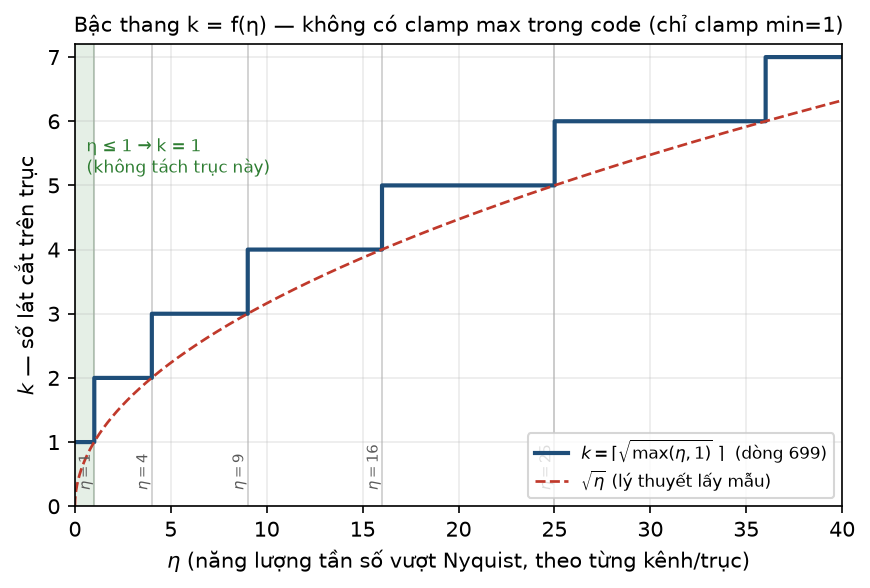
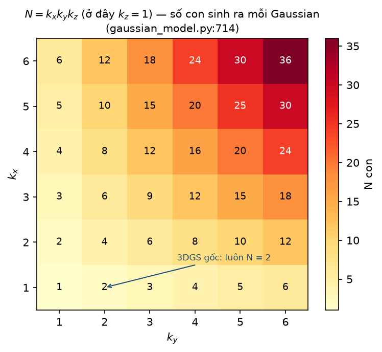
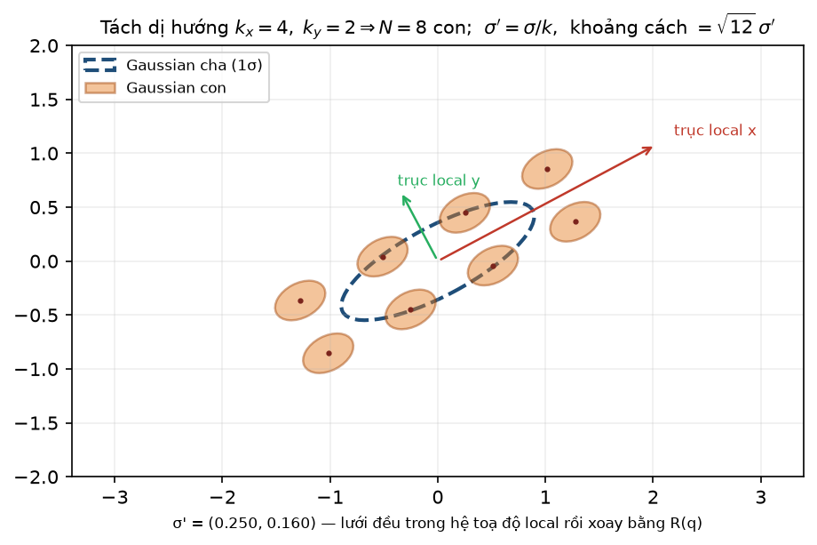
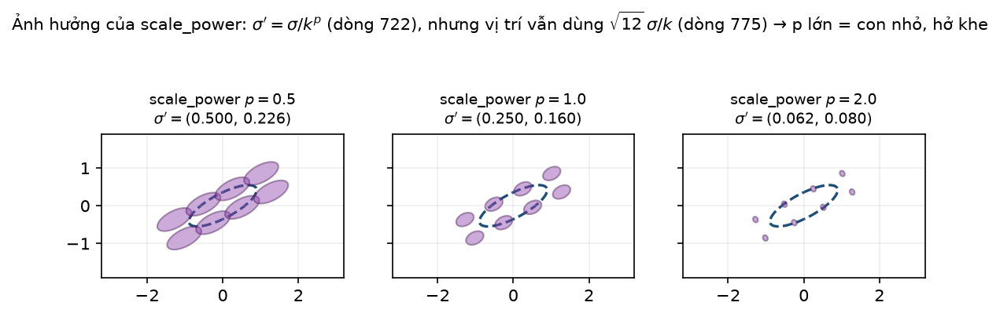
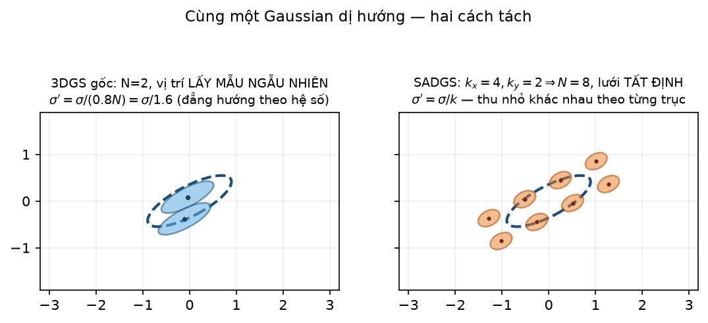
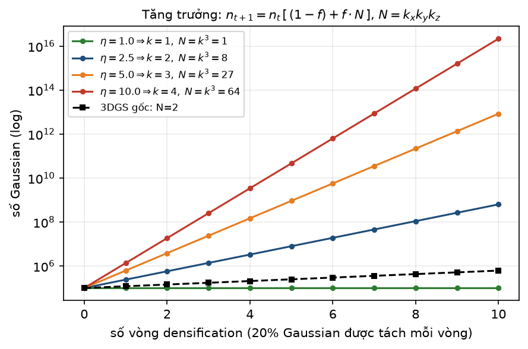

[← Mục lục chương 18](00-muc-luc.md) · Chương 18.4

# Chương 18.4 — `densify_and_split_structgs`: split **dị hướng** theo từng trục

> Nguồn:
> - `SADGS/scene/gaussian_model.py:638-831` — `densify_and_split_structgs` (toàn bộ chương này).
> - `SADGS/scene/gaussian_model.py:866-892` — `densify_and_split` của 3DGS gốc, vẫn còn nguyên trong repo, dùng để đối chiếu.
> - `SADGS/scene/gaussian_model.py:957-1011` — `densify_and_prune_structgs`, nơi dựng `combined_split_mask` và gọi hàm split ở dòng 1011.
> - `SADGS/scene/gaussian_model.py:595-636` — `densification_postfix` (ghi Gaussian con vào model + optimizer), gọi ở dòng 812.
> - `SADGS/scene/gaussian_model.py:39-40` — `scaling_activation = torch.exp`, `scaling_inverse_activation = torch.log`.
> - `SADGS/utils/general_utils.py:81` — `build_rotation(q)`, dùng ở dòng 782.
> - `SADGS/arguments/__init__.py:113,124,138,148` — `dense = 0.001`, `importance_score_threshold = 0.5`, `ks_scale_power = 1.0`, `split_ratio_threshold = 0.8`.
> - `SADGS/train.py:345-374` — nơi `split_mask` và `max_eta_3ch` được truyền xuống.
> - Hình: `DOCS/Slides67/figures/sadgsx/scripts/bot04_figs.py` (6 hình tiền tố `04_`).

Đây là **đóng góp cốt lõi** của SADGS ở phía density control. Ba chương trước đã đo được $\eta$ — năng lượng tần số vượt Nyquist, tách riêng cho từng trục của ellipsoid — và đã lọc ra tập Gaussian "vi phạm nhất quán qua nhiều view". Chương này trả lời câu hỏi còn lại: **đã biết vi phạm, thì cắt như thế nào cho đúng.**

| Phần | Nội dung |
|---|---|
| 18.4.0 | Chữ ký hàm, đầu vào, vị trí trong pipeline |
| 18.4.1 | Công thức 1 — $k_a=\lceil\sqrt{\max(\eta_a,1)}\rceil$ từ lý thuyết lấy mẫu |
| 18.4.2 | Công thức 2 — $N=k_xk_yk_z$ và cách vector hoá số con thay đổi |
| 18.4.3 | Công thức 3 — vị trí con: lưới đều tất định trong hệ local |
| 18.4.4 | Công thức 4 — `scale_power` và sự lệch pha giữa scale và offset |
| 18.4.5 | Đối chiếu trực tiếp với split đẳng hướng của 3DGS |
| 18.4.6 | Động lực tăng trưởng số Gaussian và hai tầng phanh |
| 18.4.7 | Kế thừa thuộc tính, xoá cha, và dead code trong hàm |
| 18.4.8 | Tóm tắt |

---

## 18.4.0 Chữ ký hàm và vị trí trong pipeline

`gaussian_model.py:638`:

```python
def densify_and_split_structgs(self, metric_mask, max_eta_3ch=None, scale_power=1.0):
```

Ba đối số, không đối số nào là tuỳ chọn về mặt ngữ nghĩa:

| Đối số | Nguồn thực tế | Ý nghĩa |
|---|---|---|
| `metric_mask` | `combined_split_mask` (`:1010`) | mặt nạ bool: Gaussian nào được tách trong vòng này |
| `max_eta_3ch` | `gaussians.max_eta_3ch` (`train.py:351,373`) | tensor `[N,3]` — $\eta$ **lớn nhất qua các view**, riêng từng trục |
| `scale_power` | `args.ks_scale_power` (`:1011`, mặc định `1.0` tại `arguments/__init__.py:138`) | số mũ $p$ trong $\sigma'=\sigma/k^p$ |

Hàm dài $\approx$194 dòng (638–831), so với 27 dòng của `densify_and_split` gốc (866–892). Toàn bộ phần dài thêm đó nằm ở chỗ: số con **không còn là hằng số**, nên mọi phép nhân bản phải dùng `repeat_interleave` với số lần lặp khác nhau cho từng Gaussian, và toạ độ con phải được giải mã ngược từ chỉ số phẳng.

Trước khi làm gì, hàm xử lý hai tình huống biên (`:663-680`):

- **Padding** (`:666-672`): nếu `metric_mask` hoặc `max_eta_3ch` ngắn hơn số Gaussian hiện tại (xảy ra khi có clone chen vào trước split trong cùng một vòng — `densify_and_clone_structgs` được gọi ở `:1007`, **trước** split ở `:1011`), phần thiếu được đệm bằng `False`/`0`. Nghĩa là **Gaussian vừa clone ra không bao giờ bị split ngay trong cùng vòng** — $\eta$ của chúng được đệm bằng 0.
- **Thoát sớm** (`:679-680`): `if split_indices.numel() == 0: return`. Không có ứng viên thì hàm gần như miễn phí.

Sau đó ba thuộc tính cha được trích ra (`:683-685`): `current_scales = self.get_scaling[split_indices]` (đã qua `exp`, tức là $\sigma$ thật chứ không phải log-scale), `current_rots` (quaternion thô) và `current_xyz`.

---

## 18.4.1 Công thức 1 — số lát cắt $k$ suy ra từ $\eta$

Đây là công thức mang toàn bộ ý tưởng của chương. Comment `:693-695` viết thẳng chuỗi suy luận:

Gọi $\omega_{\max}$ là tần số không gian cao nhất của texture tại vị trí Gaussian chiếu lên, $\sigma_a$ là bán kính Gaussian theo trục $a$. Đại lượng $\eta$ được định nghĩa (chương 18.3) xấp xỉ:

$$
\eta_a \sim \big(\sigma_a\,\omega_{\max}\big)^2
$$

Điều kiện lấy mẫu mong muốn là Gaussian đủ nhỏ để "đọc" được texture, tức $\sigma'_a\omega_{\max}\le 1$. Thay $\sigma'_a=\sigma_a/k_a$:

$$
\Big(\frac{\sigma_a}{k_a}\Big)^2\omega_{\max}^2\le 1
\;\Longleftrightarrow\;
\frac{\eta_a}{k_a^2}\le 1
\;\Longleftrightarrow\;
k_a\ \ge\ \sqrt{\eta_a}
$$

Chọn $k_a$ nguyên nhỏ nhất thoả mãn, cộng thêm việc kẹp $\eta$ ở dưới bởi 1 để trục đã đạt Nyquist không bị cắt:

$$
\boxed{\;k_a=\max\Big(1,\ \big\lceil \sqrt{\max(\eta_a,\,1)}\,\big\rceil\Big)\;}
$$

`gaussian_model.py:699-701`:

```python
ks = torch.sqrt(torch.clamp(etavals, min=1.0)).ceil().int()
# ks = etavals.ceil().int()
ks = torch.clamp(ks, min=1)
```



*Hình 18.4.1 — Hàm bậc thang $k=f(\eta)$ vẽ trên dải $\eta\in[0,40]$ (đường bậc thang xanh đậm) đặt cạnh đường lý thuyết liên tục $\sqrt{\eta}$ (nét đứt đỏ). Các vạch dọc xám đánh dấu $\eta=1,4,9,16,25$ — đúng các điểm $(k-1)^2$ nơi $k$ nhảy bậc. Vùng xanh lá $\eta\le 1$ là vùng $k=1$: trục đó đã thoả Nyquist nên **không cắt**. Hình cho thấy `ceil` luôn nằm sát phía trên $\sqrt{\eta}$, tức code chọn đúng số lát cắt tối thiểu cần thiết, không dư.*

Đọc bảng giá trị cho cụ thể:

| Khoảng $\eta_a$ | $k_a$ | Diễn giải |
|---|---|---|
| $\eta_a\le 1$ | 1 | trục đủ mịn — **giữ nguyên**, không lệch, không co |
| $1<\eta_a\le 4$ | 2 | vi phạm nhẹ — cắt đôi |
| $4<\eta_a\le 9$ | 3 | vi phạm vừa |
| $9<\eta_a\le 16$ | 4 | vi phạm nặng |
| $\eta_a>25$ | $\ge 6$ | **không có trần** |

**Ba điểm phải đọc kỹ trong code, không đọc comment:**

1. Comment dòng `:698` ghi *"Clamp min=2 (no split) and max=8 (limit VRAM usage)"* — **cả hai con số đều sai so với code thật**. Code chỉ có `clamp(min=1)` (`:701`), không có `max`. Không có trần trên cho $k$: $\eta=100$ cho $k=10$, và nếu cả ba trục cùng vậy thì một Gaussian sinh 1000 con trong một lần gọi. Đây là điểm nhạy cảm nhất của hàm về VRAM (xem 18.4.6).
2. Dòng `:700` là một phiên bản bị comment lại: `ks = etavals.ceil().int()` — tức $k=\lceil\eta\rceil$ thay vì $\lceil\sqrt{\eta}\rceil$. Phiên bản đó **quyết liệt hơn nhiều** ($\eta=9$ cho $k=9$ thay vì 3) và không khớp với lý thuyết lấy mẫu ở `:693-695`. Nó **không chạy**.
3. `torch.clamp(etavals, min=1.0)` được đặt **bên trong** `sqrt`, nên $\eta=0$ (Gaussian chưa từng được view nào thống kê, hoặc vừa được đệm padding ở `:671`) cho $k=1$ — an toàn, không sinh con rác.

**Nhánh dự phòng** khi `max_eta_3ch is None` (`:703-709`): tìm trục có scale lớn nhất và đặt $k=2$ riêng cho trục đó, hai trục còn lại $k=1$, tức $N=2$ — mô phỏng lại hành vi 3DGS gốc. Trong đường chạy thật của `train.py:373` thì `max_eta_3ch` **luôn được truyền**, nên nhánh này chỉ là lưới an toàn.

---

## 18.4.2 Công thức 2 — tổng số con $N=k_xk_yk_z$

$$
\boxed{\;N_p=k_x^{(p)}\,k_y^{(p)}\,k_z^{(p)}\;}
$$

`gaussian_model.py:714`: `N_per_point = ks.prod(dim=1)`.

Trong đó $p$ là chỉ số Gaussian cha. Khác biệt then chốt so với 3DGS: $N_p$ **thay đổi theo từng Gaussian**, không phải hằng số.



*Hình 18.4.2 — Heatmap $N=k_xk_y$ với $k_z=1$, cho $k_x,k_y$ chạy từ 1 đến 6; mỗi ô ghi số con sinh ra. Mũi tên chỉ vào ô $(k_x,k_y)=(2,1)$ — chỗ duy nhất mà 3DGS gốc có thể ở, vì nó luôn khoá $N=2$. SADGS di chuyển tự do trên toàn bảng: từ $N=1$ (không thực sự tách, chỉ "tái tạo tại chỗ") tới $N=36$ chỉ với hai trục.*

Hệ quả hình học quan trọng: với một Gaussian **dẹt** (biểu diễn một mặt phẳng — tường, sàn, mặt bàn), trục theo phương pháp tuyến đã rất mỏng nên $\eta_z\le 1$, cho $k_z=1$. Kết quả $N=k_xk_y$: SADGS **không phí một Gaussian nào theo phương pháp tuyến**. 3DGS gốc thì luôn cắt trục dài nhất và luôn thu nhỏ cả ba trục theo cùng hệ số, nên trục pháp tuyến vốn đã đúng lại bị làm mỏng thêm một cách vô ích.

**Vector hoá với số lần lặp thay đổi.** Vì `repeats = N_per_point` là một tensor chứ không phải số, toàn bộ hàm dùng `repeat_interleave(repeats, dim=0)` (`:722-729`) thay cho `repeat(N,1)` của bản gốc (`:875-886`). Để lấy lại chỉ số cục bộ $j\in[0,N_p)$ của từng con trong mảng phẳng, code dùng thủ thuật cumsum (`:736-746`):

$$
\text{starts}_p=\sum_{q<p}N_q=\Big(\mathrm{cumsum}(N)-N\Big)_p,
\qquad
j = \text{arange}(\textstyle\sum_q N_q) - \text{starts}_{\text{expanded}}
$$

Không có vòng lặp Python nào trên điểm — toàn bộ hàm chạy một lượt trên GPU bất kể có bao nhiêu cấu hình $(k_x,k_y,k_z)$ khác nhau cùng tồn tại. Đây là lý do comment `:711` "Group by configuration" bị bỏ dở: không cần nhóm nữa.

---

## 18.4.3 Công thức 3 — vị trí con: lưới đều tất định trong hệ local

Từ chỉ số phẳng $j$, giải mã ra bộ ba chỉ số lưới theo thứ tự `meshgrid(indexing='ij')`, trong đó $z$ chạy nhanh nhất (`:757-759`):

$$
i_z=j \bmod k_z,\qquad
i_y=\Big\lfloor \frac{j}{k_z}\Big\rfloor \bmod k_y,\qquad
i_x=\Big\lfloor \frac{j}{k_yk_z}\Big\rfloor
$$

Chuyển sang toạ độ lưới **căn giữa** (`:763-765`), tính bước lưới (`:775-776`), nhân và xoay (`:778-788`):

$$
g_a=i_a-\frac{k_a-1}{2},
\qquad
s_a=\underbrace{\frac{\sigma_a}{k_a}}_{\sigma'_a}\cdot\sqrt{12},
\qquad
\boxed{\;\mathbf{x}_{\text{con}}=\mathbf{x}_{\text{cha}}+R(q)\big(\mathbf{s}\odot\mathbf{g}\big)\;}
$$

với $R(q)=$ `build_rotation(new_rotation)` (`:782`, `utils/general_utils.py:81`) và phép nhân là `torch.bmm` theo batch (`:786`).



*Hình 18.4.3 — Một Gaussian cha dị hướng $\sigma=(1.0,\ 0.32)$ xoay $28^\circ$ (ellipse nét đứt xanh), tách với $k_x=4,\ k_y=2 \Rightarrow N=8$ con (ellipse cam). Hai mũi tên đỏ/lục là trục local $x,y$ sau khi xoay: thấy rõ lưới 4×2 **bám theo hướng của ellipsoid** chứ không theo trục thế giới, đúng như phép nhân $R(q)$ ở dòng 782–786. Các chấm nâu là tâm con; trọng tâm của chúng trùng tâm cha. Nhãn trục ghi $\sigma'$ thực tế của con: $(0.250,\ 0.160)$ — trục $x$ co 4 lần, trục $y$ co 2 lần.*

**Vì sao hệ số $\sqrt{12}$?** Phân bố đều trên một đoạn dài $L$ có độ lệch chuẩn $L/\sqrt{12}$. Muốn tập các con — vốn là các điểm rời rạc cách đều — tái tạo lại **phương sai của cha** theo trục đó, phải đặt bước lưới $L=\sqrt{12}\,\sigma'_a$. Đây là điều kiện bảo toàn moment bậc hai; nó khiến khối con sau khi tách "chiếm đúng chỗ" của cha thay vì co cụm về tâm.

**Ba hệ quả trực tiếp của công thức lưới:**

- **Bảo toàn tâm.** Vì $\sum_{i_a=0}^{k_a-1}\big(i_a-\frac{k_a-1}{2}\big)=0$, trọng tâm tập con trùng đúng $\mathbf{x}_{\text{cha}}$. Không có trôi vị trí.
- **Trục không vi phạm không bị động vào.** $k_a=1\Rightarrow g_a = 0-\frac{0}{2}=0$: không lệch theo trục đó, và theo `:722` cũng không co. Đây chính là chỗ "dị hướng" thể hiện rõ nhất.
- **Tất định.** Không có `torch.normal` ở bất cứ đâu trong hàm. Hai lần chạy cùng seed cho cùng kết quả; phương sai do lấy mẫu ngẫu nhiên bị loại bỏ hoàn toàn.

Lưu ý một hệ quả không mong muốn nhưng có thật: khoảng cách tâm–tâm giữa hai con kề nhau là $\sqrt{12}\,\sigma'\approx 3.46\,\sigma'$, trong khi bề rộng $1\sigma$ của mỗi con chỉ là $\sigma'$. Các con **không chạm nhau ở mức $1\sigma$** — chúng chỉ phủ kín nhau ở đuôi. Quan sát được trên Hình 18.4.3: giữa các ellipse cam có khe hở. Bù lại, opacity được kế thừa nguyên vẹn (18.4.7) nên vùng vừa tách trở nên đậm hơn, và vài trăm bước tối ưu tiếp theo là thứ thực sự "hàn" bề mặt lại.

---

## 18.4.4 Công thức 4 — `scale_power` và sự lệch pha giữa scale và offset

$$
\boxed{\;\sigma'_a=\frac{\sigma_a}{k_a^{\,p}}\;},
\qquad p=\texttt{scale\_power}=\texttt{args.ks\_scale\_power}\ \ (\text{mặc định }1.0)
$$

`gaussian_model.py:722`:

```python
new_scaling = self.scaling_inverse_activation(current_scales / ks.float()**scale_power).repeat_interleave(repeats, dim=0)
```

`scaling_inverse_activation` là `torch.log` (`:40`) vì `scaling_activation = torch.exp` (`:39`) — model lưu scale ở log-space, nên phép chia thực chất là một phép trừ trong tham số được tối ưu: $\log\sigma'_a=\log\sigma_a-p\log k_a$.



*Hình 18.4.4 — Cùng một cha $\sigma=(1.0,\ 0.32)$, cùng $k_x=4,k_y=2$, chỉ đổi $p$: trái $p=0.5$ cho $\sigma'=(0.500,\ 0.226)$, giữa $p=1.0$ cho $(0.250,\ 0.160)$, phải $p=2.0$ cho $(0.063,\ 0.080)$. **Vị trí các tâm giống hệt nhau ở cả ba panel** — vì offset ở dòng 775 luôn dùng $\sigma/k$, không dùng $\sigma/k^p$. Do đó $p$ lớn chỉ làm con teo lại trong khi lưới giữ nguyên độ thưa, và khe hở giữa các con rộng ra rõ rệt ở panel phải.*

Đây là **điểm cần lưu ý nhất về mặt cài đặt của cả hàm**: hai công thức tách rời nhau.

| Đại lượng | Dòng | Công thức |
|---|---|---|
| scale con | `:722` | $\sigma_a/k_a^{\,p}$ |
| std dùng cho khoảng cách | `:775` | $\sigma_a/k_a$ — **không có $p$** |

Với $p=1$ (giá trị mặc định thực tế tại `arguments/__init__.py:138`) hai công thức trùng nhau và mọi thứ nhất quán: con có std $\sigma'$, đặt cách nhau $\sqrt{12}\sigma'$, bảo toàn phương sai cha. Với $p\ne 1$ chúng lệch pha:

- $p>1$: con nhỏ hơn mức lưới giả định $\Rightarrow$ tổng phương sai của tập con **nhỏ hơn** phương sai cha, bề mặt bị thủng lỗ chỗ. Docstring `:645-646` mô tả $p=2.0$ là *"more aggressive shrinking"* — đúng, nhưng hệ quả kèm theo (lưới không co theo) thì không được nói đến.
- $p<1$: con lớn hơn mức lưới giả định $\Rightarrow$ chồng lấn nhiều, mờ thêm, gần như vô hiệu hoá mục đích chống aliasing của việc tách.

Kết luận thực dụng: **giữ `ks_scale_power = 1.0`**. Đây là giá trị duy nhất khiến hai dòng 722 và 775 mô tả cùng một hình học.

---

## 18.4.5 Đối chiếu trực tiếp với split đẳng hướng của 3DGS

`densify_and_split` gốc (`:866-892`) chỉ có ba dòng mang nội dung toán học:

```python
stds    = self.get_scaling[selected_pts_mask].repeat(N,1)          # :875
samples = torch.normal(mean=means, std=stds)                        # :877
new_scaling = self.scaling_inverse_activation(
                 self.get_scaling[selected_pts_mask].repeat(N,1) / (0.8*N))   # :880
```

Tức là, với mặc định `N=2` (`:866`):

$$
\Delta\mathbf{x}\sim\mathcal{N}(0,\Sigma),
\qquad
\sigma'_a=\frac{\sigma_a}{0.8N}=\frac{\sigma_a}{1.6}\quad\text{cho }\textbf{mọi}\text{ trục } a
$$



*Hình 18.4.5 — Cùng một Gaussian cha dị hướng $\sigma=(1.0,\ 0.32)$, hai cách tách. **Trái (3DGS gốc)**: đúng 2 con, tâm lấy mẫu ngẫu nhiên từ $\mathcal{N}(0,\Sigma)$ theo dòng 877 rồi xoay bằng $R$ theo dòng 879, mỗi con có $\sigma'=\sigma/1.6=(0.625,\ 0.200)$ — vẫn **dài theo trục vi phạm**. **Phải (SADGS)**: $k_x=4,k_y=2\Rightarrow 8$ con trên lưới tất định, $\sigma'=(0.250,\ 0.160)$ — trục $x$ co 4 lần đúng theo mức vi phạm đo được, trục $y$ chỉ co 2 lần. Hình minh hoạ trực tiếp công thức $\sigma'=\sigma/1.6$ (dòng 880) đối chiếu với $\sigma'_a=\sigma_a/k_a$ (dòng 722).*

Bảng đối chiếu đầy đủ:

| Tiêu chí | 3DGS `densify_and_split` (`:866-892`) | SADGS `densify_and_split_structgs` (`:638-831`) |
|---|---|---|
| Số con | hằng số $N=2$ (`:866`) | $N=k_xk_yk_z$, thay đổi từng Gaussian (`:714`) |
| Quyết định dựa trên | chỉ gradient $\ge$ `grad_threshold` (`:871`) | $\eta$ từng trục, qua nhiều view (`:699`) |
| Vị trí con | ngẫu nhiên $\mathcal{N}(0,\Sigma)$ (`:877`) | lưới đều tất định + $R(q)$ (`:763-788`) |
| Hệ số thu nhỏ | $1/1.6$ cho cả 3 trục (`:880`) | $1/k_a^{\,p}$, riêng từng trục (`:722`) |
| Trục không vi phạm | vẫn bị thu nhỏ | giữ nguyên ($k_a=1$) |
| Tái lập được | không (có lấy mẫu ngẫu nhiên) | có |
| Xoá cha | `prune_filter` (`:890-891`) | `total_prune_mask` (`:808-809`, `:830-831`) — giống nhau |

Điểm mấu chốt về tốc độ hội tụ: với 3DGS, $\sigma'_x=0.625\sigma_x$ nghĩa là mỗi vòng split chỉ giảm $\eta_x$ đi hệ số $1.6^2=2.56$. Một Gaussian có $\eta_x=16$ cần $\log_{2.56}16\approx 3$ vòng densification liên tiếp (và mỗi vòng cách nhau hàng trăm iteration) mới hết aliasing, trong khi vẫn liên tục sinh con thừa theo hai trục kia. SADGS đưa $\eta_x$ về $\le 1$ **trong một lần** vì $k_x=4$ cho $\eta_x/k_x^2=1$ theo đúng thiết kế ở 18.4.1. Tên bài báo là *"Faster Convergence"* chứ không phải *"Fewer Gaussians"* — đây chính là cơ chế đứng sau chữ "faster".

---

## 18.4.6 Động lực tăng trưởng số Gaussian và hai tầng phanh

Gọi $f$ là tỉ lệ Gaussian được chọn tách trong một vòng densification, $N$ là số con trung bình. Vì cha bị xoá (`:830-831`):

$$
\boxed{\;n_{t+1}=n_t\Big[(1-f)+f\cdot N\Big]\;}
$$



*Hình 18.4.6 — Mô phỏng 10 vòng densification, khởi điểm $n_0=10^5$, giả định $f=0.2$ và trường hợp xấu nhất cả ba trục cùng vi phạm ($N=k^3$), trục tung log. Bốn đường màu ứng với $\eta=1\ (k{=}1, N{=}1)$, $\eta=2.5\ (k{=}2, N{=}8)$, $\eta=5\ (k{=}3, N{=}27)$, $\eta=10\ (k{=}4, N{=}64)$; đường đen nét đứt là 3DGS gốc với $N=2$. Khoảng cách giữa đường đen và đường đỏ là hơn bốn bậc thập phân sau 10 vòng — hình này là lời cảnh báo định lượng cho việc **không có trần $k$** ở dòng 701.*

Chú ý: hình dùng $N=k^3$ làm biên trên bi quan. Trong thực tế cảnh 3D, phần lớn Gaussian biểu diễn bề mặt nên thường chỉ vi phạm 1–2 trục, và $N$ thực tế nhỏ hơn nhiều. Nhưng cấu trúc hàm mũ của công thức là không đổi: tốc độ tăng trưởng tỉ lệ với $N$, mà $N\sim\eta^{3/2}$ trong trường hợp xấu.

**Hai tầng phanh giữ cho $f$ nhỏ** (`densify_and_prune_structgs`, `:990-1011`):

$$
\text{final\_split} = \Big(\underbrace{\text{custom\_split\_mask}}_{\text{multiview }\eta} \lor \underbrace{\lVert\bar g_{\text{abs}}\rVert\ge\texttt{grad\_abs\_thresh}}_{\text{gradient}}\Big)\ \land\ \underbrace{\big[\max_a\sigma_a > \texttt{dense}\cdot\text{extent}\big]}_{\text{đủ to mới split, không thì clone}}
$$

$$
\text{combined\_split} = \text{final\_split}\ \land\ \underbrace{\big[\text{importance\_score} > \texttt{importance\_score\_threshold}\big]}_{\text{metric\_mask, dòng 1005}}
$$

Các ngưỡng thật: `grad_abs_thresh = 0.0002` (`arguments/__init__.py:109`), `dense = 0.001` (`:113`), `importance_score_threshold = 0.5` (`:124`). Riêng `custom_split_mask` đến từ `train.py:345`: `(high_ratio > opt.split_ratio_threshold) & is_grad_high` với `split_ratio_threshold = 0.8` (`arguments/__init__.py:148`) — nghĩa là phải **hơn 80% số view nhìn thấy Gaussian đó đều báo $\eta$ cao** thì mới được ghi tên vào danh sách tách. Ba lớp điều kiện chồng lên nhau là thứ duy nhất đứng giữa công thức $N=k_xk_yk_z$ và một lần OOM.

---

## 18.4.7 Kế thừa thuộc tính, xoá cha, và dead code trong hàm

**Kế thừa nguyên vẹn** (`:723-729`) — tất cả bằng `repeat_interleave(repeats, dim=0)`:

| Thuộc tính con | Dòng | Ghi chú |
|---|---|---|
| `new_rotation` ← `_rotation` | `:723` | con **cùng hướng** với cha; lưới local vì thế mới có nghĩa |
| `new_features_dc`, `new_features_rest` | `:724-725` | **toàn bộ SH** sao chép y nguyên — màu con ban đầu giống hệt cha |
| `new_opacity` ← `_opacity` | `:726` | **không giảm**: không có hiệu chỉnh $\alpha$ kiểu một số biến thể 3DGS |
| `new_radii` ← `tmp_radii` | `:727` | bán kính màn hình của vòng render trước |
| `new_filter_3D` ← `filter_3D` | `:728` | bán kính lọc chống alias 3D |
| `new_densify_count` = cha $+1$ | `:729` | đếm số lần một nhánh đã bị tách |

Việc **không giảm opacity** đáng chú ý: một cha có $\alpha$ đem chia thành $N$ con mỗi con vẫn $\alpha$, nên tổng độ đục theo tia tăng lên. Kết hợp với khoảng cách $\sqrt{12}\sigma'$ ở 18.4.3, vùng vừa tách trong ngắn hạn **vừa đậm vừa rỗ** — đây là trạng thái tạm thời mà optimizer phải gỡ trong các iteration kế tiếp, và là một lý do khiến chất lượng có thể dao động ngay sau mỗi mốc densification.

**Ghi vào model** — `densification_postfix` (`:595-636`, gọi ở `:812`): nối tensor mới vào `param_group` **và vào đệm Adam** (`exp_avg`, `exp_avg_sq`) bằng zeros, nên con khởi động với momentum sạch; `xyz_gradient_accum`, `_abs`, `denom`, `max_radii2D` bị reset toàn bộ; các bộ tích luỹ tần số (`accum_eta`, `max_eta_3ch`, `eta_high/mid/low_*`) được nối zeros (`:625-636`). Sau đó dòng `:828` ghi đè phần `densify_count` mà `densification_postfix` vừa đệm bằng 0, thay bằng giá trị kế thừa đã tính ở `:729`.

**Xoá cha** (`:807-831`): dựng `total_prune_mask` gồm `True` tại `split_indices`, nối thêm `zeros(n_added)` cho phần con vừa thêm, rồi gọi `prune_points`. Thứ tự **thêm con trước, xoá cha sau** là bắt buộc — nếu xoá trước thì chỉ số trong `split_indices` sẽ lệch.

**Dead code trong hàm — phải nói rõ:**

1. `new_accum_eta_list`, `new_accum_view_count_list`, `new_max_eta_3ch_list` được khai báo ở `:658-660`, được nạp zeros ở `:803-805`, rồi **không bao giờ được dùng**. Công việc đó đã do `densification_postfix` (`:625-636`) làm rồi. Ba dòng này chỉ tốn một lần cấp phát bộ nhớ vô ích.
2. Cấu trúc `new_*_list` + `torch.cat(...)` (`:648-655`, `:791-799`, `:813-820`) là di tích của một phiên bản cũ có vòng lặp theo nhóm cấu hình $(k_x,k_y,k_z)$. Sau khi vector hoá, mỗi list chỉ còn **đúng một phần tử**; `torch.cat` trên list một phần tử là no-op. Comment `:790` thừa nhận điều này: *"now just single tensors"*.
3. `if len(new_xyz_list) > 0` ở `:811` luôn đúng, vì trường hợp rỗng đã `return` từ `:680`.

Ngoài hàm nhưng liên quan trực tiếp: `expand_undersized_gs` (`:833-865`) — cơ chế **nở** Gaussian quá nhỏ về đúng $\eta=1$ — **đang bị comment lại** ở `train.py:356-359`, tức không chạy. Và `avg_high_eta_3ch` được tính công phu ở `train.py:348-350` nhưng dòng `:373` truyền xuống `max_high_eta = gaussians.max_eta_3ch` (`:351`), nên **giá trị trung bình bị bỏ, hàm split dùng giá trị lớn nhất** — lựa chọn này khiến $k$ bám theo view tệ nhất, quyết liệt hơn so với dùng trung bình.

---

## 18.4.8 Tóm tắt

| Thành phần | Công thức | Code | Nhận xét |
|---|---|---|---|
| Số lát cắt mỗi trục | $k_a=\max(1,\lceil\sqrt{\max(\eta_a,1)}\rceil)$ | `:699-701` | trần `max=8` trong comment `:698` **không tồn tại** trong code |
| Tổng số con | $N=k_xk_yk_z$ | `:714` | thay đổi từng Gaussian; 3DGS khoá cứng $N=2$ |
| Scale con | $\sigma'_a=\sigma_a/k_a^{\,p}$ | `:722` | $p=$ `ks_scale_power`, mặc định `1.0` (`arguments:138`) |
| Vị trí con | $\mathbf{x}+R(q)\big[\sqrt{12}\tfrac{\boldsymbol\sigma}{\mathbf{k}}\odot(\mathbf{i}-\tfrac{\mathbf{k}-1}{2})\big]$ | `:763-788` | tất định, bảo toàn tâm và phương sai cha |
| Kế thừa | rotation, SH, opacity **không đổi**; `densify_count`+1 | `:723-729` | vùng mới tạm thời đậm hơn |
| Xoá cha | `prune_points(total_prune_mask)` **sau** khi thêm con | `:807-831` | thứ tự bắt buộc |

Bốn điều cần nhớ:

1. **"Đo rồi cắt" thay cho "đoán mò".** 3DGS cắt đôi trục dài nhất bất kể texture bên dưới thế nào; SADGS đọc $\eta$ từng trục và cắt đúng số lát mà lý thuyết lấy mẫu yêu cầu, một lần là xong thay vì lặp nhiều vòng.
2. **Dị hướng là thật, không chỉ là tên gọi.** $k_a=1$ trên trục đã đủ mịn nghĩa là trục đó không bị lệch (`:763`) và không bị co (`:722`) — Gaussian dẹt biểu diễn mặt phẳng không bị lãng phí theo phương pháp tuyến.
3. **Rủi ro lớn nhất là không có trần $k$.** Comment hứa `max=8`, code chỉ có `clamp(min=1)`. Ba tầng mặt nạ ở `:993-1011` là thứ duy nhất giữ $f$ đủ nhỏ để $n_{t+1}=n_t[(1-f)+fN]$ không bùng nổ.
4. **Giữ `ks_scale_power = 1.0`.** Dòng 722 dùng $k^p$ còn dòng 775 dùng $k$; chỉ ở $p=1$ hai công thức mới mô tả cùng một hình học.

---

[← 18.3 — $\eta$ và multiview consistency](03-thong-ke-eta-da-view.md) · [18.5 — Clone dị hướng →](05-clone-va-expand.md) · [Mục lục chương 18](00-muc-luc.md)
