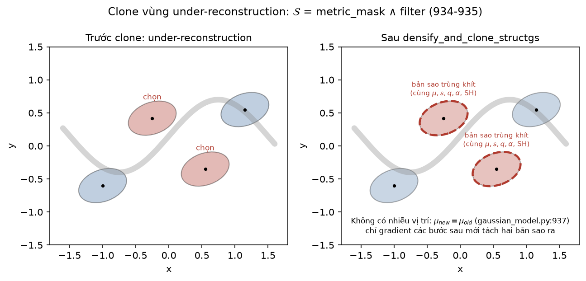
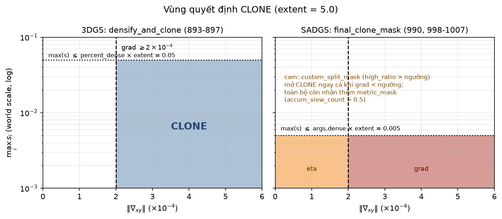
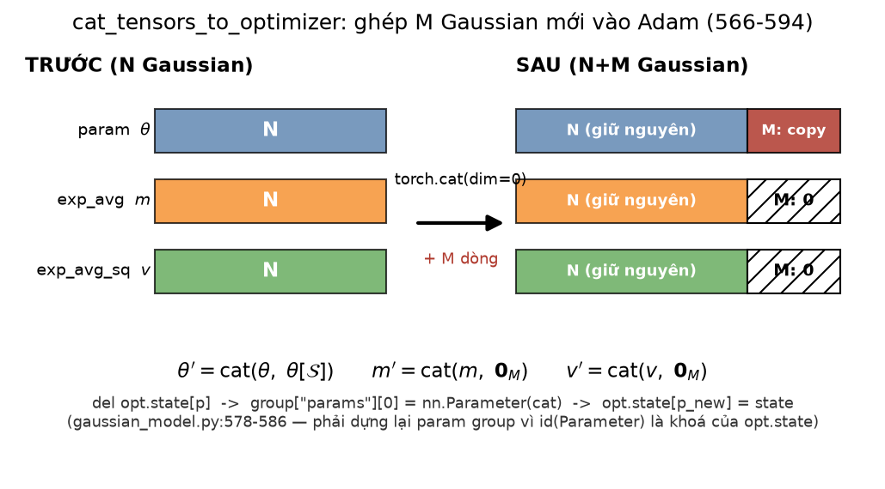
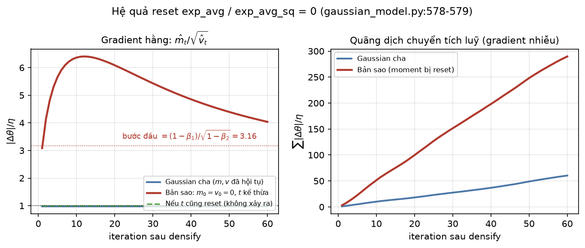
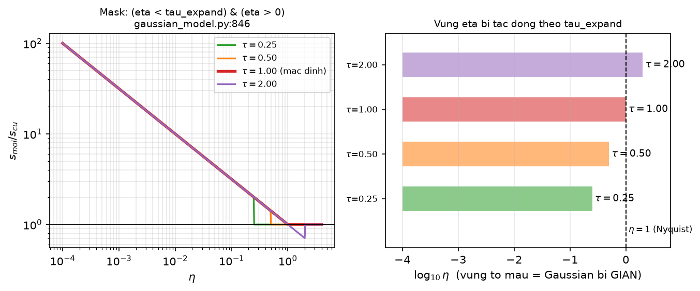
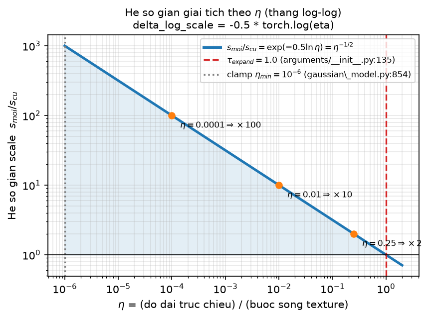
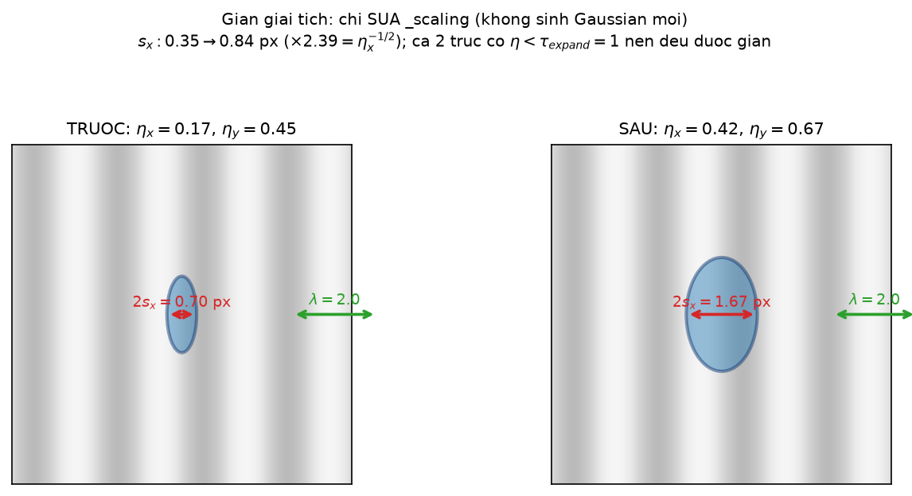
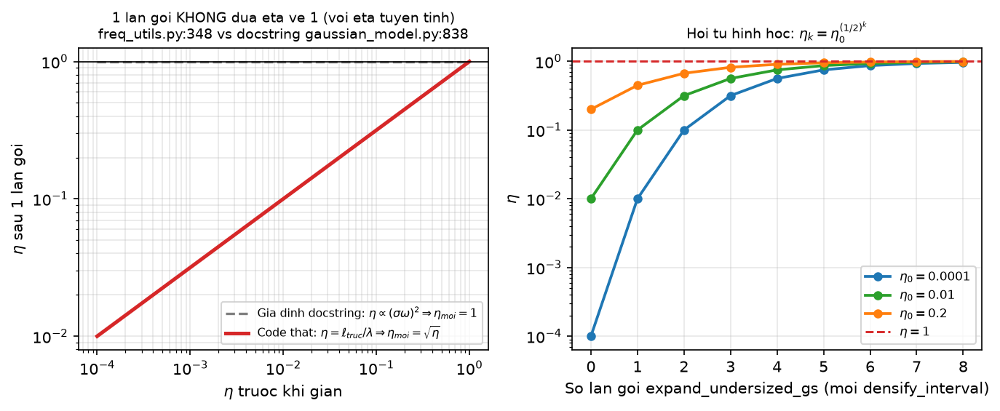
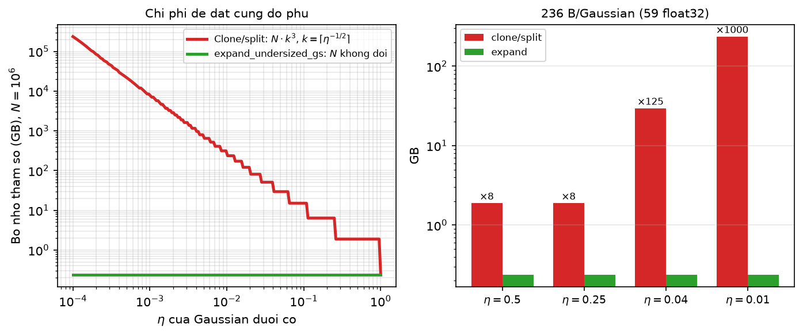
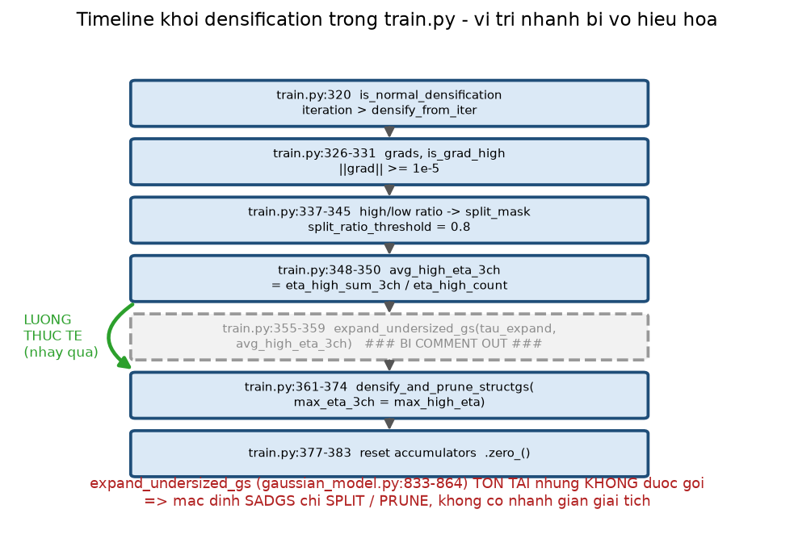

[← Mục lục chương 18](00-muc-luc.md) · Chương 18.5

# Chương 18.5 — Clone và Expand: nhân bản Gaussian, ghép tensor vào Adam, và nhánh giãn giải tích bị tắt

> Nguồn:
> - `SADGS/scene/gaussian_model.py:934-955` — `densify_and_clone_structgs`.
> - `SADGS/scene/gaussian_model.py:595-636` — `densification_postfix`.
> - `SADGS/scene/gaussian_model.py:566-593` — `cat_tensors_to_optimizer`.
> - `SADGS/scene/gaussian_model.py:485-501` — `replace_tensor_to_optimizer`; `:503-526` — `_prune_optimizer`.
> - `SADGS/scene/gaussian_model.py:833-864` — `expand_undersized_gs` (**hàm tồn tại nhưng không được gọi**).
> - `SADGS/scene/gaussian_model.py:957-1052` — `densify_and_prune_structgs` (nơi ra quyết định clone/split).
> - `SADGS/scene/gaussian_model.py:893-910` — `densify_and_clone` (bản 3DGS gốc, để đối chiếu).
> - `SADGS/scene/gaussian_model.py:306-325` — `training_setup`: khai báo param group và optimizer.
> - `SADGS/train.py:315-390` — khối densification; `:355-359` là lời gọi `expand_undersized_gs` **đang bị comment out**.
> - `SADGS/arguments/__init__.py:85, 93, 112-113, 124, 128, 135-138, 148-149, 156` — hyperparameter.
> - `SADGS/utils/freq_utils.py:341, 348, 395-396` — định nghĩa $\eta$ và ngưỡng `TAU_HIGH`/`TAU_LOW`.
> - Hình: `DOCS/Slides67/figures/sadgsx/scripts/bot05_figs.py`, `bot06_figs.py`.

| Phần | Nội dung |
|---|---|
| 18.5.0 | Vị trí của clone trong chuỗi densification SADGS |
| 18.5.1 | `densify_and_clone_structgs` — mask đến từ ngoài, bản sao trùng khít |
| 18.5.2 | Vùng quyết định clone: 3DGS vs SADGS trên hai trục |
| 18.5.3 | `densification_postfix` — ba nhóm trạng thái phải đồng bộ |
| 18.5.4 | `cat_tensors_to_optimizer` — ghép tensor *và* moment Adam |
| 18.5.5 | Hệ quả của việc reset $m, v$ về 0 |
| 18.5.6 | `expand_undersized_gs` — điều kiện chọn Gaussian "dưới cỡ" |
| 18.5.7 | Công thức giãn giải tích trong không gian log-scale |
| 18.5.8 | Bất nhất giữa docstring và code: $\eta$ bậc hai hay bậc nhất? |
| 18.5.9 | Chi phí bộ nhớ: expand vs clone/split |
| 18.5.10 | Trạng thái thật: nhánh expand **bị tắt** — và rủi ro nếu bật lại |
| 18.5.11 | Tóm tắt |

---

## 18.5.0 Vị trí của clone trong chuỗi densification SADGS

Mọi thao tác nhân bản Gaussian của SADGS đi qua đúng một cửa: `densify_and_prune_structgs`
(`gaussian_model.py:957-1052`), được gọi từ `train.py:362`. Bên trong, trình tự cố định là:

1. Tính gradient trung bình tích luỹ (`:964-969`):
   $$\bar g=\frac{\texttt{xyz\_gradient\_accum}}{\texttt{denom}},\qquad
     \bar g_{abs}=\frac{\texttt{xyz\_gradient\_accum\_abs}}{\texttt{denom}},$$
   rồi thay mọi `NaN` bằng 0 — `denom` bằng 0 với Gaussian chưa được camera nào nhìn thấy trong chu kỳ.
2. Lập mặt nạ gradient `grad_qualifiers`, `grad_qualifiers_abs` (`:971-972`).
3. Nhận `custom_split_mask` / `custom_prune_mask` từ ngoài (`:978-988`).
4. Chia theo kích thước: `clone_qualifiers` và `split_qualifiers` là **phần bù đúng của nhau** (`:990-991`).
5. Ghép thành `final_split_mask` (`:993-996`), `final_clone_mask` (`:998-1002`), `metric_mask` (`:1005`).
6. Gọi `densify_and_clone_structgs(metric_mask, final_clone_mask)` (`:1007`), **rồi mới** tới split (`:1011`)
   và prune (`:1014-1044`).

Thứ tự này quan trọng: clone chạy **trước** split, nên các bản sao vừa sinh ra cũng nằm trong tensor
mà split nhìn thấy ở bước kế — nhưng `final_split_mask` đã được tính trên $N$ phần tử cũ, nên phần đuôi
$M$ dòng mới không bao giờ trúng mask split trong cùng một chu kỳ.

Điểm khác biệt cốt lõi so với 3DGS: ở 3DGS, toàn bộ điều kiện chọn nằm **bên trong** `densify_and_clone`
(`:895-897`). Ở SADGS, hàm clone chỉ nhận mask đã dựng sẵn, nên tiêu chí có thể đến từ tín hiệu tần số
đa góc nhìn thay vì chỉ từ gradient.

---

## 18.5.1 `densify_and_clone_structgs` — mask đến từ ngoài, bản sao trùng khít

Hàm này (`gaussian_model.py:934-955`) chỉ dài 20 dòng, vì mọi logic chọn điểm đã nằm ở hàm gọi. Dòng đầu tiên (`:935`):

$$\mathcal{S}\;=\;\texttt{metric\_mask}\;\wedge\;\texttt{filter}$$

Trong đó `filter` chính là `final_clone_mask` (`:998-1002`):

$$
\texttt{final\_clone\_mask}
=\Big(\underbrace{\texttt{full\_split\_mask}}_{\text{tín hiệu }\eta\text{ đa view}}
\;\vee\;\underbrace{\big(\|\bar g\|\ge\tau_g\big)}_{\texttt{grad\_qualifiers}}\Big)
\;\wedge\;\underbrace{\Big(\max_i s_i\le\lambda_d\cdot\text{extent}\Big)}_{\texttt{clone\_qualifiers}\ (:990)}
$$

với $\tau_g=\texttt{args.grad\_thresh}=2\times10^{-4}$ (`arguments/__init__.py:112`) và
$\lambda_d=\texttt{args.dense}=0.001$ (`arguments/__init__.py:113`).

`full_split_mask` đến từ `train.py:345`, là `split_mask`:

$$\texttt{split\_mask}=\Big(\underbrace{\tfrac{\texttt{eta\_high\_count}}{\texttt{accum\_view\_count}}}_{\texttt{high\_ratio}\ (\texttt{train.py:341})}>\texttt{opt.split\_ratio\_threshold}\Big)\ \wedge\ \big(\|\bar g\|\ge10^{-5}\big)$$

với `split_ratio_threshold = 0.8` (`arguments/__init__.py:148`) và ngưỡng $10^{-5}$ hard-code tại
`train.py:333`. Còn `metric_mask` (`:1005`) là `importance_score > args.importance_score_threshold`,
tức `accum_view_count > 0.5` vì `train.py:368` truyền `importance_score = gaussians.accum_view_count`.
Ý nghĩa thực tế: **chỉ nhân bản Gaussian đã được ít nhất một camera nhìn thấy trong chu kỳ vừa rồi**.
Nếu `importance_score=None` thì mask này là `ones_like` và vô hiệu (`:1005`).

Sau khi có $\mathcal{S}$, sáu tham số tối ưu cùng hai tensor phụ được **cắt lát bằng đúng một mask**,
không biến đổi giá trị (`:937-944`):

$$\mu_{new}=\mu[\mathcal{S}],\quad c^{dc}_{new}=c^{dc}[\mathcal{S}],\quad c^{rest}_{new}=c^{rest}[\mathcal{S}],\quad
\alpha_{new}=\alpha[\mathcal{S}],\quad s_{new}=s[\mathcal{S}],\quad q_{new}=q[\mathcal{S}]$$

kèm `tmp_radii` và `filter_3D`. **Không** có nhiễu vị trí, **không** chia scale, **không** đổi opacity —
bản sao trùng khít 100 % với Gaussian cha.



*Hình 18.5.1 — Bốn Gaussian trên một đường cong hình học (nền xám). Hai ellipse đỏ thoả $\mathcal{S}=\texttt{metric\_mask}\wedge\texttt{filter}$, hai ellipse xanh không. Panel phải vẽ bản sao bằng nét đứt **đè đúng lên** bản gốc: $\mu_{new}=\mu_{old}$ (`gaussian_model.py:937`), cùng $s, q, \alpha$ và toàn bộ hệ số SH. Hình minh hoạ đúng vế phải của hệ phương trình cắt lát ở trên — phép toán duy nhất là chỉ mục, không có phép biến đổi giá trị nào. Kết luận: ngay sau clone, hai bản sao **không phân biệt được**; chỉ gradient ở các iteration sau mới tách chúng ra.*

Cuối cùng, `densify_count` được **kế thừa chứ không tăng** (`:947-948, 954`): hàm chụp `parent_counts`
và `n_old` *trước* khi gọi `densification_postfix`, rồi ghi đè lên dải `[n_old : n_old+n_new]` vốn bị
postfix điền 0 (`:634`). Nói cách khác, clone không bị tính là một lần "chẻ nhỏ" trong lịch sử của Gaussian.

---

## 18.5.2 Vùng quyết định clone: 3DGS vs SADGS trên hai trục

So sánh trực tiếp hai hàm:

| | **3DGS** `densify_and_clone` (`:893-910`) | **SADGS** `densify_and_clone_structgs` (`:934-955`) |
|---|---|---|
| Nơi ra quyết định | trong chính hàm (`:895-897`) | ở `densify_and_prune_structgs:998-1007` |
| Tiêu chí gradient | $\|\bar g\|\ge$ `grad_threshold` (bắt buộc) | $\|\bar g\|\ge\tau_g$ **hoặc** `full_split_mask` |
| Tiêu chí kích thước | $\max_i s_i\le$ `percent_dense`·extent | $\max_i s_i\le$ `args.dense`·extent |
| Tiêu chí bổ sung | không có | `metric_mask`: `accum_view_count > 0.5` |
| Ngưỡng mặc định | `percent_dense = 0.01` (3DGS gốc) | `percent_dense = 0.001` (`arguments:85`), `dense = 0.001` (`arguments:113`) |
| Vị trí bản sao | $\mu_{new}=\mu_{old}$ | $\mu_{new}=\mu_{old}$ (giống hệt) |
| Bộ đếm | không có | `densify_count` kế thừa, không tăng |



*Hình 18.5.2 — Mặt phẳng quyết định với trục hoành $\|\nabla_{xy}\|$ (dải $0\dots6\times10^{-4}$) và trục tung $\max_i s_i$ theo thang log (dải $10^{-3}\dots10^{-1}$), lấy `extent = 5.0`. Trái: vùng clone của 3DGS là giao của $\|\bar g\|\ge2\times10^{-4}$ với $\max_i s_i\le 0.01\times5=0.05$. Phải: vùng đỏ là clone SADGS do gradient, vùng cam là **phần SADGS mở thêm** — Gaussian có gradient **dưới** ngưỡng vẫn được clone nhờ nhánh $\vee\,\texttt{full\_split\_mask}$ (tiêu chí $\eta$ đa view). Trần scale của SADGS là $0.001\times5=0.005$, **chặt hơn 10 lần** 3DGS. Kết luận rút ra: với ngưỡng này phần lớn Gaussian rơi vào nhánh split, clone trở thành thao tác dành riêng cho các Gaussian rất nhỏ; và tiêu chí tần số cho phép densify ở nơi gradient đã "chết" — đúng động cơ của SADGS.*

Ba hệ quả thực tế: (i) ngưỡng scale chặt hơn $10\times$ khiến `split_qualifiers` (`:991`) chiếm phần lớn
quần thể; (ii) nhánh $\vee$ `full_split_mask` cho phép nhân bản Gaussian gradient thấp nhưng vi phạm tần
số đa view; (iii) `metric_mask` chặn Gaussian "vô hình" khỏi việc sinh thêm điểm vô ích.

---

## 18.5.3 `densification_postfix` — ba nhóm trạng thái phải đồng bộ

`densification_postfix` (`:595-636`) là điểm hội tụ chung của clone và split. Nó chia trạng thái mô hình
thành ba nhóm với ba cách xử lý **khác nhau**:

**Nhóm 1 — Tham số tối ưu (6 tensor).** Đóng gói vào dict `d` theo *tên param group* rồi đẩy qua
`cat_tensors_to_optimizer` (`:596-603`). Khoá dict phải khớp chính xác `"xyz", "f_dc", "f_rest",
"opacity", "scaling", "rotation"` như khai báo ở `training_setup:306-313`. Sau đó gán lại
`self._xyz, self._features_dc, …` từ dict trả về (`:604-609`).

**Nhóm 2 — Bộ tích luỹ gradient bị XOÁ TRẮNG, không phải nối thêm** (`:614-617`):

$$\texttt{xyz\_gradient\_accum}\leftarrow\mathbf{0}_{(N+M)\times1},\quad
\texttt{xyz\_gradient\_accum\_abs}\leftarrow\mathbf{0},\quad
\texttt{denom}\leftarrow\mathbf{0},\quad
\texttt{max\_radii2D}\leftarrow\mathbf{0}$$

Tức **mọi** Gaussian — kể cả những cái không bị đụng tới — mất sạch lịch sử gradient sau mỗi lần densify.
Đây chính là lý do densification phải chạy theo chu kỳ `densification_interval = 100`
(`arguments/__init__.py:87`) chứ không thể chạy mỗi iteration: hệ thống cần đủ 100 bước để tích luỹ lại
$\bar g$ có ý nghĩa thống kê.

**Nhóm 3 — Bộ tích luỹ riêng của SADGS được nối thêm $M$ số 0** (`:624-636`): `accum_eta`,
`accum_view_count`, `max_eta_3ch` $(M\times3)$, `accum_weights_valid`, `densify_count`, và 5 tensor nhất
quán đa view (`eta_high_count`, `eta_high_sum_3ch`, `eta_mid_count`, `eta_mid_sum_3ch`, `eta_low_count`).
Chú thích trong code nói rõ lý do (`:623`): *"We append zeros because new points haven't been seen yet"*.

Hệ quả dây chuyền đáng chú ý: ngay sau densify, `accum_view_count` của các điểm mới bằng 0, nên
`metric_mask` của chính chúng bằng `False` — **chúng không thể được clone tiếp cho tới chu kỳ quan sát kế**.
Đây là một cơ chế hãm tự nhiên chống bùng nổ số điểm, tuy không được viết ra tường minh ở đâu.

Ba cạm bẫy đã được code xử lý sẵn: `tmp_radii is None` ở lần đầu $\Rightarrow$ tạo đệm 0 đúng kích thước
cũ trước khi cat (`:611-613`); `filter_3D` chỉ cat khi thực sự tồn tại và khác rỗng (`:619-620`), và
`_prune_optimizer` kiểm tra tương tự (`:547-548`); phải chụp `n_old` **trước** khi gọi postfix (`:948`),
vì sau đó `self.get_xyz.shape[0]` đã là $N+M$.

---

## 18.5.4 `cat_tensors_to_optimizer` — ghép tensor *và* moment Adam

Với mỗi param group (`:566-593`), hàm mở rộng chiều 0 từ $N$ lên $N+M$ cho **ba** tensor song song:

$$\theta'=\mathrm{cat}\big(\theta,\ \theta[\mathcal{S}]\big),\qquad
m'=\mathrm{cat}\big(m,\ \mathbf{0}_M\big),\qquad
v'=\mathrm{cat}\big(v,\ \mathbf{0}_M\big)$$

trong đó $\theta$ là tham số, $m=\texttt{exp\_avg}$ là moment bậc một và $v=\texttt{exp\_avg\_sq}$ là moment
bậc hai của Adam (`:578-579`). Nếu Adam bật `amsgrad`, `max_exp_avg_sq` cũng được nối 0 (`:581-582`) —
điều này **cần thiết** vì chế độ mặc định `optimizer_type = "hybrid"` (`arguments/__init__.py:128`) tạo
Adam với `amsgrad=True` (`gaussian_model.py:323`).



*Hình 18.5.3 — Ba hàng tensor (`param` $\theta$, `exp_avg` $m$, `exp_avg_sq` $v$) trước và sau phép `torch.cat(dim=0)`. Bên trái mỗi hàng dài $N$; bên phải phần $N$ cũ giữ nguyên, phần $M$ mới được tô khác nhau: hàng $\theta$ nhận **bản sao** giá trị của cha (ô đỏ đặc), hai hàng moment nhận **toàn số 0** (ô gạch chéo). Hình minh hoạ trực tiếp ba công thức $\mathrm{cat}$ ở trên: chỉ vế $\theta'$ mang thông tin từ Gaussian cha, hai vế còn lại bắt đầu lại từ đầu. Dòng chú thích dưới hình là ba lệnh bắt buộc theo đúng thứ tự (`:584-586`).*

Ba chi tiết cài đặt đáng nhớ:

- Vòng lặp chạy trên **danh sách** optimizer: `self.optimizer` và thêm `self.shoptimizer` nếu tồn tại
  (`:568-569`). Lý do: `f_rest` (SH bậc cao) nằm ở optimizer riêng với learning rate `highfeature_lr/20`
  (`:313`). Ở chế độ `"sparse_adam"` (`:321`) chỉ có một optimizer chứa cả `f_rest`, còn `"default"` và
  `"hybrid"` tách hai — vòng lặp này xử lý được cả ba cấu hình.
- `assert len(group["params"]) == 1` (`:573`): mỗi group đúng một tensor, nhờ đó có thể dùng
  `group['params'][0]` làm khoá trạng thái.
- Nhánh `stored_state is None` (`:589-591`): khi Adam chưa bước lần nào thì chưa có state, chỉ cần cat tham số.

**Vì sao phải dựng lại param group?** Ba dòng then chốt, đúng thứ tự (`:584-586`):
```
del opt.state[group['params'][0]]
group["params"][0] = nn.Parameter(torch.cat((group["params"][0], extension_tensor), dim=0).requires_grad_(True))
opt.state[group['params'][0]] = stored_state
```

- **Khoá của `optimizer.state` chính là đối tượng `Parameter`.** `opt.state` là dict đánh khoá theo danh
  tính tensor. Nối thêm hàng làm đổi shape nên bắt buộc tạo `Parameter` *mới*; nếu không `del` bản ghi cũ,
  dict sẽ giữ một entry mồ côi trỏ tới tensor $N$ hàng — rò bộ nhớ GPU và trạng thái sai lệch.
- **Không thể gán in-place.** Gán `group["params"][0].data = …` giữ nguyên khoá cũ nhưng làm shape của
  `data` lệch với shape `exp_avg`/`exp_avg_sq` đã lưu; bước Adam kế tiếp sẽ lỗi broadcast hoặc âm thầm tính sai.
- **`group["params"]` là list được optimizer duyệt mỗi `step()`.** Phải thay *phần tử trong list*, tạo biến
  Python mới ở ngoài là vô nghĩa.

Cùng khuôn mẫu này xuất hiện ở `replace_tensor_to_optimizer` (`:485-501`) và `_prune_optimizer` (`:503-526`),
chỉ khác phép biến đổi áp lên cả ba tensor: thay hẳn (`tensor`) hay cắt theo mask (`[mask]`).

---

## 18.5.5 Hệ quả của việc reset $m, v$ về 0

Bản sao **kế thừa giá trị tham số** nhưng **không kế thừa moment**: $m_{new}=0,\ v_{new}=0$ (`:578-579`).
Trong khi đó biến đếm bước `step` của Adam là một **scalar dùng chung cho cả tensor**, nên vẫn giữ giá trị
lớn $t\gg1$. Bước cập nhật đầu tiên của điểm mới với gradient $g$:

$$\hat m_1=\frac{(1-\beta_1)g}{1-\beta_1^{t}}\approx(1-\beta_1)g,\qquad
\hat v_1=\frac{(1-\beta_2)g^2}{1-\beta_2^{t}}\approx(1-\beta_2)g^2$$

$$\Longrightarrow\quad
\frac{|\Delta\theta|}{\text{lr}}\approx\frac{\hat m_1}{\sqrt{\hat v_1}}
=\frac{1-\beta_1}{\sqrt{1-\beta_2}}=\frac{0.1}{\sqrt{0.001}}=3.16$$

với $\beta=(0.9,\,0.999)$ (`gaussian_model.py:317-323`) và $\varepsilon=10^{-\texttt{adam\_eps\_order}}=10^{-8}$
(`:315`, `arguments/__init__.py:156`) — nhỏ tới mức bỏ qua được ở mẫu số.



*Hình 18.5.4 — Mô phỏng 60 iteration sau densify, $\beta=(0.9,0.999)$. **Trái** (gradient hằng $g=1$): đường xanh là Gaussian cha có $m_0=v_0=1$ đã hội tụ, tỉ số $\hat m/\sqrt{\hat v}$ nằm quanh $1$; đường đỏ là bản sao với $m_0=v_0=0$ nhưng $t$ kế thừa $=3000$, bước đầu vọt lên đúng mốc $(1-\beta_1)/\sqrt{1-\beta_2}=3.16$ đã tính ở công thức trên; đường xanh lá nét đứt là kịch bản giả định nếu $t$ cũng reset — **không xảy ra trong code**, vì `step` là scalar chung. **Phải** (gradient nhiễu): quãng dịch chuyển tích luỹ $\sum|\Delta\theta|/\text{lr}$ của bản sao (đỏ) vượt xa Gaussian cha (xanh) trong vài chục bước đầu. Kết luận: reset moment tạo một cú hích khoảng $3\times$ bước thường cho mọi điểm mới sinh.*

Hiệu ứng này **có lợi cho clone**: hai bản sao trùng khít cần một cú hích để tách nhau; nếu kế thừa moment
của cha thì cả hai sẽ đi cùng hướng, cùng tốc độ và mãi không tách. Mặt trái là điểm mới có thể bị "đá"
quá xa trong vài bước đầu — một phần lý do vì sao ngay sau đó code vẫn prune theo opacity (`:1014`) và
ép opacity về $\min(\alpha,0.8)$ qua `replace_tensor_to_optimizer` (`:1046-1048`).

---

## 18.5.6 `expand_undersized_gs` — điều kiện chọn Gaussian "dưới cỡ"

SADGS thiết kế **ba** thao tác thích nghi theo tần số: **split** (Gaussian quá to so với texture),
**prune** (đóng góp thấp), và **expand** (Gaussian *quá nhỏ* so với texture — lãng phí điểm). Hàm cho
thao tác thứ ba là `expand_undersized_gs` (`gaussian_model.py:833-864`).

Chỉ báo tần số $\eta$ ở chế độ mặc định `wavelength` (`utils/freq_utils.py:335-348`) là **tỉ số không thứ
nguyên** giữa kích thước Gaussian chiếu lên ảnh và bước sóng texture cục bộ:

$$\ell_{\text{trục}}=\sqrt{u^2+v^2+10^{-8}}\ \ (\texttt{freq\_utils.py:341}),\qquad
\eta_{3ch}=\frac{\ell_{\text{trục}}}{\lambda_{\min}}\ \ (\texttt{freq\_utils.py:348})$$

trong đó $u,v$ là toạ độ màn hình của trục chính Gaussian sau khi chiếu, và $\lambda_{\min}$ là bước sóng
nhỏ nhất của texture cục bộ suy từ trị riêng lớn nhất của structure tensor 2D. Diễn giải: $\eta>1$ nghĩa là
Gaussian **to hơn** chi tiết (aliasing, cần split); $\eta<1$ nghĩa là Gaussian **nhỏ hơn** chi tiết
(dư điểm, đáng giãn).

Điều kiện chọn (`gaussian_model.py:846`):

$$\texttt{undersized\_mask}=(\texttt{max\_eta\_3ch}<\tau_{expand})\ \wedge\ (\texttt{max\_eta\_3ch}>0)$$

với $\tau_{expand}=1.0$ (`arguments/__init__.py:135`). Ba điểm cần nhớ:

- Mask là **per-axis** trên tensor $[N,3]$: mỗi trục chính của một Gaussian được xét độc lập, nên một
  Gaussian có thể bị giãn theo trục $x$ mà giữ nguyên trục $y$.
- Điều kiện $>0$ loại các Gaussian chưa từng được quan sát (accumulator còn 0) — nếu thiếu nó, chúng sẽ
  nhận $\ln(0)=-\infty$ và bị giãn vô hạn.
- $\tau_{expand}=1.0$ chính là ngưỡng Nyquist, trùng đúng với `TAU_HIGH = 1.0` dùng để phân loại high-$\eta$
  (`freq_utils.py:395`); ngưỡng low là `TAU_LOW = 0.1` (`:396`).



*Hình 18.5.5 — Trái: hệ số giãn $s_{\text{mới}}/s_{\text{cũ}}$ vẽ trên thang log–log của $\eta$ (dải $10^{-4}\dots10^{0.6}$), cho bốn giá trị $\tau\in\{0.25,\,0.5,\,1.0,\,2.0\}$; đường đậm là mặc định $\tau=1.0$. Ngoài vùng mask, hệ số bằng đúng $1$ — tức không đổi, minh hoạ trực tiếp cho phép `delta = zeros_like(_scaling)` rồi chỉ ghi vào các ô thoả mask. Phải: bề rộng vùng tác động trên trục $\log_{10}\eta$ dưới dạng thanh ngang; đường đứt tại $\eta=1$ là mốc Nyquist. Kết luận: $\tau_{expand}$ điều khiển **bao nhiêu** Gaussian bị chạm, còn độ lớn của phép giãn thì do chính $\eta$ quyết định.*

---

## 18.5.7 Công thức giãn giải tích trong không gian log-scale

Vì `scaling_activation = torch.exp` (`gaussian_model.py:39`), tức $\sigma=\exp(\texttt{\_scaling})$, việc
**nhân** scale trở thành phép **cộng** trong không gian log. Công thức cập nhật (`:854-855`):

$$\boxed{\ \Delta_{\log}=-\tfrac12\,\ln\!\big(\max(\eta,\,10^{-6})\big)\ }
\qquad\Longrightarrow\qquad
\frac{s_{\text{mới}}}{s_{\text{cũ}}}=e^{\Delta_{\log}}=\eta^{-1/2}$$

- Hệ số là $-0.5$ và **dấu âm**: `delta_log_scale = -0.5 * torch.log(eta_vals)` (`:855`).
- Với $\eta<1$ thì $\ln\eta<0\Rightarrow\Delta_{\log}>0\Rightarrow$ **scale tăng**. Đúng chiều mong muốn.
- `torch.clamp(…, min=1e-6)` (`:854`) chặn biên độ: $\Delta_{\log}\le-0.5\ln10^{-6}\approx6.91$, tức hệ số
  giãn tối đa $\approx1000\times$ trong **một** lần gọi — vẫn là một con số rất lớn.
- Cập nhật ghi vào tensor thưa: `delta = zeros_like(_scaling)` (`:857`), `delta[undersized_mask] = delta_log_scale`
  (`:858`), `new_scaling = self._scaling + delta` (`:860`) — các trục không thoả mask giữ nguyên tuyệt đối.
- Toàn bộ nằm trong `with torch.no_grad():` (`:851`) — đây là can thiệp ngoài đồ thị tính đạo hàm.



*Hình 18.5.6 — Đường $s_{\text{mới}}/s_{\text{cũ}}=\eta^{-1/2}$ trên thang log–log, $\eta$ chạy từ $10^{-6}$ tới $10^{0.3}$. Vạch đứt đỏ là $\tau_{expand}=1.0$: chỉ vùng bên trái nó bị tác động, phần tô bóng là độ giãn thực nhận được. Vạch chấm xám là biên clamp $\eta_{\min}=10^{-6}$. Ba điểm cam đánh dấu các giá trị cụ thể: $\eta=10^{-4}\Rightarrow\times100$, $\eta=10^{-2}\Rightarrow\times10$, $\eta=0.25\Rightarrow\times2$. Hình chính là đồ thị của vế phải công thức đóng khung ở trên, và cho thấy vì sao clamp là cần thiết: không có nó, $\eta\to0$ kéo hệ số giãn ra vô cực.*



*Hình 18.5.7 — Ellipse chiếu của một Gaussian trên nền texture sin có bước sóng $\lambda=2.0$ px. Trước: nửa trục $(s_x,s_y)=(0.35,\,0.9)$ px, tức $\eta_x=0.175$ và $\eta_y=0.45$ theo đúng $\eta=\ell/\lambda$ của `freq_utils.py:348`. Cả hai trục đều có $\eta<\tau_{expand}=1$ nên **cả hai** đều được giãn với hệ số riêng $\eta_i^{-1/2}$. Sau: ellipse phình ra tiệm cận bước sóng texture. Mũi tên đỏ là $2s_x$, mũi tên xanh lá là $\lambda$ để so sánh trực quan. Kết luận: phép giãn chỉ sửa tensor `_scaling`, số Gaussian **không đổi** — đây là điều phân biệt expand với mọi thao tác densify khác.*

Kết quả được ghi vào model **không** bằng gán trực tiếp `self._scaling.data`, mà qua
`replace_tensor_to_optimizer(new_scaling, "scaling")` rồi `self._scaling = optimizable_tensors["scaling"]`
(`:863-864`). Bên trong `replace_tensor_to_optimizer` (`:485-501`): tìm param group tên `"scaling"`,
**đặt lại** `exp_avg` và `exp_avg_sq` (và `max_exp_avg_sq` nếu có) về 0, xoá state cũ, bọc tensor mới thành
`nn.Parameter` và gắn lại state.

Hai nhận xét kỹ thuật:

- **Điểm đau:** moment Adam bị xoá cho **toàn bộ** $N$ Gaussian trong param group `scaling`, kể cả các
  Gaussian không hề bị giãn — một cú sốc động lượng toàn cục mỗi lần gọi.
- **Rủi ro:** `stored_state` được dùng ngay ở `:490` mà **không** kiểm tra `None` (khác hẳn
  `cat_tensors_to_optimizer:576` và `_prune_optimizer:510` đều có nhánh `None`). Gọi hàm này trước bước
  `optimizer.step()` đầu tiên sẽ gây `TypeError`/`AttributeError`.

---

## 18.5.8 Bất nhất giữa docstring và code: $\eta$ bậc hai hay bậc nhất?

Docstring của hàm (`gaussian_model.py:837-840`) viết:

> `eta = (sigma * omega)^2 where sigma is scale, omega is max spatial frequency`
> `To satisfy Nyquist (eta = 1): sigma_target = sigma_old / sqrt(eta)`

tức giả định $\eta$ **bậc hai** theo scale. Nếu vậy, sau một bước:
$\eta_{\text{mới}}=(\sigma\eta^{-1/2}\omega)^2=\eta\cdot\eta^{-1}=1$ — đúng như comment `:853` khẳng định
*"This makes eta_new = 1.0 exactly"*.

**Nhưng** `freq_utils.py:348` tính $\eta=\ell_{\text{trục}}/\lambda_{\min}$ — **bậc nhất** theo scale.
Thay vào:

$$\eta_{\text{mới}}=\frac{\ell\cdot\eta^{-1/2}}{\lambda_{\min}}=\eta\cdot\eta^{-1/2}=\sqrt{\eta}\ \ne\ 1$$

Lặp lại $k$ lần cho dãy:

$$\eta_k=\eta_0^{(1/2)^k}$$



*Hình 18.5.8 — Trái: $\eta$ sau **một** lần gọi, vẽ theo $\eta$ trước khi giãn (log–log). Đường xám nét đứt là giả định của docstring ($\eta_{\text{mới}}\equiv1$); đường đỏ đậm là hành vi thật của code ($\eta_{\text{mới}}=\sqrt{\eta}$). Khoảng cách giữa hai đường chính là sai lệch giữa comment và cài đặt. Phải: dãy $\eta_k=\eta_0^{(1/2)^k}$ cho ba giá trị khởi đầu $\eta_0\in\{10^{-4},10^{-2},0.2\}$ qua 8 lần gọi; vạch đứt đỏ là mốc $\eta=1$. Kết luận: một lần gọi chỉ **rút căn** khoảng cách log tới $1$ chứ không đạt Nyquist; tuy vậy hội tụ vẫn rất nhanh (bậc hai trong không gian $\ln\eta$) — $\eta_0=10^{-4}$ cần khoảng 4 lần gọi để vượt $0.5$.*

Lưu ý chế độ thay thế `projection` (`freq_utils.py:371-373`) cũng lấy `sqrt` nên cũng tuyến tính theo scale
— kết luận không đổi. Muốn đúng Nyquist trong một bước với $\eta$ tuyến tính, hệ số phải là $-1.0$ chứ
không phải $-0.5$: $\Delta_{\log}=-\ln\eta$.

---

## 18.5.9 Chi phí bộ nhớ: expand vs clone/split

Để phủ một chi tiết lớn gấp $\eta^{-1/2}$ lần Gaussian hiện tại, có hai con đường:

$$\text{expand: } N\mapsto N\quad(\Delta N=0)
\qquad\text{vs.}\qquad
\text{split: } N\mapsto N\cdot k_xk_yk_z,\quad k=\big\lceil\eta^{-1/2}\big\rceil$$

Công thức $k$ của nhánh split thật nằm ở `densify_and_split_structgs:699`:
`ks = torch.sqrt(torch.clamp(etavals, min=1.0)).ceil().int()` — tức $k=\lceil\sqrt{\eta}\rceil$ cho trường
hợp **quá to** ($\eta>1$), đối xứng với $\lceil\eta^{-1/2}\rceil$ ở trường hợp **quá nhỏ**. Code chỉ có
`clamp(min=1)` (`:701`) — **không có trần trên**; tham số `max_clones_per_axis = 8`
(`arguments/__init__.py:155`) được khai báo nhưng `grep` toàn bộ `SADGS/**/*.py` cho thấy nó **không được
đọc ở bất kỳ đâu**, tương tự `clone_target_eta` (`:153`).

Mỗi Gaussian chiếm 59 float32 $=236$ B: `xyz` 3 $+$ `scaling` 3 $+$ `rotation` 4 $+$ `opacity` 1 $+$
`f_dc` 3 $+$ `f_rest` 45 — chưa kể trạng thái Adam (thêm $2\times$ hoặc $3\times$ nếu `amsgrad`).



*Hình 18.5.9 — Trái: bộ nhớ tham số (GB, thang log) cần để đạt cùng độ phủ với $N=10^6$ Gaussian, vẽ theo $\eta$ của Gaussian dưới cỡ. Đường đỏ là clone/split với $N\cdot k^3$, $k=\lceil\eta^{-1/2}\rceil$; đường xanh lá là expand — **phẳng tuyệt đối** vì $N$ không đổi. Phải: cùng nội dung ở dạng cột cho bốn mốc $\eta\in\{0.5,\,0.25,\,0.04,\,0.01\}$, nhãn $\times k^3$ ghi trên mỗi cột đỏ. Ở $\eta=0.01$ thì $k=10$ và chi phí gấp $1000\times$. Hình minh hoạ vế phải của cặp công thức trên và cho kết luận thiết kế: nhánh expand là **van giảm áp VRAM** của SADGS — đạt cùng bề rộng phủ với 0 byte thêm.*

---

## 18.5.10 Trạng thái thật: nhánh expand **bị tắt**

Đây là phát hiện quan trọng nhất của chương. Lời gọi **duy nhất** tới `expand_undersized_gs` trong toàn
bộ codebase nằm ở `train.py:356-359` và **đang bị comment out**:

```python
# [NEW] Expand undersized Gaussians
# gaussians.expand_undersized_gs(
#     tau_expand=opt.tau_expand,
#     max_eta_3ch=avg_high_eta_3ch
# )
```



*Hình 18.5.10 — Sơ đồ dọc bảy bước của khối densification trong `train.py`, mỗi hộp ghi dải dòng thật: điều kiện `is_normal_densification` (`:321-323`), tính `grads`/`is_grad_high` với ngưỡng $10^{-5}$ (`:326-333`), `high/low_ratio` $\to$ `split_mask` với `split_ratio_threshold = 0.8` (`:337-345`), `avg_high_eta_3ch = eta_high_sum_3ch / eta_high_count` (`:348-350`), **hộp xám nét đứt** là `expand_undersized_gs` (`:355-359`) đã bị vô hiệu, `densify_and_prune_structgs(max_eta_3ch = max_high_eta)` (`:361-374`), và reset accumulator bằng `.zero_()` (`:377-383`). Mũi tên xanh lá bên trái là luồng thực tế: nhảy vòng qua hộp xám. Kết luận: hàm tồn tại đầy đủ và chạy được, nhưng không nằm trên đường thực thi nào — mặc định SADGS **chỉ** SPLIT/PRUNE.*

Hệ quả cần nói rõ:

- Tham số `tau_expand = 1.0` (`arguments/__init__.py:135`), `adaptive_clone = False` (`:136`) và
  `expansion_speed = 0.1` (`:137`) là **tham số ngủ đông** — đổi giá trị không ảnh hưởng gì tới kết quả huấn luyện.
- Mọi số liệu SADGS báo cáo hiện tại đều **không** bao gồm cơ chế giãn giải tích.
- Lưu ý một chi tiết dễ nhầm: dòng `max_high_eta = gaussians.max_eta_3ch` (`train.py:351`) **vẫn chạy**, và
  chính nó mới được truyền vào `densify_and_prune_structgs` qua tham số `max_eta_3ch` (`:373`) để dẫn hướng
  split. Còn `avg_high_eta_3ch` (`:348-350`) được tính ra nhưng **không ai dùng** sau khi lời gọi expand bị
  comment — một tensor $N\times3$ tính vô ích mỗi chu kỳ densify.

**Sáu rủi ro nếu bật lại nhánh này:**

| # | Rủi ro | Căn cứ code |
|---|---|---|
| 1 | **Sai đầu vào.** `train.py:358` truyền `avg_high_eta_3ch`, mà tensor này chỉ khác 0 ở Gaussian có `eta_high_count > 0` — tức nhóm **đã vi phạm Nyquist** và đang chờ *split*. Kết hợp điều kiện $>0$, expand sẽ chạm đúng nhóm đó: giãn và chia cùng lúc, mâu thuẫn trực tiếp. | `train.py:348-350, 358` |
| 2 | **Nổ scale.** Clamp $10^{-6}$ cho phép nhân scale tới $\approx1000\times$ trong một lần; Gaussian khổng lồ phá tile-sorting và nuốt gradient của hàng xóm. | `gaussian_model.py:854` |
| 3 | **Reset Adam toàn cục** cho param group `scaling` mỗi lần gọi $\Rightarrow$ dao động loss quanh mốc densify. | `:490-491, 863` |
| 4 | **Chống lại prune.** Gaussian $\eta$ thấp cũng là ứng viên prune (`low_ratio > prune_ratio_threshold = 0.8`); giãn chúng ngay trước `densify_and_prune_structgs` là làm việc thừa. | `train.py:353`, `arguments:149` |
| 5 | **Crash sớm.** `stored_state` không được kiểm tra `None` trước khi dùng. | `:489-490` |
| 6 | **Chưa hiệu chỉnh.** Do $\eta$ tuyến tính, một bước chỉ đạt $\sqrt{\eta}$; muốn đúng Nyquist phải dùng hệ số $-1.0$. | `freq_utils.py:348` vs `:855` |

---

## 18.5.11 Tóm tắt

**(A) Clone và cơ chế ghép tensor**

| Bước | Nội dung | Code |
|---|---|---|
| 1 | $\mathcal{S}=\texttt{metric\_mask}\wedge\texttt{final\_clone\_mask}$ — Gaussian nhỏ ($\max_i s_i\le0.001\cdot$ext), gradient cao **hoặc** vi phạm tần số đa view, và đã được nhìn thấy | `:935, 998-1007` |
| 2 | Cắt lát 6 tham số $+$ `tmp_radii` $+$ `filter_3D`, **không** biến đổi giá trị: $\mu_{new}=\mu_{old}$ | `:937-944` |
| 3 | `densification_postfix`: cat tham số qua optimizer, **xoá trắng** accum gradient của *mọi* điểm, nối 0 cho 9 bộ tích luỹ SADGS | `:595-636` |
| 4 | `cat_tensors_to_optimizer`: $\theta,\,m,\,v$ (và `max_exp_avg_sq` nếu amsgrad) cùng lên $N+M$; `del` $\to$ `nn.Parameter` mới $\to$ gắn lại `opt.state` | `:566-593` |
| 5 | Ghi đè `densify_count[n_old:n_old+n_new] = parent_counts` — clone kế thừa, không tăng bộ đếm | `:947-948, 954` |
| 6 | Hệ quả: bước Adam đầu tiên của điểm mới $\approx\frac{1-\beta_1}{\sqrt{1-\beta_2}}=3.16$ lần bước thường — cú hích tách hai bản sao trùng khít | `:578-579, 317-323` |

**(B) Expand — giãn giải tích**

| Khía cạnh | Kết luận | Code |
|---|---|---|
| Điều kiện | $(\eta<\tau_{expand}=1.0)\wedge(\eta>0)$, per-axis trên $[N,3]$ | `:846`, `arguments:135` |
| Công thức | $\Delta_{\log}=-\frac12\ln(\max(\eta,10^{-6}))\Rightarrow s_{\text{mới}}/s_{\text{cũ}}=\eta^{-1/2}$ | `:854-855` |
| Chi phí | $N$ không đổi, 0 byte thêm (so với $k^3$ của split) | `:857-860` |
| Ghi kết quả | `replace_tensor_to_optimizer` $\Rightarrow$ **xoá moment Adam của toàn bộ** param group `scaling` | `:863-864, 490-491` |
| Độ chính xác | Docstring giả định $\eta\propto(\sigma\omega)^2$, code đo $\eta=\ell/\lambda$ **bậc nhất** $\Rightarrow$ một bước chỉ đưa $\eta\to\sqrt{\eta}$ | `:837-840` vs `freq_utils.py:348` |
| **Trạng thái** | **BỊ TẮT** — lời gọi duy nhất bị comment out; `tau_expand`, `adaptive_clone`, `expansion_speed` là tham số ngủ đông | `train.py:355-359` |

Ba câu chốt:

1. `densify_and_clone_structgs` là hàm **vô tri về tiêu chí** — nó không tự kiểm tra scale hay gradient.
   Nếu gọi trực tiếp với mask tuỳ ý thì không có rào chắn nào ngăn nhân bản Gaussian khổng lồ.
2. Khuôn mẫu `del state → nn.Parameter mới → gắn lại state` lặp lại ở cả ba hàm
   (`cat_tensors_to_optimizer`, `replace_tensor_to_optimizer`, `_prune_optimizer`) vì khoá của
   `optimizer.state` chính là danh tính đối tượng `Parameter`.
3. SADGS có một van giảm áp VRAM được thiết kế sẵn — nhưng nó **không chạy**. Đây là khoảng trống
   triển khai rõ ràng nhất của codebase hiện tại.

---

[← 18.4](04-anisotropic-split.md) · [Mục lục chương 18](00-muc-luc.md) · [18.6 →](06-densify-prune-va-final-prune.md)
