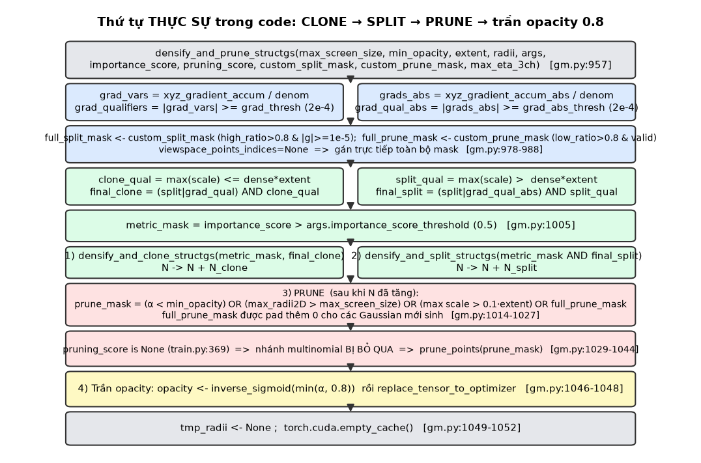
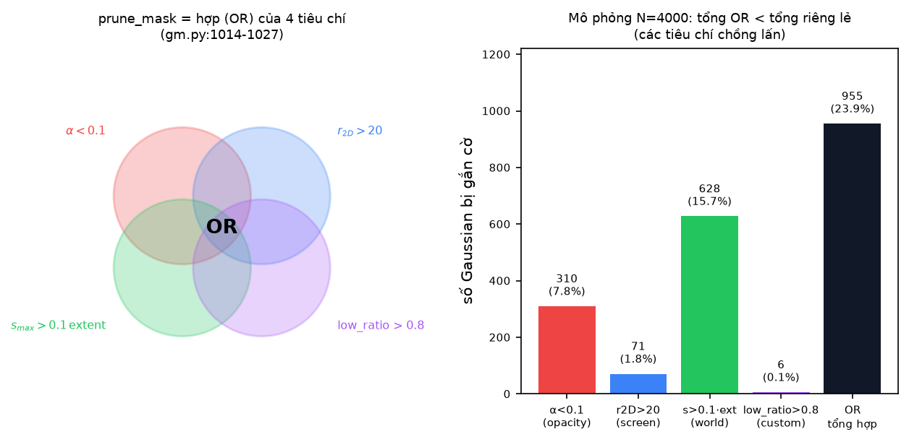
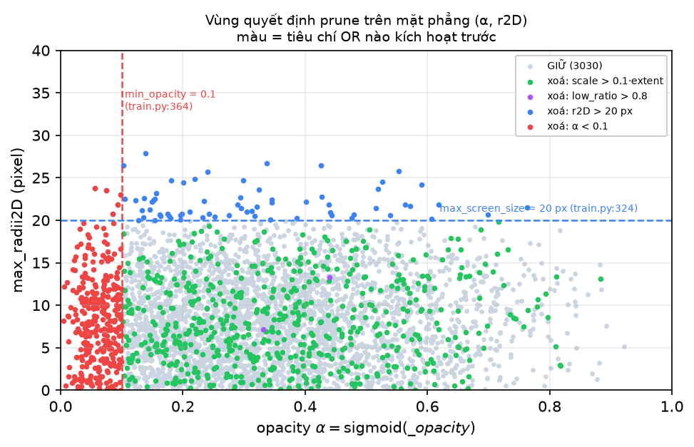
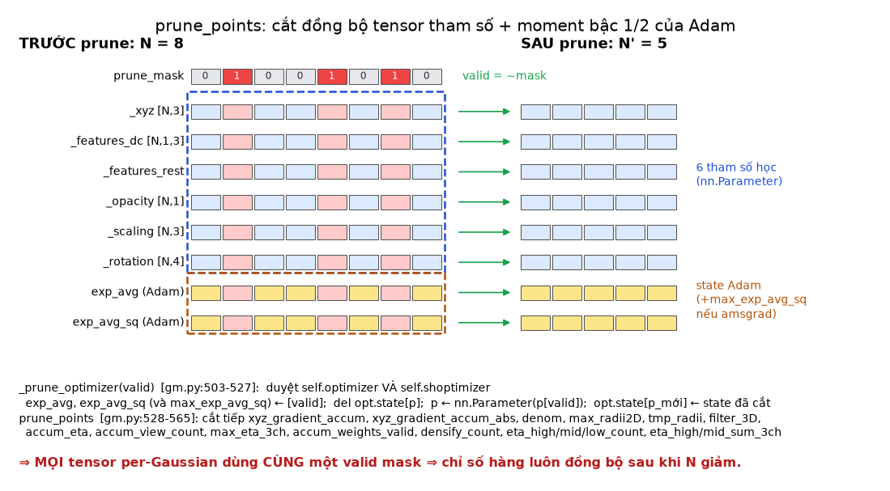
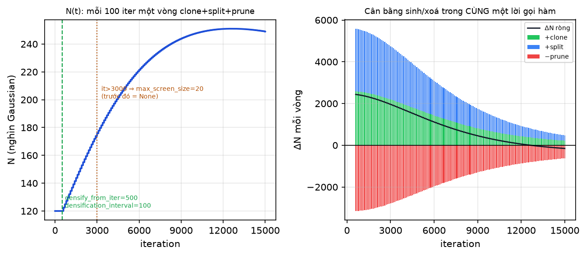
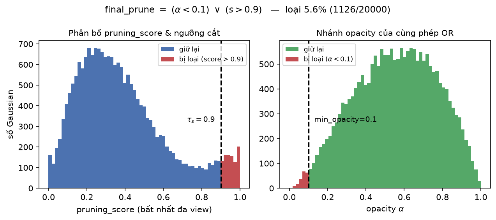
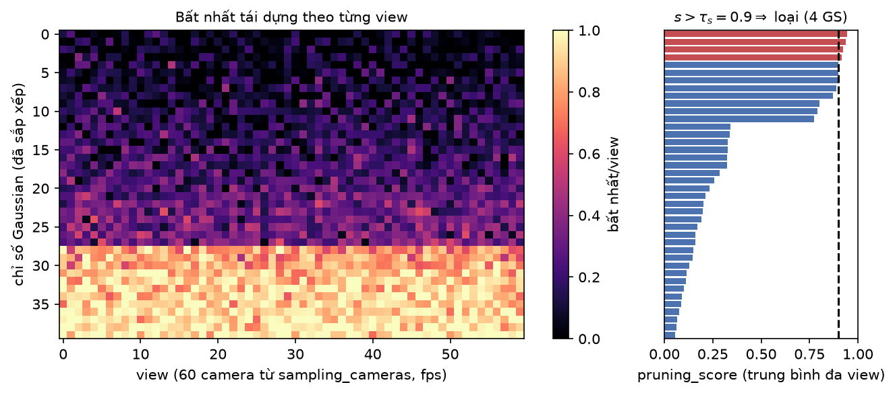
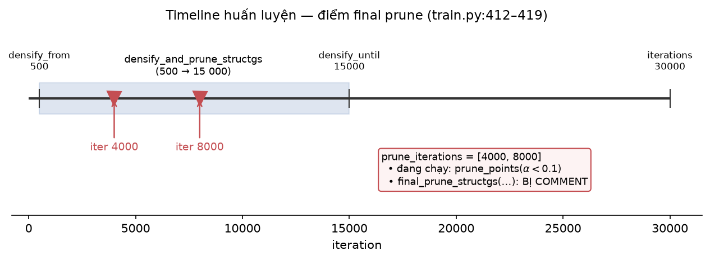
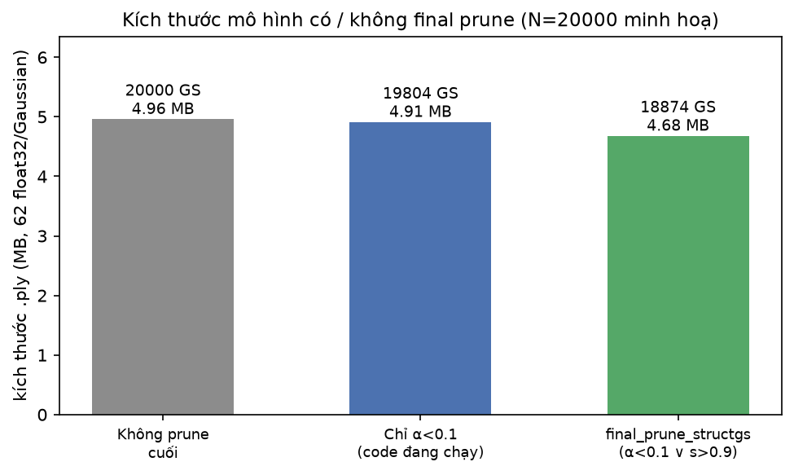
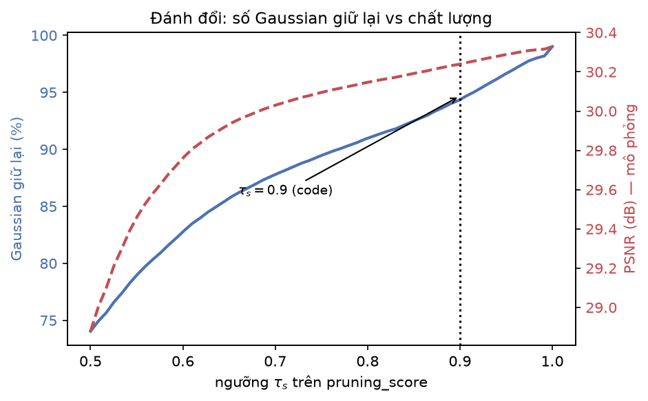

[← Mục lục chương 18](00-muc-luc.md) · Chương 18.6

# Chương 18.6 — `densify_and_prune_structgs` và `final_prune_structgs`: vòng sinh–xoá hợp nhất và tầng tỉa cuối

> Nguồn:
> - `SADGS/scene/gaussian_model.py:957-1052` — `densify_and_prune_structgs`, hàm điều phối duy nhất của nhánh mật độ hoá chính.
> - `SADGS/scene/gaussian_model.py:1059-1066` — `final_prune_structgs`, tầng tỉa cuối (**lời gọi đang bị comment**, xem 18.6.8).
> - `SADGS/scene/gaussian_model.py:503-527` (`_prune_optimizer`), `:528-565` (`prune_points`), `:595-637` (`densification_postfix`), `:934-955` (`densify_and_clone_structgs`), `:1054-1057` (`add_densification_stats`), `:485` (`replace_tensor_to_optimizer`).
> - `SADGS/train.py:316-403` — khối densify thật trong vòng lặp huấn luyện; `:362-374` lời gọi `densify_and_prune_structgs`; `:412-419` khối `prune_iterations`; `:529` giá trị mặc định `[4000, 8000]`.
> - `SADGS/arguments/__init__.py:75-149` — toàn bộ hyperparameter liên quan.
> - `SADGS/utils/freq_utils.py:12` — `sampling_cameras(..., mode="fps", num_cams=60)`.

| Mục | Nội dung |
|---|---|
| 18.6.0 | Vì sao gộp densify và prune vào một hàm |
| 18.6.1 | Tham số thật được truyền vào — bảng đối chiếu `train.py:362-374` |
| 18.6.2 | Hai chỉ báo gradient và hai mặt nạ sinh loại trừ nhau |
| 18.6.3 | `metric_mask` — "importance score" thật ra là bộ đếm view |
| 18.6.4 | Mặt nạ xoá: hợp OR của bốn tiêu chí, và chuyện padding |
| 18.6.5 | Nhánh `multinomial` — có code, không chạy, và còn một lỗi thiết bị |
| 18.6.6 | `prune_points`: cắt đồng bộ tham số và moment Adam |
| 18.6.7 | Quỹ đạo $N(t)$ — vì sao số Gaussian bão hoà thay vì bùng nổ |
| 18.6.8 | `final_prune_structgs` — công thức, ngưỡng, và trạng thái bị tắt |
| 18.6.9 | Hệ quả của việc tắt tầng tỉa cuối |
| 18.6.10 | Tóm tắt |

---

## 18.6.0 Vì sao gộp densify và prune vào một hàm

Trong `SADGS/train.py:316`, toàn bộ việc thay đổi số lượng Gaussian nằm gọn trong khối `if iteration < opt.densify_until_iter:`. Nhánh chính được kích hoạt bởi điều kiện ở `train.py:322`:

```
is_normal_densification = iteration > opt.densify_from_iter and iteration % opt.densification_interval == 0
```

với `densify_from_iter = 500` (`arguments/__init__.py:91`), `densification_interval = 100` (`:87`), `densify_until_iter = 15_000` (`:92`). Nghĩa là: **145 lần gọi** trong suốt quá trình train 30 000 iteration, mỗi lần đúng một lời gọi `densify_and_prune_structgs` (`train.py:362`).

Điểm thiết kế đáng chú ý: 3DGS gốc cũng gộp clone/split/prune vào một hàm, nhưng SADGS đẩy thêm **ba tín hiệu ngoài** vào cùng lời gọi đó — `custom_split_mask`, `custom_prune_mask` và `max_eta_3ch` — tất cả đều được tính **trước** lời gọi, ngay trong `train.py:336-353`, từ các bộ đếm nhất quán đa view. Hệ quả là một Gaussian chỉ bị "phán xử" đúng một lần mỗi 100 iteration, và mọi tensor per-Gaussian chỉ phải đồng bộ lại chiều dài **một lần duy nhất**.



*Hình 18.6.1 — Luồng thật của `densify_and_prune_structgs` (`gaussian_model.py:957-1052`), đọc từ trên xuống: tính hai chỉ báo gradient → gán `full_split_mask`/`full_prune_mask` từ mask ngoài → phân vùng clone/split theo kích thước → `metric_mask` → CLONE → SPLIT → PRUNE → áp trần opacity $0.8$ → giải phóng cache. Điểm mấu chốt mà sơ đồ nhấn mạnh: **prune chạy SAU khi $N$ đã tăng**, nên Gaussian con vừa sinh cũng nằm trong tầm ngắm của các ngưỡng opacity/bán kính/scale.*

Thứ tự này có ý nghĩa toán học rõ ràng. Gọi $N_{old}$ là số Gaussian đầu vòng, $N_{new}$ là số sau clone+split. Mọi mặt nạ prune ở `:1014-1018` được tính trên tensor **đã dài $N_{new}$**:

$$
\texttt{prune\_mask} \in \{0,1\}^{N_{new}}, \qquad N_{new} = N_{old} + N_{clone} + N_{split}
$$

Còn `full_prune_mask` đến từ ngoài chỉ dài $N_{old}$ — đó chính là lý do phải có bước padding ở `:1021-1025` (mục 18.6.4).

---

## 18.6.1 Tham số thật được truyền vào

Chữ ký hàm (`gaussian_model.py:957-962`) có 10 tham số. Đối chiếu với lời gọi thật ở `train.py:362-374`:

| Tham số | Giá trị thật tại lời gọi | Dòng |
|---|---|---|
| `max_screen_size` | `20 if iteration > opt.opacity_reset_interval else None` (tức `None` cho tới iter 3000) | `train.py:324, 363` |
| `min_opacity` | **`0.1`** — comment ngay cạnh ghi `# 0.005 is a good default` | `train.py:364` |
| `extent` | `scene.cameras_extent` | `train.py:365` |
| `radii` | bán kính 2D rasterizer trả về của iteration hiện tại | `train.py:366` |
| `args` | `opt` (chứa `grad_thresh`, `grad_abs_thresh`, `dense`, `importance_score_threshold`, `ks_scale_power`) | `train.py:367` |
| `importance_score` | `gaussians.accum_view_count` | `train.py:368` |
| `pruning_score` | **`None`** ⇒ nhánh multinomial không chạy | `train.py:369` |
| `custom_split_mask` | `(high_ratio > opt.split_ratio_threshold) & is_grad_high` | `train.py:345, 370` |
| `custom_prune_mask` | `(low_ratio > opt.prune_ratio_threshold) & valid_mask` | `train.py:353, 371` |
| `viewspace_points_indices` | `None` ⇒ mask gán trực tiếp, không scatter | `train.py:372` |
| `max_eta_3ch` | `gaussians.max_eta_3ch` (qua biến `max_high_eta`, `train.py:350`) | `train.py:373` |

Hai giá trị cần ghi nhớ vì chúng khác hẳn mặc định 3DGS: `min_opacity = 0.1` (gấp **20 lần** mức 0.005 mà chính comment trong code thừa nhận là "good default"), và `pruning_score = None`.

Điều kiện `split_mask` ở `train.py:345` dùng `is_grad_high = torch.norm(grads, dim=-1) >= 1e-5` (`train.py:333`) — một ngưỡng **thấp hơn 20 lần** so với `grad_thresh = 2\times10^{-4}` dùng bên trong hàm. Comment trong code nói thẳng mục đích: `[CRITICAL] We MUST use this to prevent 7M points` (`train.py:330-332`). Tức đây là cái van an toàn chống bùng nổ số Gaussian do tín hiệu $\eta$ gây ra.

---

## 18.6.2 Hai chỉ báo gradient và hai mặt nạ sinh loại trừ nhau

`gaussian_model.py:964-972` tính hai gradient trung bình trên cửa sổ 100 iteration vừa qua:

$$
\bar g \;=\; \frac{\texttt{xyz\_gradient\_accum}}{\texttt{denom}},
\qquad
\bar g_{abs} \;=\; \frac{\texttt{xyz\_gradient\_accum\_abs}}{\texttt{denom}}
$$

Hai tử số được nạp bởi `add_densification_stats` (`:1054-1057`): $\bar g$ lấy chuẩn của **2 kênh đầu** `viewspace_point_tensor.grad[:, :2]`, còn $\bar g_{abs}$ lấy **2 kênh sau** `grad[:, 2:]` — rasterizer của SADGS trả về tensor viewspace 4 kênh, hai kênh sau là gradient tích luỹ theo giá trị tuyệt đối (không bị triệt tiêu khi nhiều view kéo ngược chiều nhau). Cả hai đều được `nan_to_zero` ngay sau phép chia (`:965`, `:969`) vì `denom` có thể bằng 0 với Gaussian chưa từng được view nào nhìn thấy.

Hai chỉ báo nhị phân hoá tại `:971-972`:

$$
Q_i = \big[\;\|\bar g_i\| \ge \texttt{args.grad\_thresh}\;\big],
\qquad
Q^{abs}_i = \big[\;\|\bar g^{abs}_i\| \ge \texttt{args.grad\_abs\_thresh}\;\big]
$$

với `grad_thresh = 0.0002` (`arguments/__init__.py:112`) và `grad_abs_thresh = 0.0002` (`:109`). Lưu ý một cái bẫy đọc code: hàm này dùng `grad_abs_thresh` (`:109`, $=2\times10^{-4}$) chứ **không** phải `densify_grad_abs_threshold` (`:94`, $=4\times10^{-4}$) — tham số thứ hai chỉ xuất hiện ở nhánh warm-up `train.py:390`.

Phân vùng theo kích thước (`:990-991`), với `args.dense = 0.001` (`arguments/__init__.py:113`) và $s_{\max} = \max_j s_{ij}$ là bán trục lớn nhất của Gaussian $i$:

$$
\texttt{clone\_qual}_i = \big[\, s_{\max,i} \le \texttt{dense}\cdot\texttt{extent} \,\big],
\qquad
\texttt{split\_qual}_i = \big[\, s_{\max,i} > \texttt{dense}\cdot\texttt{extent} \,\big]
$$

Hai vị từ này là **phân hoạch** (bù nhau tuyệt đối), nên một Gaussian không bao giờ vừa clone vừa split trong cùng một vòng. Kết hợp với tín hiệu ngoài $S = \texttt{full\_split\_mask}$ (`:993-1002`):

$$
\boxed{\;
\texttt{final\_clone}_i = (S_i \vee Q_i) \wedge \texttt{clone\_qual}_i,
\qquad
\texttt{final\_split}_i = (S_i \vee Q^{abs}_i) \wedge \texttt{split\_qual}_i
\;}
$$

Chi tiết dễ bỏ sót: **cùng một** `full_split_mask` được OR vào **cả hai** nhánh. Một Gaussian có `high_ratio > 0.8` (nhất quán "quá thô so với texture" trên phần lớn view) sẽ được nhân bản hoặc tách **ngay cả khi gradient của nó dưới ngưỡng** — đây chính là chỗ tín hiệu tần số của SADGS vượt mặt tín hiệu gradient thuần tuý của 3DGS. Ngược lại, `full_prune_mask` chỉ đi vào nhánh prune.

---

## 18.6.3 `metric_mask` — "importance score" thật ra là bộ đếm view

Dòng `:1005`:

```
metric_mask = importance_score > args.importance_score_threshold if importance_score is not None else torch.ones_like(final_clone_mask)
```

$$
\texttt{metric\_mask}_i = \big[\, \texttt{importance\_score}_i > \tau_{imp} \,\big], \qquad \tau_{imp} = 0.5
$$

với `importance_score_threshold = 0.5` (`arguments/__init__.py:124`). Nhưng đại lượng được truyền vào (`train.py:368`) là `gaussians.accum_view_count` — một **bộ đếm số view** đã quan sát Gaussian trong cửa sổ 100 iteration, nhận giá trị nguyên $0, 1, 2, \dots$. Vì vậy ngưỡng $0.5$ trên thực tế chỉ tương đương:

$$
\texttt{metric\_mask}_i \equiv \big[\,\texttt{accum\_view\_count}_i \ge 1\,\big]
$$

tức "**Gaussian này đã được ít nhất một camera nhìn thấy trong cửa sổ hiện tại**". Đây không phải một điểm số quan trọng (importance score) theo nghĩa đầy đủ; nó là một bộ lọc tính hợp lệ. Hệ quả: Gaussian nằm ngoài mọi frustum trong cả 100 iteration vừa qua **không bao giờ được clone hay split**, bất kể gradient còn sót lại từ trước. `metric_mask` được AND vào cả clone (`:1007`) lẫn split (`:1010`).

---

## 18.6.4 Mặt nạ xoá: hợp OR của bốn tiêu chí

`gaussian_model.py:1014-1027` dựng mặt nạ prune bằng bốn vị từ nối bởi phép OR:

$$
\boxed{\;
\texttt{prune\_mask}_i =
\underbrace{\big[\alpha_i < \texttt{min\_opacity}\big]}_{\text{quá mờ}}
\;\vee\;
\underbrace{\big[r_{2D,i} > \texttt{max\_screen\_size}\big]}_{\text{quá to trên màn hình}}
\;\vee\;
\underbrace{\big[s_{\max,i} > 0.1\cdot\texttt{extent}\big]}_{\text{quá to trong không gian}}
\;\vee\;
\underbrace{P'_i}_{\text{bất nhất đa view}}
\;}
$$

trong đó $\alpha_i = \texttt{sigmoid}(\texttt{\_opacity}_i)$, $r_{2D,i} = \texttt{max\_radii2D}_i$ (bán kính màn hình lớn nhất từng ghi nhận), và $P = \texttt{full\_prune\_mask}$ đến từ `custom_prune_mask`:

$$
P_i = \big[\,\texttt{low\_ratio}_i > \texttt{prune\_ratio\_threshold}\,\big] \wedge \big[\,\texttt{accum\_view\_count}_i > 0\,\big],
\qquad
\texttt{low\_ratio}_i = \frac{\texttt{eta\_low\_count}_i}{\texttt{accum\_view\_count}_i}
$$

với `prune_ratio_threshold = 0.8` (`arguments/__init__.py:149`), công thức tỉ lệ ở `train.py:342` và mask ở `train.py:353`.



*Hình 18.6.2 — Trái: bốn tiêu chí là bốn tập con chồng lấn của tập Gaussian, `prune_mask` là **hợp** của chúng. Phải: mô phỏng $N = 4000$ với các ngưỡng thật ($\alpha < 0.1$, $r_{2D} > 20$, $s_{\max} > 0.1\cdot\texttt{extent}$ với $\texttt{extent}=4$, `low_ratio` $> 0.8$) — cột đen "OR tổng hợp" luôn **nhỏ hơn tổng bốn cột riêng lẻ**, đúng nguyên lý bao hàm–loại trừ: $|A\cup B| = |A| + |B| - |A\cap B|$. Kết luận: thêm tiêu chí thứ tư (multi-view) không làm số Gaussian bị xoá tăng tuyến tính, vì phần lớn Gaussian bất nhất đa view cũng đã có opacity thấp.*

Hai chi tiết cài đặt quan trọng:

**(a) Điều kiện `if max_screen_size:` ở `:1015` là kiểm tra truthy, không phải `is not None`.** Trước iteration 3000, `train.py:324` truyền `None` ⇒ **cả hai** tiêu chí kích thước (`big_points_vs` lẫn `big_points_ws`) bị bỏ qua. Nghĩa là trong 2500 iteration đầu của giai đoạn densify, tiêu chí "quá to trong không gian" hoàn toàn không tồn tại — cố ý, để hình học thô ban đầu có thời gian co lại. Ngưỡng 3000 chính là `opacity_reset_interval` (`arguments/__init__.py:89`). Ngoài ra, nếu ai đó truyền `max_screen_size = 0` thì cũng bị coi là tắt — một cái bẫy nhỏ của kiểm tra truthy.

**(b) Padding `full_prune_mask` (`:1021-1025`).** Sau clone+split, `prune_mask` dài $N_{new}$ còn $P$ vẫn dài $N_{old}$:

$$
P' = \big[\; P \;;\; \mathbf{0}_{N_{new} - N_{old}} \;\big],
\qquad
\texttt{prune\_mask} \leftarrow \texttt{prune\_mask} \vee P'
$$

Các giá trị 0 được nối thêm nghĩa là **Gaussian vừa sinh ra miễn nhiễm với tiêu chí multi-view ở chính vòng này** — hợp lý, vì chúng chưa được camera nào quan sát nên `low_ratio` chưa có nghĩa. Nhưng chúng **vẫn** chịu ba tiêu chí còn lại, vì ba tiêu chí đó được tính lại trên tensor đã mở rộng.



*Hình 18.6.3 — Mô phỏng $N=4000$ Gaussian trên mặt phẳng $(\alpha, r_{2D})$, $\alpha \in [0,1]$, $r_{2D} \in [0, 40]$ px. Hai đường đứt là hai siêu phẳng quyết định: dọc tại $\alpha = 0.1$ (`min_opacity`, `train.py:364`) và ngang tại $r_{2D} = 20$ px (`max_screen_size`, `train.py:324`). Màu thể hiện tiêu chí OR nào kích hoạt trước; hai màu xanh lá và tím là các điểm bị xoá bởi tiêu chí **không nhìn thấy được** trên trục này ($s_{\max}$ và `low_ratio`) — minh hoạ rằng mặt nạ prune sống trong không gian bốn chiều, mặt phẳng $(\alpha, r_{2D})$ chỉ là hình chiếu.*

Kết hợp với bước áp trần ở cuối hàm (`:1046`):

$$
\texttt{\_opacity} \leftarrow \sigma^{-1}\!\big(\min(\alpha,\, 0.8)\big)
$$

ta thấy opacity bị ép vào dải hữu ích $[0.1,\ 0.8]$: dưới $0.1$ bị **xoá**, trên $0.8$ bị **cắt**. Phép cắt này ghi đè qua `replace_tensor_to_optimizer` (`:1047`, định nghĩa tại `:485`), hàm này reset state Adam của **riêng nhóm `opacity`** về 0 — tức mỗi 100 iteration, động lượng của opacity bị xoá sạch trong khi động lượng của xyz/scale/rotation/SH vẫn giữ nguyên.

---

## 18.6.5 Nhánh `multinomial` — có code, không chạy, và còn một lỗi thiết bị

`gaussian_model.py:1029-1044` chứa một cơ chế **ngân sách xoá** hoàn chỉnh nhưng **không bao giờ được thực thi** trong cấu hình hiện tại, vì `train.py:369` truyền `pruning_score=None`:

$$
w_i = \frac{1}{10^{-6} + (1 - \texttt{pruning\_score}_i)},
\qquad
B = \Big\lfloor 0.5 \sum_i \texttt{prune\_mask}_i \Big\rfloor,
\qquad
\texttt{final\_prune} = \texttt{prune\_mask} \wedge \texttt{sampled}(w, B)
$$

Ý tưởng: thay vì xoá hết ứng viên, chỉ xoá **một nửa**, chọn bằng `torch.multinomial(w, B, replacement=False)` (`:1039`) với trọng số nghịch đảo của $1 - s$. Đây là một cái phanh — tránh việc một vòng prune cắt quá sâu và phá vỡ hình học vừa dựng.

Hai phát hiện khi đọc kỹ nhánh này:

1. **Nó đang tắt.** `pruning_score=None` ⇒ điều khiển rơi vào `else: self.prune_points(prune_mask)` (`:1043-1044`), tức **xoá cứng 100 %** ứng viên. Toàn bộ logic "phanh" chỉ là code chết.
2. **Ngay cả khi bật, nó nhiều khả năng sẽ lỗi.** Dòng `:1036` tạo `padded_importance = torch.zeros((n_init_points), dtype=torch.float32)` **không có `device="cuda"`** ⇒ tensor nằm trên CPU; dòng `:1037` gán vào nó một biểu thức tính từ `scores` (tensor CUDA). Phép gán chéo thiết bị này sẽ ném `RuntimeError`. Dòng `:1038` ngay sau lại dùng `torch.zeros_like(padded_importance, dtype=bool, device="cuda")` — cho thấy tác giả có ý định để mọi thứ trên GPU nhưng sót một chỗ. Muốn khôi phục nhánh này thì phải sửa `:1036` trước.

---

## 18.6.6 `prune_points`: cắt đồng bộ tham số và moment Adam

Khi `prune_points(mask)` được gọi (`:528`), điều đầu tiên là đảo mặt nạ: `valid_points_mask = ~mask` (`:529`). Mọi thứ sau đó dùng **chung một** `valid`.



*Hình 18.6.4 — Mô phỏng $N = 8$ với `prune_mask` có 3 bit bật: sáu tensor tham số (`_xyz`, `_features_dc`, `_features_rest`, `_opacity`, `_scaling`, `_rotation`) **và** hai tensor state Adam (`exp_avg`, `exp_avg_sq`) đều bị lập chỉ mục bởi cùng một `valid = ¬mask`, cho ra $N' = 5$. Khung xanh bao 6 tham số học, khung cam bao state Adam. Kết luận ghi ở chân hình chính là bất biến của cả cơ chế: **mọi tensor có chiều đầu bằng $N$ phải dùng cùng một mặt nạ**, nếu không chỉ số hàng sẽ lệch ngay ở bước Adam kế tiếp.*

`_prune_optimizer` (`:503-527`) là nơi thực hiện phần khó. Ba điểm đáng chú ý:

- **Nó duyệt hai optimizer.** `optimizers = [self.optimizer]; if self.shoptimizer: optimizers.append(self.shoptimizer)` (`:505-506`). SADGS mặc định `optimizer_type = "hybrid"` (`arguments/__init__.py:128`), tức hệ số SH được tối ưu bởi một optimizer riêng. Bỏ sót `shoptimizer` sẽ khiến state SH lệch chiều.
- **`del opt.state[p]` là bắt buộc.** Khoá của `opt.state` chính là **đối tượng tensor tham số**. Sau khi tạo `nn.Parameter(p[valid])` mới, state cũ (dài $N$) vẫn treo dưới khoá cũ; không xoá thì bộ nhớ rò rỉ và state mới không được gắn đúng.
- **`max_exp_avg_sq` được xử lý có điều kiện** (nhánh amsgrad), tương tự phía `cat_tensors_to_optimizer` (`:576-579`).

Sau đó `prune_points` (`:537-565`) cắt tiếp toàn bộ bộ đếm per-Gaussian: `xyz_gradient_accum`, `xyz_gradient_accum_abs`, `denom`, `max_radii2D`, `tmp_radii`, `filter_3D`, `accum_eta`, `accum_view_count`, `max_eta_3ch`, `accum_weights_valid`, `densify_count`, `eta_high_count`, `eta_high_sum_3ch`, `eta_mid_count`, `eta_mid_sum_3ch`, `eta_low_count`. Mỗi nhóm đều có kiểm tra `.numel() > 0` để hàm vẫn chạy được khi các bộ đếm $\eta$ chưa khởi tạo.

Chiều ngược lại — `densification_postfix` (`:595-637`) — **không** nối tiếp giá trị cũ mà **khởi tạo lại từ 0** ba tensor thống kê: `xyz_gradient_accum`, `xyz_gradient_accum_abs`, `denom`, `max_radii2D` đều được gán `torch.zeros((N_new, ...))` (`:616-619`). Nghĩa là **mỗi lần densify, toàn bộ lịch sử gradient của mọi Gaussian bị xoá sạch**, không chỉ của Gaussian mới. Đây là hành vi kế thừa từ 3DGS gốc và giải thích vì sao cửa sổ quan sát luôn đúng bằng `densification_interval = 100` iteration.

---

## 18.6.7 Quỹ đạo $N(t)$



*Hình 18.6.5 — Trái: $N(t)$ mô phỏng trên dải iteration $0 \to 15\,000$ (khởi điểm $120$k Gaussian), vạch xanh tại `densify_from_iter = 500`, vạch cam tại iter $3000$ nơi `max_screen_size` chuyển từ `None` sang $20$. Phải: phân tích cùng một quỹ đạo thành ba thành phần mỗi vòng — $+N_{clone}$ (xanh lá), $+N_{split}$ (xanh dương), $-N_{prune}$ (đỏ) — cùng đường $\Delta N$ ròng (đen). Cột split cao hơn clone vì một lần split sinh $k^3 - 1$ con thay vì đúng 1 bản sao.*

Phương trình sai phân mà hình minh hoạ:

$$
N(t + 100) = N(t) + N_{clone}(t) + N_{split}(t) - N_{prune}(t)
$$

Điều quan trọng không phải con số mô phỏng mà là **dấu của $\Delta N$ theo thời gian**. Vì prune chạy **ngay sau** split trong cùng lời gọi, các Gaussian con quá mờ (opacity kế thừa từ cha đã thấp) hoặc quá to bị loại lập tức trong chính vòng sinh ra chúng. Đó là cơ chế tự hãm: $\Delta N$ giảm dần về 0 và $N$ bão hoà, thay vì tăng theo cấp số nhân như khi densify và prune được tách rời nhiều chục iteration.

Sau khi hàm trả về, `train.py:377-386` **reset toàn bộ** bộ tích luỹ $\eta$ về 0: `accum_eta`, `accum_view_count`, `max_eta_3ch`, `accum_weights_valid`, `eta_high_count`, `eta_high_sum_3ch`, `eta_mid_count`, `eta_mid_sum_3ch`, `eta_low_count`. Mỗi chu kỳ 100 iteration vì thế là một **cửa sổ quan sát độc lập** — không có trí nhớ dài hạn nào về nhất quán đa view được giữ qua các vòng.

Cuối cùng, cần phân biệt rõ với nhánh **warm-up** (`train.py:388-390`): khi `opt.warmup_densification = True` (mặc định `False`, `arguments/__init__.py:130`), các iteration chia hết cho 100 mà **không** trùng nhánh chính sẽ gọi `gaussians.densify_and_prune(...)` — hàm 3DGS **gốc**, với `min_opacity = 0.005`. Hai nhánh dùng hai ngưỡng opacity chênh nhau 20 lần.

---

## 18.6.8 `final_prune_structgs` — công thức, ngưỡng, và trạng thái bị tắt

Toàn bộ hàm (`gaussian_model.py:1059-1066`) chỉ có bốn dòng thân:

```
def final_prune_structgs(self, min_opacity, pruning_score = None):   # :1059
    prune_mask  = (self.get_opacity < min_opacity).squeeze()         # :1063
    scores_mask = pruning_score > 0.9                                # :1064
    final_prune = torch.logical_or(prune_mask, scores_mask)          # :1065
    self.prune_points(final_prune)                                   # :1066
```

$$
\boxed{\;
\texttt{final\_prune}_i \;=\;
\underbrace{\big[\alpha_i < \tau_\alpha\big]}_{\text{opacity yếu}}
\;\vee\;
\underbrace{\big[s_i > \tau_s\big]}_{\text{bất nhất đa view}},
\qquad \tau_\alpha = \texttt{min\_opacity}, \quad \tau_s = 0.9
\;}
$$

với $s_i = \texttt{pruning\_score}_i$ là **độ bất nhất** tái dựng qua nhiều view (giá trị lớn = xấu, theo đúng chiều so sánh `>` ở `:1064`).

Ba điều cần nói rõ về hai ngưỡng:

- $\tau_s = 0.9$ được **hard-code ngay trong thân hàm** (`:1064`). Không có tham số dòng lệnh nào chỉnh được — khác hẳn `prune_ratio_threshold = 0.8` vốn khai báo đàng hoàng ở `arguments/__init__.py:149`.
- $\tau_\alpha$ do lời gọi quyết định; lời gọi duy nhất trong repo (`train.py:419`, đang bị comment) dùng `min_opacity = 0.1`.
- Chữ ký khai báo `pruning_score = None` (`:1059`) nhưng thân hàm **không kiểm tra None**. Dòng `:1064` sẽ thực hiện `None > 0.9` ⇒ `TypeError`. Giá trị mặc định là một cái bẫy: hàm bắt buộc phải nhận tensor thật.



*Hình 18.6.6 — Hai nhánh của phép OR trên mô phỏng $N = 20\,000$. Trái: phân bố `pruning_score` (hỗn hợp 90 % $\text{Beta}(2.2, 4.5)$ "nhất quán" + 10 % $\text{Beta}(9.0, 1.3)$ "bất nhất"), vạch đứt tại $\tau_s = 0.9$ — ngưỡng này chỉ bắt **đuôi phải**, tức thiết kế bảo thủ: chỉ Gaussian bất nhất ở gần như mọi view mới bị loại. Phải: phân bố opacity $\text{Beta}(2.5, 2.0)$ với vạch đứt tại $\tau_\alpha = 0.1$. Tiêu đề hình ghi tỉ lệ loại tổng hợp của phép OR — luôn $\ge$ từng nhánh riêng, nhưng $\le$ tổng hai nhánh.*



*Hình 18.6.7 — Ý nghĩa của $s_i$: trái là ma trận bất nhất $40$ Gaussian $\times$ $60$ view (đúng `num_cams=60` của `sampling_cameras`, `utils/freq_utils.py:12`), phải là $s_i = \frac{1}{V}\sum_{v} \text{bất nhất}(i, v)$ — tức điểm số gộp theo hàng. Chỉ những hàng có $s_i > \tau_s = 0.9$ (tô đỏ) mới bị cắt. Hình cho thấy vì sao ngưỡng phải cao: một Gaussian sai ở vài view nhưng đúng ở phần lớn view vẫn có trung bình thấp và được giữ lại; chỉ Gaussian sai ở **gần như mọi** view mới vượt $0.9$.*

**Trạng thái thực tế: lời gọi đang bị comment.** Nguyên văn `train.py:412-419`:

```
if iteration in prune_iterations:                                          # :412
    my_viewpoint_stack = scene.getTrainCameras().copy()                    # :413
    camlist = sampling_cameras(my_viewpoint_stack)                         # :414
    prune_mask = (gaussians.get_opacity < 0.1).squeeze()                   # :416
    gaussians.prune_points(prune_mask)                                     # :417
    # _, pruning_score, _, _, _,_ = compute_gaussian_score_structgs(...)   # :418
    # gaussians.final_prune_structgs(min_opacity = 0.1, pruning_score=...) # :419
```

với `prune_iterations` mặc định `[4000, 8000]` (`train.py:529`), truyền vào `training(...)` như tham số cuối (`train.py:38`, `:555`).



*Hình 18.6.8 — Dòng thời gian 30 000 iteration: dải xanh là vùng mật độ hoá $500 \to 15\,000$ (`densify_from_iter`/`densify_until_iter`, `arguments/__init__.py:91-92`), hai mũi tên đỏ tại iter 4000 và 8000 là `prune_iterations` (`train.py:529`). Hộp chú thích ghi đúng trạng thái code: tại hai mốc đó cái **đang chạy** chỉ là `prune_points(α < 0.1)`, còn `final_prune_structgs(...)` **bị comment**.*

Bốn quan sát rút ra từ đoạn code trên:

1. Cái đang chạy tại iter 4000 và 8000 chỉ là nhánh opacity thuần: $\texttt{prune}_i = [\alpha_i < 0.1]$. Toàn bộ vế $[s_i > 0.9]$ biến mất.
2. `camlist` ở `:414` **vẫn được tính nhưng không ai dùng** — dấu vết rõ ràng rằng nhánh multi-view đã bị *tắt đi*, chứ không phải chưa từng tồn tại.
3. `grep -rn "compute_gaussian_score_structgs"` trên toàn repo trả về **đúng một kết quả**: chính dòng comment `:418`. Hàm **không được định nghĩa và không được import** ở bất kỳ đâu. Bỏ comment ngay lập tức sẽ lỗi `NameError`, chưa kịp tới `TypeError` ở `:1064`.
4. Đây không phải trường hợp cá biệt: nhánh `pruning_score` **trong vòng densify** cũng chết vì `train.py:369` truyền `None`. Nghĩa là **cả hai** đường sử dụng `pruning_score` trong repo đều đang vô hiệu. Tín hiệu nhất quán đa view duy nhất còn sống là `low_ratio` đi qua `custom_prune_mask`.

**Đối chiếu hai tầng tỉa:**

| | Prune trong vòng densify (`:1014-1044`) | Prune cuối (`:1059-1066`) |
|---|---|---|
| Tần suất | mỗi 100 iter, trong dải 500–15 000 | chỉ tại `prune_iterations = [4000, 8000]` |
| Điều kiện | OR của **4** vị từ ($\alpha$, $r_{2D}$, $s_{\max}$, `low_ratio`) | OR của **2** vị từ ($\alpha$, $s$) |
| Nguồn tín hiệu đa view | `low_ratio` từ bộ đếm $\eta$, reset mỗi vòng | `pruning_score` tính một lần trên 60 view FPS |
| Có ngân sách? | có nhánh `remove_budget = int(0.5*to_remove)` + `multinomial` — **đang tắt** | không: tất định, cắt hết |
| Hậu xử lý | ép $\alpha \leftarrow \min(\alpha, 0.8)$ (`:1046-1048`) | không có, chỉ `prune_points` |
| Trạng thái | **đang chạy** (nhánh `else`, xoá 100 % ứng viên) | **bị comment** (`train.py:419`) |

---

## 18.6.9 Hệ quả của việc tắt tầng tỉa cuối



*Hình 18.6.9 — Ba kịch bản trên cùng mô phỏng $N = 20\,000$, quy đổi ra dung lượng `.ply` với $62$ float32/Gaussian $\approx 248$ byte (xyz 3 + normal 3 + SH bậc 0: 3 + SH bậc cao: 45 + opacity 1 + scale 3 + quaternion 4). Cột xám: không tỉa cuối. Cột xanh: chỉ $[\alpha < 0.1]$ — **đúng cái code đang chạy**. Cột lục: đủ $[\alpha<0.1] \vee [s>0.9]$. Khoảng cách giữa cột xanh và cột lục chính là phần floater lọt lưới.*

Lý do khoảng cách đó tồn tại nằm ở bản chất của **floater**: Gaussian có opacity **cao** (nên vượt $\tau_\alpha = 0.1$ một cách thoải mái) nhưng chỉ đúng ở một vài góc nhìn. Không vị từ nào trong bốn vị từ của vòng densify bắt được nó một cách đáng tin cậy — `low_ratio` chỉ đo bất nhất về **tần số** $\eta$, không đo bất nhất về **màu tái dựng**. Vế $[s_i > 0.9]$ sinh ra chính là để khử loại lỗi này.

Tác hại kép: (i) phình dung lượng `.ply` và giảm FPS render; (ii) tạo vệt sương/đốm khi camera rời khỏi quỹ đạo train. Điểm nguy hiểm là **loại (ii) không hiện trên PSNR tập train** — nó chỉ lộ ở view mới, đúng kịch bản sử dụng của một mô hình digital twin cần xem tự do quanh vật thể.



*Hình 18.6.10 — Quét $\tau_s$ trên dải $[0.5,\ 1.0]$ trong công thức $[\alpha_i<0.1]\vee[s_i>\tau_s]$. Trục trái (xanh): tỉ lệ Gaussian giữ lại, tính đúng từ phân bố mô phỏng. Trục phải (đỏ, đứt): đường PSNR dạng bão hoà — **là mô phỏng để minh hoạ hình dạng đánh đổi, không phải số đo từ repo** (repo không chứa log benchmark cho nhánh này). Vạch chấm là $\tau_s = 0.9$ hard-code ở `:1064`. Đọc hình: $\tau_s \to 1$ tương đương trạng thái hiện tại (gần như không tỉa theo đa view); $\tau_s = 0.9$ cắt gọn đuôi mà gần như không đụng thân phân bố; $\tau_s < 0.7$ bắt đầu ăn vào vùng Gaussian hợp lệ, tỉ lệ giữ lại rơi nhanh.*

**Để khôi phục an toàn** cần ba việc, theo đúng thứ tự phụ thuộc:

1. Cài đặt `compute_gaussian_score_structgs(camlist, gaussians, pipe, bg, opt)` trả về 6 giá trị, trong đó phần tử thứ hai là $s \in [0,1]$ theo nghĩa **độ bất nhất** (lớn = xấu), khớp chiều so sánh `>` ở `:1064`.
2. Thêm bảo vệ None vào `:1064`, ví dụ `scores_mask = torch.zeros_like(prune_mask) if pruning_score is None else (pruning_score > tau_s)`.
3. Đưa hằng số $0.9$ ra `arguments/__init__.py` cạnh `prune_ratio_threshold` (`:149`) để có thể quét ngưỡng mà không sửa code.

Riêng nhánh multinomial ở `:1029-1042` thì cần thêm bước thứ tư: sửa `:1036` thành `torch.zeros((n_init_points), dtype=torch.float32, device="cuda")`, nếu không sẽ lỗi thiết bị ngay khi bật.

---

## 18.6.10 Tóm tắt

| Khía cạnh | Sự thật trong code | Trích dẫn |
|---|---|---|
| Tần suất vòng sinh–xoá | mỗi 100 iter, từ 500 đến 15 000 ⇒ 145 lần | `arguments/__init__.py:87,91,92` |
| Thứ tự thực thi | CLONE → SPLIT → PRUNE → trần opacity 0.8 | `gaussian_model.py:1007,1011,1044,1046` |
| Hai chỉ báo gradient | $\bar g$ từ `grad[:, :2]`, $\bar g_{abs}$ từ `grad[:, 2:]`, cùng ngưỡng $2\times10^{-4}$ | `:971-972`, `:1055-1056`, `arguments:109,112` |
| Mặt nạ clone/split | phân hoạch theo $s_{\max}$ vs `dense·extent`; $S$ được OR vào **cả hai** | `:990-1002`, `arguments:113` |
| `importance_score` | thực chất là `accum_view_count`; ngưỡng 0.5 ⇒ "đã thấy ≥ 1 view" | `train.py:368`, `:1005`, `arguments:124` |
| `min_opacity` thật | **0.1**, gấp 20× mức 0.005 mà chính comment gọi là "good default" | `train.py:364` |
| Tiêu chí kích thước | chỉ bật sau iter 3000 (`max_screen_size` truthy) | `train.py:324`, `:1015` |
| Padding prune mask | Gaussian mới sinh được gán 0 ⇒ miễn tiêu chí multi-view ở vòng đó | `:1021-1025` |
| Nhánh multinomial 50 % | **không chạy** (`pruning_score=None`); còn lỗi tensor CPU ở `:1036` | `train.py:369`, `:1029-1042` |
| Đường chạy thật của prune | `else: prune_points(prune_mask)` — xoá cứng 100 % ứng viên | `:1043-1044` |
| Đồng bộ tensor | một `valid = ¬mask` cho 6 tham số + `exp_avg`/`exp_avg_sq` của **cả** `optimizer` và `shoptimizer` | `:503-527`, `:528-565` |
| Thống kê sau densify | `xyz_gradient_accum`, `denom`, `max_radii2D` bị **reset về 0 toàn bộ** | `:616-619` |
| `final_prune_structgs` | $[\alpha<\tau_\alpha] \vee [s>0.9]$, $\tau_s$ hard-code, không kiểm tra None | `:1059-1066` |
| Trạng thái tầng tỉa cuối | **lời gọi bị comment**; `compute_gaussian_score_structgs` không tồn tại trong repo | `train.py:418-419` |
| Cái đang chạy thay thế | `prune_points([α < 0.1])` tại iter 4000 và 8000 | `train.py:416-417`, `:529` |

Hai câu kết luận cho cả chương:

- **Về `densify_and_prune_structgs`:** nó giữ nguyên khung ADC của 3DGS nhưng thay tiêu chí "ai được nhân bản / ai bị xoá" từ **gradient thuần tuý** sang **nhất quán tần số qua nhiều view**, siết opacity vào dải $[0.1, 0.8]$, và đảm bảo toàn vẹn chỉ số bằng một `valid` mask dùng chung cho cả tham số lẫn moment Adam. Cơ chế phanh duy nhất của nó (multinomial 50 %) thì đang tắt.
- **Về `final_prune_structgs`:** công thức tồn tại, ngắn gọn, đúng ý đồ — nhưng **không chạy**. Repo hiện chỉ giữ lại nhánh opacity ở hai mốc 4000/8000, mất hoàn toàn khả năng khử floater theo nhất quán tái dựng đa view. Đây là khoảng cách lớn nhất giữa mô tả thiết kế và hành vi thực thi trong toàn bộ phần density control của SADGS.

---

[← Mục lục chương 18](00-muc-luc.md) · Chương kế: **18.7** (xem mục lục chương 18)
