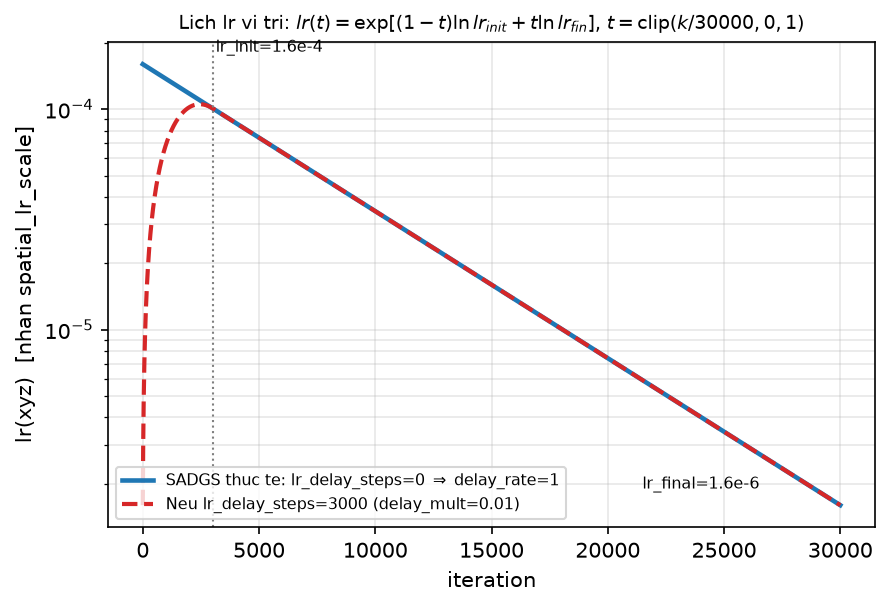
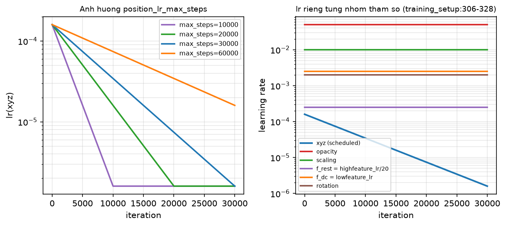
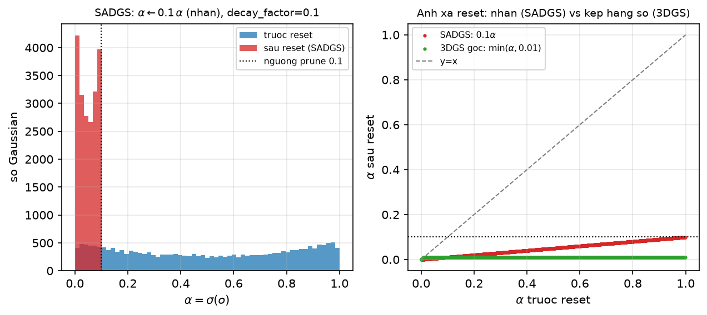
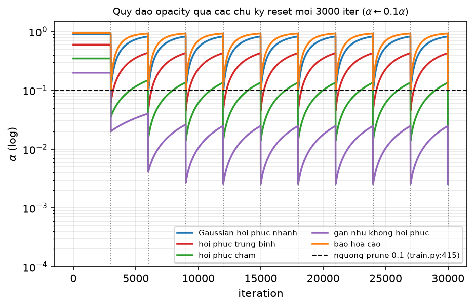
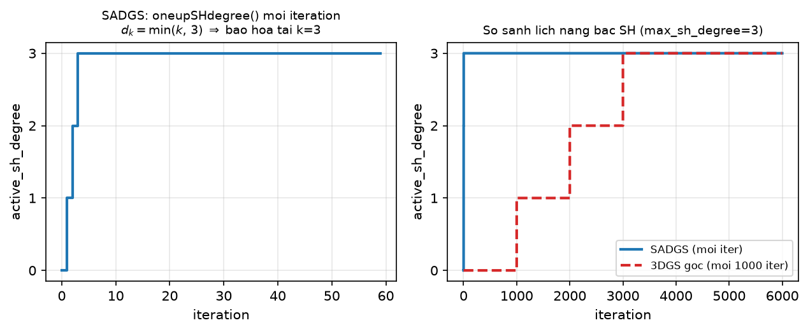
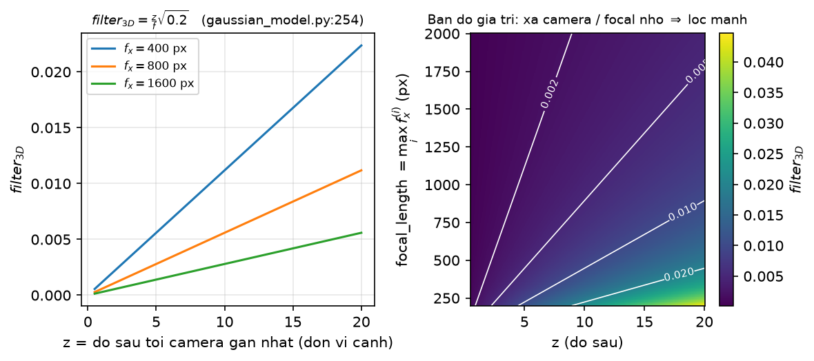
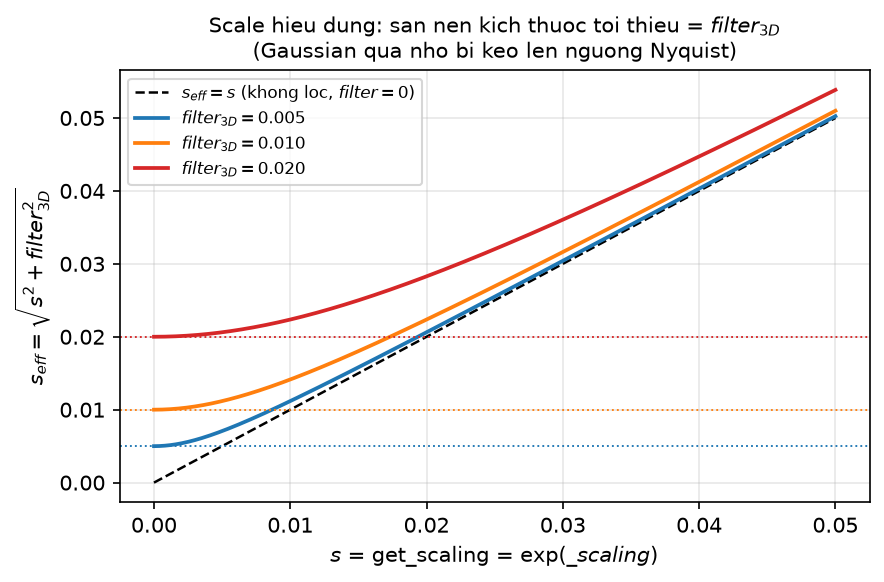
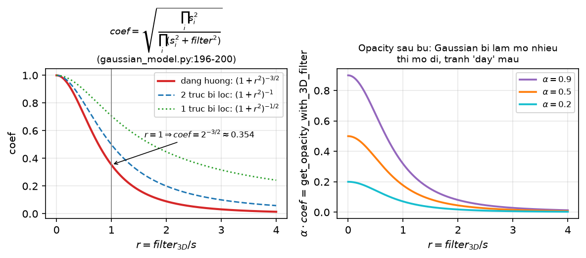
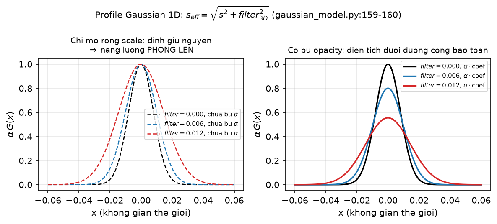

[← Mục lục chương 18](00-muc-luc.md) · Chương 18.7

# 18.7 — Optimizer, lịch learning rate, reset opacity và bộ lọc 3D chống alias

> Nguồn:
> - `SADGS/scene/gaussian_model.py:286-340` (`training_setup` — khai báo 6 nhóm tham số, chọn optimizer, dựng scheduler).
> - `SADGS/scene/gaussian_model.py:341-356` (`update_learning_rate`), `:357-378` (`optimizer_step`), `:257-259` (`oneupSHdegree`), `:415-433` (`reset_opacity`).
> - `SADGS/scene/gaussian_model.py:156-161` (`get_scaling_with_3D_filter`), `:190-201` (`get_opacity_with_3D_filter`), `:207-255` (`compute_3D_filter`), `:71` (khai báo `self.filter_3D`).
> - `SADGS/scene/gaussian_model.py:391, 405, 410, 444-446, 480` (ghi/đọc `filter_3D` trong PLY), `:547-548` (prune), `:595, 619-620` (densification_postfix), `:728, 886, 907, 944` (kế thừa khi sinh Gaussian con).
> - `SADGS/utils/general_utils.py:32-64` (`get_expon_lr_func`).
> - `SADGS/train.py:148-158` (khởi tạo `filter_3D`), `:214` (`update_learning_rate`), `:216-217` (`oneupSHdegree`), `:402-403` (`reset_opacity`), `:405-409` (cập nhật lại bộ lọc), `:412-417` (prune theo opacity), `:422-437` (bước optimizer), `:529` (`--prune_iterations`).
> - `SADGS/arguments/__init__.py:49, 76-82, 89-92, 110-111, 128, 132, 138, 154, 156` (toàn bộ hyperparameter được trích trong chương).
> - `SADGS/gaussian_renderer/__init__.py:63, 71-74` (nơi bộ lọc được tiêu thụ khi render).
> - `SADGS/submodules/diff-gaussian-rasterization_structgs/diff_gaussian_rasterization_structgs/__init__.py:249` (`SparseGaussianAdam`).

| Phần | Nội dung |
|---|---|
| 18.7.0 | Ba lịch trình điều khiển huấn luyện + một bộ lọc chống alias |
| 18.7.1 | `training_setup` — sáu nhóm tham số, hai optimizer |
| 18.7.2 | `get_expon_lr_func` — lịch lr log-tuyến tính và cái bẫy `lr_delay_steps` |
| 18.7.3 | Ảnh hưởng `max_steps`, và vì sao 5 nhóm còn lại phẳng |
| 18.7.4 | `default` / `sparse_adam` / `hybrid`, và `optimizer_step` giãn tần suất |
| 18.7.5 | `reset_opacity` — nhân suy giảm thay vì kẹp hằng số |
| 18.7.6 | Chu kỳ reset và hành vi mũ $0.1^n\alpha_0$ |
| 18.7.7 | Lịch nâng bậc SH bị vô hiệu hoá |
| 18.7.8 | Alias là gì và vì sao tiền lọc Gaussian giải quyết được |
| 18.7.9 | `compute_3D_filter` — độ sâu camera gần nhất chia tiêu cự lớn nhất |
| 18.7.10 | `get_scaling_with_3D_filter` — sàn kích thước Nyquist |
| 18.7.11 | `get_opacity_with_3D_filter` — bù năng lượng theo tỉ số định thức |
| 18.7.12 | Vòng đời `filter_3D` qua densify/prune và lịch cập nhật |
| 18.7.13 | Bộ lọc 3D là "phanh vật lý" cho densification theo $\eta$ |
| 18.7.14 | Tóm tắt |

---

## 18.7.0 Bức tranh chung

Chương này gộp hai cơ chế tưởng như không liên quan nhưng thực ra khoá vào nhau ở cùng một chỗ — **ngưỡng prune opacity $0.1$**:

1. **Phần (A) — điều khiển tối ưu hoá.** Ba lịch trình chạy song song suốt 30 000 iteration: lịch learning rate cho vị trí (`update_learning_rate`, gọi tại `train.py:214`), lịch reset opacity mỗi 3 000 bước (`train.py:402-403`), và lịch nâng bậc Spherical Harmonics (`train.py:216-217`).
2. **Phần (B) — bộ lọc 3D chống alias.** Một đại lượng vô hướng `filter_3D` cho **mỗi** Gaussian, chặn dưới kích thước của nó theo giới hạn Nyquist của lưới pixel, đồng thời làm mờ đi những Gaussian nhỏ hơn một pixel thay vì để chúng nhấp nháy.

Mối nối giữa hai phần: bộ lọc 3D kéo tụt opacity hiệu dụng của Gaussian quá nhỏ, còn phép reset opacity nhân $0.1$ đẩy chúng xuống dưới ngưỡng prune — cùng nhau chúng tạo ra cơ chế dọn dẹp các Gaussian mà lưới pixel vốn dĩ không thể tái hiện.

Optimizer nền là `torch.optim.Adam` với $\beta=(0.9,\,0.999)$ và

$$\varepsilon = 10^{-\texttt{adam\_eps\_order}} = 10^{-8}$$

(`gaussian_model.py:315-324`, `arguments/__init__.py:156`) — lớn hơn hẳn $\varepsilon=10^{-15}$ mà 3DGS gốc dùng, tức SADGS chấp nhận hãm bớt bước cập nhật ở các tham số có gradient cực nhỏ để đổi lấy ổn định số học.

---

## 18.7.1 `training_setup`: sáu nhóm tham số, hai optimizer

`gaussian_model.py:306-313` chia tham số thành **5 nhóm cho `self.optimizer`** và **1 nhóm riêng cho `self.shoptimizer`**:

| Nhóm (`name`) | Tensor | Learning rate trong code | Giá trị thật | 3DGS gốc |
|---|---|---|---|---|
| `xyz` | `_xyz` | `position_lr_init * spatial_lr_scale` | $1.6\times10^{-4}\cdot s$ (có lịch) | giống |
| `f_dc` | `_features_dc` | `lowfeature_lr` | $0.0025$ | $0.0025$ |
| `opacity` | `_opacity` | `opacity_lr` | $\mathbf{0.05}$ | $0.025$ |
| `scaling` | `_scaling` | `scaling_lr` | $\mathbf{0.01}$ | $0.005$ |
| `rotation` | `_rotation` | `rotation_lr` | $\mathbf{0.002}$ | $0.001$ |
| `f_rest` | `_features_rest` | `highfeature_lr / 20.0` | $0.005/20 = 2.5\times10^{-4}$ | `feature_lr/20` |

Mọi giá trị lấy từ `arguments/__init__.py:76-82` và `:110-111`. Chính comment trong source cũng ghi lại giá trị cũ: `self.opacity_lr = 0.05 # 0.025`, `self.scaling_lr = 0.01 # 0.005`, `self.rotation_lr = 0.002 # 0.001` — SADGS **nhân đôi** learning rate của ba nhóm điều khiển hình học và độ đục.

Hai chi tiết cài đặt đáng chú ý:

- Adam được khởi tạo với `lr=0.0` ở mức optimizer; learning rate thật nằm ở từng `param_group`, nên `update_learning_rate` chỉ cần ghi đè `param_group['lr']`.
- Hệ số chia $20.0$ cho `f_rest` là quy ước kế thừa từ 3DGS: SH bậc cao học chậm hơn thành phần DC 20 lần để tránh dao động màu theo góc nhìn.

---

## 18.7.2 `get_expon_lr_func`: nội suy log-tuyến tính

`utils/general_utils.py:32-64`. Đây là hàm nội suy **tuyến tính trong không gian logarit** giữa $lr_{\text{init}}$ và $lr_{\text{fin}}$:

$$
t = \mathrm{clip}\!\left(\frac{k}{\texttt{max\_steps}},\,0,\,1\right), \qquad
\mathrm{lr}(k) = r_{\text{delay}}(k)\cdot\exp\!\big[(1-t)\ln lr_{\text{init}} + t\,\ln lr_{\text{fin}}\big]
$$

với hệ số warm-up

$$
r_{\text{delay}}(k) = \begin{cases}
m + (1-m)\,\sin\!\Big(\dfrac{\pi}{2}\,\mathrm{clip}\big(\tfrac{k}{\texttt{lr\_delay\_steps}},0,1\big)\Big), & \texttt{lr\_delay\_steps} > 0\\[2mm]
1, & \texttt{lr\_delay\_steps} = 0
\end{cases}
$$

Biến: $k$ là iteration hiện tại, $m=$ `lr_delay_mult`, $t\in[0,1]$ là tiến độ chuẩn hoá. Tham số thật: $lr_{\text{init}}=1.6\times10^{-4}$ (`arguments:79`), $lr_{\text{fin}}=1.6\times10^{-6}$ (`:80`) — giảm đúng $100\times$; `position_lr_max_steps` $=30\,000$ (`:82`) khớp chính xác `iterations` $=30\,000$ (`:75`).

**Phát hiện quan trọng.** `training_setup:325-328` gọi:

```python
self.xyz_scheduler_args = get_expon_lr_func(
    lr_init=training_args.position_lr_init*self.spatial_lr_scale,
    lr_final=training_args.position_lr_final*self.spatial_lr_scale,
    lr_delay_mult=training_args.position_lr_delay_mult,   # = 0.01
    max_steps=training_args.position_lr_max_steps)
```

Nó truyền `lr_delay_mult` nhưng **không** truyền `lr_delay_steps`, nên tham số này giữ mặc định $0$ (`general_utils.py:33`) $\Rightarrow$ nhánh warm-up **không bao giờ chạy**, $r_{\text{delay}}\equiv 1$. Tức `position_lr_delay_mult = 0.01` khai báo trong `arguments:81` là **tham số chết**: nó được truyền vào nhưng không có tác dụng nào.



*Hình 18.7.1 — Đường $\mathrm{lr}(k)$ của nhóm `xyz` vẽ trên trục $y$ logarit, $k$ chạy từ 0 đến 30 000. Đường liền màu xanh là **hành vi thật** trong SADGS (`lr_delay_steps=0` $\Rightarrow$ $r_{\text{delay}}=1$): một đường thẳng trong thang log, đi từ $1.6\times10^{-4}$ xuống $1.6\times10^{-6}$. Đường đứt màu đỏ là kịch bản **giả định** nếu ai đó truyền `lr_delay_steps=3000` với `delay_mult=0.01` — lúc đó lr sẽ khởi động từ $\sim 1/100$ giá trị rồi cong lên trong 3 000 bước đầu (vạch dọc xám). Hình minh hoạ đúng hệ số $r_{\text{delay}}$ trong công thức trên: SADGS luôn nằm ở nhánh $r_{\text{delay}}=1$.*

Ngoài ra lr vị trí còn nhân `spatial_lr_scale` (bán kính bao của cảnh) để bước dịch chuyển của tâm Gaussian tỉ lệ với kích thước cảnh — cảnh lớn thì cho phép dịch nhiều hơn theo đơn vị tuyệt đối.

---

## 18.7.3 `max_steps` và bức tranh lr toàn cục

Lấy logarit hai vế công thức trên (bỏ $r_{\text{delay}}$):

$$
\ln \mathrm{lr}(k) = \ln lr_{\text{init}} + \frac{\ln lr_{\text{fin}} - \ln lr_{\text{init}}}{\texttt{max\_steps}}\,k
\qquad (0 \le k \le \texttt{max\_steps})
$$

Vậy `max_steps` là **độ dốc** của đường thẳng trong thang log, không phải điểm dừng. Nếu đặt `max_steps` nhỏ hơn số iteration thật, hàm `clip` sẽ ghim $t=1$ và lr **kẹp cứng** ở $lr_{\text{fin}}$ — vị trí Gaussian "đóng băng" sớm.

Điểm thứ hai: `update_learning_rate` (`:341-356`) chỉ ghi đè `param_group['lr']` khi `name == "xyz"`. Năm nhóm còn lại giữ learning rate **hằng số** suốt 30 000 iteration. Có một lối thoát: cờ `scale_rotation_scheduler` (`arguments:154`, **mặc định `False`**) — nếu bật, `training_setup:330-339` dựng thêm hai lịch mũ cho `scaling` và `rotation` với $lr_{\text{init}} = 3\times lr$ và $lr_{\text{fin}} = 0.5\times lr$, tức khởi động nhanh gấp ba rồi hãm còn một nửa. **Ở cấu hình mặc định, nhánh này không chạy.**



*Hình 18.7.2 — Trái: cùng một cặp $(lr_{\text{init}}, lr_{\text{fin}}) = (1.6\times10^{-4}, 1.6\times10^{-6})$ nhưng `max_steps` $\in \{10\,000,\,20\,000,\,30\,000,\,60\,000\}$ — bốn đường thẳng log có độ dốc khác nhau đúng như hệ số $(\ln lr_{\text{fin}} - \ln lr_{\text{init}})/\texttt{max\_steps}$; đường `max_steps=10000` chạm đáy rồi nằm ngang (hiệu ứng `clip`), đường `max_steps=60000` mới đi được nửa đường khi hết 30 000 bước. Phải: learning rate thật của cả sáu nhóm — chỉ `xyz` giảm, năm đường còn lại (`opacity` $0.05$, `scaling` $0.01$, `f_rest` $2.5\times10^{-4}$, `f_dc` $0.0025$, `rotation` $0.002$) hoàn toàn phẳng. Lưu ý thứ tự trên trục log: `opacity` cao nhất, `f_rest` thấp nhất.*

---

## 18.7.4 Ba chế độ optimizer và lịch giãn tần suất cập nhật

`training_setup:315-324` chọn optimizer theo `optimizer_type`, mặc định **`"hybrid"`** (`arguments:128`):

| Chế độ | `self.optimizer` (hình học + DC) | `self.shoptimizer` (SH bậc cao) |
|---|---|---|
| `default` | `Adam`, $\varepsilon=10^{-8}$ | `Adam`, `weight_decay=0` |
| `sparse_adam` | `SparseGaussianAdam(l + sh_l)` — gộp cả 6 nhóm | — (không tồn tại) |
| `hybrid` | `Adam` + `amsgrad=True` | `SparseGaussianAdam` |

`SparseGaussianAdam` (`submodules/diff-gaussian-rasterization_structgs/.../__init__.py:249`) nhận thêm mặt nạ hiển thị: `step(visible, N)` với `visible = radii > 0` (`train.py:429-437`). Nó **chỉ cập nhật những Gaussian xuất hiện trong khung hình hiện tại**, bỏ qua phần còn lại — tiết kiệm băng thông bộ nhớ, vốn là nút thắt thật sự khi số Gaussian lên hàng trăm nghìn.

Lý do chọn `hybrid` làm mặc định khá rõ: `_features_rest` là nhóm tham số **lớn nhất** — với `sh_degree=3` (`arguments:49`) mỗi Gaussian có $(3+1)^2 - 1 = 15$ hệ số $\times$ 3 kênh $= 45$ số, so với $3+1+3+4 = 11$ số cho toàn bộ phần còn lại. Đẩy đúng nhóm nặng nhất sang cập nhật thưa, giữ Adam dày đặc (kèm `amsgrad` để ổn định khi gradient bùng nổ lúc densify) cho phần hình học nhạy cảm.

Hàm `optimizer_step(iteration)` (`:357-378`) **giãn tần suất** cập nhật theo giai đoạn:

$$
\text{bước Adam tại } k \iff
\begin{cases}
\text{luôn luôn}, & k \le 15\,000\\
k \equiv 0 \pmod{32}, & 15\,000 < k \le 20\,000\\
k \equiv 0 \pmod{64}, & k > 20\,000
\end{cases}
$$

Ý tưởng tương tự sparse Adam của Taming-3DGS: khi mô hình đã gần hội tụ, phần lớn thời gian GPU nên dành cho forward/backward chứ không phải ghi đè tham số. **Nhưng cần đọc kỹ `train.py:422-424`: hàm này chỉ được gọi khi `optimizer_type == "default"`.** Ở chế độ mặc định `hybrid`, `train.py:432-437` gọi `.step()` mỗi iteration như bình thường — lịch 1/32/64 **không được kích hoạt**.

---

## 18.7.5 `reset_opacity`: nhân suy giảm thay vì kẹp hằng số

`gaussian_model.py:415-433`, gọi từ `train.py:402-403` với `decay_factor = opt.opacity_reset_decay = 0.1` (`arguments:90`). Đọc từng dòng:

```python
current_opacity_with_filter = self.get_opacity_with_3D_filter   # = sigma(o) * coef
opacities_new = current_opacity_with_filter * decay_factor      # nhan 0.1
...                                                             # tinh lai coef
opacities_new = opacities_new / coef[..., None]                 # chia nguoc lai
opacities_new = self.inverse_opacity_activation(opacities_new)
```

Viết thành công thức, với $c = \texttt{coef} \le 1$ là hệ số bù của bộ lọc 3D (mục 18.7.11):

$$
\alpha^{\text{3D}} = \sigma(o)\cdot c, \qquad
\alpha_{\text{new}} = \frac{\alpha^{\text{3D}}\cdot 0.1}{c} = \frac{\sigma(o)\,c\cdot 0.1}{c} = 0.1\,\sigma(o),
\qquad o_{\text{new}} = \sigma^{-1}\!\big(0.1\,\sigma(o)\big)
$$

**Phát hiện then chốt:** hệ số $c$ được nhân vào rồi chia ra, **triệt tiêu hoàn toàn**. Toàn bộ khối 8 dòng tính `det1`/`det2`/`coef` trong `reset_opacity` là dư thừa về mặt toán học — kết quả cuối cùng chỉ là phép **nhân opacity với $0.1$** trong không gian $[0,1]$, độc lập với `filter_3D`. (Đoạn code này dường như được kế thừa từ Mip-Splatting, nơi công thức reset ban đầu là `min(...)` chứ không phải nhân, và khi đó $c$ **không** triệt tiêu.)

**Khác 3DGS gốc:** 3DGS dùng $\alpha \leftarrow \min(\alpha,\,0.01)$ — *kẹp về một hằng số*, mọi Gaussian rơi xuống cùng một mức, thông tin thứ tự độ đục bị xoá sạch. Dòng kiểu cũ vẫn còn trong source nhưng đã bị comment (`:418`). SADGS dùng $\alpha \leftarrow 0.1\alpha$ — *giảm theo tỉ lệ*, **bảo toàn thứ tự** giữa các Gaussian, vì $\alpha \mapsto 0.1\alpha$ là ánh xạ đơn điệu tăng.



*Hình 18.7.3 — Mô phỏng 20 000 Gaussian với $o \sim \mathcal{N}(0, 2^2)$ và $c \sim \mathcal{U}(0.55, 0.98)$, chạy đúng code `reset_opacity`. Trái: histogram $\alpha=\sigma(o)$ trước reset (xanh, trải rộng trên $[0,1]$ với hai cụm ở hai đầu) và sau reset (đỏ, dồn hết về sát 0); vạch chấm là ngưỡng prune $0.1$ — phần lớn phân bố đã nằm bên trái ngưỡng. Phải: ánh xạ reset vẽ dưới dạng scatter $\alpha_{\text{sau}}$ theo $\alpha_{\text{trước}}$ — SADGS (đỏ) là **đường thẳng** $y=0.1x$ đi qua gốc, còn 3DGS gốc (xanh lá) là đường gãy $\min(x, 0.01)$ **nằm ngang**, san phẳng mọi Gaussian có $\alpha > 0.01$. Đây chính là hình minh hoạ trực tiếp cho hai công thức nêu trên: nhân giữ thứ tự, kẹp thì không.*

Hệ quả thực tiễn: một Gaussian rất đục ($\alpha=0.9 \to 0.09$) vẫn nằm sát ngưỡng prune $0.1$ và có cơ hội hồi phục, còn Gaussian mờ ($\alpha=0.2 \to 0.02$) bị đẩy sâu xuống. Reset trở thành một phép **lọc mềm có ưu tiên** thay vì một cú san phẳng.

---

## 18.7.6 Chu kỳ reset qua toàn bộ quá trình huấn luyện

Điều kiện kích hoạt (`train.py:402`):

```python
if iteration % opt.opacity_reset_interval == 0 or (dataset.white_background and iteration == opt.densify_from_iter):
```

với `opacity_reset_interval = 3000` (`arguments:89`) và `densify_from_iter = 500` (`:91`). Với 30 000 iteration $\Rightarrow$ tối đa **10 lần reset** tại $k = 3000, 6000, \dots, 30000$, cộng một lần đặc biệt tại $k=500$ nếu nền trắng.

Vì reset là phép **nhân**, nếu một Gaussian không được gradient kéo lên giữa hai chu kỳ thì sau $n$ chu kỳ:

$$\alpha_n = 0.1^{\,n}\,\alpha_0$$

— suy giảm hàm mũ. Chỉ hai chu kỳ đã giảm $100\times$, ba chu kỳ giảm $1000\times$. Đây chính là lý do `opacity_lr = 0.05` được nâng gấp đôi so với 3DGS: opacity phải hồi phục **kịp** trong 3 000 bước, nếu không Gaussian chết không thể cứu.



*Hình 18.7.4 — Quỹ đạo $\alpha$ (trục $y$ logarit, dải $10^{-4}$ đến $1.5$) của năm Gaussian giả lập qua 10 chu kỳ reset. Tại mỗi vạch dọc $k = 3000m$, đường bị kéo xuống đúng $10\times$ theo $\alpha \leftarrow 0.1\alpha$, rồi hồi phục dần về giá trị gốc với tốc độ khác nhau (mô hình hồi phục tuyến tính bậc nhất, đại diện cho gradient opacity với `opacity_lr=0.05`). Kết quả là mẫu **răng cưa** đặc trưng. Đường đứt ngang là ngưỡng prune $0.1$: Gaussian "hồi phục nhanh" và "bão hoà cao" luôn kịp leo lại trên ngưỡng trước chu kỳ sau, còn Gaussian "gần như không hồi phục" tụt dần và **nằm hẳn dưới ngưỡng** — đúng hành vi $\alpha_n = 0.1^n\alpha_0$ khi tốc độ hồi phục $\to 0$.*

Một chi tiết cài đặt dễ bỏ sót: phép prune theo ngưỡng này **không** chạy sau mỗi lần reset. `train.py:412-417`:

```python
if iteration in prune_iterations:
    prune_mask = (gaussians.get_opacity < 0.1).squeeze()
    gaussians.prune_points(prune_mask)
```

và `prune_iterations` mặc định chỉ là `[4000, 8000]` (`train.py:529`). Vậy trong cấu hình mặc định, cú dọn dẹp theo ngưỡng $0.1$ chỉ xảy ra **hai lần**, ngay sau chu kỳ reset thứ nhất và thứ hai. Cũng lưu ý `prune_mask` dùng `get_opacity` **thô** (`sigmoid(_opacity)`), không phải `get_opacity_with_3D_filter` — nên quyết định prune ở đây không bị bộ lọc 3D can thiệp.

---

## 18.7.7 Lịch nâng bậc Spherical Harmonics

`oneupSHdegree` (`:257-259`) rất đơn giản:

$$
d_{k+1} = \begin{cases} d_k + 1, & d_k < \texttt{max\_sh\_degree}\\ d_k, & \text{ngược lại}\end{cases}
\qquad \texttt{max\_sh\_degree} = \texttt{sh\_degree} = 3 \;\;(\texttt{arguments:49})
$$

Cơ chế warm-up SH trong 3DGS gốc là: gọi hàm này mỗi **1 000** iteration, nên $d_k = \min(\lfloor k/1000 \rfloor, 3)$ và bậc tối đa chỉ đạt được ở $k=3000$. Ý đồ là học màu trung bình (DC) trước rồi mới học biến thiên theo góc nhìn, tránh overfit màu sớm.

SADGS gọi tại `train.py:216-217`:

```python
if iteration % 1 == 0:
    gaussians.oneupSHdegree()
```

tức **mỗi iteration** $\Rightarrow d_k = \min(k,\,3)$ — bậc SH đạt tối đa ngay tại iteration **3**. Nói thẳng: SADGS **vô hiệu hoá** cơ chế warm-up SH; toàn bộ $(3+1)^2 = 16$ hệ số $\times$ 3 kênh được tối ưu gần như từ đầu.

Rủi ro overfit màu theo góc nhìn được bù lại bằng hai chốt chặn khác: learning rate rất nhỏ cho `f_rest` ($2.5\times10^{-4}$, thấp nhất trong sáu nhóm) và cập nhật thưa qua `shoptimizer` — chỉ Gaussian đang hiển thị mới nhận cập nhật SH.



*Hình 18.7.5 — Trái: `active_sh_degree` của SADGS trên dải $k \in [0, 60)$ — một bậc thang leo dốc đứng $0\to1\to2\to3$ trong ba bước đầu rồi bão hoà, đúng $d_k = \min(k,3)$. Phải: cùng đại lượng nhưng phóng ra dải $k \in [0, 6000)$ để so sánh — đường SADGS (liền) trông như đã bằng 3 ngay từ gốc toạ độ, trong khi 3DGS gốc (đứt) leo từng nấc tại $k = 1000, 2000, 3000$. Khoảng cách giữa hai đường chính là "cửa sổ warm-up" mà SADGS đã từ bỏ.*

---

## 18.7.8 Phần (B): alias và lời giải tiền lọc Gaussian

Một Gaussian 3D có thể nhỏ tuỳ ý — không có ràng buộc nào trong tham số hoá $s = \exp(\_\texttt{scaling})$ ngăn nó co lại. Khi camera lùi xa, hình chiếu của nó xuống ảnh nhỏ hơn **một pixel**, tần số không gian của tín hiệu vượt giới hạn Nyquist của lưới pixel, và ta nhận được **alias**: nhấp nháy khi di chuyển camera, moiré, hạt li ti khi đổi độ phân giải.

Lý thuyết lấy mẫu chỉ ra một cách chữa: **tiền lọc** tín hiệu trước khi lấy mẫu. May mắn cho splatting, tích chập của Gaussian với Gaussian vẫn là Gaussian, nên có thể lọc **giải tích**, không cần mipmap:

$$
G(\mathbf{x};\Sigma) * G(\mathbf{x}; \sigma_f^2 I) \;=\; G\!\left(\mathbf{x};\; \Sigma + \sigma_f^2 I\right)
$$

SADGS đặt $\sigma_f = $ `filter_3D`, một giá trị **riêng cho từng Gaussian**, lưu ở `self.filter_3D` (`gaussian_model.py:71`). Nó được ghi cả vào file PLY như một thuộc tính đỉnh (`:391, :405, :410`) và đọc lại khi load (`:444-446, :480`) — tức bộ lọc **bám theo mô hình**, không phải tính lại mỗi lần mở.

Bật/tắt bằng cờ `--compute_3d_filter`, **mặc định `False`** (`arguments/__init__.py:132`). Nếu tắt, `train.py:158` gán `filter_3D = zeros` cho mọi điểm và toàn bộ cơ chế trở thành ánh xạ đồng nhất: $\sqrt{s^2+0}=s$, $\texttt{coef}=\sqrt{\det_1/\det_1}=1$. **Đây là điểm cần nhấn mạnh: ở cấu hình mặc định của SADGS, bộ lọc 3D đang tắt.**

---

## 18.7.9 `compute_3D_filter`: chọn $z$ nhỏ nhất, $f$ lớn nhất

Hàm `compute_3D_filter(cameras)` (`gaussian_model.py:207-255`) chạy dưới `@torch.no_grad()` và duyệt **toàn bộ camera train**:

1. Khởi tạo `distance` $=10^5$ cho mọi Gaussian, `valid_points` $=$ `False` (`:210-211`).
2. Đưa tâm Gaussian về hệ camera (`:222`). Lưu ý comment trong source: $R$ đã được lưu **chuyển vị sẵn** do quy ước `glm` trong CUDA nên không transpose lại:
   $$\mathbf{x}_{cam} = \mathbf{x}\,R + \mathbf{T}$$
3. Điều kiện hợp lệ gồm hai phần. (a) **Độ sâu** $z > 0.2$ (`:227`) — loại điểm sau lưng hoặc quá sát camera. (b) **Trong màn hình nới rộng**: chiếu phối cảnh (`:233-234`, với $z$ đã `clamp(min=0.001)`)
   $$u = \frac{x}{z}f_x + \frac{W}{2}, \qquad v = \frac{y}{z}f_y + \frac{H}{2}$$
   rồi kiểm tra biên **nới $\pm 15\%$** (tangent-space filtering, `:239`):
   $$-0.15\,W \le u \le 1.15\,W, \qquad -0.15\,H \le v \le 1.15\,H$$
4. Cập nhật khoảng cách nhỏ nhất. Điểm đáng chú ý: code dùng **độ sâu** $z$ chứ không phải khoảng cách Euclid $\lVert \mathbf{x}_{cam}\rVert$ — dòng dùng `xyz_to_cam` đã bị comment ở `:244`:
   $$\texttt{distance}[v] \leftarrow \min\big(\texttt{distance}[v],\; z[v]\big) \qquad (\texttt{:245})$$
5. Gaussian **không camera nào thấy** được gán giá trị lớn nhất trong nhóm nhìn thấy: `distance[~valid_points] = distance[valid_points].max()` (`:250`) — tức chịu mức lọc mạnh nhất, lựa chọn an toàn.
6. `focal_length` $= \max_i f_x^{(i)}$ (`:247-248`) — tiêu cự của camera **độ phân giải cao nhất**.

Dòng cuối (`:254-255`):

$$
\boxed{\;\texttt{filter\_3D} \;=\; \frac{\texttt{distance}}{\texttt{focal\_length}}\cdot\sqrt{0.2}\;}
\qquad \sqrt{0.2}\approx 0.4472
$$

Ý nghĩa hình học: $z/f$ chính là **kích thước thế giới của một pixel** tại độ sâu $z$ — từ tam giác đồng dạng, $\Delta u = 1\text{ px} \Leftrightarrow \Delta x = z/f$. Vậy `filter_3D` $\approx 0.447\times$ "một pixel quy về 3D", đúng là giới hạn Nyquist của lưới pixel chiếu ngược vào không gian ba chiều. Hệ số $\sqrt{0.2}$ **hard-code** trong source, kèm nguyên văn hai dòng TODO (`:252-253`): `#TODO remove hard coded value` và `#TODO box to gaussian transform` — nó là hệ số quy đổi hộp lấy mẫu 1 pixel thành độ lệch chuẩn Gaussian tương đương.

Hai lựa chọn cực trị có logic rõ ràng: dùng `distance` **nhỏ nhất** $\Rightarrow$ chọn ràng buộc **chặt nhất** qua mọi view (nếu có view nào nhìn rất gần thì Gaussian được phép nhỏ); dùng `focal_length` **lớn nhất** $\Rightarrow$ lấy chuẩn theo camera nét nhất để không làm mờ quá mức ảnh phân giải cao.



*Hình 18.7.7 — Trái: `filter_3D` vẽ theo $z \in [0.5, 20]$ cho ba tiêu cự $f_x \in \{400, 800, 1600\}$ px — ba **đường thẳng qua gốc** với độ dốc $\sqrt{0.2}/f$, đúng dạng tuyến tính của công thức; tiêu cự càng lớn thì đường càng thoải. Phải: bản đồ nhiệt $\texttt{filter\_3D}(z, f)$ trên miền $z\in[0.5,20]$, $f\in[200,2000]$ với các đường đồng mức $0.002$, $0.005$, $0.01$, $0.02$ — các đường đồng mức là **tia thẳng** $f = z\sqrt{0.2}/\text{const}$, vì đại lượng chỉ phụ thuộc tỉ số $z/f$. Kết luận đọc từ hình: Gaussian ở xa, hoặc camera góc rộng (tiêu cự nhỏ), đều nhận ngưỡng lọc lớn hơn.*

---

## 18.7.10 `get_scaling_with_3D_filter`: sàn kích thước theo Nyquist

`gaussian_model.py:156-161`:

$$
s_i = \exp(\_\texttt{scaling}_i), \qquad
\boxed{\; s^{\text{eff}}_i = \sqrt{s_i^2 + \texttt{filter\_3D}^2 } \;},\quad i\in\{x,y,z\}
$$

Đây đúng là dạng đường chéo của $\Sigma + \sigma_f^2 I$: tích chập với Gaussian đẳng hướng cộng thêm $\sigma_f^2$ vào phương sai **mỗi trục**.

Hành vi hai đầu:

- $s_i \ll \sigma_f \Rightarrow s^{\text{eff}}_i \to \sigma_f$ — **sàn kích thước**: không Gaussian nào được phép nhỏ hơn một pixel-tại-độ-sâu-gần-nhất.
- $s_i \gg \sigma_f \Rightarrow s^{\text{eff}}_i \approx s_i$ — Gaussian lớn **không bị đụng chạm**.

`filter_3D` có shape $[N,1]$ (`:255`) nên broadcast sang cả ba trục $\Rightarrow$ bộ lọc **đẳng hướng** trong không gian thế giới. Hình dạng dị hướng của Gaussian được giữ nguyên, nó chỉ "béo" thêm đều theo mọi hướng.

Giá trị này chảy thẳng vào rasterizer: `scales = pc.get_scaling_with_3D_filter` (`gaussian_renderer/__init__.py:74`). Nhưng có một **lối rẽ bỏ qua bộ lọc**: nếu `pipe.compute_cov3D_python` bật, `:71-72` gọi `pc.get_covariance(scaling_modifier)`, mà `get_covariance` (`gaussian_model.py:203-204`) dùng `self.get_scaling` **thô**. Đường này không có bộ lọc.



*Hình 18.7.8 — $s^{\text{eff}} = \sqrt{s^2 + \sigma_f^2}$ vẽ theo $s \in [0, 0.05]$ cho ba mức $\sigma_f \in \{0.005, 0.010, 0.020\}$, kèm đường chéo đứt $s^{\text{eff}} = s$ (trường hợp `filter_3D=0`). Mỗi đường cong **cắt trục tung đúng tại $\sigma_f$** (các đường chấm ngang) rồi uốn dần về tiệm cận đường chéo khi $s$ lớn. Hình minh hoạ trực tiếp hai giới hạn của công thức: $s\to0$ cho $s^{\text{eff}}\to\sigma_f$ (chặn dưới), $s\gg\sigma_f$ cho $s^{\text{eff}}\to s$ (không can thiệp). Vùng "uốn" nằm quanh $s \approx \sigma_f$.*

---

## 18.7.11 `get_opacity_with_3D_filter`: bù năng lượng theo tỉ số định thức

Phình $\Sigma$ ra mà giữ nguyên $\alpha$ sẽ **tăng tổng năng lượng**. Tích phân của một Gaussian 3D là $\alpha\,(2\pi)^{3/2}\sqrt{\det\Sigma}$, nên nếu $\Sigma \to \Sigma + \sigma_f^2 I$ thì năng lượng nhân lên $\sqrt{\det_2/\det_1}$ — vật thể xa sẽ **đậm lên**, các Gaussian nhỏ tụ lại thành mảng mờ đục. SADGS khử đúng hệ số đó (`gaussian_model.py:190-201`):

$$
\texttt{det1}=\prod_{i=1}^{3} s_i^2, \qquad
\texttt{det2}=\prod_{i=1}^{3}\big(s_i^2 + \texttt{filter\_3D}^2\big), \qquad
\boxed{\;\texttt{coef}=\sqrt{\frac{\texttt{det1}}{\texttt{det2}}}\;},\qquad
\alpha^{\text{eff}} = \alpha\cdot \texttt{coef}
$$

sao cho $\alpha^{\text{eff}}\sqrt{\det_2} = \alpha\sqrt{\det_1}$ — năng lượng bảo toàn chính xác.

Ở đây $\alpha = \texttt{opacity\_activation}(\_\texttt{opacity})$, mặc định `torch.sigmoid` (`:43`), nhưng `modify_functions` (`:48-52`) có thể đổi sang `torch.abs` kèm `identity_gate` làm nghịch đảo.

Trường hợp đẳng hướng $s_i = s$, đặt $r = \texttt{filter\_3D}/s$:

$$\texttt{coef} = (1+r^2)^{-3/2}$$

Ví dụ: $r=1 \Rightarrow \texttt{coef} = 2^{-3/2} \approx 0.354$; $r=2 \Rightarrow 5^{-3/2} \approx 0.089$. Gaussian càng bé so với pixel thì càng **mờ hẳn đi** thay vì nhấp nháy. Nếu chỉ một hoặc hai trục bị bộ lọc chi phối (Gaussian rất dẹt), số mũ giảm còn $-1/2$ hoặc $-1$ tương ứng.

Được tiêu thụ ngay tại render: `opacity = pc.get_opacity_with_3D_filter` (`gaussian_renderer/__init__.py:63`).



*Hình 18.7.9 — Trái: `coef` theo $r = \texttt{filter\_3D}/s \in [0,4]$ cho ba mức dị hướng: $(1+r^2)^{-3/2}$ (đẳng hướng, cả ba trục bị lọc), $(1+r^2)^{-1}$ (hai trục) và $(1+r^2)^{-1/2}$ (một trục). Mũi tên chỉ đúng điểm $r=1 \Rightarrow \texttt{coef} = 2^{-3/2} \approx 0.354$. Cả ba đường đều xuất phát từ $1$ tại $r=0$ (không lọc, không bù) và lao xuống 0, nhưng đường đẳng hướng dốc nhất. Phải: opacity hiệu dụng $\alpha\cdot\texttt{coef}$ cho $\alpha \in \{0.9, 0.5, 0.2\}$ — ba đường có cùng hình dạng, chỉ khác hệ số tỉ lệ, cho thấy phép bù là **phép nhân thuần**, không phụ thuộc mức opacity ban đầu.*

Cuối cùng, hình dưới cho thấy vì sao phép bù là **bắt buộc**, không phải trang trí:



*Hình 18.7.10 — Profile 1D của $\alpha\,G(x)$ với $s = 0.008$ và ba mức `filter` $\in \{0, 0.006, 0.012\}$. Trái (đường đứt, **chưa bù** $\alpha$): chỉ nới scale theo $s^{\text{eff}}=\sqrt{s^2+\text{filter}^2}$ mà giữ đỉnh bằng 1 — ba đường có cùng chiều cao nhưng ngày càng bè ra, nên **diện tích dưới đường cong (năng lượng) phồng lên** theo mức lọc. Phải (đường liền, **có bù** `coef`): đỉnh bị hạ xuống đúng hệ số $\texttt{coef}=\sqrt{s^2/s_{\text{eff}}^2}$ (dạng 1D của tỉ số định thức), ba đường có **cùng diện tích**. Đây là hình ảnh trực quan của đẳng thức $\alpha^{\text{eff}}\sqrt{\det_2} = \alpha\sqrt{\det_1}$: vật thể ở xa mờ dần đi chứ không sáng lên.*

Nhìn lại mục 18.7.5 dưới ánh sáng này: `reset_opacity` **đi vòng** qua bộ lọc (nhân `coef` rồi chia lại) chính là để thao tác trên **opacity quan sát được** chứ không phải `_opacity` thô. Ý đồ đúng — nếu reset trực tiếp trên `_opacity` thì mức suy giảm thực tế sẽ lệch theo từng Gaussian tuỳ $r$. Chỉ có điều, vì `decay` là phép nhân, phép đi vòng này về mặt đại số **không thay đổi gì**.

---

## 18.7.12 Vòng đời `filter_3D`: densify, prune và lịch cập nhật

**(a) Giữ đồng bộ số phần tử $N$.** `filter_3D` là tensor $[N,1]$ **không nằm trong optimizer**, nên mọi thao tác thay đổi $N$ phải chỉnh tay:

- `prune_points` (`:547-548`): `self.filter_3D = self.filter_3D[valid_points_mask]`, có bọc `if ... numel() > 0` để an toàn khi cờ tắt (lúc đó tensor có thể rỗng).
- `densification_postfix` nhận thêm **tham số thứ tám** `new_filter_3D` (`:595`) và nối: `torch.cat((self.filter_3D, new_filter_3D), dim=0)` (`:619-620`).
- Mọi nơi sinh Gaussian mới đều **kế thừa** `filter_3D` của cha: split theo $\eta$ của SADGS dùng `[split_indices].repeat_interleave(repeats, dim=0)` (`:728`, gom tại `:798, :820`), split chuẩn dùng `[mask].repeat(N,1)` (`:886`), clone dùng `[mask]` (`:907`), và nhánh `:944`.
- **Ngoại lệ:** các điểm khởi tạo trên 6 mặt bounding box trong `train.py` được gán `new_filter_3D = zeros` (`train.py:148, :150`) — tức **không lọc** cho tới lần `compute_3D_filter` kế tiếp.

**(b) Lịch cập nhật.** `compute_3D_filter` chạy **một lần trước vòng lặp** nếu `opt.compute_3d_filter` (`train.py:154-155`), ngược lại gán 0 (`:158`). Trong huấn luyện, nó chỉ chạy lại khi thoả **cả ba** điều kiện (`train.py:405-409`):

$$
k \equiv 0 \!\!\pmod{100} \quad\wedge\quad k > \texttt{densify\_until\_iter} = 15\,000 \quad\wedge\quad k < \texttt{iterations} - 100 = 29\,900
$$

Comment trong source giải thích điều kiện thứ ba: *"don't update in the end of training"* — tránh dịch chuyển mục tiêu tối ưu ngay trước khi hội tụ.

**Hệ quả cần lưu ý:** trong toàn bộ pha densification ($k \le 15\,000$), `filter_3D` **không** được tính lại. Con sinh ra nhỏ hơn cha (chia $k_i^{\texttt{scale\_power}}$) nhưng vẫn mang đúng `filter_3D` của cha, nên tỉ số $r = \sigma_f/s$ **tăng** $\Rightarrow$ `coef` giảm mạnh: Gaussian con ra đời đã bị mờ sẵn so với cha.

---

## 18.7.13 Bộ lọc 3D là "phanh vật lý" cho densification theo $\eta$

SADGS chia Gaussian theo lý thuyết lấy mẫu với hệ số riêng từng trục (`gaussian_model.py:688-701`, `:722`):

$$
k_i = \Big\lceil \sqrt{\max(\eta_i,\,1)} \Big\rceil, \qquad
s_i^{\text{new}} = \frac{s_i}{k_i^{\,p}}, \qquad p = \texttt{ks\_scale\_power} = 1.0 \;\;(\texttt{arguments:138})
$$

Lập luận nằm ngay trong comment `:692-695`: $\eta$ là tỉ lệ năng lượng tần số $\sim(\sigma\omega_{\max})^2$; để khử alias cần $(\sigma/k)\,\omega_{\max} \le 1 \Rightarrow \eta/k^2 \le 1 \Rightarrow k \ge \sqrt{\eta}$.

Hai cơ chế cùng nói về Nyquist nhưng **ngược chiều nhau**:

| | **Bộ lọc 3D** | **Chia theo $\eta$ (SADGS)** |
|---|---|---|
| Tín hiệu đầu vào | Hình học: $z/f$ (pixel quy về 3D) | Ảnh: năng lượng tần số $\eta$ |
| Tác động lên $s$ | **Chặn dưới**: $s^{\text{eff}}\uparrow$ tới $\sigma_f$ | **Giảm**: $s \to s/k^{p}$ |
| Sửa ở đâu | Chỉ lúc render (property, không đổi `_scaling`) | Ghi thật vào `_scaling` trong densify |
| Chi phí | 0 Gaussian mới | Sinh $\prod_i k_i$ con |
| Mặc định | **Tắt** (`compute_3d_filter=False`) | Bật |

Điểm cân bằng nằm ở đây: chia theo $\eta$ làm $s$ nhỏ dần cho tới khi $s \lesssim \sigma_f$; lúc đó bộ lọc **chặn** lại — $s^{\text{eff}}$ bão hoà ở $\sigma_f$ trong khi `coef` lao xuống theo $(1+r^2)^{-3/2}$, nên các con quá nhỏ **mất dần opacity hiệu dụng** và cuối cùng bị dọn bởi `get_opacity < 0.1` (`train.py:416`). Bộ lọc 3D vì vậy đóng vai trò **phanh vật lý**: ngăn SADGS chia vô hạn để đuổi theo chi tiết mà lưới pixel vốn dĩ không thể tái hiện.

Một lưu ý cuối cùng, quan trọng khi đọc code: điều kiện split/clone dùng `get_scaling` **thô** (`:683, :897`) chứ không phải `get_scaling_with_3D_filter`. Nghĩa là **quyết định densify hoàn toàn độc lập với bộ lọc**; bộ lọc chỉ điều tiết ảnh render và gradient chảy ngược qua đó. Vòng phản hồi giữa hai cơ chế là **gián tiếp**, đi qua opacity chứ không qua tiêu chí densify.

---

## 18.7.14 Tóm tắt

| Thành phần | 3DGS gốc | SADGS (code thật) | Vị trí |
|---|---|---|---|
| Optimizer mặc định | 1 Adam cho tất cả | `hybrid`: Adam+`amsgrad` $\oplus$ `SparseGaussianAdam` | `:315-324`, `arguments:128` |
| Adam $\varepsilon$ | $10^{-15}$ | $10^{-8}$ | `arguments:156` |
| `opacity_lr` | $0.025$ | $\mathbf{0.05}$ | `arguments:76` |
| `scaling_lr` | $0.005$ | $\mathbf{0.01}$ | `arguments:77` |
| `rotation_lr` | $0.001$ | $\mathbf{0.002}$ | `arguments:78` |
| lr SH bậc cao | `feature_lr/20` | `highfeature_lr/20` $=2.5\times10^{-4}$ | `:313`, `arguments:110` |
| Lịch lr `xyz` | mũ $1.6\!\times\!10^{-4}\!\to\!1.6\!\times\!10^{-6}$ | giống, nhưng warm-up **tắt** | `:325-328` |
| Reset opacity | $\alpha \leftarrow \min(\alpha, 0.01)$ | $\alpha \leftarrow \mathbf{0.1\,\alpha}$ (giữ thứ tự) | `:415-433` |
| Nâng bậc SH | mỗi 1 000 iter | **mỗi iteration** (bão hoà ở $k=3$) | `train.py:216-217` |
| Bộ lọc 3D | không có | `filter_3D` $=\frac{z}{f}\sqrt{0.2}$, **mặc định tắt** | `:254`, `arguments:132` |
| Scale hiệu dụng | — | $\sqrt{s_i^2+\sigma_f^2}$ | `:156-161` |
| Bù opacity | — | $\alpha\cdot\sqrt{\det_1/\det_2}$ | `:190-201` |

**Năm điều cần nhớ khi đọc code:**

1. `position_lr_delay_mult = 0.01` là **tham số chết** — `lr_delay_steps` không được truyền nên warm-up lr không bao giờ chạy (`:325-328`).
2. Khối tính `coef` trong `reset_opacity` **triệt tiêu về mặt đại số**; kết quả cuối chỉ là $\alpha \leftarrow 0.1\alpha$ (`:415-433`).
3. `optimizer_step` với lịch 1/32/64 chỉ chạy ở chế độ `optimizer_type == "default"`, không phải ở mặc định `hybrid` (`train.py:422-424`).
4. `compute_3d_filter` **mặc định `False`** (`arguments:132`) — toàn bộ phần (B) là cơ chế **tuỳ chọn**, không nằm trong đường chạy mặc định.
5. Prune theo ngưỡng $0.1$ chỉ chạy tại `prune_iterations = [4000, 8000]` (`train.py:529`), không phải sau mỗi lần reset.

---

[← Mục lục chương 18](00-muc-luc.md) · Chương 18.8 (tiếp theo)
