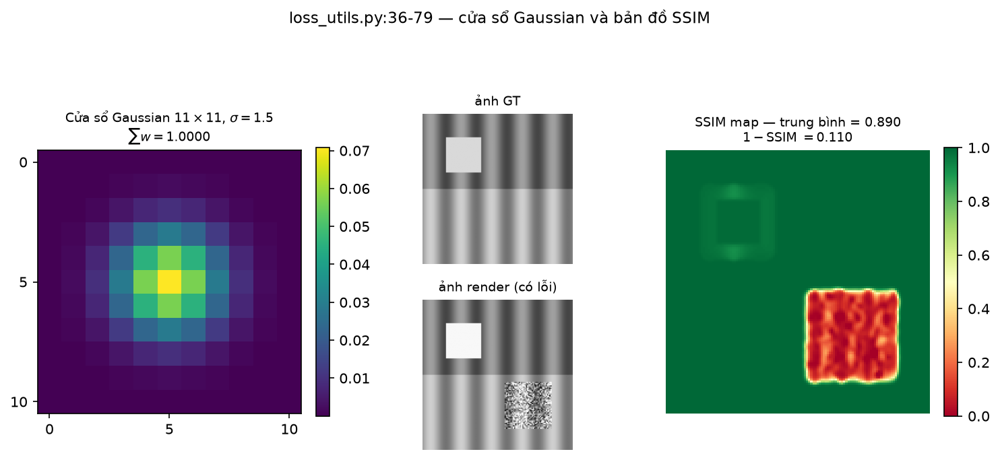
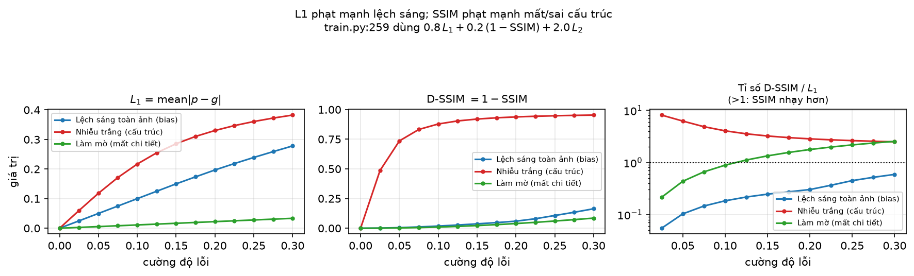
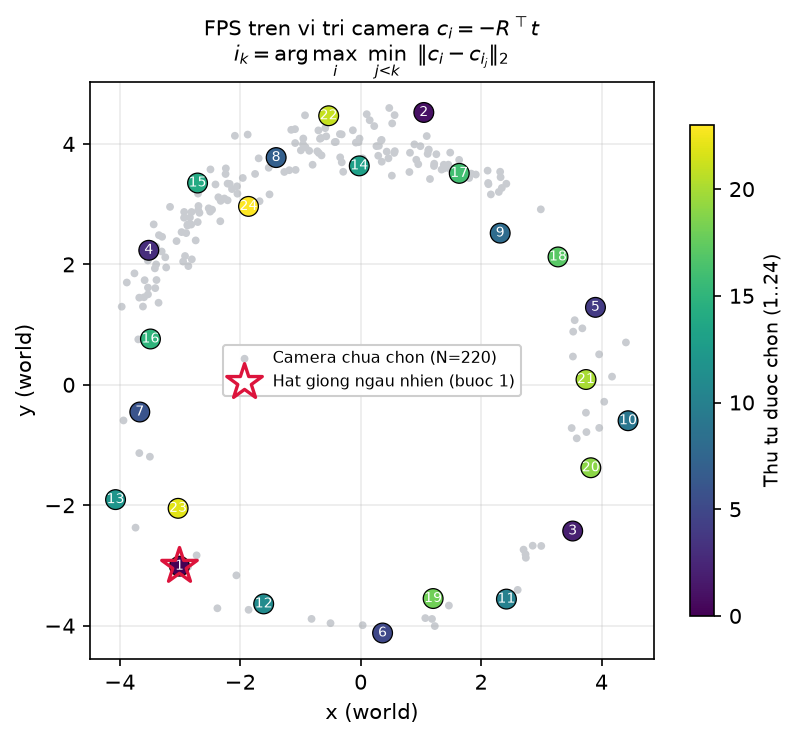
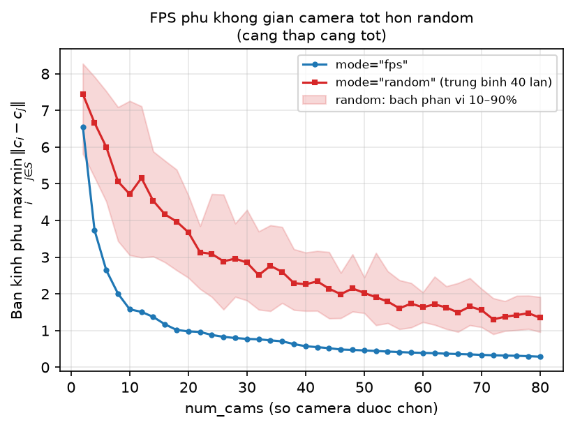
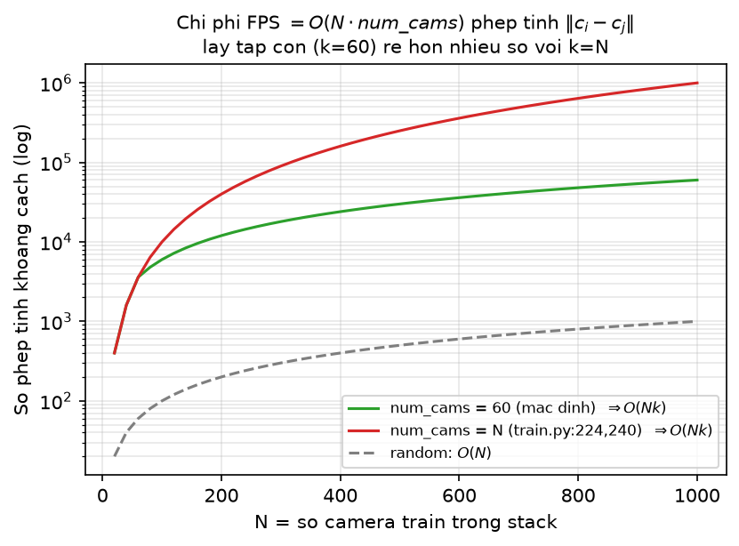

[← Mục lục chương 18](00-muc-luc.md) · Chương 18.8

# Chương 18.8 — Hàm mất mát của SADGS và hai bộ lấy mẫu (camera FPS, Gaussian dị hướng 2D)

> Nguồn:
> - `SADGS/train.py:17-18` (import loss), `:186-194` (precompute structure tensor), `:222-224`, `:239-240` (gọi FPS), `:255-263` (biểu thức loss thực tế), `:274-276` (thống kê $\eta$), `:412-414` (FPS tại prune iteration), `:529` (`--prune_iterations` mặc định `[4000, 8000]`).
> - `SADGS/utils/loss_utils.py:19-20` ($C_1, C_2$), `:22` (`l1_loss`), `:25` (`l2_loss`), `:28-34` (`tone_curve_loss`), `:36-44` (cửa sổ Gaussian), `:46-76` (`ssim`/`_ssim`), `:80-110` (`frequency_loss`), `:170-230` (`get_structure_tensor_torch`), `:389-392` (`frequency_loss_simple`), `:394-437` (`estimate_required_gaussians`).
> - `SADGS/utils/freq_utils.py:12-87` (`sampling_cameras`), `:92-96` (`get_loss`), `:98-102` (`compute_photometric_loss`), `:181-417` (`update_freq_stats_online`).
> - `SADGS/utils/gaussian_sampling.py:11-128` (`sample_anisotropic_gaussians_2d`).
> - `SADGS/arguments/__init__.py:86` (`lambda_dssim=0.2`), `:117-121` (`lambda_l2=2.0`, `lambda_tone=0.`, `lambda_freq=0.`, `st_levels=4`, `st_mode="v1"`), `:131` (`camera_sampling="random"`), `:147` (`batch_size=1`), `:150` (`eta_compute_mode="wavelength"`).
> - `SADGS/scene/__init__.py:83` (`create_from_pcd` — khởi tạo point cloud thật).
> - Hình: `DOCS/Slides67/figures/sadgsx/scripts/bot11_figs.py`, `bot12_figs.py`.

| Phần | Nội dung |
|---|---|
| 18.8.0 | Bức tranh tổng: một dòng loss, nhiều hàm không được gọi |
| 18.8.1 | $L_1$ và $L_2$ — giá trị và đạo hàm |
| 18.8.2 | SSIM: cửa sổ Gaussian $11\times11$ và bản đồ tương đồng |
| 18.8.3 | $L_1$ nhạy với gì, SSIM nhạy với gì |
| 18.8.4 | Ba hàm loss tần số / tone: có định nghĩa, không được gọi |
| 18.8.6 | Bảng kiểm: hàm nào thực sự chạy |
| 18.8.7 | `sampling_cameras` — FPS trên vị trí camera |
| 18.8.8 | Độ phủ và chi phí: FPS so với random |
| 18.8.9 | Hai sự thật khó chịu về cách `train.py` gọi FPS |
| 18.8.10 | `sample_anisotropic_gaussians_2d` — không được gọi |
| 18.8.11 | Tóm tắt |

---

## 18.8.0 Bức tranh tổng: một dòng loss, nhiều hàm không được gọi

Chương này gộp hai chủ đề tưởng như rời nhau nhưng lại có chung một kết luận: **phần lớn "hạ tầng structure-aware" ở tầng loss và tầng lấy mẫu của SADGS đã được viết xong nhưng chưa được nối vào vòng huấn luyện.** Toàn bộ tín hiệu gradient của SADGS đi qua đúng một dòng — `train.py:259`:

$$
\mathcal{L} \;=\; (1-\lambda_{\text{dssim}})\,L_1 \;+\; \lambda_{\text{dssim}}\bigl(1-\mathrm{SSIM}\bigr) \;+\; \lambda_{L_2}\,L_2
$$

Thay giá trị mặc định $\lambda_{\text{dssim}}=0.2$ (`arguments/__init__.py:86`) và $\lambda_{L_2}=2.0$ (`arguments/__init__.py:117`):

$$
\boxed{\;\mathcal{L} \;=\; 0.8\,L_1 \;+\; 0.2\,(1-\mathrm{SSIM}) \;+\; 2.0\,L_2\;}
$$

So với 3DGS gốc (chỉ $0.8L_1 + 0.2\,\text{D-SSIM}$), khác biệt duy nhất ở tầng photometric là **số hạng $L_2$ với trọng số $2.0$**. Không có số hạng tần số, không có tone-curve, không có regularizer hình học. Ba điểm cần nhớ ngay:

1. SSIM chạy bằng kernel CUDA `fused_ssim` (`train.py:18`: `from fused_ssim import fused_ssim as fast_ssim`, dùng ở `train.py:258`), **không** dùng hàm `ssim()` thuần PyTorch ở `loss_utils.py:46`.
2. `train.py:17` chỉ import `l1_loss, l2_loss` và hai hàm structure tensor. `tone_curve_loss` và `frequency_loss` **không nằm trong danh sách import**.
3. `lambda_tone = 0.` (`arguments/__init__.py:118`) và `lambda_freq = 0.` (`:119`) tồn tại như tham số CLI, nhưng **không xuất hiện trong bất kỳ biểu thức nào** của `train.py`. Đặt chúng $>0$ qua dòng lệnh cũng **không** có tác dụng, vì dòng nối chưa được viết.

Structure tensor vẫn được tính trước cho toàn bộ ảnh train (`train.py:186-194`, mặc định `st_mode="v1"`, `st_levels=4`), nhưng để nuôi **thống kê $\eta$ không gradient** trong `update_freq_stats_online` (`train.py:276`, `freq_utils.py:181`), chứ không để tính loss.

---

## 18.8.1 $L_1$ và $L_2$ — giá trị và đạo hàm

Hai hàm cơ sở, `loss_utils.py:22` và `:25`, đều lấy `.mean()` trên toàn bộ tensor $3\times H\times W$:

$$
L_1 = \frac{1}{N}\sum_i \bigl|p_i - g_i\bigr|,
\qquad
L_2 = \frac{1}{N}\sum_i \bigl(p_i - g_i\bigr)^2
$$

với $p$ = `network_output` (ảnh render), $g$ = `gt` (ảnh gốc). Đặt $e = p - g$:

$$
\frac{\partial L_1}{\partial e} = \mathrm{sign}(e) \quad\text{(hằng số)},
\qquad
\frac{\partial L_2}{\partial e} = 2e \quad\text{(tuyến tính)}
$$

`tone_curve_loss` (`loss_utils.py:28-34`) cũng nằm trong file này nhưng **không được import vào `train.py` và không được gọi ở đâu**; `lambda_tone = 0.` (`arguments/__init__.py:118`). Chi tiết trạng thái ở bảng kiểm §18.8.6.

---

## 18.8.2 SSIM: cửa sổ Gaussian $11\times11$ và bản đồ tương đồng

`loss_utils.py:36-44` dựng cửa sổ: một Gaussian 1D độ dài $W=11$, $\sigma$ **cố định cứng** $=1.5$ (`loss_utils.py:41`), chuẩn hoá về tổng 1, rồi nhân ngoài thành cửa sổ 2D và `expand` cho từng kênh:

$$
w_k \;\propto\; \exp\!\left(-\frac{\bigl(k-\lfloor W/2\rfloor\bigr)^2}{2\sigma^2}\right),
\qquad W = 11,\ \sigma = 1.5,\ \sum_k w_k = 1
$$

Các thống kê cục bộ là tích chập *depthwise* (`groups=channel`, `padding=5`, `loss_utils.py:57-66`):

$$
\mu_1 = w * p,\qquad
\sigma_1^2 = w*p^2 - \mu_1^2,\qquad
\sigma_{12} = w*(pg) - \mu_1\mu_2
$$

$$
\mathrm{SSIM} = \frac{(2\mu_1\mu_2 + C_1)\,(2\sigma_{12}+C_2)}{(\mu_1^2+\mu_2^2+C_1)\,(\sigma_1^2+\sigma_2^2+C_2)},
\qquad C_1 = 0.01^2,\ C_2 = 0.03^2
$$

($C_1, C_2$ khai báo ở `loss_utils.py:19-20` và **lặp lại** trong thân `_ssim` ở `:68-69`.)



*Hình 18.8.2 — Trái: cửa sổ 2D $11\times11$ dựng đúng theo `loss_utils.py:37-42`, tiêu đề in tổng trọng số để kiểm chứng $\sum w = 1$. Giữa: cặp ảnh $128\times128$ gồm sóng sin chu kỳ 26 px, một cạnh ngang ở giữa ảnh, một ô sáng $[20{:}50]^2$; ảnh render mô phỏng hai loại lỗi — ô sáng bị lệch $+0.12$ độ sáng và khối $[70{:}110]^2$ bị cộng nhiễu Gauss biên độ $0.25$. Phải: bản đồ SSIM tính bằng đúng công thức `_ssim`. Kết luận đọc được từ hình: vùng nhiễu cấu trúc rơi xuống SSIM $\approx 0$ (đỏ đậm) trong khi vùng chỉ lệch độ sáng đều vẫn gần $1$ (xanh) — nhân tử contrast–structure $(2\sigma_{12}+C_2)$ mới là thứ phạt, không phải nhân tử luminance.*

Tử số tách thành hai nhân tử có ý nghĩa vật lý khác hẳn nhau: $(2\mu_1\mu_2+C_1)$ đo **độ sáng**, $(2\sigma_{12}+C_2)$ đo **tương quan cục bộ**. Chính nhân tử thứ hai khiến SSIM phạt nặng hiện tượng mờ / nhiễu / sai texture mà $L_1$ gần như bỏ qua.

Cờ `size_average=True` (mặc định) trả vô hướng `ssim_map.mean()`; đặt `False` trả vector theo batch (`loss_utils.py:73-76`). **Trong huấn luyện thực tế hàm này không chạy** — `train.py:258` gọi `fast_ssim` = `fused_ssim`. Bản thuần PyTorch chỉ còn giá trị tham chiếu và dùng ở nhánh đánh giá `training_report` (`train.py:493`).

---

## 18.8.3 $L_1$ nhạy với gì, SSIM nhạy với gì

Hai số hạng $0.8L_1$ và $0.2(1-\mathrm{SSIM})$ không dư thừa: chúng phủ hai lớp lỗi khác nhau.



*Hình 18.8.3 — Ba loại lỗi được quét biên độ trong dải $[0, 0.30]$ (13 điểm) trên cùng ảnh gốc ở Hình 18.8.2: lệch sáng toàn ảnh (bias, cộng hằng số), nhiễu trắng biên độ $3t$, và làm mờ (trộn tuyến tính với ảnh đã lọc Gaussian hai lần). Trái: $L_1 = \text{mean}|p-g|$. Giữa: $\text{D-SSIM} = 1 - \mathrm{SSIM}$. Phải: tỉ số $\text{D-SSIM}/L_1$ vẽ thang log, đường ngang nét chấm ở $1$. Đọc được: với lệch sáng, $L_1$ tăng tuyến tính còn D-SSIM gần như nằm im (tỉ số $\ll 1$) — SSIM "tha" lỗi độ sáng đồng đều. Với nhiễu và làm mờ, tỉ số vọt lên $>1$: cùng một mức $L_1$, SSIM phạt nặng hơn nhiều vì tương quan cục bộ $\sigma_{12}$ sụp đổ.*

Hệ quả thiết kế: nếu chỉ dùng $L_1$, mô hình sẽ hài lòng với một nghiệm mờ đúng độ sáng trung bình — đúng loại nghiệm mà 3DGS phải tránh. Số hạng D-SSIM giữ cho chi tiết tần số cao không bị "trung bình hoá" mất.

Còn $L_2$ với trọng số $2.0$? Hãy chú ý bậc độ lớn: khi $|e| < 1$ thì $L_2 \ll L_1$ (ví dụ $e = 0.1$ cho $L_1 = 0.1$ nhưng $L_2 = 0.01$). Hệ số $2.0$ vì vậy **không thực sự "ưu tiên" $L_2$**, nó chỉ kéo số hạng này về cùng bậc độ lớn với $0.8L_1$. Tác dụng thực: khuếch đại gradient ở các pixel sai nhiều (outlier), làm nhanh giai đoạn hội tụ đầu.

---

## 18.8.4 Ba hàm loss tần số / tone: có định nghĩa, không được gọi

`loss_utils.py` còn ba thực thể mang tên "tần số" nhưng **không nằm trên đường chạy nào**:

- `frequency_loss(means2D, cov2D, st_map, H, W)` (`loss_utils.py:80-110`) — không được import vào `train.py`, `lambda_freq = 0.` (`arguments/__init__.py:119`).
- `frequency_loss_simple(rendered_image, st_map)` (`:389-392`) — được `freq_utils.py:5` import nhưng không dùng lại lần nào trong file đó.
- `estimate_required_gaussians(...)` (`:394-437`) — **hỏng**: dòng `:411` gọi `get_multiscale_structure_tensor(image)`, một tên không tồn tại (chỉ có `_v1`/`_v2`), sẽ ném `NameError`.

Cơ chế "so cỡ Gaussian với bước sóng texture" thực sự chạy trong SADGS **không** ở dạng loss mà ở dạng thống kê không gradient trong `update_freq_stats_online` (`freq_utils.py:181`), với $\eta_{	ext{3ch}} = \ell_{	ext{axis}}/\lambda_{\min}$, $\lambda_{\min} = 1/(\sqrt{\lambda_1}+10^{-5})$ tính riêng cho 3 trục chiếu (`freq_utils.py:342-348`) — xem [Chương 18.2](02-chieu-truc-va-ti-so-eta.md). SADGS điều khiển tần số qua **densification**, không qua gradient.

---

## 18.8.6 Bảng kiểm: hàm nào thực sự chạy

| Hàm | Vị trí | Vào $\mathcal{L}$? | Ghi chú |
|---|---|---|---|
| `l1_loss` | `loss_utils.py:22` | **CÓ** | hệ số $1-\lambda_{\text{dssim}} = 0.8$ |
| `l2_loss` | `loss_utils.py:25` | **CÓ** | hệ số $\lambda_{L_2} = 2.0$ — bổ sung riêng của SADGS |
| `fused_ssim` | submodule, `train.py:18,258` | **CÓ** | hệ số $\lambda_{\text{dssim}} = 0.2$, dạng $1-\mathrm{SSIM}$ |
| `ssim` / `_ssim` thuần torch | `loss_utils.py:46,56` | không | bị `fused_ssim` thay ở `train.py:258`; còn dùng ở `training_report:493` |
| `tone_curve_loss` | `loss_utils.py:28` | **KHÔNG** | không import; `lambda_tone=0.` (`args:118`), không tham chiếu |
| `frequency_loss` | `loss_utils.py:80` | **KHÔNG** | không import; `lambda_freq=0.` (`args:119`), không tham chiếu |
| `frequency_loss_simple` | `loss_utils.py:389` | **KHÔNG** | `freq_utils.py:5` import rồi bỏ không dùng |
| `estimate_required_gaussians` | `loss_utils.py:394` | **KHÔNG** | `NameError` ở dòng 411 |
| `freq_utils.get_loss` | `freq_utils.py:92` | **KHÔNG** | bản đồ $L_1$ chuẩn hoá min–max, có `.detach()` |
| `freq_utils.compute_photometric_loss` | `freq_utils.py:98` | **KHÔNG** | $0.8L_1 + 0.2(1-\mathrm{SSIM})$, hằng số **hard-code**, thiếu hẳn $L_2$ |

Hai hàm cuối đáng chú ý. `get_loss` (`freq_utils.py:92-96`) trả về **bản đồ** sai số đã chuẩn hoá min–max chứ không phải vô hướng:

$$
\tilde{L}_1(x,y) = \frac{\overline{|p-g|}(x,y) - \min \overline{|p-g|}}{\max \overline{|p-g|} - \min \overline{|p-g|}}
$$

(trung bình theo kênh ở `dim=0`, có `.detach()` nên **không** sinh gradient). Còn `compute_photometric_loss` (`:98-102`) viết lại loss photometric với hằng số `0.2` hard-code, **không** đọc `opt.lambda_dssim` và **không** có $L_2$ — tức nếu được dùng nó sẽ lệch với `train.py:259`.

> **Kết luận phần A.** Loss của SADGS về bản chất vẫn là loss photometric của 3DGS cộng thêm một số hạng $L_2$ nặng. Toàn bộ tính "structure-aware" nằm ở **nhánh densification**, không nằm trong hàm mất mát.

---

## 18.8.7 `sampling_cameras` — FPS trên vị trí camera

`freq_utils.py:12-87`, chữ ký `sampling_cameras(my_viewpoint_stack, mode="fps", num_cams=60, weights=None)`. Hai chế độ: `"random"` (`:26-32`) và `"fps"` (`:34-83`); mọi giá trị khác ném `ValueError` (`:86-87`). Tham số `weights` **khai báo nhưng không dùng** trong thân hàm — chỗ chờ để cắm lấy mẫu có trọng số về sau. Cả hai chế độ đều `pop()` camera ra khỏi stack gốc, tức hàm có **side effect**.

**Bước 1 — trích vị trí camera** (`:41-50`). Từ `world_view_transform` (chuyển vị để lấy $W2C$), tách $R \in \mathbb{R}^{3\times3}$ và $t \in \mathbb{R}^3$:

$$
c_i \;=\; -R^{\top} t \;\in\; \mathbb{R}^3
$$

**Bước 2 — vòng lặp FPS** (`:52-72`), khởi tạo $d_i = +\infty$, hạt giống $i_1$ **ngẫu nhiên** (`random.randint`, `:58`):

$$
d_i \leftarrow \min\bigl(d_i,\ \lVert c_i - c_{i_{k-1}}\rVert_2\bigr),
\qquad
i_k = \arg\max_i\ d_i
$$

với $d_i \leftarrow -1$ cho mọi $i$ đã chọn (`:68`) để không chọn lại.



*Hình 18.8.6 — $N = 220$ camera mô phỏng quỹ đạo vòng quanh vật thể bán kính $\approx 4.0$, trong đó **70% bị dồn vào một cung $\approx 1/3$ quỹ đạo** (mô phỏng chuỗi ảnh COLMAP lấy không đều). Vòng lặp FPS là bản sao 1:1 của `freq_utils.py:52-72`. Chọn $k = 24$; màu và số ghi **thứ tự được chọn**, ngôi sao đỏ là hạt giống ngẫu nhiên (bước 1). Đọc được: dù mật độ gốc lệch nặng, tập được chọn trải gần như đều quanh vòng tròn — vì quy tắc $\arg\max_i \min_{j<k}\lVert c_i - c_{i_j}\rVert$ luôn nhảy sang vùng đang "trống" nhất chứ không quan tâm mật độ.*

**Điểm cần nói thẳng về metric**: khoảng cách chỉ dùng **vị trí** camera, hoàn toàn không dùng hướng nhìn hay trục quang. $R$ chỉ xuất hiện để giải ra $c_i$ rồi bị bỏ. Hai camera đứng cùng một chỗ nhưng nhìn ngược nhau có khoảng cách $0$ và FPS coi chúng là trùng lặp — với dataset kiểu 360° inward điều này chấp nhận được, nhưng với dataset quay từ một điểm (panorama-like) thì metric này mù.

---

## 18.8.8 Độ phủ và chi phí: FPS so với random

Chất lượng một tập con $S$ được đo bằng **bán kính phủ** (covering radius):

$$
r(S) \;=\; \max_{i}\ \min_{j\in S}\ \lVert c_i - c_j\rVert_2
$$

càng nhỏ càng tốt. FPS chính là thuật toán tham lam xấp xỉ $2$ kinh điển cho bài toán $k$-center, nên $r(S)$ giảm nhanh và **ổn định** theo `num_cams`.



*Hình 18.8.7 — Trên cùng tập 220 camera của Hình 18.8.6, quét `num_cams` $= 2, 4, \dots, 80$. Đường xanh là $r(S)$ của FPS; đường đỏ là **trung bình 40 lần rút** ngẫu nhiên, dải đỏ là bách phân vị 10–90%. Hai kết luận: (1) FPS luôn nằm **dưới** trung bình random, và khoảng cách rộng nhất khi `num_cams` nhỏ — đúng chế độ ta quan tâm; (2) random có **phương sai lớn** (dải đỏ dày), nghĩa là một lần rút xấu có thể bỏ trống cả một phía cảnh.*

Ý nghĩa với SADGS: thống kê $\eta$ được tích luỹ theo từng view (`update_freq_stats_online`, gọi mỗi 10 iteration ở `train.py:275-276`). Nếu tập camera bị dồn vào một cung quỹ đạo, các Gaussian ở phía đối diện gần như không bao giờ được cập nhật `accum_view_count`, khiến ước lượng vi phạm tần số thiên lệch. FPS ép mỗi vùng không gian có ít nhất một view đại diện.

Cái giá phải trả: vòng lặp `:61-72` chạy `num_cams` $-1$ lần, mỗi lần tính $N$ chuẩn L2:

$$
\text{Cost}_{\text{FPS}} = O\bigl(N \cdot \texttt{num\_cams}\bigr),
\qquad
\text{Cost}_{\text{rand}} = O(N)
$$



*Hình 18.8.8 — Số phép tính $\lVert c_i - c_j \rVert$ theo $N \in [20, 1000]$, trục tung thang log. Xanh lá: `num_cams` $= \min(N, 60)$ — mặc định của chữ ký hàm, tăng tuyến tính sau khi bão hoà ở 60. Đỏ: `num_cams` $= N$ — đúng cách `train.py:224,240` gọi, cho $O(N^2)$. Xám đứt nét: random $O(N)$. Ở $N = 1000$, lấy $k = 60$ rẻ hơn $k = N$ khoảng **17 lần**. Đây chính là lý do chữ ký hàm đặt mặc định `num_cams=60` — và cũng là lý do cách gọi với `num_cams=len(stack)` đáng phải xem lại.*

---

## 18.8.9 Hai sự thật khó chịu về cách `train.py` gọi FPS

**(1) Thứ tự FPS bị xoá ngay sau khi tính** (`freq_utils.py:74-81`). Code pop theo chỉ số **giảm dần** để tránh lệch index, rồi gọi `camlist.reverse()`:

```
for idx in sorted(selected_indices, reverse=True):
    camlist.append(my_viewpoint_stack.pop(idx))
camlist.reverse()
```

Kết quả: `camlist` được sắp theo **chỉ số gốc tăng dần**, **không** phải theo thứ tự FPS. Do đó comment `# Pop from the start of the FPS-sorted list` ở `train.py:236` mô tả sai hành vi thực tế.

**(2) Khi `num_cams` $= N$, FPS suy biến thành phép hoán vị đồng nhất.** Tại `train.py:224` và `:240`, lời gọi là `sampling_cameras(viewpoint_stack, mode="fps", num_cams=len(viewpoint_stack))` — chọn đủ $N$ camera. Kết hợp với điểm (1), tập trả về là **toàn bộ stack theo đúng thứ tự ban đầu**, khác hẳn nhánh `else` là `random.shuffle`. Nghĩa là:

- `camera_sampling="fps"` $\approx$ **tắt xáo trộn** + trả thêm $O(N^2)$ phép tính khoảng cách;
- lợi ích "phủ đều" chỉ thực sự phát huy ở lời gọi `train.py:414` — `camlist = sampling_cameras(my_viewpoint_stack)`, dùng mặc định (fps, 60 camera) tại `prune_iterations = [4000, 8000]` (`train.py:529`). **Nhưng ở đó `camlist` hiện không được dùng**: dòng gọi `compute_gaussian_score_structgs(camlist, ...)` đã bị comment (`train.py:418`), chỉ còn prune theo `opacity < 0.1` (`train.py:416-417`).

Thêm nữa, mặc định `camera_sampling = "random"` (`arguments/__init__.py:131`), nên trong cấu hình chạy chuẩn nhánh FPS ở `:222-224` và `:239-240` thậm chí **không được kích hoạt**.

> **Kết luận phần B (camera).** FPS đã được cài đặt đúng thuật toán, nhưng trong cấu hình huấn luyện hiện tại nó là một **hook chưa khai thác**, không phải nguồn gốc chất lượng của SADGS.

---

## 18.8.10 `sample_anisotropic_gaussians_2d` — không được gọi

`utils/gaussian_sampling.py:11-128` cài một bộ lấy mẫu Gaussian dị hướng 2D dựa trên `get_structure_tensor_torch` (`loss_utils.py:170`): lấy vị trí theo xác suất $p(x,y) \propto S_{xx}+S_{yy}$, rồi suy hình dạng từ phân rã trị riêng của $S$.

**Nó không được gọi ở đâu.** `grep` toàn repo chỉ trả về đúng dòng định nghĩa (`gaussian_sampling.py:11`). Khởi tạo point cloud thật vẫn là `gaussians.create_from_pcd(scene_info.point_cloud, self.cameras_extent)` (`scene/__init__.py:83`) — point cloud thưa từ COLMAP, y như 3DGS gốc. File `fit_2d_image.py` mà docstring (`gaussian_sampling.py:2`) nhắc tới cũng không tồn tại trong repo.

---

## 18.8.11 Tóm tắt

| Chủ đề | Hiện trạng trong code |
|---|---|
| Loss thực tế (`train.py:259`) | $0.8L_1 + 0.2(1-\mathrm{SSIM}) + 2.0L_2$ — chỉ khác 3DGS ở số hạng $L_2$ |
| SSIM | `fused_ssim` CUDA (`train.py:18,258`); bản thuần torch `loss_utils.py:46` chỉ dùng khi đánh giá |
| `tone_curve_loss` (`:28`) | Định nghĩa đầy đủ, **chưa gọi**; `lambda_tone=0.` (`args:118`) |
| `frequency_loss` (`:80`) | Định nghĩa đầy đủ, **chưa gọi**; `lambda_freq=0.` (`args:119`) |
| `frequency_loss_simple` (`:389`) | Import ở `freq_utils.py:5` rồi bỏ, không được gọi |
| `estimate_required_gaussians` (`:394`) | **Hỏng** — `NameError` ở dòng 411 (`get_multiscale_structure_tensor` không tồn tại) |
| Cơ chế tần số thực sự chạy | $\eta$ dị hướng 3 trục, **không gradient**, trong `freq_utils.py:181-417`, gọi mỗi 10 iteration |
| `sampling_cameras` FPS (`freq_utils.py:34-83`) | Thuật toán đúng ($k$-center tham lam), metric chỉ dùng vị trí $c_i = -R^\top t$ |
| Cách gọi ở `train.py:224,240` | `num_cams=len(stack)` $\Rightarrow$ suy biến thành "tắt shuffle" $+ O(N^2)$; mà mặc định `camera_sampling="random"` nên còn không chạy |
| Cách gọi ở `train.py:414` | Đúng chế độ tập con (60 cam) nhưng `camlist` **không được dùng** (dòng tiêu thụ đã bị comment) |
| `sample_anisotropic_gaussians_2d` | **Không được gọi ở đâu**; khởi tạo thật là `create_from_pcd` (`scene/__init__.py:83`) |

Ba điều cần rút ra cho người đọc code SADGS:

1. **Đừng đọc tên hàm rồi suy ra hành vi.** Bốn hàm loss có tên rất "structure-aware" (`frequency_loss`, `frequency_loss_simple`, `tone_curve_loss`, `estimate_required_gaussians`) đều nằm ngoài đồ thị tính toán. Một trong số đó còn không chạy nổi.
2. **Tính structure-aware của SADGS nằm ở densification, không ở loss.** Đây không phải khiếm khuyết mà là lựa chọn thiết kế có lý: tín hiệu tần số dị hướng 3 trục mang nhiều thông tin hơn một số vô hướng khả vi, và việc dùng nó để **quyết định split/clone** tránh được việc phải backprop qua một đại lượng rời rạc.
3. **Hai bộ lấy mẫu là hạ tầng chờ dùng.** Cả FPS camera lẫn lấy mẫu Gaussian dị hướng 2D đều đã được cài đúng, nhưng đường nối vào `train.py` hoặc thiếu, hoặc bị gọi với tham số làm mất tác dụng.

---

[← Mục lục chương 18](00-muc-luc.md) · [Chương 18.9 →](09-sieu-tham-so-va-rasterizer.md)
