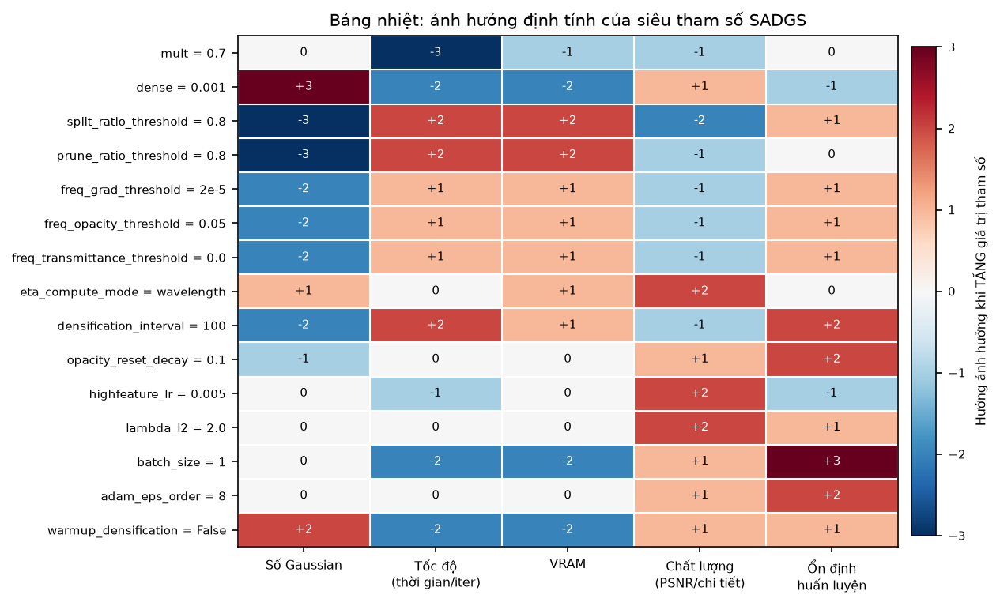
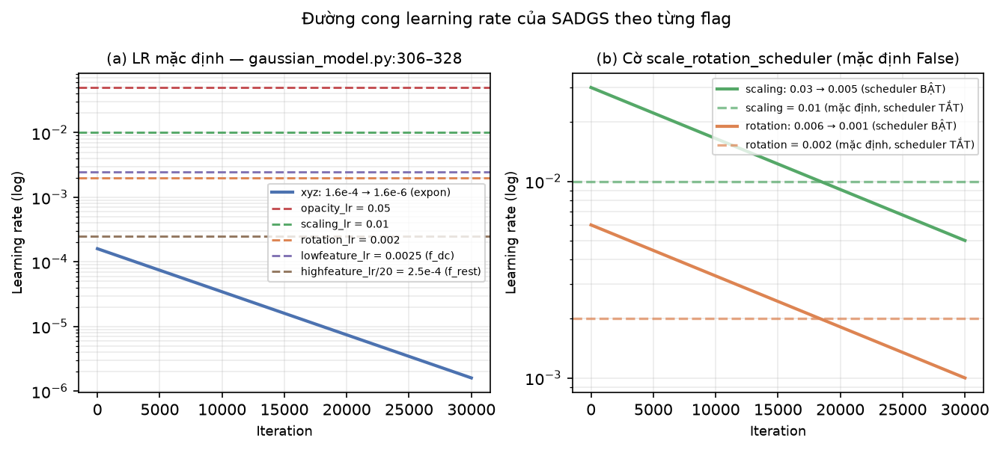
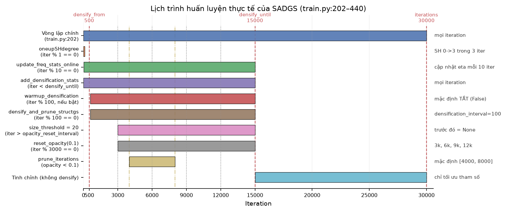
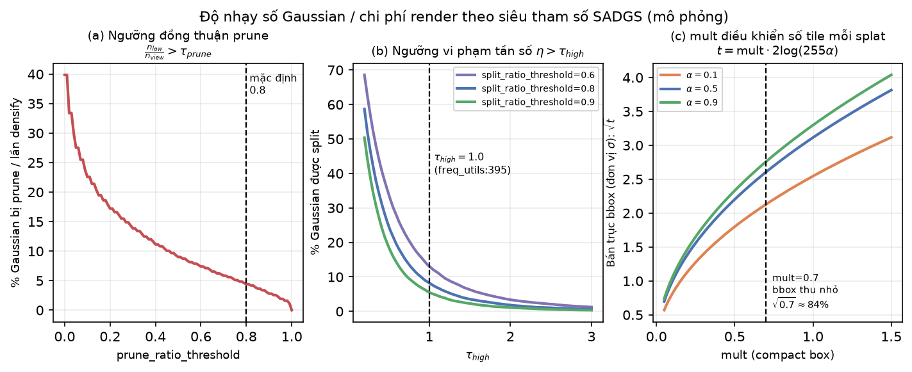
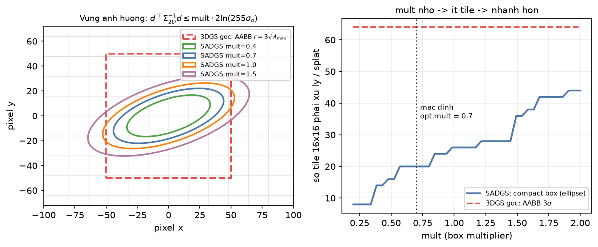
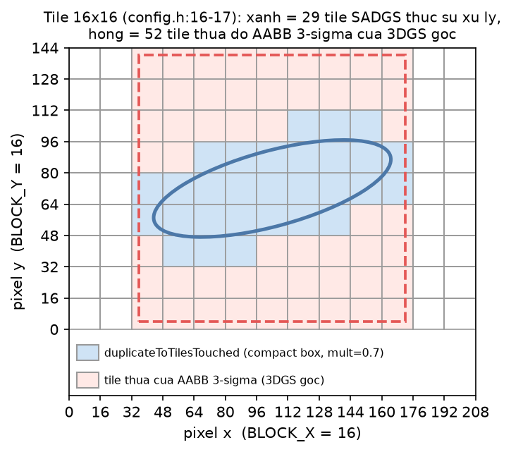
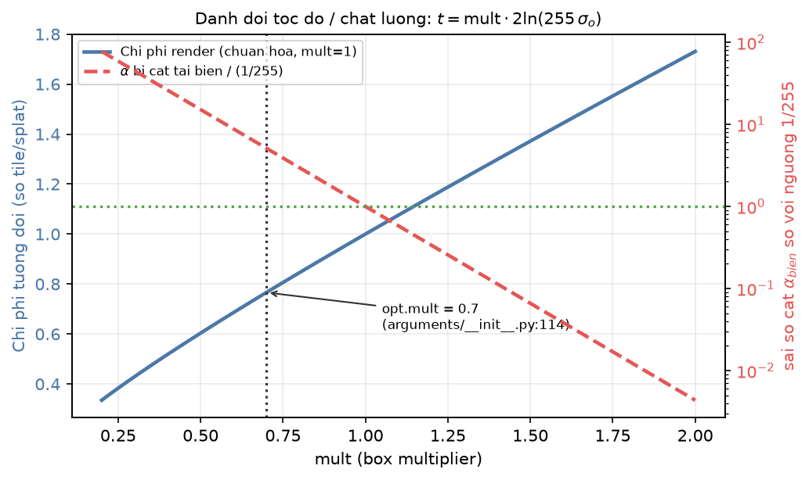
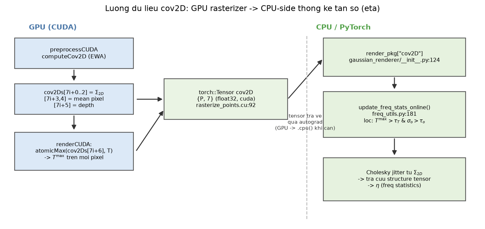
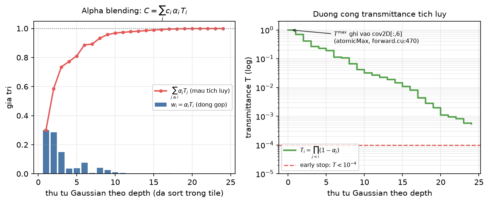
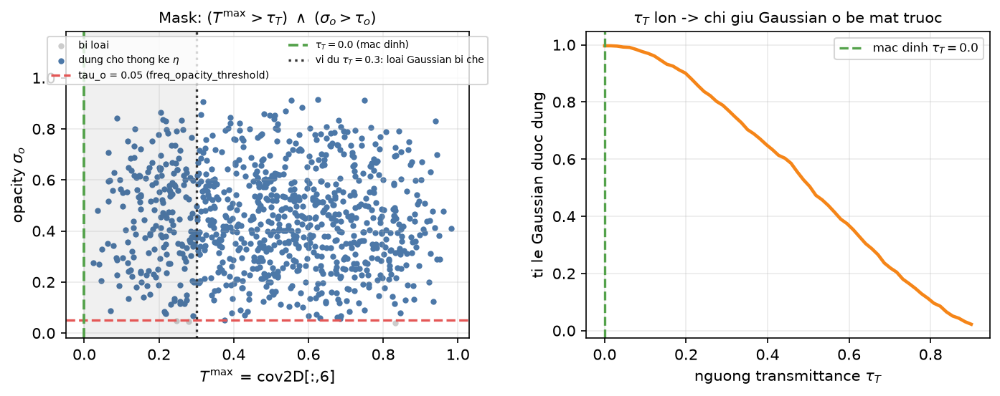

[← Mục lục chương 18](00-muc-luc.md) · Chương 18.9

# Chương 18.9 — Siêu tham số, lịch trình huấn luyện và rasterizer riêng của SADGS

> Nguồn:
> - `SADGS/arguments/__init__.py:45-160` — `ModelParams`, `PipelineParams`, và toàn bộ `OptimizationParams:73-160` (hơn 50 cờ).
> - `SADGS/train.py:202-440` — vòng lặp huấn luyện thật (batch, densify, reset opacity, prune, optimizer step); `train.py:521-555` — các `argparse` ngoài `ParamGroup`.
> - `SADGS/run_train.sh` — 4 cấu hình thực nghiệm thật cho Mip-NeRF 360 / Tanks&Temples / Deep Blending.
> - `SADGS/scene/gaussian_model.py:286-355` (`training_setup`, `update_learning_rate`), `:415-427` (`reset_opacity`), `:957-1052` (`densify_and_prune_structgs`).
> - `SADGS/utils/general_utils.py:32-70` (`get_expon_lr_func`), `SADGS/utils/freq_utils.py:181-419` (`update_freq_stats_online`, `TAU_HIGH/TAU_LOW`).
> - `SADGS/gaussian_renderer/__init__.py:18-127` (`render_structgs`).
> - `SADGS/submodules/diff-gaussian-rasterization_structgs/`: `diff_gaussian_rasterization_structgs/__init__.py:21-276`, `rasterize_points.cu:55-183`, `cuda_rasterizer/forward.cu:175-520`, `cuda_rasterizer/auxiliary.h:311-375`, `cuda_rasterizer/rasterizer_impl.cu:120-149, 375-475`, `cuda_rasterizer/config.h:16-17`.

| Phần | Nội dung |
|---|---|
| 18.9.1 | Bản đồ siêu tham số — 5 nhóm, giá trị mặc định thật |
| 18.9.2 | Learning rate & optimizer — cái gì có lịch, cái gì là hằng số |
| 18.9.3 | Lịch trình huấn luyện thật theo iteration |
| 18.9.4 | Độ nhạy: ba ngưỡng quyết định ngân sách Gaussian |
| 18.9.5 | Cấu hình thực nghiệm trong `run_train.sh` |
| 18.9.6 | Vì sao SADGS phải fork rasterizer riêng |
| 18.9.7 | `mult` — compact box thay hộp bao $3\sigma$ |
| 18.9.8 | Đánh đổi tốc độ/chất lượng theo `mult` |
| 18.9.9 | `cov2D` $(N,7)$ — rasterizer làm cảm biến |
| 18.9.10 | $T^{\max}$ và các đầu ra phụ (`metric_map`, `compute_extra`) |
| 18.9.11 | Tóm tắt |

---

# PHẦN A — SIÊU THAM SỐ VÀ LỊCH TRÌNH HUẤN LUYỆN

## 18.9.1 Bản đồ siêu tham số

SADGS giữ nguyên `ModelParams` (`sh_degree=3`, `arguments/__init__.py:47`) và `PipelineParams` (`separate_sh=True`, `antialiasing=False`, `:63-70`) của 3DGS, rồi mở rộng `OptimizationParams` lên hơn 50 cờ. Chúng chia thành 5 nhóm rất khác nhau về mức độ "thật sự có tác dụng".

**Nhóm (A) — Rasterizer.** Chỉ một cờ duy nhất, nhưng là cờ được truyền thẳng xuống CUDA:

| Cờ | Mặc định | Dòng code | Ý nghĩa |
|---|---|---|---|
| `mult` | `0.7` | `arguments/__init__.py:114` | Hệ số thu nhỏ hộp bao compact; chú thích gốc: *"multiplier for the compact box to control the tile number of each splat"* |

**Nhóm (B) — Thống kê tần số.** Quyết định Gaussian nào được góp phiếu vào $\eta$:

| Cờ | Mặc định | Dòng | Ghi chú |
|---|---|---|---|
| `eta_compute_mode` | `"wavelength"` | `:150` | Thang đo $\eta$; lựa chọn khác là `"projection"` |
| `freq_grad_threshold` | `2e-5` | `:123` | Chỉ tích luỹ $\eta$ khi $\lVert\nabla_{uv}\rVert$ vượt ngưỡng (`freq_utils.py:208-216`) |
| `freq_opacity_threshold` | `0.05` | `:145` | Bỏ qua Gaussian gần trong suốt |
| `freq_transmittance_threshold` | `0.0` | `:146` | Bỏ qua Gaussian bị che; mặc định $0$ nghĩa là **không lọc** |
| `st_levels` | `4` | `:120` | Số mức kim tự tháp structure tensor |
| `st_mode` | `"v1"` | `:121` | Chọn `get_multiscale_structure_tensor_v1/v2` |

**Nhóm (C) — Densify/prune đồng thuận đa view:**

| Cờ | Mặc định | Dòng | Ghi chú |
|---|---|---|---|
| `split_ratio_threshold` | `0.8` | `:148` | Split khi $n_{high}/n_{view} > 0.8$ (`train.py:346`) |
| `prune_ratio_threshold` | `0.8` | `:149` | Prune khi $n_{low}/n_{view} > 0.8$ (`train.py:354`) |
| `dense` | `0.001` | `:113` | Ranh giới clone/split: `max σ ≶ dense*extent` (`gaussian_model.py:990-991`) |
| `grad_thresh` | `2e-4` | `:112` | Ngưỡng gradient (`gaussian_model.py:971`) |
| `grad_abs_thresh` | `2e-4` | `:109` | Khai báo cho nhánh split kiểu gradient-tuyệt-đối kế thừa từ 3DGS gốc |
| `ks_scale_power` | `1.0` | `:138` | $\sigma' = \sigma/k^{p}$ khi split (`gaussian_model.py:1011`) |
| `densification_interval` | `100` | `:87` | Chu kỳ gọi `densify_and_prune_structgs` |
| `densify_from_iter` / `densify_until_iter` | `500` / `15000` | `:91-92` | Cửa sổ densify **và** cửa sổ cập nhật $\eta$ |
| `opacity_reset_interval` | `3000` | `:89` | Cũng là mốc bật `size_threshold=20` |
| `opacity_reset_decay` | `0.1` | `:90` | $\alpha \leftarrow 0.1\,\alpha$ — khác 3DGS gốc dùng $\min(\alpha, 0.01)$ |
| `warmup_densification` | `False` | `:130` | Mặc định **TẮT**; chỉ khi bật mới dùng `densify_grad_threshold=2e-4`, `densify_grad_abs_threshold=4e-4` (`:93-94`) |

**Nhóm (D) — Tối ưu hoá:** `optimizer_type="hybrid"` (`:128`), `adam_eps_order=8` (`:156`), `lowfeature_lr=0.0025` (`:111`), `highfeature_lr=0.005` (`:110`), `batch_size=1` (`:147`), `lambda_l2=2.0` (`:117`), `lambda_dssim=0.2` (`:86`), `scale_rotation_scheduler=False` (`:154`).

**Nhóm (E) — Cờ khai báo nhưng KHÔNG được nối vào code.** Kiểm tra bằng cách quét toàn bộ `*.py` ngoài `arguments/`, các cờ sau có **0 lần sử dụng**: `clone_target_eta`, `lambda_freq`, `lambda_tone`, `min_weight`, `prune_from_iter`, `prune_interval`, `densify_prune_ratio`, `after_densify_prune_ratio`, `loss_thresh`, `sample_far_plane`, `far_plane_dist`, `far_plane_res`, `densification_window_width`, `max_clones_per_axis`, `expansion_speed`, `adaptive_clone`, `feature_lr`, `shfeature_lr`. Chỉnh chúng qua CLI **không có tác dụng gì**.

Hai trường hợp đặc biệt phải nói rõ:

1. **`tau_expand = 1.0` (`:135`)** chỉ xuất hiện ở `gaussian_model.py:833-846` trong hàm `expand_undersized_gs`, mà lời gọi hàm này **đã bị comment-out** tại `train.py:356-359`. Nghĩa là cơ chế nở Gaussian undersized hiện **không chạy**.
2. **`prune_until_iter` bị khai báo hai lần**: `= 25000` ở `:96` rồi bị ghi đè `= 30_000` ở `:100`. Giá trị thực tế là `30000` — và cũng không được dùng ở đâu cả.

Quan trọng nhất: **hai ngưỡng then chốt của SADGS lại không nằm trong `arguments`**. `TAU_HIGH = 1.0` và `TAU_LOW = 0.1` được **hard-code** trong `utils/freq_utils.py:395-396`. Muốn đổi phải sửa mã nguồn, không có cờ CLI.



*Hình 18.9.1 — Bảng nhiệt định tính 15 siêu tham số × 5 khía cạnh (số Gaussian, tốc độ, VRAM, chất lượng, ổn định), thang $-3\ldots+3$ theo hướng ảnh hưởng khi **tăng** giá trị. Đọc hàng `split_ratio_threshold`: $[-3,+2,+2,-2,+1]$ — tăng ngưỡng đồng thuận split thì số Gaussian giảm mạnh, tốc độ và VRAM cải thiện, nhưng chất lượng chi tiết giảm. Hàng `warmup_densification`: $[+2,-2,-2,+1,+1]$ — bật nhánh warmup làm số Gaussian phình thêm. Hình không phải kết quả đo thực nghiệm mà là bản đồ ưu tiên tinh chỉnh dựng từ ngữ nghĩa của từng biểu thức trong code.*

Từ bảng nhiệt rút ra **thứ tự nên chỉnh**: (1) `split_ratio_threshold`/`prune_ratio_threshold` — điều khiển trực tiếp ngân sách Gaussian; (2) `dense` — quyết định tỉ lệ clone so với split; (3) `mult` — đổi tốc độ render, gần như không đổi chất lượng; (4) `freq_grad_threshold` — khử nhiễu thống kê; (5) `lambda_l2`, `highfeature_lr` — tinh chỉnh chất lượng cuối.

---

## 18.9.2 Learning rate và optimizer

`training_setup` (`gaussian_model.py:286-340`) chia tham số thành **hai optimizer riêng**:

$$
\varepsilon = 10^{-\texttt{adam\_eps\_order}} = 10^{-8}
\qquad (\texttt{gaussian\_model.py:315})
$$

Với `optimizer_type="hybrid"` (mặc định, `:322-324`):
- `self.optimizer` = `torch.optim.Adam` với `betas=(0.9, 0.999)` và **`amsgrad=True`** cho 5 nhóm hình học: `xyz`, `f_dc`, `opacity`, `scaling`, `rotation`.
- `self.shoptimizer` = `SparseGaussianAdam` (CUDA fused, `diff_gaussian_rasterization_structgs/__init__.py:249-276`) cho riêng `f_rest`, chỉ cập nhật Gaussian có `visibility = radii > 0`.

Bảng LR thật (`gaussian_model.py:307-313`):

| Nhóm | LR | Nguồn |
|---|---|---|
| `xyz` | `position_lr_init * spatial_lr_scale` $=1.6\times10^{-4}\cdot S$ | `:307` |
| `f_dc` | `lowfeature_lr` $=0.0025$ | `:308` |
| `opacity` | `opacity_lr` $=0.05$ (3DGS gốc: 0.025) | `:309` |
| `scaling` | `scaling_lr` $=0.01$ (3DGS gốc: 0.005) | `:310` |
| `rotation` | `rotation_lr` $=0.002$ (3DGS gốc: 0.001) | `:311` |
| `f_rest` | **`highfeature_lr / 20.0`** $=2.5\times10^{-4}$ | `:313` |

Chỉ `xyz` có lịch giảm. Hàm lịch là log-linear interpolation kèm hệ số trễ (`utils/general_utils.py:32-70`):

$$
\mathrm{lr}(k) = \underbrace{\Big[\lambda_d + (1-\lambda_d)\sin\!\big(\tfrac{\pi}{2}\,\mathrm{clip}(k/k_d,0,1)\big)\Big]}_{\text{delay rate}}
\cdot
\exp\Big[(1-t)\ln \mathrm{lr}_{init} + t\,\ln \mathrm{lr}_{final}\Big],\quad t=\mathrm{clip}\!\left(\frac{k}{k_{\max}},0,1\right)
$$

với $\mathrm{lr}_{init}=1.6\times10^{-4}S$, $\mathrm{lr}_{final}=1.6\times10^{-6}S$, $\lambda_d=$ `position_lr_delay_mult` $=0.01$, $k_{\max}=$ `position_lr_max_steps` $=30000$. Vì `lr_delay_steps` mặc định $=0$ nên hệ số trễ bằng 1: thực tế đây là **suy giảm mũ thuần tuý 100 lần** trên toàn bộ 30k iteration.

Nếu bật `--scale_rotation_scheduler`, thêm hai lịch nữa (`:331-340`): `scaling` từ $3\times$LR về $0.5\times$LR ($0.03 \to 0.005$), `rotation` từ $0.006 \to 0.001$.



*Hình 18.9.2 — (a) Trục log, 0–30k iteration: đường cong `xyz` là đường duy nhất dốc xuống, từ $1.6\times10^{-4}$ về $1.6\times10^{-6}$; năm đường nét đứt nằm ngang là `opacity_lr=0.05`, `scaling_lr=0.01`, `rotation_lr=0.002`, `lowfeature_lr=0.0025`, và `highfeature_lr/20 = 2.5\times10^{-4}` — đây chính là hình ảnh trực quan của việc "chỉ `xyz` có scheduler". (b) So sánh bật/tắt `scale_rotation_scheduler`: đường cong bắt đầu cao gấp 3 lần hằng số mặc định rồi hạ xuống một nửa — hình dung rõ ý đồ "cho hình học tự do biến dạng sớm rồi khoá lại".*

`update_learning_rate` (`:342-356`) được gọi **mỗi iteration** ở `train.py:214`, và chỉ ghi đè `param_group['lr']` cho `xyz` (cùng `scaling`/`rotation` nếu bật cờ). Các nhóm còn lại giữ nguyên LR khởi tạo suốt quá trình.

---

## 18.9.3 Lịch trình huấn luyện thật



*Hình 18.9.3 — Sơ đồ Gantt dựng từ đúng các điều kiện `if` trong `train.py:202-440`, trục hoành 0–30000 iteration. Mỗi thanh là một khối công việc kèm tần suất thật ở lề phải; ba đường đứt đỏ là `densify_from=500`, `densify_until=15000`, `iterations=30000`; bốn đường chấm xám là các mốc reset opacity 3k/6k/9k/12k; hai đường gạch-chấm vàng là `prune_iterations=[4000, 8000]`. Thanh `warmup_densification` được vẽ kèm chú thích "mặc định TẮT (False)" để nhấn mạnh nó không chạy nếu không truyền cờ.*

Đọc theo trình tự thời gian:

1. **Mỗi iteration** — `oneupSHdegree()` được gọi với điều kiện `iteration % 1 == 0` (`train.py:216-217`). Đây là khác biệt lớn với 3DGS gốc (mỗi 1000 iteration): `active_sh_degree` chạm bậc tối đa 3 ngay tại **iteration 3**.
2. **Mỗi iteration, `iter < densify_until_iter`** — `add_densification_stats` tích luỹ gradient màn hình và `max_radii2D` (`train.py:318-320`).
3. **`iter % 10 == 0` và `iter < densify_until_iter`** — `update_freq_stats_online` cập nhật $\eta$ (`train.py:275-276`). Lưu ý lời gọi nằm **bên trong vòng lặp batch**, nên với `batch_size=2` nó chạy 2 lần mỗi 10 iteration.
4. **`iter > 500` và `iter % 100 == 0`** — `densify_and_prune_structgs` (`train.py:322, 361-374`), sau đó **xoá sạch** mọi bộ đếm $\eta$ (`train.py:376-385`: `accum_eta`, `accum_view_count`, `max_eta_3ch`, `eta_high/mid/low_count`). Hệ quả: mỗi cửa sổ 100 iteration chỉ tích được khoảng **10 quan sát** cho mỗi Gaussian, nên "đồng thuận đa view" trên thực tế là đồng thuận trên $\approx 10$ view.
5. **`iter > opacity_reset_interval`** — `size_threshold = 20` được bật (`train.py:324`); trước mốc 3000 nó là `None`.
6. **`iter % 3000 == 0`** — `reset_opacity(0.1)` (`train.py:400-401`), tức $\alpha \leftarrow 0.1\alpha$ chứ không phải $\min(\alpha, 0.01)$ như 3DGS.
7. **`iter in prune_iterations`**, mặc định `[4000, 8000]` (`train.py:529`) — prune thô toàn bộ Gaussian có $\alpha < 0.1$ (`train.py:412-417`). Lưu ý dòng `final_prune_structgs` ngay bên dưới đã bị comment-out.
8. **`iter ≥ 15000`** — dừng densify **và** dừng thống kê tần số. Nửa sau của quá trình huấn luyện (15k–30k) chỉ tinh chỉnh tham số liên tục.

Các nhánh bị comment-out cần ghi nhớ khi đọc code: (1) `expand_undersized_gs` — `train.py:356-359`; (2) prune đồng thuận trong nhánh warmup — `train.py:392-400`; (3) `final_prune_structgs` — `train.py:418-419`; (4) lọc `densify_count ≤ 3` — `freq_utils.py:222-227`; (5) `training_report(...)` — `train.py:306`, nghĩa là **không có log PSNR trong lúc train**.

---

## 18.9.4 Độ nhạy: ba ngưỡng quyết định ngân sách Gaussian

Ba biểu thức quyết định số Gaussian và chi phí render là:

$$
\text{split} \iff \frac{n_{high}}{n_{view}} > \tau_{split},
\qquad
\text{prune} \iff \frac{n_{low}}{n_{view}} > \tau_{prune},
\qquad
t = \texttt{mult}\cdot 2\ln(255\,\sigma_o)
$$

trong đó $n_{high} = \#\{\text{view}: \eta_{\max} > \tau_{high}=1.0\}$, $n_{low} = \#\{\text{view}: \eta_{\max} \le \tau_{low}=0.1\}$ (`freq_utils.py:395-407`), $\tau_{split}=\tau_{prune}=0.8$ (`arguments/__init__.py:148-149`).



*Hình 18.9.4 — Mô phỏng $2\times10^4$ Gaussian $\times$ 60 view với $\eta$ sinh từ phân phối log-chuẩn (base lognormal $\mu=-1,\sigma=1$ nhân nhiễu lognormal $\sigma=0.45$). (a) Quét `prune_ratio_threshold` từ 0 đến 1 với $\tau_{low}=0.1$ cố định: đường cong rất dốc ở vùng $<0.4$ — hạ ngưỡng từ 0.8 xuống 0.4 làm tỉ lệ prune tăng khoảng 3 lần. (b) Quét $\tau_{high}$ từ 0.2 đến 3.0 cho ba mức `split_ratio_threshold` $\in\{0.6, 0.8, 0.9\}$: đường thẳng đứng đánh dấu giá trị hard-code $1.0$; giảm nhẹ xuống 0.7 đã gần gấp đôi số Gaussian được tách. (c) Bán trục hộp bao $\sqrt{t}$ (đơn vị $\sigma$) theo `mult` cho ba mức opacity $\alpha \in \{0.1, 0.5, 0.9\}$: tại `mult=0.7`, bán trục co còn $\sqrt{0.7}\approx 84\%$.*

Ba kết luận vận hành: $\tau_{high}$ là "van" chính của split nhưng phải sửa mã nguồn mới đổi được; `prune_ratio_threshold` là nút hãm an toàn nhất khi muốn giảm số Gaussian; `mult` không nằm trên nhánh densify mà nằm trên nhánh render, nên chỉnh nó đổi tốc độ chứ không đổi ngân sách Gaussian.

---

## 18.9.5 Cấu hình thực nghiệm trong `run_train.sh`

Mặc định trong `arguments/__init__.py` **không phải** cấu hình dùng để báo cáo. `run_train.sh` định nghĩa 4 cấu hình thật, và điểm chung đáng chú ý nhất là **số iteration bị rút cực ngắn** so với mặc định 30000:

| Cấu hình | Dataset | `iterations` | `mult` | Cờ đặc trưng |
|---|---|---|---|---|
| Switch 1 | Tanks & Temples (`train`, `truck`) | **7000** | `0.7` | `ks_scale_power 1.2`, `highfeature_lr 0.01`, `split_ratio_threshold 0.4`, `freq_transmittance_threshold 0.8`, `freq_opacity_threshold 0.4`, `densify_until_iter 4000`, `prune_iterations 4000` |
| Switch 2 | Mip-NeRF 360 indoor (`bonsai`, `counter`, `kitchen`, `room`) | **3000** | `0.25` | `scale_rotation_scheduler`, `adam_eps_order 10`, `batch_size 2`, `freq_transmittance_threshold 0.8`, `freq_opacity_threshold 0.5`, `opacity_reset_interval 1200` |
| Switch 3 | Mip-NeRF 360 outdoor (`bicycle`, `stump`, `flowers`, `treehill`) | **3000** | `0.25` | `split_ratio_threshold 0.4` |
| Switch 4 | Deep Blending (`drjohnson`, `playroom`) | **3000** | `0.25` | `ks_scale_power 1.2`, `opacity_reset_decay 0.01`, `freq_opacity_threshold 0.2`, `batch_size 2` |

Ba quan sát quan trọng:

- **`mult` thực nghiệm là `0.25`, không phải `0.7`.** Ba trong bốn cấu hình dùng `--mult 0.25`, thu bán trục hộp bao còn $\sqrt{0.25}=50\%$ — ép tốc độ rất mạnh. Chỉ Tanks & Temples giữ `0.7`.
- **`freq_transmittance_threshold` thực nghiệm là `0.8`**, trong khi mặc định là `0.0`. Nghĩa là trong thí nghiệm thật, bộ lọc $T^{\max}$ được bật rất chặt: chỉ Gaussian ở lớp bề mặt nhìn thấy trực tiếp mới được góp phiếu vào $\eta$ (xem 18.9.10).
- **Mọi cấu hình đều bật `--optimizer_type hybrid --sample_bbox_faces --warmup_densification`** và `--densification_interval 500` (chứ không phải 100). Tức nhánh warmup kiểu 3DGS **có chạy** trong thực nghiệm, dù mặc định trong `arguments` là `False`.

---

# PHẦN B — RASTERIZER RIÊNG CỦA SADGS

## 18.9.6 Vì sao phải fork rasterizer

SADGS không dùng được `diff-gaussian-rasterization` gốc mà fork thành `submodules/diff-gaussian-rasterization_structgs`. Lý do rất cụ thể: cơ chế densify theo tần số cần hai đại lượng mà bản gốc **không xuất ra** — $\Sigma_{2D}$ của từng Gaussian, và $T^{\max}$ (transmittance lớn nhất mà Gaussian đạt được trên mọi pixel).

Chữ ký API (`gaussian_renderer/__init__.py:18`):

```python
render_structgs(viewpoint_camera, pc, pipe, bg_color, mult,
                scaling_modifier=1.0, override_color=None,
                get_flag=None, metric_map=None, compute_extra=False)
```

Bốn field mới trong `GaussianRasterizationSettings` (`diff_gaussian_rasterization_structgs/__init__.py:177-193`): `mult: float`, `get_flag: bool`, `metric_map: torch.Tensor`, `compute_extra: bool = False`.

`_C.rasterize_gaussians` trả về **13 tensor** (`__init__.py:100, 106`) so với 6 của bản gốc, và forward của autograd function xuất ra 7 trong số đó (`:113`): `color, radii, accum_metric_counts, cov2D, depth_map, opacity_map, normal_map`.

Hai chi tiết dễ bỏ sót trong `render_structgs`:
- `screenspace_points` có shape $(N, \mathbf{4})$ chứ không phải $(N,3)$ (`:27`).
- `opacity` lấy từ `get_opacity_with_3D_filter`, `scales` từ `get_scaling_with_3D_filter` (`:63, 74`) — tức 3D filter kiểu Mip-Splatting được áp **trước** khi vào rasterizer. Tuy nhiên `compute_3d_filter` mặc định là `False` (`arguments/__init__.py:132`) nên `filter_3D` không được cập nhật trong lúc train.
- `visibility_filter` $=$ `(radii > 0).nonzero()` là **mảng chỉ số nguyên**, không phải mask bool — nên `train.py:251` phải gọi `.squeeze(1)`.

---

## 18.9.7 `mult` — compact box thay hộp bao $3\sigma$

Trong 3DGS gốc, một Gaussian được gán cho mọi tile giao với AABB vuông bán kính $r = \lceil 3\sqrt{\lambda_{\max}} \rceil$. SADGS thay bằng **compact box**: xác định chính xác ellipse mức và cắt theo từng slice tile (`auxiliary.h:311-375`, hàm `duplicateToTilesTouched`).

Điều kiện một pixel còn "đáng kể" là $\alpha \ge 1/255$, tức

$$
\sigma_o \exp\!\Big(-\tfrac12\, d^\top \Sigma_{2D}^{-1} d\Big) \ \ge\ \frac{1}{255}
\quad\Longleftrightarrow\quad
d^\top \Sigma_{2D}^{-1} d \ \le\ 2\ln(255\,\sigma_o)
$$

SADGS nhân thêm hệ số `mult` vào ngưỡng đó:

$$
\boxed{\ \Omega_{\texttt{mult}}=\Big\{d:\ d^\top \Sigma_{2D}^{-1} d \le t\Big\},\qquad t = \texttt{mult}\cdot 2\ln(255\,\sigma_o)\ }
$$

Đúng hai dòng code tại `auxiliary.h:332-333`:

```cpp
float t = 2.0f * log(con_o.w * 255.0f);
t = mult * t;
```

trong đó `con_o.w` $=\sigma_o$ là opacity sau khi nhân hệ số lọc (`forward.cu:265`: `opacities[idx] * cov.w`). Gaussian bị loại sớm nếu ellipse suy biến: `con_o.x <= 0 || con_o.z <= 0 || disc >= 0` với `disc = con_o.y² - con_o.x*con_o.z` (`auxiliary.h:303-308`).



*Hình 18.9.5 — Trái: một Gaussian với $\sigma_x=16$, $\sigma_y=8$, $\rho=0.55$, $\sigma_o=0.9$ trên lưới tile $16\times16$. Hình vuông nét đứt đỏ là AABB $r=3\sqrt{\lambda_{\max}}$ của 3DGS gốc; bốn ellipse bên trong là $\Omega_{\texttt{mult}}$ ứng với `mult` $\in \{0.4, 0.7, 1.0, 1.5\}$. Thấy rõ ellipse nghiêng nằm gọn trong hình vuông — phần chênh lệch chính là tile bị lãng phí. Phải: đếm thật số tile $16\times16$ giao với vùng ảnh hưởng khi quét `mult` từ 0.2 đến 2.0, so với đường nằm ngang của AABB $3\sigma$; đường chấm dọc đánh dấu `opt.mult = 0.7`.*

Hai lưu ý cài đặt:
- `radii` **vẫn** tính theo $3\sqrt{\lambda_{\max}}$ (`forward.cu:260`) và chỉ dùng cho `visibility_filter`, **không** dùng để gán tile nữa.
- Cùng hàm `duplicateToTilesTouched` được gọi **hai lần** với cùng giá trị `mult`: lần một chỉ để **đếm** (`forward.cu:268`, truyền `nullptr` cho mảng key), lần hai để **ghi key** (`rasterizer_impl.cu:144`). Đây là điều kiện bắt buộc để prefix-sum khớp với số phần tử thật.



*Hình 18.9.6 — Lưới $13\times9$ tile, mỗi tile $16\times16$ pixel đúng theo `BLOCK_X = BLOCK_Y = 16` (`config.h:16-17`). Ô xanh là tile mà compact box với `mult=0.7` thực sự chạm (được đưa vào danh sách sort); ô hồng là tile thừa mà AABB $3\sigma$ của 3DGS gốc vẫn phải xử lý. Gaussian dùng để vẽ có $\sigma_x=22$, $\sigma_y=9$, $\rho=0.6$ — tức khá dẹt và nghiêng, đúng trường hợp AABB lãng phí nhiều nhất. Tiêu đề hình in ra số tile đếm được của hai phương án.*

Điểm mấu chốt về ngữ nghĩa: **`mult` không tham gia vào công thức $\alpha$**. Nhân render vẫn tính $\alpha_i = \min(0.99,\ \sigma_o e^{\text{power}})$ và vẫn bỏ qua $\alpha < 1/255$ y hệt (`forward.cu:435-437`). `mult` chỉ quyết định *Gaussian nào được đưa vào danh sách của tile nào*. Giảm `mult` là giảm công việc, không làm sai blending.

---

## 18.9.8 Đánh đổi tốc độ / chất lượng theo `mult`

Trên biên của $\Omega_{\texttt{mult}}$ ta có $d^\top\Sigma_{2D}^{-1}d = t$, nên giá trị $\alpha$ bị cắt bỏ là

$$
\alpha_{\text{biên}} = \sigma_o\, e^{-t/2} = \sigma_o\,\big(255\,\sigma_o\big)^{-\texttt{mult}}
$$

Ba trường hợp:
- `mult` $=1$: $\alpha_{\text{biên}} = 1/255$ — **đúng** ngưỡng mà nhân render đã bỏ qua, nên không mất mát gì.
- `mult` $<1$: cắt sớm hơn, một phần đóng góp với $\alpha \in [\alpha_{\text{biên}}, 1/255]$ bị loại. Phần này nhỏ hơn 1 mức lượng tử 8-bit nên gần như vô hình, trong khi số tile giảm mạnh.
- `mult` $>1$: phủ rộng hơn mức cần thiết, chỉ tốn thời gian.

Chi phí render tỉ lệ với **số cặp (tile, Gaussian)** $=\sum_i \texttt{tiles\_touched}_i$ — đây chính là độ dài mảng key phải radix-sort và số vòng blending phải chạy.



*Hình 18.9.7 — Trục hoành `mult` từ 0.2 đến 2.0. Trục trái (xanh): chi phí render tương đối, mô hình hoá bằng $(\,\sqrt{\texttt{mult}}\cdot3.2+1)^2$ chuẩn hoá tại `mult=1` — dạng bậc hai vì số tile tỉ lệ với diện tích ellipse cộng viền. Trục phải (đỏ, thang log): tỉ số $\alpha_{\text{biên}}/(1/255)$ với $\sigma_o=0.9$; đường chấm xanh lá ở mức 1.0 là điểm giao — nơi `mult` $\approx 1$ khiến sai số cắt vừa đúng bằng ngưỡng quantize mà rasterizer vốn đã bỏ qua. Chú thích mũi tên chỉ vào `opt.mult = 0.7` (`arguments/__init__.py:114`).*

Đọc hình: khi giảm `mult` từ 1.0 về 0.7, chi phí giảm khoảng 20–25% trong khi $\alpha_{\text{biên}}$ chỉ tăng lên vài lần $1/255$ — vẫn nằm dưới ngưỡng nhìn thấy được với các Gaussian opacity cao. Khi giảm tiếp về `0.25` như `run_train.sh` dùng, chi phí giảm rất mạnh nhưng $\alpha_{\text{biên}}$ đã lên hai bậc log; đây là lý do cấu hình đó chỉ hợp lý khi kết hợp với số iteration ngắn và ngân sách Gaussian bị siết.

---

## 18.9.9 `cov2D` $(N,7)$ — rasterizer làm cảm biến

Tensor được cấp phát tại `rasterize_points.cu:92`:

```cpp
torch::Tensor cov2D = torch::full({P, 7}, 0.0, float_opts);
```

và được ghi tại **hai nơi khác nhau** trong nhân CUDA:

| Cột | Nội dung | Ghi ở đâu | Dùng làm gì ở Python |
|---|---|---|---|
| 0,1,2 | $\Sigma_{2D} = [\sigma_{xx}, \sigma_{xy}, \sigma_{yy}]$ | `forward.cu:241-243` (`preprocessCUDA`) | Cholesky jitter lấy mẫu trong ellipse $1\sigma$ (`freq_utils.py:253-255`) |
| 3,4 | `ndc2Pix(x)`, `ndc2Pix(y)` — tâm theo pixel | `forward.cu:244-245` | Tra cứu structure tensor tại điểm chiếu (`freq_utils.py:201`) |
| 5 | `p_view.z` — độ sâu view-space | `forward.cu:246` | Quy đổi tần số ảnh ↔ kích thước 3D (`freq_utils.py:202`) |
| 6 | $T^{\max}$ — transmittance lớn nhất | `forward.cu:470` (`renderCUDA`) | Lọc Gaussian bị che (`freq_utils.py:203`) |

Lưu ý: cột 0–5 được ghi **ngay sau `computeCov2D`**, trước cả bước loại Gaussian theo `tiles_count == 0` — tức chúng có giá trị cho mọi Gaussian qua được frustum culling. Cột 6 khởi tạo bằng 0 và chỉ được ghi trong vòng blending.

**Thủ thuật `atomicMax` trên float** (`forward.cu:470`):

```cpp
atomicMax((int*)&cov2Ds[collected_id[j] * 7 + 6], __float_as_int(T));
```

CUDA không có `atomicMax` cho `float`, nên code ép con trỏ sang `int*` và so sánh bit-pattern. Thủ thuật này hợp lệ vì $T \in [0,1]$ luôn **không âm**, mà với float IEEE-754 không âm thì thứ tự bit-pattern trùng khớp thứ tự số thực. Nhờ đó lấy được $\max_{\text{pixel}} T$ cho từng Gaussian trên toàn ảnh mà không cần buffer phụ nào.



*Hình 18.9.8 — Sơ đồ luồng, chia hai nửa bởi đường đứt: GPU/CUDA bên trái (xanh) và CPU/PyTorch bên phải (xanh lá). Bên trái: `preprocessCUDA`/`computeCov2D` (EWA) ghi cột 0–5, rồi `renderCUDA` ghi cột 6 bằng `atomicMax`. Ở giữa là tensor `torch::Tensor cov2D {P,7}` float32 trên cuda (`rasterize_points.cu:92`). Bên phải: tensor đi qua `render_pkg["cov2D"]` (`gaussian_renderer/__init__.py:124`) vào `update_freq_stats_online` (`freq_utils.py:181`), nơi áp mask $T^{\max}>\tau_T$ và $\sigma_o>\tau_o$, rồi mới lấy mẫu Cholesky từ $\Sigma_{2D}$ để tra structure tensor và tính $\eta$.*

**`cov2D` là kênh thống kê một chiều.** Nó được `save_for_backward` (`__init__.py:112`) nhưng gradient của nó bị bỏ qua hoàn toàn — chữ ký backward là `backward(ctx, grad_out_color, _, g_metric, _cov2D, _depth_map, _opacity_map, _normal_map)` (`__init__.py:116`), tất cả các tham số gạch dưới đều không dùng. Nói cách khác, rasterizer được biến thành một **cảm biến**: hình dạng chiếu, vị trí, độ sâu và độ nhìn thấy của từng Gaussian trả thẳng về Python trong cùng lượt forward, không phải render lại, và cũng không can thiệp vào đường lan truyền gradient.

---

## 18.9.10 $T^{\max}$, alpha blending và các đầu ra phụ

Nhân `renderCUDA` giữ nguyên công thức blending kinh điển (`forward.cu:435-448`):

$$
\alpha_i = \min\!\Big(0.99,\ \sigma_{o,i}\exp\big(-\tfrac12 d_i^\top\Sigma_{2D,i}^{-1}d_i\big)\Big),
\qquad
T_i = \prod_{j<i}(1-\alpha_j),
\qquad
C = \sum_i c_i\,\alpha_i\,T_i + T_{\text{cuối}}\,c_{bg}
$$

với hai luật cắt: bỏ qua nếu $\alpha < 1/255$ (`:436`), và **dừng sớm cả thread** khi $T\cdot(1-\alpha) < 10^{-4}$ (`:439-443`). Ngoài ra $T$ và màu tích luỹ được **lấy mẫu mỗi 32 Gaussian** vào `sampled_T`/`sampled_ar` (`forward.cu:412-420`) để backward chạy theo *bucket* thay vì duyệt ngược toàn tile — đây là lý do rasterizer trả thêm `num_buckets` và `sampleBuffer`.



*Hình 18.9.9 — Mô phỏng 24 Gaussian đã sort theo depth trong một tile, $\alpha_i$ ngẫu nhiên trong $[0.05, 0.45]$. Trái: cột xanh là đóng góp $w_i = \alpha_i T_i$ — giảm dần theo độ sâu vì $T$ suy giảm; đường đỏ là màu tích luỹ $\sum_{j\le i}\alpha_j T_j$ tiệm cận nhưng không vượt 1. Phải (thang log): đường bậc thang $T_i = \prod_{j<i}(1-\alpha_j)$ cùng đường ngưỡng early-stop $T < 10^{-4}$; mũi tên chú thích chỉ vào giá trị $T^{\max}$ — chính là giá trị được `atomicMax` ghi vào `cov2D[:,6]` (`forward.cu:470`). Hình cho thấy vì sao $T^{\max}$ là chỉ báo "độ lộ" tốt: Gaussian nằm sâu trong chồng lớp có $T$ nhỏ ở **mọi** pixel.*

Ở phía Python, `update_freq_stats_online` (`freq_utils.py:199-216`) tách đúng ba cột rồi dựng mask:

$$
\mathcal{M} = \big(T^{\max} > \tau_T\big) \wedge \big(\sigma_o > \tau_o\big) \wedge \big(\lVert\nabla_{xy}\rVert > \tau_g\big)
$$

với $\tau_T =$ `freq_transmittance_threshold` $=0.0$ (`arguments/__init__.py:146`), $\tau_o =$ `freq_opacity_threshold` $=0.05$ (`:145`), $\tau_g =$ `freq_grad_threshold` $=2\times10^{-5}$ (`:123`). Gradient lấy từ `viewspace_point_tensor.grad[:, :2]` — chuẩn 2 chiều màn hình, đúng quy ước 3DGS.



*Hình 18.9.10 — Trái: scatter 900 Gaussian mô phỏng trên mặt phẳng $(T^{\max}, \sigma_o)$, $T^{\max}\sim\mathrm{Beta}(2,2)$ và $\sigma_o\sim\mathrm{Beta}(2.5,3)$. Đường ngang đỏ là $\tau_o = 0.05$; đường dọc xanh lá là $\tau_T = 0.0$ mặc định — tức **không cắt gì cả**; đường chấm đen tại $0.3$ minh hoạ khi nào ngưỡng này thực sự có tác dụng, vùng tô xám là phần bị loại. Phải: tỉ lệ Gaussian còn lại khi quét $\tau_T$ từ 0 đến 0.9 — đường giảm gần tuyến tính, cho thấy $\tau_T = 0.8$ như `run_train.sh` dùng sẽ loại phần lớn Gaussian khỏi thống kê, chỉ giữ lại lớp bề mặt nhìn thấy trực tiếp.*

Diễn giải: $T^{\max}$ nhỏ nghĩa là Gaussian **luôn** nằm sau một lớp đã đục, ở mọi pixel nó chạm tới. Nó không quyết định tần số quan sát được, nên đưa vào thống kê chỉ làm nhiễu $\eta$. Tăng $\tau_T$ là siết thống kê về lớp bề mặt. Cần nhấn mạnh: **với giá trị mặc định $\tau_T = 0.0$ thì bộ lọc này vô hiệu** (mọi $T^{\max} > 0$ đều lọt); chỉ khi chạy `run_train.sh` với `--freq_transmittance_threshold 0.8` nó mới thực sự hoạt động.

**Hai đầu ra phụ còn lại:**

1. **`metric_map` / `accum_metric_counts`.** Khi `get_flag=True`, nhân render gọi `atomicAdd(&metricCount[id], 1)` cho mỗi pixel có `metric_map[pix_id] == 1` (`forward.cu:461-467`) — tức đếm số lần mỗi Gaussian đóng góp vào một vùng mask do người dùng chỉ định. Trong vòng lặp train, `render_structgs` được gọi **không** truyền `get_flag` (`train.py:250`), nên `get_flag = None → False` (`__init__.py:63-65`): cơ chế này hiện **không chạy trong huấn luyện**, `metric_map` mặc định là tensor 0 (`gaussian_renderer/__init__.py:37-38`).
2. **`compute_extra`.** Khi bật, cùng một lượt render xuất thêm ba bản đồ (`forward.cu:451-459, 503-520`):
   $$
   D(p) = \sum_i z_i\,\alpha_i T_i,\qquad O(p) = 1 - T_{\text{cuối}},\qquad N(p) = \frac{\sum_i n_i\,\alpha_i T_i}{\lVert\sum_i n_i\,\alpha_i T_i\rVert}
   $$
   với $n_i$ là trục $z$ của khung quay suy từ quaternion (`forward.cu:291-300`). Buffer chỉ được cấp phát khi cờ bật (`rasterize_points.cu:116-129`), ngược lại là tensor rỗng. Trong `train.py` cờ này **không** được bật; chỉ `render.py:41` dùng qua `--render_extra`.

---

## 18.9.11 Tóm tắt

| Chủ đề | Kết luận cốt lõi | Nguồn |
|---|---|---|
| Ngưỡng quan trọng nhất | $\tau_{high}=1.0$, $\tau_{low}=0.1$ **hard-code**, không có cờ CLI | `freq_utils.py:395-396` |
| Cờ vô hiệu | 18 cờ khai báo nhưng 0 lần dùng; `tau_expand` vô hiệu do `expand_undersized_gs` bị comment-out | `arguments/__init__.py`, `train.py:356-359` |
| Learning rate | Chỉ `xyz` có lịch expon $1.6\text{e-}4 \to 1.6\text{e-}6$; `f_rest` $=$ `highfeature_lr/20` $=2.5\text{e-}4$ | `gaussian_model.py:307-328` |
| Optimizer | `hybrid` $=$ Adam(amsgrad) cho hình học $+$ `SparseGaussianAdam` CUDA cho SH, $\varepsilon = 10^{-8}$ | `gaussian_model.py:315, 322-324` |
| SH degree | Lên bậc **mỗi iteration** $\Rightarrow$ đạt bậc 3 tại iteration 3 (3DGS gốc: mỗi 1000 iter) | `train.py:216-217` |
| Reset opacity | $\alpha \leftarrow 0.1\alpha$ (nhân), khác 3DGS dùng $\min(\alpha, 0.01)$ | `gaussian_model.py:419` |
| Cửa sổ thống kê | Bộ đếm $\eta$ bị xoá sau mỗi lần densify $\Rightarrow$ đồng thuận chỉ trên $\approx 10$ quan sát | `train.py:376-385` |
| Cấu hình thật | 3000–7000 iteration, `mult=0.25` (3/4 cấu hình), `freq_transmittance_threshold=0.8` | `run_train.sh` |
| `mult` | $t = \texttt{mult}\cdot2\ln(255\sigma_o)$; chỉ đổi việc gán tile, **không** đổi công thức $\alpha$ | `auxiliary.h:332-333` |
| `cov2D` | $(N,7)$ gồm $\Sigma_{2D}$, tâm pixel, depth, $T^{\max}$; kênh một chiều, gradient bị bỏ qua | `rasterize_points.cu:92`, `__init__.py:116` |
| $T^{\max}$ | `atomicMax` trên bit-pattern float, hợp lệ vì $T\ge0$ | `forward.cu:470` |
| Đầu ra phụ | `metric_map`/`accum_metric_counts` và `compute_extra` đều **không bật** trong `train.py` | `train.py:250`, `render.py:41` |

Ba câu chốt:

1. **`mult` là nút vặn tốc độ**: thu nhỏ vùng ảnh hưởng ⇒ ít cặp (tile, Gaussian) ⇒ mảng key ngắn hơn, sort nhanh hơn, ít vòng blending hơn. Tại `mult=1` sai số cắt đúng bằng ngưỡng $1/255$ mà nhân render vốn đã bỏ qua, nên `mult<1` mua tốc độ với cái giá gần như vô hình.
2. **`cov2D` biến rasterizer thành cảm biến**: hình dạng chiếu, vị trí, độ sâu và độ nhìn thấy trả thẳng về Python trong cùng lượt forward, không cần render lại — đây là điều kiện tiên quyết để `update_freq_stats_online` chạy được mỗi 10 iteration mà không đội chi phí.
3. **$T^{\max}$ là bộ lọc độ tin cậy**: chỉ Gaussian thực sự lộ ra mới góp phiếu vào $\eta$. Nhưng phải nhớ mặc định $\tau_T = 0.0$ khiến bộ lọc vô hiệu; giá trị thực nghiệm `0.8` trong `run_train.sh` mới là nơi cơ chế này phát huy.

---

[← Mục lục chương 18](00-muc-luc.md) · Tiếp theo: Chương 18.10
