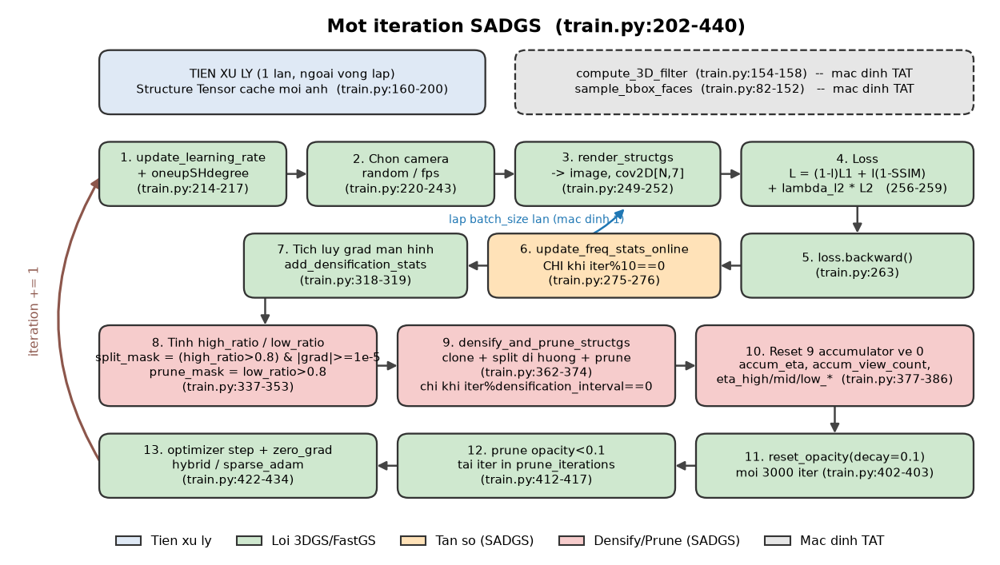
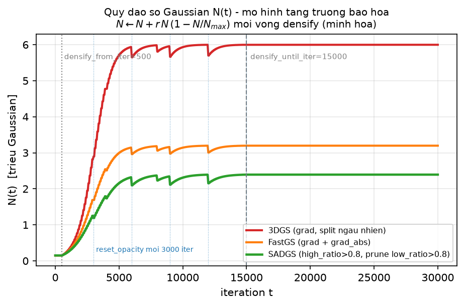
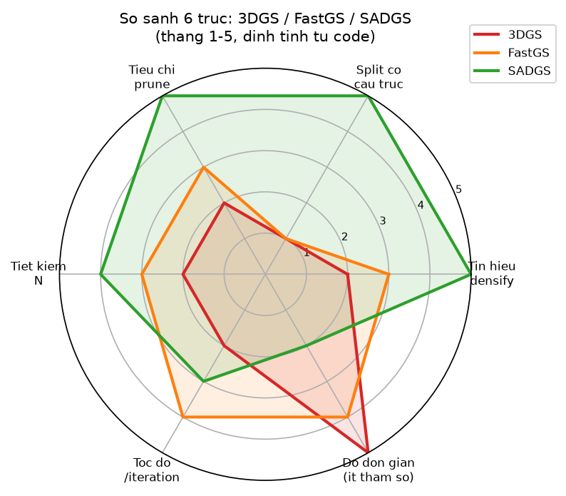
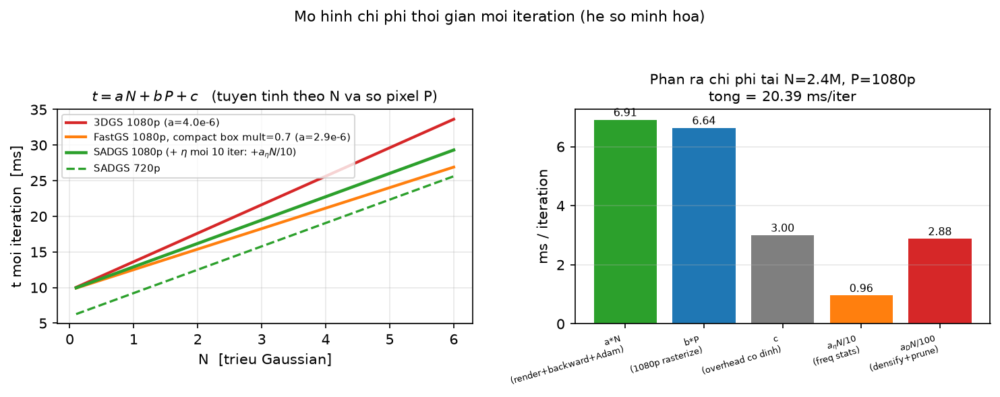
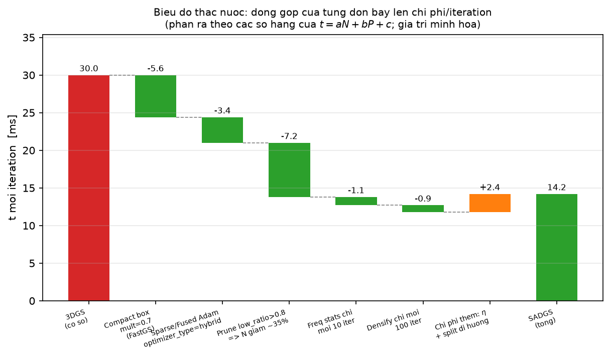
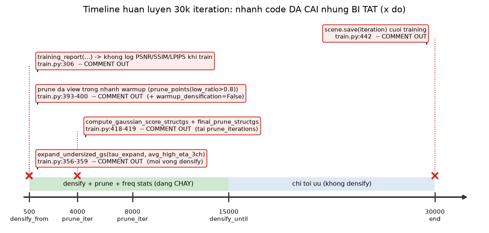

[← Mục lục chương 18](00-muc-luc.md) · Chương 18.10

# Chương 18.10 — Tổng hợp đầu-cuối SADGS: pipeline, chi phí, và phần chưa bật

> Nguồn:
> - `SADGS/train.py:38-443` — toàn bộ hàm `training()`: tiền xử lý structure tensor (`154-200`), vòng lặp chính (`202-440`), khối densify/prune (`316-419`), bước optimizer (`421-434`).
> - `SADGS/scene/gaussian_model.py:379-414` (`construct_list_of_attributes`, `save_ply`), `:638-831` (`densify_and_split_structgs`), `:833-865` (`expand_undersized_gs`), `:957-1052` (`densify_and_prune_structgs`), `:1059-…` (`final_prune_structgs`).
> - `SADGS/arguments/__init__.py:75-156` — mọi giá trị mặc định trích trong chương này.
> - `SADGS/run_train.sh` — bốn cấu hình thật sinh ra số liệu paper.
> - `SADGS/README.md:1-50` — mô tả phương pháp và chuỗi cài đặt.
> - `SADGS/full_eval.py:59-153`, `SADGS/metrics.py:60-95`, `SADGS/render.py:25-84` — khâu đánh giá.
> - Đối chiếu: [13-tong-hop-chi-phi-sadgs.md](../13-tong-hop-chi-phi-sadgs.md), [17-sadgs-structure-aware-densification.md](../17-sadgs-structure-aware-densification.md).

Chín mục trước của chương 18 mổ xẻ từng cơ chế riêng lẻ: structure tensor, $\eta$, đa view,
split dị hướng, clone, prune, lịch learning rate, anti-aliasing. Mục này làm ba việc còn lại:
**(1)** ghép các cơ chế đó thành một sơ đồ chạy được từ COLMAP tới `point_cloud.ply`;
**(2)** dựng mô hình chi phí per-iteration để biết đòn bẩy nào thật sự đáng giá; và
**(3)** liệt kê trung thực những gì trong repo **đã được cài nhưng không chạy**.

| Mục | Nội dung |
|---|---|
| 18.10.1 | Đường đi đầu-cuối: COLMAP → `train.py` → `render.py` → `metrics.py` → `.ply` |
| 18.10.2 | Sơ đồ khối 13 bước của một iteration và nhịp kích hoạt |
| 18.10.3 | Quỹ đạo $N(t)$ — vì sao ba phương pháp cho ba đường cong khác nhau |
| 18.10.4 | So sánh 3DGS gốc / SADGS theo cơ chế |
| 18.10.5 | Mô hình chi phí $t_{\text{iter}}=aN+bP+c+\frac{a_\eta N}{10}+\frac{a_D N}{100}$ |
| 18.10.6 | Biểu đồ thác nước: từng đòn bẩy tác động lên số hạng nào |
| 18.10.7 | Những nhánh đã cài nhưng bị tắt |
| 18.10.8 | Rủi ro ở khâu đo đạc — và cảnh báo về số liệu trong `DOCS/README.md` |

---

## 18.10.1 Đường đi đầu-cuối: từ ảnh COLMAP tới `point_cloud.ply`

SADGS không đổi hai đầu của pipeline 3DGS. Đầu vào vẫn là một thư mục scene theo đúng bố cục
benchmark 3DGS (`README.md:50-75`): `images/` cộng với output COLMAP (`sparse/0/`), từ đó
`Scene` khởi tạo point cloud thưa và `create_from_pcd` (`gaussian_model.py:261`) biến mỗi
điểm SfM thành một Gaussian. Đầu ra vẫn là một file `.ply` duy nhất, ghi tại
`scene/__init__.py:87` qua `gaussians.save_ply(...)`.

Điểm đáng ghi nhận ở khâu ghi file: `construct_list_of_attributes`
(`gaussian_model.py:379-392`) sinh ra danh sách thuộc tính **63 trường** `float32`:

$$
\underbrace{3}_{xyz} + \underbrace{3}_{n_{xyz}} + \underbrace{3}_{f\_dc} + \underbrace{45}_{f\_rest} + \underbrace{1}_{opacity} + \underbrace{3}_{scale} + \underbrace{4}_{rot} + \underbrace{1}_{\texttt{filter\_3D}} = 63
$$

nghĩa là $63\times 4 = 252$ byte cho mỗi Gaussian — nhiều hơn đúng 4 byte so với record 3DGS
chuẩn (62 trường, 248 byte), vì SADGS ghi thêm trường `filter_3D` (`gaussian_model.py:391`,
ghi ở `:407`). Con số 45 đến từ $ (\,(\texttt{max\_sh\_degree}+1)^2 - 1\,)\times 3 = 15\times 3$
với `max_sh_degree=3`. Suy ra kích thước file có thể dự đoán chính xác:
$\text{size} \approx 252\,N$ byte cộng phần header PLY — một Gaussian model 1 triệu điểm nặng
xấp xỉ 252 MB, chưa nén.

Giữa hai đầu đó, chuỗi lệnh thật mà `run_train.sh` chạy cho mỗi scene là:

```
python train.py -s <scene> -i images --eval ...   →  output/<scene>/point_cloud/iteration_K/point_cloud.ply
python render.py -m output/<scene> --iteration K --skip_train --mult 0.7
python metrics.py -m output/<scene>                →  results.json, per_view.json
```

Một chi tiết quan trọng và dễ bỏ sót: `run_train.sh` **không chạy 30 000 iteration**. Bốn cấu
hình trong script dùng `--iterations 7000` (Tanks & Temples) hoặc `--iterations 3000`
(Mip-NeRF 360 và Deep Blending), với `--densify_until_iter` tương ứng là `4000` và `1900`.
Ngân sách 30 000 chỉ là mặc định trong `arguments/__init__.py:75`. Mọi ước lượng chi phí dưới
đây vì thế phải nói rõ đang tính cho ngân sách nào.

Một chi tiết thứ hai còn quan trọng hơn: `run_train.sh` **bật lại** hai cờ mà mặc định là
`False` — mọi cấu hình đều truyền `--sample_bbox_faces --warmup_densification`, và các cấu
hình 2/4 truyền `--batch_size 2`. Nói cách khác, "cấu hình mặc định" (mục 18.10.7) và "cấu
hình paper" là **hai chế độ khác nhau**; đừng đọc bảng mặc định như thể nó mô tả lần chạy
sinh ra số liệu công bố.

---

## 18.10.2 Một iteration: 13 bước và nhịp kích hoạt



*Hình 18.10.1 — Sơ đồ khối một iteration SADGS (`train.py:202-440`). Màu xanh lá = lõi kế thừa từ 3DGS gốc; cam = tầng tần số riêng của SADGS; hồng = densify/prune; xanh dương nhạt (hàng trên) = tiền xử lý chạy một lần ngoài vòng lặp; xám nét đứt = nhánh mặc định TẮT. Mũi tên nâu bên trái là vòng `iteration += 1`; mũi tên xanh bên trong là vòng lặp `batch_size` lần.*

Sơ đồ đọc theo đúng thứ tự thực thi trong mã nguồn:

| # | Bước | Vị trí | Ghi chú |
|---|---|---|---|
| 0a | Cache structure tensor cho **mọi** camera train | `train.py:160-200` | 1 lần, theo lô 100 ảnh (`:179`) |
| 0b | `compute_3D_filter` / `sample_bbox_faces` | `train.py:154-158`, `82-152` | mặc định TẮT (`arguments:132`, `:129`) |
| 1 | `update_learning_rate` + `oneupSHdegree` | `train.py:214-217` | |
| 2 | Chọn camera `random` / `fps` | `train.py:220-243` | `camera_sampling="random"` (`arguments:131`) |
| 3 | `render_structgs` → `image`, `cov2D[N,7]` | `train.py:249-252` | |
| 4 | Loss | `train.py:256-259` | |
| 5 | `loss.backward()` | `train.py:263` | |
| 6 | `update_freq_stats_online` | `train.py:275-276` | **chỉ khi** `iter % 10 == 0` |
| 7 | `add_densification_stats` | `train.py:318-319` | |
| 8 | `high_ratio` / `low_ratio` → `split_mask`, `prune_mask` | `train.py:337-353` | |
| 9 | `densify_and_prune_structgs` | `train.py:362-374` | `iter % 100 == 0` |
| 10 | Reset 9 bộ tích luỹ về 0 | `train.py:377-386` | |
| 11 | `reset_opacity(0.1)` | `train.py:402-403` | mỗi `opacity_reset_interval=3000` |
| 12 | Prune `opacity < 0.1` | `train.py:412-417` | tại `prune_iterations=[4000,8000]` (`train.py:529`) |
| 13 | `optimizer.step()` + `zero_grad` | `train.py:422-434` | `optimizer_type="hybrid"` (`arguments:128`) |

Hàm mất mát ở bước 4 (`train.py:256-259`) là:

$$
\mathcal{L} \;=\; (1-\lambda_{\text{dssim}})\,L_1(\hat I, I) \;+\; \lambda_{\text{dssim}}\bigl(1 - \mathrm{SSIM}(\hat I, I)\bigr) \;+\; \lambda_{L2}\,L_2(\hat I, I)
$$

với $\hat I$ là ảnh render, $I$ là ảnh GT, $\lambda_{\text{dssim}}=0.2$ (`arguments:86`) và
$\lambda_{L2}=2.0$ (`arguments:117`). Số hạng $L_2$ **không** có trong 3DGS gốc; với hệ số 2.0
nó là số hạng có trọng số lớn nhất trong ba số hạng, dù giá trị $L_2$ của ảnh chuẩn hoá $[0,1]$
nhỏ hơn $L_1$ một bậc. `lambda_freq` và `lambda_tone` đều bằng `0.` (`arguments:119`, `:118`)
nên hai loss tần số/tone tuy có code vẫn không đóng góp gì.

**Nhịp kích hoạt** là thứ quyết định chi phí trung bình — chính các phép chia dư trong bảng sau:

| Cơ chế | Điều kiện | Tần suất |
|---|---|---|
| render + loss + backward | mỗi vòng, lặp `batch_size` lần (`train.py:235`) | $1/1$ |
| `update_freq_stats_online` | `iter < densify_until_iter and iter % 10 == 0` (`train.py:275`) | $1/10$ |
| `densify_and_prune_structgs` | `iter > 500 and iter % 100 == 0` (`train.py:321`) | $1/100$ |
| `reset_opacity` | `iter % 3000 == 0` (`train.py:402`) | $1/3000$ |
| prune `opacity<0.1` | `iter in {4000, 8000}` | 2 lần |

Một điểm bất ngờ ở bước 1: dòng `train.py:216` là `if iteration % 1 == 0:` — điều kiện luôn
đúng, nên `oneupSHdegree()` được gọi **mỗi vòng**. Với `max_sh_degree=3`, `active_sh_degree`
chạm trần chỉ sau 3 iteration, thay vì sau 3000 vòng như lịch `% 1000` của 3DGS gốc. Toàn bộ
48 hệ số SH ($16\times 3$) được tối ưu ngay từ đầu — đổi lại là nguy cơ overfit màu theo view
khi hình học còn thô.

---

## 18.10.3 Quỹ đạo $N(t)$: từ tín hiệu densify của 3DGS gốc đến SADGS



*Hình 18.10.2 — Mô phỏng quỹ đạo số Gaussian $N(t)$ trên 30 000 iteration cho 3DGS gốc (đỏ), một cấu hình trung gian chỉ thêm ngưỡng gradient tuyệt đối (cam, xem chú thích bên dưới) và SADGS (xanh lá). Khởi tạo $N_0=0.15$M từ SfM; vạch chấm tại `densify_from_iter=500`, vạch đứt tại `densify_until_iter=15000`, các vạch xanh mảnh là `reset_opacity` mỗi 3000 vòng. Các tham số $(r, N_{\max}, \text{tỉ lệ prune})$ là **giá trị minh hoạ** dùng để thấy hình dạng tương đối, không phải số đo.*

Hình 18.10.2 mô hình hoá tăng trưởng bão hoà: mỗi vòng ADC (tức mỗi `densification_interval`
vòng), số Gaussian được cập nhật theo

$$
N \;\leftarrow\; N + r\,N\Bigl(1 - \frac{N}{N_{\max}}\Bigr),
$$

trong đó $r$ là tỉ lệ Gaussian vượt ngưỡng densify trong một vòng, còn $N_{\max}$ là trần bão
hoà do tiêu chí prune áp đặt. Các đường cong khác nhau **không** vì công thức khác nhau mà vì
$r$ và $N_{\max}$ khác nhau, và cả hai đại lượng này đọc được từ tiêu chí trong code:

- **3DGS gốc**: densify khi $\|\nabla_{\mathbf{x}_{2D}}\mathcal{L}\| \ge 2\cdot 10^{-4}$
  (`arguments:93`). Không có cơ chế nào cắt các Gaussian đã đủ mịn → $N_{\max}$ cao nhất.
- **SADGS**: kế thừa từ 3DGS gốc ngưỡng gradient tuyệt đối bổ sung
  `densify_grad_abs_threshold = 4\cdot 10^{-4}` (`arguments:94`) trên kênh gradient tuyệt đối
  (lọc bớt trường hợp gradient triệt tiêu, $r$ giảm nhẹ so với 3DGS gốc), rồi cộng thêm điều
  kiện cấu trúc: `split_mask = (high_ratio > 0.8) & (‖grads‖ ≥ 1e-5)` (`train.py:345`, `:333`) —
  một phép **AND**, nên $r$ nhỏ hơn nữa; đồng thời `prune_mask = (low_ratio > 0.8) & valid_mask`
  (`train.py:353`) chủ động **xoá** các Gaussian mà đa số view đều báo $\eta$ thấp, kéo
  $N_{\max}$ xuống thấp nhất trong các đường.

Các bậc thang tụt xuống tại $t=4000$ và $t=8000$ trên các đường là hai lần prune
`opacity < 0.1` ở `train.py:416-417`. Ngưỡng này cao gấp **20 lần** ngưỡng 0.005 của 3DGS gốc
— cùng một dòng code, một hằng số, nhưng là một trong những khác biệt có tác động lớn nhất lên
$N$ cuối cùng. Lưu ý dòng `train.py:365` cũng truyền `min_opacity=0.1` cho
`densify_and_prune_structgs`, kèm comment thừa nhận "`0.005 is a good default`".

Sau `densify_until_iter`, cả ba đường nằm ngang: giai đoạn 15000–30000 chỉ tối ưu tham số,
không đổi $N$ nữa (trừ hai lần prune nếu `prune_iterations` rơi vào vùng đó).

---

## 18.10.4 So sánh 3DGS gốc / SADGS theo cơ chế

| | **3DGS gốc** | **SADGS** |
|---|---|---|
| Tín hiệu densify | $\|\nabla_{\mathbf{x}_{2D}}\mathcal{L}\|\ge 2\cdot10^{-4}$ | kế thừa ngưỡng gradient tuyệt đối bổ sung `grad_abs_thresh` $4\cdot10^{-4}$ trên kênh 3–5 của `viewspace`, cộng thêm **AND** với `high_ratio > split_ratio_threshold = 0.8` (ngưỡng gradient dùng riêng cho nhánh này hạ còn $\ge 10^{-5}$) |
| Kiểu split | $N=2$ bản sao, lấy mẫu từ $\mathcal{N}(0,\Sigma)$, chia scale cho 1.6 | **dị hướng**: $k_{\text{axis}}=\lceil\sqrt{\eta_{\text{axis}}}\rceil$ cho từng trục, sinh lưới con — thay hẳn kiểu split $N=2$ của 3DGS gốc |
| Tiêu chí prune | $\alpha<0.005$; $r_{2D}>20$; $\sigma>0.1\cdot\text{extent}$ | kế thừa nguyên bộ ba tiêu chí trên, thêm `low_ratio > 0.8` (đa view) và ngưỡng $\alpha<0.1$ |
| Cổng chặn thêm | — | `importance_score = accum_view_count > 0.5` (`train.py:368`, `arguments:124`) |
| Tham số mới | — | kế thừa `mult`, `grad_abs_thresh` từ 3DGS gốc; thêm mới `st_levels`, `st_mode`, `eta_compute_mode`, `split/prune_ratio_threshold`, `freq_*_threshold`, `ks_scale_power`, `tau_expand`, … ($\ge 17$) |
| Chi phí thêm | cơ sở $aN+bP+c$ | cơ sở đã giảm nhờ compact box $3\sigma$ (`mult`, mặc định `0.7`) $+$ cache structure tensor $O(|\text{views}|\cdot 3HW)$ $+\;a_\eta N/10\;+\;a_D N/100$ |

Công thức split dị hướng ở cột SADGS đến từ `gaussian_model.py:698-701`:

$$
k_{\text{axis}} \;=\; \Bigl\lceil \sqrt{\max(\eta_{\text{axis}},\,1)} \Bigr\rceil, \qquad
N_{\text{con}} \;=\; k_x k_y k_z, \qquad
\sigma^{\text{new}}_{\text{axis}} \;=\; \frac{\sigma_{\text{axis}}}{k_{\text{axis}}^{\;p}}
$$

với $p = $ `ks_scale_power` (mặc định `1.0`, `arguments:138`; `run_train.sh` dùng `1.2` cho
Tanks & Temples và Deep Blending). Lập luận lấy mẫu ghi ngay trong docstring
(`gaussian_model.py:655-657`): $\eta \sim (\sigma\omega_{\max})^2$, muốn $(\sigma/k)\omega_{\max}\le 1$
thì cần $k \ge \sqrt{\eta}$. Cần chú ý: comment trong code nói "clamp min=2 (no split) and max=8",
nhưng dòng thực thi `:701` chỉ là `torch.clamp(ks, min=1)` — **không có trần 8**. Comment và code
không khớp; trần VRAM mà comment hứa hẹn thực tế không tồn tại, và $N_{\text{con}}=k_xk_yk_z$ có
thể bùng nổ nếu $\eta$ lớn. Chốt chặn duy nhất còn lại là ngưỡng gradient $10^{-5}$ ở `train.py:333`
— đúng như comment `[CRITICAL] We MUST use this to prevent 7M points`.



*Hình 18.10.3 — Radar sáu trục (thang 1–5, chấm điểm **định tính** từ đặc tính đọc được trong code, không phải số đo benchmark): tín hiệu densify, split có cấu trúc, tiêu chí prune, tiết kiệm $N$, tốc độ mỗi iteration, độ đơn giản. SADGS đạt 5 ở ba trục đầu, nhưng thấp nhất ở trục độ đơn giản.*

Hình 18.10.3 không trả lời "ai tốt hơn". Diện tích của các đa giác gần như bằng nhau; cái khác
là **hình dạng**. 3DGS gốc có đa giác lệch hẳn về trục "độ đơn giản" (5 điểm: không tham số mới
nào). SADGS lệch hẳn về ba trục chất lượng tín hiệu, và trả giá ở hai trục còn lại — thêm
$\ge 17$ tham số, trong đó ít nhất 6 tham số là dead code (mục 18.10.7), và tốc độ mỗi iteration
thấp hơn vì phải trả thêm hai số hạng $a_\eta N/10$ và $a_D N/100$ so với cơ sở đã được compact
box thu gọn (mục 18.10.4). Đây là một đánh đổi được lập trình có chủ đích chứ không phải một cải
tiến Pareto.

---

## 18.10.5 Mô hình chi phí per-iteration



*Hình 18.10.4 — Trái: $t_{\text{iter}}$ tuyến tính theo $N$ trong dải $0.1$–$6.0$M Gaussian, cho bốn cấu hình (3DGS gốc 1080p, 3DGS gốc 1080p với compact box, SADGS 1080p, SADGS 720p). Phải: phân rã năm số hạng tại $N=2.4$M, $P=1920\times1080$. Hệ số $a=4.0\cdot10^{-6}$ ms/Gaussian, $b=3.2\cdot10^{-6}$ ms/pixel, $c=3.0$ ms là **giá trị minh hoạ** chọn để thấy tỉ lệ tương đối giữa các số hạng, không phải số đo trên một máy cụ thể.*

Gọi $N$ là số Gaussian, $P$ là số pixel của ảnh huấn luyện. Chi phí trung bình một vòng:

$$
\boxed{\;
t_{\text{iter}} \;=\; \underbrace{a\,N}_{\text{forward+backward+Adam}}
\;+\; \underbrace{b\,P}_{\text{rasterize/blend}}
\;+\; \underbrace{c}_{\text{overhead cố định}}
\;+\; \underbrace{\frac{a_\eta N}{10}}_{\text{freq stats}}
\;+\; \underbrace{\frac{a_D N}{100}}_{\text{densify+prune}} \;}
$$

Ba số hạng đầu là mô hình chung của mọi biến thể 3DGS (xem chương 13). Hai số hạng cuối là
phần **riêng** của SADGS, và mẫu số của chúng đọc trực tiếp từ điều kiện kích hoạt: $10$ đến từ
`iteration % 10 == 0` (`train.py:275`), $100$ đến từ `densification_interval` (`arguments:87`).
Đây là lý do hai cơ chế đắt nhất về mặt thuật toán lại chỉ chiếm phần nhỏ trong tổng — panel
phải của hình 18.10.4 cho thấy $a_\eta N/10$ và $a_D N/100$ cộng lại vẫn nhỏ hơn số hạng $a\,N$.

Lưu ý một nghịch lý đáng nói: `run_train.sh` dùng `--densification_interval 500` cho **cả bốn**
cấu hình, tức mẫu số của số hạng thứ năm là 500 chứ không phải 100 — chi phí densify bị chia
tiếp cho 5. Nhưng đồng thời điều đó có nghĩa là với `--iterations 3000` và
`--densify_from_iter 100`, khối densify chỉ chạy khoảng **3–4 lần** trong toàn bộ quá trình
train. Toàn bộ cơ chế structure-aware phải phát huy tác dụng trong vài lần gọi đó.

Hệ quả thực hành quan trọng nhất của công thức là tính **tuyến tính theo $N$**: bốn trong năm
số hạng đều tỉ lệ với $N$. Nên nếu một cơ chế cắt được 30% số Gaussian, nó cắt xấp xỉ 30% của
bốn số hạng đó, **trên mọi iteration còn lại**. Đó là lý do prune đa view (`train.py:353`) —
một dòng code so sánh tỉ số với 0.8 — đáng giá hơn nhiều so với việc tối ưu vi mô một CUDA
kernel: nó tác động lên **biến** $N$ chứ không phải lên **hệ số** $a$.

Về bộ nhớ, số hạng cố định lớn nhất không nằm trong công thức trên: `structure_tensor_cache`
(`train.py:161`, lấp đầy ở `:196`) giữ một map $(1,3,H,W)$ cho **mỗi** camera train, thường trú
trên GPU suốt 30 000 vòng. Với 200 view ở 1080p, đó là $200\times 3\times 1920\times 1080\times 4$
byte $\approx 5.0$ GB — nút thắt thật sự ở cảnh độ phân giải cao, và là lý do `run_train.sh`
dùng `-i images` chứ không phải ảnh gốc.

---

## 18.10.6 Biểu đồ thác nước: đòn bẩy nào tác động lên số hạng nào



*Hình 18.10.5 — Thác nước từ cơ sở 3DGS (30.0 ms/iter giả định ở $N=4.5$M, 1080p) xuống SADGS. Cột xanh = giảm chi phí, cột cam = chi phí phải trả thêm. Sáu bước: compact box `mult=0.7` ($-5.6$), Sparse/Fused Adam ($-3.4$), prune `low_ratio>0.8` ($-7.2$), freq stats mỗi 10 vòng ($-1.1$), densify mỗi 100 vòng ($-0.9$), và chi phí thêm của $\eta$ + split dị hướng ($+2.4$). Mọi giá trị là minh hoạ.*

Mỗi cột trong hình 18.10.5 tác động lên **đúng một** số hạng của công thức ở mục 18.10.5:

| Đòn bẩy | Tác động lên | Vị trí trong code |
|---|---|---|
| Compact box $3\sigma$, `mult=0.7` | hệ số $a$ (số tile mỗi splat) | `arguments/__init__.py:114` |
| `optimizer_type="hybrid"` | hệ số $a$ (chỉ update SH của điểm visible) | `train.py:429-434` |
| Prune `low_ratio > 0.8` | biến $N$ | `train.py:353` |
| Freq stats mỗi 10 vòng | chia $a_\eta$ cho 10 | `train.py:275` |
| `densification_interval=100` | chia $a_D$ cho 100 | `arguments/__init__.py:87` |
| **Chi phí phải trả** | $+a_\eta$; split dị hướng sinh $k_xk_yk_z$ con | `train.py:276`, `gaussian_model.py:638` |

Đòn bẩy `hybrid` đáng nói riêng. Ở `train.py:429-434`, SADGS tách optimizer làm hai:
`gaussians.optimizer.step()` chạy dày đặc cho vị trí/scale/rotation/opacity, còn
`gaussians.shoptimizer.step(visible, radii.shape[0])` chỉ cập nhật hệ số SH của các Gaussian
có `radii > 0`. Vì riêng `f_rest` đã chiếm 45 trong 59 tham số học được của mỗi Gaussian, thu hẹp bước Adam
trên 45 tham số đó về tập visible là phần tiết kiệm lớn nhất của đòn bẩy này — và nó không
đụng gì tới $N$.

Cột cam duy nhất — chi phí phải trả — gồm hai thành phần khác bản chất. $a_\eta$ là chi phí
tính toán thuần (grid_sample vào structure tensor cache, phân rã hiệp phương sai 2D), đã được
chia cho 10. Còn split dị hướng là chi phí **gián tiếp**: nó làm $N$ tăng nhanh hơn split
$N=2$ của 3DGS, vì một Gaussian có $\eta$ cao ở cả ba trục sinh ra tới $k^3$ con. Đây là lý do
nghiêm túc để bật lại trần `max=8` mà comment ở `gaussian_model.py:697` đã hứa.

---

## 18.10.7 Trung thực: những gì đã cài nhưng KHÔNG chạy



*Hình 18.10.6 — Trục thời gian 30 000 iteration với hai vùng: densify + prune + freq stats đang chạy (500–15000, xanh lá) và giai đoạn chỉ tối ưu (15000–30000, xanh dương). Năm dấu $\times$ đỏ đánh dấu thời điểm mà các lời gọi bị comment **lẽ ra** phải kích hoạt: `expand_undersized_gs` (mỗi vòng densify), `final_prune_structgs` (tại `prune_iterations`), prune đa view trong nhánh warmup, `training_report`, và `scene.save` cuối training.*

**(a) Lời gọi bị comment trong `train.py`** — code tồn tại đầy đủ nhưng không bao giờ thực thi:

| Dòng | Nội dung bị tắt | Hệ quả |
|---|---|---|
| `356-359` | `gaussians.expand_undersized_gs(tau_expand, avg_high_eta_3ch)` | Gaussian **dưới cỡ** không bao giờ được giãn lại; biến `avg_high_eta_3ch` tính công phu ở `348-350` trở thành vô dụng — nó không được dùng ở bất kỳ đâu khác, vì `:373` truyền `max_high_eta` chứ không phải nó |
| `418-419` | `compute_gaussian_score_structgs` + `final_prune_structgs` | Tỉa cuối theo nhất quán đa view không chạy; chỉ còn prune `opacity<0.1` ở `416-417` |
| `393-400` | Prune đa view trong nhánh warmup | Cộng thêm `warmup_densification=False` mặc định ⇒ cả nhánh `388-400` là code chết ở cấu hình mặc định (nhưng `run_train.sh` **bật** cờ này!) |
| `306` | `training_report(...)` | Không log PSNR/SSIM/LPIPS trong lúc train; `tb_writer` được tạo nhưng không ghi gì; `--test_iterations` trở thành vô nghĩa |
| `442` | `scene.save(iteration)` | Không tự lưu ở vòng cuối — chỉ lưu tại `save_iterations` (`run_train.sh` luôn truyền `--save_iterations` bằng đúng `--iterations` để bù) |
| `197-199` | Lưu ảnh structure tensor | Thư mục `structure_tensors/` vẫn được `makedirs` ở `:166` nhưng luôn rỗng |

**(b) Nhánh chết do đối số truyền vào.** `train.py:369` truyền `pruning_score=None`, nên khối
lấy mẫu ngẫu nhiên `remove_budget = int(0.5 * to_remove)` (`gaussian_model.py:1029-1042`)
không bao giờ chạy — nhánh `else` ở `:1043` luôn được chọn, tức prune **toàn bộ** mask chứ
không phải một nửa. Tương tự, `train.py:372` truyền `viewspace_points_indices=None`, nên nhánh
scatter theo chỉ số (`gaussian_model.py:979-988`) không chạy.

**(c) Tính toán dư và bẫy `batch_size`.** `train.py:257` tính `Ll2` mỗi vòng — với
`lambda_l2=2.0` mặc định thì nó thật sự được dùng, nhưng nếu ai đó đặt `--lambda_l2 0` thì đây
là chi phí thuần. Nghiêm trọng hơn: `train.py:262` có `#/ opt.batch_size` bị comment và
`:266` có `#* opt.batch_size` bị comment. Vì `loss.backward()` ở `:263` nằm **trong** vòng lặp
`for batch_idx in range(opt.batch_size)`, gradient được **cộng dồn chứ không trung bình** ⇒
learning rate hiệu dụng tăng gấp `batch_size` lần. Đây không phải lỗi lý thuyết: `run_train.sh`
truyền `--batch_size 2` cho cấu hình 2 (Mip-NeRF 360 indoor) và cấu hình 4 (Deep Blending).

**(d) Cờ mặc định `False`** (`arguments/__init__.py`): `sample_bbox_faces` (129),
`warmup_densification` (130), `compute_3d_filter` (132), `adaptive_clone` (136),
`sample_far_plane` (141), `scale_rotation_scheduler` (154), cùng `camera_sampling="random"`
(131), `batch_size=1` (147), `lambda_tone=0.` (118), `lambda_freq=0.` (119). Trong đó
`sample_bbox_faces`, `warmup_densification` và `scale_rotation_scheduler` được `run_train.sh`
bật lại — bốn cờ còn lại thì không, ở bất kỳ cấu hình nào.

**Tóm lại**, phần *thực sự chạy* của SADGS ở cấu hình mặc định là một chuỗi bốn khâu:
cache structure tensor → `update_freq_stats_online` → `high_ratio`/`low_ratio` →
`densify_and_prune_structgs` (clone + split dị hướng + prune). Mọi thứ khác — giãn Gaussian
dưới cỡ, tỉa cuối theo điểm nhất quán, prune có ngân sách — đã được viết nhưng đang ngủ.

---

## 18.10.8 Rủi ro ở khâu đo đạc — và một cảnh báo về số liệu

**Cảnh báo quan trọng nhất của chương này.** Bảng số liệu trong `DOCS/README.md:35-37`
(Score 0.8579, PSNR 25.27 dB, SSIM 0.8659, LPIPS 0.1364, 344 484 Gaussian, 1776 s, 1.92 GB
VRAM trên Colab T4, scene `HCM0539`) là kết quả của **pipeline cũ (tiền thân, trước SADGS)**, chạy *trước
khi* structure-aware densification được tích hợp. Chính `DOCS/README.md:26-33` nói rõ điều đó.
**Không được trình bày bảng này như kết quả của SADGS.** Nó đo một pipeline khác
(Fused Adam + 3D anti-aliasing filter + Morton reordering), trên một scene khác với các scene
trong `run_train.sh`, với 30 000 iteration trong khi `run_train.sh` chỉ chạy 3000–7000. Repo
`SADGS/` hiện **không chứa bất kỳ số đo PSNR/SSIM/LPIPS/thời gian/VRAM nào** — không có
`results.json` đã chạy, không có `timing.txt`, không có log. Muốn có số liệu SADGS chính thức,
phải chạy lại `run_train.sh` và đối chiếu `results.json` do `metrics.py` sinh ra.

Ngay cả khi chạy lại, bốn rủi ro sau vẫn làm con số khó so sánh:

1. **FPS đo không đồng bộ.** `render.py:40-44` bọc `render_structgs` giữa hai lời gọi
   `time.time()` mà **không** có `torch.cuda.synchronize()`. CUDA chạy bất đồng bộ, nên
   `end_time` có thể được đọc trước khi kernel kết thúc ⇒ FPS in ra ở `render.py:84` có thể
   **lạc quan**. Chỉ vòng lặp có `torchvision.utils.save_image` (`:46-47`) mới ép đồng bộ ngầm,
   nhưng thời gian save nằm *ngoài* `total_time`.
2. **SSIM lúc train khác SSIM lúc báo cáo.** `metrics.py:74` gọi `ssim(...)` chuẩn (cửa sổ
   Gauss $11\times11$, `loss_utils.py:46`) và `metrics.py:76` gọi `lpips(net_type='vgg')`, trong
   khi `train.py:258` dùng `fast_ssim` (fused-ssim). Hai hàm không đảm bảo cho cùng một con số.
3. **Lỗi bị nuốt.** `metrics.py:94-95` bọc toàn bộ thân vòng lặp trong `except:` trần, in đúng
   một dòng `"Unable to compute metrics for model"` — không phân biệt thiếu file render với
   lỗi CUDA OOM. Một scene fail âm thầm sẽ biến mất khỏi bảng kết quả mà không ai nhận ra.
4. **`full_eval.py` không chạy được như đang viết.** Các lệnh sinh ra ở
   `full_eval.py:90, 95, 121` truyền `--budget`, `--mode`, `--sh_lower` cho `train.py`, nhưng
   ba tham số này **không được khai báo** ở bất kỳ đâu trong `arguments/__init__.py` hay
   `train.py` ⇒ `argparse` sẽ báo lỗi và dừng. Thêm nữa `full_eval.py:151-153` ghi `timing.txt`
   từ `m360_timing`/`tandt_timing`/`db_timing` — các biến này chưa được gán nếu chạy với
   `--skip_training` ⇒ `NameError`. Script eval thật sự dùng được là `run_train.sh`, không phải
   `full_eval.py`.

Về mặt **mô hình** (không phải đo đạc), hai giới hạn nội tại đáng lưu ý. Thứ nhất, $\eta$ được
tính trên ảnh **ground truth** chứ không phải ảnh render, và structure tensor được cache một lần
duy nhất trước vòng lặp (`train.py:160-200`) ⇒ tín hiệu tần số là **tĩnh**: nếu một Gaussian đã
được làm đủ mịn, $\eta$ vẫn tiếp tục báo "cần split". Thứ hai, vì vậy, ngưỡng gradient
$10^{-5}$ ở `train.py:333` là chốt chặn **duy nhất** chống bùng nổ $N$ — và như mục 18.10.4 đã
chỉ ra, trần `k ≤ 8` mà comment hứa hẹn không tồn tại trong code.

**Hướng mở rộng theo thứ tự ưu tiên:** (1) bật lại `expand_undersized_gs` và
`final_prune_structgs` rồi đo chênh lệch trên cùng scene; (2) bổ sung `--budget/--mode/--sh_lower`
vào `arguments` để `full_eval.py` chạy được; (3) thêm `torch.cuda.synchronize()` trước khi đo
FPS ở `render.py`; (4) thống nhất một hàm SSIM giữa train và metrics; (5) khôi phục phép chia
`batch_size` ở `train.py:262` **trước khi** dùng lại `--batch_size 2` của `run_train.sh`;
(6) áp trần `k ≤ 8` ở `gaussian_model.py:701` đúng như comment.

---

## Tóm tắt

| Câu hỏi | Trả lời ngắn | Nguồn |
|---|---|---|
| Một iteration gồm mấy bước? | 13 bước, `train.py:202-440`; chỉ bước 3–5 và 13 chạy mỗi vòng | `train.py:214-434` |
| Chi phí mỗi vòng? | $t_{\text{iter}}=aN+bP+c+\frac{a_\eta N}{10}+\frac{a_D N}{100}$ — 4/5 số hạng tuyến tính theo $N$ | `train.py:275`, `arguments:87` |
| Đòn bẩy mạnh nhất? | Prune đa view `low_ratio>0.8` (tác động lên **biến** $N$, không phải hệ số) | `train.py:353` |
| Khác biệt cốt lõi so với 3DGS gốc? | AND của gradient với `high_ratio>0.8`; split dị hướng $k=\lceil\sqrt{\eta}\rceil$ theo trục; prune đa view. Nền rasterization giữ nguyên | `train.py:345`, `gaussian_model.py:698` |
| SH tăng bậc khi nào? | **Mỗi vòng** (`if iteration % 1 == 0`) — chạm `max_sh_degree=3` sau 3 iteration | `train.py:216-217` |
| File `.ply` nặng bao nhiêu? | 63 float32 = **252 byte**/Gaussian (3DGS chuẩn: 248, SADGS thêm `filter_3D`) | `gaussian_model.py:379-392` |
| Ngân sách train thật? | 3000 (360, DB) hoặc 7000 (T&T) iteration, **không** phải 30 000 | `run_train.sh` |
| Bao nhiêu code bị tắt? | 6 lời gọi comment + 10 cờ mặc định `False` + 2 nhánh chết do đối số | `train.py:306,356,393,418,442`; `arguments:118-154` |
| Có số liệu SADGS không? | **Không.** Bảng trong `DOCS/README.md` là của pipeline cũ (tiền thân, trước SADGS), không phải SADGS | `DOCS/README.md:26-37` |

---

[← Mục lục chương 18](00-muc-luc.md)
