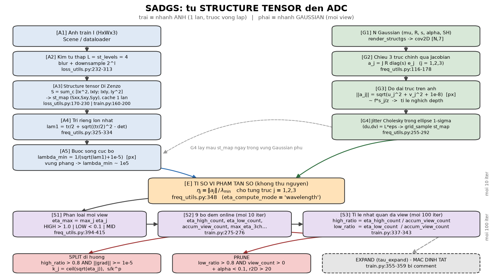
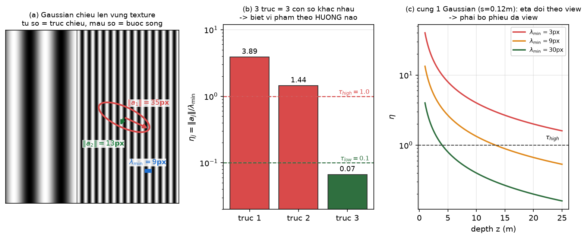
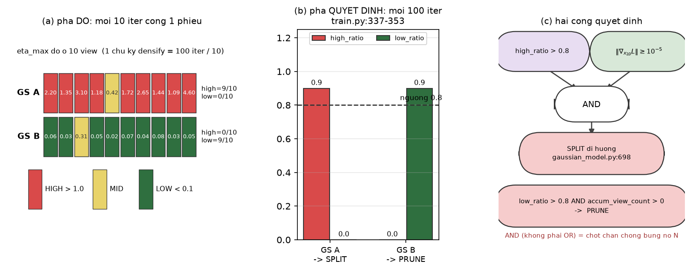
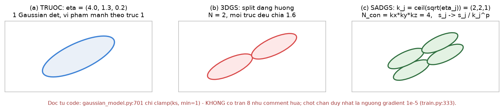

[← Mục lục chương 18](00-muc-luc.md) · Chương 18.11

# Chương 18.11 — Bản đồ toàn tuyến: từ structure tensor đến ADC

> Nguồn:
> - `SADGS/utils/loss_utils.py:170-230` — `get_structure_tensor_torch` (Di Zenzo).
> - `SADGS/utils/loss_utils.py:232-313` — `get_multiscale_structure_tensor_v1` (kim tự tháp `st_levels=4`).
> - `SADGS/train.py:160-200` — cache structure tensor cho mọi camera train, **một lần**, trước vòng lặp.
> - `SADGS/utils/freq_utils.py:116-178` — `compute_projected_axes_subset` (chiếu 3 trục chính).
> - `SADGS/utils/freq_utils.py:255-292` — jitter Cholesky + `grid_sample` lấy mẫu `st_map`.
> - `SADGS/utils/freq_utils.py:313-348` — $\lambda_1 \to \lambda_{\min} \to \eta_j$.
> - `SADGS/utils/freq_utils.py:380-415` — 9 bộ đếm online, `TAU_HIGH=1.0`, `TAU_LOW=0.1`.
> - `SADGS/train.py:275-276, 337-353` — nhịp gọi online và hai mask quyết định.
> - `SADGS/scene/gaussian_model.py:692-701` — $k_j=\lceil\sqrt{\eta_j}\rceil$ và `clamp(ks, min=1)`.
> - Hình: `DOCS/Slides67/figures/sadgsx/scripts/bot16_figs.py`. Slide: `DOCS/Slides67/part_sadgsx_16.tex`.

Mười mục trước của chương 18 đi rất sâu vào từng cơ chế, nhưng đọc tuần tự thì dễ mất mạch:
tại sao một công thức gradient ảnh (Di Zenzo) lại kết thúc ở một lệnh `clamp` trên số lát cắt
Gaussian? Mục này là **bản đồ**: một hình duy nhất nối cả tuyến, rồi ba hình phóng to đúng ba
chỗ mà trực giác hay hụt. Không có công thức mới ở đây — mọi thứ đã xuất hiện ở 18.1–18.4;
cái mới là thứ tự và đơn vị.

| Mục | Nội dung |
|---|---|
| 18.11.1 | Một hình: hai nhánh song song gặp nhau ở $\eta$ |
| 18.11.2 | Năm tầng, và đơn vị đổi ở mỗi tầng |
| 18.11.3 | Vì sao $\eta$ phải là một **tỉ số** |
| 18.11.4 | Vì sao phải bỏ phiếu đa view |
| 18.11.5 | ADC dùng $\eta$ để định *hình dạng* phép chia |

---

## 18.11.1 Một hình: hai nhánh song song gặp nhau ở $\eta$

*Hình 18.11.1 — Toàn tuyến SADGS. Nhánh trái (xanh dương) là **nhánh ảnh**: chạy đúng một lần trước vòng huấn luyện, biến mỗi ảnh train thành `st_map` rồi thành bước sóng cục bộ $\lambda_{\min}$. Nhánh phải (xanh lá) là **nhánh Gaussian**: chạy mỗi view, chiếu ba trục chính của ellipsoid xuống mặt phẳng ảnh. Hai nhánh gặp nhau đúng một chỗ — ô cam $\eta_j=\|a_j\|/\lambda_{\min}$. Tím là tầng thống kê đa view, hồng là ba hành động ADC, xám nét đứt là nhánh mặc định TẮT.*

Ba điều đáng rút ra ngay từ hình:

1. **Nhánh ảnh không phụ thuộc Gaussian.** Nó chỉ phụ thuộc dữ liệu train, nên chạy một lần
   rồi cache (`train.py:160-200`, theo lô 100 ảnh). Chi phí là $O(|\text{views}|\cdot 3HW)$ bộ
   nhớ, trả một lần — đây là lý do SADGS chịu được cái giá của một tầng tần số đầy đủ.
2. **Hai nhánh chỉ gặp nhau ở một phép chia.** Toàn bộ "trí tuệ" của SADGS nằm ở chỗ nó so
   được hai đại lượng *cùng đơn vị pixel* với nhau.
3. **Đo và quyết định tách rời.** Mũi tên đi xuống tầng tím là mỗi 10 iteration; mũi tên từ
   tầng tím sang tầng hồng là mỗi 100 iteration. Không có quyết định nào được lấy từ một
   quan sát đơn lẻ.

---

## 18.11.2 Năm tầng, và đơn vị đổi ở mỗi tầng

| Tầng | Vào | Ra | Đơn vị ra |
|---|---|---|---|
| 1. Structure tensor | ảnh $I$ ($H\times W\times 3$) | `st_map` $(S_{xx},S_{xy},S_{yy})$ | (cường độ/px)$^2$ |
| 2. Bước sóng | $\lambda_1$ của $S$ | $\lambda_{\min}=1/(\sqrt{\lambda_1}+10^{-5})$ | pixel |
| 3. Chiếu trục | $R,\ \mathrm{diag}(s),\ J$ | $\|a_j\|=\sqrt{u_j^2+v_j^2+10^{-8}}$ | pixel |
| 4. Tỉ số | $\|a_j\|$ và $\lambda_{\min}$ | $\eta_j=\|a_j\|/\lambda_{\min}$ | **không thứ nguyên** |
| 5. Bỏ phiếu | $\eta$ qua $M$ view | `high_ratio`, `low_ratio` | tỉ lệ $\in[0,1]$ |

Tầng 4 là mấu chốt và lý do rất cụ thể: $\eta$ là **pixel chia pixel**, nên hai ngưỡng hằng số
$\tau_{high}=1.0$ và $\tau_{low}=0.1$ (`freq_utils.py:394-395`) mới có nghĩa xuyên cảnh. Nếu
tử số còn đơn vị mét, hoặc mẫu số còn là "năng lượng gradient" thô, thì ngưỡng sẽ phải hiệu
chỉnh lại cho từng dataset — và cả kiến trúc siêu tham số của SADGS sẽ sụp.

Một hệ quả dễ bỏ sót của tầng 2: ở vùng phẳng $\lambda_1 \to 0$ nên $\lambda_{\min}\to 10^{5}$ px.
Mẫu số khổng lồ kéo $\eta \to 0$, tức **mọi** Gaussian trên một bức tường trắng đều được xếp
loại LOW. Đó không phải lỗi mà là hành vi mong muốn: không densify vào chỗ không có chi tiết.

---

## 18.11.3 Vì sao $\eta$ phải là một tỉ số

*Hình 18.11.2 — (a) Một ellipse Gaussian đặt lên vùng sọc mịn: tử số là độ dài trục **sau khi chiếu** (35 px, 13 px), mẫu số là bước sóng texture tại chính chỗ đó (9 px). (b) Ba trục cho ba $\eta$ chênh nhau cả bậc độ lớn — trục 1 vượt xa $\tau_{high}$, trục 3 nằm dưới $\tau_{low}$; đây chính là tình huống mà split đẳng hướng của 3DGS không thể phân biệt. (c) Cùng một Gaussian $s=0.12$ m: $\eta\approx f s/(z\lambda_{\min})$ nên $\eta \propto 1/z$, cắt qua $\tau_{high}$ ở những depth hoàn toàn khác nhau tuỳ nền texture. Các con số là minh hoạ.*

Panel (b) trả lời câu hỏi "tại sao phải giữ ba số thay vì một": nhờ ba kênh riêng mà
`gaussian_model.py:699` mới chia được số lát cắt riêng cho từng trục. Nếu chỉ giữ một $\eta$
vô hướng, ta quay về đúng hành vi 3DGS — chia đều cả ba chiều — tức là thứ SADGS sinh ra để
vượt qua. Lưu ý lại một lần nữa: "3 kênh" ở đây là **ba trục chính của ellipsoid**, không phải
ba kênh màu RGB; ba kênh màu đã bị cộng gộp từ bước Di Zenzo (`loss_utils.py:206-208`).

Panel (c) là lý do bắt buộc phải có tầng 5.

---

## 18.11.4 Vì sao phải bỏ phiếu đa view

*Hình 18.11.3 — (a) **Pha đo**: mỗi 10 iteration, một view bỏ đúng một phiếu HIGH/MID/LOW vào 9 bộ đếm (`freq_utils.py:394-415`). Một chu kỳ densify 100 iteration với `batch_size=1` góp đúng $100/10=10$ mẫu view. (b) **Pha quyết định**: mỗi 100 iteration, `train.py:337-343` đổi bộ đếm thành tỉ lệ rồi so với ngưỡng $0.8$. (c) Hai cổng quyết định. Các giá trị $\eta$ trong hình được chọn tay để thấy rõ hai bên ngưỡng.*

Điểm cần nhấn: `split_mask` là một phép **AND**, không phải OR —

$$
\texttt{split\_mask} = \bigl(\texttt{high\_ratio} > 0.8\bigr)\ \wedge\ \bigl(\|\nabla_{\mathbf{x}_{2D}}\mathcal{L}\| \ge 10^{-5}\bigr)
$$

Cổng thứ nhất loại các Gaussian chỉ tình cờ bị chiếu lớn ở một góc nhìn; cổng thứ hai đòi hình
học ở đó thật sự còn sai. Comment trong code nói thẳng về vế thứ hai:
`[CRITICAL] We MUST use this to prevent 7M points` (`train.py:332-333`). Phía prune là

$$
\texttt{prune\_mask} = \bigl(\texttt{low\_ratio} > 0.8\bigr)\ \wedge\ \bigl(\texttt{accum\_view\_count} > 0\bigr)
$$

Vế `accum_view_count > 0` không thừa: một Gaussian chưa từng được view nào nhìn thấy thì
`low_ratio` của nó là 0 chia 0 — không có bằng chứng, nên không được xoá.

Sau khi quyết định xong, cả chín bộ đếm bị `zero_()` (`train.py:377-386`): mỗi chu kỳ densify
bỏ phiếu lại từ đầu trên quần thể Gaussian mới.

---

## 18.11.5 ADC dùng $\eta$ để định *hình dạng* phép chia

*Hình 18.11.4 — (a) Gaussian cha dẹt, $\eta=(4.0,\,1.3,\,0.2)$. (b) 3DGS: hai bản sao lấy mẫu từ $\mathcal{N}(0,\Sigma)$, mọi trục đều chia 1.6 — trục đã đủ mịn vẫn bị chia, trục vi phạm nặng thì chia chưa đủ. (c) SADGS: $k_j=\lceil\sqrt{\max(\eta_j,1)}\rceil=(2,2,1)$, sinh lưới con $N_{\text{con}}=k_xk_yk_z=4$, mỗi trục thu theo $s_j/k_j^{\,p}$.*

Công thức ở `gaussian_model.py:698-701`:

$$
k_j=\Bigl\lceil \sqrt{\max(\eta_j,\,1)} \Bigr\rceil,\qquad
N_{\text{con}}=k_xk_yk_z,\qquad
s^{\text{new}}_j=\frac{s_j}{k_j^{\,p}}
$$

với $p=$ `ks_scale_power` (mặc định `1.0`; `run_train.sh` dùng `1.2` cho Tanks \& Temples và
Deep Blending). Lập luận lấy mẫu ghi ngay trong docstring (`:692-696`): $\eta\sim(\sigma\omega_{\max})^2$,
muốn $(\sigma/k)\,\omega_{\max}\le 1$ thì cần $k\ge\sqrt{\eta}$.

**Cảnh báo đọc thẳng từ code.** Comment ở `:697` hứa "clamp min=2 (no split) and max=8", nhưng
dòng thực thi `:701` chỉ là `torch.clamp(ks, min=1)` — **không có trần 8**. Trần VRAM mà comment
hứa hẹn không tồn tại, và $N_{\text{con}}=k_xk_yk_z$ có thể bùng nổ nếu $\eta$ lớn. Chốt chặn
duy nhất còn lại là ngưỡng gradient $10^{-5}$ ở `train.py:333`.

Nhánh thứ ba trong hình 18.11.1 — `expand_undersized_gs` với `tau_expand` — **mặc định không
chạy**: lời gọi ở `train.py:355-359` đang bị comment. Chi tiết ở [chương 18.6](06-densify-prune-va-final-prune.md).

---

## 18.11.6 Tóm tắt

- SADGS có đúng **hai nhánh**: nhánh ảnh (một lần, cache) và nhánh Gaussian (mỗi view). Chúng
  gặp nhau ở một phép chia duy nhất.
- $\eta_j=\|a_j\|/\lambda_{\min}$ **không thứ nguyên** — đó là điều kiện để ngưỡng hằng số
  $1.0$ và $0.1$ dùng được xuyên cảnh.
- Giữ **ba** $\eta$ thay vì một là toàn bộ lý do SADGS chia được dị hướng.
- Đo (mỗi 10 iter) tách khỏi quyết định (mỗi 100 iter); split đòi **AND** của nhất quán đa
  view với gradient, và đó là chốt chặn chống bùng nổ $N$.
- Code và comment lệch nhau ở `gaussian_model.py:697-701`: không có trần $k=8$.

---

[← 18.10 Tổng hợp đầu-cuối](10-tong-hop-dau-cuoi.md) · [Mục lục chương 18](00-muc-luc.md)
