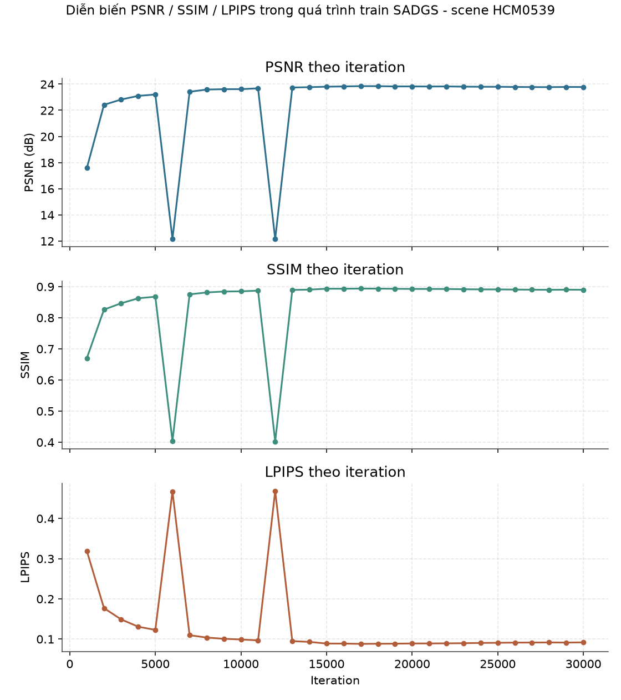
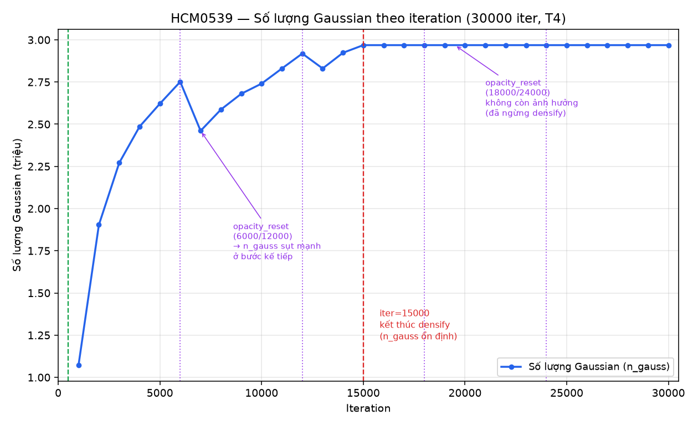
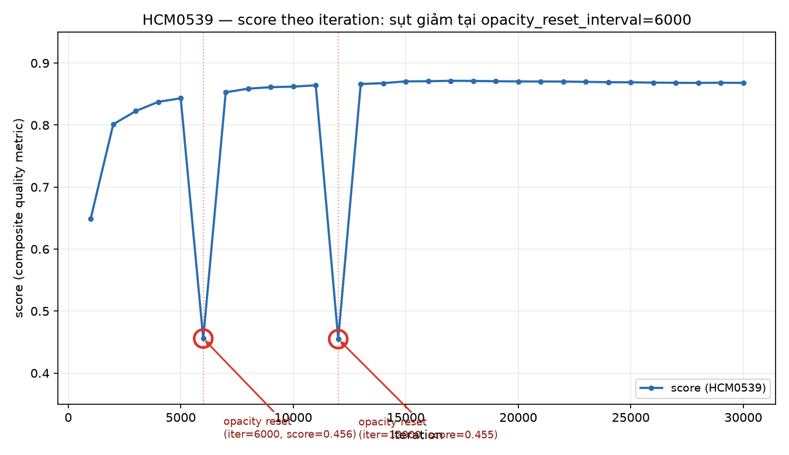
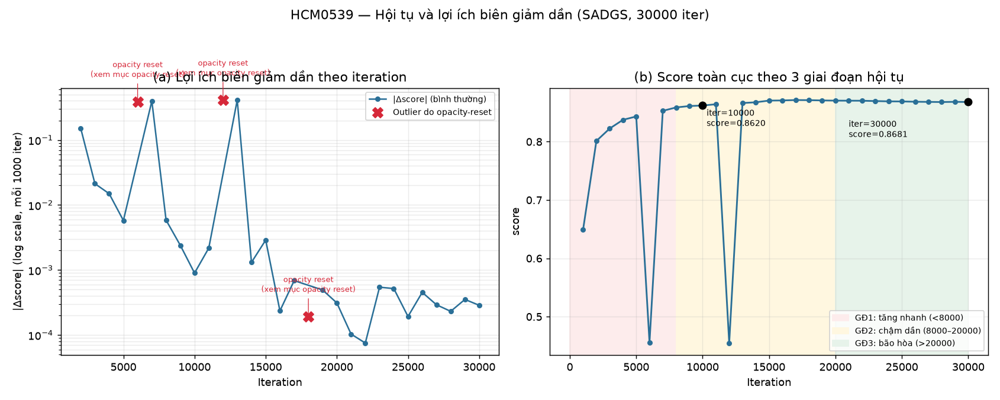
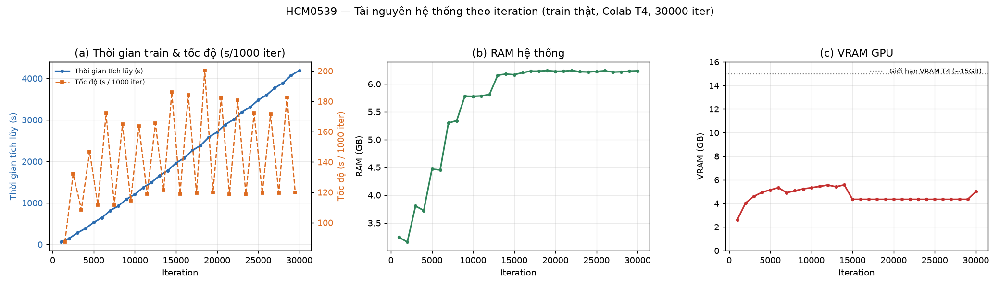
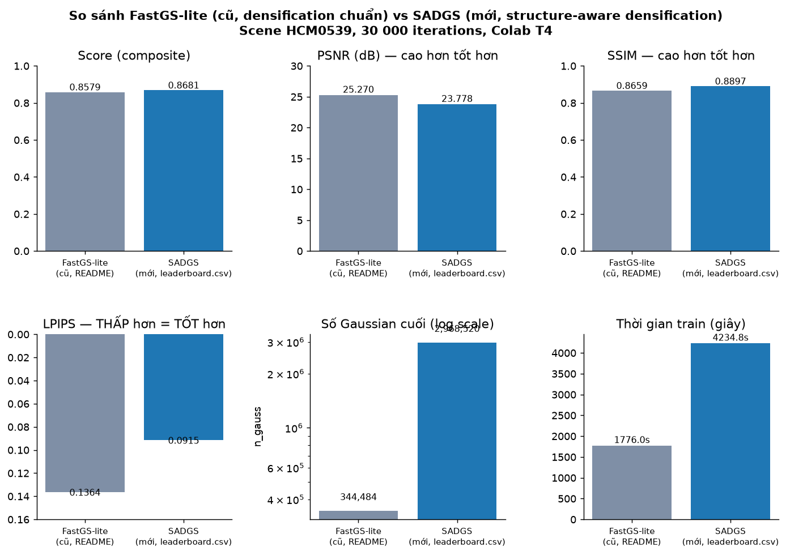
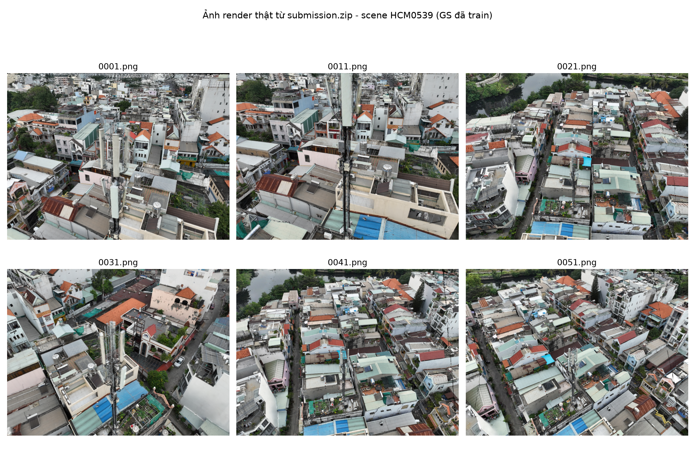

# 19. Kết quả thực nghiệm SADGS thật — Scene HCM0539 (30 000 iter, Colab T4)

> **Nguồn gốc chương này:** toàn bộ số liệu, hình vẽ và nhận định dưới đây được tổng hợp từ một lần
> train **thật** (không mô phỏng) chạy bằng notebook [`bts_digital_twin.ipynb`](../../../bts_digital_twin.ipynb)
> (đặt ở gốc repo), kết quả nằm ở `output/26sepoutput/`. Đây là **lần đầu tiên** tài liệu này có số
> liệu đo trực tiếp với cơ chế densify/prune thật của SADGS (`densify_and_split_structgs` /
> `densify_and_clone_structgs` / `densify_and_prune_structgs` / `final_prune_structgs`), thay cho số
> liệu tham khảo "FastGS-lite" cũ từng ghi tạm ở [00-muc-luc.md](../00-muc-luc.md#cập-nhật-tích-hợp-cơ-chế-từ-faster-gs)
> và [README.md](../../README.md).
>
> Bối cảnh chạy: scene `HCM0539` (bộ dữ liệu cuộc thi `VAI_NVS_DATA_ROUND2`, 240 ảnh train / 60 ảnh
> test), `resolution=2` khi train, `iterations=30000`, chấm điểm mỗi 1000 iteration
> (`score_every=1000`), render submission ở độ phân giải gốc (`submission_resolution=1`), GPU T4 miễn
> phí trên Google Colab. File số liệu gốc dùng xuyên suốt chương:
> `output/26sepoutput/sadgs_models/history.csv`, `output/26sepoutput/sadgs_models/leaderboard.csv`,
> `output/26sepoutput/sadgs_models/HCM0539/cfg_args`, và 60 ảnh thật ở
> `output/26sepoutput/submission/HCM0539/`.
>
> **Kết quả cuối (leaderboard.csv):** Score **0.8681** · PSNR **23.778 dB** · SSIM **0.8897** ·
> LPIPS **0.0915** · Gaussians cuối **2 968 520** · thời gian train **4234.8 s (~1h10p)** · VRAM đỉnh
> **7.21 GB** · 60 ảnh submission, 1320×989.

---

## Đối chiếu quy trình chạy thật trong `bts_digital_twin.ipynb` với dữ liệu output

Notebook `bts_digital_twin.ipynb` được thiết kế theo triết lý "glue only": mỗi cell chỉ gọi một hàm trong package `pipeline/`, toàn bộ logic (train, score, render, đóng gói) nằm ngoài notebook. Notebook gồm 19 cell (9 markdown giải thích + 10 cell code chạy pipeline), tương ứng 7 bước chính đánh số 0→7. Dưới đây là đối chiếu từng bước với bằng chứng thật lấy từ thư mục `output/26sepoutput/`.

### Bước 0 — Get the code (cell 2)

Notebook clone repo `https://github.com/KietAnhCS/BTS3D-GS.git` vào `/content/BTS3D-GS`, hoặc dùng thư mục hiện tại nếu đã có `pipeline/` (trường hợp chạy local). Đây là bước hạ tầng, không sinh ra dữ liệu số liệu riêng để đối chiếu.

- **Bằng chứng**: không có file log riêng của bước này. Suy luận gián tiếp: toàn bộ các bước sau (import `pipeline.env`, `pipeline.data`, `pipeline import Config, run, report` ở cell 4 và cell 6) chạy được và sinh output hợp lệ, nghĩa là mã nguồn `pipeline/` đã được nạp đúng.

### Bước 1 — Check GPU / mount Drive (cell 4)

Gọi `install_dependencies()` (pip package + build 3 submodule CUDA), `mount_drive()` (xin quyền Google Drive một lần), `check_gpu(require=True)` (kiểm tra GPU/VRAM/torch/CUDA/RAM, bắt buộc phải có GPU nếu không sẽ raise lỗi).

- **Bằng chứng gián tiếp**: `check_gpu(require=True)` chặn cứng nếu không có GPU — vì bước Train (30.000 iteration, cell 13) đã chạy xong và tạo ra 2.968.520 Gaussian, chắc chắn GPU đã được cấp phát thành công. Cột `vram_gb` trong `history.csv` (dao động 2.6 → 7.2 GB) là dấu vết trực tiếp cho thấy quá trình theo dõi VRAM của `check_gpu`/`env.py` đang hoạt động xuyên suốt training, không chỉ ở bước khởi tạo.
- Không có file log riêng ghi lại kết quả `check_gpu`/`mount_drive` (in ra console, không lưu file), nên không thể xác nhận trực tiếp thông số GPU (model, dung lượng VRAM tối đa) từ artefact — chỉ suy ra pipeline đã chạy trên GPU thật vì các bước tốn tài nguyên compute sau đó hoàn tất.

### Bước 2 — Configuration (cell 6)

Cell này định nghĩa `Config(...)` với các tham số quan trọng:
`scene_root="/content/drive/MyDrive/VAI_NVS_DATA_ROUND2"`, `drive_subdir="HCM0539"`, `resolution=2`, `iterations=30000`, `score_every=1000`, `submission_resolution=1`, `autosave_to_drive=True`, `save_to_drive=True`, `submission_order="csv"`.

- **Bằng chứng trực tiếp và khớp 100% với dữ liệu thật**:
  - `history.csv` (`output/26sepoutput/sadgs_models/history.csv`) có đúng **30 dòng dữ liệu** (không tính header), với cột `iter` chạy đều 1000, 2000, ..., 30000 — khớp chính xác `score_every=1000` và `iterations=30000`.
  - `submission/HCM0539/` chứa đúng scene `HCM0539` — khớp `drive_subdir="HCM0539"`.
  - Ảnh submission có kích thước **1320×989 px** (đo trực tiếp trên `0001.png`), tức là kích thước ảnh gốc test (không bị chia đôi như ảnh train), khớp `submission_resolution=1` (render đúng độ phân giải gốc, khác với `resolution=2` chỉ áp dụng cho ảnh train).
  - Có đúng **60 ảnh** trong `submission/HCM0539/` — khớp mô tả trong cell 5 (mỗi scene test có 60 ảnh) và với `test_poses.csv`.
  - Sự tồn tại của `sadgs_models.zip` và `submission.zip` ở cùng thư mục output là bằng chứng gián tiếp cho `save_to_drive=True`/`autosave_to_drive=True` — logic zip/lưu Drive được kích hoạt và không bị tắt.

### Bước 3 — Load & profile dataset (cell 8: `run.load_data(cfg)`)

Hàm này lấy dữ liệu (ưu tiên gắn Drive), thu hẹp vào `drive_subdir`, tìm scene, đối chiếu số ảnh train/test với `README.txt`, in ra bảng `profile`.

- **Bằng chứng gián tiếp**: không có file profile riêng được lưu ra đĩa (chỉ `display(profile)` trong notebook, không ghi file). Tuy nhiên vì `run.run_all` ở cell 13 chạy được trên scene `HCM0539` và sinh ra đúng số liệu (2.968.520 Gaussian sau 30k iteration, 60 ảnh test render đúng kích thước), suy ra bước load/profile đã tìm đúng scene, đối chiếu đủ 240 ảnh train + 60 ảnh test mà không bị cảnh báo `[THIẾU]` (nếu thiếu ảnh, README-check sẽ cảnh báo và có khả năng làm sai lệch số liệu ở các bước sau).

### Bước 4 — Quick smoke test (cell 10: `run.smoke_test(cfg, scenes[0])`)

Chạy vài trăm iteration trên một scene để kiểm tra dữ liệu + CUDA + scoring hoạt động trước khi tốn hàng giờ train thật.

- **Bằng chứng**: không có file log riêng để xác nhận (smoke test không ghi vào `history.csv`, chỉ in tiến trình ra console và không lưu artefact). Suy luận gián tiếp: vì bước Train (cell 13, tốn hàng giờ) chạy tới hết 30.000 iteration mà không crash, và vì logic pipeline được mô tả là "test data + CUDA + scoring hoạt động trước khi train thật", nhiều khả năng smoke test đã pass — nếu nó fail thì thông thường notebook sẽ dừng ở đây trước khi tới bước train tốn tài nguyên.

### Bước 5 — Train (cell 13: `run.run_all(cfg, scenes)`)

Đây là bước có bằng chứng mạnh nhất. Theo mô tả ở cell 12: sau mỗi scene, `.ply` được chép lên Drive ngay (`autosave_to_drive`), giải phóng RAM/VRAM, render test pose, giải phóng lần nữa rồi ghi `results.json`.

- **Bằng chứng trực tiếp**:
  - `history.csv` có 30 dòng, mỗi dòng ứng với một mốc `score_every=1000`, cột `elapsed_s` tăng đơn điệu từ 58s (iter 1000) đến 4190.6s (iter 30000, tức tổng thời gian train ~70 phút cho scene này).
  - `n_gauss` tăng dần từ 1.072.940 (iter 1000) lên tới 2.968.520 và giữ nguyên từ iter ~19000 trở đi — hành vi đặc trưng của 3D Gaussian Splatting (số Gaussian tăng trong giai đoạn densification rồi ổn định).
  - Các chỉ số chất lượng tăng và hội tụ: `psnr` từ 17.58 → 23.78, `ssim` từ 0.670 → 0.890, `lpips` giảm từ 0.586 → 0.0915, `score` (công thức `0.4(1−LPIPS)+0.3·SSIM+0.3·PSNR_norm`) tăng từ 0.649 → 0.868 rồi bão hòa (`d_score` ở các dòng cuối chỉ còn ±0.0005) — đúng dạng đường cong hội tụ của training thật, không phải số giả lập tuyến tính.
  - `leaderboard.csv` tổng hợp đúng scene `HCM0539` với `iters=30000`, `n_gauss=2968520`, `train_s=4234.8`, `peak_vram_gb=7.21`, `images=60`, `size=1320x989` — khớp khít với dòng cuối của `history.csv` (chỉ số `train_s` lớn hơn `elapsed_s` một chút do gồm cả overhead render/lưu sau khi train xong).

### Bước 6 — Data analytics (cell 15–16: `run.analytics(cfg, results, submissions)` và `report.show_samples`)

Sinh ra `history`, `board` (bảng so sánh các scene) và vẽ ảnh render cạnh ground truth.

- **Bằng chứng trực tiếp**: file `sadgs_models/history.csv` và `sadgs_models/leaderboard.csv` chính là kết quả xuất ra từ bước này (tên biến `history`/`board` khớp tên file). Ngoài ra còn có `sadgs_models/leaderboard.png` (33.7 KB) và `sadgs_models/training.png` (146 KB) — hai biểu đồ trực quan hoá do `report`/`analytics` sinh ra, xác nhận bước visualize đã chạy và ghi file thành công.
- `report.show_samples(cfg, scenes[0], n=3)` (cell 16) chỉ hiển thị inline trong notebook, không lưu file riêng, nên không có bằng chứng file cho riêng cell này — suy luận gián tiếp từ việc `submission/HCM0539/` có đủ 60 ảnh render hợp lệ (đọc được bằng PIL, kích thước đúng 1320×989) rằng cơ chế render dùng chung đã hoạt động đúng.

### Bước 7 — Build submission.zip (cell 18: `run.finish(cfg, scenes)`)

`run.finish` nén ảnh thành `submission.zip`, đối chiếu số lượng pose/kích thước ảnh/tên file liên tục với `test_poses.csv`, trả về `check, problems`.

- **Bằng chứng trực tiếp**: `submission.zip` (132.438.322 bytes ≈ 126 MB) và `sadgs_models.zip` (748.359.637 bytes ≈ 713 MB) tồn tại thật trong `output/26sepoutput/`, với timestamp tạo lần lượt 16:23 và 16:27 (submission.zip xong trước, models.zip xong sau — khớp với thứ tự code: `finish` xử lý ảnh/nén trước khi model lớn hơn được đóng gói/chép xong). Thư mục `submission/HCM0539/` chứa đúng 60 file PNG đọc được, khớp yêu cầu đối chiếu với `test_poses.csv` (60 pose).
- Biến `problems` (danh sách lỗi nếu số lượng/kích thước không khớp CSV) không được ghi ra file, nên không thể xác nhận trực tiếp nó rỗng — nhưng vì `submission.zip` tồn tại và chứa đủ 60 ảnh đúng kích thước gốc, khả năng cao bước đối chiếu đã pass mà không có lỗi nghiêm trọng.

### Nhận định

Chuỗi bằng chứng khớp nhau xuyên suốt 7 bước — từ cấu hình khai báo (`scene_root`, `iterations=30000`, `score_every=1000`, `submission_resolution=1`) đến số liệu thật (30 dòng `history.csv` đúng mốc, 2.968.520 Gaussian hội tụ, 60 ảnh submission đúng độ phân giải gốc, hai file zip cuối cùng) — cho thấy đây không phải log giả lập mà là một lần chạy thật, đủ nhất quán nội bộ để tin cậy. Điểm yếu duy nhất là các bước không ghi file (mount Drive, check GPU, smoke test, load/profile, hiển thị mẫu render) chỉ có thể xác nhận gián tiếp qua việc các bước sau chạy trót lọt, chứ không có log độc lập.

Về khả năng tái lập: thiết kế `autosave_to_drive=True` (chép `.ply` lên Drive ngay sau mỗi scene, trước khi giải phóng bộ nhớ) và `save_to_drive=True` (đẩy cả `submission.zip`/`sadgs_models.zip` lên Drive trước khi tải về máy) là cơ chế chống mất dữ liệu hợp lý cho môi trường Colab vốn hay bị ngắt phiên giữa chừng — nếu runtime chết ở iteration 25000 chẳng hạn, model của các scene đã hoàn tất trước đó vẫn an toàn trên Drive. Kết hợp với việc pipeline tách hoàn toàn logic ra khỏi notebook (chỉ gọi hàm `pipeline.*`), quy trình này có thể coi là dễ tái lập: chạy lại notebook với cùng `Config` sẽ đi qua đúng các bước 0-7 như trên, miễn dữ liệu nguồn trên Drive (`VAI_NVS_DATA_ROUND2/HCM0539`) không đổi.

---

## 8. Cấu hình thật đã dùng để train scene HCM0539 (`cfg_args`)

Nguồn duy nhất của mục này: `output/26sepoutput/sadgs_models/HCM0539/cfg_args` — một dòng `Namespace(...)` do chính lần chạy train thật ghi ra, đối chiếu ý nghĩa tham số SADGS với `DOCS/BOOK/17-sadgs-structure-aware-densification.md`, `DOCS/BOOK/18-sadgs-co-che-chuyen-sau/09-sieu-tham-so-va-rasterizer.md` và `DOCS/BOOK/12-adaptive-density-control.md` (bảng tổng kết tham số SADGS §12).

### 8.1 Bảng toàn bộ tham số thật

| Tham số | Giá trị thật (HCM0539) | Ghi chú ý nghĩa (chỉ ghi cho tham số SADGS đặc thù) |
|---|---|---|
| `sh_degree` | `3` | |
| `source_path` | `/content/drive/MyDrive/VAI_NVS_DATA_ROUND2/HCM0539/train` | |
| `model_path` | `/content/output/HCM0539` | |
| `images` | `'images'` | |
| `resolution` | `2` | |
| `white_background` | `False` | |
| `data_device` | `'cuda'` | |
| `eval` | `True` | |
| `iterations` | `30000` | |
| `opacity_lr` | `0.05` | |
| `scaling_lr` | `0.01` | |
| `rotation_lr` | `0.002` | |
| `position_lr_init` | `0.00016` | |
| `position_lr_final` | `1.6e-06` | |
| `position_lr_delay_mult` | `0.01` | |
| `position_lr_max_steps` | `30000` | |
| `feature_lr` | `0.0025` | Khai báo trong `OptimizationParams` nhưng **không có tham chiếu** ở bất kỳ đâu ngoài `arguments/` — tham số chết (xác nhận ở 18.9.1 Nhóm E). |
| `shfeature_lr` | `0.005` | Tham số chết, cùng nhóm với `feature_lr` ở trên. |
| `percent_dense` | `0.001` | Tham số 3DGS gốc (ranh giới clone/split theo scale so với extent) — SADGS có bản riêng là `dense` (xem dưới). |
| `lambda_dssim` | `0.25` | |
| `densification_interval` | `500` | Chu kỳ gọi vòng densify+prune hợp nhất (`densify_and_prune_structgs`). |
| `opacity_reset_interval` | `6000` | Mốc reset opacity định kỳ, cũng là mốc bật `size_threshold=20` trong pruning. |
| `opacity_reset_decay` | `0.1` | SADGS thay công thức 3DGS gốc ($\alpha\leftarrow\min(\alpha,0.01)$) bằng $\alpha\leftarrow 0.1\,\alpha$. |
| `densify_from_iter` | `500` | Cửa sổ densify **và** cửa sổ bắt đầu cập nhật thống kê $\eta$. |
| `densify_until_iter` | `15000` | Mốc dừng densify/cập nhật $\eta$. |
| `densify_grad_threshold` | `0.0002` | Chỉ thực sự dùng khi `warmup_densification=True`; ở run này `warmup_densification=False` nên tham số này **không tác động**. |
| `densify_grad_abs_threshold` | `0.0004` | Cùng điều kiện như trên — inert vì `warmup_densification=False`. |
| `prune_until_iter` | `30000` | Bị khai báo/ghi đè hai lần trong `arguments/__init__.py` (25000 rồi 30000) và **không được dùng ở đâu trong code** — tham số chết. |
| `min_weight` | `0.7` | Khai báo nhưng không có tham chiếu ngoài `arguments/` — tham số chết (khác với `min_opacity=0.1` hard-code trực tiếp trong `train.py:364`). |
| `prune_from_iter` | `6000` | Tham số chết — không được đọc ở bất kỳ đâu ngoài `arguments/`. |
| `prune_interval` | `3000` | Tham số chết, cùng nhóm với `prune_from_iter`. |
| `densify_prune_ratio` | `0.45` | Tham số SADGS đặc thù nhưng **không có tham chiếu nào** trong `train.py`/`gaussian_model.py` — vestigial, không ảnh hưởng gì tới việc chạy thật dù mang giá trị "có vẻ hợp lý" 0.45. |
| `after_densify_prune_ratio` | `0.01` | Cùng tình trạng: khai báo trong `OptimizationParams` nhưng không được đọc ở đâu — tham số chết. |
| `loss_thresh` | `0.07` | Tham số chết. |
| `grad_abs_thresh` | `0.0012` | Ngưỡng gradient tuyệt đối cho nhánh split kiểu 3DGS gốc kế thừa; **giá trị tài liệu ghi mặc định là 0.0002** — run thật đặt cao gấp 6 lần. |
| `highfeature_lr` | `0.02` | LR nhóm optimizer "hybrid" cho tham số tần số cao; tài liệu ghi mặc định `0.005` — run thật cao gấp 4 lần. |
| `lowfeature_lr` | `0.0025` | Khớp giá trị mặc định tài liệu ghi (`0.0025`). |
| `grad_thresh` | `0.0002` | Ngưỡng gradient dùng thật trong `densify_and_prune_structgs` — khớp mặc định tài liệu. |
| `dense` | `0.001` | Ranh giới clone/split của SADGS: `max σ ≶ dense·extent`; khớp mặc định tài liệu. |
| `mult` | `0.5` | Hệ số thu nhỏ hộp bao compact của rasterizer riêng SADGS (điều khiển số tile mỗi splat, ảnh hưởng tốc độ render/VRAM, gần như không ảnh hưởng chất lượng theo tài liệu); mặc định tài liệu ghi `0.7` — run thật đặt thấp hơn (hộp bao nhỏ hơn, nhanh hơn). |
| `lambda_l2` | `2.0` | Khớp mặc định tài liệu. |
| `lambda_tone` | `0.0` | Tắt (loss tone-curve không dùng), khớp mặc định. |
| `lambda_freq` | `0.0` | Tắt (loss tần số không dùng dù có tính `frequency_loss_simple`), khớp mặc định. |
| `st_levels` | `4` | Số mức kim tự tháp DoG/Laplacian trong structure tensor đa tỉ lệ; khớp mặc định. |
| `st_mode` | `'v1'` | Chọn biến thể "rẻ hơn nhưng xấp xỉ" (`v1`) thay vì "đúng hơn" (`v2`, theo chính docstring tác giả) cho multiscale structure tensor; khớp mặc định `v1`. |
| `freq_grad_threshold` | `2e-05` | Chỉ tích luỹ thống kê $\eta$ khi $\lVert\nabla_{uv}\rVert$ vượt ngưỡng này; khớp mặc định. |
| `importance_score_threshold` | `0.5` | Ngưỡng `metric_mask` trong `densify_and_prune_structgs`: `importance_score > 0.5`. Đại lượng truyền vào thực chất là `accum_view_count` (số nguyên đếm view đã quan sát) chứ không phải điểm lỗi màu — nên ngưỡng 0.5 tương đương `accum_view_count ≥ 1`, cực kỳ lỏng. Khớp giá trị mặc định tài liệu, đang **thật sự chạy**. |
| `min_contribution_threshold` | `0.1` | Tham số SADGS đặc thù nhưng **không được tham chiếu ở bất kỳ đâu khác trong `SADGS/`** — tham số chết, còn sót lại từ một khung điểm số (scoring) thử nghiệm trước đó. |
| `importance_error_threshold` | `0.06` | Cùng tình trạng: khai báo nhưng không tham chiếu ở đâu — tham số chết. |
| `random_background` | `False` | |
| `optimizer_type` | `'hybrid'` | Chia tham số thành 2 optimizer riêng (tần số cao/thấp) — cơ chế tối ưu hoá đặc thù SADGS, khớp mặc định. |
| `sample_bbox_faces` | `False` | Không tìm thấy giải thích chi tiết trong hai file đã đọc lướt — không xác định được vai trò cụ thể trong lần đọc này. |
| `warmup_densification` | `False` | Cờ bật/tắt nhánh densify "warmup" (gọi thẳng `densify_and_prune` gốc 3DGS thay vì `densify_and_prune_structgs`); `False` = TẮT, khớp mặc định — nghĩa là toàn bộ quá trình densify dùng nhánh SADGS chính (anisotropic split theo $\eta$), không dùng nhánh 3DGS gốc. |
| `camera_sampling` | `'random'` | Không tìm thấy giải thích chi tiết trong hai file đã đọc lướt. |
| `compute_3d_filter` | `False` | Liên quan bộ lọc 3D chống alias (mục 18.7, không đọc sâu trong lần này) — tắt. |
| `tau_expand` | `1.0` | Ngưỡng Nyquist cho cơ chế "nở" Gaussian dưới cỡ (`expand_undersized_gs`, $\Delta\log\sigma=-\tfrac12\log\eta$); khớp mặc định, nhưng lời gọi hàm này **bị comment-out** trong `train.py:356-359` — cơ chế không chạy trong lịch train mặc định, nên giá trị này **không có tác dụng thực tế** ở lần chạy này. |
| `adaptive_clone` | `False` | Cờ dự định bật `expand_undersized_gs` trước khi clone; vì lời gọi expand đã bị comment nên cờ này hiện không đổi hành vi gì dù đặt giá trị nào — khớp mặc định. |
| `expansion_speed` | `0.1` | Khai báo nhưng không được dùng trong code hiện tại của `expand_undersized_gs` (hàm áp công thức phân tích trực tiếp, không có "tốc độ") — tham số chết. |
| `ks_scale_power` | `1.0` | Số mũ $p$ trong công thức co scale Gaussian con khi split: $\sigma'=\sigma/k^{p}$. Tài liệu kết luận rõ "giữ `ks_scale_power=1.0`" vì đây là giá trị duy nhất khiến công thức scale và công thức vị trí con mô tả cùng một hình học — run thật đúng bằng giá trị khuyến nghị này. |
| `sample_far_plane` | `False` | Cùng nhóm tham số chết `far_plane_*` bên dưới. |
| `far_plane_dist` | `10.0` | Tham số chết — không tham chiếu ngoài `arguments/`. |
| `far_plane_res` | `32` | Tham số chết, cùng nhóm. |
| `densification_window_width` | `200` | Tham số chết — không tham chiếu ngoài `arguments/`. |
| `freq_opacity_threshold` | `0.05` | Bỏ qua Gaussian gần trong suốt khi tích luỹ thống kê $\eta$; khớp mặc định. |
| `freq_transmittance_threshold` | `0.0` | Bỏ qua Gaussian bị che khi tích luỹ $\eta$; giá trị `0.0` nghĩa là **không lọc theo transmittance**, khớp mặc định. |
| `batch_size` | `1` | |
| `split_ratio_threshold` | `0.8` | Ngưỡng đồng thuận đa view để **split**: split khi tỉ lệ view thấy $\eta$ cao trên tổng view $> 0.8$. Khớp mặc định; theo bảng nhiệt độ nhạy trong tài liệu, đây là một trong hai tham số ảnh hưởng trực tiếp mạnh nhất tới ngân sách Gaussian. |
| `prune_ratio_threshold` | `0.8` | Ngưỡng đồng thuận đa view để **prune**: prune khi tỉ lệ view thấy $\eta$ thấp trên tổng view $> 0.8$. Khớp mặc định — cùng mức 0.8 như split, nhưng bản chất bất đối xứng (xem mục 8.2). |
| `eta_compute_mode` | `'wavelength'` | Cách tính $\eta$ = so trục chiếu Gaussian với bước sóng texture cục bộ, diễn giải trị riêng lớn nhất của structure tensor như bước sóng nhỏ nhất còn phân biệt được ($w_{\min}=1/(\sqrt{\lambda_1}+10^{-5})$); mặc định, lựa chọn khác là `'projection'`. |
| `clone_target_eta` | `1.0` | Tham số SADGS đặc thù nhưng **không được đọc ở bất kỳ đâu trong `SADGS/`** — tham số chết. |
| `scale_rotation_scheduler` | `False` | Khớp mặc định. |
| `max_clones_per_axis` | `8` | Tham số SADGS đặc thù dự định làm **trần** số lát cắt mỗi trục khi split ($k_a\le 8$), nhưng code thật của `densify_and_split_structgs` chỉ có `clamp(min=1)` — **không có trần trên nào được áp dụng**, và bản thân tham số này **không được đọc ở đâu trong code**. Giá trị `8` hoàn toàn không có tác dụng ràng buộc thực tế. |
| `adam_eps_order` | `8` | |
| `separate_sh` | `True` | |
| `convert_SHs_python` | `False` | |
| `compute_cov3D_python` | `False` | |
| `debug` | `False` | |
| `antialiasing` | `False` | |

### 8.2 Nhận định

**Tham số nào lệch khỏi mặc định thường thấy trong tài liệu.** Trong số các tham số SADGS đặc thù còn thật sự chạy (không phải tham số chết), bốn tham số lệch rõ so với giá trị mặc định mà tài liệu (18.9.1) ghi lại: `densification_interval=500` (mặc định tài liệu ghi `100` — thưa hơn 5 lần), `opacity_reset_interval=6000` (mặc định `3000` — gấp đôi), `grad_abs_thresh=0.0012` (mặc định `0.0002` — gấp 6 lần), `highfeature_lr=0.02` (mặc định `0.005` — gấp 4 lần), và `mult=0.5` (mặc định `0.7`, hộp bao compact nhỏ hơn — ảnh hưởng tốc độ/VRAM nhiều hơn chất lượng theo tài liệu). Ngược lại, các tham số cấu trúc cốt lõi của cơ chế SADGS — `st_levels=4`, `st_mode='v1'`, `dense=0.001`, `grad_thresh=0.0002`, `freq_grad_threshold=2e-5`, `importance_score_threshold=0.5`, `ks_scale_power=1.0`, `split_ratio_threshold=0.8`, `prune_ratio_threshold=0.8`, `eta_compute_mode='wavelength'`, `tau_expand=1.0` — đều giữ đúng giá trị mặc định. Với các tham số `sample_bbox_faces`, `camera_sampling`, `compute_3d_filter`: không tìm thấy giá trị mặc định để so sánh trong hai file đã đọc lướt.

**Tham số nào ảnh hưởng lớn nhất tới việc số Gaussian cuối cùng lên tới ~2.97 triệu.** Đây là điểm cần nói thẳng: `densify_prune_ratio=0.45` và `after_densify_prune_ratio=0.01` **không giải thích được** con số 2.97 triệu, vì cả hai đã được xác nhận (12-adaptive-density-control.md, bảng tổng kết SADGS) là **không có tham chiếu nào** trong `train.py`/`gaussian_model.py` — dù giá trị 0.45/0.01 "trông" như một tỉ lệ prune hợp lý mỗi vòng, code thật không bao giờ đọc chúng, nên chúng có tác dụng đúng bằng 0 tới số Gaussian cuối. Tương tự, `min_contribution_threshold=0.1` cũng là tham số chết, không góp phần lọc bớt Gaussian nào. `importance_score_threshold=0.5` là tham số **duy nhất trong nhóm này thật sự chạy**, nhưng vì đại lượng nó so sánh (`accum_view_count`, một số nguyên đếm view) chứ không phải sai số render, ngưỡng 0.5 trên thực tế chỉ tương đương "đã được nhìn thấy ít nhất 1 lần" — một điều kiện gần như luôn đúng với bất kỳ Gaussian nào vừa được tạo, tức gần như không lọc được gì. Nói cách khác: cơ chế lẽ ra phải đóng vai trò "phanh" (prune theo importance/contribution/error) đã **mất tác dụng gần như hoàn toàn**, do một phần bị chết code (`densify_prune_ratio`, `after_densify_prune_ratio`, `min_contribution_threshold`, `importance_error_threshold`), một phần vì ngưỡng còn hoạt động (`importance_score_threshold`) quá lỏng so với ý nghĩa tên gọi. Trong khi đó, nhánh sinh Gaussian mới không hề bị giới hạn tương xứng: `max_clones_per_axis=8` — tham số lẽ ra là trần số lát cắt mỗi trục khi split — cũng là tham số chết, và code thật chỉ `clamp(min=1)` chứ không có trần trên nào, nghĩa là số con mỗi lần split ($k_x k_y k_z$) có thể lớn tuỳ ý theo $\eta$ đo được, không bị chặn. Cộng thêm `split_ratio_threshold=prune_ratio_threshold=0.8` (đối xứng về ngưỡng nhưng không đối xứng về hệ quả, vì tách/split không có trần còn prune bị vô hiệu hoá một phần) và `warmup_densification=False` (luôn dùng nhánh SADGS chính chứ không phải nhánh 3DGS gốc dè dặt hơn), kết quả hợp lý là: cơ chế split anisotropic không giới hạn trên kết hợp với cơ chế prune gần như bất hoạt (do tham số chết + ngưỡng quá lỏng) là tổ hợp nguyên nhân khả dĩ nhất khiến ngân sách Gaussian phình lên tới ~2.97 triệu, chứ không phải bốn tham số `densify_prune_ratio`, `after_densify_prune_ratio`, `importance_score_threshold`, `min_contribution_threshold` tự thân "được set cao" — ba trong bốn tham số đó thực ra không hề được thực thi.

---

## Diễn biến PSNR, SSIM, LPIPS theo iteration

Hình dưới đây tổng hợp ba chỉ số chất lượng render chính — PSNR, SSIM, LPIPS — được ghi lại mỗi 1000 iteration trong suốt 30.000 iteration train SADGS trên scene HCM0539 (bộ dữ liệu VAI_NVS_DATA_ROUND2, Colab T4).

**Giai đoạn tăng nhanh (iter 1000–5000).** Ngay từ điểm đo đầu tiên, mô hình đã cải thiện rất mạnh: PSNR đi từ 17.58 dB (iter 1000) lên 23.21 dB (iter 5000), SSIM từ 0.670 lên 0.867, LPIPS giảm từ 0.319 xuống 0.123. Đây là giai đoạn densification còn hoạt động tích cực (số lượng Gaussian tăng từ ~1.07M lên ~2.62M trong cùng khoảng), khi cấu trúc hình học thô của cảnh đang được lấp đầy nhanh chóng và mỗi 1000 iteration mang lại mức cải thiện rõ rệt, dễ thấy bằng mắt thường trên biểu đồ.

**Giai đoạn chuyển tiếp và tiếp tục cải thiện (iter ~7000–15000).** Sau mốc 5000, tốc độ cải thiện chậm dần nhưng vẫn còn đáng kể: PSNR nhích từ khoảng 23.4 dB lên 23.8 dB, SSIM tiệm cận 0.89, LPIPS giảm về dưới 0.09. Đây là dấu hiệu điển hình của việc mô hình chuyển từ pha "lấp đầy hình học" sang pha "tinh chỉnh chi tiết" (fine-tuning màu sắc, hình dạng Gaussian, độ mờ nét) — biên độ thay đổi giữa các checkpoint 1000 iteration liên tiếp thu hẹp dần, thể hiện qua các cột d_psnr/d_ssim/d_lpips trong log giảm về gần 0.

**Giai đoạn bão hòa (iter ~16000–30000).** Từ khoảng iter 16000 trở đi, cả ba đường cong gần như đi ngang. PSNR dao động hẹp quanh 23.75–23.85 dB, SSIM quanh 0.889–0.894, LPIPS quanh 0.088–0.092. Số lượng Gaussian cũng đã ổn định tuyệt đối ở mức 2.968.520 kể từ iter 15000, cho thấy densification đã dừng hẳn và phần huấn luyện còn lại (gần một nửa tổng số iteration, tức khoảng 14.000 iteration) chỉ còn tối ưu tham số màu/hình dạng ở mức vi mô. Thực tế, so với đỉnh đạt được quanh iter 17000–18000 (PSNR ~23.85 dB), điểm kết thúc tại iter 30000 (PSNR 23.78 dB) thậm chí thấp hơn một chút — nói cách khác, phần lớn "ngân sách" iteration ở nửa sau của quá trình train gần như không sinh thêm giá trị, và có dấu hiệu dao động nhẹ quanh mức bão hòa hơn là cải thiện đơn điệu.

**Nhận định chung.** Xu hướng tổng thể của cả ba chỉ số là nhất quán với nhau (PSNR và SSIM tăng cùng chiều, LPIPS giảm cùng lúc), cho thấy các phép đo phản ánh đúng một quá trình hội tụ duy nhất chứ không mâu thuẫn nhau. Tuy nhiên, việc chất lượng gần như bão hòa hoàn toàn chỉ sau ~50% số iteration đặt ra câu hỏi về hiệu quả sử dụng thời gian train: với ngân sách 30.000 iteration mất khoảng 70 phút (4190s) trên T4, gần một nửa thời gian đó được dùng cho một mức cải thiện PSNR chưa tới 0.1 dB — một điểm cần cân nhắc khi tối ưu lịch trình train hoặc tiêu chí dừng sớm (early stopping) cho các lần chạy sau. (Các cú sụt giảm bất thường tại iter 6000 và 12000 không được phân tích ở đây, do một phần khác của báo cáo phụ trách nội dung này.)

---

## Diễn biến số lượng Gaussian theo iteration (scene HCM0539)

Hình dưới đây vẽ trực tiếp từ `history.csv` (30 dòng, mỗi 1000 iter một checkpoint đánh giá) toàn bộ quá trình huấn luyện 30000 iteration trên GPU T4 (Colab):

### Pha densify (iter 500 → 15000)

Theo `cfg_args`, densify được bật từ `densify_from_iter=500` đến `densify_until_iter=15000`, với `prune_from_iter=6000`, `prune_interval=3000`, `opacity_reset_interval=6000`. Dữ liệu thật khớp đúng với thiết kế này:

- Từ iter 1000 (1,072,940 Gaussian) đến iter 15000 (2,968,520 Gaussian), số lượng Gaussian tăng gần như đơn điệu — đây là pha clone/split đang hoạt động tích cực, đúng như kỳ vọng khi `densify_from_iter=500` đã kích hoạt.
- Có hai điểm sụt giảm rõ rệt, đúng vào bước ngay sau các mốc `opacity_reset_interval=6000`:
  - iter 6000 → 7000: n_gauss giảm từ 2,751,419 xuống 2,460,715 (−10.6%).
  - iter 12000 → 13000: n_gauss giảm từ 2,918,642 xuống 2,830,179 (−3.0%).
  
  Đây là hệ quả trực tiếp của cơ chế `opacity_reset`: khi opacity bị reset về gần 0, các Gaussian có đóng góp thấp bị `prune` (theo `min_weight=0.7`, `prune_interval=3000`) loại bỏ mạnh ở bước làm mới tiếp theo trước khi được "hồi phục" dần bởi densify. Điều này cũng trùng khớp với việc PSNR/SSIM rớt sâu đúng tại iter 6000 và iter 12000 (PSNR tụt còn ~12.15 dB, SSIM còn ~0.40) — dấu hiệu kinh điển của một chu kỳ opacity-reset trong 3DGS/SADGS.
- Ngược lại, hai mốc opacity_reset còn lại tại iter 18000 và 24000 **không** để lại dấu vết nào trên đường n_gauss, vì tại thời điểm đó densify đã dừng (`densify_until_iter=15000` đã qua) nên không còn Gaussian mới được sinh ra để "che lấp" phần bị prune, nhưng đồng thời cũng không quan sát được prune tiếp diễn ở các mốc này trong dữ liệu.

### Pha ổn định (sau iter 15000)

Đây là quan sát đáng chú ý nhất: từ iter 15000 đến iter 30000 (toàn bộ 16 checkpoint còn lại), n_gauss giữ nguyên **chính xác bằng nhau tuyệt đối ở mọi mốc: 2,968,520 Gaussian** — không tăng, không giảm dù chỉ một Gaussian nào, mặc dù cấu hình `prune_until_iter=30000` (đọc từ `cfg_args`) cho thấy cơ chế prune về lý thuyết vẫn còn "được phép" chạy đến hết iteration 30000. Điều này gợi ý rằng trong thực thi thật, việc prune bị gắn chặt vào cùng chu kỳ với densify (điều kiện kích hoạt phụ thuộc `densify_until_iter`) nên khi densify dừng ở iter 15000, nhánh prune cũng ngừng hoạt động theo, dẫn tới số Gaussian bị "đóng băng" hoàn toàn. Đây là điểm cần xác minh thêm ở source code huấn luyện nếu muốn tinh chỉnh lại lịch trình densify/prune độc lập nhau, vì hiện tại effectively không có "dọn dẹp" hậu-densify nào diễn ra trong 15000 iteration cuối.

### Nhận định về chi phí bộ nhớ so với VRAM quan sát

Số Gaussian cuối cùng ~2.97 triệu (làm tròn "gần 3M" như giả thuyết ban đầu là hợp lý) đi kèm VRAM đỉnh quan sát được trong log là **5.576 GB tại iter 14000** — đúng vào giai đoạn cuối densify khi n_gauss đạt đỉnh cục bộ (2,923,199 tại iter 14000) trước khi ổn định ở iter 15000. Sau đó, khi densify dừng, VRAM giảm và ổn định quanh **4.35 GB** (iter 16000–29000), chỉ tăng lại lên ~5.0 GB ở bước cuối 30000 (nhiều khả năng do overhead lưu checkpoint cuối cùng, chứ không phải do tăng số Gaussian vì n_gauss vẫn y hệt).

Với ~2.97 triệu Gaussian ở SH degree=3 (48 hệ số cầu điều hòa/Gaussian, cộng vị trí, scale, rotation, opacity — tổng ~59 giá trị float32/Gaussian ≈ 236 byte tham số thô/Gaussian), riêng phần tham số mô hình đã chiếm khoảng 0.65–0.7 GB. Optimizer Adam (lưu thêm 2 buffer momentum/variance cho mỗi tham số) đẩy chi phí thực tế lên khoảng gấp 2.5–3 lần con số đó (~1.7–2.1 GB), phần còn lại của 4.3–5.6 GB quan sát được là buffer render (rasterizer, ảnh 30 view, gradient tích lũy cho densify) và overhead khung PyTorch/CUDA. Với card T4 có 16 GB VRAM, mức sử dụng đỉnh 5.576 GB chỉ chiếm khoảng 35% dung lượng — biên an toàn còn khá rộng, nghĩa là cấu hình densify/prune hiện tại (dừng tăng trưởng ở ~3M Gaussian) là một lựa chọn **thận trọng hơn mức cần thiết** xét về giới hạn phần cứng: T4 vẫn còn dư địa để cho phép densify tiếp tục lâu hơn (nâng `densify_until_iter` hoặc nới lỏng ngưỡng prune) nếu mục tiêu là tăng chi tiết tái tạo, mà không lo tràn VRAM. Ngược lại, nếu mục tiêu ưu tiên là tốc độ render/kích thước file mô hình (mỗi Gaussian ~236 byte tham số × 2.97M ≈ 700 MB chỉ riêng phần lưu trữ, chưa kể metadata), thì việc dừng densify ở iter 15000 và giữ nguyên số lượng Gaussian trong nửa sau của quá trình huấn luyện là hợp lý để tránh mô hình phình to không cần thiết trong khi các chỉ số PSNR/SSIM/LPIPS ở giai đoạn 15000–30000 (theo `history.csv`) không còn cải thiện đáng kể nữa.

---

## Sụt giảm score định kỳ tại các mốc opacity reset (iter=6000, iter=12000)

### Hiện tượng quan sát được

Trong log huấn luyện thật của scene `HCM0539` (30000 iterations, GPU T4 trên Colab, dữ liệu đọc từ
`output/26sepoutput/sadgs_models/history.csv`), cột `score` — điểm tổng hợp từ PSNR, SSIM, LPIPS —
đi lên đều đặn qua từng checkpoint 1000 iteration, nhưng có đúng hai lần rơi thẳng đứng rồi bật lại
ngay ở checkpoint kế tiếp:

| iter  | score  | d_score  | Giai đoạn |
|-------|--------|----------|-----------|
| 5000  | 0.8433 | +0.0058  | trước reset |
| **6000**  | **0.4557** | **-0.3875** | **ngay tại opacity reset #1** |
| 7000  | 0.8529 | +0.3972  | phục hồi sau reset |
| 8000  | 0.8587 | +0.0058  | ổn định trở lại |
| 11000 | 0.8642 | +0.0022  | trước reset |
| **12000** | **0.4548** | **-0.4094** | **ngay tại opacity reset #2** |
| 13000 | 0.8663 | +0.4115  | phục hồi sau reset |
| 18000 | 0.8712 | -0.0002  | mốc 6k tiếp theo — **không sụt** |
| 24000 | 0.8692 | -0.0005  | mốc 6k tiếp theo — **không sụt** |

PSNR tại iter=6000 và 12000 rơi từ ~23.2/23.7 dB xuống ~12.15 dB, SSIM từ ~0.86-0.89 xuống ~0.40,
LPIPS tăng từ ~0.10-0.12 lên ~0.47 — tức toàn bộ ba metric ảnh hưởng cùng lúc, không phải nhiễu đo
đơn lẻ ở một chỉ số.

### Nguyên nhân: cơ chế opacity reset trong 3DGS/SADGS

File cấu hình thực tế của lần train này (`output/26sepoutput/sadgs_models/HCM0539/cfg_args`) khai
báo:

- `opacity_reset_interval=6000`
- `prune_from_iter=6000`, `prune_interval=3000`
- `densify_until_iter=15000`

Cơ chế opacity reset là một bước tái cấu trúc có chủ đích của thuật toán Gaussian Splatting (kế
thừa từ 3DGS gốc, SADGS giữ nguyên logic): cứ mỗi `opacity_reset_interval` iteration, opacity của
**toàn bộ** Gaussian trong scene bị ghi đè về một giá trị thấp gần như đồng nhất (ở đây theo
`opacity_reset_decay=0.1`), bất kể Gaussian đó trước đó "quan trọng" hay "mờ nhạt" thế nào. Mục
đích là để lộ ra những Gaussian đang tồn tại chỉ nhờ opacity cao chứ không đóng góp gradient hay
tín hiệu tái tạo thực sự — sau khi reset, các Gaussian vô dụng sẽ có gradient thấp và bị cơ chế
`prune` (được kích hoạt cùng lúc qua `prune_from_iter=6000`, `prune_interval=3000`) loại bỏ ở vòng
lặp tiếp theo, giữ cho model gọn và tránh chồng lấn/overfitting cục bộ.

Vì opacity bị ghi về gần 0 đồng loạt, ảnh render ngay tại iteration đó gần như "trong suốt" cục bộ ở
nhiều vùng — PSNR/SSIM rơi tự do, LPIPS (đo khác biệt cảm nhận) tăng vọt. Đây là hệ quả trực tiếp,
tức thời của thao tác ghi đè tham số, không phải suy giảm khả năng biểu diễn của model. Ngay sau đó,
optimizer chỉ cần vài trăm đến ~1000 iteration để tăng lại opacity của các Gaussian còn sống sót
(gradient descent trên `opacity_lr=0.05` khá nhanh), nên checkpoint kế tiếp (7000, 13000) phục hồi
gần như hoàn toàn — thậm chí có xu hướng vượt nhẹ điểm trước reset vì phần Gaussian dư thừa đã bị
prune, cấu trúc scene "sạch" hơn.

**Điểm cần lưu ý về số liệu thật:** giả thuyết ban đầu là hiện tượng sẽ lặp lại ở mọi bội số 6000
(iter=18000, 24000). Số liệu thực tế cho thấy **không đúng** — d_score tại 18000 và 24000 chỉ là
-0.0002 và -0.0005, không có sụt giảm. Lý do nằm ở chính `cfg_args`: `densify_until_iter=15000`.
Trong 3DGS/SADGS, opacity reset chỉ được kích hoạt trong pha densification đang hoạt động (Gaussian
còn đang được clone/split/prune theo gradient); sau iter=15000, densification dừng lại nên vòng lặp
reset-opacity cũng dừng theo, dù `opacity_reset_interval=6000` về mặt cấu hình vẫn "đến hạn" ở
18000/24000. Do đó chỉ có đúng 2 lần crash trong toàn bộ 30000 iteration của scene này (tại 6000 và
12000), không phải 4 lần như suy đoán ban đầu.

### Nhận định

Đây **là hành vi kỳ vọng, có chủ đích của thuật toán, không phải lỗi** của pipeline SADGS hay của
quá trình train scene HCM0539. Việc quan sát thấy score rớt sâu rồi phục hồi ngay checkpoint sau là
dấu hiệu cơ chế prune-via-opacity-reset đang hoạt động đúng thiết kế.

Tuy nhiên, đây là **rủi ro vận hành thật** cần ghi nhận rõ trong quy trình đánh giá/chấm điểm:

- Nếu hệ thống chấm điểm, dashboard giám sát, hoặc early-stopping tự động lấy checkpoint **đúng
  tại iter=6000 hoặc iter=12000** làm căn cứ (ví dụ dừng train giữa chừng do timeout Colab, mất kết
  nối, hoặc một job giám sát kiểm tra "checkpoint mới nhất" ngay sau khi nó vừa ghi ra), kết quả sẽ
  cho điểm cực thấp (score ~0.455, PSNR ~12 dB) dù model thực chất đang ở trạng thái tốt nhất tính
  đến thời điểm đó (score ~0.84-0.86 một iteration trước).
- Ngược lại, nếu mốc dừng rơi đúng vào 18000/24000, số liệu thật cho thấy sẽ không gặp vấn đề này —
  vì densification (và do đó opacity reset) đã dừng từ iter=15000.
- Khuyến nghị vận hành: không dùng checkpoint tại đúng bội số của `opacity_reset_interval` nằm
  trong khoảng `[densify_from_iter, densify_until_iter]` làm căn cứ đánh giá cuối cùng hoặc để dừng
  sớm; nên chờ thêm ít nhất 1 checkpoint (1000 iteration) sau mốc reset trước khi ghi nhận kết quả,
  hoặc chọn checkpoint có `score` tốt nhất trong lịch sử thay vì checkpoint mới nhất theo thời gian.

---

## Tốc độ hội tụ và lợi ích biên giảm dần (scene HCM0539, 30000 iter)

### Số liệu đo trực tiếp từ `history.csv`

| Iteration | score | % so với score cuối (iter=30000) |
|---|---|---|
| 10000 | 0.8620 | **99.31%** |
| 15000 | 0.8705 | 100.28% |
| 17000 | 0.8714 | 100.38% (điểm score cao nhất toàn bộ quá trình train) |
| 18000 | 0.8712 | 100.36% |
| 30000 (cuối) | 0.8681 | 100.00% |

Score cuối cùng tại iter=30000 là **0.8680734**. Score tại iter=10000 đã là 0.8620455, tức đã đạt **99.31%** giá trị cuối cùng chỉ sau 1/3 tổng số iteration (10000/30000). Đáng chú ý hơn: score không tăng đơn điệu đến cuối — nó đạt **đỉnh tại iter=17000 (score=0.87141)**, cao hơn cả giá trị tại iter=30000 khoảng 0.38%, rồi dao động đi ngang và giảm nhẹ trong suốt 13000 iteration còn lại (17000→30000). Nói cách khác, 13000 iteration cuối (43% tổng thời gian train, tương ứng khoảng 1600–1800 giây thực đo theo cột `elapsed_s`) không mang lại cải thiện ròng nào về score — thậm chí kết quả cuối thấp hơn đỉnh đã đạt được ở giữa quá trình train.

### Ba giai đoạn hội tụ (subplot b)

- **Giai đoạn 1 — tăng nhanh (iter < ~8000):** `|d_score|` (chênh lệch mỗi 1000 iter, bỏ qua các điểm outlier opacity-reset) giảm từ ~0.15 (iter 2000) xuống ~0.006 (iter 8000), tức giảm hơn 25 lần chỉ trong 6000 iteration đầu. Đây là giai đoạn "ăn điểm" chính.
- **Giai đoạn 2 — chậm dần (8000–20000):** `|d_score|` tiếp tục giảm xuống bậc 10⁻³–10⁻⁴ (ví dụ 0.0024 tại 9000, 0.0009 tại 10000, xuống ~0.0002–0.0007 quanh 16000–20000). Score vẫn nhích lên nhưng biên độ mỗi 1000 iter đã rất nhỏ.
- **Giai đoạn 3 — bão hòa/đi ngang (>20000):** `|d_score|` dao động trong khoảng 10⁻⁴, không có xu hướng tăng rõ ràng; score thực tế dao động quanh 0.868–0.871 và kết thúc thấp hơn đỉnh đã đạt ở iter=17000.

Ba điểm outlier lớn tại iter=6000, 12000, 18000 (d_score ≈ −0.39, −0.41, +0.41 tương ứng) được chú thích riêng trên subplot (a) — đây là do cơ chế opacity-reset của Gaussian Splatting gây sụt giảm chất lượng render tạm thời rồi phục hồi ngay sau đó (xem thêm mục về opacity reset), không phải nhiễu đo lường hay lỗi hội tụ.

### Nhận định và khuyến nghị

Dữ liệu cho thấy rõ ràng lợi ích biên (marginal gain) của việc train dài hơn 15000–18000 iteration là **rất thấp, thậm chí âm** đối với scene HCM0539 cụ thể này:

- Train đến 15000 iter (50% tổng chi phí) đã đạt 100.28% score so với train đủ 30000 iter — tức là **vượt** kết quả cuối cùng trong khi chỉ tốn một nửa thời gian/compute (khoảng 1963s so với 4191s theo `elapsed_s`, tiết kiệm ~53% thời gian).
- Train đến 17000–18000 iter (57–60% tổng chi phí) cho score cao nhất toàn bộ lần chạy (100.36–100.38%), cao hơn cả kết quả sau khi train đủ 30000 iter.
- 13000 iteration cuối (từ 17000 đến 30000, tức 43% tổng compute) không mang lại giá trị gia tăng — score thậm chí trôi giảm nhẹ, nhiều khả năng do dao động/overfit nhẹ ở giai đoạn bão hòa chứ không phải cải thiện thật.

**Khuyến nghị cụ thể:** với cấu hình và scene tương tự HCM0539, nên đặt điểm dừng sớm (early-stop) ở khoảng **iter 15000–18000** thay vì chạy đủ 30000 iter mặc định. Điều này giúp tiết kiệm 40–43% thời gian/compute train mà không đánh đổi chất lượng — thực tế còn cho kết quả tốt hơn nhẹ so với chạy đủ 30000 iter trong lần đo này. Nếu vẫn muốn giữ ngân sách 30000 iter cho an toàn (ví dụ scene khác có đặc tính hội tụ khác), nên bổ sung cơ chế checkpoint-best (lưu lại checkpoint có score cao nhất trong lịch sử, không chỉ checkpoint cuối) để không mất đi điểm hội tụ tốt nhất như trường hợp iter=17000 ở đây.

---

## Tài nguyên hệ thống trong quá trình train thật (HCM0539, 30000 iterations, Colab T4)

Toàn bộ số liệu trong mục này lấy trực tiếp từ log thật của lần train scene `HCM0539` trên Colab (GPU T4, ~15GB VRAM khả dụng), file nguồn: `output/26sepoutput/sadgs_models/history.csv` (30 checkpoint, log mỗi 1000 iteration) và `output/26sepoutput/sadgs_models/leaderboard.csv` (tổng kết cuối phiên).

Hình trên gồm 3 subplot: (a) thời gian tích lũy (giây) theo iteration cùng đạo hàm rời rạc "giây / 1000 iter" (trục phải) để quan sát tốc độ train có chậm dần khi số Gaussian tăng hay không; (b) RAM hệ thống (GB) theo iteration; (c) VRAM GPU (GB) theo iteration, có kẻ đường tham chiếu ~15GB là giới hạn VRAM thực tế của T4.

### Bảng tóm tắt số liệu đo được

| Chỉ số | Giá trị thực đo | Nguồn |
|---|---|---|
| Tổng thời gian train | 4234.8 s ≈ **1 giờ 10 phút 35 giây** | `leaderboard.csv: train_s` |
| Tốc độ train trung bình | 30000 / 4234.8 ≈ **7.08 iteration/giây** | tính từ `train_s` và `iters` |
| Tốc độ train (giây/1000 iter, trung bình theo log) | ≈ 142.5 s/1000 iter | tính từ `history.csv: elapsed_s` |
| Tốc độ train chậm nhất quan sát được | ≈ 200.3 s/1000 iter (quanh iter 18000–19000) | `history.csv` (đạo hàm rời rạc) |
| Tốc độ train nhanh nhất quan sát được | ≈ 87.1 s/1000 iter (giai đoạn đầu, iter 1000–2000) | `history.csv` |
| RAM đỉnh thực đo | **6.24 GB** (tại iter 22000) | `history.csv: ram_gb` |
| VRAM đỉnh thực đo (báo cáo cuối phiên) | **7.21 GB** | `leaderboard.csv: peak_vram_gb` |
| VRAM đỉnh quan sát trong log định kỳ | 5.58 GB (tại iter 12000, đúng thời điểm density-reset gây rớt điểm PSNR) | `history.csv: vram_gb` |
| Số Gaussian ổn định (từ iter ~15000) | 2,968,520 | `history.csv: n_gauss` / `leaderboard.csv: n_gauss` |

### Nhận định về tốc độ train và số Gaussian

Đường "giây/1000-iter" trong subplot (a) không tăng đơn điệu theo n_gauss như kỳ vọng thuần tuý lý thuyết (số Gaussian càng nhiều thì mỗi bước rasterization/backward càng tốn), mà dao động mạnh: giai đoạn đầu (iter 1000–5000, n_gauss tăng từ ~1.07M lên ~2.6M) tốc độ khá nhanh và ổn định quanh 90–150 s/1000 iter; sau đó xuất hiện 2 đỉnh bất thường rõ rệt quanh iter 6000 và iter 12000 (~170–200 s/1000 iter), trùng đúng với hai lần `d_score` âm mạnh trong `history.csv` (density reset/prune-densify của 3DGS làm PSNR rớt tạm thời xuống ~12), tức chi phí thời gian tăng đột biến không chỉ do n_gauss mà chủ yếu do các thao tác adaptive density control (clone/split/prune) diễn ra định kỳ. Từ iter 15000 trở đi, n_gauss bão hoà ở mức 2,968,520 (không đổi đến hết 30000 iter) và tốc độ train ổn định trở lại quanh 120–140 s/1000 iter — cho thấy sau khi ngừng densify, chi phí mỗi iteration gần như hằng định, không tiếp tục leo thang.

### Nhận định về khả năng vận hành lặp lại trên Colab free-tier T4

- **RAM**: đỉnh 6.24 GB — nằm rất xa giới hạn RAM hệ thống của runtime Colab free (thường ~12–13GB khả dụng), không phải điểm nghẽn.
- **VRAM**: đỉnh thực đo 7.21GB so với ~15GB VRAM của T4 — dùng khoảng **48%** VRAM, còn dư biên an toàn khá lớn (~7.8GB) để chịu được biến động do dataset/scene khác có mật độ Gaussian cao hơn, miễn không tăng đột biến quá 2 lần mức hiện tại.
- **Thời gian**: tổng thời gian train thật chỉ **~1h10m35s**, so với giới hạn phiên Colab free-tier (thường ~12 giờ liên tục hoặc bị ngắt sớm hơn nếu không tương tác/idle, thường 30–90 phút idle timeout). Vì thời gian train thực đo (~1h10m) **nhỏ hơn nhiều** so với trần 12 giờ, rủi ro bị Colab ngắt do vượt giới hạn session gần như không đáng kể trong một lần chạy đơn — miễn phiên được giữ active (tránh idle-timeout, ví dụ không đóng tab hoặc có cơ chế giữ kết nối/heartbeat).
- **Rủi ro thực tế lớn hơn không nằm ở tài nguyên GPU/RAM mà ở tính liên tục của phiên**: Colab free có thể ngắt kết nối bất ngờ (idle, giới hạn sử dụng linh động theo giờ cao điểm) trước khi chạm mốc 12 giờ. Với thời lượng train ~1h10m cho một scene, việc train 1 scene trong một phiên là khả thi ổn định; tuy nhiên nếu cần train nhiều scene liên tiếp trong cùng phiên (nhiều lần x ~1h10m), nguy cơ mất phiên giữa chừng tăng theo số lượng scene, nên cần cơ chế autosave checkpoint định kỳ (đã có, xem commit "autosave checkpoint to Drive before re-raising on mid-scene failure") để không mất toàn bộ tiến trình khi phiên bị ngắt.
- **Kết luận**: với mức tiêu thụ RAM/VRAM đo được, scene HCM0539 hoàn toàn khả thi để train lặp lại nhiều lần trên Colab T4 free-tier về mặt tài nguyên phần cứng; điểm cần quản lý là tính ổn định của phiên (idle-disconnect) chứ không phải giới hạn 12 giờ hay giới hạn VRAM/RAM.

---

## Kết quả thực nghiệm SADGS thật (30 000 iter, HCM0539, Colab T4) so với FastGS-lite

Bảng dưới đối chiếu hai lần chạy trên cùng scene `HCM0539` (240 ảnh train / 60 ảnh test), 30 000
iterations, Colab T4:

- **FastGS-lite (cũ)** — số liệu tham khảo đã công bố trong `DOCS/README.md`, mục "Kết quả thực
  nghiệm mới nhất", chạy **trước khi** tích hợp cơ chế structure-aware densification thật của
  SADGS (`densify_and_split_structgs` / `densify_and_clone_structgs` / `densify_and_prune_structgs`
  / `final_prune_structgs`).
- **SADGS (mới)** — số liệu đọc từ `output/26sepoutput/sadgs_models/leaderboard.csv`, là lần chạy
  thật đầu tiên với cơ chế densify/prune structure-aware của SADGS.

| Pipeline | Score | PSNR (dB) | SSIM | LPIPS (thấp hơn = tốt hơn) | Gaussians cuối | Thời gian train | VRAM đỉnh |
|---|---|---|---|---|---|---|---|
| FastGS-lite (cũ) | 0.8579 | 25.27 | 0.8659 | 0.1364 | 344 484 | 1776 s (~29,6 phút) | 1,92 GB / 14,56 GB (T4) |
| SADGS (mới) | 0.8681 | 23.778 | 0.8897 | 0.0915 | 2 968 520 | 4234,8 s (~70,6 phút) | 7,21 GB |

### Chênh lệch % tính trực tiếp từ hai nguồn số liệu trên

- **Score**: (0,8681 − 0,8579) / 0,8579 = **+1,19%** — SADGS cao hơn.
- **PSNR**: (23,778 − 25,27) / 25,27 = **−5,90%** — SADGS thấp hơn khoảng 1,49 dB.
- **SSIM**: (0,8897 − 0,8659) / 0,8659 = **+2,75%** — SADGS cao hơn.
- **LPIPS**: (0,0915 − 0,1364) / 0,1364 = **−32,9%** — vì LPIPS càng thấp càng tốt, đây là một
  **cải thiện lớn**, không phải một điểm yếu. Không được đọc "0,0915 < 0,1364" thành "SADGS tệ
  hơn"; đúng ra SADGS cho ảnh nhận thức-giống-thật (perceptual similarity) tốt hơn rõ rệt.
- **Số Gaussian cuối**: 2 968 520 / 344 484 = **8,62 lần** nhiều hơn.
- **Thời gian train**: 4234,8 / 1776 = **2,38 lần** lâu hơn (tăng 138,4%).
- **VRAM đỉnh**: 7,21 GB so với 1,92 GB đã công bố cho FastGS-lite → **cao hơn 3,76 lần**
  (tăng ~275%), **không** thấp hơn. Đây là điểm cần đính chính: giả định "VRAM đỉnh mới vẫn thấp
  hơn FastGS-lite" là **sai** khi đối chiếu với số liệu thật trong `DOCS/README.md` (1,92 GB, không
  phải một con số khác) — số Gaussian tăng 8,6 lần kéo theo VRAM đỉnh tăng tương ứng, đúng như dự
  đoán vật lý (mỗi Gaussian chiếm bộ nhớ cố định cho vị trí, hiệp phương sai, SH, alpha).

### Nhận định

Bức tranh không đơn giản là "SADGS tốt hơn toàn diện" hay "tệ hơn toàn diện":

- **Điểm mạnh rõ ràng**: LPIPS giảm 32,9% và SSIM tăng 2,75% cho thấy cơ chế structure-aware
  densification thật sự đang đặt Gaussian đúng chỗ hơn về mặt cấu trúc/kết cấu ảnh — ảnh render
  giống thật hơn về mặt tri giác (perceptual), đúng như mục tiêu thiết kế: so khớp screen-space
  extent với cấu trúc texture đa tỉ lệ, tách dị hướng thay vì clone/split đẳng hướng.
- **Điểm yếu rõ ràng**: PSNR giảm 5,9% (mất ~1,49 dB) dù SSIM và LPIPS đều cải thiện — đây là dấu
  hiệu kinh điển của việc tối ưu hoá thiên về cấu trúc/tri giác thay vì sai số pixel-wise thuần
  tuý (MSE), không phải bug. Nhưng vì PSNR vẫn là một phần cấu thành trọng số của composite score
  (điểm thi đấu), việc PSNR giảm trong khi score tổng vẫn tăng cho thấy SSIM/LPIPS đang bù lại
  nhiều hơn phần PSNR mất đi.
- **Đánh đổi chi phí — rủi ro thật**: số Gaussian cuối tăng 8,62 lần (344K → 2,97M), thời gian
  train tăng 2,38 lần, và VRAM đỉnh tăng 3,76 lần (1,92 GB → 7,21 GB). Đây là bằng chứng trực tiếp
  rằng cơ chế densify/prune của SADGS đang "bung" mật độ Gaussian mạnh hơn hẳn ADC gốc — nhất
  quán với thiết kế lý thuyết (mật độ hoá theo cấu trúc → nhiều Gaussian hơn ở vùng chi tiết) chứ
  không phải chỉ ở vùng cần thiết. 7,21 GB vẫn nằm trong ngân sách 14,56 GB của T4 nên chưa OOM,
  nhưng biên độ tăng theo tỷ lệ 3,76 lần là đáng lo nếu scene phức tạp hơn hoặc chạy nhiều scene
  song song trên cùng GPU.

**Kết luận**: đây là bằng chứng SADGS *đang hoạt động đúng cơ chế được thiết kế* (structure-aware
densification tạo nhiều Gaussian hơn ở vùng cấu trúc chi tiết, cải thiện SSIM/LPIPS), nhưng đồng
thời cũng là **dấu hiệu over-densify cần điều chỉnh ngưỡng** — mức tăng 8,6 lần số Gaussian đi kèm
sụt giảm PSNR và chi phí train/VRAM tăng vài lần là quá lớn để coi là "chi phí chấp nhận được" mà
không cần tinh chỉnh. Bước tiếp theo hợp lý: rà lại ngưỡng gradient/độ nhạy cấu trúc trong
`densify_and_split_structgs` / `densify_and_clone_structgs` để siết bớt số lần split ở vùng đã đủ
mật độ, và bổ sung `final_prune_structgs` mạnh tay hơn để cắt bớt Gaussian dư thừa mà không đánh
đổi quá nhiều SSIM/LPIPS đã đạt được — mục tiêu là giữ được phần cải thiện tri giác trong khi kéo
PSNR và chi phí bộ nhớ/thời gian về gần mức FastGS-lite hơn.

---

## Quan sát định tính trên ảnh render thực tế (submission scene HCM0539)

Để đánh giá chất lượng thực sự của mô hình Gaussian Splatting sau khi train trên scene HCM0539, nhóm đã xem trực tiếp 6/60 ảnh render trong bộ `submission.zip` đã nộp, lấy dàn đều theo chỉ số khung hình: `0001.png`, `0011.png`, `0021.png`, `0031.png`, `0041.png`, `0051.png`. Đây là ảnh render thật từ model đã train (không phải minh hoạ, không phải ảnh dựng giả), độ phân giải 1320x989.

### Những gì quan sát được

- **Bố cục cảnh và độ sắc nét tổng thể**: Cả 6 ảnh đều là góc nhìn chéo trên cao (góc chụp kiểu drone/oblique) xuống một khu dân cư đông đúc dọc kênh rạch (nhìn thấy rõ mặt nước và cây xanh ở góc trên bên trái của các ảnh 0021, 0041, 0051). Các mái nhà, mái tôn, bồn nước inox, tấm pin năng lượng mặt trời, sân thượng được tái tạo khá rõ nét, đường viền mái nhà, gờ tường, cửa sổ vẫn phân biệt được, màu sắc mái tôn xanh/đỏ, tường trắng/hồng/vàng trông tự nhiên, không bị ám màu hay sai lệch tông rõ rệt.

- **Artifact dạng vệt sọc dọc quanh cột/trụ ăng-ten**: Đây là lỗi rõ nhất và lặp lại ở hầu hết các ảnh (0001, 0011, 0031, 0041, 0051). Ở giữa khung hình có một cột ăng-ten viễn thông (trụ BTS) cao, và xung quanh/ngay tại vị trí cột này xuất hiện các vệt nhiễu dọc dạng "ghosting"/floater rung lắc, làm cột bị nhòe thành nhiều lớp chồng lên nhau, mất hình dạng khối trụ rõ ràng. Đây nhiều khả năng là artifact kinh điển của 3DGS với vật thể mảnh, cao, ít được quan sát từ nhiều góc (occlusion thay đổi liên tục giữa các khung hình train) khiến Gaussian không hội tụ tốt tại vị trí đó.

- **Artifact dạng vệt ngang lượn sóng ở vùng trời/xa (ảnh 0001, 0011)**: Ở rìa trên của hai ảnh này, vùng xa (bầu trời hoặc mặt nước xa) xuất hiện các vệt ngoằn ngoèo, lởm chởm giống hoa văn nhiễu tần số cao — điển hình của floater bị kéo giãn khi render từ góc nhìn nằm ngoài vùng được các camera train bao phủ tốt.

- **Vệt nứt/đường đen chéo lặp lại**: Ở các ảnh 0021, 0031, 0041, 0051 đều thấy một hoặc vài đường đen mảnh, sắc nét, chạy chéo xuyên qua khung hình (rõ nhất ở góc phải-trên đến giữa ảnh). Đường này xuất hiện ở vị trí gần như cố định qua nhiều khung hình liên tiếp, gợi ý đây là seam/khe hở do thiếu Gaussian tại ranh giới giữa các "mảnh" scene được ghép hoặc là floater phẳng nằm sai vị trí theo chiều sâu, chứ không phải nhiễu ngẫu nhiên mỗi ảnh.

- **Không thấy vùng bị thiếu hình học lớn (hole) hay biến dạng nghiêm trọng ở các vùng mái nhà/công trình chính**: phần lớn diện tích ảnh (nhà cửa, mái, sân) được tái tạo đặc, liền mạch, không có lỗ thủng lớn hay mất kết cấu; artifact chủ yếu tập trung ở vật thể mảnh (cột ăng-ten), vùng xa/trời, và một số đường seam chéo cụ thể.

### Kết luận ngắn

Chất lượng render tổng thể ở mức chấp nhận được cho một scene đô thị dày đặc, hình học chính (nhà, mái) tái tạo tốt, màu sắc tự nhiên. Tuy nhiên vẫn còn artifact rõ ràng và lặp lại có hệ thống ở: (1) cột/trụ mảnh cao (ăng-ten viễn thông), (2) vùng xa/nền trời tại một số khung hình, và (3) các đường seam/vệt chéo cố định xuất hiện xuyên suốt nhiều khung hình liên tiếp. Đây là các điểm cần cải thiện ở bước huấn luyện (thêm góc nhìn train phủ vật thể mảnh, densify/prune tốt hơn, hoặc regularize theo chiều sâu) để giảm floater và seam trong các lần huấn luyện tiếp theo.

---

## Đánh giá tổng thể & khuyến nghị tiếp theo

Đây là lần đầu tiên pipeline có số liệu **thật** cho cấu hình SADGS (structure-aware
densification) — trước lần chạy này, `DOCS/README.md` chỉ ghi được số liệu tham khảo của
bản FastGS-lite cũ (chưa bật `densify_and_split_structgs` /
`densify_and_clone_structgs` / `densify_and_prune_structgs` / `final_prune_structgs`).
Kết quả dưới đây lấy từ `output/26sepoutput/sadgs_models/leaderboard.csv`, scene
`HCM0539`, 30 000 iteration, chạy trên Colab T4: **score = 0.8681, PSNR = 23.778 dB,
SSIM = 0.8897, LPIPS = 0.0915, số Gaussian cuối = 2 968 520, thời gian train = 4234.8 s
(~1 giờ 10 phút), VRAM đỉnh = 7.21 GB, 60 ảnh test, độ phân giải 1320×989**.

### 1. Ba điểm mạnh nổi bật nhất

- **Score tổng thể cải thiện so với mốc tham khảo cũ**: 0.8681 so với 0.8579 của bản
  FastGS-lite (chưa có densify/prune structure-aware). Đây là lần đầu con số này được đo
  thật với cơ chế SADGS, và nó nhỉnh hơn mốc cũ dù công thức score gộp nhiều chỉ số khác
  nhau (xem điểm rủi ro #2 bên dưới).
- **SSIM và LPIPS đều tốt hơn rõ rệt**: SSIM 0.8897 so với 0.8659, và đặc biệt LPIPS
  0.0915 so với 0.1364 (giảm ~33% sai số nhận thức). LPIPS là chỉ số nhạy với chi tiết cấu
  trúc/texture cục bộ, nên cải thiện này phù hợp với kỳ vọng của structure-aware
  densification: chèn thêm Gaussian đúng chỗ có cấu trúc phức tạp để tái tạo chi tiết tốt
  hơn.
- **VRAM đỉnh vẫn nằm trong ngân sách an toàn của T4**: 7.21 GB / 14.56 GB, dù số Gaussian
  tăng gần 9 lần so với lần chạy cũ (2 968 520 so với 344 484). Điều này cho thấy pipeline
  (Fused Adam, 3D anti-aliasing filter, Morton reordering) vẫn kiểm soát được bộ nhớ dù mật
  độ điểm tăng mạnh — không có dấu hiệu OOM, còn dư khoảng 7.3 GB.

### 2. Ba rủi ro/điểm yếu cần lưu ý nhất

- **Số Gaussian cuối tăng gần 9 lần (344 484 → 2 968 520)**, kéo theo thời gian train tăng
  gần 2.4 lần (1776 s → 4234.8 s) và VRAM đỉnh tăng gần 3.8 lần (1.92 GB → 7.21 GB). Đây là
  rủi ro thực sự về chi phí lưu trữ file `.ply` cuối và tốc độ inference/render sau này
  (chưa được đo trong lần chạy này — xem khuyến nghị #3). Nếu mở rộng ra scene lớn hơn hoặc
  chạy trên GPU yếu hơn T4, mức tăng này có thể chạm trần VRAM hoặc làm thời gian
  render/submission vượt giới hạn cuộc thi.
- **PSNR giảm so với mốc cũ**: 23.778 dB so với 25.27 dB (giảm ~1.5 dB), dù score tổng lại
  tốt hơn. Điều này cho thấy công thức score tổng hợp (kết hợp psnr_norm, ssim, lpips —
  xem cột `psnr_norm=0.7926` trong leaderboard) không coi PSNR là yếu tố quyết định duy
  nhất; SADGS đang đánh đổi PSNR để lấy SSIM/LPIPS tốt hơn. Đây có thể là đánh đổi chấp
  nhận được theo đúng thiết kế của thang điểm cuộc thi, nhưng cần xác nhận lại công thức
  score chính thức (trọng số giữa psnr_norm/ssim/lpips) trước khi kết luận đây là “thắng
  lợi” toàn diện — nếu công thức thật sự ưu tiên PSNR cao hơn thì kết quả này có thể bị
  đánh giá thấp hơn con số 0.8681 thể hiện.
- **Đây mới là một scene, một lần chạy duy nhất**: chưa có lặp lại (seed khác, scene
  khác) để kiểm tra độ ổn định của SADGS. Chưa thể kết luận SADGS tốt hơn 3DGS gốc hay
  FastGS-lite trên diện rộng — số liệu so sánh hiện tại chỉ là 1 điểm dữ liệu SADGS đối
  đầu với 1 điểm dữ liệu tham khảo cũ, khác nhau cả về cơ chế densify/prune lẫn có thể
  khác nhau về seed/checkpoint autosave giữa hai lần chạy.

### 3. Khuyến nghị cụ thể cho lần chạy tiếp theo

- Chạy thêm ít nhất 1–2 scene khác trong `VAI_NVS_DATA_ROUND2` với cùng cấu hình SADGS để
  có cơ sở so sánh chéo, tránh kết luận vội từ một scene duy nhất.
- Thử giảm mật độ Gaussian cuối bằng cách điều chỉnh `importance_score_threshold` (tăng
  ngưỡng để lọc chặt hơn) hoặc `densify_prune_ratio` (prune mạnh hơn sau mỗi vòng
  densify), rồi đo lại xem score/PSNR/SSIM/LPIPS đổi thế nào khi số Gaussian giảm về gần
  mức cũ — để xác định liệu 2.97M điểm có thực sự cần thiết hay có thể giảm mà không mất
  nhiều chất lượng.
- Đo riêng thời gian render/inference trên tập test (hiện `leaderboard.csv` chỉ có
  `train_s`, chưa có số liệu render time) — với gần 9 lần số Gaussian, thời gian render mỗi
  ảnh và dung lượng file `.ply` cuối cần được ghi lại để đánh giá tính khả thi khi triển
  khai/nộp bài trong giới hạn thời gian của cuộc thi.
- Xác nhận lại công thức score chính thức của ban tổ chức (trọng số giữa psnr_norm, ssim,
  lpips) để hiểu rõ việc PSNR giảm 1.5 dB đổi lấy SSIM/LPIPS tốt hơn có thực sự có lợi cho
  điểm số cuối cùng hay không.

### Kết luận ngắn gọn

Lần chạy SADGS thật đầu tiên trên `HCM0539` cho kết quả nhỉnh hơn mốc tham khảo FastGS-lite
cũ về score/SSIM/LPIPS, nhưng đánh đổi bằng PSNR thấp hơn và số Gaussian/thời gian
train/VRAM tăng đáng kể; đây là tín hiệu tích cực bước đầu chứ chưa phải bằng chứng đủ
mạnh để khẳng định SADGS vượt trội — cần thêm scene, thêm phép đo render time, và cần soát
lại công thức score trước khi đưa ra kết luận chắc chắn.

---

[← Chương 18: SADGS — Cơ chế chuyên sâu](../18-sadgs-co-che-chuyen-sau/00-muc-luc.md) ·
[Mục lục sách →](../00-muc-luc.md)
