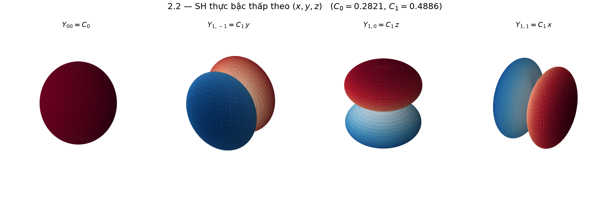
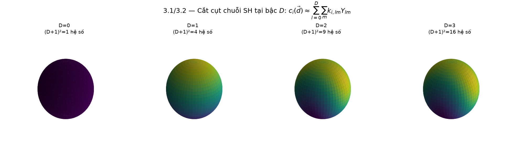
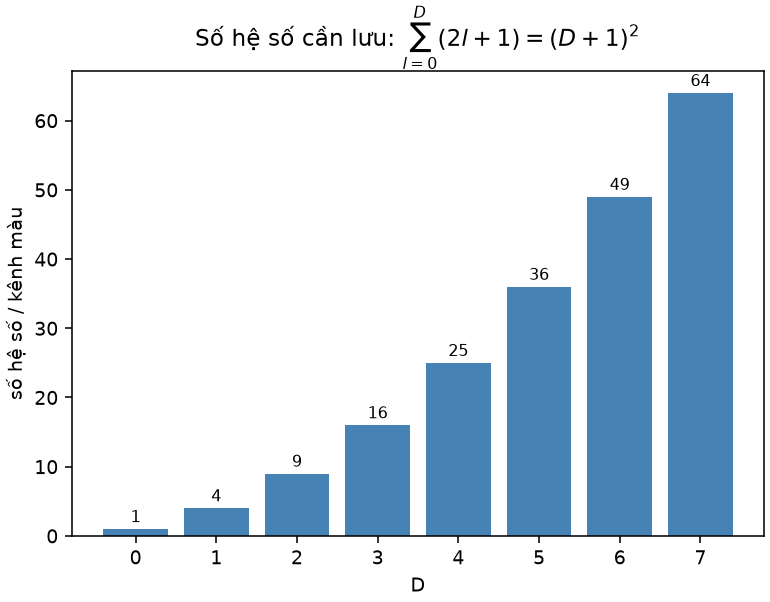
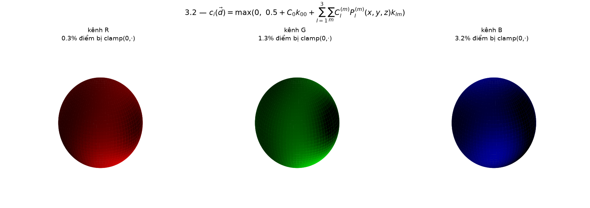

# Spherical Harmonics trong 3D Gaussian Splatting

Đối chiếu code: `SADGS/utils/sh_utils.py` (`C0`, `C1`, `C2[5]`, `C3[7]`, `eval_sh`,
`RGB2SH`, `SH2RGB`) và `computeColorFromSH` trong
`SADGS/submodules/diff-gaussian-rasterization_structgs/cuda_rasterizer/forward.cu`.

## Phần I — Các hàm SH thực bậc thấp theo $(x,y,z)$

Trên mặt cầu đơn vị ($x=\sin\theta\cos\phi,\,y=\sin\theta\sin\phi,\,z=\cos\theta$), các hàm
SH thực bậc thấp là:

$$
\begin{aligned}
l=0:&\quad Y_{00}=\frac{1}{2}\sqrt{\frac1\pi}\[4pt]
l=1:&\quad Y_{1,-1}=\frac12\sqrt{\frac{3}{\pi}}\,y,\quad Y_{1,0}=\frac12\sqrt{\frac{3}{\pi}}\,z,\quad Y_{1,1}=\frac12\sqrt{\frac{3}{\pi}}\,x
\end{aligned}
$$

**Đây chính là $C_0, C_1$ hard-code trong `sh_utils.py`:**
$$C_0=\frac12\sqrt{\frac1\pi}\approx0.28209479177387814,\qquad C_1=\frac12\sqrt{\frac3\pi}\approx0.4886025119029199$$

**Mô phỏng matplotlib** — bốn hàm SH thực bậc thấp $Y_{00}=C_0$, $Y_{1,-1}=C_1y$, $Y_{1,0}=C_1z$, $Y_{1,1}=C_1x$ vẽ trên mặt cầu (bán kính = |giá trị|):



```python
# fig_2_2_low_order_real_sh_xyz() trong sh_figures/sh_visualize.py
C0 = 0.5*np.sqrt(1/np.pi); C1 = 0.5*np.sqrt(3/np.pi)
Y00 = C0
Y1m1, Y10, Y11 = C1*y, C1*z, C1*x
```

$l=2,3$ cho các đa thức bậc 2, 3 theo $x,y,z$ nhân với các hằng số `C2[5]`, `C3[7]` —
đúng các nhánh `if deg > 1` / `if deg > 2` trong `eval_sh`.

---

## Phần II — Khai triển màu theo hướng nhìn

Với mỗi điểm Gaussian $i$, màu phát ra theo hướng $\vec d$ được biểu diễn bằng tổ hợp các
$Y_{lm}$, cắt cụt tại bậc $D$ (`active_sh_degree`, tối đa `max_sh_degree`=3):

$$c_i(\vec d)\approx\sum_{l=0}^{D}\sum_{m=-l}^{l}k_{i,lm}\,Y_{lm}(\vec d)$$

trong đó $k_{i,lm}$ là tham số học được (`_features_dc` cho $l=0$, `_features_rest` cho $l\ge1$).

**Mô phỏng matplotlib** — tái dựng một hàm màu mẫu trên mặt cầu khi tăng dần bậc cắt cụt $D=0,1,2,3$:



Số hệ số cần lưu cho mỗi bậc $D$ là:
$$\sum_{l=0}^{D}(2l+1)=(D+1)^2$$

Đây chính là `(self.max_sh_degree + 1) ** 2` trong `gaussian_model.py`:
$D=0\to1,\ D=1\to4,\ D=2\to9,\ D=3\to16$ hệ số/kênh màu (RGB → nhân 3).

**Mô phỏng matplotlib** — số hệ số $(D+1)^2$ theo từng bậc $D$:



```python
# fig_3_2_truncation_and_coeff_count()
ncoef = (D + 1) ** 2   # 1, 4, 9, 16, ...
```

### Công thức đầy đủ khớp với `computeColorFromSH`

$$
c_i(\vec d)=\max\!\Bigg(0,\ 0.5+\underbrace{C_0k_{00}}_{l=0}\underbrace{-C_1y\,k_{1,-1}+C_1z\,k_{10}-C_1x\,k_{11}}_{l=1}+\underbrace{\sum_m C_2^{(m)}P_2^{(m)}(x,y,z)k_{2m}}_{l=2}+\underbrace{\sum_m C_3^{(m)}P_3^{(m)}(x,y,z)k_{3m}}_{l=3}\Bigg)
$$

| Ký hiệu | Ánh xạ về code |
|---|---|
| $Y_{lm}(\vec d)=C_l^{(m)}P_l^{(m)}(x,y,z)$ | các nhánh hard-code trong `eval_sh` / `computeColorFromSH` |
| $k_{i,lm}$ | `_features_dc` ($l=0$) và `_features_rest` ($l\ge1$) |
| $+0.5$ | đúng `SH2RGB(sh) = sh*C0 + 0.5` (nghịch đảo: `RGB2SH(rgb) = (rgb-0.5)/C0`) |
| $\max(0,\cdot)$ | RGB bị clamp về dương trong `computeColorFromSH`; vị trí bị clamp lưu ở `clamped[]` để chặn gradient ở backward |

**Mô phỏng matplotlib** — áp đúng công thức `computeColorFromSH` đầy đủ (l=0..3) cho từng kênh R/G/B với bộ hệ số $k_{lm}$ ngẫu nhiên, vẽ trên mặt cầu và đo phần trăm điểm bị `max(0,·)` chặn:



```python
# fig_3_3_compute_color_from_sh()
c_raw = 0.5 + sum(k[(l,m)] * sph_harm_y(l, m, THETA, PHI).real
                  for l in range(4) for m in range(-l, l+1))
c = np.clip(c_raw, 0, None)           # max(0, .)
frac_clamped = np.mean(c_raw < 0)     # ty le bi chan
```

### Lịch tăng bậc

Trong `SADGS/train.py`, bậc được tăng mỗi iteration:

```python
if iteration % 1 == 0:
    gaussians.oneupSHdegree()      # active_sh_degree += 1 nếu < max_sh_degree
```

---

## Phần III — Vì sao tách $l=0$ (`features_dc`) và $l\ge1$ (`features_rest`)?

Hệ số $k_{00}$ (ứng với $Y_{00}=C_0=$ const) mang **thành phần một chiều** (DC component) —
màu cơ sở không phụ thuộc hướng nhìn, đúng vai trò của `RGB2SH`/`SH2RGB` khi khởi tạo màu
từ point cloud. Còn 45 hệ số bậc $l=1..3$ mã hóa hiệu ứng phụ thuộc góc nhìn (specular).

Trong code, hai nhóm này được đưa vào **hai nhóm tham số riêng của optimizer** với learning
rate khác nhau (`gaussian_model.py::training_setup`):

```python
{'params': [self._features_dc],   'lr': training_args.feature_lr,        "name": "f_dc"}
{'params': [self._features_rest], 'lr': training_args.highfeature_lr / 20.0, "name": "f_rest"}
```

## Bảng tách C và P

Mỗi $Y_l^m$ = $C \times P$ ($C$: hằng số trong `sh_utils.py`; $P$: đa thức theo $x,y,z$).
Hệ số học được $k$ **không có trong bảng này**.

| $Y_l^m$ | $C$ (hằng số) | $P$ (đa thức theo x,y,z) | $C \times P$ |
|---|---|---|---|
| $Y_0^0$ | $C = \dfrac{1}{2\sqrt{\pi}} \approx 0.282095$ | $P = 1$ | 0.282095 |
| $Y_1^{-1}$ | $C = -\sqrt{\dfrac{3}{4\pi}} \approx -0.488603$ | $P = y$ | -0.488603 y |
| $Y_1^{0}$ | $C = \sqrt{\dfrac{3}{4\pi}} \approx 0.488603$ | $P = z$ | 0.488603 z |
| $Y_1^{1}$ | $C = -\sqrt{\dfrac{3}{4\pi}} \approx -0.488603$ | $P = x$ | -0.488603 x |
| $Y_2^{-2}$ | $C = \dfrac{1}{2}\sqrt{\dfrac{15}{\pi}} \approx 1.092548$ | $P = xy$ | 1.092548 xy |
| $Y_2^{-1}$ | $C = \dfrac{1}{2}\sqrt{\dfrac{15}{\pi}} \approx 1.092548$ | $P = yz$ | 1.092548 yz |
| $Y_2^{0}$ | $C = \dfrac{1}{4}\sqrt{\dfrac{5}{\pi}} \approx 0.315392$ | $P = 3z^2-1$ | 0.315392 (3z²−1) |
| $Y_2^{1}$ | $C = \dfrac{1}{2}\sqrt{\dfrac{15}{\pi}} \approx 1.092548$ | $P = xz$ | 1.092548 xz |
| $Y_2^{2}$ | $C = \dfrac{1}{4}\sqrt{\dfrac{15}{\pi}} \approx 0.546274$ | $P = x^2-y^2$ | 0.546274 (x²−y²) |

## Vậy $k$ ở đâu?

$k$ chỉ xuất hiện khi tính **màu cuối cùng**:

$$
c(\mathbf{d}) = \sum_{l,m} k_l^m \times \underbrace{(C_l^m \times P_l^m(\mathbf{d}))}_{Y_l^m(\mathbf{d})}
$$

Ví dụ với $\mathbf{d} \approx (0.267, 0.535, 0.802)$, nếu $k_1^{-1} = 0.1$:

$$
k_1^{-1} \times Y_1^{-1} = 0.1 \times (-0.488603 \times 0.5345) = 0.1 \times (-0.2611) = -0.02611
$$

Tức $k$ là **số nhân thêm vào**, do model học ra, không nằm trong bảng hằng số $Y_l^m$.
