# Structure-Aware Densification (SADGS) — giải thích công thức ADC

> Nguồn: **SADGS** — *"Faster 3D Gaussian Splatting Convergence via Structure-Aware
> Densification"* (SIGGRAPH 2026). SADGS kế thừa khung Adaptive Density Control (ADC)
> của 3DGS (Kerbl 2023), nhưng thay **tiêu chí** clone/split bằng việc so
> khớp kích thước màn hình của mỗi Gaussian với **cấu trúc texture đa tỉ lệ**
> (multiscale image structure) của ảnh, cộng thêm **multiview-consistency**
> clone/split/prune. Nguồn code: `SADGS/scene/gaussian_model.py`
> (`densify_and_split_structgs`, `densify_and_clone_structgs`,
> `densify_and_prune_structgs`), `SADGS/utils/freq_utils.py`
> (`update_freq_stats_online`), `SADGS/train.py` (vòng lặp huấn luyện) và
> `SADGS/arguments/__init__.py` (siêu tham số mặc định). Mọi con số trong tài liệu là
> giá trị mặc định trong các file đó; chỗ nào là suy luận riêng ghi rõ "(diễn giải
> thêm)". **Lưu ý:** `gaussian_model.py` còn định nghĩa `expand_undersized_gs` và
> `final_prune_structgs`, nhưng lời gọi duy nhất tới mỗi hàm này trong `train.py`
> (dòng 356-359 và 418-419) đang bị **comment out** — cả hai không chạy trong lịch
> huấn luyện mặc định, nên tài liệu này không mô tả chúng như một phần của luồng
> chạy thật (xem chương 18.5/18.6 để phân tích chi tiết hai hàm chết này).

**ADC là gì.** 3DGS/SADGS biểu diễn cảnh bằng một tập $N$ Gaussian 3D, mỗi Gaussian
$i$ có tham số $\theta_i=(\mu_i,\ q_i,\ s_i,\ \alpha_i,\ \text{SH}_i)$. Gradient
descent chỉ **dời và nắn** các Gaussian sẵn có; ADC là vòng lặp phụ thêm/xoá Gaussian:

| Việc | Cơ chế (SADGS) | Tác dụng lên $N$ |
|---|---|---|
| **Densify** (làm dày) | clone Gaussian nhỏ / **split dị hướng** Gaussian to hơn cấu trúc texture cục bộ, có điều kiện thêm bằng **importance** và **multiview-consistency** | $N$ tăng |
| **Prune** (tỉa) | xoá Gaussian gần trong suốt, quá to, hoặc **không nhất quán qua nhiều view** (`low_ratio` trong cùng bước densify) | $N$ giảm |
| **Reset opacity** | nhân $\alpha_i\leftarrow\alpha_i\times$`opacity_reset_decay` định kỳ | không đổi $N$ ngay, nhưng "gài" để prune xoá sau đó |

**Mục đích.** Điểm SfM khởi tạo thường (i) thưa ở vùng ít texture, (ii) thiếu hẳn ở
vùng SfM không khớp được, (iii) quá to/quá nhỏ so với chi tiết ảnh cần vẽ. Thay vì chỉ
dùng gradient vị trí (dấu hiệu gián tiếp), SADGS đo trực tiếp **tỉ số giữa kích thước
hình chiếu của Gaussian và "bước sóng" chi tiết texture cục bộ** — gọi là $\eta$ — rồi
dùng $\eta$ tích luỹ qua nhiều view để quyết định clone/split/prune, giảm số
vòng cần thiết để hội tụ so với 3DGS gốc.

**Mục lục**

- [1. Lịch chạy](#1-lịch-chạy)
- [2. Thống kê phụ trợ: gradient vị trí và $\eta$](#2-thống-kê-phụ-trợ-gradient-vị-trí-và-eta)
- [3. Điều kiện densify structure-aware](#3-điều-kiện-densify-structure-aware)
- [4. Clone vs Split dị hướng](#4-clone-vs-split-dị-hướng)
- [5. Prune cứng + multiview-consistency prune](#5-prune-cứng--multiview-consistency-prune)
- [6. Reset opacity](#6-reset-opacity)
- [7. Sơ đồ luồng toàn bộ chu trình](#7-sơ-đồ-luồng-toàn-bộ-chu-trình)
- [8. Ví dụ tổng hợp: một bước densify_and_prune_structgs](#8-ví-dụ-tổng-hợp-một-bước-densify_and_prune_structgs)
- [9. Bảng tổng hợp hằng số / hyperparameter](#9-bảng-tổng-hợp-hằng-số--hyperparameter)
- [10. Tóm tắt kết quả mô phỏng toy](#10-tóm-tắt-kết-quả-mô-phỏng-toy)
- [11. Nguồn](#11-nguồn)

---

## 1. Lịch chạy

Khung lịch chạy **giữ nguyên** so với 3DGS gốc — SADGS không đổi tần suất,
chỉ đổi **tiêu chí bên trong** mỗi lần densify:

| Việc | Khi nào | Số lần |
|---|---|---|
| Tích luỹ $\bar g_i$ (gradient vị trí) và $\eta_{i,a}$ (violation tần số) | mỗi vòng, $t<$`densify_until_iter` (=15000) | 15 000 |
| `densify_and_prune_structgs` (clone/split + prune) | mỗi `densification_interval` (=100) vòng, `densify_from_iter`(=500) $<t<$ `densify_until_iter`(=15000) | 144 |
| Reset opacity (**nhân**, không phải floor) | mỗi `opacity_reset_interval` (=3000) vòng, $t<15000$ | 4 (3000/6000/9000/12000) |
| Sau $t=15000$ | **không có gì** — $N$ đóng băng, chỉ còn gradient descent | 0 |

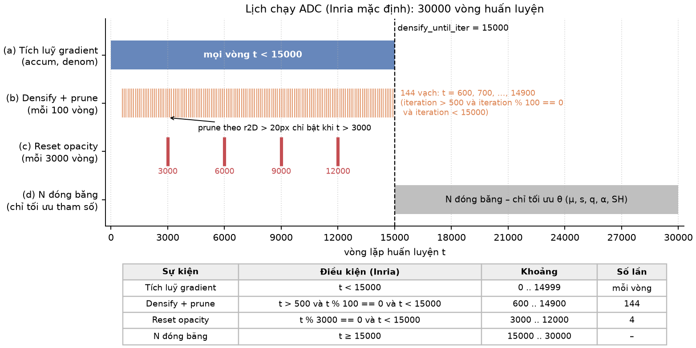

*Trục thời gian giữ cấu trúc như 3DGS gốc: vùng tích luỹ thống kê, 144 vạch densify
cách nhau 100 vòng trong $(500,15000)$, 4 vạch reset opacity — chỉ khác là mỗi vạch
densify giờ chạy tiêu chí structure-aware (mục 3) thay vì chỉ gradient.*

**Cách đếm 144** không đổi: $t\in\{600,700,\dots,14900\}\Rightarrow 144$ mốc (xem
lại 3DGS gốc nếu cần suy luận chi tiết — công thức đếm giống hệt vì
`densification_interval`, `densify_from_iter`, `densify_until_iter` không đổi giá
trị mặc định giữa hai codebase).

**Khác biệt quan trọng so với 3DGS gốc tại $t=$ `densify_until_iter`:** trong
`train.py` của SADGS, khối `reset_opacity` nằm **trong** `if iteration <
densify_until_iter`, nên **không** có reset nào xảy ra đúng tại $t=15000$ dù
$15000\bmod3000=0$ — khác 3DGS gốc vốn cũng loại trừ mốc này vì lý do tương tự. Đây
là điểm hay bị lập trình sai (toy demo ban đầu của tài liệu này từng mắc lỗi này:
reset ngay trước khi tính `final_prune_structgs` làm $\alpha$ rơi xuống dưới
`min_opacity` hàng loạt và xoá sạch $N$ — xem mục 10).

---

## 2. Thống kê phụ trợ: gradient vị trí và $\eta$

SADGS vẫn tích luỹ gradient vị trí $\bar g_i$ (công thức giống 3DGS gốc, dùng làm
**cổng phụ** `is_grad_high`), nhưng thêm một bộ thống kê mới là **violation tần số**
$\eta$, tích luỹ trong `update_freq_stats_online` (`SADGS/utils/freq_utils.py`).

### 2.1 Gradient vị trí (cổng phụ, không còn là tiêu chí chính)

$$
\bar g_i=\frac{\text{accum}_i}{\text{denom}_i},\qquad
\text{accum}_i=\sum_t\mathbb 1_i(t)\lVert\nabla_{\mu'_i}\mathcal L\rVert,\qquad
\text{denom}_i=\sum_t\mathbb 1_i(t)
$$

dùng để tính `is_grad_high = ‖g_bar‖ ≥ grad_thresh` (`grad_thresh = 2e-4`, giống
$\tau_{\text{grad}}$ 3DGS gốc) — đây chỉ còn là **một trong nhiều điều kiện AND**
của split (mục 3), không đủ để tự nó quyết định densify.

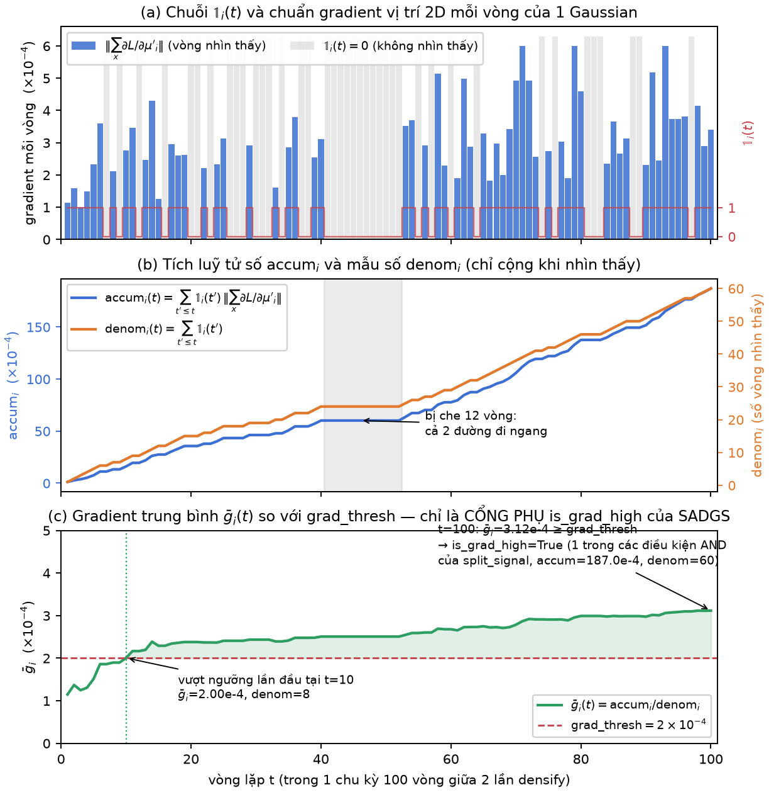

*Hai bộ đếm của gradient vị trí qua nhiều vòng — cơ chế tích luỹ giống 3DGS gốc,
nhưng kết quả $\bar g_i$ giờ chỉ là MỘT cổng phụ (`is_grad_high`) chứ không tự quyết
định clone/split.*

### 2.2 Violation tần số $\eta$ — tín hiệu chính

Với mỗi Gaussian $i$, mỗi lần "được nhìn thấy tích cực" (visible, opacity đủ lớn,
transmittance đủ lớn, **và** $\bar g$ tức thời $>$ `freq_grad_threshold`
$=2\times10^{-5}$), tính theo mỗi trục hình chiếu $a$:

$$
\boxed{\ \eta_{i,a}(t)=\dfrac{\text{độ dài trục }a\text{ chiếu lên màn hình}}{\lambda(\mu_i)}\ }
$$

trong đó $\lambda(x)$ là **"bước sóng" chi tiết texture cục bộ** tại vị trí $x$:
lấy $\lambda_1(x)$ = trị riêng lớn nhất của **structure tensor** $2\times2$ của ảnh
tại $x$ (năng lượng tần số cao nhất), rồi $\lambda(x)=1/\sqrt{\lambda_1(x)}$. $\eta>1$
nghĩa là Gaussian **to hơn** chi tiết texture tại đó → alias → cần split; $\eta<1$
nghĩa là Gaussian **nhỏ hơn cần thiết** → lãng phí, có thể nới rộng thay vì thêm
điểm mới (mục 4.3).

Mỗi Gaussian giữ (reset về 0 sau mỗi lần densify, giống `accum`/`denom`):

| Bộ đếm | Tương ứng biến trong code | Vai trò |
|---|---|---|
| `eta_max[i,a]` | `max_eta_3ch` | **max** (không phải trung bình) của $\eta_{i,a}(t)$ qua các lần quan sát — dùng làm "hướng dẫn" cho $k$ trong split dị hướng (mục 4.2) |
| `view_count[i]` | `accum_view_count` | số lần quan sát tích cực — dùng làm `importance_score` (mục 3) |
| `eta_hi_cnt[i]` | `eta_high_count` | số lần $\max_a\eta_{i,a}>$ `TAU_HIGH` $=1.0$ |
| `eta_lo_cnt[i]` | `eta_low_count` | số lần $\max_a\eta_{i,a}\le$ `TAU_LOW` $=0.1$ |

Tỉ số `eta_hi_cnt/view_count` và `eta_lo_cnt/view_count` chính là **multiview
consistency ratio** dùng ở mục 3 — một Gaussian chỉ bị coi là "cần split" nếu nó
**alias ở đa số các view đã thấy**, không phải chỉ một view ngẫu nhiên (giảm
false-positive so với dùng gradient của 1 vòng như 3DGS gốc).

(diễn giải thêm) Vì `eta_max` là **max** cộng dồn qua nhiều quan sát có nhiễu (jitter
sampling ngẫu nhiên trong ellipsoid $1\sigma$ để lấy mẫu structure tensor), giá trị
này thiên lệch lên trên theo số lần quan sát — toy demo (mục 10) phải hạ biên độ
nhiễu giả lập để tránh $\eta_{\max}$ bị thổi phồng phi thực tế qua ~70 quan sát mỗi
cửa sổ 100 vòng.

---

## 3. Điều kiện densify structure-aware

Tại mỗi mốc densify, SADGS kết hợp **ba** điều kiện AND/OR (khác 3DGS gốc chỉ có
một ngưỡng gradient):

$$
\boxed{\
\begin{aligned}
\text{high\_ratio}_i &= \eta\_hi\_cnt_i / \text{view\_count}_i, &
\text{low\_ratio}_i &= \eta\_lo\_cnt_i / \text{view\_count}_i \\[2pt]
\text{split\_signal}_i &= [\text{high\_ratio}_i > \texttt{split\_ratio\_threshold}\,(0.8)] \ \wedge\ [\text{is\_grad\_high}_i] \\[2pt]
\text{importance}_i &= \text{view\_count}_i \big/ \max_j \text{view\_count}_j\ ,\quad
\text{metric}_i = [\text{importance}_i > \texttt{importance\_score\_threshold}\,(0.5)] \\[2pt]
\text{clone}_i &= \text{metric}_i \wedge \text{split\_signal}_i \wedge [\max(s_i)\le \texttt{dense}\cdot\text{extent}] \\[2pt]
\text{split}_i &= \text{metric}_i \wedge \text{split\_signal}_i \wedge [\max(s_i) > \texttt{dense}\cdot\text{extent}]
\end{aligned}\ }
$$

với `dense` = `args.dense` $=0.001$ (tương đương `percent_dense` 3DGS gốc, nhưng giá
trị nhỏ hơn 10 lần trong cấu hình SADGS mặc định).

| Ký hiệu | Nghĩa |
|---|---|
| `split_signal` | tín hiệu multiview-consistency: Gaussian này **liên tục** vi phạm Nyquist ($\eta>1$) ở phần lớn các view đã thấy, **và** vẫn còn gradient vị trí đáng kể |
| `metric` (importance) | lọc theo mức độ "được nhìn thấy" — Gaussian ít được quan sát (rìa khung hình, ít camera bao phủ) không được phép densify dù $\eta$ cao, tránh lãng phí ngân sách |
| `dense·extent` | ranh giới nhỏ/to — vai trò giống $\delta\cdot\text{extent}$ 3DGS gốc, quyết định **clone hay split** cho cùng một `split_signal` |

Khác biệt cốt lõi so với 3DGS gốc: **cùng một tín hiệu** (`split_signal`) gate cả
clone lẫn split — phân nhánh clone/split chỉ phụ thuộc **kích thước hiện tại**, y hệt
3DGS gốc, nhưng bản thân tín hiệu kích hoạt không còn là một ngưỡng gradient đơn lẻ
mà là sự đồng thuận qua nhiều view của độ lệch cấu trúc texture.

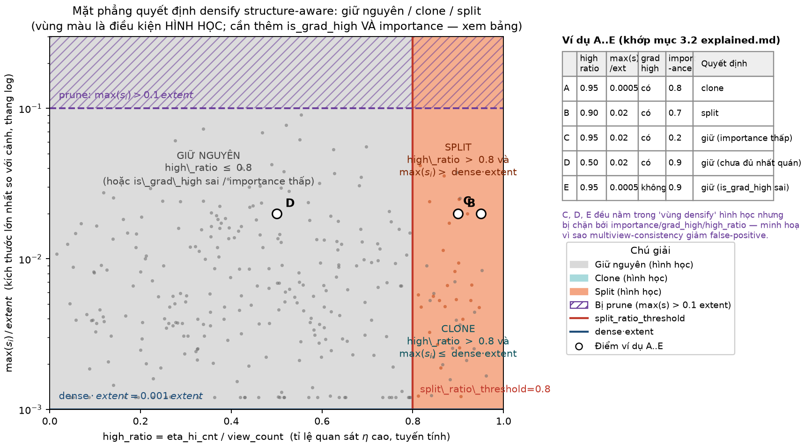

*Mặt phẳng $(\text{high\_ratio},\ \max s/\text{extent})$ (thay cho $(\bar g,\max s)$
3DGS gốc): vùng bên phải đường dọc `split_ratio_threshold=0.8` là ứng viên
densify, chia tiếp theo `dense·extent` thành clone (dưới)/split (trên); Gaussian
với `importance` thấp bị loại khỏi cả hai vùng bất kể vị trí trên mặt phẳng.*

### 3.1 Extent — không đổi vai trò

`extent` (`scene.cameras_extent`) vẫn là thước đo "to/nhỏ" không phụ thuộc đơn vị
cảnh, dùng y hệt 3DGS gốc cho cả ranh giới clone/split (`dense·extent`) lẫn ranh giới
prune "quá to" (`0.1·extent`, mục 5).

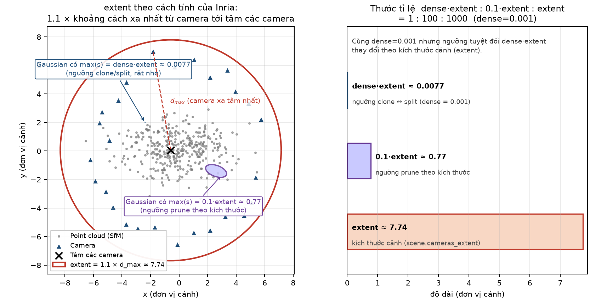

*Hình cầu bao camera cho `extent`; `dense·extent` (=0.1% cảnh, nhỏ hơn nhiều so với
1% của 3DGS gốc) là ranh giới clone/split, `0.1·extent` là ranh giới prune "quá to".*

### 3.2 Bảng ví dụ

| # | high_ratio | is_grad_high? | importance | $\max(s_i)/\text{extent}$ | Kết quả |
|---|---|---|---|---|---|
| A | 0.95 | có | 0.8 | 0.0005 ≤ dense | **clone** |
| B | 0.90 | có | 0.7 | 0.02 > dense | **split** |
| C | 0.95 | có | **0.2** (< 0.5) | 0.02 | giữ nguyên — thiếu importance dù alias mạnh |
| D | **0.5** (< 0.8) | có | 0.9 | 0.02 | giữ nguyên — chưa "đủ nhất quán" qua các view |
| E | 0.95 | **không** | 0.9 | 0.0005 | giữ nguyên — vị trí đã ổn định (gradient nhỏ) dù $\eta$ cao đều |

Điểm D và E cho thấy vì sao multiview-consistency + gradient-gate giảm số
false-positive so với 3DGS gốc: chỉ một quan sát $\eta$ cao đơn lẻ (như trường hợp C,
D không thoả `split_ratio_threshold`) không đủ để kích hoạt densify.

---

## 4. Clone vs Split dị hướng

### 4.1 Clone — không đổi so với 3DGS gốc

`densify_and_clone_structgs`: bản mới $\theta_{\text{new}}=\theta_i$ (copy nguyên,
kể cả `densify_count` — số lần Gaussian này từng bị split, dùng để giới hạn
over-densification), gốc giữ, $N+1$.

### 4.2 Split dị hướng theo trục — khác biệt lớn nhất so với 3DGS gốc

3DGS gốc luôn sinh **đúng 2 con**, chia đều theo trục dài nhất. SADGS
(`densify_and_split_structgs`) tính **số con riêng cho từng trục** dựa trên lý
thuyết lấy mẫu (Nyquist):

$$
\boxed{\
k_a=\operatorname{clip}\Bigl(\bigl\lceil\sqrt{\eta_{\max,a}}\bigr\rceil,\ 1,\ \texttt{max\_clones\_per\_axis}\ (=8)\Bigr),\qquad
a\in\{x,y,z\}\ }
$$

Lý do: để hết alias cần $\sigma_{\text{new}}\cdot\omega\le1$; vì
$\eta=(\sigma\omega)^2$ nên $\sigma_{\text{new}}=\sigma/\sqrt\eta$ — chia $\sigma$
cho $k\ge\sqrt\eta$ theo từng trục **độc lập** (không phải chỉ trục dài nhất như
3DGS gốc). Tổng số con $=k_x\cdot k_y\cdot k_z$ (3D) đặt trên **lưới đều tâm 0**
(không phải mẫu ngẫu nhiên $\mathcal N(0,\Sigma)$ như 3DGS gốc):

$$
\text{scale}_{\text{new}}=\dfrac{s_i}{k^{\ \texttt{ks\_scale\_power}}}\ (\texttt{ks\_scale\_power}=1.0),\qquad
\text{separation}_a=\dfrac{s_{i,a}}{k_a}\sqrt{12}
$$

rồi toạ độ lưới $\{-\tfrac{k_a-1}2,\dots,\tfrac{k_a-1}2\}\times\text{separation}_a$
được xoay bởi $R(q_i)$ và cộng vào $\mu_i$. Gốc bị xoá; $N\to N+(k_x k_y k_z-1)$ cho
mỗi Gaussian bị split — **không còn cố định $+1$** như 3DGS gốc, vì số con phụ thuộc
$\eta$.

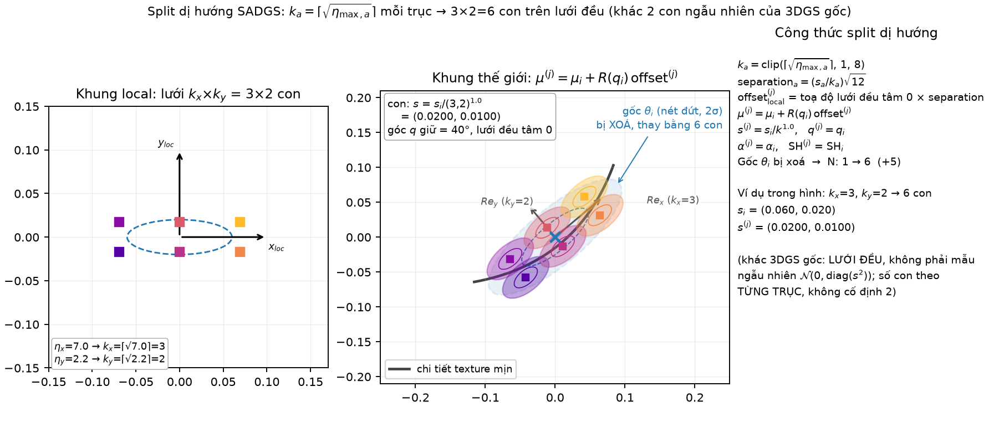

*Khác 3DGS gốc (luôn 2 con lệch ngẫu nhiên): SADGS đặt $k_x\times k_y$ con trên lưới
đều, số con mỗi trục tỉ lệ $\sqrt\eta$ của trục đó — trục có texture mịn hơn (η lớn
hơn) được chia nhỏ hơn.*

### 4.3 `expand_undersized_gs` tồn tại trong code nhưng không chạy

`gaussian_model.py:833-865` định nghĩa `expand_undersized_gs`: với Gaussian có trục
$a$ thoả $0<\eta_{\max,a}<$ `tau_expand` ($=1.0$), hàm nới rộng scale trực tiếp bằng
công thức phân tích $\log s_{\text{new},a}=\log s_{\text{old},a}-\tfrac12\log\eta_{\max,a}$
(đưa $\eta_{\text{new},a}$ về đúng $1$, không sinh điểm mới). Công thức đúng và hàm
chạy được, nhưng lời gọi **duy nhất** tới nó trong `train.py:356-359` đang bị
**comment out** — trong cấu hình mặc định, densify chỉ còn **clone** và **split**
như ở mục 4.1/4.2; không có bước "expand" nào chạy. Phân tích chi tiết ở chương
[18.5](../18-sadgs-co-che-chuyen-sau/05-clone-va-expand.md).

### 4.4 Ví dụ kế toán $N$

Tại một mốc densify có $N=1000$: 60 Gaussian thoả clone, 40 thoả split (giả sử với
$\eta_{\max}$ khác nhau nên tổng con sinh ra là 132, không phải $2\times40=80$):

| Bước | Thêm | Xoá | $N$ sau bước |
|---|---|---|---|
| Xuất phát | — | — | 1000 |
| Clone 60 | $+60$ | 0 | 1060 |
| Split 40 → 132 con | $+132$ | $-40$ | 1152 |
| **Tổng densify** | $+192$ | $-40$ | **1152** |

Sau đó mới đến prune (mục 5).

---

## 5. Prune cứng + multiview-consistency prune

Trong cùng bước `densify_and_prune_structgs`, sau clone/split:

$$
\boxed{\ \text{xoá}_i=\underbrace{[\alpha_i<0.1]}_{\text{(P1)}}\ \vee\
\underbrace{[r_i^{2D}>20\text{px}]_{t>3000}}_{\text{(P2)}}\ \vee\
\underbrace{[\max(s_i)>0.1\cdot\text{extent}]}_{\text{(P3)}}\ \vee\
\underbrace{[\text{low\_ratio}_i>\texttt{prune\_ratio\_threshold}\,(0.8)]}_{\text{(P4) mới}}\ }
$$

| Điều kiện | Khác 3DGS gốc |
|---|---|
| (P1) | Ngưỡng $\alpha_{\min}=$ **0.1**, không phải 0.005 — SADGS xoá quyết liệt hơn nhiều Gaussian mờ, dựa trên giả định các Gaussian hữu ích sẽ được split "cứu" thay vì để tồn tại mờ nhạt |
| (P2), (P3) | Giữ nguyên công thức và ngưỡng 3DGS gốc (20 px, $0.1\cdot\text{extent}$) |
| (P4) | **Mới**: Gaussian có `low_ratio` (tỉ lệ quan sát $\eta\le0.1$, tức "quá phẳng/dư thừa") vượt `prune_ratio_threshold=0.8` bị xoá dù opacity/scale bình thường — bắt các Gaussian dư thừa trong vùng đã đủ chi tiết mà gradient không tự dọn |

Sau bước prune, opacity bị **chặn trần** (không phải reset):

$$
\alpha_i\leftarrow\min(\alpha_i,\ \texttt{opacity\_cap}=0.8)
$$

### 5.1 `final_prune_structgs` tồn tại trong code nhưng lời gọi bị comment

`gaussian_model.py:1059-1066` định nghĩa thêm một hàm prune độc lập,
$\text{final\_xoá}_i = [\alpha_i<\texttt{min\_opacity}]\ \vee\ [\texttt{pruning\_score}_i>0.9]$,
dự kiến gọi tại các mốc `prune_iterations` (`train.py`, mặc định $\{4000,8000\}$) với
`pruning_score` đến từ việc render lại Gaussian dưới nhiều camera FPS
(`sampling_cameras`) để đo độ không nhất quán tái tạo đa view. Trong `train.py` hiện
tại, lời gọi hàm chấm điểm (`compute_gaussian_score_structgs` — vốn **không tồn tại**
trong repo) và lời gọi `final_prune_structgs` tại các mốc đó (`train.py:418-419`) đều
đang **bị comment out**; chỉ còn `prune_points(get_opacity < 0.1)` chạy tại hai mốc
này (`train.py:416-417`). Phân tích chi tiết ở chương
[18.6](../18-sadgs-co-che-chuyen-sau/06-densify-prune-va-final-prune.md).

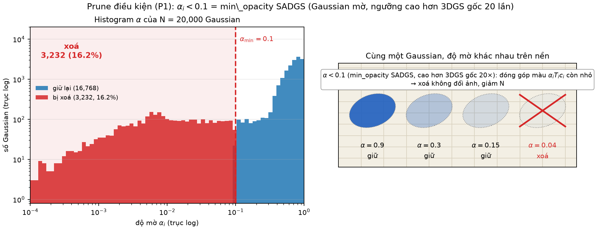

*Bên cạnh ngưỡng $\alpha<0.1$ (cao hơn 3DGS gốc 20 lần), SADGS thêm điều kiện
`low_ratio` — Gaussian "phẳng" nhất quán qua nhiều view bị coi là dư thừa dù opacity
vẫn ổn.*

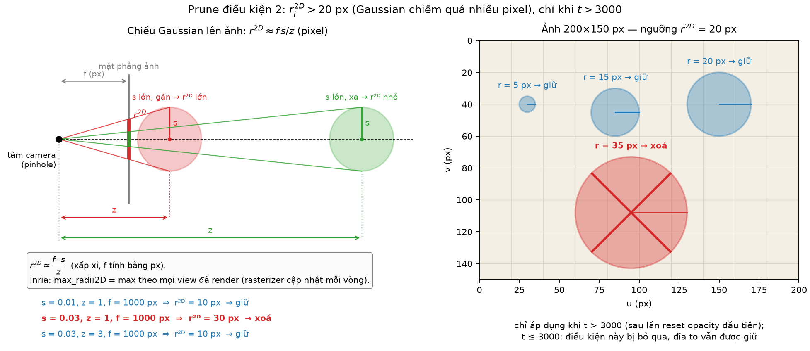

*Điều kiện (P2) không đổi so với 3DGS gốc: bán kính chiếu $>20$ px, chỉ bật khi $t>$
`opacity_reset_interval`.*

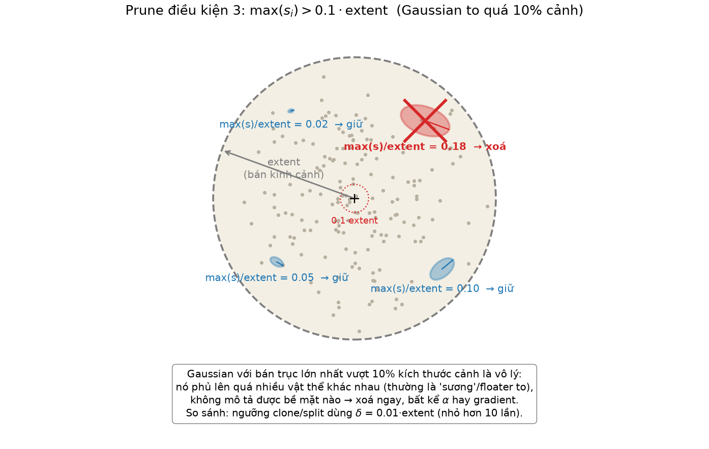

*Điều kiện (P3) không đổi: $\max(s_i)>0.1\cdot\text{extent}$.*

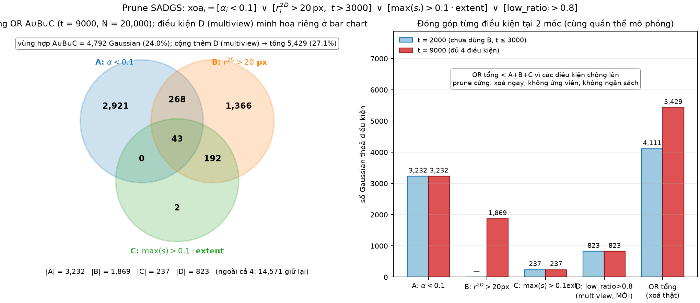

*Bốn điều kiện (P1)-(P4), hợp OR — một Gaussian chỉ sống sót khi nằm ngoài **cả bốn**
vùng cấm (so với ba vùng ở 3DGS gốc).*

---

## 6. Reset opacity

### 6.1 Công thức — nhân, không phải floor

Tại các mốc $t=3000k$ ($k=1,2,3,4$; **không** áp dụng đúng tại
$t=$`densify_until_iter`$=15000$, xem mục 1):

$$
\boxed{\ \alpha_i\ \leftarrow\ \alpha_i\times\texttt{opacity\_reset\_decay}\ (=0.1)\ }
$$

Khác 3DGS gốc (kéo **về một sàn cố định** $\min(\alpha,0.01)$): SADGS **nhân** mọi
$\alpha_i$ với $0.1$ — Gaussian đang "đục" ($\alpha=0.9$) sau reset còn $0.09$, Gaussian
đang mờ ($\alpha=0.2$) còn $0.02$. Thứ tự tương đối giữa các Gaussian được **giữ
nguyên** (không "xoá ký ức" hoàn toàn như floor-reset của 3DGS gốc), chỉ co biên độ
lại 10 lần để buộc mọi Gaussian phải "chứng minh lại" độ hữu ích qua gradient, đồng
thời không đẩy các Gaussian vốn đã tốt xuống một sàn chung.

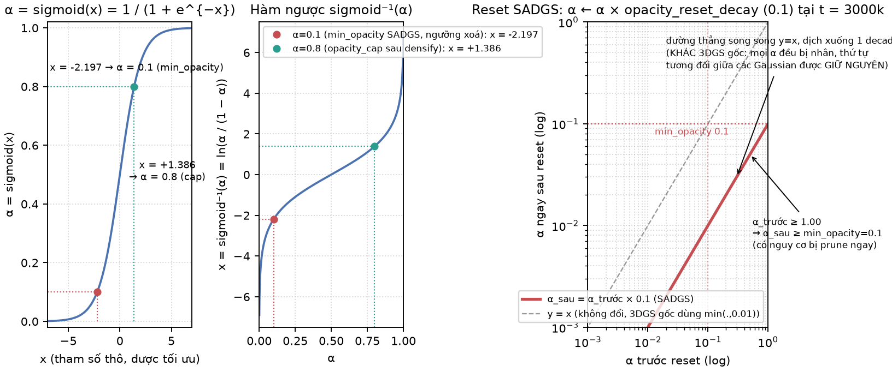

*Tham số thật lưu ở dạng logit ($\tilde\alpha=\sigma^{-1}(\alpha)$); phép nhân
$\alpha\times0.1$ trong không gian xác suất tương ứng phép **trừ** $\ln(1/0.1)$ có
điều chỉnh phi tuyến trong không gian logit (không phải một điểm cố định như floor-
reset), nên histogram sau reset **không** dồn về một cột duy nhất như 3DGS gốc.*

### 6.2 Vài giá trị số

| $\alpha$ trước | $\alpha\times0.1$ sau | Ghi chú |
|---|---|---|
| 0.90 | 0.090 | vẫn trên ngưỡng prune (P1) mới ($0.1$) → **có nguy cơ bị xoá** ở lần prune kế nếu không hồi phục kịp — khác 3DGS gốc nơi giá trị reset $0.01$ luôn nằm trên ngưỡng xoá $0.005$ |
| 0.50 | 0.050 | dưới $0.1$ → nếu bước prune chạy ngay (trùng mốc) sẽ bị xoá |
| 0.05 | 0.005 | đã thấp từ trước, càng chắc bị xoá |

(diễn giải thêm) Vì `min_opacity=0.1` **gần bằng** giá trị điển hình sau reset
($\alpha\times0.1$ với $\alpha$ khởi tạo quanh $0.1$–$0.9$), một tỉ lệ đáng kể
Gaussian có nguy cơ bị prune ngay ở chu kỳ densify **đầu tiên sau reset** nếu chưa
kịp phục hồi — cửa sổ 100 vòng giữa reset và lần prune kế là "vừa đủ" để phân loại,
tương tự vai trò của nó trong 3DGS gốc nhưng với biên độ chặt hơn nhiều.

---

## 7. Sơ đồ luồng toàn bộ chu trình

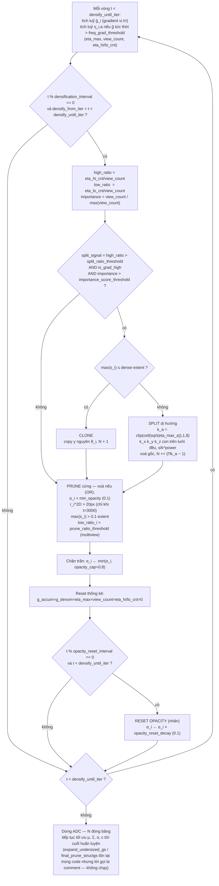

---

## 8. Ví dụ tổng hợp: một bước `densify_and_prune_structgs`

Cảnh có $\text{extent}=10$ → `dense·extent`$=0.01$ (ranh giới clone/split), $0.1\cdot\text{extent}=1.0$ (ngưỡng P3). $t=6000>3000$ nên (P2) hoạt động.

| id | high_ratio | is_grad_high | importance | $\max(s_i)/\text{extent}$ | $\eta_{\max}=(\eta_x,\eta_y,\eta_z)$ | $\alpha_i$ | → hành động | → sống sót |
|---|---|---|---|---|---|---|---|---|
| 1 | 0.90 | có | 0.8 | 0.005 ≤ dense | — | 0.60 | **clone** | 2 |
| 2 | 0.85 | có | 0.7 | 0.030 > dense | (4, 1, 1) | 0.70 | **split**: $k=(2,1,1)$ → 2 con, $s_{\text{new},x}=s_x/2$ | 2 |
| 3 | 0.85 | có | 0.9 | 0.040 > dense | (9, 4, 1) | 0.75 | **split**: $k=(3,2,1)$ → 6 con | 6 |
| 4 | 0.30 (< 0.8) | có | 0.9 | 0.020 | (0.5, 0.4, 0.3) | 0.50 | giữ nguyên — thiếu split_signal; cả 3 trục $\eta<1$ đủ điều kiện `expand_undersized_gs` về lý thuyết, nhưng lời gọi hàm đó bị comment trong `train.py`, nên scale **không** được nới | 1 |
| 5 | 0.10 | không | 0.9 | 0.002 | — | **0.03** (< 0.1) | giữ nguyên (không thoả split_signal) | **xoá** ở bước prune (P1) |
| 6 | 0.95 | có | **0.3** (< 0.5) | 0.02 | — | 0.60 | giữ nguyên — thiếu importance | (P4) `low_ratio` không cao → sống, 1 |

### 8.1 Kiểm đếm $N$

$$
\begin{aligned}
N_{\text{trước}} &= 6\\
\text{clone (id 1)}: &+1\ \Rightarrow 7\\
\text{split (id 2: 2 con, id 3: 6 con)}: &+2+(-1)+6+(-1)=+6\ \Rightarrow 13\\
\text{id 4 (giữ nguyên)}: &+0\ \Rightarrow 13\\
\text{prune (id 5, (P1))}: &-1\ \Rightarrow \boxed{N_{\text{sau}}=12}
\end{aligned}
$$

Khác biệt lớn nhất so với ví dụ tương đương của 3DGS gốc: số con sinh ra từ split
**không cố định bằng 2** (id 3 sinh 6 con vì $\eta_y$ cao gấp đôi $\eta_x$).

---

## 9. Bảng tổng hợp hằng số / hyperparameter

| Ký hiệu | Giá trị mặc định | Tên trong `SADGS/arguments/__init__.py` | Ý nghĩa |
|---|---|---|---|
| `grad_thresh` | $2\times10^{-4}$ | `grad_thresh` | cổng phụ `is_grad_high` trên $\bar g_i$ |
| `freq_grad_threshold` | $2\times10^{-5}$ | `freq_grad_threshold` | cổng tích luỹ thống kê $\eta$ (chỉ tích luỹ khi $\bar g$ tức thời vượt ngưỡng này) |
| `importance_score_threshold` | $0.5$ | `importance_score_threshold` | lọc theo `view_count` chuẩn hoá trước khi cho phép clone/split |
| `split_ratio_threshold` | $0.8$ | `split_ratio_threshold` | multiview-consistency: tỉ lệ quan sát $\eta$ cao cần thiết để kích hoạt split_signal |
| `prune_ratio_threshold` | $0.8$ | `prune_ratio_threshold` | multiview-consistency: tỉ lệ quan sát $\eta$ thấp để bị prune thêm (P4) |
| `tau_expand` | $1.0$ | `tau_expand` | ngưỡng $\eta$ dùng bởi `expand_undersized_gs` — **hàm này tồn tại nhưng lời gọi bị comment trong `train.py`, nên `tau_expand` không có tác dụng gì trong lịch chạy mặc định** |
| `ks_scale_power` | $1.0$ | `ks_scale_power` | số mũ chia scale khi split: $s_{\text{new}}=s/k^{\text{power}}$ |
| `max_clones_per_axis` | $8$ | `max_clones_per_axis` | trần số con mỗi trục khi split dị hướng |
| `dense` | $0.001$ | `dense` | ranh giới nhỏ/to (clone/split), tương đương `percent_dense` 3DGS gốc |
| `eta_compute_mode` | `"wavelength"` | `eta_compute_mode` | cách tính $\eta$: `"wavelength"` (tỉ số kích thước/bước sóng, dùng trong tài liệu này) hoặc `"projection"` (chiếu structure tensor trực tiếp lên từng trục) |
| `min_opacity` | $0.1$ | hằng trong `train.py` (gọi `densify_and_prune_structgs`) | (P1) — cao hơn 3DGS gốc ($0.005$) 20 lần |
| `opacity_reset_decay` | $0.1$ | `opacity_reset_decay` | hệ số **nhân** khi reset opacity (không phải floor) |
| `opacity_cap` (sau densify) | $0.8$ | hằng `0.8` trong `densify_and_prune_structgs` | chặn trần $\alpha$ sau mỗi lần densify+prune |
| `TAU_HIGH` / `TAU_LOW` | $1.0$ / $0.1$ | hằng trong `freq_utils.py` | ngưỡng phân loại quan sát $\eta$ thành cao/thấp cho multiview-consistency |
| `densify_from_iter` | $500$ | `densify_from_iter` | mốc densify đầu tiên (giống 3DGS gốc) |
| `densification_interval` | $100$ | `densification_interval` | chu kỳ densify (giống 3DGS gốc) |
| `densify_until_iter` | $15000$ | `densify_until_iter` | kết thúc densify + reset opacity (giống 3DGS gốc) |
| `opacity_reset_interval` | $3000$ | `opacity_reset_interval` | chu kỳ reset opacity (giống 3DGS gốc) |
| `r^{2D}_{\max}` | $20$ px, extent $\times0.1$ | hằng trong `densify_and_prune_structgs` | (P2), (P3) — không đổi so với 3DGS gốc |

---

## 10. Tóm tắt kết quả mô phỏng toy

**Lưu ý quan trọng trước khi đọc số liệu dưới đây:** để minh hoạ trọn vẹn các công
thức đã trình bày (kể cả hai hàm tồn tại nhưng không được gọi trong `train.py` —
`expand_undersized_gs` và `final_prune_structgs`), script mô phỏng toy
`adc_3dgs_demo.py` **chủ động bật cả hai** trong vòng lặp giả lập của nó. Các số liệu
"lượt expand" và "final_prune" dưới đây vì vậy **không phản ánh hành vi thật của
`SADGS/train.py`** — ở đó hai lời gọi này đang bị comment out (`train.py:356-359` và
`:418-419`), nên trong huấn luyện thật $N$ chỉ thay đổi qua clone/split/prune
(mục 3-5), không có bước expand hay final-prune nào chạy.

Script `adc_3dgs_demo.py` (cùng thư mục) mô phỏng toàn bộ chu trình trên bằng numpy:
$N_0$ Gaussian rải đều trong ô vuông $[0,1]^2$; "bước sóng texture" $\lambda(x)$ giả
lập nhỏ (mịn) trong một băng quanh đường tròn tâm $(0.5,0.5)$ bán kính $0.3$, lớn
(mượt) nơi khác — Gaussian trong băng có $\eta$ cao hơn, dễ split; nơi khác $\eta$
thấp hơn, dễ bị coi là "quá nhỏ" (điều kiện `expand_undersized_gs`, bật riêng cho toy
demo) hoặc bị prune multiview-consistency nếu dư thừa. Lịch chạy, ngưỡng dùng đúng
hằng số ở mục 9.

- $N$ ban đầu: **300**
- $N$ tại $t=15000$ (đóng băng): **1080** — 144 lần densify: **0** clone, **437**
  Gaussian bị split sinh ra **1610** con (trung bình ~3.7 con/split, phản ánh $k_x
  k_y>2$ do split dị hướng), **393** lượt prune (trong đó **0** do
  multiview-consistency P4 ở seed này), tỉ lệ Gaussian nằm trong băng
  $|d-0.3|<0.05$: 20.3% → 100%. (Toy demo còn ghi nhận **22 908** lượt
  `expand_undersized_gs` — số này **chỉ tồn tại vì demo bật riêng cơ chế đó**; nó
  không đổi $N$ và **không xảy ra** trong `train.py` thật.)
- Toy demo cũng gọi thử `final_prune_structgs` tại $t=15000$: **0** Gaussian bị xoá
  thêm ở seed này (điều kiện `pruning_score>0.9` không kích hoạt vì `low_ratio`
  trung bình ở chu kỳ densify cuối bằng 0). Nhắc lại: lời gọi này **không tồn tại**
  trong `train.py` thật — xem đoạn lưu ý ở đầu mục này.

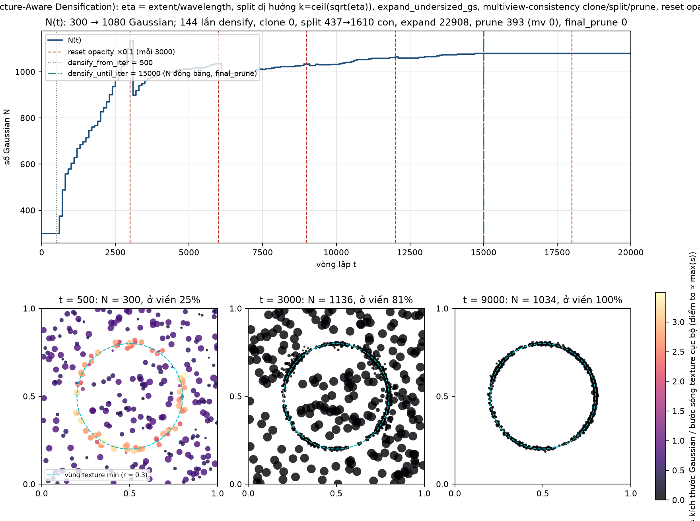

*Trên: $N(t)$ tăng theo bậc thang trong cửa sổ $500<t<15000$ rồi phẳng hoàn toàn sau
đó (không có cú tụt/lấp quanh mốc reset vì SADGS reset **nhân** chứ không dồn về một
sàn chung, và $\alpha$ bị chặn **trần** 0.8 chứ không chặn sàn). Dưới: 3 khung scatter
màu theo $\eta_{\max}$ (thay vì $\alpha$ như bản 3DGS gốc) — Gaussian tụ dày và có
$\eta$ cao quanh vòng tròn $r=0.3$ nơi texture mịn, trong khi vùng nền có $\eta$ thấp
dần do toy demo cho `expand_undersized_gs` nới rộng chúng (cơ chế này tắt trong
`train.py` thật, xem lưu ý đầu mục 10).*

(diễn giải thêm) Trong lúc canh chỉnh toy demo, một lỗi thời điểm ban đầu (áp dụng
reset opacity đúng tại $t=$`densify_until_iter`=15000 trước khi gọi
`final_prune_structgs` trong mô phỏng, khiến toàn bộ $\alpha$ bị nhân $0.1$ ngay
trước ngưỡng `min_opacity`=0.1 và xoá sạch $N$) minh hoạ đúng điểm nhấn mạnh ở mục 1:
việc SADGS loại trừ mốc `densify_until_iter` khỏi điều kiện reset **không phải chi
tiết vụn vặt** — bỏ sót nó làm sụp toàn bộ tập Gaussian ngay trước lần prune cuối
cùng (dù trong `train.py` thật bước "prune cuối" này không chạy).

---

## 11. Nguồn

- Công thức ở các mục 1–9 tóm tắt từ **SADGS** — *"Faster 3D Gaussian Splatting
  Convergence via Structure-Aware Densification"* (SIGGRAPH 2026) — theo mã nguồn
  trong thư mục `SADGS/` của repo này:
  - `scene/gaussian_model.py`: `densify_and_split_structgs`,
    `densify_and_clone_structgs`, `densify_and_prune_structgs`,
    `expand_undersized_gs`, `final_prune_structgs`, `densification_postfix`,
    `prune_points`, `add_densification_stats`;
  - `utils/freq_utils.py`: `update_freq_stats_online` (tính $\eta$ từ structure
    tensor, `TAU_HIGH`/`TAU_LOW`, hai chế độ `eta_compute_mode`);
  - `train.py`: khối `if iteration < opt.densify_until_iter` (tích luỹ thống kê,
    tính `high_ratio`/`low_ratio`, gọi `densify_and_prune_structgs` mỗi
    `densification_interval`, gọi `reset_opacity(opacity_reset_decay)` mỗi
    `opacity_reset_interval`);
  - `arguments/__init__.py`: giá trị mặc định của mọi hyperparameter ở mục 9.
- Khung lịch chạy (mục 1), vai trò `extent` (mục 3.1), và hình học split cơ bản (mục
  4) kế thừa trực tiếp từ 3DGS gốc (Kerbl et al. 2023) — phần này **không**
  phải phát minh của SADGS, được giữ lại để tài liệu tự chứa.
- Mọi đoạn đánh dấu **"(diễn giải thêm)"** là suy luận của tài liệu này từ việc đọc
  code, không phải phát biểu trực tiếp của tác giả gốc.
- Ví dụ số ở các mục 3.2, 4.4, 8 là ví dụ tự dựng để minh hoạ cách áp dụng công thức;
  số liệu mô phỏng ở mục 10 lấy từ `adc_3dgs_demo.py` (seed cố định = 0).
